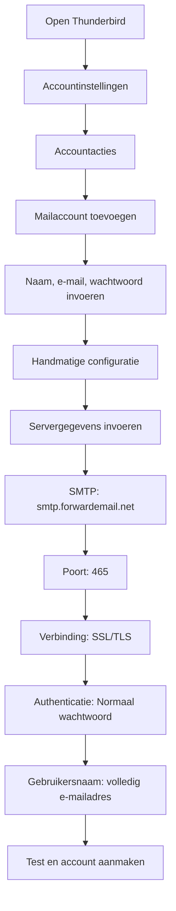

# SMTP Integratie Voorbeelden {#smtp-integration-examples}


## Inhoudsopgave {#table-of-contents}

* [Voorwoord](#foreword)
* [Hoe Forward Email's SMTP-verwerking werkt](#how-forward-emails-smtp-processing-works)
  * [E-mailwachtrij en Herprobeer Systeem](#email-queue-and-retry-system)
  * [Foolproof voor Betrouwbaarheid](#dummy-proofed-for-reliability)
* [Node.js Integratie](#nodejs-integration)
  * [Gebruik van Nodemailer](#using-nodemailer)
  * [Gebruik van Express.js](#using-expressjs)
* [Python Integratie](#python-integration)
  * [Gebruik van smtplib](#using-smtplib)
  * [Gebruik van Django](#using-django)
* [PHP Integratie](#php-integration)
  * [Gebruik van PHPMailer](#using-phpmailer)
  * [Gebruik van Laravel](#using-laravel)
* [Ruby Integratie](#ruby-integration)
  * [Gebruik van Ruby Mail Gem](#using-ruby-mail-gem)
* [Java Integratie](#java-integration)
  * [Gebruik van JavaMail API](#using-javamail-api)
* [E-mail Client Configuratie](#email-client-configuration)
  * [Thunderbird](#thunderbird)
  * [Apple Mail](#apple-mail)
  * [Gmail (Verstuur e-mail als)](#gmail-send-mail-as)
* [Probleemoplossing](#troubleshooting)
  * [Veelvoorkomende Problemen en Oplossingen](#common-issues-and-solutions)
  * [Hulp Krijgen](#getting-help)
* [Aanvullende Bronnen](#additional-resources)
* [Conclusie](#conclusion)


## Voorwoord {#foreword}

Deze gids biedt gedetailleerde voorbeelden van hoe te integreren met Forward Email's SMTP-service met behulp van verschillende programmeertalen, frameworks en e-mailclients. Onze SMTP-service is ontworpen om betrouwbaar, veilig en eenvoudig te integreren met uw bestaande applicaties.


## Hoe Forward Email's SMTP-verwerking werkt {#how-forward-emails-smtp-processing-works}

Voordat we ingaan op de integratievoorbeelden, is het belangrijk te begrijpen hoe onze SMTP-service e-mails verwerkt:

### E-mailwachtrij en Herprobeer Systeem {#email-queue-and-retry-system}

Wanneer u een e-mail via SMTP naar onze servers verzendt:

1. **Initiële Verwerking**: De e-mail wordt gevalideerd, gescand op malware en gecontroleerd op spamfilters
2. **Slimme Wachtrij**: E-mails worden geplaatst in een geavanceerd wachtrijsysteem voor aflevering
3. **Intelligent Herprobeer Mechanisme**: Als aflevering tijdelijk mislukt, zal ons systeem:
   * De foutmelding analyseren met onze `getBounceInfo` functie
   * Bepalen of het probleem tijdelijk is (bijv. "probeer later opnieuw", "tijdelijk uitgesteld") of permanent (bijv. "gebruiker onbekend")
   * Voor tijdelijke problemen, markeer de e-mail voor herproberen
   * Voor permanente problemen, genereer een bounce-melding
4. **5-Daagse Herproefperiode**: We proberen aflevering tot 5 dagen opnieuw (vergelijkbaar met industriestandaarden zoals Postfix), zodat tijdelijke problemen kunnen worden opgelost
5. **Afleveringsstatusmeldingen**: Afzenders ontvangen meldingen over de status van hun e-mails (afgeleverd, vertraagd of gebounced)

> \[!NOTE]
> Na succesvolle aflevering wordt de inhoud van uitgaande SMTP-e-mails na een configureerbare bewaartermijn (standaard 30 dagen) geredigeerd voor veiligheid en privacy. Alleen een tijdelijke melding blijft over die succesvolle aflevering aangeeft.

### Foolproof voor Betrouwbaarheid {#dummy-proofed-for-reliability}

Ons systeem is ontworpen om diverse randgevallen af te handelen:

* Als een blocklist wordt gedetecteerd, wordt de e-mail automatisch opnieuw geprobeerd
* Bij netwerkproblemen wordt aflevering opnieuw geprobeerd
* Als de mailbox van de ontvanger vol is, zal het systeem later opnieuw proberen
* Als de ontvangende server tijdelijk niet beschikbaar is, blijven we proberen

Deze aanpak verbetert de afleveringspercentages aanzienlijk terwijl privacy en veiligheid behouden blijven.


## Node.js Integratie {#nodejs-integration}

### Gebruik van Nodemailer {#using-nodemailer}

[Nodemailer](https://nodemailer.com/) is een populair module voor het verzenden van e-mails vanuit Node.js applicaties.

```javascript
const nodemailer = require('nodemailer');

// Create a transporter object
const transporter = nodemailer.createTransport({
  host: 'smtp.forwardemail.net',
  port: 465,
  secure: true, // Use TLS
  auth: {
    user: 'your-username@your-domain.com',
    pass: 'your-password'
  }
});

// Send mail with defined transport object
async function sendEmail() {
  try {
    const info = await transporter.sendMail({
      from: '"Your Name" <your-username@your-domain.com>',
      to: 'recipient@example.com',
      subject: 'Hello from Forward Email',
      text: 'Hello world! This is a test email sent using Nodemailer and Forward Email SMTP.',
      html: '<b>Hello world!</b> This is a test email sent using Nodemailer and Forward Email SMTP.'
    });

    console.log('Message sent: %s', info.messageId);
  } catch (error) {
    console.error('Error sending email:', error);
  }
}

sendEmail();
```
### Express.js gebruiken {#using-expressjs}

Hier leest u hoe u Forward Email SMTP integreert met een Express.js-applicatie:

```javascript
const express = require('express');
const nodemailer = require('nodemailer');
const app = express();
const port = 3000;

app.use(express.json());

// Configureer e-mailtransporter
const transporter = nodemailer.createTransport({
  host: 'smtp.forwardemail.net',
  port: 465,
  secure: true,
  auth: {
    user: 'your-username@your-domain.com',
    pass: 'your-password'
  }
});

// API-eindpunt voor het verzenden van e-mails
app.post('/send-email', async (req, res) => {
  const { to, subject, text, html } = req.body;

  try {
    const info = await transporter.sendMail({
      from: '"Your App" <your-username@your-domain.com>',
      to,
      subject,
      text,
      html
    });

    res.status(200).json({
      success: true,
      messageId: info.messageId
    });
  } catch (error) {
    console.error('Fout bij het verzenden van e-mail:', error);
    res.status(500).json({
      success: false,
      error: error.message
    });
  }
});

app.listen(port, () => {
  console.log(`Server draait op http://localhost:${port}`);
});
```


## Python-integratie {#python-integration}

### smtplib gebruiken {#using-smtplib}

```python
import smtplib
from email.mime.text import MIMEText
from email.mime.multipart import MIMEMultipart

# E-mailconfiguratie
sender_email = "your-username@your-domain.com"
receiver_email = "recipient@example.com"
password = "your-password"

# Bericht aanmaken
message = MIMEMultipart("alternative")
message["Subject"] = "Hallo van Forward Email"
message["From"] = sender_email
message["To"] = receiver_email

# Maak de platte-tekst en HTML-versie van je bericht
text = "Hallo wereld! Dit is een testmail verzonden met Python en Forward Email SMTP."
html = "<html><body><b>Hallo wereld!</b> Dit is een testmail verzonden met Python en Forward Email SMTP.</body></html>"

# Zet deze om in plain/html MIMEText-objecten
part1 = MIMEText(text, "plain")
part2 = MIMEText(html, "html")

# Voeg HTML/platte-tekst delen toe aan MIMEMultipart-bericht
message.attach(part1)
message.attach(part2)

# E-mail verzenden
try:
    server = smtplib.SMTP_SSL("smtp.forwardemail.net", 465)
    server.login(sender_email, password)
    server.sendmail(sender_email, receiver_email, message.as_string())
    server.quit()
    print("E-mail succesvol verzonden!")
except Exception as e:
    print(f"Fout bij het verzenden van e-mail: {e}")
```

### Django gebruiken {#using-django}

Voor Django-applicaties, voeg het volgende toe aan je `settings.py`:

```python
# E-mailinstellingen
EMAIL_BACKEND = 'django.core.mail.backends.smtp.EmailBackend'
EMAIL_HOST = 'smtp.forwardemail.net'
EMAIL_PORT = 465
EMAIL_USE_SSL = True
EMAIL_HOST_USER = 'your-username@your-domain.com'
EMAIL_HOST_PASSWORD = 'your-password'
DEFAULT_FROM_EMAIL = 'your-username@your-domain.com'
```

Verzend vervolgens e-mails in je views:

```python
from django.core.mail import send_mail

def send_email_view(request):
    send_mail(
        'Onderwerp hier',
        'Hier is het bericht.',
        'from@your-domain.com',
        ['to@example.com'],
        fail_silently=False,
        html_message='<b>Hier is het HTML-bericht.</b>'
    )
    return HttpResponse('E-mail verzonden!')
```


## PHP-integratie {#php-integration}

### PHPMailer gebruiken {#using-phpmailer}

```php
<?php
use PHPMailer\PHPMailer\PHPMailer;
use PHPMailer\PHPMailer\Exception;

require 'vendor/autoload.php';

$mail = new PHPMailer(true);

try {
    // Serverinstellingen
    $mail->isSMTP();
    $mail->Host       = 'smtp.forwardemail.net';
    $mail->SMTPAuth   = true;
    $mail->Username   = 'your-username@your-domain.com';
    $mail->Password   = 'your-password';
    $mail->SMTPSecure = PHPMailer::ENCRYPTION_SMTPS;
    $mail->Port       = 465;

    // Ontvangers
    $mail->setFrom('your-username@your-domain.com', 'Your Name');
    $mail->addAddress('recipient@example.com', 'Recipient Name');
    $mail->addReplyTo('your-username@your-domain.com', 'Your Name');

    // Inhoud
    $mail->isHTML(true);
    $mail->Subject = 'Hallo van Forward Email';
    $mail->Body    = '<b>Hallo wereld!</b> Dit is een testmail verzonden met PHPMailer en Forward Email SMTP.';
    $mail->AltBody = 'Hallo wereld! Dit is een testmail verzonden met PHPMailer en Forward Email SMTP.';

    $mail->send();
    echo 'Bericht is verzonden';
} catch (Exception $e) {
    echo "Bericht kon niet worden verzonden. Mailer-fout: {$mail->ErrorInfo}";
}
```
### Gebruik van Laravel {#using-laravel}

Voor Laravel-applicaties, werk je `.env` bestand bij:

```sh
MAIL_MAILER=smtp
MAIL_HOST=smtp.forwardemail.net
MAIL_PORT=465
MAIL_USERNAME=your-username@your-domain.com
MAIL_PASSWORD=your-password
MAIL_ENCRYPTION=ssl
MAIL_FROM_ADDRESS=your-username@your-domain.com
MAIL_FROM_NAME="${APP_NAME}"
```

Verstuur vervolgens e-mails met de Mail façade van Laravel:

```php
<?php

namespace App\Http\Controllers;

use Illuminate\Http\Request;
use Illuminate\Support\Facades\Mail;
use App\Mail\WelcomeEmail;

class EmailController extends Controller
{
    public function sendEmail()
    {
        Mail::to('recipient@example.com')->send(new WelcomeEmail());

        return 'E-mail succesvol verzonden!';
    }
}
```


## Ruby Integratie {#ruby-integration}

### Gebruik van Ruby Mail Gem {#using-ruby-mail-gem}

```ruby
require 'mail'

Mail.defaults do
  delivery_method :smtp, {
    address: 'smtp.forwardemail.net',
    port: 465,
    domain: 'your-domain.com',
    user_name: 'your-username@your-domain.com',
    password: 'your-password',
    authentication: 'plain',
    enable_starttls_auto: true,
    ssl: true
  }
end

mail = Mail.new do
  from     'your-username@your-domain.com'
  to       'recipient@example.com'
  subject  'Hallo van Forward Email'

  text_part do
    body 'Hallo wereld! Dit is een testmail verzonden met Ruby Mail en Forward Email SMTP.'
  end

  html_part do
    content_type 'text/html; charset=UTF-8'
    body '<b>Hallo wereld!</b> Dit is een testmail verzonden met Ruby Mail en Forward Email SMTP.'
  end
end

mail.deliver!
puts "E-mail succesvol verzonden!"
```


## Java Integratie {#java-integration}

### Gebruik van JavaMail API {#using-javamail-api}

```java
import java.util.Properties;
import javax.mail.*;
import javax.mail.internet.*;

public class SendEmail {
    public static void main(String[] args) {
        // E-mailadres en wachtwoord van afzender
        final String username = "your-username@your-domain.com";
        final String password = "your-password";

        // SMTP server eigenschappen
        Properties props = new Properties();
        props.put("mail.smtp.auth", "true");
        props.put("mail.smtp.starttls.enable", "true");
        props.put("mail.smtp.host", "smtp.forwardemail.net");
        props.put("mail.smtp.port", "465");
        props.put("mail.smtp.socketFactory.port", "465");
        props.put("mail.smtp.socketFactory.class", "javax.net.ssl.SSLSocketFactory");

        // Maak sessie aan met authenticator
        Session session = Session.getInstance(props,
            new javax.mail.Authenticator() {
                protected PasswordAuthentication getPasswordAuthentication() {
                    return new PasswordAuthentication(username, password);
                }
            });

        try {
            // Maak bericht aan
            Message message = new MimeMessage(session);
            message.setFrom(new InternetAddress(username));
            message.setRecipients(Message.RecipientType.TO, InternetAddress.parse("recipient@example.com"));
            message.setSubject("Hallo van Forward Email");

            // Maak multipart bericht
            Multipart multipart = new MimeMultipart("alternative");

            // Tekst gedeelte
            BodyPart textPart = new MimeBodyPart();
            textPart.setText("Hallo wereld! Dit is een testmail verzonden met JavaMail en Forward Email SMTP.");

            // HTML gedeelte
            BodyPart htmlPart = new MimeBodyPart();
            htmlPart.setContent("<b>Hallo wereld!</b> Dit is een testmail verzonden met JavaMail en Forward Email SMTP.", "text/html");

            // Voeg delen toe aan multipart
            multipart.addBodyPart(textPart);
            multipart.addBodyPart(htmlPart);

            // Stel inhoud in
            message.setContent(multipart);

            // Verstuur bericht
            Transport.send(message);

            System.out.println("E-mail succesvol verzonden!");

        } catch (MessagingException e) {
            throw new RuntimeException(e);
        }
    }
}
```


## E-mail Client Configuratie {#email-client-configuration}

### Thunderbird {#thunderbird}


```mermaid
flowchart TD
    A[Open Thunderbird] --> B[Accountinstellingen]
    B --> C[Accountacties]
    C --> D[Mailaccount toevoegen]
    D --> E[Naam, e-mail, wachtwoord invoeren]
    E --> F[Handmatige configuratie]
    F --> G[Servergegevens invoeren]
    G --> H[SMTP: smtp.forwardemail.net]
    H --> I[Poort: 465]
    I --> J[Verbinding: SSL/TLS]
    J --> K[Authenticatie: Normaal wachtwoord]
    K --> L[Gebruikersnaam: volledig e-mailadres]
    L --> M[Test en account aanmaken]
```
1. Open Thunderbird en ga naar Accountinstellingen  
2. Klik op "Accountacties" en selecteer "Mailaccount toevoegen"  
3. Voer je naam, e-mailadres en wachtwoord in  
4. Klik op "Handmatige configuratie" en voer de volgende gegevens in:  
   * Binnenkomende server:  
     * IMAP: imap.forwardemail.net, Poort: 993, SSL/TLS  
     * POP3: pop3.forwardemail.net, Poort: 995, SSL/TLS  
   * Uitgaande server (SMTP): smtp.forwardemail.net, Poort: 465, SSL/TLS  
   * Authenticatie: Normaal wachtwoord  
   * Gebruikersnaam: je volledige e-mailadres  
5. Klik op "Test" en daarna op "Gereed"  

### Apple Mail {#apple-mail}

1. Open Mail en ga naar Mail > Voorkeuren > Accounts  
2. Klik op de "+" knop om een nieuw account toe te voegen  
3. Selecteer "Ander mailaccount" en klik op "Ga door"  
4. Voer je naam, e-mailadres en wachtwoord in en klik op "Log in"  
5. Wanneer automatische configuratie mislukt, voer dan de volgende gegevens in:  
   * Binnenkomende mailserver: imap.forwardemail.net (of pop3.forwardemail.net voor POP3)  
   * Uitgaande mailserver: smtp.forwardemail.net  
   * Gebruikersnaam: je volledige e-mailadres  
   * Wachtwoord: je wachtwoord  
6. Klik op "Log in" om de configuratie te voltooien  

### Gmail (Verzenden als) {#gmail-send-mail-as}

1. Open Gmail en ga naar Instellingen > Accounts en import  
2. Onder "Verzenden als" klik je op "Een ander e-mailadres toevoegen"  
3. Voer je naam en e-mailadres in en klik op "Volgende stap"  
4. Voer de volgende SMTP-servergegevens in:  
   * SMTP-server: smtp.forwardemail.net  
   * Poort: 465  
   * Gebruikersnaam: je volledige e-mailadres  
   * Wachtwoord: je wachtwoord  
   * Selecteer "Beveiligde verbinding met SSL"  
5. Klik op "Account toevoegen" en verifieer je e-mailadres  

## Problemen oplossen {#troubleshooting}

### Veelvoorkomende problemen en oplossingen {#common-issues-and-solutions}

1. **Authenticatie mislukt**  
   * Controleer je gebruikersnaam (volledig e-mailadres) en wachtwoord  
   * Zorg dat je de juiste poort gebruikt (465 voor SSL/TLS)  
   * Controleer of SMTP-toegang voor je account is ingeschakeld  

2. **Verbindingstime-out**  
   * Controleer je internetverbinding  
   * Controleer of firewall-instellingen SMTP-verkeer niet blokkeren  
   * Probeer poort 465 met SSL/TLS (aanbevolen) of poort 587 met STARTTLS  

3. **Bericht geweigerd**  
   * Zorg dat je "Van"-adres overeenkomt met je geauthenticeerde e-mail  
   * Controleer of je IP-adres niet op een zwarte lijst staat  
   * Controleer of de inhoud van je bericht geen spamfilters activeert  

4. **TLS/SSL-fouten**  
   * Werk je applicatie/bibliotheek bij om moderne TLS-versies te ondersteunen  
   * Zorg dat de CA-certificaten van je systeem up-to-date zijn  
   * Probeer expliciete TLS in plaats van impliciete TLS  

### Hulp krijgen {#getting-help}

Als je problemen ondervindt die hier niet worden behandeld, doe dan het volgende:  

1. Bekijk onze [FAQ-pagina](/faq) voor veelgestelde vragen  
2. Lees onze [blogpost over e-mailbezorging](/blog/docs/best-email-forwarding-service) voor gedetailleerde informatie  
3. Neem contact op met ons ondersteuningsteam via <support@forwardemail.net>  

## Aanvullende bronnen {#additional-resources}

* [Forward Email Documentatie](/docs)  
* [SMTP-serverlimieten en configuratie](/faq#what-are-your-outbound-smtp-limits)  
* [Gids voor beste e-mailpraktijken](/blog/docs/best-email-forwarding-service)  
* [Beveiligingspraktijken](/security)  

## Conclusie {#conclusion}

De SMTP-service van Forward Email biedt een betrouwbare, veilige en privacygerichte manier om e-mails te verzenden vanuit je applicaties en e-mailclients. Met ons intelligente wachtrijsysteem, een retry-mechanisme van 5 dagen en uitgebreide bezorgstatusmeldingen kun je erop vertrouwen dat je e-mails hun bestemming bereiken.  

Voor meer geavanceerde toepassingen of aangepaste integraties kun je contact opnemen met ons ondersteuningsteam.
