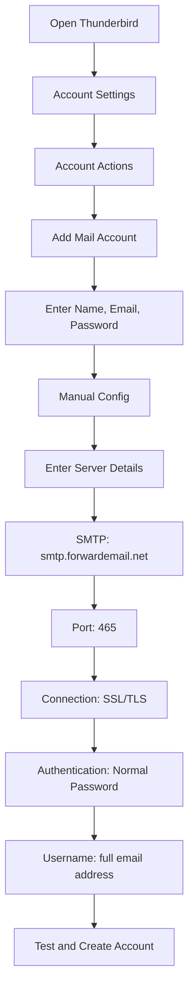

# Eksempler på SMTP-integrasjon {#smtp-integration-examples}

## Innholdsfortegnelse {#table-of-contents}

* [Forord](#foreword)
* [Hvordan SMTP-behandling av videresendt e-post fungerer](#how-forward-emails-smtp-processing-works)
  * [E-postkø og nytt forsøkssystem](#email-queue-and-retry-system)
  * [Dummy-proofed for pålitelighet](#dummy-proofed-for-reliability)
* [Node.js-integrasjon](#nodejs-integration)
  * [Bruk av Nodemailer](#using-nodemailer)
  * [Bruk av Express.js](#using-expressjs)
* [Python-integrasjon](#python-integration)
  * [Bruk av smtplib](#using-smtplib)
  * [Bruk av Django](#using-django)
* [PHP-integrasjon](#php-integration)
  * [Bruk av PHPMailer](#using-phpmailer)
  * [Bruk av Laravel](#using-laravel)
* [Ruby-integrasjon](#ruby-integration)
  * [Bruk av Ruby Mail Gem](#using-ruby-mail-gem)
* [Java-integrasjon](#java-integration)
  * [Bruke Java Mail API-et](#using-javamail-api)
* [Konfigurasjon av e-postklient](#email-client-configuration)
  * [Thunderbird](#thunderbird)
  * [Apple Mail](#apple-mail)
  * [Gmail (Send e-post som)](#gmail-send-mail-as)
* [Feilsøking](#troubleshooting)
  * [Vanlige problemer og løsninger](#common-issues-and-solutions)
  * [Få hjelp](#getting-help)
* [Ytterligere ressurser](#additional-resources)
* [Konklusjon](#conclusion)

## Forord {#foreword}

Denne veiledningen gir detaljerte eksempler på hvordan du integrerer med SMTP-tjenesten i Forward Email ved hjelp av ulike programmeringsspråk, rammeverk og e-postklienter. SMTP-tjenesten vår er utviklet for å være pålitelig, sikker og enkel å integrere med eksisterende applikasjoner.

## Slik fungerer SMTP-behandlingen av videresending av e-post {#how-forward-emails-smtp-processing-works}

Før vi dykker ned i integrasjonseksemplene, er det viktig å forstå hvordan SMTP-tjenesten vår behandler e-poster:

### E-postkø og nytt system {#email-queue-and-retry-system}

Når du sender en e-post via SMTP til serverne våre:

1. **Initial behandling**: E-posten valideres, skannes for skadelig programvare og kontrolleres mot spamfiltre
2. **Smart køstyring**: E-poster plasseres i et sofistikert køsystem for levering
3. **Intelligent gjentakelsesmekanisme**: Hvis leveringen mislykkes midlertidig, vil systemet vårt:
* Analysere feilresponsen ved hjelp av `getBounceInfo`-funksjonen vår
* Avgjøre om problemet er midlertidig (f.eks. "prøv igjen senere", "midlertidig utsatt") eller permanent (f.eks. "bruker ukjent")
* Ved midlertidige problemer, merk e-posten for nytt forsøk
* Ved permanente problemer, generer et varsel om avvisning
4. **5-dagers gjentakelsesperiode**: Vi prøver levering på nytt i opptil 5 dager (ligner på bransjestandarder som Postfix), noe som gir midlertidige problemer tid til å løse
5. **Varsler om leveringsstatus**: Avsendere mottar varsler om statusen til e-postene sine (levert, forsinket eller avvist)

> \[!NOTE]
> Etter vellykket levering redigeres innholdet i utgående SMTP-e-post etter en konfigurerbar oppbevaringsperiode (standard 30 dager) av sikkerhets- og personvernhensyn. Bare en midlertidig melding som indikerer vellykket levering gjenstår.

### Dummy-sikker for pålitelighet {#dummy-proofed-for-reliability}

Systemet vårt er utviklet for å håndtere ulike kanttilfeller:

* Hvis en blokkeringsliste oppdages, vil e-posten automatisk bli forsøkt levert på nytt.
* Hvis det oppstår nettverksproblemer, vil leveringsforsøket bli gjort på nytt.
* Hvis mottakerens postkasse er full, vil systemet prøve på nytt senere.
* Hvis mottakerserveren midlertidig er utilgjengelig, vil vi fortsette å prøve.

Denne tilnærmingen forbedrer leveringsratene betydelig, samtidig som den ivaretar personvern og sikkerhet.

## Node.js-integrasjon {#nodejs-integration}

### Bruker Nodemailer {#using-nodemailer}

[Nodemailer](https://nodemailer.com/) er en populær modul for å sende e-poster fra Node.js-applikasjoner.

```javascript
const nodemailer = require('nodemailer');

// Create a transporter object
const transporter = nodemailer.createTransport({
  host: 'smtp.forwardemail.net',
  port: 465,
  secure: true, // Use TLS
  auth: {
    user: 'your-username@your-domain.com',
    pass: 'your-password'
  }
});

// Send mail with defined transport object
async function sendEmail() {
  try {
    const info = await transporter.sendMail({
      from: '"Your Name" <your-username@your-domain.com>',
      to: 'recipient@example.com',
      subject: 'Hello from Forward Email',
      text: 'Hello world! This is a test email sent using Nodemailer and Forward Email SMTP.',
      html: '<b>Hello world!</b> This is a test email sent using Nodemailer and Forward Email SMTP.'
    });

    console.log('Message sent: %s', info.messageId);
  } catch (error) {
    console.error('Error sending email:', error);
  }
}

sendEmail();
```

### Bruker Express.js {#using-expressjs}

Slik integrerer du Videresend e-post SMTP med et Express.js-program:

```javascript
const express = require('express');
const nodemailer = require('nodemailer');
const app = express();
const port = 3000;

app.use(express.json());

// Configure email transporter
const transporter = nodemailer.createTransport({
  host: 'smtp.forwardemail.net',
  port: 465,
  secure: true,
  auth: {
    user: 'your-username@your-domain.com',
    pass: 'your-password'
  }
});

// API endpoint for sending emails
app.post('/send-email', async (req, res) => {
  const { to, subject, text, html } = req.body;

  try {
    const info = await transporter.sendMail({
      from: '"Your App" <your-username@your-domain.com>',
      to,
      subject,
      text,
      html
    });

    res.status(200).json({
      success: true,
      messageId: info.messageId
    });
  } catch (error) {
    console.error('Error sending email:', error);
    res.status(500).json({
      success: false,
      error: error.message
    });
  }
});

app.listen(port, () => {
  console.log(`Server running at http://localhost:${port}`);
});
```

## Python-integrasjon {#python-integration}

### Bruker smtplib {#using-smtplib}

```python
import smtplib
from email.mime.text import MIMEText
from email.mime.multipart import MIMEMultipart

# Email configuration
sender_email = "your-username@your-domain.com"
receiver_email = "recipient@example.com"
password = "your-password"

# Create message
message = MIMEMultipart("alternative")
message["Subject"] = "Hello from Forward Email"
message["From"] = sender_email
message["To"] = receiver_email

# Create the plain-text and HTML version of your message
text = "Hello world! This is a test email sent using Python and Forward Email SMTP."
html = "<html><body><b>Hello world!</b> This is a test email sent using Python and Forward Email SMTP.</body></html>"

# Turn these into plain/html MIMEText objects
part1 = MIMEText(text, "plain")
part2 = MIMEText(html, "html")

# Add HTML/plain-text parts to MIMEMultipart message
message.attach(part1)
message.attach(part2)

# Send email
try:
    server = smtplib.SMTP_SSL("smtp.forwardemail.net", 465)
    server.login(sender_email, password)
    server.sendmail(sender_email, receiver_email, message.as_string())
    server.quit()
    print("Email sent successfully!")
except Exception as e:
    print(f"Error sending email: {e}")
```

### Bruker Django {#using-django}

For Django-applikasjoner, legg til følgende i `settings.py`:

```python
# Email settings
EMAIL_BACKEND = 'django.core.mail.backends.smtp.EmailBackend'
EMAIL_HOST = 'smtp.forwardemail.net'
EMAIL_PORT = 465
EMAIL_USE_SSL = True
EMAIL_HOST_USER = 'your-username@your-domain.com'
EMAIL_HOST_PASSWORD = 'your-password'
DEFAULT_FROM_EMAIL = 'your-username@your-domain.com'
```

Send deretter e-poster i visningene dine:

```python
from django.core.mail import send_mail

def send_email_view(request):
    send_mail(
        'Subject here',
        'Here is the message.',
        'from@your-domain.com',
        ['to@example.com'],
        fail_silently=False,
        html_message='<b>Here is the HTML message.</b>'
    )
    return HttpResponse('Email sent!')
```

## PHP-integrasjon {#php-integration}

### Bruker PHPMailer {#using-phpmailer}

```php
<?php
use PHPMailer\PHPMailer\PHPMailer;
use PHPMailer\PHPMailer\Exception;

require 'vendor/autoload.php';

$mail = new PHPMailer(true);

try {
    // Server settings
    $mail->isSMTP();
    $mail->Host       = 'smtp.forwardemail.net';
    $mail->SMTPAuth   = true;
    $mail->Username   = 'your-username@your-domain.com';
    $mail->Password   = 'your-password';
    $mail->SMTPSecure = PHPMailer::ENCRYPTION_SMTPS;
    $mail->Port       = 465;

    // Recipients
    $mail->setFrom('your-username@your-domain.com', 'Your Name');
    $mail->addAddress('recipient@example.com', 'Recipient Name');
    $mail->addReplyTo('your-username@your-domain.com', 'Your Name');

    // Content
    $mail->isHTML(true);
    $mail->Subject = 'Hello from Forward Email';
    $mail->Body    = '<b>Hello world!</b> This is a test email sent using PHPMailer and Forward Email SMTP.';
    $mail->AltBody = 'Hello world! This is a test email sent using PHPMailer and Forward Email SMTP.';

    $mail->send();
    echo 'Message has been sent';
} catch (Exception $e) {
    echo "Message could not be sent. Mailer Error: {$mail->ErrorInfo}";
}
```

### Bruker Laravel {#using-laravel}

For Laravel-applikasjoner, oppdater `.env`-filen din:

```sh
MAIL_MAILER=smtp
MAIL_HOST=smtp.forwardemail.net
MAIL_PORT=465
MAIL_USERNAME=your-username@your-domain.com
MAIL_PASSWORD=your-password
MAIL_ENCRYPTION=ssl
MAIL_FROM_ADDRESS=your-username@your-domain.com
MAIL_FROM_NAME="${APP_NAME}"
```

Send deretter e-poster ved hjelp av Laravels Mail-fasade:

```php
<?php

namespace App\Http\Controllers;

use Illuminate\Http\Request;
use Illuminate\Support\Facades\Mail;
use App\Mail\WelcomeEmail;

class EmailController extends Controller
{
    public function sendEmail()
    {
        Mail::to('recipient@example.com')->send(new WelcomeEmail());

        return 'Email sent successfully!';
    }
}
```

## Ruby-integrasjon {#ruby-integration}

### Bruker Ruby Mail Gem {#using-ruby-mail-gem}

```ruby
require 'mail'

Mail.defaults do
  delivery_method :smtp, {
    address: 'smtp.forwardemail.net',
    port: 465,
    domain: 'your-domain.com',
    user_name: 'your-username@your-domain.com',
    password: 'your-password',
    authentication: 'plain',
    enable_starttls_auto: true,
    ssl: true
  }
end

mail = Mail.new do
  from     'your-username@your-domain.com'
  to       'recipient@example.com'
  subject  'Hello from Forward Email'

  text_part do
    body 'Hello world! This is a test email sent using Ruby Mail and Forward Email SMTP.'
  end

  html_part do
    content_type 'text/html; charset=UTF-8'
    body '<b>Hello world!</b> This is a test email sent using Ruby Mail and Forward Email SMTP.'
  end
end

mail.deliver!
puts "Email sent successfully!"
```

## Java-integrasjon {#java-integration}

### Bruker JavaMail API {#using-javamail-api}

```java
import java.util.Properties;
import javax.mail.*;
import javax.mail.internet.*;

public class SendEmail {
    public static void main(String[] args) {
        // Sender's email and password
        final String username = "your-username@your-domain.com";
        final String password = "your-password";

        // SMTP server properties
        Properties props = new Properties();
        props.put("mail.smtp.auth", "true");
        props.put("mail.smtp.starttls.enable", "true");
        props.put("mail.smtp.host", "smtp.forwardemail.net");
        props.put("mail.smtp.port", "465");
        props.put("mail.smtp.socketFactory.port", "465");
        props.put("mail.smtp.socketFactory.class", "javax.net.ssl.SSLSocketFactory");

        // Create session with authenticator
        Session session = Session.getInstance(props,
            new javax.mail.Authenticator() {
                protected PasswordAuthentication getPasswordAuthentication() {
                    return new PasswordAuthentication(username, password);
                }
            });

        try {
            // Create message
            Message message = new MimeMessage(session);
            message.setFrom(new InternetAddress(username));
            message.setRecipients(Message.RecipientType.TO, InternetAddress.parse("recipient@example.com"));
            message.setSubject("Hello from Forward Email");

            // Create multipart message
            Multipart multipart = new MimeMultipart("alternative");

            // Text part
            BodyPart textPart = new MimeBodyPart();
            textPart.setText("Hello world! This is a test email sent using JavaMail and Forward Email SMTP.");

            // HTML part
            BodyPart htmlPart = new MimeBodyPart();
            htmlPart.setContent("<b>Hello world!</b> This is a test email sent using JavaMail and Forward Email SMTP.", "text/html");

            // Add parts to multipart
            multipart.addBodyPart(textPart);
            multipart.addBodyPart(htmlPart);

            // Set content
            message.setContent(multipart);

            // Send message
            Transport.send(message);

            System.out.println("Email sent successfully!");

        } catch (MessagingException e) {
            throw new RuntimeException(e);
        }
    }
}
```

## Konfigurasjon av e-postklient {#email-client-configuration}

### Thunderbird {#thunderbird}



1. Åpne Thunderbird og gå til Kontoinnstillinger.
2. Klikk på «Kontohandlinger» og velg «Legg til e-postkonto».
3. Skriv inn navn, e-postadresse og passord.
4. Klikk på «Manuell konfigurasjon» og skriv inn følgende detaljer:
* Innkommende server:
* IMAP: imap.forwardemail.net, Port: 993, SSL/TLS
* POP3: pop3.forwardemail.net, Port: 995, SSL/TLS
* Utgående server (SMTP): smtp.forwardemail.net, Port: 465, SSL/TLS
* Autentisering: Vanlig passord
* Brukernavn: din fullstendige e-postadresse.
5. Klikk på «Test» og deretter på «Ferdig».

### Apple Mail {#apple-mail}

1. Åpne Mail og gå til Mail > Innstillinger > Kontoer
2. Klikk på «+»-knappen for å legge til en ny konto
3. Velg «Annen e-postkonto» og klikk på «Fortsett»
4. Skriv inn navn, e-postadresse og passord, og klikk deretter på «Logg på»
5. Når automatisk oppsett mislykkes, skriver du inn følgende detaljer:
* Innkommende e-postserver: imap.forwardemail.net (eller pop3.forwardemail.net for POP3)
* Utgående e-postserver: smtp.forwardemail.net
* Brukernavn: din fullstendige e-postadresse
* Passord: ditt passord
6. Klikk på «Logg på» for å fullføre oppsettet

### Gmail (Send e-post som) {#gmail-send-mail-as}

1. Åpne Gmail og gå til Innstillinger > Kontoer og import.
2. Under «Send e-post som» klikker du på «Legg til en annen e-postadresse».
3. Skriv inn navn og e-postadresse, og klikk deretter på «Neste trinn».
4. Skriv inn følgende SMTP-serverdetaljer:
* SMTP-server: smtp.forwardemail.net
* Port: 465
* Brukernavn: din fullstendige e-postadresse
* Passord: passordet ditt
* Velg «Sikker tilkobling med SSL».
5. Klikk på «Legg til konto» og bekreft e-postadressen din.

## Feilsøking {#troubleshooting}

### Vanlige problemer og løsninger {#common-issues-and-solutions}

1. **Autentisering mislyktes**
* Bekreft brukernavn (fullstendig e-postadresse) og passord
* Sørg for at du bruker riktig port (465 for SSL/TLS)
* Sjekk om kontoen din har SMTP-tilgang aktivert

2. **Tidsavbrudd for tilkobling**
* Sjekk internettforbindelsen din
* Bekreft at brannmurinnstillingene ikke blokkerer SMTP-trafikk
* Prøv å bruke en annen port (587 med STARTTLS)

3. **Melding avvist**
* Sørg for at «Fra»-adressen din samsvarer med den autentiserte e-postadressen din.
* Sjekk om IP-adressen din er svartelistet.
* Bekreft at meldingsinnholdet ikke utløser spamfiltre.

4. **TLS/SSL-feil**
* Oppdater applikasjonen/biblioteket ditt for å støtte moderne TLS-versjoner
* Sørg for at systemets CA-sertifikater er oppdaterte
* Prøv eksplisitt TLS i stedet for implisitt TLS

### Få hjelp {#getting-help}

Hvis du støter på problemer som ikke er dekket her, vennligst:

1. Sjekk vår [FAQ-side](/faq) for vanlige spørsmål
2. Se vår [blogginnlegg om e-postlevering](/blog/docs/best-email-forwarding-service) for detaljert informasjon
3. Kontakt supportteamet vårt på <support@forwardemail.net>

## Ytterligere ressurser {#additional-resources}

* [Dokumentasjon for videresending av e-post](/docs)
* [SMTP-servergrenser og -konfigurasjon](/faq#what-are-your-outbound-smtp-limits)
* [Veiledning for beste praksis for e-post](/blog/docs/best-email-forwarding-service)
* [Sikkerhetspraksis](/security)

## Konklusjon {#conclusion}

SMTP-tjenesten i Forward Email gir en pålitelig, sikker og personvernfokusert måte å sende e-post fra applikasjonene og e-postklientene dine. Med vårt intelligente køsystem, 5-dagers mekanisme for nye forsøk og omfattende varsler om leveringsstatus, kan du være trygg på at e-postene dine kommer frem til destinasjonen.

For mer avanserte brukstilfeller eller tilpassede integrasjoner, vennligst kontakt vårt supportteam.