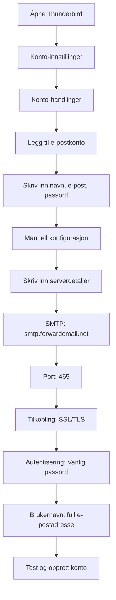

# SMTP-integrasjonseksempler {#smtp-integration-examples}


## Innholdsfortegnelse {#table-of-contents}

* [Forord](#foreword)
* [Hvordan Forward Emails SMTP-behandling fungerer](#how-forward-emails-smtp-processing-works)
  * [E-postkø og retry-system](#email-queue-and-retry-system)
  * [Brukervennlig for pålitelighet](#dummy-proofed-for-reliability)
* [Node.js-integrasjon](#nodejs-integration)
  * [Bruke Nodemailer](#using-nodemailer)
  * [Bruke Express.js](#using-expressjs)
* [Python-integrasjon](#python-integration)
  * [Bruke smtplib](#using-smtplib)
  * [Bruke Django](#using-django)
* [PHP-integrasjon](#php-integration)
  * [Bruke PHPMailer](#using-phpmailer)
  * [Bruke Laravel](#using-laravel)
* [Ruby-integrasjon](#ruby-integration)
  * [Bruke Ruby Mail Gem](#using-ruby-mail-gem)
* [Java-integrasjon](#java-integration)
  * [Bruke JavaMail API](#using-javamail-api)
* [E-postklientkonfigurasjon](#email-client-configuration)
  * [Thunderbird](#thunderbird)
  * [Apple Mail](#apple-mail)
  * [Gmail (Send mail som)](#gmail-send-mail-as)
* [Feilsøking](#troubleshooting)
  * [Vanlige problemer og løsninger](#common-issues-and-solutions)
  * [Få hjelp](#getting-help)
* [Ytterligere ressurser](#additional-resources)
* [Konklusjon](#conclusion)


## Forord {#foreword}

Denne guiden gir detaljerte eksempler på hvordan du kan integrere med Forward Emails SMTP-tjeneste ved bruk av ulike programmeringsspråk, rammeverk og e-postklienter. Vår SMTP-tjeneste er designet for å være pålitelig, sikker og enkel å integrere med dine eksisterende applikasjoner.


## Hvordan Forward Emails SMTP-behandling fungerer {#how-forward-emails-smtp-processing-works}

Før vi går inn på integrasjonseksemplene, er det viktig å forstå hvordan vår SMTP-tjeneste behandler e-poster:

### E-postkø og retry-system {#email-queue-and-retry-system}

Når du sender en e-post via SMTP til våre servere:

1. **Innledende behandling**: E-posten valideres, skannes for skadelig programvare og sjekkes mot spamfiltre
2. **Smart køsystem**: E-poster plasseres i et avansert køsystem for levering
3. **Intelligent retry-mekanisme**: Hvis leveringen midlertidig feiler, vil systemet vårt:
   * Analysere feilmeldingen ved hjelp av vår `getBounceInfo`-funksjon
   * Bestemme om problemet er midlertidig (f.eks. "prøv igjen senere", "midlertidig utsatt") eller permanent (f.eks. "ukjent bruker")
   * For midlertidige problemer, merke e-posten for ny forsøk
   * For permanente problemer, generere en bounce-melding
4. **5-dagers retry-periode**: Vi prøver å levere i opptil 5 dager (likt bransjestandarder som Postfix), for å gi midlertidige problemer tid til å løse seg
5. **Leveringsstatusvarsler**: Avsendere mottar varsler om status på e-postene sine (levert, forsinket eller bounced)

> \[!NOTE]
> Etter vellykket levering blir innholdet i utgående SMTP-e-post redigert bort etter en konfigurerbar lagringsperiode (standard 30 dager) for sikkerhet og personvern. Kun en plassholdermelding gjenstår som indikerer vellykket levering.

### Brukervennlig for pålitelighet {#dummy-proofed-for-reliability}

Systemet vårt er designet for å håndtere ulike kanttilfeller:

* Hvis en blokkering oppdages, vil e-posten automatisk bli forsøkt sendt på nytt
* Hvis nettverksproblemer oppstår, vil leveringen bli forsøkt igjen
* Hvis mottakerens postboks er full, vil systemet prøve igjen senere
* Hvis mottakende server midlertidig er utilgjengelig, vil vi fortsette å prøve

Denne tilnærmingen forbedrer leveringsraten betydelig samtidig som personvern og sikkerhet opprettholdes.


## Node.js-integrasjon {#nodejs-integration}

### Bruke Nodemailer {#using-nodemailer}

[Nodemailer](https://nodemailer.com/) er en populær modul for å sende e-post fra Node.js-applikasjoner.

```javascript
const nodemailer = require('nodemailer');

// Opprett en transporter-objekt
const transporter = nodemailer.createTransport({
  host: 'smtp.forwardemail.net',
  port: 465,
  secure: true, // Bruk TLS
  auth: {
    user: 'your-username@your-domain.com',
    pass: 'your-password'
  }
});

// Send e-post med definert transportobjekt
async function sendEmail() {
  try {
    const info = await transporter.sendMail({
      from: '"Ditt navn" <your-username@your-domain.com>',
      to: 'recipient@example.com',
      subject: 'Hei fra Forward Email',
      text: 'Hei verden! Dette er en test-e-post sendt med Nodemailer og Forward Email SMTP.',
      html: '<b>Hei verden!</b> Dette er en test-e-post sendt med Nodemailer og Forward Email SMTP.'
    });

    console.log('Melding sendt: %s', info.messageId);
  } catch (error) {
    console.error('Feil ved sending av e-post:', error);
  }
}

sendEmail();
```
### Using Express.js {#using-expressjs}

Her er hvordan du integrerer Forward Email SMTP med en Express.js-applikasjon:

```javascript
const express = require('express');
const nodemailer = require('nodemailer');
const app = express();
const port = 3000;

app.use(express.json());

// Configure email transporter
const transporter = nodemailer.createTransport({
  host: 'smtp.forwardemail.net',
  port: 465,
  secure: true,
  auth: {
    user: 'your-username@your-domain.com',
    pass: 'your-password'
  }
});

// API endpoint for sending emails
app.post('/send-email', async (req, res) => {
  const { to, subject, text, html } = req.body;

  try {
    const info = await transporter.sendMail({
      from: '"Your App" <your-username@your-domain.com>',
      to,
      subject,
      text,
      html
    });

    res.status(200).json({
      success: true,
      messageId: info.messageId
    });
  } catch (error) {
    console.error('Error sending email:', error);
    res.status(500).json({
      success: false,
      error: error.message
    });
  }
});

app.listen(port, () => {
  console.log(`Server running at http://localhost:${port}`);
});
```


## Python Integration {#python-integration}

### Using smtplib {#using-smtplib}

```python
import smtplib
from email.mime.text import MIMEText
from email.mime.multipart import MIMEMultipart

# Email configuration
sender_email = "your-username@your-domain.com"
receiver_email = "recipient@example.com"
password = "your-password"

# Create message
message = MIMEMultipart("alternative")
message["Subject"] = "Hello from Forward Email"
message["From"] = sender_email
message["To"] = receiver_email

# Create the plain-text and HTML version of your message
text = "Hello world! This is a test email sent using Python and Forward Email SMTP."
html = "<html><body><b>Hello world!</b> This is a test email sent using Python and Forward Email SMTP.</body></html>"

# Turn these into plain/html MIMEText objects
part1 = MIMEText(text, "plain")
part2 = MIMEText(html, "html")

# Add HTML/plain-text parts to MIMEMultipart message
message.attach(part1)
message.attach(part2)

# Send email
try:
    server = smtplib.SMTP_SSL("smtp.forwardemail.net", 465)
    server.login(sender_email, password)
    server.sendmail(sender_email, receiver_email, message.as_string())
    server.quit()
    print("Email sent successfully!")
except Exception as e:
    print(f"Error sending email: {e}")
```

### Using Django {#using-django}

For Django-applikasjoner, legg til følgende i din `settings.py`:

```python
# Email settings
EMAIL_BACKEND = 'django.core.mail.backends.smtp.EmailBackend'
EMAIL_HOST = 'smtp.forwardemail.net'
EMAIL_PORT = 465
EMAIL_USE_SSL = True
EMAIL_HOST_USER = 'your-username@your-domain.com'
EMAIL_HOST_PASSWORD = 'your-password'
DEFAULT_FROM_EMAIL = 'your-username@your-domain.com'
```

Deretter sender du e-poster i dine views:

```python
from django.core.mail import send_mail

def send_email_view(request):
    send_mail(
        'Emne her',
        'Her er meldingen.',
        'from@your-domain.com',
        ['to@example.com'],
        fail_silently=False,
        html_message='<b>Her er HTML-meldingen.</b>'
    )
    return HttpResponse('E-post sendt!')
```


## PHP Integration {#php-integration}

### Using PHPMailer {#using-phpmailer}

```php
<?php
use PHPMailer\PHPMailer\PHPMailer;
use PHPMailer\PHPMailer\Exception;

require 'vendor/autoload.php';

$mail = new PHPMailer(true);

try {
    // Server settings
    $mail->isSMTP();
    $mail->Host       = 'smtp.forwardemail.net';
    $mail->SMTPAuth   = true;
    $mail->Username   = 'your-username@your-domain.com';
    $mail->Password   = 'your-password';
    $mail->SMTPSecure = PHPMailer::ENCRYPTION_SMTPS;
    $mail->Port       = 465;

    // Recipients
    $mail->setFrom('your-username@your-domain.com', 'Ditt navn');
    $mail->addAddress('recipient@example.com', 'Mottakers navn');
    $mail->addReplyTo('your-username@your-domain.com', 'Ditt navn');

    // Content
    $mail->isHTML(true);
    $mail->Subject = 'Hello from Forward Email';
    $mail->Body    = '<b>Hello world!</b> This is a test email sent using PHPMailer and Forward Email SMTP.';
    $mail->AltBody = 'Hello world! This is a test email sent using PHPMailer and Forward Email SMTP.';

    $mail->send();
    echo 'Meldingen har blitt sendt';
} catch (Exception $e) {
    echo "Meldingen kunne ikke sendes. Mailer Error: {$mail->ErrorInfo}";
}
```
### Bruke Laravel {#using-laravel}

For Laravel-applikasjoner, oppdater `.env`-filen din:

```sh
MAIL_MAILER=smtp
MAIL_HOST=smtp.forwardemail.net
MAIL_PORT=465
MAIL_USERNAME=your-username@your-domain.com
MAIL_PASSWORD=your-password
MAIL_ENCRYPTION=ssl
MAIL_FROM_ADDRESS=your-username@your-domain.com
MAIL_FROM_NAME="${APP_NAME}"
```

Deretter sender du e-poster ved å bruke Laravels Mail-fasade:

```php
<?php

namespace App\Http\Controllers;

use Illuminate\Http\Request;
use Illuminate\Support\Facades\Mail;
use App\Mail\WelcomeEmail;

class EmailController extends Controller
{
    public function sendEmail()
    {
        Mail::to('recipient@example.com')->send(new WelcomeEmail());

        return 'E-post sendt vellykket!';
    }
}
```


## Ruby-integrasjon {#ruby-integration}

### Bruke Ruby Mail Gem {#using-ruby-mail-gem}

```ruby
require 'mail'

Mail.defaults do
  delivery_method :smtp, {
    address: 'smtp.forwardemail.net',
    port: 465,
    domain: 'your-domain.com',
    user_name: 'your-username@your-domain.com',
    password: 'your-password',
    authentication: 'plain',
    enable_starttls_auto: true,
    ssl: true
  }
end

mail = Mail.new do
  from     'your-username@your-domain.com'
  to       'recipient@example.com'
  subject  'Hei fra Forward Email'

  text_part do
    body 'Hei verden! Dette er en test-epost sendt med Ruby Mail og Forward Email SMTP.'
  end

  html_part do
    content_type 'text/html; charset=UTF-8'
    body '<b>Hei verden!</b> Dette er en test-epost sendt med Ruby Mail og Forward Email SMTP.'
  end
end

mail.deliver!
puts "E-post sendt vellykket!"
```


## Java-integrasjon {#java-integration}

### Bruke JavaMail API {#using-javamail-api}

```java
import java.util.Properties;
import javax.mail.*;
import javax.mail.internet.*;

public class SendEmail {
    public static void main(String[] args) {
        // Avsenders e-post og passord
        final String username = "your-username@your-domain.com";
        final String password = "your-password";

        // SMTP-serveregenskaper
        Properties props = new Properties();
        props.put("mail.smtp.auth", "true");
        props.put("mail.smtp.starttls.enable", "true");
        props.put("mail.smtp.host", "smtp.forwardemail.net");
        props.put("mail.smtp.port", "465");
        props.put("mail.smtp.socketFactory.port", "465");
        props.put("mail.smtp.socketFactory.class", "javax.net.ssl.SSLSocketFactory");

        // Opprett sesjon med autentisering
        Session session = Session.getInstance(props,
            new javax.mail.Authenticator() {
                protected PasswordAuthentication getPasswordAuthentication() {
                    return new PasswordAuthentication(username, password);
                }
            });

        try {
            // Opprett melding
            Message message = new MimeMessage(session);
            message.setFrom(new InternetAddress(username));
            message.setRecipients(Message.RecipientType.TO, InternetAddress.parse("recipient@example.com"));
            message.setSubject("Hei fra Forward Email");

            // Opprett multipart-melding
            Multipart multipart = new MimeMultipart("alternative");

            // Tekstdel
            BodyPart textPart = new MimeBodyPart();
            textPart.setText("Hei verden! Dette er en test-epost sendt med JavaMail og Forward Email SMTP.");

            // HTML-del
            BodyPart htmlPart = new MimeBodyPart();
            htmlPart.setContent("<b>Hei verden!</b> Dette er en test-epost sendt med JavaMail og Forward Email SMTP.", "text/html");

            // Legg til deler i multipart
            multipart.addBodyPart(textPart);
            multipart.addBodyPart(htmlPart);

            // Sett innhold
            message.setContent(multipart);

            // Send melding
            Transport.send(message);

            System.out.println("E-post sendt vellykket!");

        } catch (MessagingException e) {
            throw new RuntimeException(e);
        }
    }
}
```


## E-postklientkonfigurasjon {#email-client-configuration}

### Thunderbird {#thunderbird}


```mermaid
flowchart TD
    A[Åpne Thunderbird] --> B[Konto-innstillinger]
    B --> C[Konto-handlinger]
    C --> D[Legg til e-postkonto]
    D --> E[Skriv inn navn, e-post, passord]
    E --> F[Manuell konfigurasjon]
    F --> G[Skriv inn serverdetaljer]
    G --> H[SMTP: smtp.forwardemail.net]
    H --> I[Port: 465]
    I --> J[Tilkobling: SSL/TLS]
    J --> K[Autentisering: Vanlig passord]
    K --> L[Brukernavn: full e-postadresse]
    L --> M[Test og opprett konto]
```
1. Åpne Thunderbird og gå til Kontoinnstillinger  
2. Klikk på "Kontohandlinger" og velg "Legg til e-postkonto"  
3. Skriv inn navnet ditt, e-postadressen og passordet ditt  
4. Klikk på "Manuell konfigurasjon" og skriv inn følgende detaljer:  
   * Inngående server:  
     * IMAP: imap.forwardemail.net, Port: 993, SSL/TLS  
     * POP3: pop3.forwardemail.net, Port: 995, SSL/TLS  
   * Utgående server (SMTP): smtp.forwardemail.net, Port: 465, SSL/TLS  
   * Autentisering: Vanlig passord  
   * Brukernavn: din fullstendige e-postadresse  
5. Klikk på "Test" og deretter "Ferdig"  

### Apple Mail {#apple-mail}

1. Åpne Mail og gå til Mail > Innstillinger > Kontoer  
2. Klikk på "+"-knappen for å legge til en ny konto  
3. Velg "Annen e-postkonto" og klikk "Fortsett"  
4. Skriv inn navnet ditt, e-postadressen og passordet, og klikk deretter "Logg inn"  
5. Når automatisk oppsett mislykkes, skriv inn følgende detaljer:  
   * Inngående e-postserver: imap.forwardemail.net (eller pop3.forwardemail.net for POP3)  
   * Utgående e-postserver: smtp.forwardemail.net  
   * Brukernavn: din fullstendige e-postadresse  
   * Passord: passordet ditt  
6. Klikk "Logg inn" for å fullføre oppsettet  

### Gmail (Send Mail As) {#gmail-send-mail-as}

1. Åpne Gmail og gå til Innstillinger > Kontoer og import  
2. Under "Send e-post som", klikk "Legg til en annen e-postadresse"  
3. Skriv inn navnet ditt og e-postadressen, og klikk deretter "Neste steg"  
4. Skriv inn følgende SMTP-serverdetaljer:  
   * SMTP-server: smtp.forwardemail.net  
   * Port: 465  
   * Brukernavn: din fullstendige e-postadresse  
   * Passord: passordet ditt  
   * Velg "Sikret tilkobling med SSL"  
5. Klikk "Legg til konto" og bekreft e-postadressen din  

## Feilsøking {#troubleshooting}

### Vanlige problemer og løsninger {#common-issues-and-solutions}

1. **Autentisering mislyktes**  
   * Bekreft brukernavnet ditt (full e-postadresse) og passordet  
   * Sørg for at du bruker riktig port (465 for SSL/TLS)  
   * Sjekk om kontoen din har aktivert SMTP-tilgang  

2. **Tilkoblingstimeout**  
   * Sjekk internettforbindelsen din  
   * Bekreft at brannmurinnstillinger ikke blokkerer SMTP-trafikk  
   * Prøv å bruke port 465 med SSL/TLS (anbefalt) eller port 587 med STARTTLS  

3. **Melding avvist**  
   * Sørg for at "Fra"-adressen samsvarer med den autentiserte e-posten  
   * Sjekk om IP-adressen din er svartelistet  
   * Bekreft at meldingsinnholdet ikke utløser spamfiltre  

4. **TLS/SSL-feil**  
   * Oppdater applikasjonen/biblioteket ditt for å støtte moderne TLS-versjoner  
   * Sørg for at systemets CA-sertifikater er oppdaterte  
   * Prøv eksplisitt TLS i stedet for implisitt TLS  

### Få hjelp {#getting-help}

Hvis du støter på problemer som ikke er dekket her, vennligst:  

1. Sjekk vår [FAQ-side](/faq) for vanlige spørsmål  
2. Les vårt [blogginnlegg om e-postlevering](/blog/docs/best-email-forwarding-service) for detaljert informasjon  
3. Kontakt vårt supportteam på <support@forwardemail.net>  

## Ytterligere ressurser {#additional-resources}

* [Forward Email Dokumentasjon](/docs)  
* [SMTP-servergrenser og konfigurasjon](/faq#what-are-your-outbound-smtp-limits)  
* [Guide til beste praksis for e-post](/blog/docs/best-email-forwarding-service)  
* [Sikkerhetsrutiner](/security)  

## Konklusjon {#conclusion}

Forward Emails SMTP-tjeneste gir en pålitelig, sikker og personvernfokusert måte å sende e-post fra dine applikasjoner og e-postklienter. Med vårt intelligente køsystem, 5-dagers nyforsøk-mekanisme og omfattende leveringsstatusvarsler, kan du være trygg på at e-postene dine når frem til mottakeren.  

For mer avanserte bruksområder eller tilpassede integrasjoner, vennligst kontakt vårt supportteam.
