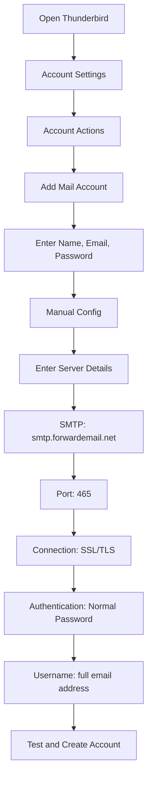

# Przykłady integracji SMTP {#smtp-integration-examples}

## Spis treści {#table-of-contents}

* [Przedmowa](#foreword)
* [Jak działa przetwarzanie SMTP usługi Forward Email](#how-forward-emails-smtp-processing-works)
  * [System kolejkowania i ponawiania prób wysyłania wiadomości e-mail](#email-queue-and-retry-system)
  * [Zabezpieczony przed błędami dla niezawodności](#dummy-proofed-for-reliability)
* [Integracja Node.js](#nodejs-integration)
  * [Korzystanie z Nodemailera](#using-nodemailer)
  * [Korzystanie z Express.js](#using-expressjs)
* [Integracja z Pythonem](#python-integration)
  * [Korzystanie z smtplib](#using-smtplib)
  * [Korzystanie z Django](#using-django)
* [Integracja PHP](#php-integration)
  * [Korzystanie z PHPMailera](#using-phpmailer)
  * [Korzystanie z Laravel](#using-laravel)
* [Integracja Ruby](#ruby-integration)
  * [Korzystanie z Ruby Mail Gem](#using-ruby-mail-gem)
* [Integracja Java](#java-integration)
  * [Korzystanie z interfejsu API poczty Java](#using-javamail-api)
* [Konfiguracja klienta poczty e-mail](#email-client-configuration)
  * [Thunderbird](#thunderbird)
  * [Poczta Apple](#apple-mail)
  * [Gmail (Wyślij pocztę jako)](#gmail-send-mail-as)
* [Rozwiązywanie problemów](#troubleshooting)
  * [Typowe problemy i rozwiązania](#common-issues-and-solutions)
  * [Uzyskiwanie pomocy](#getting-help)
* [Dodatkowe zasoby](#additional-resources)
* [Wniosek](#conclusion)

## Przedmowa {#foreword}

Ten przewodnik zawiera szczegółowe przykłady integracji z usługą SMTP Forward Email przy użyciu różnych języków programowania, frameworków i klientów poczty e-mail. Nasza usługa SMTP została zaprojektowana tak, aby była niezawodna, bezpieczna i łatwa do zintegrowania z istniejącymi aplikacjami.

## Jak działa przetwarzanie SMTP usługi Forward Email {#how-forward-emails-smtp-processing-works}

Zanim przejdziemy do przykładów integracji, ważne jest, aby zrozumieć, w jaki sposób nasza usługa SMTP przetwarza wiadomości e-mail:

### Kolejka wiadomości e-mail i system ponawiania prób {#email-queue-and-retry-system}

Kiedy wysyłasz wiadomość e-mail za pośrednictwem protokołu SMTP na nasze serwery:

1. **Wstępne przetwarzanie**: Wiadomość e-mail jest weryfikowana, skanowana pod kątem złośliwego oprogramowania i sprawdzana pod kątem filtrów antyspamowych.
2. **Inteligentne kolejkowanie**: Wiadomości e-mail są umieszczane w zaawansowanym systemie kolejkowania w celu dostarczenia.
3. **Inteligentny mechanizm ponawiania prób**: Jeśli dostarczenie wiadomości e-mail tymczasowo się nie powiedzie, nasz system:
* Przeanalizuje odpowiedź błędu za pomocą funkcji `getBounceInfo`.
* Określi, czy problem jest tymczasowy (np. „spróbuj ponownie później”, „tymczasowo odroczony”), czy trwały (np. „użytkownik nieznany”).
* W przypadku problemów tymczasowych oznaczy wiadomość e-mail do ponowienia.
* W przypadku problemów trwałych wygeneruje powiadomienie o niedostarczeniu.
4. **5-dniowy okres ponawiania prób**: Ponawiamy próby dostarczenia wiadomości e-mail przez maksymalnie 5 dni (podobnie jak w przypadku standardów branżowych, takich jak Postfix), dając czas na rozwiązanie problemów tymczasowych.
5. **Powiadomienia o statusie dostarczenia**: Nadawcy otrzymują powiadomienia o statusie swoich wiadomości e-mail (dostarczone, opóźnione lub odesłane).

> \[!NOTE]
> Po pomyślnym dostarczeniu, treść wiadomości e-mail SMTP wychodzących jest redagowana po konfigurowalnym okresie przechowywania (domyślnie 30 dni) ze względów bezpieczeństwa i prywatności. Pozostaje tylko komunikat zastępczy informujący o pomyślnym dostarczeniu.

### Niezawodność zabezpieczona przed błędami {#dummy-proofed-for-reliability}

Nasz system jest zaprojektowany tak, aby radzić sobie z różnymi przypadkami brzegowymi:

* W przypadku wykrycia listy blokowanych wiadomości e-mail zostanie automatycznie ponowiona próba wysłania wiadomości.
* W przypadku problemów z siecią, próba doręczenia zostanie ponowiona.
* Jeśli skrzynka odbiorcza odbiorcy jest pełna, system spróbuje ponownie później.
* Jeśli serwer odbiorczy jest tymczasowo niedostępny, będziemy kontynuować próbę.

Takie podejście znacząco zwiększa wskaźnik doręczeń, zapewniając jednocześnie prywatność i bezpieczeństwo.

## Integracja Node.js {#nodejs-integration}

### Korzystanie z Nodemailer {#using-nodemailer}

[Nodemailer](https://nodemailer.com/) to popularny moduł służący do wysyłania wiadomości e-mail z aplikacji Node.js.

```javascript
const nodemailer = require('nodemailer');

// Create a transporter object
const transporter = nodemailer.createTransport({
  host: 'smtp.forwardemail.net',
  port: 465,
  secure: true, // Use TLS
  auth: {
    user: 'your-username@your-domain.com',
    pass: 'your-password'
  }
});

// Send mail with defined transport object
async function sendEmail() {
  try {
    const info = await transporter.sendMail({
      from: '"Your Name" <your-username@your-domain.com>',
      to: 'recipient@example.com',
      subject: 'Hello from Forward Email',
      text: 'Hello world! This is a test email sent using Nodemailer and Forward Email SMTP.',
      html: '<b>Hello world!</b> This is a test email sent using Nodemailer and Forward Email SMTP.'
    });

    console.log('Message sent: %s', info.messageId);
  } catch (error) {
    console.error('Error sending email:', error);
  }
}

sendEmail();
```

### Korzystanie z Express.js {#using-expressjs}

Oto jak zintegrować funkcję Forward Email SMTP z aplikacją Express.js:

```javascript
const express = require('express');
const nodemailer = require('nodemailer');
const app = express();
const port = 3000;

app.use(express.json());

// Configure email transporter
const transporter = nodemailer.createTransport({
  host: 'smtp.forwardemail.net',
  port: 465,
  secure: true,
  auth: {
    user: 'your-username@your-domain.com',
    pass: 'your-password'
  }
});

// API endpoint for sending emails
app.post('/send-email', async (req, res) => {
  const { to, subject, text, html } = req.body;

  try {
    const info = await transporter.sendMail({
      from: '"Your App" <your-username@your-domain.com>',
      to,
      subject,
      text,
      html
    });

    res.status(200).json({
      success: true,
      messageId: info.messageId
    });
  } catch (error) {
    console.error('Error sending email:', error);
    res.status(500).json({
      success: false,
      error: error.message
    });
  }
});

app.listen(port, () => {
  console.log(`Server running at http://localhost:${port}`);
});
```

## Integracja z Pythonem {#python-integration}

### Korzystanie z smtplib {#using-smtplib}

```python
import smtplib
from email.mime.text import MIMEText
from email.mime.multipart import MIMEMultipart

# Email configuration
sender_email = "your-username@your-domain.com"
receiver_email = "recipient@example.com"
password = "your-password"

# Create message
message = MIMEMultipart("alternative")
message["Subject"] = "Hello from Forward Email"
message["From"] = sender_email
message["To"] = receiver_email

# Create the plain-text and HTML version of your message
text = "Hello world! This is a test email sent using Python and Forward Email SMTP."
html = "<html><body><b>Hello world!</b> This is a test email sent using Python and Forward Email SMTP.</body></html>"

# Turn these into plain/html MIMEText objects
part1 = MIMEText(text, "plain")
part2 = MIMEText(html, "html")

# Add HTML/plain-text parts to MIMEMultipart message
message.attach(part1)
message.attach(part2)

# Send email
try:
    server = smtplib.SMTP_SSL("smtp.forwardemail.net", 465)
    server.login(sender_email, password)
    server.sendmail(sender_email, receiver_email, message.as_string())
    server.quit()
    print("Email sent successfully!")
except Exception as e:
    print(f"Error sending email: {e}")
```

### Korzystanie z Django {#using-django}

W przypadku aplikacji Django dodaj następujący kod do `settings.py`:

```python
# Email settings
EMAIL_BACKEND = 'django.core.mail.backends.smtp.EmailBackend'
EMAIL_HOST = 'smtp.forwardemail.net'
EMAIL_PORT = 465
EMAIL_USE_SSL = True
EMAIL_HOST_USER = 'your-username@your-domain.com'
EMAIL_HOST_PASSWORD = 'your-password'
DEFAULT_FROM_EMAIL = 'your-username@your-domain.com'
```

Następnie wyślij e-maile w swoich widokach:

```python
from django.core.mail import send_mail

def send_email_view(request):
    send_mail(
        'Subject here',
        'Here is the message.',
        'from@your-domain.com',
        ['to@example.com'],
        fail_silently=False,
        html_message='<b>Here is the HTML message.</b>'
    )
    return HttpResponse('Email sent!')
```

## Integracja PHP {#php-integration}

### Korzystanie z PHPMailer {#using-phpmailer}

```php
<?php
use PHPMailer\PHPMailer\PHPMailer;
use PHPMailer\PHPMailer\Exception;

require 'vendor/autoload.php';

$mail = new PHPMailer(true);

try {
    // Server settings
    $mail->isSMTP();
    $mail->Host       = 'smtp.forwardemail.net';
    $mail->SMTPAuth   = true;
    $mail->Username   = 'your-username@your-domain.com';
    $mail->Password   = 'your-password';
    $mail->SMTPSecure = PHPMailer::ENCRYPTION_SMTPS;
    $mail->Port       = 465;

    // Recipients
    $mail->setFrom('your-username@your-domain.com', 'Your Name');
    $mail->addAddress('recipient@example.com', 'Recipient Name');
    $mail->addReplyTo('your-username@your-domain.com', 'Your Name');

    // Content
    $mail->isHTML(true);
    $mail->Subject = 'Hello from Forward Email';
    $mail->Body    = '<b>Hello world!</b> This is a test email sent using PHPMailer and Forward Email SMTP.';
    $mail->AltBody = 'Hello world! This is a test email sent using PHPMailer and Forward Email SMTP.';

    $mail->send();
    echo 'Message has been sent';
} catch (Exception $e) {
    echo "Message could not be sent. Mailer Error: {$mail->ErrorInfo}";
}
```

### Korzystanie z Laravel {#using-laravel}

W przypadku aplikacji Laravel zaktualizuj plik `.env`:

```sh
MAIL_MAILER=smtp
MAIL_HOST=smtp.forwardemail.net
MAIL_PORT=465
MAIL_USERNAME=your-username@your-domain.com
MAIL_PASSWORD=your-password
MAIL_ENCRYPTION=ssl
MAIL_FROM_ADDRESS=your-username@your-domain.com
MAIL_FROM_NAME="${APP_NAME}"
```

Następnie wyślij wiadomości e-mail korzystając z fasady Mail Laravela:

```php
<?php

namespace App\Http\Controllers;

use Illuminate\Http\Request;
use Illuminate\Support\Facades\Mail;
use App\Mail\WelcomeEmail;

class EmailController extends Controller
{
    public function sendEmail()
    {
        Mail::to('recipient@example.com')->send(new WelcomeEmail());

        return 'Email sent successfully!';
    }
}
```

## Integracja Ruby {#ruby-integration}

### Korzystanie z Ruby Mail Gem {#using-ruby-mail-gem}

```ruby
require 'mail'

Mail.defaults do
  delivery_method :smtp, {
    address: 'smtp.forwardemail.net',
    port: 465,
    domain: 'your-domain.com',
    user_name: 'your-username@your-domain.com',
    password: 'your-password',
    authentication: 'plain',
    enable_starttls_auto: true,
    ssl: true
  }
end

mail = Mail.new do
  from     'your-username@your-domain.com'
  to       'recipient@example.com'
  subject  'Hello from Forward Email'

  text_part do
    body 'Hello world! This is a test email sent using Ruby Mail and Forward Email SMTP.'
  end

  html_part do
    content_type 'text/html; charset=UTF-8'
    body '<b>Hello world!</b> This is a test email sent using Ruby Mail and Forward Email SMTP.'
  end
end

mail.deliver!
puts "Email sent successfully!"
```

## Integracja Java {#java-integration}

### Korzystanie z interfejsu API JavaMail {#using-javamail-api}

```java
import java.util.Properties;
import javax.mail.*;
import javax.mail.internet.*;

public class SendEmail {
    public static void main(String[] args) {
        // Sender's email and password
        final String username = "your-username@your-domain.com";
        final String password = "your-password";

        // SMTP server properties
        Properties props = new Properties();
        props.put("mail.smtp.auth", "true");
        props.put("mail.smtp.starttls.enable", "true");
        props.put("mail.smtp.host", "smtp.forwardemail.net");
        props.put("mail.smtp.port", "465");
        props.put("mail.smtp.socketFactory.port", "465");
        props.put("mail.smtp.socketFactory.class", "javax.net.ssl.SSLSocketFactory");

        // Create session with authenticator
        Session session = Session.getInstance(props,
            new javax.mail.Authenticator() {
                protected PasswordAuthentication getPasswordAuthentication() {
                    return new PasswordAuthentication(username, password);
                }
            });

        try {
            // Create message
            Message message = new MimeMessage(session);
            message.setFrom(new InternetAddress(username));
            message.setRecipients(Message.RecipientType.TO, InternetAddress.parse("recipient@example.com"));
            message.setSubject("Hello from Forward Email");

            // Create multipart message
            Multipart multipart = new MimeMultipart("alternative");

            // Text part
            BodyPart textPart = new MimeBodyPart();
            textPart.setText("Hello world! This is a test email sent using JavaMail and Forward Email SMTP.");

            // HTML part
            BodyPart htmlPart = new MimeBodyPart();
            htmlPart.setContent("<b>Hello world!</b> This is a test email sent using JavaMail and Forward Email SMTP.", "text/html");

            // Add parts to multipart
            multipart.addBodyPart(textPart);
            multipart.addBodyPart(htmlPart);

            // Set content
            message.setContent(multipart);

            // Send message
            Transport.send(message);

            System.out.println("Email sent successfully!");

        } catch (MessagingException e) {
            throw new RuntimeException(e);
        }
    }
}
```

## Konfiguracja klienta poczty e-mail {#email-client-configuration}

### Thunderbird {#thunderbird}



1. Otwórz Thunderbirda i przejdź do Ustawień konta.
2. Kliknij „Akcje konta” i wybierz „Dodaj konto pocztowe”.
3. Wprowadź swoje imię i nazwisko, adres e-mail i hasło.
4. Kliknij „Konfiguracja ręczna” i wprowadź następujące dane:
* Serwer poczty przychodzącej:
* IMAP: imap.forwardemail.net, Port: 993, SSL/TLS
* POP3: pop3.forwardemail.net, Port: 995, SSL/TLS
* Serwer poczty wychodzącej (SMTP): smtp.forwardemail.net, Port: 465, SSL/TLS
* Uwierzytelnianie: Zwykłe hasło.
* Nazwa użytkownika: Twój pełny adres e-mail.
5. Kliknij „Test”, a następnie „Gotowe”.

### Apple Mail {#apple-mail}

1. Otwórz aplikację Poczta i przejdź do Poczta > Preferencje > Konta
2. Kliknij przycisk „+”, aby dodać nowe konto
3. Wybierz „Inne konto pocztowe” i kliknij „Kontynuuj”
4. Wprowadź swoje imię i nazwisko, adres e-mail i hasło, a następnie kliknij „Zaloguj się”
5. Jeśli automatyczna konfiguracja się nie powiedzie, wprowadź następujące dane:
* Serwer poczty przychodzącej: imap.forwardemail.net (lub pop3.forwardemail.net dla POP3)
* Serwer poczty wychodzącej: smtp.forwardemail.net
* Nazwa użytkownika: Twój pełny adres e-mail
* Hasło: Twoje hasło
6. Kliknij „Zaloguj się”, aby zakończyć konfigurację

### Gmail (Wyślij pocztę jako) {#gmail-send-mail-as}

1. Otwórz Gmaila i przejdź do Ustawienia > Konta i importowanie
2. W sekcji „Wyślij jako” kliknij „Dodaj inny adres e-mail”
3. Wprowadź swoje imię i nazwisko oraz adres e-mail, a następnie kliknij „Następny krok”
4. Wprowadź następujące dane serwera SMTP:
* Serwer SMTP: smtp.forwardemail.net
* Port: 465
* Nazwa użytkownika: Twój pełny adres e-mail
* Hasło: Twoje hasło
* Wybierz „Bezpieczne połączenie SSL”
5. Kliknij „Dodaj konto” i zweryfikuj swój adres e-mail

## Rozwiązywanie problemów {#troubleshooting}

### Typowe problemy i rozwiązania {#common-issues-and-solutions}

1. **Uwierzytelnianie nie powiodło się**
* Zweryfikuj swoją nazwę użytkownika (pełny adres e-mail) i hasło
* Upewnij się, że używasz prawidłowego portu (465 dla SSL/TLS)
* Sprawdź, czy Twoje konto ma włączony dostęp SMTP

2. **Przekroczenie limitu czasu połączenia**
* Sprawdź połączenie internetowe
* Sprawdź, czy ustawienia zapory sieciowej nie blokują ruchu SMTP
* Spróbuj użyć innego portu (587 z STARTTLS)

3. **Wiadomość odrzucona**
* Upewnij się, że adres „Od” jest zgodny z Twoim uwierzytelnionym adresem e-mail
* Sprawdź, czy Twój adres IP nie znajduje się na czarnej liście
* Sprawdź, czy treść wiadomości nie uruchamia filtrów spamu

4. **Błędy TLS/SSL**
* Zaktualizuj aplikację/bibliotekę, aby obsługiwała nowoczesne wersje TLS
* Upewnij się, że certyfikaty CA systemu są aktualne
* Wypróbuj jawny TLS zamiast ukrytego TLS

### Uzyskiwanie pomocy {#getting-help}

Jeżeli natrafisz na problemy, które nie zostały tutaj omówione, prosimy:

1. Sprawdź [Strona FAQ](/faq), aby uzyskać odpowiedzi na często zadawane pytania
2. Sprawdź [wpis na blogu o dostarczaniu wiadomości e-mail](/blog/docs/best-email-forwarding-service), aby uzyskać szczegółowe informacje
3. Skontaktuj się z naszym zespołem wsparcia pod adresem <support@forwardemail.net>

## Dodatkowe zasoby {#additional-resources}

* [Prześlij dalej dokumentację e-mailem](/docs)
* [Limity i konfiguracja serwera SMTP](/faq#what-are-your-outbound-smtp-limits)
* [Przewodnik po najlepszych praktykach dotyczących poczty e-mail](/blog/docs/best-email-forwarding-service)
* [Praktyki bezpieczeństwa](/security)

## Wniosek {#conclusion}

Usługa SMTP Forward Email zapewnia niezawodny, bezpieczny i zapewniający prywatność sposób wysyłania wiadomości e-mail z aplikacji i klientów pocztowych. Dzięki naszemu inteligentnemu systemowi kolejkowania, 5-dniowemu mechanizmowi ponawiania prób i kompleksowym powiadomieniom o statusie doręczenia możesz mieć pewność, że Twoje wiadomości dotrą do adresata.

W przypadku bardziej zaawansowanych przypadków użycia lub niestandardowych integracji skontaktuj się z naszym zespołem wsparcia.