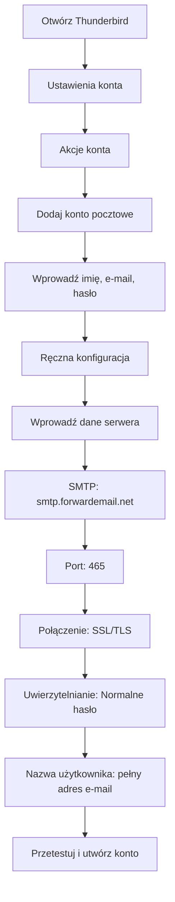

# Przykłady integracji SMTP {#smtp-integration-examples}


## Spis treści {#table-of-contents}

* [Przedmowa](#foreword)
* [Jak działa przetwarzanie SMTP w Forward Email](#how-forward-emails-smtp-processing-works)
  * [Kolejka wiadomości i system ponawiania](#email-queue-and-retry-system)
  * [Odporność na błędy dla niezawodności](#dummy-proofed-for-reliability)
* [Integracja Node.js](#nodejs-integration)
  * [Użycie Nodemailer](#using-nodemailer)
  * [Użycie Express.js](#using-expressjs)
* [Integracja Python](#python-integration)
  * [Użycie smtplib](#using-smtplib)
  * [Użycie Django](#using-django)
* [Integracja PHP](#php-integration)
  * [Użycie PHPMailer](#using-phpmailer)
  * [Użycie Laravel](#using-laravel)
* [Integracja Ruby](#ruby-integration)
  * [Użycie Ruby Mail Gem](#using-ruby-mail-gem)
* [Integracja Java](#java-integration)
  * [Użycie JavaMail API](#using-javamail-api)
* [Konfiguracja klienta poczty](#email-client-configuration)
  * [Thunderbird](#thunderbird)
  * [Apple Mail](#apple-mail)
  * [Gmail (Wyślij jako)](#gmail-send-mail-as)
* [Rozwiązywanie problemów](#troubleshooting)
  * [Typowe problemy i rozwiązania](#common-issues-and-solutions)
  * [Uzyskiwanie pomocy](#getting-help)
* [Dodatkowe zasoby](#additional-resources)
* [Podsumowanie](#conclusion)


## Przedmowa {#foreword}

Ten przewodnik zawiera szczegółowe przykłady integracji z usługą SMTP Forward Email przy użyciu różnych języków programowania, frameworków i klientów poczty. Nasza usługa SMTP została zaprojektowana tak, aby była niezawodna, bezpieczna i łatwa do integracji z istniejącymi aplikacjami.


## Jak działa przetwarzanie SMTP w Forward Email {#how-forward-emails-smtp-processing-works}

Zanim przejdziemy do przykładów integracji, ważne jest, aby zrozumieć, jak nasza usługa SMTP przetwarza wiadomości e-mail:

### Kolejka wiadomości i system ponawiania {#email-queue-and-retry-system}

Gdy wyślesz wiadomość e-mail przez SMTP do naszych serwerów:

1. **Wstępne przetwarzanie**: Wiadomość jest weryfikowana, skanowana pod kątem złośliwego oprogramowania i sprawdzana pod kątem filtrów antyspamowych
2. **Inteligentna kolejka**: Wiadomości są umieszczane w zaawansowanym systemie kolejkowania do dostarczenia
3. **Inteligentny mechanizm ponawiania**: Jeśli dostarczenie tymczasowo się nie powiedzie, nasz system:
   * Analizuje odpowiedź błędu za pomocą funkcji `getBounceInfo`
   * Określa, czy problem jest tymczasowy (np. „spróbuj ponownie później”, „tymczasowo odroczone”) czy trwały (np. „użytkownik nieznany”)
   * W przypadku problemów tymczasowych oznacza wiadomość do ponowienia
   * W przypadku problemów trwałych generuje powiadomienie o zwrocie
4. **Okres ponawiania 5 dni**: Ponawiamy dostarczenie do 5 dni (zgodnie ze standardami branżowymi jak Postfix), dając czas na rozwiązanie problemów tymczasowych
5. **Powiadomienia o statusie dostarczenia**: Nadawcy otrzymują powiadomienia o statusie swoich wiadomości (dostarczone, opóźnione lub zwrócone)

> \[!NOTE]
> Po pomyślnym dostarczeniu, zawartość wychodzących wiadomości SMTP jest usuwana po konfigurowalnym okresie przechowywania (domyślnie 30 dni) dla bezpieczeństwa i prywatności. Pozostaje tylko komunikat zastępczy wskazujący na pomyślne dostarczenie.

### Odporność na błędy dla niezawodności {#dummy-proofed-for-reliability}

Nasz system jest zaprojektowany tak, aby radzić sobie z różnymi przypadkami brzegowymi:

* Jeśli wykryta zostanie lista blokująca, wiadomość zostanie automatycznie ponowiona
* W przypadku problemów sieciowych dostarczenie zostanie ponowione
* Jeśli skrzynka odbiorcza odbiorcy jest pełna, system spróbuje ponownie później
* Jeśli serwer odbierający jest tymczasowo niedostępny, będziemy próbować dalej

Takie podejście znacząco poprawia wskaźniki dostarczenia, zachowując prywatność i bezpieczeństwo.


## Integracja Node.js {#nodejs-integration}

### Użycie Nodemailer {#using-nodemailer}

[Nodemailer](https://nodemailer.com/) to popularny moduł do wysyłania wiadomości e-mail z aplikacji Node.js.

```javascript
const nodemailer = require('nodemailer');

// Utwórz obiekt transportera
const transporter = nodemailer.createTransport({
  host: 'smtp.forwardemail.net',
  port: 465,
  secure: true, // Użyj TLS
  auth: {
    user: 'your-username@your-domain.com',
    pass: 'your-password'
  }
});

// Wyślij wiadomość za pomocą zdefiniowanego transportera
async function sendEmail() {
  try {
    const info = await transporter.sendMail({
      from: '"Twoje Imię" <your-username@your-domain.com>',
      to: 'recipient@example.com',
      subject: 'Witaj z Forward Email',
      text: 'Witaj świecie! To jest testowa wiadomość wysłana za pomocą Nodemailer i SMTP Forward Email.',
      html: '<b>Witaj świecie!</b> To jest testowa wiadomość wysłana za pomocą Nodemailer i SMTP Forward Email.'
    });

    console.log('Wiadomość wysłana: %s', info.messageId);
  } catch (error) {
    console.error('Błąd podczas wysyłania wiadomości:', error);
  }
}

sendEmail();
```
### Korzystanie z Express.js {#using-expressjs}

Oto jak zintegrować Forward Email SMTP z aplikacją Express.js:

```javascript
const express = require('express');
const nodemailer = require('nodemailer');
const app = express();
const port = 3000;

app.use(express.json());

// Konfiguracja transportera e-mail
const transporter = nodemailer.createTransport({
  host: 'smtp.forwardemail.net',
  port: 465,
  secure: true,
  auth: {
    user: 'your-username@your-domain.com',
    pass: 'your-password'
  }
});

// Punkt końcowy API do wysyłania e-maili
app.post('/send-email', async (req, res) => {
  const { to, subject, text, html } = req.body;

  try {
    const info = await transporter.sendMail({
      from: '"Your App" <your-username@your-domain.com>',
      to,
      subject,
      text,
      html
    });

    res.status(200).json({
      success: true,
      messageId: info.messageId
    });
  } catch (error) {
    console.error('Błąd podczas wysyłania e-maila:', error);
    res.status(500).json({
      success: false,
      error: error.message
    });
  }
});

app.listen(port, () => {
  console.log(`Serwer działa pod adresem http://localhost:${port}`);
});
```


## Integracja z Pythonem {#python-integration}

### Korzystanie z smtplib {#using-smtplib}

```python
import smtplib
from email.mime.text import MIMEText
from email.mime.multipart import MIMEMultipart

# Konfiguracja e-maila
sender_email = "your-username@your-domain.com"
receiver_email = "recipient@example.com"
password = "your-password"

# Tworzenie wiadomości
message = MIMEMultipart("alternative")
message["Subject"] = "Witaj od Forward Email"
message["From"] = sender_email
message["To"] = receiver_email

# Tworzenie wersji tekstowej i HTML wiadomości
text = "Hello world! This is a test email sent using Python and Forward Email SMTP."
html = "<html><body><b>Hello world!</b> This is a test email sent using Python and Forward Email SMTP.</body></html>"

# Zamiana na obiekty MIMEText plain/html
part1 = MIMEText(text, "plain")
part2 = MIMEText(html, "html")

# Dodanie części HTML/plain-text do wiadomości MIMEMultipart
message.attach(part1)
message.attach(part2)

# Wysyłanie e-maila
try:
    server = smtplib.SMTP_SSL("smtp.forwardemail.net", 465)
    server.login(sender_email, password)
    server.sendmail(sender_email, receiver_email, message.as_string())
    server.quit()
    print("E-mail został wysłany pomyślnie!")
except Exception as e:
    print(f"Błąd podczas wysyłania e-maila: {e}")
```

### Korzystanie z Django {#using-django}

Dla aplikacji Django dodaj następujące do swojego `settings.py`:

```python
# Ustawienia e-maila
EMAIL_BACKEND = 'django.core.mail.backends.smtp.EmailBackend'
EMAIL_HOST = 'smtp.forwardemail.net'
EMAIL_PORT = 465
EMAIL_USE_SSL = True
EMAIL_HOST_USER = 'your-username@your-domain.com'
EMAIL_HOST_PASSWORD = 'your-password'
DEFAULT_FROM_EMAIL = 'your-username@your-domain.com'
```

Następnie wysyłaj e-maile w swoich widokach:

```python
from django.core.mail import send_mail

def send_email_view(request):
    send_mail(
        'Temat tutaj',
        'Oto wiadomość.',
        'from@your-domain.com',
        ['to@example.com'],
        fail_silently=False,
        html_message='<b>Oto wiadomość HTML.</b>'
    )
    return HttpResponse('E-mail został wysłany!')
```


## Integracja z PHP {#php-integration}

### Korzystanie z PHPMailer {#using-phpmailer}

```php
<?php
use PHPMailer\PHPMailer\PHPMailer;
use PHPMailer\PHPMailer\Exception;

require 'vendor/autoload.php';

$mail = new PHPMailer(true);

try {
    // Ustawienia serwera
    $mail->isSMTP();
    $mail->Host       = 'smtp.forwardemail.net';
    $mail->SMTPAuth   = true;
    $mail->Username   = 'your-username@your-domain.com';
    $mail->Password   = 'your-password';
    $mail->SMTPSecure = PHPMailer::ENCRYPTION_SMTPS;
    $mail->Port       = 465;

    // Odbiorcy
    $mail->setFrom('your-username@your-domain.com', 'Twoje Imię');
    $mail->addAddress('recipient@example.com', 'Nazwa odbiorcy');
    $mail->addReplyTo('your-username@your-domain.com', 'Twoje Imię');

    // Treść
    $mail->isHTML(true);
    $mail->Subject = 'Witaj od Forward Email';
    $mail->Body    = '<b>Hello world!</b> This is a test email sent using PHPMailer and Forward Email SMTP.';
    $mail->AltBody = 'Hello world! This is a test email sent using PHPMailer and Forward Email SMTP.';

    $mail->send();
    echo 'Wiadomość została wysłana';
} catch (Exception $e) {
    echo "Wiadomość nie mogła zostać wysłana. Błąd Mailera: {$mail->ErrorInfo}";
}
```
### Korzystanie z Laravel {#using-laravel}

Dla aplikacji Laravel zaktualizuj swój plik `.env`:

```sh
MAIL_MAILER=smtp
MAIL_HOST=smtp.forwardemail.net
MAIL_PORT=465
MAIL_USERNAME=your-username@your-domain.com
MAIL_PASSWORD=your-password
MAIL_ENCRYPTION=ssl
MAIL_FROM_ADDRESS=your-username@your-domain.com
MAIL_FROM_NAME="${APP_NAME}"
```

Następnie wysyłaj e-maile używając fasady Mail Laravel:

```php
<?php

namespace App\Http\Controllers;

use Illuminate\Http\Request;
use Illuminate\Support\Facades\Mail;
use App\Mail\WelcomeEmail;

class EmailController extends Controller
{
    public function sendEmail()
    {
        Mail::to('recipient@example.com')->send(new WelcomeEmail());

        return 'Email wysłany pomyślnie!';
    }
}
```


## Integracja Ruby {#ruby-integration}

### Korzystanie z Ruby Mail Gem {#using-ruby-mail-gem}

```ruby
require 'mail'

Mail.defaults do
  delivery_method :smtp, {
    address: 'smtp.forwardemail.net',
    port: 465,
    domain: 'your-domain.com',
    user_name: 'your-username@your-domain.com',
    password: 'your-password',
    authentication: 'plain',
    enable_starttls_auto: true,
    ssl: true
  }
end

mail = Mail.new do
  from     'your-username@your-domain.com'
  to       'recipient@example.com'
  subject  'Witaj z Forward Email'

  text_part do
    body 'Witaj świecie! To jest testowy e-mail wysłany przy użyciu Ruby Mail i Forward Email SMTP.'
  end

  html_part do
    content_type 'text/html; charset=UTF-8'
    body '<b>Witaj świecie!</b> To jest testowy e-mail wysłany przy użyciu Ruby Mail i Forward Email SMTP.'
  end
end

mail.deliver!
puts "Email wysłany pomyślnie!"
```


## Integracja Java {#java-integration}

### Korzystanie z JavaMail API {#using-javamail-api}

```java
import java.util.Properties;
import javax.mail.*;
import javax.mail.internet.*;

public class SendEmail {
    public static void main(String[] args) {
        // Email nadawcy i hasło
        final String username = "your-username@your-domain.com";
        final String password = "your-password";

        // Właściwości serwera SMTP
        Properties props = new Properties();
        props.put("mail.smtp.auth", "true");
        props.put("mail.smtp.starttls.enable", "true");
        props.put("mail.smtp.host", "smtp.forwardemail.net");
        props.put("mail.smtp.port", "465");
        props.put("mail.smtp.socketFactory.port", "465");
        props.put("mail.smtp.socketFactory.class", "javax.net.ssl.SSLSocketFactory");

        // Utwórz sesję z uwierzytelnianiem
        Session session = Session.getInstance(props,
            new javax.mail.Authenticator() {
                protected PasswordAuthentication getPasswordAuthentication() {
                    return new PasswordAuthentication(username, password);
                }
            });

        try {
            // Utwórz wiadomość
            Message message = new MimeMessage(session);
            message.setFrom(new InternetAddress(username));
            message.setRecipients(Message.RecipientType.TO, InternetAddress.parse("recipient@example.com"));
            message.setSubject("Witaj z Forward Email");

            // Utwórz wiadomość wieloczęściową
            Multipart multipart = new MimeMultipart("alternative");

            // Część tekstowa
            BodyPart textPart = new MimeBodyPart();
            textPart.setText("Witaj świecie! To jest testowy e-mail wysłany przy użyciu JavaMail i Forward Email SMTP.");

            // Część HTML
            BodyPart htmlPart = new MimeBodyPart();
            htmlPart.setContent("<b>Witaj świecie!</b> To jest testowy e-mail wysłany przy użyciu JavaMail i Forward Email SMTP.", "text/html");

            // Dodaj części do wieloczęściowej wiadomości
            multipart.addBodyPart(textPart);
            multipart.addBodyPart(htmlPart);

            // Ustaw zawartość
            message.setContent(multipart);

            // Wyślij wiadomość
            Transport.send(message);

            System.out.println("Email wysłany pomyślnie!");

        } catch (MessagingException e) {
            throw new RuntimeException(e);
        }
    }
}
```


## Konfiguracja klienta poczty {#email-client-configuration}

### Thunderbird {#thunderbird}


```mermaid
flowchart TD
    A[Otwórz Thunderbird] --> B[Ustawienia konta]
    B --> C[Akcje konta]
    C --> D[Dodaj konto pocztowe]
    D --> E[Wprowadź imię, e-mail, hasło]
    E --> F[Ręczna konfiguracja]
    F --> G[Wprowadź dane serwera]
    G --> H[SMTP: smtp.forwardemail.net]
    H --> I[Port: 465]
    I --> J[Połączenie: SSL/TLS]
    J --> K[Uwierzytelnianie: Normalne hasło]
    K --> L[Nazwa użytkownika: pełny adres e-mail]
    L --> M[Przetestuj i utwórz konto]
```
1. Otwórz Thunderbird i przejdź do Ustawień konta  
2. Kliknij "Akcje konta" i wybierz "Dodaj konto e-mail"  
3. Wprowadź swoje imię, adres e-mail oraz hasło  
4. Kliknij "Ręczna konfiguracja" i wpisz następujące dane:  
   * Serwer przychodzący:  
     * IMAP: imap.forwardemail.net, Port: 993, SSL/TLS  
     * POP3: pop3.forwardemail.net, Port: 995, SSL/TLS  
   * Serwer wychodzący (SMTP): smtp.forwardemail.net, Port: 465, SSL/TLS  
   * Uwierzytelnianie: Normalne hasło  
   * Nazwa użytkownika: pełny adres e-mail  
5. Kliknij "Testuj", a następnie "Gotowe"  

### Apple Mail {#apple-mail}

1. Otwórz Mail i przejdź do Mail > Preferencje > Konta  
2. Kliknij przycisk "+" aby dodać nowe konto  
3. Wybierz "Inne konto e-mail" i kliknij "Kontynuuj"  
4. Wprowadź swoje imię, adres e-mail oraz hasło, następnie kliknij "Zaloguj się"  
5. Gdy automatyczna konfiguracja się nie powiedzie, wpisz następujące dane:  
   * Serwer poczty przychodzącej: imap.forwardemail.net (lub pop3.forwardemail.net dla POP3)  
   * Serwer poczty wychodzącej: smtp.forwardemail.net  
   * Nazwa użytkownika: pełny adres e-mail  
   * Hasło: twoje hasło  
6. Kliknij "Zaloguj się", aby zakończyć konfigurację  

### Gmail (Wyślij jako) {#gmail-send-mail-as}

1. Otwórz Gmail i przejdź do Ustawienia > Konta i import  
2. W sekcji "Wyślij wiadomość jako" kliknij "Dodaj inny adres e-mail"  
3. Wprowadź swoje imię i adres e-mail, następnie kliknij "Następny krok"  
4. Wprowadź następujące dane serwera SMTP:  
   * Serwer SMTP: smtp.forwardemail.net  
   * Port: 465  
   * Nazwa użytkownika: pełny adres e-mail  
   * Hasło: twoje hasło  
   * Wybierz "Bezpieczne połączenie za pomocą SSL"  
5. Kliknij "Dodaj konto" i zweryfikuj swój adres e-mail  

## Rozwiązywanie problemów {#troubleshooting}

### Najczęstsze problemy i rozwiązania {#common-issues-and-solutions}

1. **Błąd uwierzytelniania**  
   * Sprawdź swoją nazwę użytkownika (pełny adres e-mail) i hasło  
   * Upewnij się, że używasz właściwego portu (465 dla SSL/TLS)  
   * Sprawdź, czy Twoje konto ma włączony dostęp SMTP  

2. **Przekroczenie czasu połączenia**  
   * Sprawdź połączenie internetowe  
   * Upewnij się, że zapora sieciowa nie blokuje ruchu SMTP  
   * Spróbuj użyć portu 465 z SSL/TLS (zalecane) lub portu 587 z STARTTLS  

3. **Wiadomość odrzucona**  
   * Upewnij się, że adres "Od" odpowiada uwierzytelnionemu adresowi e-mail  
   * Sprawdź, czy Twój adres IP nie jest na czarnej liście  
   * Zweryfikuj, czy treść wiadomości nie wywołuje filtrów antyspamowych  

4. **Błędy TLS/SSL**  
   * Zaktualizuj aplikację/bibliotekę, aby obsługiwała nowoczesne wersje TLS  
   * Upewnij się, że certyfikaty CA systemu są aktualne  
   * Spróbuj użyć TLS jawnego zamiast TLS ukrytego  

### Uzyskiwanie pomocy {#getting-help}

Jeśli napotkasz problemy nieopisane tutaj, prosimy:  

1. Sprawdź naszą [stronę FAQ](/faq) z najczęściej zadawanymi pytaniami  
2. Przejrzyj nasz [artykuł na blogu o dostarczaniu e-maili](/blog/docs/best-email-forwarding-service) dla szczegółowych informacji  
3. Skontaktuj się z naszym zespołem wsparcia pod adresem <support@forwardemail.net>  

## Dodatkowe zasoby {#additional-resources}

* [Dokumentacja Forward Email](/docs)  
* [Limity i konfiguracja serwera SMTP](/faq#what-are-your-outbound-smtp-limits)  
* [Przewodnik najlepszych praktyk e-mail](/blog/docs/best-email-forwarding-service)  
* [Praktyki bezpieczeństwa](/security)  

## Podsumowanie {#conclusion}

Usługa SMTP Forward Email zapewnia niezawodny, bezpieczny i skoncentrowany na prywatności sposób wysyłania e-maili z Twoich aplikacji i klientów poczty. Dzięki inteligentnemu systemowi kolejkowania, mechanizmowi ponawiania prób przez 5 dni oraz kompleksowym powiadomieniom o statusie dostarczenia, możesz mieć pewność, że Twoje wiadomości dotrą do odbiorcy.  

W przypadku bardziej zaawansowanych zastosowań lub niestandardowych integracji prosimy o kontakt z naszym zespołem wsparcia.
