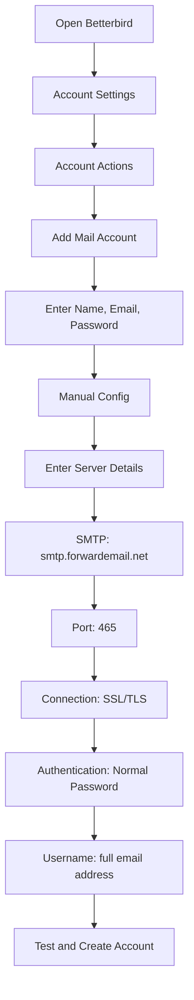

# Exemplos de integração SMTP {#smtp-integration-examples}

## Índice {#table-of-contents}

* [Prefácio](#foreword)
* [Como funciona o processamento SMTP do Forward Email](#how-forward-emails-smtp-processing-works)
  * [Sistema de fila e repetição de e-mail](#email-queue-and-retry-system)
  * [À prova de falsificações para confiabilidade](#dummy-proofed-for-reliability)
* [Integração Node.js](#nodejs-integration)
  * [Usando o Nodemailer](#using-nodemailer)
  * [Usando Express.js](#using-expressjs)
* [Integração Python](#python-integration)
  * [Usando smtplib](#using-smtplib)
  * [Usando Django](#using-django)
* [Integração PHP](#php-integration)
  * [Usando PHPMailer](#using-phpmailer)
  * [Usando Laravel](#using-laravel)
* [Integração Ruby](#ruby-integration)
  * [Usando Ruby Mail Gem](#using-ruby-mail-gem)
* [Integração Java](#java-integration)
  * [Usando a API Java Mail](#using-javamail-api)
* [Configuração do cliente de e-mail](#email-client-configuration)
  * [Pássaro Trovão](#betterbird)
  * [Correio da Apple](#apple-mail)
  * [Gmail (Enviar e-mail como)](#gmail-send-mail-as)
* [Solução de problemas](#troubleshooting)
  * [Problemas e soluções comuns](#common-issues-and-solutions)
  * [Obtendo ajuda](#getting-help)
* [Recursos adicionais](#additional-resources)
* [Conclusão](#conclusion)

## Prefácio {#foreword}

Este guia fornece exemplos detalhados de como integrar o serviço SMTP da Forward Email usando diversas linguagens de programação, frameworks e clientes de e-mail. Nosso serviço SMTP foi projetado para ser confiável, seguro e fácil de integrar aos seus aplicativos existentes.

## Como funciona o processamento SMTP do Forward Email {#how-forward-emails-smtp-processing-works}

Antes de mergulhar nos exemplos de integração, é importante entender como nosso serviço SMTP processa e-mails:

### Sistema de fila e repetição de e-mail {#email-queue-and-retry-system}

Quando você envia um e-mail via SMTP para nossos servidores:

1. **Processamento Inicial**: O e-mail é validado, verificado em busca de malware e verificado em filtros de spam.
2. **Fila Inteligente**: Os e-mails são colocados em um sofisticado sistema de fila para entrega.
3. **Mecanismo Inteligente de Nova Tentativa**: Se a entrega falhar temporariamente, nosso sistema irá:
* Analisar a resposta de erro usando nossa função `getBounceInfo`.
* Determinar se o problema é temporário (por exemplo, "tente novamente mais tarde", "temporariamente adiado") ou permanente (por exemplo, "usuário desconhecido").
* Para problemas temporários, marcar o e-mail para nova tentativa.
* Para problemas permanentes, gerar uma notificação de rejeição.
4. **Período de Nova Tentativa de 5 Dias**: Tentamos a entrega novamente por até 5 dias (semelhante aos padrões do setor, como o Postfix), dando tempo para que os problemas temporários sejam resolvidos.
5. **Notificações de Status de Entrega**: Os remetentes recebem notificações sobre o status de seus e-mails (entregues, atrasados ou devolvidos).

> \[!NOTE]
> Após a entrega bem-sucedida, o conteúdo do e-mail SMTP de saída é redigido após um período de retenção configurável (padrão: 30 dias) para segurança e privacidade. Apenas uma mensagem de espaço reservado permanece, indicando a entrega bem-sucedida.

### À prova de falhas para confiabilidade {#dummy-proofed-for-reliability}

Nosso sistema foi projetado para lidar com vários casos extremos:

* Se uma lista de bloqueio for detectada, o e-mail será automaticamente tentado novamente.
* Se ocorrerem problemas de rede, a entrega será tentada novamente.
* Se a caixa de correio do destinatário estiver cheia, o sistema tentará novamente mais tarde.
* Se o servidor de recebimento estiver temporariamente indisponível, continuaremos tentando.

Essa abordagem melhora significativamente as taxas de entrega, mantendo a privacidade e a segurança.

## Integração Node.js {#nodejs-integration}

### Usando Nodemailer {#using-nodemailer}

[Nodemailer](https://nodemailer.com/) é um módulo popular para envio de e-mails de aplicativos Node.js.

```javascript
const nodemailer = require('nodemailer');

// Create a transporter object
const transporter = nodemailer.createTransport({
  host: 'smtp.forwardemail.net',
  port: 465,
  secure: true, // Use TLS
  auth: {
    user: 'your-username@your-domain.com',
    pass: 'your-password'
  }
});

// Send mail with defined transport object
async function sendEmail() {
  try {
    const info = await transporter.sendMail({
      from: '"Your Name" <your-username@your-domain.com>',
      to: 'recipient@example.com',
      subject: 'Hello from Forward Email',
      text: 'Hello world! This is a test email sent using Nodemailer and Forward Email SMTP.',
      html: '<b>Hello world!</b> This is a test email sent using Nodemailer and Forward Email SMTP.'
    });

    console.log('Message sent: %s', info.messageId);
  } catch (error) {
    console.error('Error sending email:', error);
  }
}

sendEmail();
```

### Usando Express.js {#using-expressjs}

Veja como integrar o Forward Email SMTP com um aplicativo Express.js:

```javascript
const express = require('express');
const nodemailer = require('nodemailer');
const app = express();
const port = 3000;

app.use(express.json());

// Configure email transporter
const transporter = nodemailer.createTransport({
  host: 'smtp.forwardemail.net',
  port: 465,
  secure: true,
  auth: {
    user: 'your-username@your-domain.com',
    pass: 'your-password'
  }
});

// API endpoint for sending emails
app.post('/send-email', async (req, res) => {
  const { to, subject, text, html } = req.body;

  try {
    const info = await transporter.sendMail({
      from: '"Your App" <your-username@your-domain.com>',
      to,
      subject,
      text,
      html
    });

    res.status(200).json({
      success: true,
      messageId: info.messageId
    });
  } catch (error) {
    console.error('Error sending email:', error);
    res.status(500).json({
      success: false,
      error: error.message
    });
  }
});

app.listen(port, () => {
  console.log(`Server running at http://localhost:${port}`);
});
```

## Integração Python {#python-integration}

### Usando smtplib {#using-smtplib}

```python
import smtplib
from email.mime.text import MIMEText
from email.mime.multipart import MIMEMultipart

# Email configuration
sender_email = "your-username@your-domain.com"
receiver_email = "recipient@example.com"
password = "your-password"

# Create message
message = MIMEMultipart("alternative")
message["Subject"] = "Hello from Forward Email"
message["From"] = sender_email
message["To"] = receiver_email

# Create the plain-text and HTML version of your message
text = "Hello world! This is a test email sent using Python and Forward Email SMTP."
html = "<html><body><b>Hello world!</b> This is a test email sent using Python and Forward Email SMTP.</body></html>"

# Turn these into plain/html MIMEText objects
part1 = MIMEText(text, "plain")
part2 = MIMEText(html, "html")

# Add HTML/plain-text parts to MIMEMultipart message
message.attach(part1)
message.attach(part2)

# Send email
try:
    server = smtplib.SMTP_SSL("smtp.forwardemail.net", 465)
    server.login(sender_email, password)
    server.sendmail(sender_email, receiver_email, message.as_string())
    server.quit()
    print("Email sent successfully!")
except Exception as e:
    print(f"Error sending email: {e}")
```

### Usando Django {#using-django}

Para aplicativos Django, adicione o seguinte ao seu `settings.py`:

```python
# Email settings
EMAIL_BACKEND = 'django.core.mail.backends.smtp.EmailBackend'
EMAIL_HOST = 'smtp.forwardemail.net'
EMAIL_PORT = 465
EMAIL_USE_SSL = True
EMAIL_HOST_USER = 'your-username@your-domain.com'
EMAIL_HOST_PASSWORD = 'your-password'
DEFAULT_FROM_EMAIL = 'your-username@your-domain.com'
```

Então envie e-mails com suas visualizações:

```python
from django.core.mail import send_mail

def send_email_view(request):
    send_mail(
        'Subject here',
        'Here is the message.',
        'from@your-domain.com',
        ['to@example.com'],
        fail_silently=False,
        html_message='<b>Here is the HTML message.</b>'
    )
    return HttpResponse('Email sent!')
```

## Integração PHP {#php-integration}

### Usando PHPMailer {#using-phpmailer}

```php
<?php
use PHPMailer\PHPMailer\PHPMailer;
use PHPMailer\PHPMailer\Exception;

require 'vendor/autoload.php';

$mail = new PHPMailer(true);

try {
    // Server settings
    $mail->isSMTP();
    $mail->Host       = 'smtp.forwardemail.net';
    $mail->SMTPAuth   = true;
    $mail->Username   = 'your-username@your-domain.com';
    $mail->Password   = 'your-password';
    $mail->SMTPSecure = PHPMailer::ENCRYPTION_SMTPS;
    $mail->Port       = 465;

    // Recipients
    $mail->setFrom('your-username@your-domain.com', 'Your Name');
    $mail->addAddress('recipient@example.com', 'Recipient Name');
    $mail->addReplyTo('your-username@your-domain.com', 'Your Name');

    // Content
    $mail->isHTML(true);
    $mail->Subject = 'Hello from Forward Email';
    $mail->Body    = '<b>Hello world!</b> This is a test email sent using PHPMailer and Forward Email SMTP.';
    $mail->AltBody = 'Hello world! This is a test email sent using PHPMailer and Forward Email SMTP.';

    $mail->send();
    echo 'Message has been sent';
} catch (Exception $e) {
    echo "Message could not be sent. Mailer Error: {$mail->ErrorInfo}";
}
```

### Usando Laravel {#using-laravel}

Para aplicativos Laravel, atualize seu arquivo `.env`:

```sh
MAIL_MAILER=smtp
MAIL_HOST=smtp.forwardemail.net
MAIL_PORT=465
MAIL_USERNAME=your-username@your-domain.com
MAIL_PASSWORD=your-password
MAIL_ENCRYPTION=ssl
MAIL_FROM_ADDRESS=your-username@your-domain.com
MAIL_FROM_NAME="${APP_NAME}"
```

Em seguida, envie e-mails usando a fachada Mail do Laravel:

```php
<?php

namespace App\Http\Controllers;

use Illuminate\Http\Request;
use Illuminate\Support\Facades\Mail;
use App\Mail\WelcomeEmail;

class EmailController extends Controller
{
    public function sendEmail()
    {
        Mail::to('recipient@example.com')->send(new WelcomeEmail());

        return 'Email sent successfully!';
    }
}
```

## Integração Ruby {#ruby-integration}

### Usando Ruby Mail Gem {#using-ruby-mail-gem}

```ruby
require 'mail'

Mail.defaults do
  delivery_method :smtp, {
    address: 'smtp.forwardemail.net',
    port: 465,
    domain: 'your-domain.com',
    user_name: 'your-username@your-domain.com',
    password: 'your-password',
    authentication: 'plain',
    enable_starttls_auto: true,
    ssl: true
  }
end

mail = Mail.new do
  from     'your-username@your-domain.com'
  to       'recipient@example.com'
  subject  'Hello from Forward Email'

  text_part do
    body 'Hello world! This is a test email sent using Ruby Mail and Forward Email SMTP.'
  end

  html_part do
    content_type 'text/html; charset=UTF-8'
    body '<b>Hello world!</b> This is a test email sent using Ruby Mail and Forward Email SMTP.'
  end
end

mail.deliver!
puts "Email sent successfully!"
```

## Integração Java {#java-integration}

### Usando a API JavaMail {#using-javamail-api}

```java
import java.util.Properties;
import javax.mail.*;
import javax.mail.internet.*;

public class SendEmail {
    public static void main(String[] args) {
        // Sender's email and password
        final String username = "your-username@your-domain.com";
        final String password = "your-password";

        // SMTP server properties
        Properties props = new Properties();
        props.put("mail.smtp.auth", "true");
        props.put("mail.smtp.starttls.enable", "true");
        props.put("mail.smtp.host", "smtp.forwardemail.net");
        props.put("mail.smtp.port", "465");
        props.put("mail.smtp.socketFactory.port", "465");
        props.put("mail.smtp.socketFactory.class", "javax.net.ssl.SSLSocketFactory");

        // Create session with authenticator
        Session session = Session.getInstance(props,
            new javax.mail.Authenticator() {
                protected PasswordAuthentication getPasswordAuthentication() {
                    return new PasswordAuthentication(username, password);
                }
            });

        try {
            // Create message
            Message message = new MimeMessage(session);
            message.setFrom(new InternetAddress(username));
            message.setRecipients(Message.RecipientType.TO, InternetAddress.parse("recipient@example.com"));
            message.setSubject("Hello from Forward Email");

            // Create multipart message
            Multipart multipart = new MimeMultipart("alternative");

            // Text part
            BodyPart textPart = new MimeBodyPart();
            textPart.setText("Hello world! This is a test email sent using JavaMail and Forward Email SMTP.");

            // HTML part
            BodyPart htmlPart = new MimeBodyPart();
            htmlPart.setContent("<b>Hello world!</b> This is a test email sent using JavaMail and Forward Email SMTP.", "text/html");

            // Add parts to multipart
            multipart.addBodyPart(textPart);
            multipart.addBodyPart(htmlPart);

            // Set content
            message.setContent(multipart);

            // Send message
            Transport.send(message);

            System.out.println("Email sent successfully!");

        } catch (MessagingException e) {
            throw new RuntimeException(e);
        }
    }
}
```

## Configuração do cliente de e-mail {#email-client-configuration}

### Betterbird {#betterbird}



1. Abra o Betterbird e acesse Configurações da Conta
2. Clique em "Ações da Conta" e selecione "Adicionar Conta de E-mail"
3. Insira seu nome, endereço de e-mail e senha
4. Clique em "Configuração Manual" e insira os seguintes dados:
* Servidor de Entrada:
* IMAP: imap.forwardemail.net, Porta: 993, SSL/TLS
* POP3: pop3.forwardemail.net, Porta: 995, SSL/TLS
* Servidor de Saída (SMTP): smtp.forwardemail.net, Porta: 465, SSL/TLS
* Autenticação: Senha Normal
* Nome de Usuário: seu endereço de e-mail completo
5. Clique em "Testar" e depois em "Concluído"

### Apple Mail {#apple-mail}

1. Abra o Mail e acesse Mail > Preferências > Contas
2. Clique no botão "+" para adicionar uma nova conta
3. Selecione "Outra Conta de Mail" e clique em "Continuar"
4. Insira seu nome, endereço de e-mail e senha e clique em "Entrar"
5. Se a configuração automática falhar, insira os seguintes detalhes:
* Servidor de Entrada de E-mail: imap.forwardemail.net (ou pop3.forwardemail.net para POP3)
* Servidor de Saída de E-mail: smtp.forwardemail.net
* Nome de Usuário: seu endereço de e-mail completo
* Senha: sua senha
6. Clique em "Entrar" para concluir a configuração

### Gmail (Enviar e-mail como) {#gmail-send-mail-as}

1. Abra o Gmail e acesse Configurações > Contas e Importação
2. Em "Enviar e-mail como", clique em "Adicionar outro endereço de e-mail"
3. Insira seu nome e endereço de e-mail e clique em "Próxima Etapa"
4. Insira os seguintes detalhes do servidor SMTP:
* Servidor SMTP: smtp.forwardemail.net
* Porta: 465
* Nome de usuário: seu endereço de e-mail completo
* Senha: sua senha
* Selecione "Conexão segura usando SSL"
5. Clique em "Adicionar conta" e verifique seu endereço de e-mail

## Solução de problemas {#troubleshooting}

### Problemas e soluções comuns {#common-issues-and-solutions}

1. **Falha na autenticação**
* Verifique seu nome de usuário (endereço de e-mail completo) e senha
* Certifique-se de estar usando a porta correta (465 para SSL/TLS)
* Verifique se sua conta possui acesso SMTP habilitado

2. **Tempo limite de conexão**
* Verifique sua conexão com a internet
* Verifique se as configurações do firewall não estão bloqueando o tráfego SMTP
* Tente usar uma porta diferente (587 com STARTTLS)

3. **Mensagem rejeitada**
* Certifique-se de que o seu endereço "De" corresponda ao seu e-mail autenticado
* Verifique se o seu IP está na lista negra
* Verifique se o conteúdo da sua mensagem não está acionando filtros de spam

4. **Erros de TLS/SSL**
* Atualize seu aplicativo/biblioteca para suportar versões modernas de TLS
* Certifique-se de que os certificados CA do seu sistema estejam atualizados
* Experimente TLS explícito em vez de TLS implícito

### Obtendo ajuda {#getting-help}

Caso encontre problemas não abordados aqui, por favor:

1. Consulte nosso [Página de perguntas frequentes](/faq) para perguntas comuns
2. Consulte nosso [postagem de blog sobre entrega de e-mail](/blog/docs/best-email-forwarding-service) para obter informações detalhadas
3. Entre em contato com nossa equipe de suporte pelo e-mail <support@forwardemail.net>

## Recursos adicionais {#additional-resources}

* [Encaminhar documentação de e-mail](/docs)
* [Limites e configuração do servidor SMTP](/faq#what-are-your-outbound-smtp-limits)
* [Guia de práticas recomendadas de e-mail](/blog/docs/best-email-forwarding-service)
* [Práticas de Segurança](/security)

## Conclusão {#conclusion}

O serviço SMTP da Forward Email oferece uma maneira confiável, segura e com foco na privacidade de enviar e-mails de seus aplicativos e clientes de e-mail. Com nosso sistema de fila inteligente, mecanismo de repetição de 5 dias e notificações abrangentes sobre o status de entrega, você pode ter certeza de que seus e-mails chegarão ao destino.

Para casos de uso mais avançados ou integrações personalizadas, entre em contato com nossa equipe de suporte.