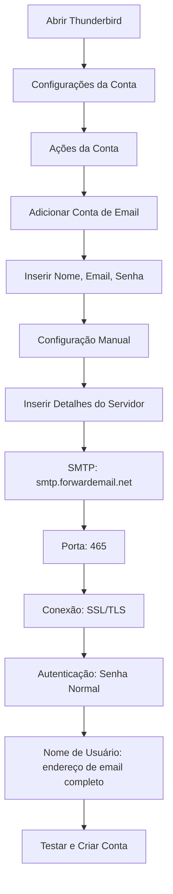

# Exemplos de Integração SMTP {#smtp-integration-examples}


## Índice {#table-of-contents}

* [Prefácio](#foreword)
* [Como o Processamento SMTP do Forward Email Funciona](#how-forward-emails-smtp-processing-works)
  * [Fila de Emails e Sistema de Retentativa](#email-queue-and-retry-system)
  * [À Prova de Erros para Confiabilidade](#dummy-proofed-for-reliability)
* [Integração Node.js](#nodejs-integration)
  * [Usando Nodemailer](#using-nodemailer)
  * [Usando Express.js](#using-expressjs)
* [Integração Python](#python-integration)
  * [Usando smtplib](#using-smtplib)
  * [Usando Django](#using-django)
* [Integração PHP](#php-integration)
  * [Usando PHPMailer](#using-phpmailer)
  * [Usando Laravel](#using-laravel)
* [Integração Ruby](#ruby-integration)
  * [Usando Ruby Mail Gem](#using-ruby-mail-gem)
* [Integração Java](#java-integration)
  * [Usando JavaMail API](#using-javamail-api)
* [Configuração do Cliente de Email](#email-client-configuration)
  * [Thunderbird](#thunderbird)
  * [Apple Mail](#apple-mail)
  * [Gmail (Enviar Email Como)](#gmail-send-mail-as)
* [Solução de Problemas](#troubleshooting)
  * [Problemas Comuns e Soluções](#common-issues-and-solutions)
  * [Obtendo Ajuda](#getting-help)
* [Recursos Adicionais](#additional-resources)
* [Conclusão](#conclusion)


## Prefácio {#foreword}

Este guia fornece exemplos detalhados de como integrar com o serviço SMTP do Forward Email usando várias linguagens de programação, frameworks e clientes de email. Nosso serviço SMTP é projetado para ser confiável, seguro e fácil de integrar com suas aplicações existentes.


## Como o Processamento SMTP do Forward Email Funciona {#how-forward-emails-smtp-processing-works}

Antes de mergulhar nos exemplos de integração, é importante entender como nosso serviço SMTP processa os emails:

### Fila de Emails e Sistema de Retentativa {#email-queue-and-retry-system}

Quando você envia um email via SMTP para nossos servidores:

1. **Processamento Inicial**: O email é validado, escaneado para malware e verificado contra filtros de spam
2. **Fila Inteligente**: Os emails são colocados em um sistema sofisticado de fila para entrega
3. **Mecanismo Inteligente de Retentativa**: Se a entrega falhar temporariamente, nosso sistema irá:
   * Analisar a resposta de erro usando nossa função `getBounceInfo`
   * Determinar se o problema é temporário (ex: "tente novamente mais tarde", "temporariamente adiado") ou permanente (ex: "usuário desconhecido")
   * Para problemas temporários, marcar o email para retentativa
   * Para problemas permanentes, gerar uma notificação de bounce
4. **Período de Retentativa de 5 Dias**: Tentamos a entrega por até 5 dias (semelhante a padrões da indústria como Postfix), dando tempo para que problemas temporários sejam resolvidos
5. **Notificações de Status de Entrega**: Os remetentes recebem notificações sobre o status dos seus emails (entregue, atrasado ou rejeitado)

> \[!NOTE]
> Após a entrega bem-sucedida, o conteúdo do email SMTP enviado é removido após um período configurável de retenção (padrão 30 dias) por segurança e privacidade. Apenas uma mensagem substituta permanece indicando a entrega bem-sucedida.

### À Prova de Erros para Confiabilidade {#dummy-proofed-for-reliability}

Nosso sistema é projetado para lidar com vários casos extremos:

* Se uma lista de bloqueio for detectada, o email será automaticamente reenviado
* Se ocorrerem problemas de rede, a entrega será tentada novamente
* Se a caixa de correio do destinatário estiver cheia, o sistema tentará novamente mais tarde
* Se o servidor receptor estiver temporariamente indisponível, continuaremos tentando

Essa abordagem melhora significativamente as taxas de entrega enquanto mantém a privacidade e segurança.


## Integração Node.js {#nodejs-integration}

### Usando Nodemailer {#using-nodemailer}

[Nodemailer](https://nodemailer.com/) é um módulo popular para enviar emails a partir de aplicações Node.js.

```javascript
const nodemailer = require('nodemailer');

// Create a transporter object
const transporter = nodemailer.createTransport({
  host: 'smtp.forwardemail.net',
  port: 465,
  secure: true, // Use TLS
  auth: {
    user: 'your-username@your-domain.com',
    pass: 'your-password'
  }
});

// Send mail with defined transport object
async function sendEmail() {
  try {
    const info = await transporter.sendMail({
      from: '"Your Name" <your-username@your-domain.com>',
      to: 'recipient@example.com',
      subject: 'Hello from Forward Email',
      text: 'Hello world! This is a test email sent using Nodemailer and Forward Email SMTP.',
      html: '<b>Hello world!</b> This is a test email sent using Nodemailer and Forward Email SMTP.'
    });

    console.log('Message sent: %s', info.messageId);
  } catch (error) {
    console.error('Error sending email:', error);
  }
}

sendEmail();
```
### Usando Express.js {#using-expressjs}

Aqui está como integrar o Forward Email SMTP com uma aplicação Express.js:

```javascript
const express = require('express');
const nodemailer = require('nodemailer');
const app = express();
const port = 3000;

app.use(express.json());

// Configure o transportador de email
const transporter = nodemailer.createTransport({
  host: 'smtp.forwardemail.net',
  port: 465,
  secure: true,
  auth: {
    user: 'your-username@your-domain.com',
    pass: 'your-password'
  }
});

// Endpoint da API para envio de emails
app.post('/send-email', async (req, res) => {
  const { to, subject, text, html } = req.body;

  try {
    const info = await transporter.sendMail({
      from: '"Your App" <your-username@your-domain.com>',
      to,
      subject,
      text,
      html
    });

    res.status(200).json({
      success: true,
      messageId: info.messageId
    });
  } catch (error) {
    console.error('Erro ao enviar email:', error);
    res.status(500).json({
      success: false,
      error: error.message
    });
  }
});

app.listen(port, () => {
  console.log(`Servidor rodando em http://localhost:${port}`);
});
```


## Integração Python {#python-integration}

### Usando smtplib {#using-smtplib}

```python
import smtplib
from email.mime.text import MIMEText
from email.mime.multipart import MIMEMultipart

# Configuração do email
sender_email = "your-username@your-domain.com"
receiver_email = "recipient@example.com"
password = "your-password"

# Crie a mensagem
message = MIMEMultipart("alternative")
message["Subject"] = "Olá do Forward Email"
message["From"] = sender_email
message["To"] = receiver_email

# Crie a versão em texto simples e HTML da sua mensagem
text = "Olá mundo! Este é um email de teste enviado usando Python e Forward Email SMTP."
html = "<html><body><b>Olá mundo!</b> Este é um email de teste enviado usando Python e Forward Email SMTP.</body></html>"

# Transforme-os em objetos MIMEText plain/html
part1 = MIMEText(text, "plain")
part2 = MIMEText(html, "html")

# Adicione as partes HTML/texto simples à mensagem MIMEMultipart
message.attach(part1)
message.attach(part2)

# Envie o email
try:
    server = smtplib.SMTP_SSL("smtp.forwardemail.net", 465)
    server.login(sender_email, password)
    server.sendmail(sender_email, receiver_email, message.as_string())
    server.quit()
    print("Email enviado com sucesso!")
except Exception as e:
    print(f"Erro ao enviar email: {e}")
```

### Usando Django {#using-django}

Para aplicações Django, adicione o seguinte ao seu `settings.py`:

```python
# Configurações de email
EMAIL_BACKEND = 'django.core.mail.backends.smtp.EmailBackend'
EMAIL_HOST = 'smtp.forwardemail.net'
EMAIL_PORT = 465
EMAIL_USE_SSL = True
EMAIL_HOST_USER = 'your-username@your-domain.com'
EMAIL_HOST_PASSWORD = 'your-password'
DEFAULT_FROM_EMAIL = 'your-username@your-domain.com'
```

Depois envie emails nas suas views:

```python
from django.core.mail import send_mail

def send_email_view(request):
    send_mail(
        'Assunto aqui',
        'Aqui está a mensagem.',
        'from@your-domain.com',
        ['to@example.com'],
        fail_silently=False,
        html_message='<b>Aqui está a mensagem HTML.</b>'
    )
    return HttpResponse('Email enviado!')
```


## Integração PHP {#php-integration}

### Usando PHPMailer {#using-phpmailer}

```php
<?php
use PHPMailer\PHPMailer\PHPMailer;
use PHPMailer\PHPMailer\Exception;

require 'vendor/autoload.php';

$mail = new PHPMailer(true);

try {
    // Configurações do servidor
    $mail->isSMTP();
    $mail->Host       = 'smtp.forwardemail.net';
    $mail->SMTPAuth   = true;
    $mail->Username   = 'your-username@your-domain.com';
    $mail->Password   = 'your-password';
    $mail->SMTPSecure = PHPMailer::ENCRYPTION_SMTPS;
    $mail->Port       = 465;

    // Destinatários
    $mail->setFrom('your-username@your-domain.com', 'Seu Nome');
    $mail->addAddress('recipient@example.com', 'Nome do Destinatário');
    $mail->addReplyTo('your-username@your-domain.com', 'Seu Nome');

    // Conteúdo
    $mail->isHTML(true);
    $mail->Subject = 'Olá do Forward Email';
    $mail->Body    = '<b>Olá mundo!</b> Este é um email de teste enviado usando PHPMailer e Forward Email SMTP.';
    $mail->AltBody = 'Olá mundo! Este é um email de teste enviado usando PHPMailer e Forward Email SMTP.';

    $mail->send();
    echo 'Mensagem enviada';
} catch (Exception $e) {
    echo "A mensagem não pôde ser enviada. Erro do Mailer: {$mail->ErrorInfo}";
}
```
### Usando Laravel {#using-laravel}

Para aplicações Laravel, atualize seu arquivo `.env`:

```sh
MAIL_MAILER=smtp
MAIL_HOST=smtp.forwardemail.net
MAIL_PORT=465
MAIL_USERNAME=seu-usuario@seu-dominio.com
MAIL_PASSWORD=sua-senha
MAIL_ENCRYPTION=ssl
MAIL_FROM_ADDRESS=seu-usuario@seu-dominio.com
MAIL_FROM_NAME="${APP_NAME}"
```

Então envie e-mails usando a fachada Mail do Laravel:

```php
<?php

namespace App\Http\Controllers;

use Illuminate\Http\Request;
use Illuminate\Support\Facades\Mail;
use App\Mail\WelcomeEmail;

class EmailController extends Controller
{
    public function sendEmail()
    {
        Mail::to('recipient@example.com')->send(new WelcomeEmail());

        return 'Email enviado com sucesso!';
    }
}
```


## Integração Ruby {#ruby-integration}

### Usando Ruby Mail Gem {#using-ruby-mail-gem}

```ruby
require 'mail'

Mail.defaults do
  delivery_method :smtp, {
    address: 'smtp.forwardemail.net',
    port: 465,
    domain: 'seu-dominio.com',
    user_name: 'seu-usuario@seu-dominio.com',
    password: 'sua-senha',
    authentication: 'plain',
    enable_starttls_auto: true,
    ssl: true
  }
end

mail = Mail.new do
  from     'seu-usuario@seu-dominio.com'
  to       'recipient@example.com'
  subject  'Olá do Forward Email'

  text_part do
    body 'Olá mundo! Este é um e-mail de teste enviado usando Ruby Mail e Forward Email SMTP.'
  end

  html_part do
    content_type 'text/html; charset=UTF-8'
    body '<b>Olá mundo!</b> Este é um e-mail de teste enviado usando Ruby Mail e Forward Email SMTP.'
  end
end

mail.deliver!
puts "Email enviado com sucesso!"
```


## Integração Java {#java-integration}

### Usando JavaMail API {#using-javamail-api}

```java
import java.util.Properties;
import javax.mail.*;
import javax.mail.internet.*;

public class SendEmail {
    public static void main(String[] args) {
        // Email e senha do remetente
        final String username = "seu-usuario@seu-dominio.com";
        final String password = "sua-senha";

        // Propriedades do servidor SMTP
        Properties props = new Properties();
        props.put("mail.smtp.auth", "true");
        props.put("mail.smtp.starttls.enable", "true");
        props.put("mail.smtp.host", "smtp.forwardemail.net");
        props.put("mail.smtp.port", "465");
        props.put("mail.smtp.socketFactory.port", "465");
        props.put("mail.smtp.socketFactory.class", "javax.net.ssl.SSLSocketFactory");

        // Criar sessão com autenticador
        Session session = Session.getInstance(props,
            new javax.mail.Authenticator() {
                protected PasswordAuthentication getPasswordAuthentication() {
                    return new PasswordAuthentication(username, password);
                }
            });

        try {
            // Criar mensagem
            Message message = new MimeMessage(session);
            message.setFrom(new InternetAddress(username));
            message.setRecipients(Message.RecipientType.TO, InternetAddress.parse("recipient@example.com"));
            message.setSubject("Olá do Forward Email");

            // Criar mensagem multipart
            Multipart multipart = new MimeMultipart("alternative");

            // Parte texto
            BodyPart textPart = new MimeBodyPart();
            textPart.setText("Olá mundo! Este é um e-mail de teste enviado usando JavaMail e Forward Email SMTP.");

            // Parte HTML
            BodyPart htmlPart = new MimeBodyPart();
            htmlPart.setContent("<b>Olá mundo!</b> Este é um e-mail de teste enviado usando JavaMail e Forward Email SMTP.", "text/html");

            // Adicionar partes ao multipart
            multipart.addBodyPart(textPart);
            multipart.addBodyPart(htmlPart);

            // Definir conteúdo
            message.setContent(multipart);

            // Enviar mensagem
            Transport.send(message);

            System.out.println("Email enviado com sucesso!");

        } catch (MessagingException e) {
            throw new RuntimeException(e);
        }
    }
}
```


## Configuração do Cliente de Email {#email-client-configuration}

### Thunderbird {#thunderbird}


```mermaid
flowchart TD
    A[Abrir Thunderbird] --> B[Configurações da Conta]
    B --> C[Ações da Conta]
    C --> D[Adicionar Conta de Email]
    D --> E[Inserir Nome, Email, Senha]
    E --> F[Configuração Manual]
    F --> G[Inserir Detalhes do Servidor]
    G --> H[SMTP: smtp.forwardemail.net]
    H --> I[Porta: 465]
    I --> J[Conexão: SSL/TLS]
    J --> K[Autenticação: Senha Normal]
    K --> L[Nome de Usuário: endereço de email completo]
    L --> M[Testar e Criar Conta]
```
1. Abra o Thunderbird e vá para Configurações de Conta  
2. Clique em "Ações de Conta" e selecione "Adicionar Conta de Email"  
3. Insira seu nome, endereço de email e senha  
4. Clique em "Configuração Manual" e insira os seguintes detalhes:  
   * Servidor de Entrada:  
     * IMAP: imap.forwardemail.net, Porta: 993, SSL/TLS  
     * POP3: pop3.forwardemail.net, Porta: 995, SSL/TLS  
   * Servidor de Saída (SMTP): smtp.forwardemail.net, Porta: 465, SSL/TLS  
   * Autenticação: Senha Normal  
   * Nome de Usuário: seu endereço de email completo  
5. Clique em "Testar" e depois em "Concluído"  

### Apple Mail {#apple-mail}

1. Abra o Mail e vá para Mail > Preferências > Contas  
2. Clique no botão "+" para adicionar uma nova conta  
3. Selecione "Outra Conta de Email" e clique em "Continuar"  
4. Insira seu nome, endereço de email e senha, depois clique em "Entrar"  
5. Quando a configuração automática falhar, insira os seguintes detalhes:  
   * Servidor de Entrada: imap.forwardemail.net (ou pop3.forwardemail.net para POP3)  
   * Servidor de Saída: smtp.forwardemail.net  
   * Nome de Usuário: seu endereço de email completo  
   * Senha: sua senha  
6. Clique em "Entrar" para concluir a configuração  

### Gmail (Enviar Email Como) {#gmail-send-mail-as}

1. Abra o Gmail e vá para Configurações > Contas e Importação  
2. Em "Enviar email como", clique em "Adicionar outro endereço de email"  
3. Insira seu nome e endereço de email, depois clique em "Próxima Etapa"  
4. Insira os seguintes detalhes do servidor SMTP:  
   * Servidor SMTP: smtp.forwardemail.net  
   * Porta: 465  
   * Nome de Usuário: seu endereço de email completo  
   * Senha: sua senha  
   * Selecione "Conexão segura usando SSL"  
5. Clique em "Adicionar Conta" e verifique seu endereço de email  

## Solução de Problemas {#troubleshooting}

### Problemas Comuns e Soluções {#common-issues-and-solutions}

1. **Falha na Autenticação**  
   * Verifique seu nome de usuário (endereço de email completo) e senha  
   * Certifique-se de estar usando a porta correta (465 para SSL/TLS)  
   * Verifique se sua conta tem acesso SMTP habilitado  

2. **Tempo de Conexão Esgotado**  
   * Verifique sua conexão com a internet  
   * Confirme se as configurações do firewall não estão bloqueando o tráfego SMTP  
   * Tente usar a porta 465 com SSL/TLS (recomendado) ou a porta 587 com STARTTLS  

3. **Mensagem Rejeitada**  
   * Certifique-se de que o endereço "De" corresponda ao seu email autenticado  
   * Verifique se seu IP não está em lista negra  
   * Confirme que o conteúdo da mensagem não está acionando filtros de spam  

4. **Erros TLS/SSL**  
   * Atualize seu aplicativo/biblioteca para suportar versões modernas do TLS  
   * Garanta que os certificados CA do seu sistema estejam atualizados  
   * Tente TLS explícito em vez de TLS implícito  

### Obtendo Ajuda {#getting-help}

Se você encontrar problemas não abordados aqui, por favor:

1. Verifique nossa [página de FAQ](/faq) para perguntas comuns  
2. Revise nosso [post no blog sobre entrega de email](/blog/docs/best-email-forwarding-service) para informações detalhadas  
3. Contate nossa equipe de suporte em <support@forwardemail.net>  

## Recursos Adicionais {#additional-resources}

* [Documentação do Forward Email](/docs)  
* [Limites e Configuração do Servidor SMTP](/faq#what-are-your-outbound-smtp-limits)  
* [Guia de Melhores Práticas para Email](/blog/docs/best-email-forwarding-service)  
* [Práticas de Segurança](/security)  

## Conclusão {#conclusion}

O serviço SMTP do Forward Email oferece uma forma confiável, segura e focada na privacidade para enviar emails de suas aplicações e clientes de email. Com nosso sistema inteligente de fila, mecanismo de reenvio de 5 dias e notificações abrangentes de status de entrega, você pode ter confiança de que seus emails chegarão ao destino.

Para casos de uso mais avançados ou integrações personalizadas, por favor, contate nossa equipe de suporte.
