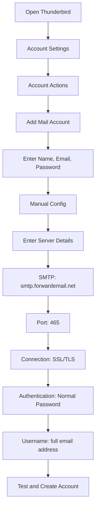

# Примеры интеграции SMTP {#smtp-integration-examples}

## Содержание {#table-of-contents}

* [Предисловие](#foreword)
* [Как работает обработка SMTP-сообщений Forward Email](#how-forward-emails-smtp-processing-works)
  * [Система очереди и повторных попыток отправки электронной почты](#email-queue-and-retry-system)
  * [Защита от фиктивных устройств для повышения надежности](#dummy-proofed-for-reliability)
* [Интеграция с Node.js](#nodejs-integration)
  * [Использование Nodemailer](#using-nodemailer)
  * [Использование Express.js](#using-expressjs)
* [Интеграция с Python](#python-integration)
  * [Использование smtplib](#using-smtplib)
  * [Использование Джанго](#using-django)
* [PHP-интеграция](#php-integration)
  * [Использование PHPMailer](#using-phpmailer)
  * [Использование Laravel](#using-laravel)
* [Интеграция Ruby](#ruby-integration)
  * [Использование Ruby Mail Gem](#using-ruby-mail-gem)
* [Интеграция Java](#java-integration)
  * [Использование API Java Mail](#using-javamail-api)
* [Конфигурация почтового клиента](#email-client-configuration)
  * [Тандерберд](#thunderbird)
  * [Apple Mail](#apple-mail)
  * [Gmail (Отправить письмо как)](#gmail-send-mail-as)
* [Поиск неисправностей](#troubleshooting)
  * [Распространенные проблемы и решения](#common-issues-and-solutions)
  * [Получение помощи](#getting-help)
* [Дополнительные ресурсы](#additional-resources)
* [Заключение](#conclusion)

## Предисловие {#foreword}

В этом руководстве представлены подробные примеры интеграции с SMTP-сервисом Forward Email с использованием различных языков программирования, фреймворков и почтовых клиентов. Наш SMTP-сервис разработан для обеспечения надежности, безопасности и простой интеграции с вашими существующими приложениями.

## Как работает обработка SMTP-сообщений при пересылке электронной почты {#how-forward-emails-smtp-processing-works}

Прежде чем углубляться в примеры интеграции, важно понять, как наша служба SMTP обрабатывает электронные письма:

### Система очереди и повторных попыток электронной почты {#email-queue-and-retry-system}

Когда вы отправляете электронное письмо через SMTP на наши серверы:

1. **Первоначальная обработка**: Электронное письмо проверяется, сканируется на наличие вредоносных программ и проверяется спам-фильтрами.
2. **Умная очередь**: Электронные письма помещаются в сложную систему очередей для доставки.
3. **Интеллектуальный механизм повторных попыток**: В случае временной ошибки доставки наша система:
* Проанализирует ответ об ошибке с помощью функции `getBounceInfo`.
* Определит, является ли проблема временной (например, «повторите попытку позже», «временно отложено») или постоянной (например, «пользователь неизвестен»).
* В случае временных проблем пометит письмо для повторной попытки.
* В случае постоянных проблем создаст уведомление о недоставке.
4. **5-дневный период повторных попыток**: Мы повторяем попытки доставки в течение 5 дней (аналогично отраслевым стандартам, таким как Postfix), давая время на решение временных проблем.
5. **Уведомления о статусе доставки**: Отправители получают уведомления о статусе своих электронных писем (доставлено, задержано или отскочил)

> \[!NOTE]
> После успешной доставки содержимое исходящего SMTP-сообщения редактируется по истечении настраиваемого срока хранения (по умолчанию 30 дней) в целях безопасности и конфиденциальности. Остаётся только сообщение-заполнитель, указывающее на успешную доставку.

### Защита от фиктивных устройств для надежности {#dummy-proofed-for-reliability}

Наша система предназначена для обработки различных крайних случаев:

* При обнаружении чёрного списка отправка письма будет автоматически повторена.
* При возникновении проблем с сетью будет предпринята повторная попытка доставки.
* Если почтовый ящик получателя переполнен, система повторит попытку позже.
* Если сервер получателя временно недоступен, мы продолжим попытки.

Такой подход значительно повышает скорость доставки, сохраняя при этом конфиденциальность и безопасность.

## Интеграция Node.js {#nodejs-integration}

### Использование Nodemailer {#using-nodemailer}

[Nodemailer](https://nodemailer.com/) — популярный модуль для отправки электронных писем из приложений Node.js.

```javascript
const nodemailer = require('nodemailer');

// Create a transporter object
const transporter = nodemailer.createTransport({
  host: 'smtp.forwardemail.net',
  port: 465,
  secure: true, // Use TLS
  auth: {
    user: 'your-username@your-domain.com',
    pass: 'your-password'
  }
});

// Send mail with defined transport object
async function sendEmail() {
  try {
    const info = await transporter.sendMail({
      from: '"Your Name" <your-username@your-domain.com>',
      to: 'recipient@example.com',
      subject: 'Hello from Forward Email',
      text: 'Hello world! This is a test email sent using Nodemailer and Forward Email SMTP.',
      html: '<b>Hello world!</b> This is a test email sent using Nodemailer and Forward Email SMTP.'
    });

    console.log('Message sent: %s', info.messageId);
  } catch (error) {
    console.error('Error sending email:', error);
  }
}

sendEmail();
```

### Использование Express.js {#using-expressjs}

Вот как интегрировать пересылку электронной почты SMTP с приложением Express.js:

```javascript
const express = require('express');
const nodemailer = require('nodemailer');
const app = express();
const port = 3000;

app.use(express.json());

// Configure email transporter
const transporter = nodemailer.createTransport({
  host: 'smtp.forwardemail.net',
  port: 465,
  secure: true,
  auth: {
    user: 'your-username@your-domain.com',
    pass: 'your-password'
  }
});

// API endpoint for sending emails
app.post('/send-email', async (req, res) => {
  const { to, subject, text, html } = req.body;

  try {
    const info = await transporter.sendMail({
      from: '"Your App" <your-username@your-domain.com>',
      to,
      subject,
      text,
      html
    });

    res.status(200).json({
      success: true,
      messageId: info.messageId
    });
  } catch (error) {
    console.error('Error sending email:', error);
    res.status(500).json({
      success: false,
      error: error.message
    });
  }
});

app.listen(port, () => {
  console.log(`Server running at http://localhost:${port}`);
});
```

## Интеграция Python {#python-integration}

### Использование smtplib {#using-smtplib}

```python
import smtplib
from email.mime.text import MIMEText
from email.mime.multipart import MIMEMultipart

# Email configuration
sender_email = "your-username@your-domain.com"
receiver_email = "recipient@example.com"
password = "your-password"

# Create message
message = MIMEMultipart("alternative")
message["Subject"] = "Hello from Forward Email"
message["From"] = sender_email
message["To"] = receiver_email

# Create the plain-text and HTML version of your message
text = "Hello world! This is a test email sent using Python and Forward Email SMTP."
html = "<html><body><b>Hello world!</b> This is a test email sent using Python and Forward Email SMTP.</body></html>"

# Turn these into plain/html MIMEText objects
part1 = MIMEText(text, "plain")
part2 = MIMEText(html, "html")

# Add HTML/plain-text parts to MIMEMultipart message
message.attach(part1)
message.attach(part2)

# Send email
try:
    server = smtplib.SMTP_SSL("smtp.forwardemail.net", 465)
    server.login(sender_email, password)
    server.sendmail(sender_email, receiver_email, message.as_string())
    server.quit()
    print("Email sent successfully!")
except Exception as e:
    print(f"Error sending email: {e}")
```

### Использование Django {#using-django}

Для приложений Django добавьте в `settings.py` следующее:

```python
# Email settings
EMAIL_BACKEND = 'django.core.mail.backends.smtp.EmailBackend'
EMAIL_HOST = 'smtp.forwardemail.net'
EMAIL_PORT = 465
EMAIL_USE_SSL = True
EMAIL_HOST_USER = 'your-username@your-domain.com'
EMAIL_HOST_PASSWORD = 'your-password'
DEFAULT_FROM_EMAIL = 'your-username@your-domain.com'
```

Затем отправьте электронное письмо с вашими мнениями:

```python
from django.core.mail import send_mail

def send_email_view(request):
    send_mail(
        'Subject here',
        'Here is the message.',
        'from@your-domain.com',
        ['to@example.com'],
        fail_silently=False,
        html_message='<b>Here is the HTML message.</b>'
    )
    return HttpResponse('Email sent!')
```

## Интеграция PHP {#php-integration}

### Использование PHPMailer {#using-phpmailer}

```php
<?php
use PHPMailer\PHPMailer\PHPMailer;
use PHPMailer\PHPMailer\Exception;

require 'vendor/autoload.php';

$mail = new PHPMailer(true);

try {
    // Server settings
    $mail->isSMTP();
    $mail->Host       = 'smtp.forwardemail.net';
    $mail->SMTPAuth   = true;
    $mail->Username   = 'your-username@your-domain.com';
    $mail->Password   = 'your-password';
    $mail->SMTPSecure = PHPMailer::ENCRYPTION_SMTPS;
    $mail->Port       = 465;

    // Recipients
    $mail->setFrom('your-username@your-domain.com', 'Your Name');
    $mail->addAddress('recipient@example.com', 'Recipient Name');
    $mail->addReplyTo('your-username@your-domain.com', 'Your Name');

    // Content
    $mail->isHTML(true);
    $mail->Subject = 'Hello from Forward Email';
    $mail->Body    = '<b>Hello world!</b> This is a test email sent using PHPMailer and Forward Email SMTP.';
    $mail->AltBody = 'Hello world! This is a test email sent using PHPMailer and Forward Email SMTP.';

    $mail->send();
    echo 'Message has been sent';
} catch (Exception $e) {
    echo "Message could not be sent. Mailer Error: {$mail->ErrorInfo}";
}
```

### Использование Laravel {#using-laravel}

Для приложений Laravel обновите файл `.env`:

```sh
MAIL_MAILER=smtp
MAIL_HOST=smtp.forwardemail.net
MAIL_PORT=465
MAIL_USERNAME=your-username@your-domain.com
MAIL_PASSWORD=your-password
MAIL_ENCRYPTION=ssl
MAIL_FROM_ADDRESS=your-username@your-domain.com
MAIL_FROM_NAME="${APP_NAME}"
```

Затем отправьте электронные письма, используя фасад Laravel Mail:

```php
<?php

namespace App\Http\Controllers;

use Illuminate\Http\Request;
use Illuminate\Support\Facades\Mail;
use App\Mail\WelcomeEmail;

class EmailController extends Controller
{
    public function sendEmail()
    {
        Mail::to('recipient@example.com')->send(new WelcomeEmail());

        return 'Email sent successfully!';
    }
}
```

## Интеграция Ruby {#ruby-integration}

### Использование Ruby Mail Gem {#using-ruby-mail-gem}

```ruby
require 'mail'

Mail.defaults do
  delivery_method :smtp, {
    address: 'smtp.forwardemail.net',
    port: 465,
    domain: 'your-domain.com',
    user_name: 'your-username@your-domain.com',
    password: 'your-password',
    authentication: 'plain',
    enable_starttls_auto: true,
    ssl: true
  }
end

mail = Mail.new do
  from     'your-username@your-domain.com'
  to       'recipient@example.com'
  subject  'Hello from Forward Email'

  text_part do
    body 'Hello world! This is a test email sent using Ruby Mail and Forward Email SMTP.'
  end

  html_part do
    content_type 'text/html; charset=UTF-8'
    body '<b>Hello world!</b> This is a test email sent using Ruby Mail and Forward Email SMTP.'
  end
end

mail.deliver!
puts "Email sent successfully!"
```

## Интеграция Java {#java-integration}

### Использование API JavaMail {#using-javamail-api}

```java
import java.util.Properties;
import javax.mail.*;
import javax.mail.internet.*;

public class SendEmail {
    public static void main(String[] args) {
        // Sender's email and password
        final String username = "your-username@your-domain.com";
        final String password = "your-password";

        // SMTP server properties
        Properties props = new Properties();
        props.put("mail.smtp.auth", "true");
        props.put("mail.smtp.starttls.enable", "true");
        props.put("mail.smtp.host", "smtp.forwardemail.net");
        props.put("mail.smtp.port", "465");
        props.put("mail.smtp.socketFactory.port", "465");
        props.put("mail.smtp.socketFactory.class", "javax.net.ssl.SSLSocketFactory");

        // Create session with authenticator
        Session session = Session.getInstance(props,
            new javax.mail.Authenticator() {
                protected PasswordAuthentication getPasswordAuthentication() {
                    return new PasswordAuthentication(username, password);
                }
            });

        try {
            // Create message
            Message message = new MimeMessage(session);
            message.setFrom(new InternetAddress(username));
            message.setRecipients(Message.RecipientType.TO, InternetAddress.parse("recipient@example.com"));
            message.setSubject("Hello from Forward Email");

            // Create multipart message
            Multipart multipart = new MimeMultipart("alternative");

            // Text part
            BodyPart textPart = new MimeBodyPart();
            textPart.setText("Hello world! This is a test email sent using JavaMail and Forward Email SMTP.");

            // HTML part
            BodyPart htmlPart = new MimeBodyPart();
            htmlPart.setContent("<b>Hello world!</b> This is a test email sent using JavaMail and Forward Email SMTP.", "text/html");

            // Add parts to multipart
            multipart.addBodyPart(textPart);
            multipart.addBodyPart(htmlPart);

            // Set content
            message.setContent(multipart);

            // Send message
            Transport.send(message);

            System.out.println("Email sent successfully!");

        } catch (MessagingException e) {
            throw new RuntimeException(e);
        }
    }
}
```

## Конфигурация почтового клиента {#email-client-configuration}

### Thunderbird {#thunderbird}



1. Откройте Thunderbird и перейдите в раздел «Настройки учётной записи».
2. Нажмите «Действия учётной записи» и выберите «Добавить учётную запись электронной почты».
3. Введите своё имя, адрес электронной почты и пароль.
4. Нажмите «Ручная настройка» и введите следующие данные:
* Входящий сервер:
* IMAP: imap.forwardemail.net, порт: 993, SSL/TLS
* POP3: pop3.forwardemail.net, порт: 995, SSL/TLS
* Исходящий сервер (SMTP): smtp.forwardemail.net, порт: 465, SSL/TLS
* Аутентификация: обычная, пароль
* Имя пользователя: ваш полный адрес электронной почты.
5. Нажмите «Тест», а затем «Готово».

### Apple Mail {#apple-mail}

1. Откройте Почту и перейдите в раздел «Почта» > «Настройки» > «Учётные записи».
2. Нажмите кнопку «+», чтобы добавить новую учётную запись.
3. Выберите «Другая учётная запись электронной почты» и нажмите «Продолжить».
4. Введите своё имя, адрес электронной почты и пароль, затем нажмите «Войти».
5. Если автоматическая настройка не удалась, введите следующие данные:
* Сервер входящей почты: imap.forwardemail.net (или pop3.forwardemail.net для POP3).
* Сервер исходящей почты: smtp.forwardemail.net.
* Имя пользователя: ваш полный адрес электронной почты.
* Пароль: ваш пароль.
6. Нажмите «Войти», чтобы завершить настройку.

### Gmail (Отправить письмо как) {#gmail-send-mail-as}

1. Откройте Gmail и перейдите в раздел «Настройки» > «Учётные записи и импорт».
2. В разделе «Отправлять почту как» нажмите «Добавить другой адрес электронной почты».
3. Введите своё имя и адрес электронной почты, затем нажмите «Далее».
4. Введите следующие данные SMTP-сервера:
* SMTP-сервер: smtp.forwardemail.net
* Порт: 465
* Имя пользователя: ваш полный адрес электронной почты
* Пароль: ваш пароль
* Выберите «Защищённое соединение с использованием SSL».
5. Нажмите «Добавить учётную запись» и подтвердите свой адрес электронной почты.

## Устранение неполадок {#troubleshooting}

### Распространенные проблемы и решения {#common-issues-and-solutions}

1. **Ошибка аутентификации**
* Проверьте имя пользователя (полный адрес электронной почты) и пароль
* Убедитесь, что вы используете правильный порт (465 для SSL/TLS)
* Проверьте, включён ли в вашей учётной записи доступ по протоколу SMTP

2. **Время ожидания подключения**
* Проверьте подключение к Интернету
* Убедитесь, что настройки брандмауэра не блокируют SMTP-трафик
* Попробуйте использовать другой порт (587 с STARTTLS)

3. **Сообщение отклонено**
* Убедитесь, что адрес отправителя совпадает с вашим аутентифицированным адресом электронной почты.
* Проверьте, не занесён ли ваш IP-адрес в чёрный список.
* Убедитесь, что содержимое вашего сообщения не попадает под спам-фильтры.

4. **Ошибки TLS/SSL**
* Обновите приложение/библиотеку для поддержки современных версий TLS
* Убедитесь, что сертификаты CA вашей системы актуальны
* Попробуйте использовать явный TLS вместо неявного

### Получение помощи {#getting-help}

Если у вас возникли проблемы, не описанные здесь, пожалуйста:

1. Проверьте раздел [Страница часто задаваемых вопросов](/faq) для ответов на часто задаваемые вопросы.
2. Ознакомьтесь с разделом [запись в блоге о доставке электронной почты](/blog/docs/best-email-forwarding-service) для получения подробной информации.
3. Свяжитесь с нашей службой поддержки по адресу <support@forwardemail.net>.

## Дополнительные ресурсы {#additional-resources}

* [Пересылка документации по электронной почте](/docs)
* [Ограничения и конфигурация SMTP-сервера](/faq#what-are-your-outbound-smtp-limits)
* [Руководство по передовой практике использования электронной почты](/blog/docs/best-email-forwarding-service)
* [Практики обеспечения безопасности](/security)

## Заключение {#conclusion}

SMTP-сервис Forward Email обеспечивает надёжную, безопасную и конфиденциальную отправку писем из ваших приложений и почтовых клиентов. Благодаря нашей интеллектуальной системе очередей, 5-дневному механизму повторных попыток и подробным уведомлениям о доставке вы можете быть уверены, что ваши письма дойдут до адресата.

Для более сложных вариантов использования или индивидуальных интеграций обратитесь в нашу службу поддержки.