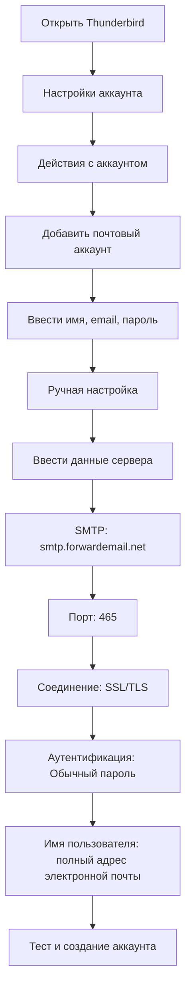

# Примеры интеграции SMTP {#smtp-integration-examples}


## Содержание {#table-of-contents}

* [Предисловие](#foreword)
* [Как работает SMTP-обработка Forward Email](#how-forward-emails-smtp-processing-works)
  * [Очередь писем и система повторных попыток](#email-queue-and-retry-system)
  * [Защищено от ошибок для надежности](#dummy-proofed-for-reliability)
* [Интеграция с Node.js](#nodejs-integration)
  * [Использование Nodemailer](#using-nodemailer)
  * [Использование Express.js](#using-expressjs)
* [Интеграция с Python](#python-integration)
  * [Использование smtplib](#using-smtplib)
  * [Использование Django](#using-django)
* [Интеграция с PHP](#php-integration)
  * [Использование PHPMailer](#using-phpmailer)
  * [Использование Laravel](#using-laravel)
* [Интеграция с Ruby](#ruby-integration)
  * [Использование Ruby Mail Gem](#using-ruby-mail-gem)
* [Интеграция с Java](#java-integration)
  * [Использование JavaMail API](#using-javamail-api)
* [Настройка почтового клиента](#email-client-configuration)
  * [Thunderbird](#thunderbird)
  * [Apple Mail](#apple-mail)
  * [Gmail (Отправка письма от имени)](#gmail-send-mail-as)
* [Устранение неполадок](#troubleshooting)
  * [Распространённые проблемы и решения](#common-issues-and-solutions)
  * [Получение помощи](#getting-help)
* [Дополнительные ресурсы](#additional-resources)
* [Заключение](#conclusion)


## Предисловие {#foreword}

Это руководство содержит подробные примеры того, как интегрироваться с SMTP-сервисом Forward Email, используя различные языки программирования, фреймворки и почтовые клиенты. Наш SMTP-сервис разработан так, чтобы быть надежным, безопасным и простым для интеграции с вашими существующими приложениями.


## Как работает SMTP-обработка Forward Email {#how-forward-emails-smtp-processing-works}

Прежде чем перейти к примерам интеграции, важно понять, как наш SMTP-сервис обрабатывает письма:

### Очередь писем и система повторных попыток {#email-queue-and-retry-system}

Когда вы отправляете письмо через SMTP на наши серверы:

1. **Первичная обработка**: письмо проверяется, сканируется на наличие вредоносного ПО и проверяется на спам-фильтры
2. **Умная очередь**: письма помещаются в сложную систему очередей для доставки
3. **Интеллектуальный механизм повторных попыток**: если доставка временно не удалась, наша система:
   * Анализирует ответ об ошибке с помощью функции `getBounceInfo`
   * Определяет, является ли проблема временной (например, «попробуйте позже», «временно отложено») или постоянной (например, «пользователь не найден»)
   * Для временных проблем помечает письмо для повторной попытки
   * Для постоянных проблем генерирует уведомление о недоставке
4. **Период повторных попыток 5 дней**: мы повторяем попытки доставки до 5 дней (аналогично отраслевым стандартам, таким как Postfix), давая время для решения временных проблем
5. **Уведомления о статусе доставки**: отправители получают уведомления о статусе своих писем (доставлено, задержано или возвращено)

> \[!NOTE]
> После успешной доставки содержимое исходящего SMTP-письма удаляется после настраиваемого периода хранения (по умолчанию 30 дней) для обеспечения безопасности и конфиденциальности. Остаётся только сообщение-заполнитель, указывающее на успешную доставку.

### Защищено от ошибок для надежности {#dummy-proofed-for-reliability}

Наша система разработана для обработки различных крайних случаев:

* Если обнаружен блоклист, письмо автоматически повторно отправляется
* Если возникают сетевые проблемы, доставка будет повторена
* Если почтовый ящик получателя заполнен, система повторит попытку позже
* Если сервер получателя временно недоступен, мы продолжим попытки

Такой подход значительно повышает процент успешной доставки, сохраняя при этом конфиденциальность и безопасность.


## Интеграция с Node.js {#nodejs-integration}

### Использование Nodemailer {#using-nodemailer}

[Nodemailer](https://nodemailer.com/) — популярный модуль для отправки писем из приложений Node.js.

```javascript
const nodemailer = require('nodemailer');

// Создаём объект транспортера
const transporter = nodemailer.createTransport({
  host: 'smtp.forwardemail.net',
  port: 465,
  secure: true, // Использовать TLS
  auth: {
    user: 'your-username@your-domain.com',
    pass: 'your-password'
  }
});

// Отправка письма с использованием определённого транспортера
async function sendEmail() {
  try {
    const info = await transporter.sendMail({
      from: '"Ваше имя" <your-username@your-domain.com>',
      to: 'recipient@example.com',
      subject: 'Привет от Forward Email',
      text: 'Привет, мир! Это тестовое письмо, отправленное с помощью Nodemailer и SMTP Forward Email.',
      html: '<b>Привет, мир!</b> Это тестовое письмо, отправленное с помощью Nodemailer и SMTP Forward Email.'
    });

    console.log('Сообщение отправлено: %s', info.messageId);
  } catch (error) {
    console.error('Ошибка при отправке письма:', error);
  }
}

sendEmail();
```
### Использование Express.js {#using-expressjs}

Вот как интегрировать Forward Email SMTP с приложением Express.js:

```javascript
const express = require('express');
const nodemailer = require('nodemailer');
const app = express();
const port = 3000;

app.use(express.json());

// Настройка транспортера для отправки почты
const transporter = nodemailer.createTransport({
  host: 'smtp.forwardemail.net',
  port: 465,
  secure: true,
  auth: {
    user: 'your-username@your-domain.com',
    pass: 'your-password'
  }
});

// API endpoint для отправки писем
app.post('/send-email', async (req, res) => {
  const { to, subject, text, html } = req.body;

  try {
    const info = await transporter.sendMail({
      from: '"Your App" <your-username@your-domain.com>',
      to,
      subject,
      text,
      html
    });

    res.status(200).json({
      success: true,
      messageId: info.messageId
    });
  } catch (error) {
    console.error('Ошибка при отправке письма:', error);
    res.status(500).json({
      success: false,
      error: error.message
    });
  }
});

app.listen(port, () => {
  console.log(`Сервер запущен по адресу http://localhost:${port}`);
});
```


## Интеграция с Python {#python-integration}

### Использование smtplib {#using-smtplib}

```python
import smtplib
from email.mime.text import MIMEText
from email.mime.multipart import MIMEMultipart

# Конфигурация электронной почты
sender_email = "your-username@your-domain.com"
receiver_email = "recipient@example.com"
password = "your-password"

# Создание сообщения
message = MIMEMultipart("alternative")
message["Subject"] = "Привет от Forward Email"
message["From"] = sender_email
message["To"] = receiver_email

# Создание текстовой и HTML версии сообщения
text = "Привет, мир! Это тестовое письмо, отправленное с помощью Python и Forward Email SMTP."
html = "<html><body><b>Привет, мир!</b> Это тестовое письмо, отправленное с помощью Python и Forward Email SMTP.</body></html>"

# Преобразование в объекты MIMEText для plain/html
part1 = MIMEText(text, "plain")
part2 = MIMEText(html, "html")

# Добавление частей HTML/plain-text в сообщение MIMEMultipart
message.attach(part1)
message.attach(part2)

# Отправка письма
try:
    server = smtplib.SMTP_SSL("smtp.forwardemail.net", 465)
    server.login(sender_email, password)
    server.sendmail(sender_email, receiver_email, message.as_string())
    server.quit()
    print("Письмо успешно отправлено!")
except Exception as e:
    print(f"Ошибка при отправке письма: {e}")
```

### Использование Django {#using-django}

Для приложений Django добавьте следующее в ваш `settings.py`:

```python
# Настройки электронной почты
EMAIL_BACKEND = 'django.core.mail.backends.smtp.EmailBackend'
EMAIL_HOST = 'smtp.forwardemail.net'
EMAIL_PORT = 465
EMAIL_USE_SSL = True
EMAIL_HOST_USER = 'your-username@your-domain.com'
EMAIL_HOST_PASSWORD = 'your-password'
DEFAULT_FROM_EMAIL = 'your-username@your-domain.com'
```

Затем отправляйте письма в ваших представлениях:

```python
from django.core.mail import send_mail

def send_email_view(request):
    send_mail(
        'Тема письма',
        'Вот сообщение.',
        'from@your-domain.com',
        ['to@example.com'],
        fail_silently=False,
        html_message='<b>Вот HTML сообщение.</b>'
    )
    return HttpResponse('Письмо отправлено!')
```


## Интеграция с PHP {#php-integration}

### Использование PHPMailer {#using-phpmailer}

```php
<?php
use PHPMailer\PHPMailer\PHPMailer;
use PHPMailer\PHPMailer\Exception;

require 'vendor/autoload.php';

$mail = new PHPMailer(true);

try {
    // Настройки сервера
    $mail->isSMTP();
    $mail->Host       = 'smtp.forwardemail.net';
    $mail->SMTPAuth   = true;
    $mail->Username   = 'your-username@your-domain.com';
    $mail->Password   = 'your-password';
    $mail->SMTPSecure = PHPMailer::ENCRYPTION_SMTPS;
    $mail->Port       = 465;

    // Получатели
    $mail->setFrom('your-username@your-domain.com', 'Ваше имя');
    $mail->addAddress('recipient@example.com', 'Имя получателя');
    $mail->addReplyTo('your-username@your-domain.com', 'Ваше имя');

    // Содержимое
    $mail->isHTML(true);
    $mail->Subject = 'Привет от Forward Email';
    $mail->Body    = '<b>Привет, мир!</b> Это тестовое письмо, отправленное с помощью PHPMailer и Forward Email SMTP.';
    $mail->AltBody = 'Привет, мир! Это тестовое письмо, отправленное с помощью PHPMailer и Forward Email SMTP.';

    $mail->send();
    echo 'Сообщение отправлено';
} catch (Exception $e) {
    echo "Сообщение не может быть отправлено. Ошибка Mailer: {$mail->ErrorInfo}";
}
```
### Использование Laravel {#using-laravel}

Для приложений Laravel обновите ваш файл `.env`:

```sh
MAIL_MAILER=smtp
MAIL_HOST=smtp.forwardemail.net
MAIL_PORT=465
MAIL_USERNAME=your-username@your-domain.com
MAIL_PASSWORD=your-password
MAIL_ENCRYPTION=ssl
MAIL_FROM_ADDRESS=your-username@your-domain.com
MAIL_FROM_NAME="${APP_NAME}"
```

Затем отправляйте письма, используя фасад Mail Laravel:

```php
<?php

namespace App\Http\Controllers;

use Illuminate\Http\Request;
use Illuminate\Support\Facades\Mail;
use App\Mail\WelcomeEmail;

class EmailController extends Controller
{
    public function sendEmail()
    {
        Mail::to('recipient@example.com')->send(new WelcomeEmail());

        return 'Письмо успешно отправлено!';
    }
}
```


## Интеграция с Ruby {#ruby-integration}

### Использование Ruby Mail Gem {#using-ruby-mail-gem}

```ruby
require 'mail'

Mail.defaults do
  delivery_method :smtp, {
    address: 'smtp.forwardemail.net',
    port: 465,
    domain: 'your-domain.com',
    user_name: 'your-username@your-domain.com',
    password: 'your-password',
    authentication: 'plain',
    enable_starttls_auto: true,
    ssl: true
  }
end

mail = Mail.new do
  from     'your-username@your-domain.com'
  to       'recipient@example.com'
  subject  'Привет от Forward Email'

  text_part do
    body 'Привет, мир! Это тестовое письмо, отправленное с помощью Ruby Mail и Forward Email SMTP.'
  end

  html_part do
    content_type 'text/html; charset=UTF-8'
    body '<b>Привет, мир!</b> Это тестовое письмо, отправленное с помощью Ruby Mail и Forward Email SMTP.'
  end
end

mail.deliver!
puts "Письмо успешно отправлено!"
```


## Интеграция с Java {#java-integration}

### Использование JavaMail API {#using-javamail-api}

```java
import java.util.Properties;
import javax.mail.*;
import javax.mail.internet.*;

public class SendEmail {
    public static void main(String[] args) {
        // Электронная почта и пароль отправителя
        final String username = "your-username@your-domain.com";
        final String password = "your-password";

        // Свойства SMTP сервера
        Properties props = new Properties();
        props.put("mail.smtp.auth", "true");
        props.put("mail.smtp.starttls.enable", "true");
        props.put("mail.smtp.host", "smtp.forwardemail.net");
        props.put("mail.smtp.port", "465");
        props.put("mail.smtp.socketFactory.port", "465");
        props.put("mail.smtp.socketFactory.class", "javax.net.ssl.SSLSocketFactory");

        // Создание сессии с аутентификатором
        Session session = Session.getInstance(props,
            new javax.mail.Authenticator() {
                protected PasswordAuthentication getPasswordAuthentication() {
                    return new PasswordAuthentication(username, password);
                }
            });

        try {
            // Создание сообщения
            Message message = new MimeMessage(session);
            message.setFrom(new InternetAddress(username));
            message.setRecipients(Message.RecipientType.TO, InternetAddress.parse("recipient@example.com"));
            message.setSubject("Привет от Forward Email");

            // Создание multipart сообщения
            Multipart multipart = new MimeMultipart("alternative");

            // Текстовая часть
            BodyPart textPart = new MimeBodyPart();
            textPart.setText("Привет, мир! Это тестовое письмо, отправленное с помощью JavaMail и Forward Email SMTP.");

            // HTML часть
            BodyPart htmlPart = new MimeBodyPart();
            htmlPart.setContent("<b>Привет, мир!</b> Это тестовое письмо, отправленное с помощью JavaMail и Forward Email SMTP.", "text/html");

            // Добавление частей в multipart
            multipart.addBodyPart(textPart);
            multipart.addBodyPart(htmlPart);

            // Установка содержимого
            message.setContent(multipart);

            // Отправка сообщения
            Transport.send(message);

            System.out.println("Письмо успешно отправлено!");

        } catch (MessagingException e) {
            throw new RuntimeException(e);
        }
    }
}
```


## Настройка почтового клиента {#email-client-configuration}

### Thunderbird {#thunderbird}


```mermaid
flowchart TD
    A[Открыть Thunderbird] --> B[Настройки аккаунта]
    B --> C[Действия с аккаунтом]
    C --> D[Добавить почтовый аккаунт]
    D --> E[Ввести имя, email, пароль]
    E --> F[Ручная настройка]
    F --> G[Ввести данные сервера]
    G --> H[SMTP: smtp.forwardemail.net]
    H --> I[Порт: 465]
    I --> J[Соединение: SSL/TLS]
    J --> K[Аутентификация: Обычный пароль]
    K --> L[Имя пользователя: полный адрес электронной почты]
    L --> M[Тест и создание аккаунта]
```
1. Откройте Thunderbird и перейдите в Настройки аккаунта  
2. Нажмите «Действия с аккаунтом» и выберите «Добавить почтовый аккаунт»  
3. Введите ваше имя, адрес электронной почты и пароль  
4. Нажмите «Ручная настройка» и введите следующие данные:  
   * Входящий сервер:  
     * IMAP: imap.forwardemail.net, Порт: 993, SSL/TLS  
     * POP3: pop3.forwardemail.net, Порт: 995, SSL/TLS  
   * Исходящий сервер (SMTP): smtp.forwardemail.net, Порт: 465, SSL/TLS  
   * Аутентификация: Обычный пароль  
   * Имя пользователя: ваш полный адрес электронной почты  
5. Нажмите «Тест» и затем «Готово»  

### Apple Mail {#apple-mail}

1. Откройте Mail и перейдите в Почта > Настройки > Аккаунты  
2. Нажмите кнопку «+», чтобы добавить новый аккаунт  
3. Выберите «Другой почтовый аккаунт» и нажмите «Продолжить»  
4. Введите ваше имя, адрес электронной почты и пароль, затем нажмите «Войти»  
5. Если автоматическая настройка не удалась, введите следующие данные:  
   * Входящий почтовый сервер: imap.forwardemail.net (или pop3.forwardemail.net для POP3)  
   * Исходящий почтовый сервер: smtp.forwardemail.net  
   * Имя пользователя: ваш полный адрес электронной почты  
   * Пароль: ваш пароль  
6. Нажмите «Войти», чтобы завершить настройку  

### Gmail (Отправка почты от имени) {#gmail-send-mail-as}

1. Откройте Gmail и перейдите в Настройки > Аккаунты и импорт  
2. В разделе «Отправлять почту как» нажмите «Добавить другой адрес электронной почты»  
3. Введите ваше имя и адрес электронной почты, затем нажмите «Следующий шаг»  
4. Введите следующие данные SMTP-сервера:  
   * SMTP-сервер: smtp.forwardemail.net  
   * Порт: 465  
   * Имя пользователя: ваш полный адрес электронной почты  
   * Пароль: ваш пароль  
   * Выберите «Защищённое соединение с использованием SSL»  
5. Нажмите «Добавить аккаунт» и подтвердите ваш адрес электронной почты  

## Устранение неполадок {#troubleshooting}

### Распространённые проблемы и решения {#common-issues-and-solutions}

1. **Ошибка аутентификации**  
   * Проверьте ваше имя пользователя (полный адрес электронной почты) и пароль  
   * Убедитесь, что используете правильный порт (465 для SSL/TLS)  
   * Проверьте, включён ли у вашего аккаунта доступ к SMTP  

2. **Тайм-аут соединения**  
   * Проверьте ваше интернет-соединение  
   * Убедитесь, что настройки брандмауэра не блокируют SMTP-трафик  
   * Попробуйте использовать порт 465 с SSL/TLS (рекомендуется) или порт 587 с STARTTLS  

3. **Сообщение отклонено**  
   * Убедитесь, что адрес «От» совпадает с вашим аутентифицированным адресом электронной почты  
   * Проверьте, не находится ли ваш IP в чёрном списке  
   * Убедитесь, что содержимое сообщения не вызывает срабатывание спам-фильтров  

4. **Ошибки TLS/SSL**  
   * Обновите ваше приложение/библиотеку для поддержки современных версий TLS  
   * Убедитесь, что сертификаты CA вашей системы актуальны  
   * Попробуйте использовать явный TLS вместо неявного TLS  

### Получение помощи {#getting-help}

Если вы столкнулись с проблемами, не описанными здесь, пожалуйста:  

1. Ознакомьтесь с нашей [страницей FAQ](/faq) для часто задаваемых вопросов  
2. Просмотрите наш [пост в блоге о доставке электронной почты](/blog/docs/best-email-forwarding-service) для подробной информации  
3. Свяжитесь с нашей службой поддержки по адресу <support@forwardemail.net>  

## Дополнительные ресурсы {#additional-resources}

* [Документация Forward Email](/docs)  
* [Ограничения и настройка SMTP-сервера](/faq#what-are-your-outbound-smtp-limits)  
* [Руководство по лучшим практикам электронной почты](/blog/docs/best-email-forwarding-service)  
* [Практики безопасности](/security)  

## Заключение {#conclusion}

SMTP-сервис Forward Email предоставляет надёжный, безопасный и ориентированный на конфиденциальность способ отправки писем из ваших приложений и почтовых клиентов. Благодаря нашей интеллектуальной системе очередей, механизму повторных попыток в течение 5 дней и комплексным уведомлениям о статусе доставки вы можете быть уверены, что ваши письма достигнут адресата.  

Для более сложных случаев использования или индивидуальных интеграций, пожалуйста, свяжитесь с нашей службой поддержки.
