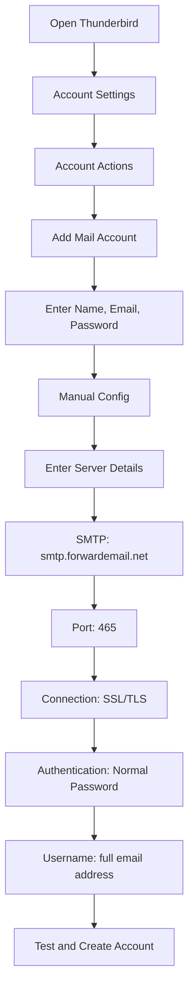

# Exempel på SMTP-integrationer {#smtp-integration-examples}

## Innehållsförteckning {#table-of-contents}

* [Förord](#foreword)
* [Hur vidarebefordran av e-posts SMTP-behandling fungerar](#how-forward-emails-smtp-processing-works)
  * [E-postkö och system för återförsök](#email-queue-and-retry-system)
  * [Testad för tillförlitlighet](#dummy-proofed-for-reliability)
* [Node.js-integration](#nodejs-integration)
  * [Använda Nodemailer](#using-nodemailer)
  * [Använda Express.js](#using-expressjs)
* [Python-integration](#python-integration)
  * [Använda smtplib](#using-smtplib)
  * [Använda Django](#using-django)
* [PHP-integration](#php-integration)
  * [Använda PHPMailer](#using-phpmailer)
  * [Använda Laravel](#using-laravel)
* [Ruby-integration](#ruby-integration)
  * [Använda Ruby Mail Gem](#using-ruby-mail-gem)
* [Java-integration](#java-integration)
  * [Använda Java Mail API](#using-javamail-api)
* [Konfiguration av e-postklient](#email-client-configuration)
  * [Thunderbird](#thunderbird)
  * [Apple Mail](#apple-mail)
  * [Gmail (Skicka e-post som)](#gmail-send-mail-as)
* [Felsökning](#troubleshooting)
  * [Vanliga problem och lösningar](#common-issues-and-solutions)
  * [Få hjälp](#getting-help)
* [Ytterligare resurser](#additional-resources)
* [Slutsats](#conclusion)

## Förord {#foreword}

Den här guiden ger detaljerade exempel på hur man integrerar med Forward Emails SMTP-tjänst med hjälp av olika programmeringsspråk, ramverk och e-postklienter. Vår SMTP-tjänst är utformad för att vara tillförlitlig, säker och enkel att integrera med dina befintliga applikationer.

## Hur vidarebefordran av e-posts SMTP-behandling fungerar {#how-forward-emails-smtp-processing-works}

Innan vi går in på integrationsexemplen är det viktigt att förstå hur vår SMTP-tjänst behandlar e-postmeddelanden:

### E-postkö och system för återförsök {#email-queue-and-retry-system}

När du skickar ett e-postmeddelande via SMTP till våra servrar:

1. **Initial bearbetning**: E-postmeddelandet valideras, skannas efter skadlig kod och kontrolleras mot skräppostfilter
2. **Smart köhantering**: E-postmeddelanden placeras i ett sofistikerat kösystem för leverans
3. **Intelligent försöksmekanism**: Om leveransen misslyckas tillfälligt kommer vårt system att:
* Analysera felsvaret med hjälp av vår `getBounceInfo`-funktion
* Avgöra om problemet är tillfälligt (t.ex. "försök igen senare", "tillfälligt uppskjutet") eller permanent (t.ex. "okänd användare")
* Vid tillfälliga problem, markera e-postmeddelandet för försök igen
* Vid permanenta problem, generera en avvisningsavisering
4. **5-dagars försöksperiod**: Vi försöker leverera igen i upp till 5 dagar (liknande branschstandarder som Postfix), vilket ger tillfälliga problem tid att lösa
5. **Aviseringar om leveransstatus**: Avsändare får aviseringar om statusen för sina e-postmeddelanden (levererade, försenade eller avvisade)

> \[!NOTE]
> Efter lyckad leverans redigeras utgående SMTP-e-postinnehåll efter en konfigurerbar kvarhållningsperiod (standard 30 dagar) för säkerhet och integritet. Endast ett platshållarmeddelande återstår som indikerar lyckad leverans.

### Dummy-säker för tillförlitlighet {#dummy-proofed-for-reliability}

Vårt system är utformat för att hantera olika marginalfall:

* Om en blockeringslista upptäcks kommer e-postmeddelandet automatiskt att försökas skickas igen.
* Om nätverksproblem uppstår kommer leveransförsöket att göras igen.
* Om mottagarens inkorg är full kommer systemet att försöka igen senare.
* Om den mottagande servern tillfälligt inte är tillgänglig kommer vi att fortsätta försöka.

Denna metod förbättrar leveranshastigheterna avsevärt samtidigt som integritet och säkerhet bibehålls.

## Node.js-integration {#nodejs-integration}

### Använder Nodemailer {#using-nodemailer}

[Nodemailer](https://nodemailer.com/) är en populär modul för att skicka e-postmeddelanden från Node.js-applikationer.

```javascript
const nodemailer = require('nodemailer');

// Create a transporter object
const transporter = nodemailer.createTransport({
  host: 'smtp.forwardemail.net',
  port: 465,
  secure: true, // Use TLS
  auth: {
    user: 'your-username@your-domain.com',
    pass: 'your-password'
  }
});

// Send mail with defined transport object
async function sendEmail() {
  try {
    const info = await transporter.sendMail({
      from: '"Your Name" <your-username@your-domain.com>',
      to: 'recipient@example.com',
      subject: 'Hello from Forward Email',
      text: 'Hello world! This is a test email sent using Nodemailer and Forward Email SMTP.',
      html: '<b>Hello world!</b> This is a test email sent using Nodemailer and Forward Email SMTP.'
    });

    console.log('Message sent: %s', info.messageId);
  } catch (error) {
    console.error('Error sending email:', error);
  }
}

sendEmail();
```

### Använder Express.js {#using-expressjs}

Så här integrerar du vidarebefordran av e-post via SMTP med en Express.js-applikation:

```javascript
const express = require('express');
const nodemailer = require('nodemailer');
const app = express();
const port = 3000;

app.use(express.json());

// Configure email transporter
const transporter = nodemailer.createTransport({
  host: 'smtp.forwardemail.net',
  port: 465,
  secure: true,
  auth: {
    user: 'your-username@your-domain.com',
    pass: 'your-password'
  }
});

// API endpoint for sending emails
app.post('/send-email', async (req, res) => {
  const { to, subject, text, html } = req.body;

  try {
    const info = await transporter.sendMail({
      from: '"Your App" <your-username@your-domain.com>',
      to,
      subject,
      text,
      html
    });

    res.status(200).json({
      success: true,
      messageId: info.messageId
    });
  } catch (error) {
    console.error('Error sending email:', error);
    res.status(500).json({
      success: false,
      error: error.message
    });
  }
});

app.listen(port, () => {
  console.log(`Server running at http://localhost:${port}`);
});
```

## Python-integration {#python-integration}

### Använder smtplib {#using-smtplib}

```python
import smtplib
from email.mime.text import MIMEText
from email.mime.multipart import MIMEMultipart

# Email configuration
sender_email = "your-username@your-domain.com"
receiver_email = "recipient@example.com"
password = "your-password"

# Create message
message = MIMEMultipart("alternative")
message["Subject"] = "Hello from Forward Email"
message["From"] = sender_email
message["To"] = receiver_email

# Create the plain-text and HTML version of your message
text = "Hello world! This is a test email sent using Python and Forward Email SMTP."
html = "<html><body><b>Hello world!</b> This is a test email sent using Python and Forward Email SMTP.</body></html>"

# Turn these into plain/html MIMEText objects
part1 = MIMEText(text, "plain")
part2 = MIMEText(html, "html")

# Add HTML/plain-text parts to MIMEMultipart message
message.attach(part1)
message.attach(part2)

# Send email
try:
    server = smtplib.SMTP_SSL("smtp.forwardemail.net", 465)
    server.login(sender_email, password)
    server.sendmail(sender_email, receiver_email, message.as_string())
    server.quit()
    print("Email sent successfully!")
except Exception as e:
    print(f"Error sending email: {e}")
```

### Använder Django {#using-django}

För Django-applikationer, lägg till följande i din `settings.py`:

```python
# Email settings
EMAIL_BACKEND = 'django.core.mail.backends.smtp.EmailBackend'
EMAIL_HOST = 'smtp.forwardemail.net'
EMAIL_PORT = 465
EMAIL_USE_SSL = True
EMAIL_HOST_USER = 'your-username@your-domain.com'
EMAIL_HOST_PASSWORD = 'your-password'
DEFAULT_FROM_EMAIL = 'your-username@your-domain.com'
```

Skicka sedan e-postmeddelanden i dina vyer:

```python
from django.core.mail import send_mail

def send_email_view(request):
    send_mail(
        'Subject here',
        'Here is the message.',
        'from@your-domain.com',
        ['to@example.com'],
        fail_silently=False,
        html_message='<b>Here is the HTML message.</b>'
    )
    return HttpResponse('Email sent!')
```

## PHP-integration {#php-integration}

### Använder PHPMailer {#using-phpmailer}

```php
<?php
use PHPMailer\PHPMailer\PHPMailer;
use PHPMailer\PHPMailer\Exception;

require 'vendor/autoload.php';

$mail = new PHPMailer(true);

try {
    // Server settings
    $mail->isSMTP();
    $mail->Host       = 'smtp.forwardemail.net';
    $mail->SMTPAuth   = true;
    $mail->Username   = 'your-username@your-domain.com';
    $mail->Password   = 'your-password';
    $mail->SMTPSecure = PHPMailer::ENCRYPTION_SMTPS;
    $mail->Port       = 465;

    // Recipients
    $mail->setFrom('your-username@your-domain.com', 'Your Name');
    $mail->addAddress('recipient@example.com', 'Recipient Name');
    $mail->addReplyTo('your-username@your-domain.com', 'Your Name');

    // Content
    $mail->isHTML(true);
    $mail->Subject = 'Hello from Forward Email';
    $mail->Body    = '<b>Hello world!</b> This is a test email sent using PHPMailer and Forward Email SMTP.';
    $mail->AltBody = 'Hello world! This is a test email sent using PHPMailer and Forward Email SMTP.';

    $mail->send();
    echo 'Message has been sent';
} catch (Exception $e) {
    echo "Message could not be sent. Mailer Error: {$mail->ErrorInfo}";
}
```

### Använder Laravel {#using-laravel}

För Laravel-applikationer, uppdatera din `.env`-fil:

```sh
MAIL_MAILER=smtp
MAIL_HOST=smtp.forwardemail.net
MAIL_PORT=465
MAIL_USERNAME=your-username@your-domain.com
MAIL_PASSWORD=your-password
MAIL_ENCRYPTION=ssl
MAIL_FROM_ADDRESS=your-username@your-domain.com
MAIL_FROM_NAME="${APP_NAME}"
```

Skicka sedan e-postmeddelanden med Laravels Mail-fasad:

```php
<?php

namespace App\Http\Controllers;

use Illuminate\Http\Request;
use Illuminate\Support\Facades\Mail;
use App\Mail\WelcomeEmail;

class EmailController extends Controller
{
    public function sendEmail()
    {
        Mail::to('recipient@example.com')->send(new WelcomeEmail());

        return 'Email sent successfully!';
    }
}
```

## Ruby-integration {#ruby-integration}

### Använder Ruby Mail Gem {#using-ruby-mail-gem}

```ruby
require 'mail'

Mail.defaults do
  delivery_method :smtp, {
    address: 'smtp.forwardemail.net',
    port: 465,
    domain: 'your-domain.com',
    user_name: 'your-username@your-domain.com',
    password: 'your-password',
    authentication: 'plain',
    enable_starttls_auto: true,
    ssl: true
  }
end

mail = Mail.new do
  from     'your-username@your-domain.com'
  to       'recipient@example.com'
  subject  'Hello from Forward Email'

  text_part do
    body 'Hello world! This is a test email sent using Ruby Mail and Forward Email SMTP.'
  end

  html_part do
    content_type 'text/html; charset=UTF-8'
    body '<b>Hello world!</b> This is a test email sent using Ruby Mail and Forward Email SMTP.'
  end
end

mail.deliver!
puts "Email sent successfully!"
```

## Java-integration {#java-integration}

### Använder JavaMail API {#using-javamail-api}

```java
import java.util.Properties;
import javax.mail.*;
import javax.mail.internet.*;

public class SendEmail {
    public static void main(String[] args) {
        // Sender's email and password
        final String username = "your-username@your-domain.com";
        final String password = "your-password";

        // SMTP server properties
        Properties props = new Properties();
        props.put("mail.smtp.auth", "true");
        props.put("mail.smtp.starttls.enable", "true");
        props.put("mail.smtp.host", "smtp.forwardemail.net");
        props.put("mail.smtp.port", "465");
        props.put("mail.smtp.socketFactory.port", "465");
        props.put("mail.smtp.socketFactory.class", "javax.net.ssl.SSLSocketFactory");

        // Create session with authenticator
        Session session = Session.getInstance(props,
            new javax.mail.Authenticator() {
                protected PasswordAuthentication getPasswordAuthentication() {
                    return new PasswordAuthentication(username, password);
                }
            });

        try {
            // Create message
            Message message = new MimeMessage(session);
            message.setFrom(new InternetAddress(username));
            message.setRecipients(Message.RecipientType.TO, InternetAddress.parse("recipient@example.com"));
            message.setSubject("Hello from Forward Email");

            // Create multipart message
            Multipart multipart = new MimeMultipart("alternative");

            // Text part
            BodyPart textPart = new MimeBodyPart();
            textPart.setText("Hello world! This is a test email sent using JavaMail and Forward Email SMTP.");

            // HTML part
            BodyPart htmlPart = new MimeBodyPart();
            htmlPart.setContent("<b>Hello world!</b> This is a test email sent using JavaMail and Forward Email SMTP.", "text/html");

            // Add parts to multipart
            multipart.addBodyPart(textPart);
            multipart.addBodyPart(htmlPart);

            // Set content
            message.setContent(multipart);

            // Send message
            Transport.send(message);

            System.out.println("Email sent successfully!");

        } catch (MessagingException e) {
            throw new RuntimeException(e);
        }
    }
}
```

## Konfiguration av e-postklient {#email-client-configuration}

### Thunderbird {#thunderbird}



1. Öppna Thunderbird och gå till Kontoinställningar
2. Klicka på "Kontoåtgärder" och välj "Lägg till e-postkonto"
3. Ange ditt namn, din e-postadress och ditt lösenord
4. Klicka på "Manuell konfiguration" och ange följande uppgifter:
* Inkommande server:
* IMAP: imap.forwardemail.net, Port: 993, SSL/TLS
* POP3: pop3.forwardemail.net, Port: 995, SSL/TLS
* Utgående server (SMTP): smtp.forwardemail.net, Port: 465, SSL/TLS
* Autentisering: Vanligt lösenord
* Användarnamn: din fullständiga e-postadress
5. Klicka på "Testa" och sedan på "Klar"

### Apple Mail {#apple-mail}

1. Öppna Mail och gå till Mail > Inställningar > Konton
2. Klicka på knappen "+" för att lägga till ett nytt konto
3. Välj "Annat e-postkonto" och klicka på "Fortsätt"
4. Ange ditt namn, din e-postadress och ditt lösenord och klicka sedan på "Logga in"
5. Om den automatiska installationen misslyckas anger du följande information:
* Server för inkommande e-post: imap.forwardemail.net (eller pop3.forwardemail.net för POP3)
* Server för utgående e-post: smtp.forwardemail.net
* Användarnamn: din fullständiga e-postadress
* Lösenord: ditt lösenord
6. Klicka på "Logga in" för att slutföra installationen

### Gmail (Skicka e-post som) {#gmail-send-mail-as}

1. Öppna Gmail och gå till Inställningar > Konton och importera
2. Under "Skicka e-post som" klickar du på "Lägg till ytterligare en e-postadress".
3. Ange ditt namn och din e-postadress och klicka sedan på "Nästa steg".
4. Ange följande SMTP-serveruppgifter:
* SMTP-server: smtp.forwardemail.net
* Port: 465
* Användarnamn: din fullständiga e-postadress
* Lösenord: ditt lösenord
* Välj "Säker anslutning med SSL"
5. Klicka på "Lägg till konto" och verifiera din e-postadress

## Felsökning {#troubleshooting}

### Vanliga problem och lösningar {#common-issues-and-solutions}

1. **Autentisering misslyckades**
* Verifiera ditt användarnamn (fullständig e-postadress) och lösenord
* Se till att du använder rätt port (465 för SSL/TLS)
* Kontrollera om ditt konto har SMTP-åtkomst aktiverad

2. **Anslutningstimeout**
* Kontrollera din internetanslutning
* Verifiera att brandväggsinställningarna inte blockerar SMTP-trafik
* Försök att använda en annan port (587 med STARTTLS)

3. **Meddelandet avvisades**
* Kontrollera att din "Från"-adress matchar din autentiserade e-postadress
* Kontrollera om din IP-adress är svartlistad
* Verifiera att innehållet i ditt meddelande inte utlöser skräppostfilter

4. **TLS/SSL-fel**
* Uppdatera ditt program/bibliotek för att stödja moderna TLS-versioner
* Se till att ditt systems CA-certifikat är uppdaterade
* Prova explicit TLS istället för implicit TLS

### Få hjälp {#getting-help}

Om du stöter på problem som inte tas upp här, vänligen:

1. Kolla vår [FAQ-sida](/faq) för vanliga frågor
2. Granska vår [blogginlägg om e-postleverans](/blog/docs/best-email-forwarding-service) för detaljerad information
3. Kontakta vårt supportteam på <support@forwardemail.net>

## Ytterligare resurser {#additional-resources}

* [Dokumentation för vidarebefordran av e-post](/docs)
* [SMTP-servergränser och konfiguration](/faq#what-are-your-outbound-smtp-limits)
* [Guide till bästa praxis för e-post](/blog/docs/best-email-forwarding-service)
* [Säkerhetsrutiner](/security)

## Slutsats {#conclusion}

SMTP-tjänsten Forward Email erbjuder ett pålitligt, säkert och integritetsfokuserat sätt att skicka e-postmeddelanden från dina applikationer och e-postklienter. Med vårt intelligenta kösystem, 5-dagars återförsöksmekanism och omfattande leveransstatusmeddelanden kan du vara säker på att dina e-postmeddelanden når sin destination.

För mer avancerade användningsområden eller anpassade integrationer, vänligen kontakta vårt supportteam.