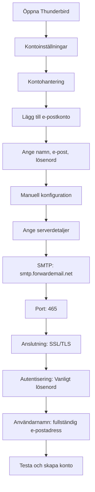

# SMTP-integrationsexempel {#smtp-integration-examples}


## Innehållsförteckning {#table-of-contents}

* [Förord](#foreword)
* [Hur Forward Emails SMTP-behandling fungerar](#how-forward-emails-smtp-processing-works)
  * [E-postkö och återförsökssystem](#email-queue-and-retry-system)
  * [Felfri för tillförlitlighet](#dummy-proofed-for-reliability)
* [Node.js-integration](#nodejs-integration)
  * [Använda Nodemailer](#using-nodemailer)
  * [Använda Express.js](#using-expressjs)
* [Python-integration](#python-integration)
  * [Använda smtplib](#using-smtplib)
  * [Använda Django](#using-django)
* [PHP-integration](#php-integration)
  * [Använda PHPMailer](#using-phpmailer)
  * [Använda Laravel](#using-laravel)
* [Ruby-integration](#ruby-integration)
  * [Använda Ruby Mail Gem](#using-ruby-mail-gem)
* [Java-integration](#java-integration)
  * [Använda JavaMail API](#using-javamail-api)
* [E-postklientkonfiguration](#email-client-configuration)
  * [Thunderbird](#thunderbird)
  * [Apple Mail](#apple-mail)
  * [Gmail (Skicka e-post som)](#gmail-send-mail-as)
* [Felsökning](#troubleshooting)
  * [Vanliga problem och lösningar](#common-issues-and-solutions)
  * [Få hjälp](#getting-help)
* [Ytterligare resurser](#additional-resources)
* [Slutsats](#conclusion)


## Förord {#foreword}

Denna guide ger detaljerade exempel på hur man integrerar med Forward Emails SMTP-tjänst med olika programmeringsspråk, ramverk och e-postklienter. Vår SMTP-tjänst är utformad för att vara pålitlig, säker och enkel att integrera med dina befintliga applikationer.


## Hur Forward Emails SMTP-behandling fungerar {#how-forward-emails-smtp-processing-works}

Innan vi går in på integrations-exemplen är det viktigt att förstå hur vår SMTP-tjänst behandlar e-post:

### E-postkö och återförsökssystem {#email-queue-and-retry-system}

När du skickar ett e-postmeddelande via SMTP till våra servrar:

1. **Initial behandling**: E-posten valideras, skannas efter skadlig kod och kontrolleras mot spamfilter
2. **Smart köhantering**: E-postmeddelanden placeras i ett avancerat kö-system för leverans
3. **Intelligent återförsöksmekanism**: Om leveransen tillfälligt misslyckas kommer vårt system att:
   * Analysera felmeddelandet med vår `getBounceInfo`-funktion
   * Avgöra om problemet är tillfälligt (t.ex. "försök igen senare", "tillfälligt uppskjutet") eller permanent (t.ex. "användare okänd")
   * För tillfälliga problem markera e-posten för återförsök
   * För permanenta problem generera en studsningsnotifikation
4. **5-dagars återförsöksperiod**: Vi försöker leverera i upp till 5 dagar (likt branschstandarder som Postfix), vilket ger tillfälliga problem tid att lösas
5. **Leveransstatusmeddelanden**: Avsändare får meddelanden om status för sina e-postmeddelanden (levererat, försenat eller studsat)

> \[!NOTE]
> Efter lyckad leverans raderas innehållet i utgående SMTP-e-post efter en konfigurerbar lagringsperiod (standard 30 dagar) för säkerhet och integritet. Endast ett platshållarmeddelande kvarstår som indikerar lyckad leverans.

### Felfri för tillförlitlighet {#dummy-proofed-for-reliability}

Vårt system är utformat för att hantera olika kantfall:

* Om en blocklista upptäcks kommer e-posten automatiskt att försöka skickas igen
* Om nätverksproblem uppstår kommer leveransen att försöka igen
* Om mottagarens brevlåda är full kommer systemet att försöka senare
* Om mottagarservern är tillfälligt otillgänglig fortsätter vi försöka

Detta tillvägagångssätt förbättrar leveransgraden avsevärt samtidigt som integritet och säkerhet bibehålls.


## Node.js-integration {#nodejs-integration}

### Använda Nodemailer {#using-nodemailer}

[Nodemailer](https://nodemailer.com/) är ett populärt modul för att skicka e-post från Node.js-applikationer.

```javascript
const nodemailer = require('nodemailer');

// Skapa ett transporter-objekt
const transporter = nodemailer.createTransport({
  host: 'smtp.forwardemail.net',
  port: 465,
  secure: true, // Använd TLS
  auth: {
    user: 'your-username@your-domain.com',
    pass: 'your-password'
  }
});

// Skicka e-post med definierat transportobjekt
async function sendEmail() {
  try {
    const info = await transporter.sendMail({
      from: '"Ditt Namn" <your-username@your-domain.com>',
      to: 'recipient@example.com',
      subject: 'Hej från Forward Email',
      text: 'Hej världen! Detta är ett testmail skickat med Nodemailer och Forward Email SMTP.',
      html: '<b>Hej världen!</b> Detta är ett testmail skickat med Nodemailer och Forward Email SMTP.'
    });

    console.log('Meddelande skickat: %s', info.messageId);
  } catch (error) {
    console.error('Fel vid sändning av e-post:', error);
  }
}

sendEmail();
```
### Använda Express.js {#using-expressjs}

Så här integrerar du Forward Email SMTP med en Express.js-applikation:

```javascript
const express = require('express');
const nodemailer = require('nodemailer');
const app = express();
const port = 3000;

app.use(express.json());

// Konfigurera e-posttransportör
const transporter = nodemailer.createTransport({
  host: 'smtp.forwardemail.net',
  port: 465,
  secure: true,
  auth: {
    user: 'your-username@your-domain.com',
    pass: 'your-password'
  }
});

// API-endpoint för att skicka e-post
app.post('/send-email', async (req, res) => {
  const { to, subject, text, html } = req.body;

  try {
    const info = await transporter.sendMail({
      from: '"Your App" <your-username@your-domain.com>',
      to,
      subject,
      text,
      html
    });

    res.status(200).json({
      success: true,
      messageId: info.messageId
    });
  } catch (error) {
    console.error('Fel vid sändning av e-post:', error);
    res.status(500).json({
      success: false,
      error: error.message
    });
  }
});

app.listen(port, () => {
  console.log(`Server körs på http://localhost:${port}`);
});
```


## Python-integration {#python-integration}

### Använda smtplib {#using-smtplib}

```python
import smtplib
from email.mime.text import MIMEText
from email.mime.multipart import MIMEMultipart

# E-postkonfiguration
sender_email = "your-username@your-domain.com"
receiver_email = "recipient@example.com"
password = "your-password"

# Skapa meddelande
message = MIMEMultipart("alternative")
message["Subject"] = "Hej från Forward Email"
message["From"] = sender_email
message["To"] = receiver_email

# Skapa text- och HTML-version av ditt meddelande
text = "Hej världen! Detta är ett testmail skickat med Python och Forward Email SMTP."
html = "<html><body><b>Hej världen!</b> Detta är ett testmail skickat med Python och Forward Email SMTP.</body></html>"

# Gör om dessa till plain/html MIMEText-objekt
part1 = MIMEText(text, "plain")
part2 = MIMEText(html, "html")

# Lägg till HTML/plain-text-delar till MIMEMultipart-meddelandet
message.attach(part1)
message.attach(part2)

# Skicka e-post
try:
    server = smtplib.SMTP_SSL("smtp.forwardemail.net", 465)
    server.login(sender_email, password)
    server.sendmail(sender_email, receiver_email, message.as_string())
    server.quit()
    print("E-post skickades framgångsrikt!")
except Exception as e:
    print(f"Fel vid sändning av e-post: {e}")
```

### Använda Django {#using-django}

För Django-applikationer, lägg till följande i din `settings.py`:

```python
# E-postinställningar
EMAIL_BACKEND = 'django.core.mail.backends.smtp.EmailBackend'
EMAIL_HOST = 'smtp.forwardemail.net'
EMAIL_PORT = 465
EMAIL_USE_SSL = True
EMAIL_HOST_USER = 'your-username@your-domain.com'
EMAIL_HOST_PASSWORD = 'your-password'
DEFAULT_FROM_EMAIL = 'your-username@your-domain.com'
```

Skicka sedan e-post i dina vyer:

```python
from django.core.mail import send_mail

def send_email_view(request):
    send_mail(
        'Ämne här',
        'Här är meddelandet.',
        'from@your-domain.com',
        ['to@example.com'],
        fail_silently=False,
        html_message='<b>Här är HTML-meddelandet.</b>'
    )
    return HttpResponse('E-post skickad!')
```


## PHP-integration {#php-integration}

### Använda PHPMailer {#using-phpmailer}

```php
<?php
use PHPMailer\PHPMailer\PHPMailer;
use PHPMailer\PHPMailer\Exception;

require 'vendor/autoload.php';

$mail = new PHPMailer(true);

try {
    // Serverinställningar
    $mail->isSMTP();
    $mail->Host       = 'smtp.forwardemail.net';
    $mail->SMTPAuth   = true;
    $mail->Username   = 'your-username@your-domain.com';
    $mail->Password   = 'your-password';
    $mail->SMTPSecure = PHPMailer::ENCRYPTION_SMTPS;
    $mail->Port       = 465;

    // Mottagare
    $mail->setFrom('your-username@your-domain.com', 'Ditt Namn');
    $mail->addAddress('recipient@example.com', 'Mottagarens Namn');
    $mail->addReplyTo('your-username@your-domain.com', 'Ditt Namn');

    // Innehåll
    $mail->isHTML(true);
    $mail->Subject = 'Hej från Forward Email';
    $mail->Body    = '<b>Hej världen!</b> Detta är ett testmail skickat med PHPMailer och Forward Email SMTP.';
    $mail->AltBody = 'Hej världen! Detta är ett testmail skickat med PHPMailer och Forward Email SMTP.';

    $mail->send();
    echo 'Meddelandet har skickats';
} catch (Exception $e) {
    echo "Meddelandet kunde inte skickas. Mailer Error: {$mail->ErrorInfo}";
}
```
### Använda Laravel {#using-laravel}

För Laravel-applikationer, uppdatera din `.env`-fil:

```sh
MAIL_MAILER=smtp
MAIL_HOST=smtp.forwardemail.net
MAIL_PORT=465
MAIL_USERNAME=your-username@your-domain.com
MAIL_PASSWORD=your-password
MAIL_ENCRYPTION=ssl
MAIL_FROM_ADDRESS=your-username@your-domain.com
MAIL_FROM_NAME="${APP_NAME}"
```

Skicka sedan e-post med Laravels Mail-fasad:

```php
<?php

namespace App\Http\Controllers;

use Illuminate\Http\Request;
use Illuminate\Support\Facades\Mail;
use App\Mail\WelcomeEmail;

class EmailController extends Controller
{
    public function sendEmail()
    {
        Mail::to('recipient@example.com')->send(new WelcomeEmail());

        return 'E-post skickad framgångsrikt!';
    }
}
```


## Ruby-integration {#ruby-integration}

### Använda Ruby Mail Gem {#using-ruby-mail-gem}

```ruby
require 'mail'

Mail.defaults do
  delivery_method :smtp, {
    address: 'smtp.forwardemail.net',
    port: 465,
    domain: 'your-domain.com',
    user_name: 'your-username@your-domain.com',
    password: 'your-password',
    authentication: 'plain',
    enable_starttls_auto: true,
    ssl: true
  }
end

mail = Mail.new do
  from     'your-username@your-domain.com'
  to       'recipient@example.com'
  subject  'Hej från Forward Email'

  text_part do
    body 'Hej världen! Detta är ett testmail skickat med Ruby Mail och Forward Email SMTP.'
  end

  html_part do
    content_type 'text/html; charset=UTF-8'
    body '<b>Hej världen!</b> Detta är ett testmail skickat med Ruby Mail och Forward Email SMTP.'
  end
end

mail.deliver!
puts "E-post skickad framgångsrikt!"
```


## Java-integration {#java-integration}

### Använda JavaMail API {#using-javamail-api}

```java
import java.util.Properties;
import javax.mail.*;
import javax.mail.internet.*;

public class SendEmail {
    public static void main(String[] args) {
        // Avsändarens e-post och lösenord
        final String username = "your-username@your-domain.com";
        final String password = "your-password";

        // SMTP-serverinställningar
        Properties props = new Properties();
        props.put("mail.smtp.auth", "true");
        props.put("mail.smtp.starttls.enable", "true");
        props.put("mail.smtp.host", "smtp.forwardemail.net");
        props.put("mail.smtp.port", "465");
        props.put("mail.smtp.socketFactory.port", "465");
        props.put("mail.smtp.socketFactory.class", "javax.net.ssl.SSLSocketFactory");

        // Skapa session med autentisering
        Session session = Session.getInstance(props,
            new javax.mail.Authenticator() {
                protected PasswordAuthentication getPasswordAuthentication() {
                    return new PasswordAuthentication(username, password);
                }
            });

        try {
            // Skapa meddelande
            Message message = new MimeMessage(session);
            message.setFrom(new InternetAddress(username));
            message.setRecipients(Message.RecipientType.TO, InternetAddress.parse("recipient@example.com"));
            message.setSubject("Hej från Forward Email");

            // Skapa multipart-meddelande
            Multipart multipart = new MimeMultipart("alternative");

            // Textdel
            BodyPart textPart = new MimeBodyPart();
            textPart.setText("Hej världen! Detta är ett testmail skickat med JavaMail och Forward Email SMTP.");

            // HTML-del
            BodyPart htmlPart = new MimeBodyPart();
            htmlPart.setContent("<b>Hej världen!</b> Detta är ett testmail skickat med JavaMail och Forward Email SMTP.", "text/html");

            // Lägg till delar i multipart
            multipart.addBodyPart(textPart);
            multipart.addBodyPart(htmlPart);

            // Sätt innehåll
            message.setContent(multipart);

            // Skicka meddelande
            Transport.send(message);

            System.out.println("E-post skickad framgångsrikt!");

        } catch (MessagingException e) {
            throw new RuntimeException(e);
        }
    }
}
```


## E-postklientkonfiguration {#email-client-configuration}

### Thunderbird {#thunderbird}


```mermaid
flowchart TD
    A[Öppna Thunderbird] --> B[Kontoinställningar]
    B --> C[Kontohantering]
    C --> D[Lägg till e-postkonto]
    D --> E[Ange namn, e-post, lösenord]
    E --> F[Manuell konfiguration]
    F --> G[Ange serverdetaljer]
    G --> H[SMTP: smtp.forwardemail.net]
    H --> I[Port: 465]
    I --> J[Anslutning: SSL/TLS]
    J --> K[Autentisering: Vanligt lösenord]
    K --> L[Användarnamn: fullständig e-postadress]
    L --> M[Testa och skapa konto]
```
1. Öppna Thunderbird och gå till Kontoinställningar  
2. Klicka på "Kontohandlingar" och välj "Lägg till e-postkonto"  
3. Ange ditt namn, e-postadress och lösenord  
4. Klicka på "Manuell konfiguration" och ange följande uppgifter:  
   * Inkommande server:  
     * IMAP: imap.forwardemail.net, Port: 993, SSL/TLS  
     * POP3: pop3.forwardemail.net, Port: 995, SSL/TLS  
   * Utgående server (SMTP): smtp.forwardemail.net, Port: 465, SSL/TLS  
   * Autentisering: Normalt lösenord  
   * Användarnamn: din fullständiga e-postadress  
5. Klicka på "Testa" och sedan "Klart"  

### Apple Mail {#apple-mail}

1. Öppna Mail och gå till Mail > Inställningar > Konton  
2. Klicka på "+"-knappen för att lägga till ett nytt konto  
3. Välj "Annat e-postkonto" och klicka på "Fortsätt"  
4. Ange ditt namn, e-postadress och lösenord, klicka sedan på "Logga in"  
5. När automatisk konfiguration misslyckas, ange följande uppgifter:  
   * Inkommande e-postserver: imap.forwardemail.net (eller pop3.forwardemail.net för POP3)  
   * Utgående e-postserver: smtp.forwardemail.net  
   * Användarnamn: din fullständiga e-postadress  
   * Lösenord: ditt lösenord  
6. Klicka på "Logga in" för att slutföra inställningen  

### Gmail (Skicka e-post som) {#gmail-send-mail-as}

1. Öppna Gmail och gå till Inställningar > Konton och import  
2. Under "Skicka e-post som", klicka på "Lägg till en annan e-postadress"  
3. Ange ditt namn och e-postadress, klicka sedan på "Nästa steg"  
4. Ange följande SMTP-serveruppgifter:  
   * SMTP-server: smtp.forwardemail.net  
   * Port: 465  
   * Användarnamn: din fullständiga e-postadress  
   * Lösenord: ditt lösenord  
   * Välj "Säkrad anslutning med SSL"  
5. Klicka på "Lägg till konto" och verifiera din e-postadress  

## Felsökning {#troubleshooting}

### Vanliga problem och lösningar {#common-issues-and-solutions}

1. **Autentisering misslyckades**  
   * Kontrollera ditt användarnamn (fullständig e-postadress) och lösenord  
   * Säkerställ att du använder rätt port (465 för SSL/TLS)  
   * Kontrollera att ditt konto har SMTP-åtkomst aktiverad  

2. **Anslutningstidsgräns**  
   * Kontrollera din internetanslutning  
   * Verifiera att brandväggsinställningar inte blockerar SMTP-trafik  
   * Försök använda port 465 med SSL/TLS (rekommenderas) eller port 587 med STARTTLS  

3. **Meddelande avvisat**  
   * Säkerställ att din "Från"-adress matchar din autentiserade e-post  
   * Kontrollera om din IP är svartlistad  
   * Verifiera att ditt meddelandeinnehåll inte triggar skräppostfilter  

4. **TLS/SSL-fel**  
   * Uppdatera din applikation/bibliotek för att stödja moderna TLS-versioner  
   * Säkerställ att systemets CA-certifikat är uppdaterade  
   * Försök med explicit TLS istället för implicit TLS  

### Få hjälp {#getting-help}

Om du stöter på problem som inte täcks här, vänligen:  

1. Kontrollera vår [FAQ-sida](/faq) för vanliga frågor  
2. Läs vårt [blogginlägg om e-postleverans](/blog/docs/best-email-forwarding-service) för detaljerad information  
3. Kontakta vår support på <support@forwardemail.net>  

## Ytterligare resurser {#additional-resources}

* [Forward Email Dokumentation](/docs)  
* [SMTP-servergränser och konfiguration](/faq#what-are-your-outbound-smtp-limits)  
* [Guide för bästa e-postpraxis](/blog/docs/best-email-forwarding-service)  
* [Säkerhetspraxis](/security)  

## Slutsats {#conclusion}

Forward Emails SMTP-tjänst erbjuder ett pålitligt, säkert och integritetsfokuserat sätt att skicka e-post från dina applikationer och e-postklienter. Med vårt intelligenta kö-system, 5-dagars återförsöksmekanism och omfattande leveransstatusmeddelanden kan du vara säker på att dina e-postmeddelanden når sin destination.  

För mer avancerade användningsfall eller anpassade integrationer, vänligen kontakta vår support.
