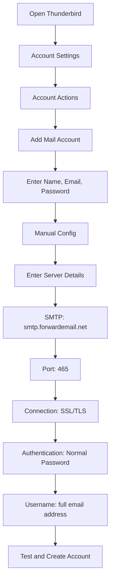

# ตัวอย่างการรวม SMTP {#smtp-integration-examples}

## สารบัญ {#table-of-contents}

* [คำนำ](#foreword)
* [การประมวลผล SMTP ของ Forward Email ทำงานอย่างไร](#how-forward-emails-smtp-processing-works)
  * [ระบบคิวอีเมลและการลองส่งใหม่อีกครั้ง](#email-queue-and-retry-system)
  * [พิสูจน์แล้วว่าเชื่อถือได้](#dummy-proofed-for-reliability)
* [การรวม Node.js](#nodejs-integration)
  * [การใช้ Nodemailer](#using-nodemailer)
  * [การใช้ Express.js](#using-expressjs)
* [การบูรณาการ Python](#python-integration)
  * [การใช้ smtplib](#using-smtplib)
  * [การใช้ Django](#using-django)
* [การรวม PHP](#php-integration)
  * [การใช้ PHPMailer](#using-phpmailer)
  * [การใช้ Laravel](#using-laravel)
* [การรวม Ruby](#ruby-integration)
  * [การใช้ Ruby Mail Gem](#using-ruby-mail-gem)
* [การรวม Java](#java-integration)
  * [การใช้ Java Mail API](#using-javamail-api)
* [การกำหนดค่าไคลเอนต์อีเมล](#email-client-configuration)
  * [ธันเดอร์เบิร์ด](#thunderbird)
  * [แอปเปิลเมล](#apple-mail)
  * [Gmail (ส่งเมลในชื่อ)](#gmail-send-mail-as)
* [การแก้ไขปัญหา](#troubleshooting)
  * [ปัญหาทั่วไปและวิธีแก้ไข](#common-issues-and-solutions)
  * [การได้รับความช่วยเหลือ](#getting-help)
* [แหล่งข้อมูลเพิ่มเติม](#additional-resources)
* [บทสรุป](#conclusion)

## คำนำ {#foreword}

คู่มือนี้ให้ตัวอย่างโดยละเอียดเกี่ยวกับวิธีการผสานรวมกับบริการ SMTP ของ Forward Email โดยใช้ภาษาโปรแกรม เฟรมเวิร์ก และโปรแกรมรับส่งอีเมลที่หลากหลาย บริการ SMTP ของเราได้รับการออกแบบมาให้มีความน่าเชื่อถือ ปลอดภัย และผสานรวมกับแอปพลิเคชันที่มีอยู่ของคุณได้อย่างง่ายดาย

## การประมวลผล SMTP ของ Forward Email ทำงานอย่างไร {#how-forward-emails-smtp-processing-works}

ก่อนที่จะเจาะลึกไปในตัวอย่างการผสานรวม สิ่งสำคัญคือต้องเข้าใจก่อนว่าบริการ SMTP ของเราประมวลผลอีเมลอย่างไร:

### ระบบคิวอีเมลและการลองใหม่ {#email-queue-and-retry-system}

เมื่อคุณส่งอีเมลผ่าน SMTP ไปยังเซิร์ฟเวอร์ของเรา:

1. **การดำเนินการเริ่มต้น**: อีเมลจะได้รับการตรวจสอบความถูกต้อง สแกนหามัลแวร์ และตรวจสอบกับตัวกรองสแปม
2. **การจัดคิวอัจฉริยะ**: อีเมลจะถูกจัดเก็บไว้ในระบบคิวที่ซับซ้อนเพื่อนำส่ง
3. **กลไกการลองส่งใหม่อัจฉริยะ**: หากการนำส่งล้มเหลวชั่วคราว ระบบของเราจะ:
* วิเคราะห์การตอบกลับข้อผิดพลาดโดยใช้ฟังก์ชัน `getBounceInfo` ของเรา
* ตรวจสอบว่าปัญหาเกิดขึ้นชั่วคราว (เช่น "ลองอีกครั้งในภายหลัง" "เลื่อนออกไปชั่วคราว") หรือถาวร (เช่น "ไม่ทราบผู้ใช้")
* สำหรับปัญหาชั่วคราว ให้ทำเครื่องหมายอีเมลเพื่อลองส่งใหม่
* สำหรับปัญหาถาวร ให้สร้างการแจ้งเตือนการตีกลับ
4. **ระยะเวลาลองส่งใหม่ 5 วัน**: เราลองส่งใหม่นานสูงสุด 5 วัน (คล้ายกับมาตรฐานอุตสาหกรรม เช่น Postfix) ทำให้ปัญหาชั่วคราวมีเวลาในการแก้ไขปัญหา
5. **การแจ้งเตือนสถานะการนำส่ง**: ผู้ส่งจะได้รับการแจ้งเตือนเกี่ยวกับสถานะของอีเมล (ส่งแล้ว ล่าช้า หรือตีกลับ)

> \[!NOTE]
> หลังจากส่งสำเร็จ เนื้อหาอีเมล SMTP ขาออกจะถูกลบออกหลังจากระยะเวลาเก็บรักษาที่กำหนดค่าได้ (ค่าเริ่มต้นคือ 30 วัน) เพื่อความปลอดภัยและความเป็นส่วนตัว เหลือเพียงข้อความตัวแทนที่ระบุว่าส่งสำเร็จ

### พิสูจน์แล้วว่าเชื่อถือได้ {#dummy-proofed-for-reliability}

ระบบของเราได้รับการออกแบบมาเพื่อจัดการกับกรณีขอบต่างๆ:

* หากตรวจพบรายการบล็อก ระบบจะส่งอีเมลซ้ำโดยอัตโนมัติ
* หากเกิดปัญหากับเครือข่าย ระบบจะพยายามส่งอีกครั้ง
* หากกล่องจดหมายของผู้รับเต็ม ระบบจะลองส่งอีกครั้งในภายหลัง
* หากเซิร์ฟเวอร์รับไม่สามารถใช้งานได้ชั่วคราว เราจะพยายามดำเนินการต่อไป

แนวทางนี้ช่วยปรับปรุงอัตราการจัดส่งได้อย่างมีนัยสำคัญในขณะที่ยังคงรักษาความเป็นส่วนตัวและความปลอดภัยไว้

## การรวม Node.js {#nodejs-integration}

### การใช้ Nodemailer {#using-nodemailer}

[โหนดเมเลอร์](https://nodemailer.com/) เป็นโมดูลยอดนิยมสำหรับการส่งอีเมลจากแอปพลิเคชัน Node.js

```javascript
const nodemailer = require('nodemailer');

// Create a transporter object
const transporter = nodemailer.createTransport({
  host: 'smtp.forwardemail.net',
  port: 465,
  secure: true, // Use TLS
  auth: {
    user: 'your-username@your-domain.com',
    pass: 'your-password'
  }
});

// Send mail with defined transport object
async function sendEmail() {
  try {
    const info = await transporter.sendMail({
      from: '"Your Name" <your-username@your-domain.com>',
      to: 'recipient@example.com',
      subject: 'Hello from Forward Email',
      text: 'Hello world! This is a test email sent using Nodemailer and Forward Email SMTP.',
      html: '<b>Hello world!</b> This is a test email sent using Nodemailer and Forward Email SMTP.'
    });

    console.log('Message sent: %s', info.messageId);
  } catch (error) {
    console.error('Error sending email:', error);
  }
}

sendEmail();
```

### การใช้ Express.js {#using-expressjs}

วิธีการรวม Forward Email SMTP เข้ากับแอปพลิเคชัน Express.js มีดังนี้:

```javascript
const express = require('express');
const nodemailer = require('nodemailer');
const app = express();
const port = 3000;

app.use(express.json());

// Configure email transporter
const transporter = nodemailer.createTransport({
  host: 'smtp.forwardemail.net',
  port: 465,
  secure: true,
  auth: {
    user: 'your-username@your-domain.com',
    pass: 'your-password'
  }
});

// API endpoint for sending emails
app.post('/send-email', async (req, res) => {
  const { to, subject, text, html } = req.body;

  try {
    const info = await transporter.sendMail({
      from: '"Your App" <your-username@your-domain.com>',
      to,
      subject,
      text,
      html
    });

    res.status(200).json({
      success: true,
      messageId: info.messageId
    });
  } catch (error) {
    console.error('Error sending email:', error);
    res.status(500).json({
      success: false,
      error: error.message
    });
  }
});

app.listen(port, () => {
  console.log(`Server running at http://localhost:${port}`);
});
```

## การรวม Python {#python-integration}

### การใช้ smtplib {#using-smtplib}

```python
import smtplib
from email.mime.text import MIMEText
from email.mime.multipart import MIMEMultipart

# Email configuration
sender_email = "your-username@your-domain.com"
receiver_email = "recipient@example.com"
password = "your-password"

# Create message
message = MIMEMultipart("alternative")
message["Subject"] = "Hello from Forward Email"
message["From"] = sender_email
message["To"] = receiver_email

# Create the plain-text and HTML version of your message
text = "Hello world! This is a test email sent using Python and Forward Email SMTP."
html = "<html><body><b>Hello world!</b> This is a test email sent using Python and Forward Email SMTP.</body></html>"

# Turn these into plain/html MIMEText objects
part1 = MIMEText(text, "plain")
part2 = MIMEText(html, "html")

# Add HTML/plain-text parts to MIMEMultipart message
message.attach(part1)
message.attach(part2)

# Send email
try:
    server = smtplib.SMTP_SSL("smtp.forwardemail.net", 465)
    server.login(sender_email, password)
    server.sendmail(sender_email, receiver_email, message.as_string())
    server.quit()
    print("Email sent successfully!")
except Exception as e:
    print(f"Error sending email: {e}")
```

### การใช้ Django {#using-django}

สำหรับแอปพลิเคชัน Django ให้เพิ่มสิ่งต่อไปนี้ลงใน `settings.py` ของคุณ:

```python
# Email settings
EMAIL_BACKEND = 'django.core.mail.backends.smtp.EmailBackend'
EMAIL_HOST = 'smtp.forwardemail.net'
EMAIL_PORT = 465
EMAIL_USE_SSL = True
EMAIL_HOST_USER = 'your-username@your-domain.com'
EMAIL_HOST_PASSWORD = 'your-password'
DEFAULT_FROM_EMAIL = 'your-username@your-domain.com'
```

จากนั้นส่งอีเมล์ไปยังมุมมองของคุณ:

```python
from django.core.mail import send_mail

def send_email_view(request):
    send_mail(
        'Subject here',
        'Here is the message.',
        'from@your-domain.com',
        ['to@example.com'],
        fail_silently=False,
        html_message='<b>Here is the HTML message.</b>'
    )
    return HttpResponse('Email sent!')
```

## การรวม PHP {#php-integration}

### การใช้ PHPMailer {#using-phpmailer}

```php
<?php
use PHPMailer\PHPMailer\PHPMailer;
use PHPMailer\PHPMailer\Exception;

require 'vendor/autoload.php';

$mail = new PHPMailer(true);

try {
    // Server settings
    $mail->isSMTP();
    $mail->Host       = 'smtp.forwardemail.net';
    $mail->SMTPAuth   = true;
    $mail->Username   = 'your-username@your-domain.com';
    $mail->Password   = 'your-password';
    $mail->SMTPSecure = PHPMailer::ENCRYPTION_SMTPS;
    $mail->Port       = 465;

    // Recipients
    $mail->setFrom('your-username@your-domain.com', 'Your Name');
    $mail->addAddress('recipient@example.com', 'Recipient Name');
    $mail->addReplyTo('your-username@your-domain.com', 'Your Name');

    // Content
    $mail->isHTML(true);
    $mail->Subject = 'Hello from Forward Email';
    $mail->Body    = '<b>Hello world!</b> This is a test email sent using PHPMailer and Forward Email SMTP.';
    $mail->AltBody = 'Hello world! This is a test email sent using PHPMailer and Forward Email SMTP.';

    $mail->send();
    echo 'Message has been sent';
} catch (Exception $e) {
    echo "Message could not be sent. Mailer Error: {$mail->ErrorInfo}";
}
```

### การใช้ Laravel {#using-laravel}

สำหรับแอปพลิเคชัน Laravel ให้อัปเดตไฟล์ `.env` ของคุณ:

```sh
MAIL_MAILER=smtp
MAIL_HOST=smtp.forwardemail.net
MAIL_PORT=465
MAIL_USERNAME=your-username@your-domain.com
MAIL_PASSWORD=your-password
MAIL_ENCRYPTION=ssl
MAIL_FROM_ADDRESS=your-username@your-domain.com
MAIL_FROM_NAME="${APP_NAME}"
```

จากนั้นส่งอีเมลโดยใช้ Mail façade ของ Laravel:

```php
<?php

namespace App\Http\Controllers;

use Illuminate\Http\Request;
use Illuminate\Support\Facades\Mail;
use App\Mail\WelcomeEmail;

class EmailController extends Controller
{
    public function sendEmail()
    {
        Mail::to('recipient@example.com')->send(new WelcomeEmail());

        return 'Email sent successfully!';
    }
}
```

## การรวม Ruby {#ruby-integration}

### การใช้ Ruby Mail Gem {#using-ruby-mail-gem}

```ruby
require 'mail'

Mail.defaults do
  delivery_method :smtp, {
    address: 'smtp.forwardemail.net',
    port: 465,
    domain: 'your-domain.com',
    user_name: 'your-username@your-domain.com',
    password: 'your-password',
    authentication: 'plain',
    enable_starttls_auto: true,
    ssl: true
  }
end

mail = Mail.new do
  from     'your-username@your-domain.com'
  to       'recipient@example.com'
  subject  'Hello from Forward Email'

  text_part do
    body 'Hello world! This is a test email sent using Ruby Mail and Forward Email SMTP.'
  end

  html_part do
    content_type 'text/html; charset=UTF-8'
    body '<b>Hello world!</b> This is a test email sent using Ruby Mail and Forward Email SMTP.'
  end
end

mail.deliver!
puts "Email sent successfully!"
```

## การรวม Java {#java-integration}

### การใช้ JavaMail API {#using-javamail-api}

```java
import java.util.Properties;
import javax.mail.*;
import javax.mail.internet.*;

public class SendEmail {
    public static void main(String[] args) {
        // Sender's email and password
        final String username = "your-username@your-domain.com";
        final String password = "your-password";

        // SMTP server properties
        Properties props = new Properties();
        props.put("mail.smtp.auth", "true");
        props.put("mail.smtp.starttls.enable", "true");
        props.put("mail.smtp.host", "smtp.forwardemail.net");
        props.put("mail.smtp.port", "465");
        props.put("mail.smtp.socketFactory.port", "465");
        props.put("mail.smtp.socketFactory.class", "javax.net.ssl.SSLSocketFactory");

        // Create session with authenticator
        Session session = Session.getInstance(props,
            new javax.mail.Authenticator() {
                protected PasswordAuthentication getPasswordAuthentication() {
                    return new PasswordAuthentication(username, password);
                }
            });

        try {
            // Create message
            Message message = new MimeMessage(session);
            message.setFrom(new InternetAddress(username));
            message.setRecipients(Message.RecipientType.TO, InternetAddress.parse("recipient@example.com"));
            message.setSubject("Hello from Forward Email");

            // Create multipart message
            Multipart multipart = new MimeMultipart("alternative");

            // Text part
            BodyPart textPart = new MimeBodyPart();
            textPart.setText("Hello world! This is a test email sent using JavaMail and Forward Email SMTP.");

            // HTML part
            BodyPart htmlPart = new MimeBodyPart();
            htmlPart.setContent("<b>Hello world!</b> This is a test email sent using JavaMail and Forward Email SMTP.", "text/html");

            // Add parts to multipart
            multipart.addBodyPart(textPart);
            multipart.addBodyPart(htmlPart);

            // Set content
            message.setContent(multipart);

            // Send message
            Transport.send(message);

            System.out.println("Email sent successfully!");

        } catch (MessagingException e) {
            throw new RuntimeException(e);
        }
    }
}
```

## การกำหนดค่าไคลเอนต์อีเมล {#email-client-configuration}

### ธันเดอร์เบิร์ด {#thunderbird}



1. เปิด Thunderbird และไปที่การตั้งค่าบัญชี
2. คลิก "การดำเนินการบัญชี" และเลือก "เพิ่มบัญชีอีเมล"
3. ป้อนชื่อ ที่อยู่อีเมล และรหัสผ่านของคุณ
4. คลิก "กำหนดค่าด้วยตนเอง" และป้อนรายละเอียดต่อไปนี้:
* เซิร์ฟเวอร์ขาเข้า:
* IMAP: imap.forwardemail.net, พอร์ต: 993, SSL/TLS
* POP3: pop3.forwardemail.net, พอร์ต: 995, SSL/TLS
* เซิร์ฟเวอร์ขาออก (SMTP): smtp.forwardemail.net, พอร์ต: 465, SSL/TLS
* การตรวจสอบสิทธิ์: รหัสผ่านปกติ
* ชื่อผู้ใช้: ที่อยู่อีเมลแบบเต็มของคุณ
5. คลิก "ทดสอบ" แล้วคลิก "เสร็จสิ้น"

### แอปเปิลเมล {#apple-mail}

1. เปิดอีเมล แล้วไปที่ อีเมล > การตั้งค่า > บัญชี
2. คลิกปุ่ม "+" เพื่อเพิ่มบัญชีใหม่
3. เลือก "บัญชีอีเมลอื่น" แล้วคลิก "ดำเนินการต่อ"
4. ป้อนชื่อ ที่อยู่อีเมล และรหัสผ่านของคุณ จากนั้นคลิก "ลงชื่อเข้าใช้"
5. หากการตั้งค่าอัตโนมัติล้มเหลว ให้ป้อนรายละเอียดต่อไปนี้:
* เซิร์ฟเวอร์อีเมลขาเข้า: imap.forwardemail.net (หรือ pop3.forwardemail.net สำหรับ POP3)
* เซิร์ฟเวอร์อีเมลขาออก: smtp.forwardemail.net
* ชื่อผู้ใช้: ที่อยู่อีเมลแบบเต็มของคุณ
* รหัสผ่าน: รหัสผ่านของคุณ
6. คลิก "ลงชื่อเข้าใช้" เพื่อเสร็จสิ้นการตั้งค่า

### Gmail (ส่งอีเมลในชื่อ) {#gmail-send-mail-as}

1. เปิด Gmail แล้วไปที่ การตั้งค่า > บัญชีและการนำเข้า
2. ใต้ "ส่งอีเมลในชื่อ" ให้คลิก "เพิ่มที่อยู่อีเมลอื่น"
3. ป้อนชื่อและที่อยู่อีเมลของคุณ จากนั้นคลิก "ขั้นตอนถัดไป"
4. ป้อนรายละเอียดเซิร์ฟเวอร์ SMTP ต่อไปนี้:
* เซิร์ฟเวอร์ SMTP: smtp.forwardemail.net
* พอร์ต: 465
* ชื่อผู้ใช้: ที่อยู่อีเมลแบบเต็มของคุณ
* รหัสผ่าน: รหัสผ่านของคุณ
* เลือก "การเชื่อมต่อที่ปลอดภัยโดยใช้ SSL"
5. คลิก "เพิ่มบัญชี" และยืนยันที่อยู่อีเมลของคุณ

## การแก้ไขปัญหา {#troubleshooting}

### ปัญหาทั่วไปและวิธีแก้ไข {#common-issues-and-solutions}

1. **การยืนยันตัวตนล้มเหลว**
* ยืนยันชื่อผู้ใช้ (ที่อยู่อีเมลแบบเต็ม) และรหัสผ่านของคุณ
* ตรวจสอบให้แน่ใจว่าคุณใช้พอร์ตที่ถูกต้อง (465 สำหรับ SSL/TLS)
* ตรวจสอบว่าบัญชีของคุณได้เปิดใช้งานการเข้าถึง SMTP หรือไม่

2. **การเชื่อมต่อหมดเวลา**
* ตรวจสอบการเชื่อมต่ออินเทอร์เน็ตของคุณ
* ตรวจสอบว่าการตั้งค่าไฟร์วอลล์ไม่ได้บล็อกการรับส่งข้อมูล SMTP
* ลองใช้พอร์ตอื่น (587 พร้อม STARTTLS)

3. **ข้อความถูกปฏิเสธ**
* ตรวจสอบให้แน่ใจว่าที่อยู่ "จาก" ของคุณตรงกับอีเมลที่ได้รับการยืนยันแล้ว
* ตรวจสอบว่า IP ของคุณอยู่ในบัญชีดำหรือไม่
* ตรวจสอบว่าเนื้อหาข้อความของคุณไม่ได้เปิดใช้งานตัวกรองสแปม

4. **ข้อผิดพลาด TLS/SSL**
* อัปเดตแอปพลิเคชัน/ไลบรารีของคุณให้รองรับ TLS เวอร์ชันใหม่
* ตรวจสอบให้แน่ใจว่าใบรับรอง CA ของระบบของคุณเป็นปัจจุบัน
* ลองใช้ TLS แบบชัดแจ้งแทน TLS แบบนัย

### รับความช่วยเหลือ {#getting-help}

หากคุณพบปัญหาที่ไม่ได้กล่าวถึงที่นี่ กรุณา:

1. ตรวจสอบ [หน้าคำถามที่พบบ่อย](/faq) ของเราสำหรับคำถามที่พบบ่อย
2. ตรวจสอบ [โพสต์บล็อกเกี่ยวกับการส่งอีเมล](/blog/docs/best-email-forwarding-service) ของเราสำหรับข้อมูลโดยละเอียด
3. ติดต่อทีมสนับสนุนของเราได้ที่ <support@forwardemail.net>

## แหล่งข้อมูลเพิ่มเติม {#additional-resources}

* [ส่งต่อเอกสารอีเมล](/docs)
* [ข้อจำกัดและการกำหนดค่าเซิร์ฟเวอร์ SMTP](/faq#what-are-your-outbound-smtp-limits)
* [คู่มือแนวทางปฏิบัติที่ดีที่สุดสำหรับอีเมล](/blog/docs/best-email-forwarding-service)
* [แนวทางปฏิบัติด้านความปลอดภัย](/security)

## ข้อสรุป {#conclusion}

บริการ SMTP ของ Forward Email มอบวิธีการส่งอีเมลจากแอปพลิเคชันและไคลเอนต์อีเมลของคุณที่เชื่อถือได้ ปลอดภัย และรักษาความเป็นส่วนตัว ด้วยระบบคิวอัจฉริยะ กลไกการลองส่งซ้ำภายใน 5 วัน และการแจ้งเตือนสถานะการจัดส่งที่ครอบคลุม คุณจึงมั่นใจได้ว่าอีเมลของคุณจะถึงปลายทาง

สำหรับกรณีการใช้งานขั้นสูงหรือการบูรณาการแบบกำหนดเอง โปรดติดต่อทีมสนับสนุนของเรา