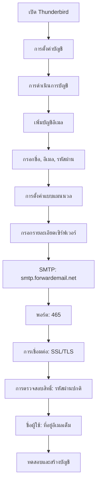

# ตัวอย่างการผสานรวม SMTP {#smtp-integration-examples}


## สารบัญ {#table-of-contents}

* [คำนำ](#foreword)
* [วิธีการทำงานของการประมวลผล SMTP ของ Forward Email](#how-forward-emails-smtp-processing-works)
  * [ระบบคิวอีเมลและการลองใหม่](#email-queue-and-retry-system)
  * [ออกแบบให้ใช้งานง่ายและเชื่อถือได้](#dummy-proofed-for-reliability)
* [การผสานรวม Node.js](#nodejs-integration)
  * [การใช้ Nodemailer](#using-nodemailer)
  * [การใช้ Express.js](#using-expressjs)
* [การผสานรวม Python](#python-integration)
  * [การใช้ smtplib](#using-smtplib)
  * [การใช้ Django](#using-django)
* [การผสานรวม PHP](#php-integration)
  * [การใช้ PHPMailer](#using-phpmailer)
  * [การใช้ Laravel](#using-laravel)
* [การผสานรวม Ruby](#ruby-integration)
  * [การใช้ Ruby Mail Gem](#using-ruby-mail-gem)
* [การผสานรวม Java](#java-integration)
  * [การใช้ JavaMail API](#using-javamail-api)
* [การตั้งค่าไคลเอนต์อีเมล](#email-client-configuration)
  * [Thunderbird](#thunderbird)
  * [Apple Mail](#apple-mail)
  * [Gmail (ส่งอีเมลในนาม)](#gmail-send-mail-as)
* [การแก้ไขปัญหา](#troubleshooting)
  * [ปัญหาทั่วไปและวิธีแก้ไข](#common-issues-and-solutions)
  * [การขอความช่วยเหลือ](#getting-help)
* [ทรัพยากรเพิ่มเติม](#additional-resources)
* [บทสรุป](#conclusion)


## คำนำ {#foreword}

คู่มือนี้ให้ตัวอย่างอย่างละเอียดเกี่ยวกับวิธีการผสานรวมกับบริการ SMTP ของ Forward Email โดยใช้ภาษาการเขียนโปรแกรม เฟรมเวิร์ก และไคลเอนต์อีเมลต่างๆ บริการ SMTP ของเราออกแบบมาให้เชื่อถือได้ ปลอดภัย และง่ายต่อการผสานรวมกับแอปพลิเคชันที่คุณมีอยู่แล้ว


## วิธีการทำงานของการประมวลผล SMTP ของ Forward Email {#how-forward-emails-smtp-processing-works}

ก่อนที่จะเข้าสู่ตัวอย่างการผสานรวม สิ่งสำคัญคือต้องเข้าใจว่าบริการ SMTP ของเราประมวลผลอีเมลอย่างไร:

### ระบบคิวอีเมลและการลองใหม่ {#email-queue-and-retry-system}

เมื่อคุณส่งอีเมลผ่าน SMTP ไปยังเซิร์ฟเวอร์ของเรา:

1. **การประมวลผลเบื้องต้น**: อีเมลจะถูกตรวจสอบความถูกต้อง สแกนหาไวรัส และตรวจสอบกับตัวกรองสแปม
2. **การจัดคิวอัจฉริยะ**: อีเมลจะถูกจัดเก็บในระบบคิวที่ซับซ้อนเพื่อรอการส่ง
3. **กลไกการลองใหม่อย่างชาญฉลาด**: หากการส่งล้มเหลวชั่วคราว ระบบของเราจะ:
   * วิเคราะห์การตอบกลับข้อผิดพลาดโดยใช้ฟังก์ชัน `getBounceInfo` ของเรา
   * กำหนดว่าปัญหาเป็นแบบชั่วคราว (เช่น "ลองใหม่ภายหลัง", "เลื่อนชั่วคราว") หรือถาวร (เช่น "ผู้ใช้ไม่รู้จัก")
   * สำหรับปัญหาชั่วคราว จะทำเครื่องหมายให้อีเมลถูกลองส่งใหม่
   * สำหรับปัญหาถาวร จะสร้างการแจ้งเตือนการเด้งกลับ
4. **ระยะเวลาลองใหม่ 5 วัน**: เราจะลองส่งใหม่เป็นเวลาสูงสุด 5 วัน (เหมือนกับมาตรฐานอุตสาหกรรมเช่น Postfix) เพื่อให้เวลาปัญหาชั่วคราวได้รับการแก้ไข
5. **การแจ้งสถานะการส่ง**: ผู้ส่งจะได้รับการแจ้งเตือนเกี่ยวกับสถานะของอีเมล (ส่งสำเร็จ, ล่าช้า หรือเด้งกลับ)

> \[!NOTE]
> หลังจากส่งอีเมลออกไปสำเร็จ เนื้อหาอีเมล SMTP ขาออกจะถูกลบหลังจากระยะเวลาการเก็บรักษาที่กำหนดได้ (ค่าเริ่มต้น 30 วัน) เพื่อความปลอดภัยและความเป็นส่วนตัว จะเหลือเพียงข้อความแทนที่แสดงว่าการส่งสำเร็จแล้วเท่านั้น

### ออกแบบให้ใช้งานง่ายและเชื่อถือได้ {#dummy-proofed-for-reliability}

ระบบของเราออกแบบมาเพื่อจัดการกับกรณีขอบต่างๆ:

* หากตรวจพบบล็อกลิสต์ อีเมลจะถูกลองส่งใหม่โดยอัตโนมัติ
* หากเกิดปัญหาเครือข่าย การส่งจะถูกพยายามใหม่
* หากกล่องจดหมายของผู้รับเต็ม ระบบจะลองส่งใหม่ภายหลัง
* หากเซิร์ฟเวอร์รับอีเมลไม่พร้อมใช้งานชั่วคราว เราจะพยายามส่งต่อไป

แนวทางนี้ช่วยเพิ่มอัตราการส่งสำเร็จอย่างมากในขณะที่ยังคงรักษาความเป็นส่วนตัวและความปลอดภัย


## การผสานรวม Node.js {#nodejs-integration}

### การใช้ Nodemailer {#using-nodemailer}

[Nodemailer](https://nodemailer.com/) เป็นโมดูลยอดนิยมสำหรับส่งอีเมลจากแอปพลิเคชัน Node.js

```javascript
const nodemailer = require('nodemailer');

// สร้างอ็อบเจ็กต์ transporter
const transporter = nodemailer.createTransport({
  host: 'smtp.forwardemail.net',
  port: 465,
  secure: true, // ใช้ TLS
  auth: {
    user: 'your-username@your-domain.com',
    pass: 'your-password'
  }
});

// ส่งอีเมลด้วยอ็อบเจ็กต์ transport ที่กำหนด
async function sendEmail() {
  try {
    const info = await transporter.sendMail({
      from: '"Your Name" <your-username@your-domain.com>',
      to: 'recipient@example.com',
      subject: 'สวัสดีจาก Forward Email',
      text: 'สวัสดีโลก! นี่คืออีเมลทดสอบที่ส่งโดยใช้ Nodemailer และ Forward Email SMTP.',
      html: '<b>สวัสดีโลก!</b> นี่คืออีเมลทดสอบที่ส่งโดยใช้ Nodemailer และ Forward Email SMTP.'
    });

    console.log('ส่งข้อความแล้ว: %s', info.messageId);
  } catch (error) {
    console.error('เกิดข้อผิดพลาดในการส่งอีเมล:', error);
  }
}

sendEmail();
```
### การใช้ Express.js {#using-expressjs}

นี่คือวิธีการรวม Forward Email SMTP กับแอปพลิเคชัน Express.js:

```javascript
const express = require('express');
const nodemailer = require('nodemailer');
const app = express();
const port = 3000;

app.use(express.json());

// กำหนดค่าตัวส่งอีเมล
const transporter = nodemailer.createTransport({
  host: 'smtp.forwardemail.net',
  port: 465,
  secure: true,
  auth: {
    user: 'your-username@your-domain.com',
    pass: 'your-password'
  }
});

// จุดเชื่อมต่อ API สำหรับส่งอีเมล
app.post('/send-email', async (req, res) => {
  const { to, subject, text, html } = req.body;

  try {
    const info = await transporter.sendMail({
      from: '"Your App" <your-username@your-domain.com>',
      to,
      subject,
      text,
      html
    });

    res.status(200).json({
      success: true,
      messageId: info.messageId
    });
  } catch (error) {
    console.error('Error sending email:', error);
    res.status(500).json({
      success: false,
      error: error.message
    });
  }
});

app.listen(port, () => {
  console.log(`Server running at http://localhost:${port}`);
});
```


## การรวม Python {#python-integration}

### การใช้ smtplib {#using-smtplib}

```python
import smtplib
from email.mime.text import MIMEText
from email.mime.multipart import MIMEMultipart

# การตั้งค่าอีเมล
sender_email = "your-username@your-domain.com"
receiver_email = "recipient@example.com"
password = "your-password"

# สร้างข้อความ
message = MIMEMultipart("alternative")
message["Subject"] = "สวัสดีจาก Forward Email"
message["From"] = sender_email
message["To"] = receiver_email

# สร้างข้อความเวอร์ชันข้อความธรรมดาและ HTML
text = "สวัสดีโลก! นี่คืออีเมลทดสอบที่ส่งโดยใช้ Python และ Forward Email SMTP."
html = "<html><body><b>สวัสดีโลก!</b> นี่คืออีเมลทดสอบที่ส่งโดยใช้ Python และ Forward Email SMTP.</body></html>"

# แปลงเป็นวัตถุ MIMEText แบบ plain/html
part1 = MIMEText(text, "plain")
part2 = MIMEText(html, "html")

# เพิ่มส่วน HTML/ข้อความธรรมดาในข้อความ MIMEMultipart
message.attach(part1)
message.attach(part2)

# ส่งอีเมล
try:
    server = smtplib.SMTP_SSL("smtp.forwardemail.net", 465)
    server.login(sender_email, password)
    server.sendmail(sender_email, receiver_email, message.as_string())
    server.quit()
    print("ส่งอีเมลสำเร็จ!")
except Exception as e:
    print(f"เกิดข้อผิดพลาดในการส่งอีเมล: {e}")
```

### การใช้ Django {#using-django}

สำหรับแอปพลิเคชัน Django ให้เพิ่มสิ่งต่อไปนี้ใน `settings.py` ของคุณ:

```python
# การตั้งค่าอีเมล
EMAIL_BACKEND = 'django.core.mail.backends.smtp.EmailBackend'
EMAIL_HOST = 'smtp.forwardemail.net'
EMAIL_PORT = 465
EMAIL_USE_SSL = True
EMAIL_HOST_USER = 'your-username@your-domain.com'
EMAIL_HOST_PASSWORD = 'your-password'
DEFAULT_FROM_EMAIL = 'your-username@your-domain.com'
```

จากนั้นส่งอีเมลใน views ของคุณ:

```python
from django.core.mail import send_mail

def send_email_view(request):
    send_mail(
        'หัวข้อที่นี่',
        'นี่คือข้อความ.',
        'from@your-domain.com',
        ['to@example.com'],
        fail_silently=False,
        html_message='<b>นี่คือข้อความ HTML.</b>'
    )
    return HttpResponse('ส่งอีเมลแล้ว!')
```


## การรวม PHP {#php-integration}

### การใช้ PHPMailer {#using-phpmailer}

```php
<?php
use PHPMailer\PHPMailer\PHPMailer;
use PHPMailer\PHPMailer\Exception;

require 'vendor/autoload.php';

$mail = new PHPMailer(true);

try {
    // การตั้งค่าเซิร์ฟเวอร์
    $mail->isSMTP();
    $mail->Host       = 'smtp.forwardemail.net';
    $mail->SMTPAuth   = true;
    $mail->Username   = 'your-username@your-domain.com';
    $mail->Password   = 'your-password';
    $mail->SMTPSecure = PHPMailer::ENCRYPTION_SMTPS;
    $mail->Port       = 465;

    // ผู้รับ
    $mail->setFrom('your-username@your-domain.com', 'Your Name');
    $mail->addAddress('recipient@example.com', 'Recipient Name');
    $mail->addReplyTo('your-username@your-domain.com', 'Your Name');

    // เนื้อหา
    $mail->isHTML(true);
    $mail->Subject = 'สวัสดีจาก Forward Email';
    $mail->Body    = '<b>สวัสดีโลก!</b> นี่คืออีเมลทดสอบที่ส่งโดยใช้ PHPMailer และ Forward Email SMTP.';
    $mail->AltBody = 'สวัสดีโลก! นี่คืออีเมลทดสอบที่ส่งโดยใช้ PHPMailer และ Forward Email SMTP.';

    $mail->send();
    echo 'ส่งข้อความเรียบร้อยแล้ว';
} catch (Exception $e) {
    echo "ไม่สามารถส่งข้อความได้ ข้อผิดพลาดของ Mailer: {$mail->ErrorInfo}";
}
```
### Using Laravel {#using-laravel}

สำหรับแอปพลิเคชัน Laravel ให้ปรับปรุงไฟล์ `.env` ของคุณ:

```sh
MAIL_MAILER=smtp
MAIL_HOST=smtp.forwardemail.net
MAIL_PORT=465
MAIL_USERNAME=your-username@your-domain.com
MAIL_PASSWORD=your-password
MAIL_ENCRYPTION=ssl
MAIL_FROM_ADDRESS=your-username@your-domain.com
MAIL_FROM_NAME="${APP_NAME}"
```

จากนั้นส่งอีเมลโดยใช้ Mail façade ของ Laravel:

```php
<?php

namespace App\Http\Controllers;

use Illuminate\Http\Request;
use Illuminate\Support\Facades\Mail;
use App\Mail\WelcomeEmail;

class EmailController extends Controller
{
    public function sendEmail()
    {
        Mail::to('recipient@example.com')->send(new WelcomeEmail());

        return 'ส่งอีเมลสำเร็จ!';
    }
}
```


## Ruby Integration {#ruby-integration}

### Using Ruby Mail Gem {#using-ruby-mail-gem}

```ruby
require 'mail'

Mail.defaults do
  delivery_method :smtp, {
    address: 'smtp.forwardemail.net',
    port: 465,
    domain: 'your-domain.com',
    user_name: 'your-username@your-domain.com',
    password: 'your-password',
    authentication: 'plain',
    enable_starttls_auto: true,
    ssl: true
  }
end

mail = Mail.new do
  from     'your-username@your-domain.com'
  to       'recipient@example.com'
  subject  'สวัสดีจาก Forward Email'

  text_part do
    body 'สวัสดีโลก! นี่คืออีเมลทดสอบที่ส่งโดยใช้ Ruby Mail และ Forward Email SMTP.'
  end

  html_part do
    content_type 'text/html; charset=UTF-8'
    body '<b>สวัสดีโลก!</b> นี่คืออีเมลทดสอบที่ส่งโดยใช้ Ruby Mail และ Forward Email SMTP.'
  end
end

mail.deliver!
puts "ส่งอีเมลสำเร็จ!"
```


## Java Integration {#java-integration}

### Using JavaMail API {#using-javamail-api}

```java
import java.util.Properties;
import javax.mail.*;
import javax.mail.internet.*;

public class SendEmail {
    public static void main(String[] args) {
        // อีเมลและรหัสผ่านของผู้ส่ง
        final String username = "your-username@your-domain.com";
        final String password = "your-password";

        // คุณสมบัติของเซิร์ฟเวอร์ SMTP
        Properties props = new Properties();
        props.put("mail.smtp.auth", "true");
        props.put("mail.smtp.starttls.enable", "true");
        props.put("mail.smtp.host", "smtp.forwardemail.net");
        props.put("mail.smtp.port", "465");
        props.put("mail.smtp.socketFactory.port", "465");
        props.put("mail.smtp.socketFactory.class", "javax.net.ssl.SSLSocketFactory");

        // สร้าง session พร้อม authenticator
        Session session = Session.getInstance(props,
            new javax.mail.Authenticator() {
                protected PasswordAuthentication getPasswordAuthentication() {
                    return new PasswordAuthentication(username, password);
                }
            });

        try {
            // สร้างข้อความ
            Message message = new MimeMessage(session);
            message.setFrom(new InternetAddress(username));
            message.setRecipients(Message.RecipientType.TO, InternetAddress.parse("recipient@example.com"));
            message.setSubject("สวัสดีจาก Forward Email");

            // สร้างข้อความแบบ multipart
            Multipart multipart = new MimeMultipart("alternative");

            // ส่วนข้อความแบบ text
            BodyPart textPart = new MimeBodyPart();
            textPart.setText("สวัสดีโลก! นี่คืออีเมลทดสอบที่ส่งโดยใช้ JavaMail และ Forward Email SMTP.");

            // ส่วนข้อความแบบ HTML
            BodyPart htmlPart = new MimeBodyPart();
            htmlPart.setContent("<b>สวัสดีโลก!</b> นี่คืออีเมลทดสอบที่ส่งโดยใช้ JavaMail และ Forward Email SMTP.", "text/html");

            // เพิ่มส่วนต่างๆ ลงใน multipart
            multipart.addBodyPart(textPart);
            multipart.addBodyPart(htmlPart);

            // ตั้งค่าคอนเทนต์
            message.setContent(multipart);

            // ส่งข้อความ
            Transport.send(message);

            System.out.println("ส่งอีเมลสำเร็จ!");

        } catch (MessagingException e) {
            throw new RuntimeException(e);
        }
    }
}
```


## Email Client Configuration {#email-client-configuration}

### Thunderbird {#thunderbird}


```mermaid
flowchart TD
    A[เปิด Thunderbird] --> B[การตั้งค่าบัญชี]
    B --> C[การดำเนินการบัญชี]
    C --> D[เพิ่มบัญชีอีเมล]
    D --> E[กรอกชื่อ, อีเมล, รหัสผ่าน]
    E --> F[การตั้งค่าแบบแมนนวล]
    F --> G[กรอกรายละเอียดเซิร์ฟเวอร์]
    G --> H[SMTP: smtp.forwardemail.net]
    H --> I[พอร์ต: 465]
    I --> J[การเชื่อมต่อ: SSL/TLS]
    J --> K[การตรวจสอบสิทธิ์: รหัสผ่านปกติ]
    K --> L[ชื่อผู้ใช้: ที่อยู่อีเมลเต็ม]
    L --> M[ทดสอบและสร้างบัญชี]
```
1. เปิด Thunderbird และไปที่ การตั้งค่าบัญชี
2. คลิก "Account Actions" และเลือก "Add Mail Account"
3. กรอกชื่อ, ที่อยู่อีเมล และรหัสผ่านของคุณ
4. คลิก "Manual Config" และกรอกรายละเอียดดังนี้:
   * เซิร์ฟเวอร์ขาเข้า:
     * IMAP: imap.forwardemail.net, พอร์ต: 993, SSL/TLS
     * POP3: pop3.forwardemail.net, พอร์ต: 995, SSL/TLS
   * เซิร์ฟเวอร์ขาออก (SMTP): smtp.forwardemail.net, พอร์ต: 465, SSL/TLS
   * การตรวจสอบสิทธิ์: รหัสผ่านปกติ
   * ชื่อผู้ใช้: ที่อยู่อีเมลเต็มของคุณ
5. คลิก "Test" แล้วคลิก "Done"

### Apple Mail {#apple-mail}

1. เปิด Mail และไปที่ Mail > Preferences > Accounts
2. คลิกปุ่ม "+" เพื่อเพิ่มบัญชีใหม่
3. เลือก "Other Mail Account" แล้วคลิก "Continue"
4. กรอกชื่อ, ที่อยู่อีเมล และรหัสผ่านของคุณ จากนั้นคลิก "Sign In"
5. เมื่อการตั้งค่าอัตโนมัติล้มเหลว ให้กรอกรายละเอียดดังนี้:
   * เซิร์ฟเวอร์เมลขาเข้า: imap.forwardemail.net (หรือ pop3.forwardemail.net สำหรับ POP3)
   * เซิร์ฟเวอร์เมลขาออก: smtp.forwardemail.net
   * ชื่อผู้ใช้: ที่อยู่อีเมลเต็มของคุณ
   * รหัสผ่าน: รหัสผ่านของคุณ
6. คลิก "Sign In" เพื่อเสร็จสิ้นการตั้งค่า

### Gmail (Send Mail As) {#gmail-send-mail-as}

1. เปิด Gmail และไปที่ การตั้งค่า > บัญชีและการนำเข้า
2. ในส่วน "ส่งอีเมลเป็น" คลิก "เพิ่มที่อยู่อีเมลอื่น"
3. กรอกชื่อและที่อยู่อีเมลของคุณ จากนั้นคลิก "ขั้นตอนถัดไป"
4. กรอกรายละเอียดเซิร์ฟเวอร์ SMTP ดังนี้:
   * เซิร์ฟเวอร์ SMTP: smtp.forwardemail.net
   * พอร์ต: 465
   * ชื่อผู้ใช้: ที่อยู่อีเมลเต็มของคุณ
   * รหัสผ่าน: รหัสผ่านของคุณ
   * เลือก "การเชื่อมต่อที่ปลอดภัยโดยใช้ SSL"
5. คลิก "เพิ่มบัญชี" และยืนยันที่อยู่อีเมลของคุณ


## การแก้ไขปัญหา {#troubleshooting}

### ปัญหาทั่วไปและวิธีแก้ไข {#common-issues-and-solutions}

1. **การตรวจสอบสิทธิ์ล้มเหลว**
   * ตรวจสอบชื่อผู้ใช้ (ที่อยู่อีเมลเต็ม) และรหัสผ่านของคุณ
   * ตรวจสอบให้แน่ใจว่าคุณใช้พอร์ตที่ถูกต้อง (465 สำหรับ SSL/TLS)
   * ตรวจสอบว่าบัญชีของคุณเปิดใช้งานการเข้าถึง SMTP แล้ว

2. **การเชื่อมต่อหมดเวลา**
   * ตรวจสอบการเชื่อมต่ออินเทอร์เน็ตของคุณ
   * ตรวจสอบการตั้งค่าไฟร์วอลล์ว่าไม่ได้บล็อกการรับส่งข้อมูล SMTP
   * ลองใช้พอร์ต 465 กับ SSL/TLS (แนะนำ) หรือพอร์ต 587 กับ STARTTLS

3. **ข้อความถูกปฏิเสธ**
   * ตรวจสอบให้แน่ใจว่า "จาก" ตรงกับอีเมลที่ผ่านการตรวจสอบสิทธิ์
   * ตรวจสอบว่า IP ของคุณไม่ได้อยู่ในบัญชีดำ
   * ตรวจสอบเนื้อหาข้อความของคุณว่าไม่ถูกตัวกรองสแปมจับ

4. **ข้อผิดพลาด TLS/SSL**
   * อัปเดตแอปพลิเคชัน/ไลบรารีของคุณให้รองรับ TLS เวอร์ชันใหม่
   * ตรวจสอบให้แน่ใจว่าใบรับรอง CA ของระบบเป็นปัจจุบัน
   * ลองใช้ TLS แบบชัดเจนแทน TLS แบบฝังตัว

### ขอความช่วยเหลือ {#getting-help}

หากคุณพบปัญหาที่ไม่ได้กล่าวถึงที่นี่ กรุณา:

1. ตรวจสอบ [หน้าคำถามที่พบบ่อย](/faq) สำหรับคำถามทั่วไป
2. อ่าน [บทความบล็อกเกี่ยวกับการส่งอีเมล](/blog/docs/best-email-forwarding-service) สำหรับข้อมูลละเอียด
3. ติดต่อทีมสนับสนุนของเราที่ <support@forwardemail.net>


## แหล่งข้อมูลเพิ่มเติม {#additional-resources}

* [เอกสาร Forward Email](/docs)
* [ข้อจำกัดและการตั้งค่าเซิร์ฟเวอร์ SMTP](/faq#what-are-your-outbound-smtp-limits)
* [คู่มือแนวทางปฏิบัติที่ดีที่สุดสำหรับอีเมล](/blog/docs/best-email-forwarding-service)
* [แนวทางด้านความปลอดภัย](/security)


## สรุป {#conclusion}

บริการ SMTP ของ Forward Email มอบวิธีที่เชื่อถือได้ ปลอดภัย และเน้นความเป็นส่วนตัวในการส่งอีเมลจากแอปพลิเคชันและไคลเอนต์อีเมลของคุณ ด้วยระบบคิวอัจฉริยะ กลไกการลองส่งซ้ำ 5 วัน และการแจ้งสถานะการส่งที่ครอบคลุม คุณจึงมั่นใจได้ว่าอีเมลของคุณจะถึงปลายทาง

สำหรับกรณีการใช้งานขั้นสูงหรือการผสานรวมแบบกำหนดเอง กรุณาติดต่อทีมสนับสนุนของเรา
