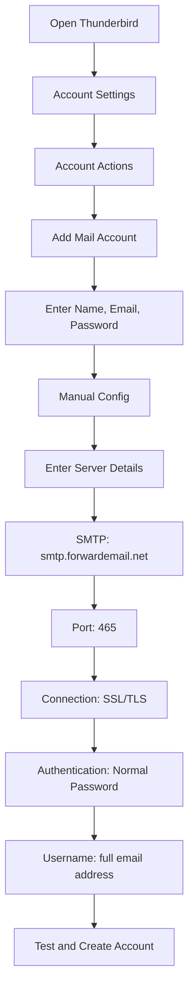

# SMTP Entegrasyon Örnekleri {#smtp-integration-examples}

## İçindekiler {#table-of-contents}

* [Önsöz](#foreword)
* [Forward E-postanın SMTP İşlemesi Nasıl Çalışır?](#how-forward-emails-smtp-processing-works)
  * [E-posta Kuyruğu ve Yeniden Deneme Sistemi](#email-queue-and-retry-system)
  * [Güvenilirlik için Kukla Geçirmez](#dummy-proofed-for-reliability)
* [Node.js Entegrasyonu](#nodejs-integration)
  * [Nodemailer Kullanımı](#using-nodemailer)
  * [Express.js kullanımı](#using-expressjs)
* [Python Entegrasyonu](#python-integration)
  * [smtplib kullanımı](#using-smtplib)
  * [Django'yu Kullanma](#using-django)
* [PHP Entegrasyonu](#php-integration)
  * [PHPMailer Kullanımı](#using-phpmailer)
  * [Laravel Kullanımı](#using-laravel)
* [Ruby Entegrasyonu](#ruby-integration)
  * [Ruby Mail Gem'i Kullanma](#using-ruby-mail-gem)
* [Java Entegrasyonu](#java-integration)
  * [Java Mail API'sini kullanma](#using-javamail-api)
* [E-posta İstemcisi Yapılandırması](#email-client-configuration)
  * [Thunderbird](#thunderbird)
  * [Apple Mail](#apple-mail)
  * [Gmail (Postaları Şu Şekilde Gönder)](#gmail-send-mail-as)
* [Sorun giderme](#troubleshooting)
  * [Yaygın Sorunlar ve Çözümleri](#common-issues-and-solutions)
  * [Yardım Alma](#getting-help)
* [Ek Kaynaklar](#additional-resources)
* [Çözüm](#conclusion)

## Önsöz {#foreword}

Bu kılavuz, çeşitli programlama dilleri, çerçeveler ve e-posta istemcileri kullanarak Forward Email'in SMTP hizmetiyle nasıl entegre olabileceğinize dair ayrıntılı örnekler sunmaktadır. SMTP hizmetimiz, güvenilir, güvenli ve mevcut uygulamalarınızla kolayca entegre edilebilecek şekilde tasarlanmıştır.

## E-postanın SMTP İşlemesinin Nasıl Çalıştığı

Entegrasyon örneklerine dalmadan önce, SMTP hizmetimizin e-postaları nasıl işlediğini anlamak önemlidir:

### E-posta Kuyruğu ve Yeniden Deneme Sistemi {#email-queue-and-retry-system}

Sunucularımıza SMTP yoluyla bir e-posta gönderdiğinizde:

1. **İlk İşleme**: E-posta doğrulanır, kötü amaçlı yazılım taramasından geçirilir ve spam filtrelerine karşı kontrol edilir.
2. **Akıllı Sıralama**: E-postalar, teslimat için gelişmiş bir sıra sistemine yerleştirilir.
3. **Akıllı Yeniden Deneme Mekanizması**: Teslimat geçici olarak başarısız olursa, sistemimiz şunları yapar:
* `getBounceInfo` fonksiyonumuzu kullanarak hata yanıtını analiz eder.
* Sorunun geçici mi (örneğin, "daha sonra tekrar dene", "geçici olarak ertelendi") yoksa kalıcı mı (örneğin, "kullanıcı bilinmiyor") olduğunu belirler.
* Geçici sorunlar için e-postayı yeniden deneme için işaretler.
* Kalıcı sorunlar için geri dönme bildirimi oluşturur.
4. **5 Günlük Yeniden Deneme Süresi**: Teslimatı 5 güne kadar yeniden deneriz (Postfix gibi endüstri standartlarına benzer şekilde), bu da geçici sorunların çözülmesi için zaman tanır.
5. **Teslimat Durumu Bildirimleri**: Göndericiler, e-postalarının durumu (teslim edildi, gecikti veya geri döndü) hakkında bildirimler alır.

> \[!NOTE]
> Başarılı teslimattan sonra, giden SMTP e-posta içeriği, güvenlik ve gizlilik nedeniyle yapılandırılabilir bir saklama süresinden (varsayılan 30 gün) sonra silinir. Geriye yalnızca başarılı teslimatı gösteren bir yer tutucu mesaj kalır.

### Güvenilirlik için Sahteciliğe Karşı Korumalı {#dummy-proofed-for-reliability}

Sistemimiz çeşitli uç durumları ele alacak şekilde tasarlanmıştır:

* Engelleme listesi tespit edilirse, e-posta otomatik olarak yeniden denenecektir.
* Ağ sorunları oluşursa, teslimat yeniden denenecektir.
* Alıcının posta kutusu doluysa, sistem daha sonra yeniden deneyecektir.
* Alıcı sunucu geçici olarak kullanılamıyorsa, denemeye devam edeceğiz.

Bu yaklaşım, gizliliği ve güvenliği koruyarak teslimat oranlarını önemli ölçüde artırır.

## Node.js Entegrasyonu {#nodejs-integration}

### Nodemailer'ı Kullanıyor {#using-nodemailer}

[Nodemailer](https://nodemailer.com/), Node.js uygulamalarından e-posta göndermek için kullanılan popüler bir modüldür.

```javascript
const nodemailer = require('nodemailer');

// Create a transporter object
const transporter = nodemailer.createTransport({
  host: 'smtp.forwardemail.net',
  port: 465,
  secure: true, // Use TLS
  auth: {
    user: 'your-username@your-domain.com',
    pass: 'your-password'
  }
});

// Send mail with defined transport object
async function sendEmail() {
  try {
    const info = await transporter.sendMail({
      from: '"Your Name" <your-username@your-domain.com>',
      to: 'recipient@example.com',
      subject: 'Hello from Forward Email',
      text: 'Hello world! This is a test email sent using Nodemailer and Forward Email SMTP.',
      html: '<b>Hello world!</b> This is a test email sent using Nodemailer and Forward Email SMTP.'
    });

    console.log('Message sent: %s', info.messageId);
  } catch (error) {
    console.error('Error sending email:', error);
  }
}

sendEmail();
```

### Express.js'yi kullanarak {#using-expressjs}

Forward Email SMTP'yi bir Express.js uygulamasıyla nasıl entegre edebileceğiniz aşağıda açıklanmıştır:

```javascript
const express = require('express');
const nodemailer = require('nodemailer');
const app = express();
const port = 3000;

app.use(express.json());

// Configure email transporter
const transporter = nodemailer.createTransport({
  host: 'smtp.forwardemail.net',
  port: 465,
  secure: true,
  auth: {
    user: 'your-username@your-domain.com',
    pass: 'your-password'
  }
});

// API endpoint for sending emails
app.post('/send-email', async (req, res) => {
  const { to, subject, text, html } = req.body;

  try {
    const info = await transporter.sendMail({
      from: '"Your App" <your-username@your-domain.com>',
      to,
      subject,
      text,
      html
    });

    res.status(200).json({
      success: true,
      messageId: info.messageId
    });
  } catch (error) {
    console.error('Error sending email:', error);
    res.status(500).json({
      success: false,
      error: error.message
    });
  }
});

app.listen(port, () => {
  console.log(`Server running at http://localhost:${port}`);
});
```

## Python Entegrasyonu {#python-integration}

### smtplib {#using-smtplib} kullanılıyor

```python
import smtplib
from email.mime.text import MIMEText
from email.mime.multipart import MIMEMultipart

# Email configuration
sender_email = "your-username@your-domain.com"
receiver_email = "recipient@example.com"
password = "your-password"

# Create message
message = MIMEMultipart("alternative")
message["Subject"] = "Hello from Forward Email"
message["From"] = sender_email
message["To"] = receiver_email

# Create the plain-text and HTML version of your message
text = "Hello world! This is a test email sent using Python and Forward Email SMTP."
html = "<html><body><b>Hello world!</b> This is a test email sent using Python and Forward Email SMTP.</body></html>"

# Turn these into plain/html MIMEText objects
part1 = MIMEText(text, "plain")
part2 = MIMEText(html, "html")

# Add HTML/plain-text parts to MIMEMultipart message
message.attach(part1)
message.attach(part2)

# Send email
try:
    server = smtplib.SMTP_SSL("smtp.forwardemail.net", 465)
    server.login(sender_email, password)
    server.sendmail(sender_email, receiver_email, message.as_string())
    server.quit()
    print("Email sent successfully!")
except Exception as e:
    print(f"Error sending email: {e}")
```

### Django'yu Kullanarak {#using-django}

Django uygulamaları için `settings.py`'ınıza aşağıdakileri ekleyin:

```python
# Email settings
EMAIL_BACKEND = 'django.core.mail.backends.smtp.EmailBackend'
EMAIL_HOST = 'smtp.forwardemail.net'
EMAIL_PORT = 465
EMAIL_USE_SSL = True
EMAIL_HOST_USER = 'your-username@your-domain.com'
EMAIL_HOST_PASSWORD = 'your-password'
DEFAULT_FROM_EMAIL = 'your-username@your-domain.com'
```

Daha sonra görünümlerinize göre e-postalar gönderin:

```python
from django.core.mail import send_mail

def send_email_view(request):
    send_mail(
        'Subject here',
        'Here is the message.',
        'from@your-domain.com',
        ['to@example.com'],
        fail_silently=False,
        html_message='<b>Here is the HTML message.</b>'
    )
    return HttpResponse('Email sent!')
```

## PHP Entegrasyonu {#php-integration}

### PHPMailer'ı Kullanarak {#using-phpmailer}

```php
<?php
use PHPMailer\PHPMailer\PHPMailer;
use PHPMailer\PHPMailer\Exception;

require 'vendor/autoload.php';

$mail = new PHPMailer(true);

try {
    // Server settings
    $mail->isSMTP();
    $mail->Host       = 'smtp.forwardemail.net';
    $mail->SMTPAuth   = true;
    $mail->Username   = 'your-username@your-domain.com';
    $mail->Password   = 'your-password';
    $mail->SMTPSecure = PHPMailer::ENCRYPTION_SMTPS;
    $mail->Port       = 465;

    // Recipients
    $mail->setFrom('your-username@your-domain.com', 'Your Name');
    $mail->addAddress('recipient@example.com', 'Recipient Name');
    $mail->addReplyTo('your-username@your-domain.com', 'Your Name');

    // Content
    $mail->isHTML(true);
    $mail->Subject = 'Hello from Forward Email';
    $mail->Body    = '<b>Hello world!</b> This is a test email sent using PHPMailer and Forward Email SMTP.';
    $mail->AltBody = 'Hello world! This is a test email sent using PHPMailer and Forward Email SMTP.';

    $mail->send();
    echo 'Message has been sent';
} catch (Exception $e) {
    echo "Message could not be sent. Mailer Error: {$mail->ErrorInfo}";
}
```

### Laravel {#using-laravel} Kullanımı

Laravel uygulamaları için `.env` dosyanızı güncelleyin:

```sh
MAIL_MAILER=smtp
MAIL_HOST=smtp.forwardemail.net
MAIL_PORT=465
MAIL_USERNAME=your-username@your-domain.com
MAIL_PASSWORD=your-password
MAIL_ENCRYPTION=ssl
MAIL_FROM_ADDRESS=your-username@your-domain.com
MAIL_FROM_NAME="${APP_NAME}"
```

Daha sonra Laravel'in Mail arayüzünü kullanarak e-posta gönderin:

```php
<?php

namespace App\Http\Controllers;

use Illuminate\Http\Request;
use Illuminate\Support\Facades\Mail;
use App\Mail\WelcomeEmail;

class EmailController extends Controller
{
    public function sendEmail()
    {
        Mail::to('recipient@example.com')->send(new WelcomeEmail());

        return 'Email sent successfully!';
    }
}
```

## Ruby Entegrasyonu {#ruby-integration}

### Ruby Mail Gem'ini Kullanma {#using-ruby-mail-gem}

```ruby
require 'mail'

Mail.defaults do
  delivery_method :smtp, {
    address: 'smtp.forwardemail.net',
    port: 465,
    domain: 'your-domain.com',
    user_name: 'your-username@your-domain.com',
    password: 'your-password',
    authentication: 'plain',
    enable_starttls_auto: true,
    ssl: true
  }
end

mail = Mail.new do
  from     'your-username@your-domain.com'
  to       'recipient@example.com'
  subject  'Hello from Forward Email'

  text_part do
    body 'Hello world! This is a test email sent using Ruby Mail and Forward Email SMTP.'
  end

  html_part do
    content_type 'text/html; charset=UTF-8'
    body '<b>Hello world!</b> This is a test email sent using Ruby Mail and Forward Email SMTP.'
  end
end

mail.deliver!
puts "Email sent successfully!"
```

## Java Entegrasyonu {#java-integration}

### JavaMail API'sini Kullanarak {#using-javamail-api}

```java
import java.util.Properties;
import javax.mail.*;
import javax.mail.internet.*;

public class SendEmail {
    public static void main(String[] args) {
        // Sender's email and password
        final String username = "your-username@your-domain.com";
        final String password = "your-password";

        // SMTP server properties
        Properties props = new Properties();
        props.put("mail.smtp.auth", "true");
        props.put("mail.smtp.starttls.enable", "true");
        props.put("mail.smtp.host", "smtp.forwardemail.net");
        props.put("mail.smtp.port", "465");
        props.put("mail.smtp.socketFactory.port", "465");
        props.put("mail.smtp.socketFactory.class", "javax.net.ssl.SSLSocketFactory");

        // Create session with authenticator
        Session session = Session.getInstance(props,
            new javax.mail.Authenticator() {
                protected PasswordAuthentication getPasswordAuthentication() {
                    return new PasswordAuthentication(username, password);
                }
            });

        try {
            // Create message
            Message message = new MimeMessage(session);
            message.setFrom(new InternetAddress(username));
            message.setRecipients(Message.RecipientType.TO, InternetAddress.parse("recipient@example.com"));
            message.setSubject("Hello from Forward Email");

            // Create multipart message
            Multipart multipart = new MimeMultipart("alternative");

            // Text part
            BodyPart textPart = new MimeBodyPart();
            textPart.setText("Hello world! This is a test email sent using JavaMail and Forward Email SMTP.");

            // HTML part
            BodyPart htmlPart = new MimeBodyPart();
            htmlPart.setContent("<b>Hello world!</b> This is a test email sent using JavaMail and Forward Email SMTP.", "text/html");

            // Add parts to multipart
            multipart.addBodyPart(textPart);
            multipart.addBodyPart(htmlPart);

            // Set content
            message.setContent(multipart);

            // Send message
            Transport.send(message);

            System.out.println("Email sent successfully!");

        } catch (MessagingException e) {
            throw new RuntimeException(e);
        }
    }
}
```

## E-posta İstemcisi Yapılandırması {#email-client-configuration}

### Thunderbird {#thunderbird}



1. Thunderbird'ü açın ve Hesap Ayarları'na gidin.
2. "Hesap İşlemleri"ne tıklayın ve "Posta Hesabı Ekle"yi seçin.
3. Adınızı, e-posta adresinizi ve parolanızı girin.
4. "Manuel Yapılandırma"ya tıklayın ve aşağıdaki bilgileri girin:
* Gelen Sunucu:
* IMAP: imap.forwardemail.net, Port: 993, SSL/TLS
* POP3: pop3.forwardemail.net, Port: 995, SSL/TLS
* Giden Sunucu (SMTP): smtp.forwardemail.net, Port: 465, SSL/TLS
* Kimlik Doğrulama: Normal Parola
* Kullanıcı Adı: tam e-posta adresiniz
5. "Test"e ve ardından "Bitti"ye tıklayın.

### Apple Mail {#apple-mail}

1. Mail'i açın ve Mail > Tercihler > Hesaplar'a gidin.
2. Yeni bir hesap eklemek için "+" düğmesine tıklayın.
3. "Diğer Mail Hesabı"nı seçin ve "Devam"a tıklayın.
4. Adınızı, e-posta adresinizi ve şifrenizi girip "Oturum Aç"a tıklayın.
5. Otomatik kurulum başarısız olursa, aşağıdaki bilgileri girin:
* Gelen Posta Sunucusu: imap.forwardemail.net (veya POP3 için pop3.forwardemail.net)
* Giden Posta Sunucusu: smtp.forwardemail.net
* Kullanıcı Adı: tam e-posta adresiniz
* Şifre: şifreniz
6. Kurulumu tamamlamak için "Oturum Aç"a tıklayın.

### Gmail (Postaları Şu Şekilde Gönder) {#gmail-send-mail-as}

1. Gmail'i açın ve Ayarlar > Hesaplar ve İçe Aktarma'ya gidin.
2. "Postaları şu adresten gönder" bölümünde "Başka bir e-posta adresi ekle"ye tıklayın.
3. Adınızı ve e-posta adresinizi girin ve ardından "Sonraki Adım"a tıklayın.
4. Aşağıdaki SMTP sunucusu bilgilerini girin:
* SMTP Sunucusu: smtp.forwardemail.net
* Bağlantı Noktası: 465
* Kullanıcı Adı: tam e-posta adresiniz
* Şifre: şifreniz
* "SSL kullanarak güvenli bağlantı"yı seçin.
5. "Hesap Ekle"ye tıklayın ve e-posta adresinizi doğrulayın.

## Sorun Giderme {#troubleshooting}

### Yaygın Sorunlar ve Çözümleri {#common-issues-and-solutions}

1. **Kimlik Doğrulama Başarısız**
* Kullanıcı adınızı (tam e-posta adresi) ve şifrenizi doğrulayın
* Doğru bağlantı noktasını (SSL/TLS için 465) kullandığınızdan emin olun
* Hesabınızda SMTP erişiminin etkin olup olmadığını kontrol edin

2. **Bağlantı Zaman Aşımı**
* İnternet bağlantınızı kontrol edin
* Güvenlik duvarı ayarlarınızın SMTP trafiğini engellemediğini doğrulayın
* Farklı bir port kullanmayı deneyin (STARTTLS ile 587)

3. **Mesaj Reddedildi**
* "Kimden" adresinizin kimliği doğrulanmış e-postanızla eşleştiğinden emin olun
* IP adresinizin kara listede olup olmadığını kontrol edin
* Mesaj içeriğinizin spam filtrelerini tetiklemediğini doğrulayın

4. **TLS/SSL Hataları**
* Uygulamanızı/kütüphanenizi modern TLS sürümlerini destekleyecek şekilde güncelleyin
* Sisteminizin CA sertifikalarının güncel olduğundan emin olun
* Örtük TLS yerine açık TLS'yi deneyin

### Yardım Alma {#getting-help}

Burada ele alınmayan sorunlarla karşılaşırsanız lütfen:

1. Sık sorulan sorular için [SSS sayfası](/faq) sayfamızı kontrol edin
2. Ayrıntılı bilgi için [e-posta teslimatı hakkında blog yazısı](/blog/docs/best-email-forwarding-service) sayfamızı inceleyin
3. Destek ekibimizle <support@forwardemail.net> adresinden iletişime geçin

## Ek Kaynaklar {#additional-resources}

* [E-posta Belgelerini İlet](/docs)
* [SMTP Sunucusu Sınırları ve Yapılandırması](/faq#what-are-your-outbound-smtp-limits)
* [E-posta En İyi Uygulamalar Kılavuzu](/blog/docs/best-email-forwarding-service)
* [Güvenlik Uygulamaları](/security)

## Sonuç {#conclusion}

Forward Email'in SMTP hizmeti, uygulamalarınızdan ve e-posta istemcilerinizden e-posta göndermenin güvenilir, güvenli ve gizliliğe odaklı bir yolunu sunar. Akıllı kuyruk sistemimiz, 5 günlük yeniden deneme mekanizmamız ve kapsamlı teslimat durumu bildirimlerimizle, e-postalarınızın hedeflerine ulaşacağından emin olabilirsiniz.

Daha gelişmiş kullanım durumları veya özel entegrasyonlar için lütfen destek ekibimizle iletişime geçin.