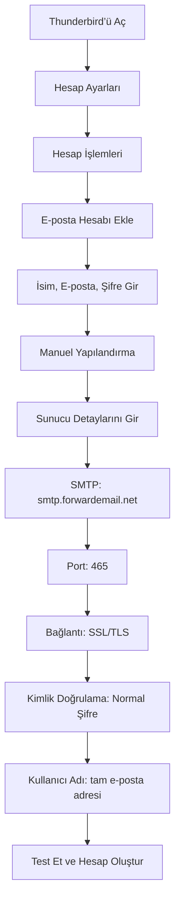

# SMTP Entegrasyon Örnekleri {#smtp-integration-examples}


## İçindekiler {#table-of-contents}

* [Önsöz](#foreword)
* [Forward Email'in SMTP İşleyişi Nasıl Çalışır](#how-forward-emails-smtp-processing-works)
  * [E-posta Kuyruğu ve Tekrar Deneme Sistemi](#email-queue-and-retry-system)
  * [Güvenilirlik İçin Hata Yapılmaz Hale Getirilmiş](#dummy-proofed-for-reliability)
* [Node.js Entegrasyonu](#nodejs-integration)
  * [Nodemailer Kullanımı](#using-nodemailer)
  * [Express.js Kullanımı](#using-expressjs)
* [Python Entegrasyonu](#python-integration)
  * [smtplib Kullanımı](#using-smtplib)
  * [Django Kullanımı](#using-django)
* [PHP Entegrasyonu](#php-integration)
  * [PHPMailer Kullanımı](#using-phpmailer)
  * [Laravel Kullanımı](#using-laravel)
* [Ruby Entegrasyonu](#ruby-integration)
  * [Ruby Mail Gem Kullanımı](#using-ruby-mail-gem)
* [Java Entegrasyonu](#java-integration)
  * [JavaMail API Kullanımı](#using-javamail-api)
* [E-posta İstemcisi Yapılandırması](#email-client-configuration)
  * [Thunderbird](#thunderbird)
  * [Apple Mail](#apple-mail)
  * [Gmail (Gönderici Adresi Olarak Gönder)](#gmail-send-mail-as)
* [Sorun Giderme](#troubleshooting)
  * [Yaygın Sorunlar ve Çözümleri](#common-issues-and-solutions)
  * [Yardım Alma](#getting-help)
* [Ek Kaynaklar](#additional-resources)
* [Sonuç](#conclusion)


## Önsöz {#foreword}

Bu rehber, Forward Email'in SMTP servisi ile çeşitli programlama dilleri, frameworkler ve e-posta istemcileri kullanarak nasıl entegre olunacağını detaylı örneklerle sunar. SMTP servisimiz, güvenilir, güvenli ve mevcut uygulamalarınızla kolayca entegre olacak şekilde tasarlanmıştır.


## Forward Email'in SMTP İşleyişi Nasıl Çalışır {#how-forward-emails-smtp-processing-works}

Entegrasyon örneklerine geçmeden önce, SMTP servisimizin e-postaları nasıl işlediğini anlamak önemlidir:

### E-posta Kuyruğu ve Tekrar Deneme Sistemi {#email-queue-and-retry-system}

SMTP üzerinden sunucularımıza bir e-posta gönderdiğinizde:

1. **İlk İşlem**: E-posta doğrulanır, kötü amaçlı yazılım taramasından geçirilir ve spam filtrelerine karşı kontrol edilir
2. **Akıllı Kuyruklama**: E-postalar teslimat için gelişmiş bir kuyruk sistemine yerleştirilir
3. **Akıllı Tekrar Deneme Mekanizması**: Teslimat geçici olarak başarısız olursa, sistemimiz:
   * `getBounceInfo` fonksiyonumuzu kullanarak hata yanıtını analiz eder
   * Sorunun geçici mi (örneğin, "daha sonra tekrar deneyin", "geçici olarak ertelendi") yoksa kalıcı mı (örneğin, "kullanıcı bilinmiyor") olduğunu belirler
   * Geçici sorunlar için e-posta tekrar denemeye işaretlenir
   * Kalıcı sorunlar için bir bounce bildirimi oluşturulur
4. **5 Günlük Tekrar Deneme Süresi**: Teslimat, geçici sorunların çözülmesi için endüstri standartlarına benzer şekilde (Postfix gibi) 5 güne kadar tekrar denenir
5. **Teslimat Durumu Bildirimleri**: Gönderenler, e-postalarının durumu hakkında (teslim edildi, gecikti veya bounce oldu) bildirim alır

> \[!NOTE]
> Başarılı teslimattan sonra, güvenlik ve gizlilik için yapılandırılabilir bir saklama süresi (varsayılan 30 gün) sonunda giden SMTP e-posta içeriği sansürlenir. Sadece başarılı teslimatı belirten bir yer tutucu mesaj kalır.

### Güvenilirlik İçin Hata Yapılmaz Hale Getirilmiş {#dummy-proofed-for-reliability}

Sistemimiz çeşitli uç durumları yönetmek üzere tasarlanmıştır:

* Eğer bir kara liste tespit edilirse, e-posta otomatik olarak tekrar denenir
* Ağ sorunları oluşursa, teslimat yeniden denenir
* Alıcının posta kutusu doluysa, sistem daha sonra tekrar dener
* Alıcı sunucu geçici olarak kullanılamazsa, denemeye devam ederiz

Bu yaklaşım, gizlilik ve güvenliği korurken teslimat oranlarını önemli ölçüde artırır.


## Node.js Entegrasyonu {#nodejs-integration}

### Nodemailer Kullanımı {#using-nodemailer}

[Nodemailer](https://nodemailer.com/) Node.js uygulamalarından e-posta göndermek için popüler bir modüldür.

```javascript
const nodemailer = require('nodemailer');

// Bir transporter nesnesi oluştur
const transporter = nodemailer.createTransport({
  host: 'smtp.forwardemail.net',
  port: 465,
  secure: true, // TLS kullan
  auth: {
    user: 'your-username@your-domain.com',
    pass: 'your-password'
  }
});

// Tanımlı transporter nesnesi ile mail gönder
async function sendEmail() {
  try {
    const info = await transporter.sendMail({
      from: '"Your Name" <your-username@your-domain.com>',
      to: 'recipient@example.com',
      subject: 'Forward Email’den Merhaba',
      text: 'Merhaba dünya! Bu, Nodemailer ve Forward Email SMTP kullanılarak gönderilen test e-postasıdır.',
      html: '<b>Merhaba dünya!</b> Bu, Nodemailer ve Forward Email SMTP kullanılarak gönderilen test e-postasıdır.'
    });

    console.log('Mesaj gönderildi: %s', info.messageId);
  } catch (error) {
    console.error('E-posta gönderilirken hata:', error);
  }
}

sendEmail();
```
### Express.js Kullanımı {#using-expressjs}

İşte Forward Email SMTP'yi bir Express.js uygulamasıyla nasıl entegre edeceğiniz:

```javascript
const express = require('express');
const nodemailer = require('nodemailer');
const app = express();
const port = 3000;

app.use(express.json());

// E-posta taşıyıcısını yapılandır
const transporter = nodemailer.createTransport({
  host: 'smtp.forwardemail.net',
  port: 465,
  secure: true,
  auth: {
    user: 'your-username@your-domain.com',
    pass: 'your-password'
  }
});

// E-posta gönderimi için API uç noktası
app.post('/send-email', async (req, res) => {
  const { to, subject, text, html } = req.body;

  try {
    const info = await transporter.sendMail({
      from: '"Your App" <your-username@your-domain.com>',
      to,
      subject,
      text,
      html
    });

    res.status(200).json({
      success: true,
      messageId: info.messageId
    });
  } catch (error) {
    console.error('E-posta gönderilirken hata oluştu:', error);
    res.status(500).json({
      success: false,
      error: error.message
    });
  }
});

app.listen(port, () => {
  console.log(`Sunucu çalışıyor: http://localhost:${port}`);
});
```


## Python Entegrasyonu {#python-integration}

### smtplib Kullanımı {#using-smtplib}

```python
import smtplib
from email.mime.text import MIMEText
from email.mime.multipart import MIMEMultipart

# E-posta yapılandırması
sender_email = "your-username@your-domain.com"
receiver_email = "recipient@example.com"
password = "your-password"

# Mesaj oluştur
message = MIMEMultipart("alternative")
message["Subject"] = "Forward Email'den Merhaba"
message["From"] = sender_email
message["To"] = receiver_email

# Mesajınızın düz metin ve HTML versiyonlarını oluşturun
text = "Merhaba dünya! Bu, Python ve Forward Email SMTP kullanılarak gönderilen test e-postasıdır."
html = "<html><body><b>Merhaba dünya!</b> Bu, Python ve Forward Email SMTP kullanılarak gönderilen test e-postasıdır.</body></html>"

# Bunları düz/metin ve HTML MIMEText nesnelerine dönüştür
part1 = MIMEText(text, "plain")
part2 = MIMEText(html, "html")

# HTML/düz metin parçalarını MIMEMultipart mesaja ekle
message.attach(part1)
message.attach(part2)

# E-posta gönder
try:
    server = smtplib.SMTP_SSL("smtp.forwardemail.net", 465)
    server.login(sender_email, password)
    server.sendmail(sender_email, receiver_email, message.as_string())
    server.quit()
    print("E-posta başarıyla gönderildi!")
except Exception as e:
    print(f"E-posta gönderilirken hata oluştu: {e}")
```

### Django Kullanımı {#using-django}

Django uygulamaları için `settings.py` dosyanıza aşağıdakileri ekleyin:

```python
# E-posta ayarları
EMAIL_BACKEND = 'django.core.mail.backends.smtp.EmailBackend'
EMAIL_HOST = 'smtp.forwardemail.net'
EMAIL_PORT = 465
EMAIL_USE_SSL = True
EMAIL_HOST_USER = 'your-username@your-domain.com'
EMAIL_HOST_PASSWORD = 'your-password'
DEFAULT_FROM_EMAIL = 'your-username@your-domain.com'
```

Ardından, görünümlerinizde e-posta gönderin:

```python
from django.core.mail import send_mail

def send_email_view(request):
    send_mail(
        'Konu burada',
        'Mesaj burada.',
        'from@your-domain.com',
        ['to@example.com'],
        fail_silently=False,
        html_message='<b>HTML mesaj burada.</b>'
    )
    return HttpResponse('E-posta gönderildi!')
```


## PHP Entegrasyonu {#php-integration}

### PHPMailer Kullanımı {#using-phpmailer}

```php
<?php
use PHPMailer\PHPMailer\PHPMailer;
use PHPMailer\PHPMailer\Exception;

require 'vendor/autoload.php';

$mail = new PHPMailer(true);

try {
    // Sunucu ayarları
    $mail->isSMTP();
    $mail->Host       = 'smtp.forwardemail.net';
    $mail->SMTPAuth   = true;
    $mail->Username   = 'your-username@your-domain.com';
    $mail->Password   = 'your-password';
    $mail->SMTPSecure = PHPMailer::ENCRYPTION_SMTPS;
    $mail->Port       = 465;

    // Alıcılar
    $mail->setFrom('your-username@your-domain.com', 'Your Name');
    $mail->addAddress('recipient@example.com', 'Recipient Name');
    $mail->addReplyTo('your-username@your-domain.com', 'Your Name');

    // İçerik
    $mail->isHTML(true);
    $mail->Subject = 'Forward Email\'den Merhaba';
    $mail->Body    = '<b>Merhaba dünya!</b> Bu, PHPMailer ve Forward Email SMTP kullanılarak gönderilen test e-postasıdır.';
    $mail->AltBody = 'Merhaba dünya! Bu, PHPMailer ve Forward Email SMTP kullanılarak gönderilen test e-postasıdır.';

    $mail->send();
    echo 'Mesaj gönderildi';
} catch (Exception $e) {
    echo "Mesaj gönderilemedi. Mailer Hatası: {$mail->ErrorInfo}";
}
```
### Laravel Kullanımı {#using-laravel}

Laravel uygulamaları için `.env` dosyanızı güncelleyin:

```sh
MAIL_MAILER=smtp
MAIL_HOST=smtp.forwardemail.net
MAIL_PORT=465
MAIL_USERNAME=your-username@your-domain.com
MAIL_PASSWORD=your-password
MAIL_ENCRYPTION=ssl
MAIL_FROM_ADDRESS=your-username@your-domain.com
MAIL_FROM_NAME="${APP_NAME}"
```

Sonra Laravel'in Mail fasadı kullanarak e-postalar gönderin:

```php
<?php

namespace App\Http\Controllers;

use Illuminate\Http\Request;
use Illuminate\Support\Facades\Mail;
use App\Mail\WelcomeEmail;

class EmailController extends Controller
{
    public function sendEmail()
    {
        Mail::to('recipient@example.com')->send(new WelcomeEmail());

        return 'E-posta başarıyla gönderildi!';
    }
}
```


## Ruby Entegrasyonu {#ruby-integration}

### Ruby Mail Gem Kullanımı {#using-ruby-mail-gem}

```ruby
require 'mail'

Mail.defaults do
  delivery_method :smtp, {
    address: 'smtp.forwardemail.net',
    port: 465,
    domain: 'your-domain.com',
    user_name: 'your-username@your-domain.com',
    password: 'your-password',
    authentication: 'plain',
    enable_starttls_auto: true,
    ssl: true
  }
end

mail = Mail.new do
  from     'your-username@your-domain.com'
  to       'recipient@example.com'
  subject  'Forward Email’den Merhaba'

  text_part do
    body 'Merhaba dünya! Bu, Ruby Mail ve Forward Email SMTP kullanılarak gönderilen test e-postasıdır.'
  end

  html_part do
    content_type 'text/html; charset=UTF-8'
    body '<b>Merhaba dünya!</b> Bu, Ruby Mail ve Forward Email SMTP kullanılarak gönderilen test e-postasıdır.'
  end
end

mail.deliver!
puts "E-posta başarıyla gönderildi!"
```


## Java Entegrasyonu {#java-integration}

### JavaMail API Kullanımı {#using-javamail-api}

```java
import java.util.Properties;
import javax.mail.*;
import javax.mail.internet.*;

public class SendEmail {
    public static void main(String[] args) {
        // Gönderenin e-posta adresi ve şifresi
        final String username = "your-username@your-domain.com";
        final String password = "your-password";

        // SMTP sunucu özellikleri
        Properties props = new Properties();
        props.put("mail.smtp.auth", "true");
        props.put("mail.smtp.starttls.enable", "true");
        props.put("mail.smtp.host", "smtp.forwardemail.net");
        props.put("mail.smtp.port", "465");
        props.put("mail.smtp.socketFactory.port", "465");
        props.put("mail.smtp.socketFactory.class", "javax.net.ssl.SSLSocketFactory");

        // Kimlik doğrulayıcı ile oturum oluştur
        Session session = Session.getInstance(props,
            new javax.mail.Authenticator() {
                protected PasswordAuthentication getPasswordAuthentication() {
                    return new PasswordAuthentication(username, password);
                }
            });

        try {
            // Mesaj oluştur
            Message message = new MimeMessage(session);
            message.setFrom(new InternetAddress(username));
            message.setRecipients(Message.RecipientType.TO, InternetAddress.parse("recipient@example.com"));
            message.setSubject("Forward Email’den Merhaba");

            // Çok parçalı mesaj oluştur
            Multipart multipart = new MimeMultipart("alternative");

            // Metin kısmı
            BodyPart textPart = new MimeBodyPart();
            textPart.setText("Merhaba dünya! Bu, JavaMail ve Forward Email SMTP kullanılarak gönderilen test e-postasıdır.");

            // HTML kısmı
            BodyPart htmlPart = new MimeBodyPart();
            htmlPart.setContent("<b>Merhaba dünya!</b> Bu, JavaMail ve Forward Email SMTP kullanılarak gönderilen test e-postasıdır.", "text/html");

            // Parçaları çok parçalı mesaja ekle
            multipart.addBodyPart(textPart);
            multipart.addBodyPart(htmlPart);

            // İçeriği ayarla
            message.setContent(multipart);

            // Mesajı gönder
            Transport.send(message);

            System.out.println("E-posta başarıyla gönderildi!");

        } catch (MessagingException e) {
            throw new RuntimeException(e);
        }
    }
}
```


## E-posta İstemcisi Yapılandırması {#email-client-configuration}

### Thunderbird {#thunderbird}


```mermaid
flowchart TD
    A[Thunderbird’ü Aç] --> B[Hesap Ayarları]
    B --> C[Hesap İşlemleri]
    C --> D[E-posta Hesabı Ekle]
    D --> E[İsim, E-posta, Şifre Gir]
    E --> F[Manuel Yapılandırma]
    F --> G[Sunucu Detaylarını Gir]
    G --> H[SMTP: smtp.forwardemail.net]
    H --> I[Port: 465]
    I --> J[Bağlantı: SSL/TLS]
    J --> K[Kimlik Doğrulama: Normal Şifre]
    K --> L[Kullanıcı Adı: tam e-posta adresi]
    L --> M[Test Et ve Hesap Oluştur]
```
1. Thunderbird'u açın ve Hesap Ayarları'na gidin  
2. "Hesap İşlemleri"ne tıklayın ve "Posta Hesabı Ekle"yi seçin  
3. Adınızı, e-posta adresinizi ve şifrenizi girin  
4. "Manuel Yapılandırma"ya tıklayın ve aşağıdaki bilgileri girin:  
   * Gelen Sunucu:  
     * IMAP: imap.forwardemail.net, Port: 993, SSL/TLS  
     * POP3: pop3.forwardemail.net, Port: 995, SSL/TLS  
   * Giden Sunucu (SMTP): smtp.forwardemail.net, Port: 465, SSL/TLS  
   * Kimlik Doğrulama: Normal Şifre  
   * Kullanıcı Adı: tam e-posta adresiniz  
5. "Test Et"e tıklayın ve ardından "Tamam"ı seçin  

### Apple Mail {#apple-mail}

1. Mail'i açın ve Mail > Tercihler > Hesaplar'a gidin  
2. Yeni bir hesap eklemek için "+" düğmesine tıklayın  
3. "Diğer Posta Hesabı"nı seçin ve "Devam Et"e tıklayın  
4. Adınızı, e-posta adresinizi ve şifrenizi girin, ardından "Oturum Aç"ı tıklayın  
5. Otomatik kurulum başarısız olursa, aşağıdaki bilgileri girin:  
   * Gelen Posta Sunucusu: imap.forwardemail.net (veya POP3 için pop3.forwardemail.net)  
   * Giden Posta Sunucusu: smtp.forwardemail.net  
   * Kullanıcı Adı: tam e-posta adresiniz  
   * Şifre: şifreniz  
6. Kurulumu tamamlamak için "Oturum Aç"ı tıklayın  

### Gmail (Gönderilen Posta Olarak) {#gmail-send-mail-as}

1. Gmail'i açın ve Ayarlar > Hesaplar ve İçe Aktarma'ya gidin  
2. "Gönderilen posta olarak" altında, "Başka bir e-posta adresi ekle"ye tıklayın  
3. Adınızı ve e-posta adresinizi girin, ardından "Sonraki Adım"ı tıklayın  
4. Aşağıdaki SMTP sunucu bilgilerini girin:  
   * SMTP Sunucusu: smtp.forwardemail.net  
   * Port: 465  
   * Kullanıcı Adı: tam e-posta adresiniz  
   * Şifre: şifreniz  
   * "SSL kullanarak güvenli bağlantı" seçeneğini işaretleyin  
5. "Hesap Ekle"ye tıklayın ve e-posta adresinizi doğrulayın  

## Sorun Giderme {#troubleshooting}

### Yaygın Sorunlar ve Çözümleri {#common-issues-and-solutions}

1. **Kimlik Doğrulama Başarısız**  
   * Kullanıcı adınızı (tam e-posta adresi) ve şifrenizi doğrulayın  
   * Doğru portu kullandığınızdan emin olun (SSL/TLS için 465)  
   * Hesabınızın SMTP erişiminin etkin olup olmadığını kontrol edin  

2. **Bağlantı Zaman Aşımı**  
   * İnternet bağlantınızı kontrol edin  
   * Güvenlik duvarı ayarlarının SMTP trafiğini engellemediğinden emin olun  
   * SSL/TLS ile 465 portunu (önerilen) veya STARTTLS ile 587 portunu deneyin  

3. **Mesaj Reddedildi**  
   * "Kimden" adresinizin doğrulanmış e-posta adresinizle eşleştiğinden emin olun  
   * IP adresinizin kara listede olup olmadığını kontrol edin  
   * Mesaj içeriğinizin spam filtrelerini tetiklemediğini doğrulayın  

4. **TLS/SSL Hataları**  
   * Uygulamanızı/kütüphanenizi modern TLS sürümlerini destekleyecek şekilde güncelleyin  
   * Sisteminizin CA sertifikalarının güncel olduğundan emin olun  
   * Gizli TLS yerine açık TLS kullanmayı deneyin  

### Yardım Alma {#getting-help}

Burada ele alınmayan sorunlarla karşılaşırsanız, lütfen:  

1. Yaygın sorular için [SSS sayfamızı](/faq) kontrol edin  
2. Detaylı bilgi için [e-posta teslimatı hakkındaki blog yazımızı](/blog/docs/best-email-forwarding-service) inceleyin  
3. Destek ekibimizle <support@forwardemail.net> adresinden iletişime geçin  

## Ek Kaynaklar {#additional-resources}

* [Forward Email Dokümantasyonu](/docs)  
* [SMTP Sunucu Limitleri ve Yapılandırması](/faq#what-are-your-outbound-smtp-limits)  
* [E-posta En İyi Uygulamalar Kılavuzu](/blog/docs/best-email-forwarding-service)  
* [Güvenlik Uygulamaları](/security)  

## Sonuç {#conclusion}

Forward Email'in SMTP servisi, uygulamalarınızdan ve e-posta istemcilerinizden e-posta göndermek için güvenilir, güvenli ve gizliliğe odaklı bir yol sunar. Akıllı kuyruk sistemi, 5 günlük yeniden deneme mekanizması ve kapsamlı teslimat durumu bildirimleri ile e-postalarınızın hedefe ulaşacağından emin olabilirsiniz.  

Daha gelişmiş kullanım durumları veya özel entegrasyonlar için lütfen destek ekibimizle iletişime geçin.
