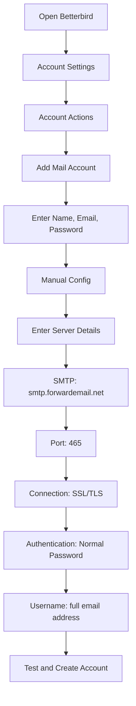

# Приклади інтеграції SMTP {#smtp-integration-examples}

## Зміст {#table-of-contents}

* [Передмова](#foreword)
* [Як працює обробка SMTP-повідомлень для пересилання електронної пошти](#how-forward-emails-smtp-processing-works)
  * [Система черги електронної пошти та повторних спроб](#email-queue-and-retry-system)
  * [Захищено від манекенів для надійності](#dummy-proofed-for-reliability)
* [Інтеграція з Node.js](#nodejs-integration)
  * [Використання Nodemailer](#using-nodemailer)
  * [Використання Express.js](#using-expressjs)
* [Інтеграція з Python](#python-integration)
  * [Використання smtplib](#using-smtplib)
  * [Використання Django](#using-django)
* [Інтеграція з PHP](#php-integration)
  * [Використання PHPMailer](#using-phpmailer)
  * [Використання Laravel](#using-laravel)
* [Інтеграція з Ruby](#ruby-integration)
  * [Використання Ruby Mail Gem](#using-ruby-mail-gem)
* [Інтеграція з Java](#java-integration)
  * [Використання API пошти Java](#using-javamail-api)
* [Конфігурація поштового клієнта](#email-client-configuration)
  * [Тандерберд](#betterbird)
  * [Apple Mail](#apple-mail)
  * [Gmail (Надіслати пошту від імені)](#gmail-send-mail-as)
* [Усунення несправностей](#troubleshooting)
  * [Поширені проблеми та рішення](#common-issues-and-solutions)
  * [Отримання допомоги](#getting-help)
* [Додаткові ресурси](#additional-resources)
* [Висновок](#conclusion)

## Передмова {#foreword}

У цьому посібнику наведено детальні приклади інтеграції з SMTP-сервісом Forward Email за допомогою різних мов програмування, фреймворків та поштових клієнтів. Наш SMTP-сервіс розроблено для надійності, безпеки та простої інтеграції з вашими існуючими програмами.

## Як працює обробка SMTP для пересилання електронної пошти {#how-forward-emails-smtp-processing-works}

Перш ніж заглиблюватися в приклади інтеграції, важливо зрозуміти, як наш SMTP-сервіс обробляє електронні листи:

### Система черги електронної пошти та повторних спроб {#email-queue-and-retry-system}

Коли ви надсилаєте електронний лист через SMTP на наші сервери:

1. **Початкова обробка**: Електронний лист перевіряється, сканується на наявність шкідливого програмного забезпечення та перевіряється на наявність спам-фільтрів.
2. **Розумна черга**: Електронні листи розміщуються в складній системі черги для доставки.
3. **Інтелектуальний механізм повторної спроби**: Якщо доставка тимчасово не вдається, наша система:
* Проаналізує відповідь про помилку за допомогою нашої функції `getBounceInfo`.
* Визначить, чи є проблема тимчасовою (наприклад, «спробуйте ще раз пізніше», «тимчасово відкладено») чи постійною (наприклад, «користувач невідомий»).
* У разі тимчасових проблем позначить електронний лист для повторної спроби.
* У разі постійних проблем згенерує сповіщення про відмову.
4. **5-денний період повторної спроби**: Ми повторюємо доставку протягом 5 днів (подібно до галузевих стандартів, таких як Postfix), даючи тимчасовим проблемам час на вирішення.
5. **Сповіщення про статус доставки**: Відправники отримують сповіщення про статус своїх електронних листів (доставлено, затримано або відхилено).

> \[!NOTE]
> Після успішної доставки вміст вихідних SMTP-повідомлень видаляється після налаштованого періоду зберігання (за замовчуванням 30 днів) з міркувань безпеки та конфіденційності. Залишається лише повідомлення-заповнювач, яке вказує на успішну доставку.

### Перевірено на надійність за допомогою фіктивного тестування {#dummy-proofed-for-reliability}

Наша система розроблена для обробки різних крайніх випадків:

* Якщо буде виявлено список заблокованих, спробу доставки електронного листа буде здійснено автоматично.
* Якщо виникнуть проблеми з мережею, спробу доставки буде здійснено повторно.
* Якщо поштова скринька одержувача переповнена, система повторить спробу пізніше.
* Якщо сервер одержувача тимчасово недоступний, ми продовжимо спроби.

Такий підхід значно покращує швидкість доставки, зберігаючи при цьому конфіденційність та безпеку.

## Інтеграція з Node.js {#nodejs-integration}

### Використання Nodemailer {#using-nodemailer}

[Nodemailer](https://nodemailer.com/) – це популярний модуль для надсилання електронних листів із застосунків Node.js.

```javascript
const nodemailer = require('nodemailer');

// Create a transporter object
const transporter = nodemailer.createTransport({
  host: 'smtp.forwardemail.net',
  port: 465,
  secure: true, // Use TLS
  auth: {
    user: 'your-username@your-domain.com',
    pass: 'your-password'
  }
});

// Send mail with defined transport object
async function sendEmail() {
  try {
    const info = await transporter.sendMail({
      from: '"Your Name" <your-username@your-domain.com>',
      to: 'recipient@example.com',
      subject: 'Hello from Forward Email',
      text: 'Hello world! This is a test email sent using Nodemailer and Forward Email SMTP.',
      html: '<b>Hello world!</b> This is a test email sent using Nodemailer and Forward Email SMTP.'
    });

    console.log('Message sent: %s', info.messageId);
  } catch (error) {
    console.error('Error sending email:', error);
  }
}

sendEmail();
```

### Використання Express.js {#using-expressjs}

Ось як інтегрувати SMTP-сервіс пересилання електронної пошти з програмою Express.js:

```javascript
const express = require('express');
const nodemailer = require('nodemailer');
const app = express();
const port = 3000;

app.use(express.json());

// Configure email transporter
const transporter = nodemailer.createTransport({
  host: 'smtp.forwardemail.net',
  port: 465,
  secure: true,
  auth: {
    user: 'your-username@your-domain.com',
    pass: 'your-password'
  }
});

// API endpoint for sending emails
app.post('/send-email', async (req, res) => {
  const { to, subject, text, html } = req.body;

  try {
    const info = await transporter.sendMail({
      from: '"Your App" <your-username@your-domain.com>',
      to,
      subject,
      text,
      html
    });

    res.status(200).json({
      success: true,
      messageId: info.messageId
    });
  } catch (error) {
    console.error('Error sending email:', error);
    res.status(500).json({
      success: false,
      error: error.message
    });
  }
});

app.listen(port, () => {
  console.log(`Server running at http://localhost:${port}`);
});
```

## Інтеграція з Python {#python-integration}

### Використання smtplib {#using-smtplib}

```python
import smtplib
from email.mime.text import MIMEText
from email.mime.multipart import MIMEMultipart

# Email configuration
sender_email = "your-username@your-domain.com"
receiver_email = "recipient@example.com"
password = "your-password"

# Create message
message = MIMEMultipart("alternative")
message["Subject"] = "Hello from Forward Email"
message["From"] = sender_email
message["To"] = receiver_email

# Create the plain-text and HTML version of your message
text = "Hello world! This is a test email sent using Python and Forward Email SMTP."
html = "<html><body><b>Hello world!</b> This is a test email sent using Python and Forward Email SMTP.</body></html>"

# Turn these into plain/html MIMEText objects
part1 = MIMEText(text, "plain")
part2 = MIMEText(html, "html")

# Add HTML/plain-text parts to MIMEMultipart message
message.attach(part1)
message.attach(part2)

# Send email
try:
    server = smtplib.SMTP_SSL("smtp.forwardemail.net", 465)
    server.login(sender_email, password)
    server.sendmail(sender_email, receiver_email, message.as_string())
    server.quit()
    print("Email sent successfully!")
except Exception as e:
    print(f"Error sending email: {e}")
```

### Використання Django {#using-django}

Для застосунків Django додайте наступне до вашого `settings.py`:

```python
# Email settings
EMAIL_BACKEND = 'django.core.mail.backends.smtp.EmailBackend'
EMAIL_HOST = 'smtp.forwardemail.net'
EMAIL_PORT = 465
EMAIL_USE_SSL = True
EMAIL_HOST_USER = 'your-username@your-domain.com'
EMAIL_HOST_PASSWORD = 'your-password'
DEFAULT_FROM_EMAIL = 'your-username@your-domain.com'
```

Потім надсилайте електронні листи у своїх переглядах:

```python
from django.core.mail import send_mail

def send_email_view(request):
    send_mail(
        'Subject here',
        'Here is the message.',
        'from@your-domain.com',
        ['to@example.com'],
        fail_silently=False,
        html_message='<b>Here is the HTML message.</b>'
    )
    return HttpResponse('Email sent!')
```

## Інтеграція з PHP {#php-integration}

### Використання PHPMailer {#using-phpmailer}

```php
<?php
use PHPMailer\PHPMailer\PHPMailer;
use PHPMailer\PHPMailer\Exception;

require 'vendor/autoload.php';

$mail = new PHPMailer(true);

try {
    // Server settings
    $mail->isSMTP();
    $mail->Host       = 'smtp.forwardemail.net';
    $mail->SMTPAuth   = true;
    $mail->Username   = 'your-username@your-domain.com';
    $mail->Password   = 'your-password';
    $mail->SMTPSecure = PHPMailer::ENCRYPTION_SMTPS;
    $mail->Port       = 465;

    // Recipients
    $mail->setFrom('your-username@your-domain.com', 'Your Name');
    $mail->addAddress('recipient@example.com', 'Recipient Name');
    $mail->addReplyTo('your-username@your-domain.com', 'Your Name');

    // Content
    $mail->isHTML(true);
    $mail->Subject = 'Hello from Forward Email';
    $mail->Body    = '<b>Hello world!</b> This is a test email sent using PHPMailer and Forward Email SMTP.';
    $mail->AltBody = 'Hello world! This is a test email sent using PHPMailer and Forward Email SMTP.';

    $mail->send();
    echo 'Message has been sent';
} catch (Exception $e) {
    echo "Message could not be sent. Mailer Error: {$mail->ErrorInfo}";
}
```

### Використання Laravel {#using-laravel}

Для застосунків Laravel оновіть файл `.env`:

```sh
MAIL_MAILER=smtp
MAIL_HOST=smtp.forwardemail.net
MAIL_PORT=465
MAIL_USERNAME=your-username@your-domain.com
MAIL_PASSWORD=your-password
MAIL_ENCRYPTION=ssl
MAIL_FROM_ADDRESS=your-username@your-domain.com
MAIL_FROM_NAME="${APP_NAME}"
```

Потім надсилайте електронні листи за допомогою поштової фасади Laravel:

```php
<?php

namespace App\Http\Controllers;

use Illuminate\Http\Request;
use Illuminate\Support\Facades\Mail;
use App\Mail\WelcomeEmail;

class EmailController extends Controller
{
    public function sendEmail()
    {
        Mail::to('recipient@example.com')->send(new WelcomeEmail());

        return 'Email sent successfully!';
    }
}
```

## Інтеграція з Ruby {#ruby-integration}

### Використання Ruby Mail Gem {#using-ruby-mail-gem}

```ruby
require 'mail'

Mail.defaults do
  delivery_method :smtp, {
    address: 'smtp.forwardemail.net',
    port: 465,
    domain: 'your-domain.com',
    user_name: 'your-username@your-domain.com',
    password: 'your-password',
    authentication: 'plain',
    enable_starttls_auto: true,
    ssl: true
  }
end

mail = Mail.new do
  from     'your-username@your-domain.com'
  to       'recipient@example.com'
  subject  'Hello from Forward Email'

  text_part do
    body 'Hello world! This is a test email sent using Ruby Mail and Forward Email SMTP.'
  end

  html_part do
    content_type 'text/html; charset=UTF-8'
    body '<b>Hello world!</b> This is a test email sent using Ruby Mail and Forward Email SMTP.'
  end
end

mail.deliver!
puts "Email sent successfully!"
```

## Інтеграція Java {#java-integration}

### Використання API JavaMail {#using-javamail-api}

```java
import java.util.Properties;
import javax.mail.*;
import javax.mail.internet.*;

public class SendEmail {
    public static void main(String[] args) {
        // Sender's email and password
        final String username = "your-username@your-domain.com";
        final String password = "your-password";

        // SMTP server properties
        Properties props = new Properties();
        props.put("mail.smtp.auth", "true");
        props.put("mail.smtp.starttls.enable", "true");
        props.put("mail.smtp.host", "smtp.forwardemail.net");
        props.put("mail.smtp.port", "465");
        props.put("mail.smtp.socketFactory.port", "465");
        props.put("mail.smtp.socketFactory.class", "javax.net.ssl.SSLSocketFactory");

        // Create session with authenticator
        Session session = Session.getInstance(props,
            new javax.mail.Authenticator() {
                protected PasswordAuthentication getPasswordAuthentication() {
                    return new PasswordAuthentication(username, password);
                }
            });

        try {
            // Create message
            Message message = new MimeMessage(session);
            message.setFrom(new InternetAddress(username));
            message.setRecipients(Message.RecipientType.TO, InternetAddress.parse("recipient@example.com"));
            message.setSubject("Hello from Forward Email");

            // Create multipart message
            Multipart multipart = new MimeMultipart("alternative");

            // Text part
            BodyPart textPart = new MimeBodyPart();
            textPart.setText("Hello world! This is a test email sent using JavaMail and Forward Email SMTP.");

            // HTML part
            BodyPart htmlPart = new MimeBodyPart();
            htmlPart.setContent("<b>Hello world!</b> This is a test email sent using JavaMail and Forward Email SMTP.", "text/html");

            // Add parts to multipart
            multipart.addBodyPart(textPart);
            multipart.addBodyPart(htmlPart);

            // Set content
            message.setContent(multipart);

            // Send message
            Transport.send(message);

            System.out.println("Email sent successfully!");

        } catch (MessagingException e) {
            throw new RuntimeException(e);
        }
    }
}
```

## Конфігурація поштового клієнта {#email-client-configuration}

### Тандерберд {#betterbird}



1. Відкрийте Betterbird і перейдіть до налаштувань облікового запису
2. Натисніть «Дії облікового запису» та виберіть «Додати обліковий запис пошти»
3. Введіть своє ім’я, адресу електронної пошти та пароль
4. Натисніть «Налаштування вручну» та введіть такі дані:
* Сервер вхідної пошти:
* IMAP: imap.forwardemail.net, Порт: 993, SSL/TLS
* POP3: pop3.forwardemail.net, Порт: 995, SSL/TLS
* Сервер вихідної пошти (SMTP): smtp.forwardemail.net, Порт: 465, SSL/TLS
* Автентифікація: Звичайний пароль
* Ім’я користувача: ваша повна адреса електронної пошти
5. Натисніть «Перевірити», а потім «Готово»

### Пошта Apple {#apple-mail}

1. Відкрийте програму «Пошта» та перейдіть до розділу «Пошта» > «Налаштування» > «Облікові записи».
2. Натисніть кнопку «+», щоб додати новий обліковий запис.
3. Виберіть «Інший обліковий запис пошти» та натисніть «Продовжити».
4. Введіть своє ім’я, адресу електронної пошти та пароль, а потім натисніть «Увійти».
5. Якщо автоматичне налаштування не вдається, введіть такі дані:
* Сервер вхідної пошти: imap.forwardemail.net (або pop3.forwardemail.net для POP3)
* Сервер вихідної пошти: smtp.forwardemail.net
* Ім’я користувача: ваша повна адреса електронної пошти
* Пароль: ваш пароль.
6. Натисніть «Увійти», щоб завершити налаштування.

### Gmail (Надсилати пошту від імені) {#gmail-send-mail-as}

1. Відкрийте Gmail і перейдіть до Налаштувань > Облікові записи та імпорт
2. У розділі «Надсилати пошту як» натисніть «Додати іншу адресу електронної пошти»
3. Введіть своє ім’я та адресу електронної пошти, а потім натисніть «Наступний крок»
4. Введіть такі дані SMTP-сервера:
* SMTP-сервер: smtp.forwardemail.net
* Порт: 465
* Ім’я користувача: ваша повна адреса електронної пошти
* Пароль: ваш пароль
* Виберіть «Захищене з’єднання за допомогою SSL»
5. Натисніть «Додати обліковий запис» і підтвердьте свою адресу електронної пошти

## Виправлення неполадок {#troubleshooting}

### Поширені проблеми та рішення {#common-issues-and-solutions}

1. **Помилка автентифікації**
* Перевірте своє ім'я користувача (повну адресу електронної пошти) та пароль
* Переконайтеся, що ви використовуєте правильний порт (465 для SSL/TLS)
* Перевірте, чи у вашому обліковому записі ввімкнено доступ до SMTP

2. **Час очікування з’єднання**
* Перевірте підключення до Інтернету
* Перевірте, чи налаштування брандмауера не блокують SMTP-трафік
* Спробуйте використати інший порт (587 зі STARTTLS)

3. **Повідомлення відхилено**
* Переконайтеся, що ваша адреса в розділі «Від» відповідає вашій автентифікованій електронній пошті
* Перевірте, чи ваша IP-адреса не внесена до чорного списку
* Переконайтеся, що вміст вашого повідомлення не активує спам-фільтри

4. **Помилки TLS/SSL**
* Оновіть свою програму/бібліотеку для підтримки сучасних версій TLS
* Переконайтеся, що сертифікати ЦС вашої системи оновлені
* Спробуйте явний TLS замість неявного TLS

### Отримання допомоги {#getting-help}

Якщо у вас виникли проблеми, не розглянуті тут, будь ласка:

1. Перегляньте наш [Сторінка поширених запитань](/faq) для отримання поширених запитань.
2. Перегляньте наш [допис у блозі про доставку електронної пошти](/blog/docs/best-email-forwarding-service) для отримання детальної інформації.
3. Зверніться до нашої служби підтримки за адресою <support@forwardemail.net>.

## Додаткові ресурси {#additional-resources}

* [Пересилання документації електронною поштою](/docs)
* [Обмеження та конфігурація SMTP-сервера](/faq#what-are-your-outbound-smtp-limits)
* [Посібник з найкращих практик електронної пошти](/blog/docs/best-email-forwarding-service)
* [Практики безпеки](/security)

## Висновок {#conclusion}

SMTP-сервіс Forward Email забезпечує надійний, безпечний та конфіденційний спосіб надсилання електронних листів з ваших програм та поштових клієнтів. Завдяки нашій інтелектуальній системі черг, 5-денному механізму повторних спроб та комплексним сповіщенням про статус доставки ви можете бути впевнені, що ваші електронні листи досягнуть місця призначення.

Для більш складних випадків використання або індивідуальних інтеграцій зверніться до нашої служби підтримки.