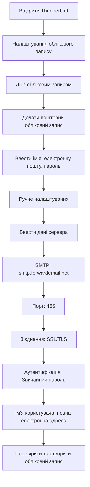

# Приклади інтеграції SMTP {#smtp-integration-examples}


## Зміст {#table-of-contents}

* [Передмова](#foreword)
* [Як працює обробка SMTP у Forward Email](#how-forward-emails-smtp-processing-works)
  * [Черга електронної пошти та система повторних спроб](#email-queue-and-retry-system)
  * [Захищено від помилок для надійності](#dummy-proofed-for-reliability)
* [Інтеграція Node.js](#nodejs-integration)
  * [Використання Nodemailer](#using-nodemailer)
  * [Використання Express.js](#using-expressjs)
* [Інтеграція Python](#python-integration)
  * [Використання smtplib](#using-smtplib)
  * [Використання Django](#using-django)
* [Інтеграція PHP](#php-integration)
  * [Використання PHPMailer](#using-phpmailer)
  * [Використання Laravel](#using-laravel)
* [Інтеграція Ruby](#ruby-integration)
  * [Використання Ruby Mail Gem](#using-ruby-mail-gem)
* [Інтеграція Java](#java-integration)
  * [Використання JavaMail API](#using-javamail-api)
* [Налаштування клієнта електронної пошти](#email-client-configuration)
  * [Thunderbird](#thunderbird)
  * [Apple Mail](#apple-mail)
  * [Gmail (Відправляти листи від імені)](#gmail-send-mail-as)
* [Вирішення проблем](#troubleshooting)
  * [Поширені проблеми та рішення](#common-issues-and-solutions)
  * [Отримання допомоги](#getting-help)
* [Додаткові ресурси](#additional-resources)
* [Висновок](#conclusion)


## Передмова {#foreword}

Цей посібник містить детальні приклади інтеграції з SMTP-сервісом Forward Email за допомогою різних мов програмування, фреймворків та клієнтів електронної пошти. Наш SMTP-сервіс розроблений для надійної, безпечної та легкої інтеграції з вашими існуючими додатками.


## Як працює обробка SMTP у Forward Email {#how-forward-emails-smtp-processing-works}

Перед тим, як перейти до прикладів інтеграції, важливо зрозуміти, як наш SMTP-сервіс обробляє електронні листи:

### Черга електронної пошти та система повторних спроб {#email-queue-and-retry-system}

Коли ви надсилаєте лист через SMTP на наші сервери:

1. **Початкова обробка**: Лист перевіряється, сканується на наявність шкідливого ПЗ та проходить фільтри спаму
2. **Інтелектуальна черга**: Листи розміщуються у складній системі черг для доставки
3. **Інтелектуальний механізм повторних спроб**: Якщо доставка тимчасово не вдається, наша система:
   * Аналізує відповідь про помилку за допомогою функції `getBounceInfo`
   * Визначає, чи є проблема тимчасовою (наприклад, "спробуйте пізніше", "тимчасово відкладено") або постійною (наприклад, "користувач не знайдений")
   * Для тимчасових проблем позначає лист для повторної спроби
   * Для постійних проблем генерує повідомлення про відмову доставки
4. **Період повторних спроб 5 днів**: Ми повторюємо спроби доставки до 5 днів (аналогічно галузевим стандартам, як Postfix), даючи час для вирішення тимчасових проблем
5. **Повідомлення про статус доставки**: Відправники отримують сповіщення про статус своїх листів (доставлено, затримано або відхилено)

> \[!NOTE]
> Після успішної доставки вміст вихідних SMTP-листів редагується після налаштовуваного періоду зберігання (за замовчуванням 30 днів) для безпеки та конфіденційності. Залишається лише повідомлення-заповнювач, що вказує на успішну доставку.

### Захищено від помилок для надійності {#dummy-proofed-for-reliability}

Наша система розроблена для обробки різних крайніх випадків:

* Якщо виявлено блоклист, лист автоматично буде повторно надіслано
* Якщо виникають проблеми з мережею, доставка буде повторена
* Якщо поштовий ящик отримувача переповнений, система спробує пізніше
* Якщо сервер отримувача тимчасово недоступний, ми продовжимо спроби

Такий підхід значно покращує показники доставки, зберігаючи конфіденційність та безпеку.


## Інтеграція Node.js {#nodejs-integration}

### Використання Nodemailer {#using-nodemailer}

[Nodemailer](https://nodemailer.com/) — популярний модуль для надсилання електронних листів з додатків Node.js.

```javascript
const nodemailer = require('nodemailer');

// Створення об'єкта транспорту
const transporter = nodemailer.createTransport({
  host: 'smtp.forwardemail.net',
  port: 465,
  secure: true, // Використовувати TLS
  auth: {
    user: 'your-username@your-domain.com',
    pass: 'your-password'
  }
});

// Надіслати лист за допомогою визначеного об'єкта транспорту
async function sendEmail() {
  try {
    const info = await transporter.sendMail({
      from: '"Ваше ім’я" <your-username@your-domain.com>',
      to: 'recipient@example.com',
      subject: 'Привіт від Forward Email',
      text: 'Привіт, світ! Це тестовий лист, надісланий за допомогою Nodemailer та Forward Email SMTP.',
      html: '<b>Привіт, світ!</b> Це тестовий лист, надісланий за допомогою Nodemailer та Forward Email SMTP.'
    });

    console.log('Повідомлення надіслано: %s', info.messageId);
  } catch (error) {
    console.error('Помилка надсилання листа:', error);
  }
}

sendEmail();
```
### Використання Express.js {#using-expressjs}

Ось як інтегрувати Forward Email SMTP з додатком Express.js:

```javascript
const express = require('express');
const nodemailer = require('nodemailer');
const app = express();
const port = 3000;

app.use(express.json());

// Налаштування транспорту для електронної пошти
const transporter = nodemailer.createTransport({
  host: 'smtp.forwardemail.net',
  port: 465,
  secure: true,
  auth: {
    user: 'your-username@your-domain.com',
    pass: 'your-password'
  }
});

// API-ендпоінт для відправки листів
app.post('/send-email', async (req, res) => {
  const { to, subject, text, html } = req.body;

  try {
    const info = await transporter.sendMail({
      from: '"Your App" <your-username@your-domain.com>',
      to,
      subject,
      text,
      html
    });

    res.status(200).json({
      success: true,
      messageId: info.messageId
    });
  } catch (error) {
    console.error('Error sending email:', error);
    res.status(500).json({
      success: false,
      error: error.message
    });
  }
});

app.listen(port, () => {
  console.log(`Server running at http://localhost:${port}`);
});
```


## Інтеграція Python {#python-integration}

### Використання smtplib {#using-smtplib}

```python
import smtplib
from email.mime.text import MIMEText
from email.mime.multipart import MIMEMultipart

# Налаштування електронної пошти
sender_email = "your-username@your-domain.com"
receiver_email = "recipient@example.com"
password = "your-password"

# Створення повідомлення
message = MIMEMultipart("alternative")
message["Subject"] = "Привіт від Forward Email"
message["From"] = sender_email
message["To"] = receiver_email

# Створення текстової та HTML версії повідомлення
text = "Hello world! This is a test email sent using Python and Forward Email SMTP."
html = "<html><body><b>Hello world!</b> This is a test email sent using Python and Forward Email SMTP.</body></html>"

# Перетворення у MIMEText об'єкти plain/html
part1 = MIMEText(text, "plain")
part2 = MIMEText(html, "html")

# Додавання HTML/текстових частин до MIMEMultipart повідомлення
message.attach(part1)
message.attach(part2)

# Відправка листа
try:
    server = smtplib.SMTP_SSL("smtp.forwardemail.net", 465)
    server.login(sender_email, password)
    server.sendmail(sender_email, receiver_email, message.as_string())
    server.quit()
    print("Email sent successfully!")
except Exception as e:
    print(f"Error sending email: {e}")
```

### Використання Django {#using-django}

Для додатків Django додайте наступне у ваш `settings.py`:

```python
# Налаштування електронної пошти
EMAIL_BACKEND = 'django.core.mail.backends.smtp.EmailBackend'
EMAIL_HOST = 'smtp.forwardemail.net'
EMAIL_PORT = 465
EMAIL_USE_SSL = True
EMAIL_HOST_USER = 'your-username@your-domain.com'
EMAIL_HOST_PASSWORD = 'your-password'
DEFAULT_FROM_EMAIL = 'your-username@your-domain.com'
```

Потім відправляйте листи у ваших views:

```python
from django.core.mail import send_mail

def send_email_view(request):
    send_mail(
        'Тема листа',
        'Ось повідомлення.',
        'from@your-domain.com',
        ['to@example.com'],
        fail_silently=False,
        html_message='<b>Ось HTML повідомлення.</b>'
    )
    return HttpResponse('Лист надіслано!')
```


## Інтеграція PHP {#php-integration}

### Використання PHPMailer {#using-phpmailer}

```php
<?php
use PHPMailer\PHPMailer\PHPMailer;
use PHPMailer\PHPMailer\Exception;

require 'vendor/autoload.php';

$mail = new PHPMailer(true);

try {
    // Налаштування сервера
    $mail->isSMTP();
    $mail->Host       = 'smtp.forwardemail.net';
    $mail->SMTPAuth   = true;
    $mail->Username   = 'your-username@your-domain.com';
    $mail->Password   = 'your-password';
    $mail->SMTPSecure = PHPMailer::ENCRYPTION_SMTPS;
    $mail->Port       = 465;

    // Одержувачі
    $mail->setFrom('your-username@your-domain.com', 'Your Name');
    $mail->addAddress('recipient@example.com', 'Recipient Name');
    $mail->addReplyTo('your-username@your-domain.com', 'Your Name');

    // Вміст
    $mail->isHTML(true);
    $mail->Subject = 'Привіт від Forward Email';
    $mail->Body    = '<b>Hello world!</b> This is a test email sent using PHPMailer and Forward Email SMTP.';
    $mail->AltBody = 'Hello world! This is a test email sent using PHPMailer and Forward Email SMTP.';

    $mail->send();
    echo 'Повідомлення надіслано';
} catch (Exception $e) {
    echo "Повідомлення не може бути надіслано. Помилка Mailer: {$mail->ErrorInfo}";
}
```
### Використання Laravel {#using-laravel}

Для додатків Laravel оновіть ваш файл `.env`:

```sh
MAIL_MAILER=smtp
MAIL_HOST=smtp.forwardemail.net
MAIL_PORT=465
MAIL_USERNAME=your-username@your-domain.com
MAIL_PASSWORD=your-password
MAIL_ENCRYPTION=ssl
MAIL_FROM_ADDRESS=your-username@your-domain.com
MAIL_FROM_NAME="${APP_NAME}"
```

Потім надсилайте листи, використовуючи фасад Mail у Laravel:

```php
<?php

namespace App\Http\Controllers;

use Illuminate\Http\Request;
use Illuminate\Support\Facades\Mail;
use App\Mail\WelcomeEmail;

class EmailController extends Controller
{
    public function sendEmail()
    {
        Mail::to('recipient@example.com')->send(new WelcomeEmail());

        return 'Лист успішно надіслано!';
    }
}
```


## Інтеграція Ruby {#ruby-integration}

### Використання Ruby Mail Gem {#using-ruby-mail-gem}

```ruby
require 'mail'

Mail.defaults do
  delivery_method :smtp, {
    address: 'smtp.forwardemail.net',
    port: 465,
    domain: 'your-domain.com',
    user_name: 'your-username@your-domain.com',
    password: 'your-password',
    authentication: 'plain',
    enable_starttls_auto: true,
    ssl: true
  }
end

mail = Mail.new do
  from     'your-username@your-domain.com'
  to       'recipient@example.com'
  subject  'Привіт від Forward Email'

  text_part do
    body 'Привіт світ! Це тестовий лист, надісланий за допомогою Ruby Mail та Forward Email SMTP.'
  end

  html_part do
    content_type 'text/html; charset=UTF-8'
    body '<b>Привіт світ!</b> Це тестовий лист, надісланий за допомогою Ruby Mail та Forward Email SMTP.'
  end
end

mail.deliver!
puts "Лист успішно надіслано!"
```


## Інтеграція Java {#java-integration}

### Використання JavaMail API {#using-javamail-api}

```java
import java.util.Properties;
import javax.mail.*;
import javax.mail.internet.*;

public class SendEmail {
    public static void main(String[] args) {
        // Електронна пошта та пароль відправника
        final String username = "your-username@your-domain.com";
        final String password = "your-password";

        // Властивості SMTP сервера
        Properties props = new Properties();
        props.put("mail.smtp.auth", "true");
        props.put("mail.smtp.starttls.enable", "true");
        props.put("mail.smtp.host", "smtp.forwardemail.net");
        props.put("mail.smtp.port", "465");
        props.put("mail.smtp.socketFactory.port", "465");
        props.put("mail.smtp.socketFactory.class", "javax.net.ssl.SSLSocketFactory");

        // Створення сесії з автентифікатором
        Session session = Session.getInstance(props,
            new javax.mail.Authenticator() {
                protected PasswordAuthentication getPasswordAuthentication() {
                    return new PasswordAuthentication(username, password);
                }
            });

        try {
            // Створення повідомлення
            Message message = new MimeMessage(session);
            message.setFrom(new InternetAddress(username));
            message.setRecipients(Message.RecipientType.TO, InternetAddress.parse("recipient@example.com"));
            message.setSubject("Привіт від Forward Email");

            // Створення мультипарт повідомлення
            Multipart multipart = new MimeMultipart("alternative");

            // Текстова частина
            BodyPart textPart = new MimeBodyPart();
            textPart.setText("Привіт світ! Це тестовий лист, надісланий за допомогою JavaMail та Forward Email SMTP.");

            // HTML частина
            BodyPart htmlPart = new MimeBodyPart();
            htmlPart.setContent("<b>Привіт світ!</b> Це тестовий лист, надісланий за допомогою JavaMail та Forward Email SMTP.", "text/html");

            // Додавання частин до мультипарту
            multipart.addBodyPart(textPart);
            multipart.addBodyPart(htmlPart);

            // Встановлення вмісту
            message.setContent(multipart);

            // Надсилання повідомлення
            Transport.send(message);

            System.out.println("Лист успішно надіслано!");

        } catch (MessagingException e) {
            throw new RuntimeException(e);
        }
    }
}
```


## Налаштування поштового клієнта {#email-client-configuration}

### Thunderbird {#thunderbird}


```mermaid
flowchart TD
    A[Відкрити Thunderbird] --> B[Налаштування облікового запису]
    B --> C[Дії з обліковим записом]
    C --> D[Додати поштовий обліковий запис]
    D --> E[Ввести ім'я, електронну пошту, пароль]
    E --> F[Ручне налаштування]
    F --> G[Ввести дані сервера]
    G --> H[SMTP: smtp.forwardemail.net]
    H --> I[Порт: 465]
    I --> J[З'єднання: SSL/TLS]
    J --> K[Аутентифікація: Звичайний пароль]
    K --> L[Ім'я користувача: повна електронна адреса]
    L --> M[Перевірити та створити обліковий запис]
```
1. Відкрийте Thunderbird і перейдіть до Налаштувань облікового запису
2. Натисніть "Дії з обліковим записом" і виберіть "Додати поштовий обліковий запис"
3. Введіть своє ім’я, адресу електронної пошти та пароль
4. Натисніть "Ручне налаштування" і введіть такі дані:
   * Вхідний сервер:
     * IMAP: imap.forwardemail.net, Порт: 993, SSL/TLS
     * POP3: pop3.forwardemail.net, Порт: 995, SSL/TLS
   * Вихідний сервер (SMTP): smtp.forwardemail.net, Порт: 465, SSL/TLS
   * Аутентифікація: Звичайний пароль
   * Ім’я користувача: ваша повна адреса електронної пошти
5. Натисніть "Перевірити" і потім "Готово"

### Apple Mail {#apple-mail}

1. Відкрийте Mail і перейдіть у Mail > Налаштування > Облікові записи
2. Натисніть кнопку "+" для додавання нового облікового запису
3. Виберіть "Інший поштовий обліковий запис" і натисніть "Продовжити"
4. Введіть своє ім’я, адресу електронної пошти та пароль, потім натисніть "Увійти"
5. Якщо автоматичне налаштування не вдається, введіть такі дані:
   * Вхідний поштовий сервер: imap.forwardemail.net (або pop3.forwardemail.net для POP3)
   * Вихідний поштовий сервер: smtp.forwardemail.net
   * Ім’я користувача: ваша повна адреса електронної пошти
   * Пароль: ваш пароль
6. Натисніть "Увійти" для завершення налаштування

### Gmail (Відправляти пошту як) {#gmail-send-mail-as}

1. Відкрийте Gmail і перейдіть у Налаштування > Облікові записи та імпорт
2. У розділі "Відправляти пошту як" натисніть "Додати іншу адресу електронної пошти"
3. Введіть своє ім’я та адресу електронної пошти, потім натисніть "Наступний крок"
4. Введіть такі дані SMTP сервера:
   * SMTP сервер: smtp.forwardemail.net
   * Порт: 465
   * Ім’я користувача: ваша повна адреса електронної пошти
   * Пароль: ваш пароль
   * Виберіть "Захищене з’єднання за допомогою SSL"
5. Натисніть "Додати обліковий запис" і підтвердіть свою адресу електронної пошти


## Усунення несправностей {#troubleshooting}

### Поширені проблеми та рішення {#common-issues-and-solutions}

1. **Помилка аутентифікації**
   * Перевірте своє ім’я користувача (повна адреса електронної пошти) та пароль
   * Переконайтеся, що ви використовуєте правильний порт (465 для SSL/TLS)
   * Перевірте, чи увімкнено доступ до SMTP для вашого облікового запису

2. **Тайм-аут з’єднання**
   * Перевірте своє інтернет-з’єднання
   * Переконайтеся, що налаштування брандмауера не блокують SMTP-трафік
   * Спробуйте використовувати порт 465 з SSL/TLS (рекомендовано) або порт 587 з STARTTLS

3. **Повідомлення відхилено**
   * Переконайтеся, що адреса "Від" збігається з вашою аутентифікованою електронною поштою
   * Перевірте, чи не внесено вашу IP-адресу до чорного списку
   * Переконайтеся, що вміст повідомлення не викликає спам-фільтри

4. **Помилки TLS/SSL**
   * Оновіть свій додаток/бібліотеку для підтримки сучасних версій TLS
   * Переконайтеся, що сертифікати CA вашої системи актуальні
   * Спробуйте явний TLS замість неявного TLS

### Отримання допомоги {#getting-help}

Якщо ви зіткнулися з проблемами, які тут не описані, будь ласка:

1. Перевірте нашу [сторінку FAQ](/faq) для поширених запитань
2. Ознайомтеся з нашим [постом у блозі про доставку електронної пошти](/blog/docs/best-email-forwarding-service) для детальної інформації
3. Зв’яжіться з нашою службою підтримки за адресою <support@forwardemail.net>


## Додаткові ресурси {#additional-resources}

* [Документація Forward Email](/docs)
* [Обмеження та налаштування SMTP сервера](/faq#what-are-your-outbound-smtp-limits)
* [Посібник з найкращих практик електронної пошти](/blog/docs/best-email-forwarding-service)
* [Практики безпеки](/security)


## Висновок {#conclusion}

SMTP-сервіс Forward Email забезпечує надійний, безпечний та орієнтований на конфіденційність спосіб надсилання електронної пошти з ваших додатків та поштових клієнтів. Завдяки нашій інтелектуальній системі черги, механізму повторних спроб протягом 5 днів та комплексним сповіщенням про статус доставки, ви можете бути впевнені, що ваші листи досягнуть адресата.

Для більш складних випадків використання або індивідуальних інтеграцій, будь ласка, звертайтеся до нашої служби підтримки.
