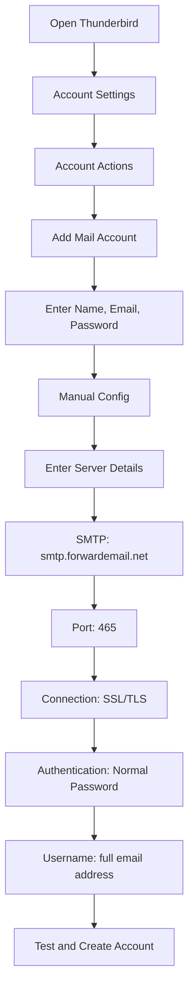

# Ví dụ tích hợp SMTP {#smtp-integration-examples}

## Mục lục {#table-of-contents}

* [Lời nói đầu](#foreword)
* [Cách thức hoạt động của quy trình xử lý SMTP của Forward Email](#how-forward-emails-smtp-processing-works)
  * [Hệ thống hàng đợi và thử lại email](#email-queue-and-retry-system)
  * [Được chứng minh là đáng tin cậy](#dummy-proofed-for-reliability)
* [Tích hợp Node.js](#nodejs-integration)
  * [Sử dụng Nodemailer](#using-nodemailer)
  * [Sử dụng Express.js](#using-expressjs)
* [Tích hợp Python](#python-integration)
  * [Sử dụng smtplib](#using-smtplib)
  * [Sử dụng Django](#using-django)
* [Tích hợp PHP](#php-integration)
  * [Sử dụng PHPMailer](#using-phpmailer)
  * [Sử dụng Laravel](#using-laravel)
* [Tích hợp Ruby](#ruby-integration)
  * [Sử dụng Ruby Mail Gem](#using-ruby-mail-gem)
* [Tích hợp Java](#java-integration)
  * [Sử dụng Java Mail API](#using-javamail-api)
* [Cấu hình máy khách email](#email-client-configuration)
  * [Chim Sấm Sét](#thunderbird)
  * [Apple Mail](#apple-mail)
  * [Gmail (Gửi thư dưới dạng)](#gmail-send-mail-as)
* [Xử lý sự cố](#troubleshooting)
  * [Các vấn đề phổ biến và giải pháp](#common-issues-and-solutions)
  * [Nhận trợ giúp](#getting-help)
* [Tài nguyên bổ sung](#additional-resources)
* [Phần kết luận](#conclusion)

## Lời nói đầu {#foreword}

Hướng dẫn này cung cấp các ví dụ chi tiết về cách tích hợp với dịch vụ SMTP của Forward Email bằng nhiều ngôn ngữ lập trình, khung và ứng dụng email khác nhau. Dịch vụ SMTP của chúng tôi được thiết kế để đảm bảo độ tin cậy, bảo mật và dễ dàng tích hợp với các ứng dụng hiện có của bạn.

## Cách thức hoạt động của quy trình xử lý SMTP của Email chuyển tiếp {#how-forward-emails-smtp-processing-works}

Trước khi tìm hiểu sâu hơn về các ví dụ tích hợp, điều quan trọng là phải hiểu cách dịch vụ SMTP của chúng tôi xử lý email:

### Hệ thống hàng đợi và thử lại email {#email-queue-and-retry-system}

Khi bạn gửi email qua SMTP tới máy chủ của chúng tôi:

1. **Xử lý ban đầu**: Email được xác thực, quét phần mềm độc hại và kiểm tra với bộ lọc thư rác.
2. **Xếp hàng thông minh**: Email được đưa vào hệ thống xếp hàng tinh vi để gửi đi.
3. **Cơ chế thử lại thông minh**: Nếu việc gửi đi tạm thời không thành công, hệ thống của chúng tôi sẽ:
* Phân tích phản hồi lỗi bằng hàm `getBounceInfo`
* Xác định xem sự cố là tạm thời (ví dụ: "thử lại sau", "tạm hoãn") hay vĩnh viễn (ví dụ: "người dùng không xác định")
* Đối với các sự cố tạm thời, hãy đánh dấu email để thử lại.
* Đối với các sự cố vĩnh viễn, hãy tạo thông báo trả lại.
4. **Thời gian thử lại 5 ngày**: Chúng tôi thử lại việc gửi đi trong tối đa 5 ngày (tương tự như các tiêu chuẩn ngành như Postfix), cho phép các sự cố tạm thời có thời gian để giải quyết.
5. **Thông báo trạng thái gửi đi**: Người gửi sẽ nhận được thông báo về trạng thái email của họ (đã gửi, bị trì hoãn hoặc bị trả lại).

> \[!NOTE]
> Sau khi gửi thành công, nội dung email SMTP gửi đi sẽ được biên tập lại sau một khoảng thời gian lưu trữ có thể cấu hình (mặc định là 30 ngày) để đảm bảo an toàn và riêng tư. Chỉ còn lại một thông báo giữ chỗ cho biết việc gửi thành công.

### Đã được kiểm chứng về độ tin cậy {#dummy-proofed-for-reliability}

Hệ thống của chúng tôi được thiết kế để xử lý nhiều trường hợp ngoại lệ:

* Nếu phát hiện có danh sách chặn, email sẽ tự động được thử lại.
* Nếu xảy ra sự cố mạng, việc gửi thư sẽ được thử lại.
* Nếu hộp thư của người nhận đã đầy, hệ thống sẽ thử lại sau.
* Nếu máy chủ nhận thư tạm thời không khả dụng, chúng tôi sẽ tiếp tục thử.

Cách tiếp cận này cải thiện đáng kể tỷ lệ gửi thư trong khi vẫn đảm bảo quyền riêng tư và bảo mật.

## Tích hợp Node.js {#nodejs-integration}

### Sử dụng Nodemailer {#using-nodemailer}

[Nodemailer](https://nodemailer.com/) là một mô-đun phổ biến để gửi email từ các ứng dụng Node.js.

```javascript
const nodemailer = require('nodemailer');

// Create a transporter object
const transporter = nodemailer.createTransport({
  host: 'smtp.forwardemail.net',
  port: 465,
  secure: true, // Use TLS
  auth: {
    user: 'your-username@your-domain.com',
    pass: 'your-password'
  }
});

// Send mail with defined transport object
async function sendEmail() {
  try {
    const info = await transporter.sendMail({
      from: '"Your Name" <your-username@your-domain.com>',
      to: 'recipient@example.com',
      subject: 'Hello from Forward Email',
      text: 'Hello world! This is a test email sent using Nodemailer and Forward Email SMTP.',
      html: '<b>Hello world!</b> This is a test email sent using Nodemailer and Forward Email SMTP.'
    });

    console.log('Message sent: %s', info.messageId);
  } catch (error) {
    console.error('Error sending email:', error);
  }
}

sendEmail();
```

### Sử dụng Express.js {#using-expressjs}

Sau đây là cách tích hợp Forward Email SMTP với ứng dụng Express.js:

```javascript
const express = require('express');
const nodemailer = require('nodemailer');
const app = express();
const port = 3000;

app.use(express.json());

// Configure email transporter
const transporter = nodemailer.createTransport({
  host: 'smtp.forwardemail.net',
  port: 465,
  secure: true,
  auth: {
    user: 'your-username@your-domain.com',
    pass: 'your-password'
  }
});

// API endpoint for sending emails
app.post('/send-email', async (req, res) => {
  const { to, subject, text, html } = req.body;

  try {
    const info = await transporter.sendMail({
      from: '"Your App" <your-username@your-domain.com>',
      to,
      subject,
      text,
      html
    });

    res.status(200).json({
      success: true,
      messageId: info.messageId
    });
  } catch (error) {
    console.error('Error sending email:', error);
    res.status(500).json({
      success: false,
      error: error.message
    });
  }
});

app.listen(port, () => {
  console.log(`Server running at http://localhost:${port}`);
});
```

## Tích hợp Python {#python-integration}

### Sử dụng smtplib {#using-smtplib}

```python
import smtplib
from email.mime.text import MIMEText
from email.mime.multipart import MIMEMultipart

# Email configuration
sender_email = "your-username@your-domain.com"
receiver_email = "recipient@example.com"
password = "your-password"

# Create message
message = MIMEMultipart("alternative")
message["Subject"] = "Hello from Forward Email"
message["From"] = sender_email
message["To"] = receiver_email

# Create the plain-text and HTML version of your message
text = "Hello world! This is a test email sent using Python and Forward Email SMTP."
html = "<html><body><b>Hello world!</b> This is a test email sent using Python and Forward Email SMTP.</body></html>"

# Turn these into plain/html MIMEText objects
part1 = MIMEText(text, "plain")
part2 = MIMEText(html, "html")

# Add HTML/plain-text parts to MIMEMultipart message
message.attach(part1)
message.attach(part2)

# Send email
try:
    server = smtplib.SMTP_SSL("smtp.forwardemail.net", 465)
    server.login(sender_email, password)
    server.sendmail(sender_email, receiver_email, message.as_string())
    server.quit()
    print("Email sent successfully!")
except Exception as e:
    print(f"Error sending email: {e}")
```

### Sử dụng Django {#using-django}

Đối với các ứng dụng Django, hãy thêm nội dung sau vào `settings.py` của bạn:

```python
# Email settings
EMAIL_BACKEND = 'django.core.mail.backends.smtp.EmailBackend'
EMAIL_HOST = 'smtp.forwardemail.net'
EMAIL_PORT = 465
EMAIL_USE_SSL = True
EMAIL_HOST_USER = 'your-username@your-domain.com'
EMAIL_HOST_PASSWORD = 'your-password'
DEFAULT_FROM_EMAIL = 'your-username@your-domain.com'
```

Sau đó gửi email theo quan điểm của bạn:

```python
from django.core.mail import send_mail

def send_email_view(request):
    send_mail(
        'Subject here',
        'Here is the message.',
        'from@your-domain.com',
        ['to@example.com'],
        fail_silently=False,
        html_message='<b>Here is the HTML message.</b>'
    )
    return HttpResponse('Email sent!')
```

## Tích hợp PHP {#php-integration}

### Sử dụng PHPMailer {#using-phpmailer}

```php
<?php
use PHPMailer\PHPMailer\PHPMailer;
use PHPMailer\PHPMailer\Exception;

require 'vendor/autoload.php';

$mail = new PHPMailer(true);

try {
    // Server settings
    $mail->isSMTP();
    $mail->Host       = 'smtp.forwardemail.net';
    $mail->SMTPAuth   = true;
    $mail->Username   = 'your-username@your-domain.com';
    $mail->Password   = 'your-password';
    $mail->SMTPSecure = PHPMailer::ENCRYPTION_SMTPS;
    $mail->Port       = 465;

    // Recipients
    $mail->setFrom('your-username@your-domain.com', 'Your Name');
    $mail->addAddress('recipient@example.com', 'Recipient Name');
    $mail->addReplyTo('your-username@your-domain.com', 'Your Name');

    // Content
    $mail->isHTML(true);
    $mail->Subject = 'Hello from Forward Email';
    $mail->Body    = '<b>Hello world!</b> This is a test email sent using PHPMailer and Forward Email SMTP.';
    $mail->AltBody = 'Hello world! This is a test email sent using PHPMailer and Forward Email SMTP.';

    $mail->send();
    echo 'Message has been sent';
} catch (Exception $e) {
    echo "Message could not be sent. Mailer Error: {$mail->ErrorInfo}";
}
```

### Sử dụng Laravel {#using-laravel}

Đối với các ứng dụng Laravel, hãy cập nhật tệp `.env` của bạn:

```sh
MAIL_MAILER=smtp
MAIL_HOST=smtp.forwardemail.net
MAIL_PORT=465
MAIL_USERNAME=your-username@your-domain.com
MAIL_PASSWORD=your-password
MAIL_ENCRYPTION=ssl
MAIL_FROM_ADDRESS=your-username@your-domain.com
MAIL_FROM_NAME="${APP_NAME}"
```

Sau đó gửi email bằng giao diện Mail của Laravel:

```php
<?php

namespace App\Http\Controllers;

use Illuminate\Http\Request;
use Illuminate\Support\Facades\Mail;
use App\Mail\WelcomeEmail;

class EmailController extends Controller
{
    public function sendEmail()
    {
        Mail::to('recipient@example.com')->send(new WelcomeEmail());

        return 'Email sent successfully!';
    }
}
```

## Tích hợp Ruby {#ruby-integration}

### Sử dụng Ruby Mail Gem {#using-ruby-mail-gem}

```ruby
require 'mail'

Mail.defaults do
  delivery_method :smtp, {
    address: 'smtp.forwardemail.net',
    port: 465,
    domain: 'your-domain.com',
    user_name: 'your-username@your-domain.com',
    password: 'your-password',
    authentication: 'plain',
    enable_starttls_auto: true,
    ssl: true
  }
end

mail = Mail.new do
  from     'your-username@your-domain.com'
  to       'recipient@example.com'
  subject  'Hello from Forward Email'

  text_part do
    body 'Hello world! This is a test email sent using Ruby Mail and Forward Email SMTP.'
  end

  html_part do
    content_type 'text/html; charset=UTF-8'
    body '<b>Hello world!</b> This is a test email sent using Ruby Mail and Forward Email SMTP.'
  end
end

mail.deliver!
puts "Email sent successfully!"
```

## Tích hợp Java {#java-integration}

### Sử dụng JavaMail API {#using-javamail-api}

```java
import java.util.Properties;
import javax.mail.*;
import javax.mail.internet.*;

public class SendEmail {
    public static void main(String[] args) {
        // Sender's email and password
        final String username = "your-username@your-domain.com";
        final String password = "your-password";

        // SMTP server properties
        Properties props = new Properties();
        props.put("mail.smtp.auth", "true");
        props.put("mail.smtp.starttls.enable", "true");
        props.put("mail.smtp.host", "smtp.forwardemail.net");
        props.put("mail.smtp.port", "465");
        props.put("mail.smtp.socketFactory.port", "465");
        props.put("mail.smtp.socketFactory.class", "javax.net.ssl.SSLSocketFactory");

        // Create session with authenticator
        Session session = Session.getInstance(props,
            new javax.mail.Authenticator() {
                protected PasswordAuthentication getPasswordAuthentication() {
                    return new PasswordAuthentication(username, password);
                }
            });

        try {
            // Create message
            Message message = new MimeMessage(session);
            message.setFrom(new InternetAddress(username));
            message.setRecipients(Message.RecipientType.TO, InternetAddress.parse("recipient@example.com"));
            message.setSubject("Hello from Forward Email");

            // Create multipart message
            Multipart multipart = new MimeMultipart("alternative");

            // Text part
            BodyPart textPart = new MimeBodyPart();
            textPart.setText("Hello world! This is a test email sent using JavaMail and Forward Email SMTP.");

            // HTML part
            BodyPart htmlPart = new MimeBodyPart();
            htmlPart.setContent("<b>Hello world!</b> This is a test email sent using JavaMail and Forward Email SMTP.", "text/html");

            // Add parts to multipart
            multipart.addBodyPart(textPart);
            multipart.addBodyPart(htmlPart);

            // Set content
            message.setContent(multipart);

            // Send message
            Transport.send(message);

            System.out.println("Email sent successfully!");

        } catch (MessagingException e) {
            throw new RuntimeException(e);
        }
    }
}
```

## Cấu hình máy khách email {#email-client-configuration}

### Thunderbird {#thunderbird}



1. Mở Thunderbird và vào Cài đặt Tài khoản
2. Nhấp vào "Hành động Tài khoản" và chọn "Thêm Tài khoản Thư"
3. Nhập tên, địa chỉ email và mật khẩu của bạn
4. Nhấp vào "Cấu hình Thủ công" và nhập các thông tin sau:
* Máy chủ Thư đến:
* IMAP: imap.forwardemail.net, Cổng: 993, SSL/TLS
* POP3: pop3.forwardemail.net, Cổng: 995, SSL/TLS
* Máy chủ Thư đi (SMTP): smtp.forwardemail.net, Cổng: 465, SSL/TLS
* Xác thực: Mật khẩu Thường
* Tên người dùng: địa chỉ email đầy đủ của bạn
5. Nhấp vào "Kiểm tra" rồi chọn "Hoàn tất"

### Apple Mail {#apple-mail}

1. Mở Mail và vào Mail > Tùy chọn > Tài khoản
2. Nhấp vào nút "+" để thêm tài khoản mới
3. Chọn "Tài khoản Mail Khác" và nhấp vào "Tiếp tục"
4. Nhập tên, địa chỉ email và mật khẩu của bạn, sau đó nhấp vào "Đăng nhập"
5. Khi thiết lập tự động không thành công, hãy nhập các thông tin sau:
* Máy chủ Thư đến: imap.forwardemail.net (hoặc pop3.forwardemail.net cho POP3)
* Máy chủ Thư đi: smtp.forwardemail.net
* Tên người dùng: địa chỉ email đầy đủ của bạn
* Mật khẩu: mật khẩu của bạn
6. Nhấp vào "Đăng nhập" để hoàn tất thiết lập

### Gmail (Gửi thư dưới dạng) {#gmail-send-mail-as}

1. Mở Gmail và vào Cài đặt > Tài khoản và Nhập
2. Trong mục "Gửi thư bằng địa chỉ", nhấp vào "Thêm địa chỉ email khác"
3. Nhập tên và địa chỉ email của bạn, sau đó nhấp vào "Bước tiếp theo"
4. Nhập thông tin máy chủ SMTP sau:
* Máy chủ SMTP: smtp.forwardemail.net
* Cổng: 465
* Tên người dùng: địa chỉ email đầy đủ của bạn
* Mật khẩu: mật khẩu của bạn
* Chọn "Kết nối bảo mật sử dụng SSL"
5. Nhấp vào "Thêm tài khoản" và xác minh địa chỉ email của bạn

## Khắc phục sự cố {#troubleshooting}

### Các vấn đề thường gặp và giải pháp {#common-issues-and-solutions}

1. **Xác thực không thành công**
* Xác minh tên người dùng (địa chỉ email đầy đủ) và mật khẩu của bạn
* Đảm bảo bạn đang sử dụng đúng cổng (465 cho SSL/TLS)
* Kiểm tra xem tài khoản của bạn đã bật quyền truy cập SMTP chưa

2. **Hết thời gian kết nối**
* Kiểm tra kết nối internet của bạn
* Xác minh rằng cài đặt tường lửa không chặn lưu lượng SMTP
* Thử sử dụng một cổng khác (587 với STARTTLS)

3. **Tin nhắn bị từ chối**
* Đảm bảo địa chỉ "Từ" của bạn khớp với email đã xác thực
* Kiểm tra xem IP của bạn có bị đưa vào danh sách đen không
* Xác minh nội dung tin nhắn của bạn không kích hoạt bộ lọc thư rác

4. **Lỗi TLS/SSL**
* Cập nhật ứng dụng/thư viện của bạn để hỗ trợ các phiên bản TLS hiện đại
* Đảm bảo chứng chỉ CA của hệ thống được cập nhật
* Hãy thử sử dụng TLS rõ ràng thay vì TLS ngầm định

### Nhận trợ giúp {#getting-help}

Nếu bạn gặp phải vấn đề không được đề cập ở đây, vui lòng:

1. Xem [Trang câu hỏi thường gặp](/faq) của chúng tôi để biết các câu hỏi thường gặp
2. Xem [bài đăng trên blog về việc gửi email](/blog/docs/best-email-forwarding-service) của chúng tôi để biết thông tin chi tiết
3. Liên hệ với nhóm hỗ trợ của chúng tôi tại <support@forwardemail.net>

## Tài nguyên bổ sung {#additional-resources}

* [Chuyển tiếp tài liệu email](/docs)
* [Giới hạn và cấu hình máy chủ SMTP](/faq#what-are-your-outbound-smtp-limits)
* [Hướng dẫn thực hành tốt nhất về email](/blog/docs/best-email-forwarding-service)
* [Thực hành bảo mật](/security)

## Kết luận {#conclusion}

Dịch vụ SMTP của Forward Email cung cấp một giải pháp đáng tin cậy, an toàn và tập trung vào quyền riêng tư để gửi email từ các ứng dụng và máy khách email của bạn. Với hệ thống xếp hàng thông minh, cơ chế thử lại sau 5 ngày và thông báo trạng thái gửi email toàn diện, bạn có thể hoàn toàn yên tâm rằng email của mình sẽ đến đích.

Để biết thêm các trường hợp sử dụng nâng cao hoặc tích hợp tùy chỉnh, vui lòng liên hệ với nhóm hỗ trợ của chúng tôi.