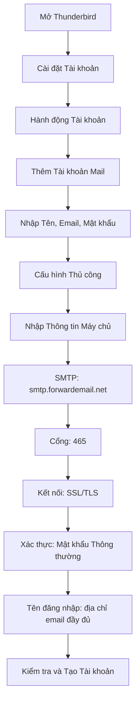

# Ví dụ Tích hợp SMTP {#smtp-integration-examples}


## Mục lục {#table-of-contents}

* [Lời nói đầu](#foreword)
* [Cách Forward Email xử lý SMTP](#how-forward-emails-smtp-processing-works)
  * [Hệ thống hàng đợi và thử lại email](#email-queue-and-retry-system)
  * [Được thiết kế dễ dùng để đảm bảo độ tin cậy](#dummy-proofed-for-reliability)
* [Tích hợp Node.js](#nodejs-integration)
  * [Sử dụng Nodemailer](#using-nodemailer)
  * [Sử dụng Express.js](#using-expressjs)
* [Tích hợp Python](#python-integration)
  * [Sử dụng smtplib](#using-smtplib)
  * [Sử dụng Django](#using-django)
* [Tích hợp PHP](#php-integration)
  * [Sử dụng PHPMailer](#using-phpmailer)
  * [Sử dụng Laravel](#using-laravel)
* [Tích hợp Ruby](#ruby-integration)
  * [Sử dụng Ruby Mail Gem](#using-ruby-mail-gem)
* [Tích hợp Java](#java-integration)
  * [Sử dụng JavaMail API](#using-javamail-api)
* [Cấu hình Email Client](#email-client-configuration)
  * [Thunderbird](#thunderbird)
  * [Apple Mail](#apple-mail)
  * [Gmail (Gửi thư dưới dạng)](#gmail-send-mail-as)
* [Khắc phục sự cố](#troubleshooting)
  * [Các vấn đề và giải pháp phổ biến](#common-issues-and-solutions)
  * [Nhận trợ giúp](#getting-help)
* [Tài nguyên bổ sung](#additional-resources)
* [Kết luận](#conclusion)


## Lời nói đầu {#foreword}

Hướng dẫn này cung cấp các ví dụ chi tiết về cách tích hợp với dịch vụ SMTP của Forward Email sử dụng nhiều ngôn ngữ lập trình, framework và email client khác nhau. Dịch vụ SMTP của chúng tôi được thiết kế để đáng tin cậy, bảo mật và dễ dàng tích hợp với các ứng dụng hiện có của bạn.


## Cách Forward Email xử lý SMTP {#how-forward-emails-smtp-processing-works}

Trước khi đi vào các ví dụ tích hợp, điều quan trọng là hiểu cách dịch vụ SMTP của chúng tôi xử lý email:

### Hệ thống hàng đợi và thử lại email {#email-queue-and-retry-system}

Khi bạn gửi một email qua SMTP đến máy chủ của chúng tôi:

1. **Xử lý ban đầu**: Email được xác thực, quét phần mềm độc hại và kiểm tra qua bộ lọc spam
2. **Hàng đợi thông minh**: Email được đặt vào hệ thống hàng đợi tinh vi để gửi đi
3. **Cơ chế thử lại thông minh**: Nếu việc gửi thất bại tạm thời, hệ thống của chúng tôi sẽ:
   * Phân tích phản hồi lỗi bằng hàm `getBounceInfo`
   * Xác định xem vấn đề là tạm thời (ví dụ: "thử lại sau", "tạm thời hoãn") hay vĩnh viễn (ví dụ: "người dùng không tồn tại")
   * Với các vấn đề tạm thời, đánh dấu email để thử lại
   * Với các vấn đề vĩnh viễn, tạo thông báo trả lại (bounce)
4. **Thời gian thử lại 5 ngày**: Chúng tôi thử gửi lại trong tối đa 5 ngày (tương tự tiêu chuẩn ngành như Postfix), cho phép các vấn đề tạm thời có thời gian được giải quyết
5. **Thông báo trạng thái gửi**: Người gửi nhận được thông báo về trạng thái email của họ (đã gửi, bị trì hoãn hoặc trả lại)

> \[!NOTE]
> Sau khi gửi thành công, nội dung email SMTP đi được xóa bỏ sau một khoảng thời gian lưu trữ có thể cấu hình (mặc định 30 ngày) để đảm bảo bảo mật và riêng tư. Chỉ còn lại một thông báo giữ chỗ cho biết đã gửi thành công.

### Được thiết kế dễ dùng để đảm bảo độ tin cậy {#dummy-proofed-for-reliability}

Hệ thống của chúng tôi được thiết kế để xử lý nhiều trường hợp đặc biệt:

* Nếu phát hiện danh sách chặn, email sẽ tự động được thử lại
* Nếu xảy ra sự cố mạng, việc gửi sẽ được thử lại
* Nếu hộp thư người nhận đầy, hệ thống sẽ thử lại sau
* Nếu máy chủ nhận tạm thời không khả dụng, chúng tôi sẽ tiếp tục thử gửi

Cách tiếp cận này cải thiện đáng kể tỷ lệ gửi thành công đồng thời duy trì bảo mật và riêng tư.


## Tích hợp Node.js {#nodejs-integration}

### Sử dụng Nodemailer {#using-nodemailer}

[Nodemailer](https://nodemailer.com/) là một module phổ biến để gửi email từ các ứng dụng Node.js.

```javascript
const nodemailer = require('nodemailer');

// Tạo đối tượng transporter
const transporter = nodemailer.createTransport({
  host: 'smtp.forwardemail.net',
  port: 465,
  secure: true, // Sử dụng TLS
  auth: {
    user: 'your-username@your-domain.com',
    pass: 'your-password'
  }
});

// Gửi mail với đối tượng transport đã định nghĩa
async function sendEmail() {
  try {
    const info = await transporter.sendMail({
      from: '"Your Name" <your-username@your-domain.com>',
      to: 'recipient@example.com',
      subject: 'Hello from Forward Email',
      text: 'Hello world! This is a test email sent using Nodemailer and Forward Email SMTP.',
      html: '<b>Hello world!</b> This is a test email sent using Nodemailer and Forward Email SMTP.'
    });

    console.log('Message sent: %s', info.messageId);
  } catch (error) {
    console.error('Error sending email:', error);
  }
}

sendEmail();
```
### Sử dụng Express.js {#using-expressjs}

Dưới đây là cách tích hợp Forward Email SMTP với ứng dụng Express.js:

```javascript
const express = require('express');
const nodemailer = require('nodemailer');
const app = express();
const port = 3000;

app.use(express.json());

// Cấu hình trình gửi email
const transporter = nodemailer.createTransport({
  host: 'smtp.forwardemail.net',
  port: 465,
  secure: true,
  auth: {
    user: 'your-username@your-domain.com',
    pass: 'your-password'
  }
});

// API endpoint để gửi email
app.post('/send-email', async (req, res) => {
  const { to, subject, text, html } = req.body;

  try {
    const info = await transporter.sendMail({
      from: '"Your App" <your-username@your-domain.com>',
      to,
      subject,
      text,
      html
    });

    res.status(200).json({
      success: true,
      messageId: info.messageId
    });
  } catch (error) {
    console.error('Lỗi khi gửi email:', error);
    res.status(500).json({
      success: false,
      error: error.message
    });
  }
});

app.listen(port, () => {
  console.log(`Server đang chạy tại http://localhost:${port}`);
});
```


## Tích hợp Python {#python-integration}

### Sử dụng smtplib {#using-smtplib}

```python
import smtplib
from email.mime.text import MIMEText
from email.mime.multipart import MIMEMultipart

# Cấu hình email
sender_email = "your-username@your-domain.com"
receiver_email = "recipient@example.com"
password = "your-password"

# Tạo tin nhắn
message = MIMEMultipart("alternative")
message["Subject"] = "Hello from Forward Email"
message["From"] = sender_email
message["To"] = receiver_email

# Tạo phiên bản văn bản thuần và HTML của tin nhắn
text = "Hello world! This is a test email sent using Python and Forward Email SMTP."
html = "<html><body><b>Hello world!</b> This is a test email sent using Python and Forward Email SMTP.</body></html>"

# Chuyển đổi thành các đối tượng MIMEText plain/html
part1 = MIMEText(text, "plain")
part2 = MIMEText(html, "html")

# Thêm phần HTML/plain-text vào tin nhắn MIMEMultipart
message.attach(part1)
message.attach(part2)

# Gửi email
try:
    server = smtplib.SMTP_SSL("smtp.forwardemail.net", 465)
    server.login(sender_email, password)
    server.sendmail(sender_email, receiver_email, message.as_string())
    server.quit()
    print("Email đã được gửi thành công!")
except Exception as e:
    print(f"Lỗi khi gửi email: {e}")
```

### Sử dụng Django {#using-django}

Đối với ứng dụng Django, thêm các dòng sau vào `settings.py` của bạn:

```python
# Cài đặt email
EMAIL_BACKEND = 'django.core.mail.backends.smtp.EmailBackend'
EMAIL_HOST = 'smtp.forwardemail.net'
EMAIL_PORT = 465
EMAIL_USE_SSL = True
EMAIL_HOST_USER = 'your-username@your-domain.com'
EMAIL_HOST_PASSWORD = 'your-password'
DEFAULT_FROM_EMAIL = 'your-username@your-domain.com'
```

Sau đó gửi email trong các view của bạn:

```python
from django.core.mail import send_mail

def send_email_view(request):
    send_mail(
        'Chủ đề ở đây',
        'Đây là nội dung tin nhắn.',
        'from@your-domain.com',
        ['to@example.com'],
        fail_silently=False,
        html_message='<b>Đây là nội dung tin nhắn HTML.</b>'
    )
    return HttpResponse('Email đã được gửi!')
```


## Tích hợp PHP {#php-integration}

### Sử dụng PHPMailer {#using-phpmailer}

```php
<?php
use PHPMailer\PHPMailer\PHPMailer;
use PHPMailer\PHPMailer\Exception;

require 'vendor/autoload.php';

$mail = new PHPMailer(true);

try {
    // Cài đặt máy chủ
    $mail->isSMTP();
    $mail->Host       = 'smtp.forwardemail.net';
    $mail->SMTPAuth   = true;
    $mail->Username   = 'your-username@your-domain.com';
    $mail->Password   = 'your-password';
    $mail->SMTPSecure = PHPMailer::ENCRYPTION_SMTPS;
    $mail->Port       = 465;

    // Người nhận
    $mail->setFrom('your-username@your-domain.com', 'Your Name');
    $mail->addAddress('recipient@example.com', 'Recipient Name');
    $mail->addReplyTo('your-username@your-domain.com', 'Your Name');

    // Nội dung
    $mail->isHTML(true);
    $mail->Subject = 'Hello from Forward Email';
    $mail->Body    = '<b>Hello world!</b> This is a test email sent using PHPMailer and Forward Email SMTP.';
    $mail->AltBody = 'Hello world! This is a test email sent using PHPMailer and Forward Email SMTP.';

    $mail->send();
    echo 'Tin nhắn đã được gửi';
} catch (Exception $e) {
    echo "Tin nhắn không thể gửi được. Lỗi Mailer: {$mail->ErrorInfo}";
}
```
### Sử dụng Laravel {#using-laravel}

Đối với các ứng dụng Laravel, cập nhật file `.env` của bạn:

```sh
MAIL_MAILER=smtp
MAIL_HOST=smtp.forwardemail.net
MAIL_PORT=465
MAIL_USERNAME=your-username@your-domain.com
MAIL_PASSWORD=your-password
MAIL_ENCRYPTION=ssl
MAIL_FROM_ADDRESS=your-username@your-domain.com
MAIL_FROM_NAME="${APP_NAME}"
```

Sau đó gửi email sử dụng façade Mail của Laravel:

```php
<?php

namespace App\Http\Controllers;

use Illuminate\Http\Request;
use Illuminate\Support\Facades\Mail;
use App\Mail\WelcomeEmail;

class EmailController extends Controller
{
    public function sendEmail()
    {
        Mail::to('recipient@example.com')->send(new WelcomeEmail());

        return 'Email đã gửi thành công!';
    }
}
```


## Tích hợp Ruby {#ruby-integration}

### Sử dụng Ruby Mail Gem {#using-ruby-mail-gem}

```ruby
require 'mail'

Mail.defaults do
  delivery_method :smtp, {
    address: 'smtp.forwardemail.net',
    port: 465,
    domain: 'your-domain.com',
    user_name: 'your-username@your-domain.com',
    password: 'your-password',
    authentication: 'plain',
    enable_starttls_auto: true,
    ssl: true
  }
end

mail = Mail.new do
  from     'your-username@your-domain.com'
  to       'recipient@example.com'
  subject  'Xin chào từ Forward Email'

  text_part do
    body 'Xin chào thế giới! Đây là email thử nghiệm được gửi bằng Ruby Mail và Forward Email SMTP.'
  end

  html_part do
    content_type 'text/html; charset=UTF-8'
    body '<b>Xin chào thế giới!</b> Đây là email thử nghiệm được gửi bằng Ruby Mail và Forward Email SMTP.'
  end
end

mail.deliver!
puts "Email đã gửi thành công!"
```


## Tích hợp Java {#java-integration}

### Sử dụng JavaMail API {#using-javamail-api}

```java
import java.util.Properties;
import javax.mail.*;
import javax.mail.internet.*;

public class SendEmail {
    public static void main(String[] args) {
        // Email và mật khẩu người gửi
        final String username = "your-username@your-domain.com";
        final String password = "your-password";

        // Thuộc tính máy chủ SMTP
        Properties props = new Properties();
        props.put("mail.smtp.auth", "true");
        props.put("mail.smtp.starttls.enable", "true");
        props.put("mail.smtp.host", "smtp.forwardemail.net");
        props.put("mail.smtp.port", "465");
        props.put("mail.smtp.socketFactory.port", "465");
        props.put("mail.smtp.socketFactory.class", "javax.net.ssl.SSLSocketFactory");

        // Tạo phiên với bộ xác thực
        Session session = Session.getInstance(props,
            new javax.mail.Authenticator() {
                protected PasswordAuthentication getPasswordAuthentication() {
                    return new PasswordAuthentication(username, password);
                }
            });

        try {
            // Tạo tin nhắn
            Message message = new MimeMessage(session);
            message.setFrom(new InternetAddress(username));
            message.setRecipients(Message.RecipientType.TO, InternetAddress.parse("recipient@example.com"));
            message.setSubject("Xin chào từ Forward Email");

            // Tạo tin nhắn đa phần
            Multipart multipart = new MimeMultipart("alternative");

            // Phần văn bản
            BodyPart textPart = new MimeBodyPart();
            textPart.setText("Xin chào thế giới! Đây là email thử nghiệm được gửi bằng JavaMail và Forward Email SMTP.");

            // Phần HTML
            BodyPart htmlPart = new MimeBodyPart();
            htmlPart.setContent("<b>Xin chào thế giới!</b> Đây là email thử nghiệm được gửi bằng JavaMail và Forward Email SMTP.", "text/html");

            // Thêm các phần vào multipart
            multipart.addBodyPart(textPart);
            multipart.addBodyPart(htmlPart);

            // Đặt nội dung
            message.setContent(multipart);

            // Gửi tin nhắn
            Transport.send(message);

            System.out.println("Email đã gửi thành công!");

        } catch (MessagingException e) {
            throw new RuntimeException(e);
        }
    }
}
```


## Cấu hình Email Client {#email-client-configuration}

### Thunderbird {#thunderbird}


```mermaid
flowchart TD
    A[Mở Thunderbird] --> B[Cài đặt Tài khoản]
    B --> C[Hành động Tài khoản]
    C --> D[Thêm Tài khoản Mail]
    D --> E[Nhập Tên, Email, Mật khẩu]
    E --> F[Cấu hình Thủ công]
    F --> G[Nhập Thông tin Máy chủ]
    G --> H[SMTP: smtp.forwardemail.net]
    H --> I[Cổng: 465]
    I --> J[Kết nối: SSL/TLS]
    J --> K[Xác thực: Mật khẩu Thông thường]
    K --> L[Tên đăng nhập: địa chỉ email đầy đủ]
    L --> M[Kiểm tra và Tạo Tài khoản]
```
1. Mở Thunderbird và vào Cài đặt Tài khoản  
2. Nhấp vào "Hành động Tài khoản" và chọn "Thêm Tài khoản Thư"  
3. Nhập tên, địa chỉ email và mật khẩu của bạn  
4. Nhấp vào "Cấu hình Thủ công" và nhập các thông tin sau:  
   * Máy chủ đến:  
     * IMAP: imap.forwardemail.net, Cổng: 993, SSL/TLS  
     * POP3: pop3.forwardemail.net, Cổng: 995, SSL/TLS  
   * Máy chủ đi (SMTP): smtp.forwardemail.net, Cổng: 465, SSL/TLS  
   * Xác thực: Mật khẩu Thông thường  
   * Tên đăng nhập: địa chỉ email đầy đủ của bạn  
5. Nhấp vào "Kiểm tra" rồi "Xong"  

### Apple Mail {#apple-mail}

1. Mở Mail và vào Mail > Tùy chọn > Tài khoản  
2. Nhấp nút "+" để thêm tài khoản mới  
3. Chọn "Tài khoản Thư Khác" và nhấp "Tiếp tục"  
4. Nhập tên, địa chỉ email và mật khẩu của bạn, sau đó nhấp "Đăng nhập"  
5. Khi thiết lập tự động không thành công, nhập các thông tin sau:  
   * Máy chủ Thư Đến: imap.forwardemail.net (hoặc pop3.forwardemail.net cho POP3)  
   * Máy chủ Thư Đi: smtp.forwardemail.net  
   * Tên đăng nhập: địa chỉ email đầy đủ của bạn  
   * Mật khẩu: mật khẩu của bạn  
6. Nhấp "Đăng nhập" để hoàn tất thiết lập  

### Gmail (Gửi Thư Như) {#gmail-send-mail-as}

1. Mở Gmail và vào Cài đặt > Tài khoản và Nhập khẩu  
2. Dưới "Gửi thư như", nhấp "Thêm địa chỉ email khác"  
3. Nhập tên và địa chỉ email của bạn, sau đó nhấp "Bước tiếp theo"  
4. Nhập các thông tin máy chủ SMTP sau:  
   * Máy chủ SMTP: smtp.forwardemail.net  
   * Cổng: 465  
   * Tên đăng nhập: địa chỉ email đầy đủ của bạn  
   * Mật khẩu: mật khẩu của bạn  
   * Chọn "Kết nối bảo mật sử dụng SSL"  
5. Nhấp "Thêm Tài khoản" và xác minh địa chỉ email của bạn  

## Khắc phục sự cố {#troubleshooting}

### Các Vấn Đề Thường Gặp và Giải Pháp {#common-issues-and-solutions}

1. **Xác thực Thất bại**  
   * Xác minh tên đăng nhập (địa chỉ email đầy đủ) và mật khẩu của bạn  
   * Đảm bảo bạn đang sử dụng đúng cổng (465 cho SSL/TLS)  
   * Kiểm tra xem tài khoản của bạn có được bật quyền truy cập SMTP không  

2. **Hết Thời Gian Kết Nối**  
   * Kiểm tra kết nối internet của bạn  
   * Xác minh cài đặt tường lửa không chặn lưu lượng SMTP  
   * Thử dùng cổng 465 với SSL/TLS (khuyến nghị) hoặc cổng 587 với STARTTLS  

3. **Tin Nhắn Bị Từ Chối**  
   * Đảm bảo địa chỉ "From" khớp với email đã xác thực của bạn  
   * Kiểm tra xem IP của bạn có bị liệt vào danh sách đen không  
   * Xác minh nội dung tin nhắn không kích hoạt bộ lọc spam  

4. **Lỗi TLS/SSL**  
   * Cập nhật ứng dụng/thư viện của bạn để hỗ trợ các phiên bản TLS hiện đại  
   * Đảm bảo chứng chỉ CA của hệ thống bạn được cập nhật  
   * Thử dùng TLS rõ ràng thay vì TLS ngầm định  

### Nhận Trợ Giúp {#getting-help}

Nếu bạn gặp các vấn đề không được đề cập ở đây, vui lòng:  

1. Kiểm tra [trang Câu hỏi Thường gặp](/faq) của chúng tôi để biết các câu hỏi phổ biến  
2. Xem lại [bài viết blog về chuyển tiếp email](/blog/docs/best-email-forwarding-service) để biết thông tin chi tiết  
3. Liên hệ đội ngũ hỗ trợ của chúng tôi tại <support@forwardemail.net>  

## Tài Nguyên Bổ Sung {#additional-resources}

* [Tài liệu Forward Email](/docs)  
* [Giới hạn và Cấu hình Máy chủ SMTP](/faq#what-are-your-outbound-smtp-limits)  
* [Hướng dẫn Thực hành Tốt nhất về Email](/blog/docs/best-email-forwarding-service)  
* [Thực hành Bảo mật](/security)  

## Kết Luận {#conclusion}

Dịch vụ SMTP của Forward Email cung cấp một phương thức gửi email đáng tin cậy, an toàn và tập trung vào quyền riêng tư từ các ứng dụng và trình khách email của bạn. Với hệ thống hàng đợi thông minh, cơ chế thử lại trong 5 ngày và thông báo trạng thái giao hàng toàn diện, bạn có thể yên tâm rằng email của mình sẽ đến nơi.  

Đối với các trường hợp sử dụng nâng cao hoặc tích hợp tùy chỉnh, vui lòng liên hệ đội ngũ hỗ trợ của chúng tôi.
