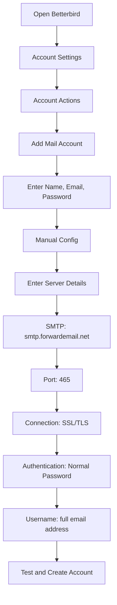

# SMTP 集成示例 {#smtp-integration-examples}

## 目录 {#table-of-contents}

* [前言](#foreword)
* [转发电子邮件的 SMTP 处理如何工作](#how-forward-emails-smtp-processing-works)
  * [电子邮件队列和重试系统](#email-queue-and-retry-system)
  * [可靠性防假](#dummy-proofed-for-reliability)
* [Node.js 集成](#nodejs-integration)
  * [使用 Nodemailer](#using-nodemailer)
  * [使用 Express.js](#using-expressjs)
* [Python 集成](#python-integration)
  * [使用 smtplib](#using-smtplib)
  * [使用 Django](#using-django)
* [PHP 集成](#php-integration)
  * [使用 PHPMailer](#using-phpmailer)
  * [使用 Laravel](#using-laravel)
* [Ruby 集成](#ruby-integration)
  * [使用 Ruby Mail Gem](#using-ruby-mail-gem)
* [Java 集成](#java-integration)
  * [使用 Java 邮件 API](#using-javamail-api)
* [电子邮件客户端配置](#email-client-configuration)
  * [雷鸟](#betterbird)
  * [苹果邮件](#apple-mail)
  * [Gmail（以…的名义发送邮件）](#gmail-send-mail-as)
* [故障排除](#troubleshooting)
  * [常见问题和解决方案](#common-issues-and-solutions)
  * [获取帮助](#getting-help)
* [其他资源](#additional-resources)
* [结论](#conclusion)

## 前言 {#foreword}

本指南提供了详细的示例，介绍如何使用各种编程语言、框架和电子邮件客户端集成 Forward Email 的 SMTP 服务。我们的 SMTP 服务设计可靠、安全，并且易于与您现有的应用程序集成。

## 转发电子邮件的 SMTP 处理如何运作 {#how-forward-emails-smtp-processing-works}

在深入研究集成示例之前，了解我们的 SMTP 服务如何处理电子邮件非常重要：

### 电子邮件队列和重试系统 {#email-queue-and-retry-system}

当您通过 SMTP 向我们的服务器提交电子邮件时：

1. **初始处理**：邮件经过验证、恶意软件扫描以及垃圾邮件过滤器检查
2. **智能排队**：邮件将被放入复杂的队列系统中等待投递
3. **智能重试机制**：如果投递暂时失败，我们的系统将：
* 使用 `getBounceInfo` 函数分析错误响应
* 确定问题是暂时的（例如，“稍后再试”、“暂时延迟”）还是永久性的（例如，“用户未知”）
* 对于暂时性问题，将邮件标记为重试
* 对于永久性问题，生成退回通知
4. **5 天重试期**：我们最多会重试投递 5 天（类似于 Postfix 等行业标准），以便有时间解决暂时性问题
5. **投递状态通知**：发件人将收到有关其邮件状态（已投递、延迟或退回）的通知

> \[!NOTE]
> 成功投递后，出于安全和隐私考虑，外发 SMTP 电子邮件内容将在一段可配置的保留期（默认 30 天）后被删除。仅会保留一条指示已投递的占位符消息。

### 可靠性验证 {#dummy-proofed-for-reliability}

我们的系统旨在处理各种边缘情况：

* 如果检测到黑名单，系统将自动重试发送邮件
* 如果出现网络问题，系统将重新尝试发送
* 如果收件人邮箱已满，系统将稍后重试
* 如果接收服务器暂时不可用，我们将继续尝试

这种方法在保证隐私和安全的同时，显著提高了投递率。

## Node.js 集成 {#nodejs-integration}

### 使用 Nodemailer {#using-nodemailer}

[Nodemailer](https://nodemailer.com/) 是一个用于从 Node.js 应用程序发送电子邮件的流行模块。

```javascript
const nodemailer = require('nodemailer');

// Create a transporter object
const transporter = nodemailer.createTransport({
  host: 'smtp.forwardemail.net',
  port: 465,
  secure: true, // Use TLS
  auth: {
    user: 'your-username@your-domain.com',
    pass: 'your-password'
  }
});

// Send mail with defined transport object
async function sendEmail() {
  try {
    const info = await transporter.sendMail({
      from: '"Your Name" <your-username@your-domain.com>',
      to: 'recipient@example.com',
      subject: 'Hello from Forward Email',
      text: 'Hello world! This is a test email sent using Nodemailer and Forward Email SMTP.',
      html: '<b>Hello world!</b> This is a test email sent using Nodemailer and Forward Email SMTP.'
    });

    console.log('Message sent: %s', info.messageId);
  } catch (error) {
    console.error('Error sending email:', error);
  }
}

sendEmail();
```

### 使用 Express.js {#using-expressjs}

以下是将转发电子邮件 SMTP 与 Express.js 应用程序集成的方法：

```javascript
const express = require('express');
const nodemailer = require('nodemailer');
const app = express();
const port = 3000;

app.use(express.json());

// Configure email transporter
const transporter = nodemailer.createTransport({
  host: 'smtp.forwardemail.net',
  port: 465,
  secure: true,
  auth: {
    user: 'your-username@your-domain.com',
    pass: 'your-password'
  }
});

// API endpoint for sending emails
app.post('/send-email', async (req, res) => {
  const { to, subject, text, html } = req.body;

  try {
    const info = await transporter.sendMail({
      from: '"Your App" <your-username@your-domain.com>',
      to,
      subject,
      text,
      html
    });

    res.status(200).json({
      success: true,
      messageId: info.messageId
    });
  } catch (error) {
    console.error('Error sending email:', error);
    res.status(500).json({
      success: false,
      error: error.message
    });
  }
});

app.listen(port, () => {
  console.log(`Server running at http://localhost:${port}`);
});
```

## Python 集成 {#python-integration}

### 使用 smtplib {#using-smtplib}

```python
import smtplib
from email.mime.text import MIMEText
from email.mime.multipart import MIMEMultipart

# Email configuration
sender_email = "your-username@your-domain.com"
receiver_email = "recipient@example.com"
password = "your-password"

# Create message
message = MIMEMultipart("alternative")
message["Subject"] = "Hello from Forward Email"
message["From"] = sender_email
message["To"] = receiver_email

# Create the plain-text and HTML version of your message
text = "Hello world! This is a test email sent using Python and Forward Email SMTP."
html = "<html><body><b>Hello world!</b> This is a test email sent using Python and Forward Email SMTP.</body></html>"

# Turn these into plain/html MIMEText objects
part1 = MIMEText(text, "plain")
part2 = MIMEText(html, "html")

# Add HTML/plain-text parts to MIMEMultipart message
message.attach(part1)
message.attach(part2)

# Send email
try:
    server = smtplib.SMTP_SSL("smtp.forwardemail.net", 465)
    server.login(sender_email, password)
    server.sendmail(sender_email, receiver_email, message.as_string())
    server.quit()
    print("Email sent successfully!")
except Exception as e:
    print(f"Error sending email: {e}")
```

### 使用 Django {#using-django}

对于 Django 应用程序，将以下内容添加到您的 `settings.py`：

```python
# Email settings
EMAIL_BACKEND = 'django.core.mail.backends.smtp.EmailBackend'
EMAIL_HOST = 'smtp.forwardemail.net'
EMAIL_PORT = 465
EMAIL_USE_SSL = True
EMAIL_HOST_USER = 'your-username@your-domain.com'
EMAIL_HOST_PASSWORD = 'your-password'
DEFAULT_FROM_EMAIL = 'your-username@your-domain.com'
```

然后在您的视图中发送电子邮件：

```python
from django.core.mail import send_mail

def send_email_view(request):
    send_mail(
        'Subject here',
        'Here is the message.',
        'from@your-domain.com',
        ['to@example.com'],
        fail_silently=False,
        html_message='<b>Here is the HTML message.</b>'
    )
    return HttpResponse('Email sent!')
```

## PHP 集成 {#php-integration}

### 使用 PHPMailer {#using-phpmailer}

```php
<?php
use PHPMailer\PHPMailer\PHPMailer;
use PHPMailer\PHPMailer\Exception;

require 'vendor/autoload.php';

$mail = new PHPMailer(true);

try {
    // Server settings
    $mail->isSMTP();
    $mail->Host       = 'smtp.forwardemail.net';
    $mail->SMTPAuth   = true;
    $mail->Username   = 'your-username@your-domain.com';
    $mail->Password   = 'your-password';
    $mail->SMTPSecure = PHPMailer::ENCRYPTION_SMTPS;
    $mail->Port       = 465;

    // Recipients
    $mail->setFrom('your-username@your-domain.com', 'Your Name');
    $mail->addAddress('recipient@example.com', 'Recipient Name');
    $mail->addReplyTo('your-username@your-domain.com', 'Your Name');

    // Content
    $mail->isHTML(true);
    $mail->Subject = 'Hello from Forward Email';
    $mail->Body    = '<b>Hello world!</b> This is a test email sent using PHPMailer and Forward Email SMTP.';
    $mail->AltBody = 'Hello world! This is a test email sent using PHPMailer and Forward Email SMTP.';

    $mail->send();
    echo 'Message has been sent';
} catch (Exception $e) {
    echo "Message could not be sent. Mailer Error: {$mail->ErrorInfo}";
}
```

### 使用 Laravel {#using-laravel}

对于 Laravel 应用程序，更新 `.env` 文件：

```sh
MAIL_MAILER=smtp
MAIL_HOST=smtp.forwardemail.net
MAIL_PORT=465
MAIL_USERNAME=your-username@your-domain.com
MAIL_PASSWORD=your-password
MAIL_ENCRYPTION=ssl
MAIL_FROM_ADDRESS=your-username@your-domain.com
MAIL_FROM_NAME="${APP_NAME}"
```

然后使用 Laravel 的 Mail 外观发送电子邮件：

```php
<?php

namespace App\Http\Controllers;

use Illuminate\Http\Request;
use Illuminate\Support\Facades\Mail;
use App\Mail\WelcomeEmail;

class EmailController extends Controller
{
    public function sendEmail()
    {
        Mail::to('recipient@example.com')->send(new WelcomeEmail());

        return 'Email sent successfully!';
    }
}
```

## Ruby 集成 {#ruby-integration}

### 使用 Ruby Mail Gem {#using-ruby-mail-gem}

```ruby
require 'mail'

Mail.defaults do
  delivery_method :smtp, {
    address: 'smtp.forwardemail.net',
    port: 465,
    domain: 'your-domain.com',
    user_name: 'your-username@your-domain.com',
    password: 'your-password',
    authentication: 'plain',
    enable_starttls_auto: true,
    ssl: true
  }
end

mail = Mail.new do
  from     'your-username@your-domain.com'
  to       'recipient@example.com'
  subject  'Hello from Forward Email'

  text_part do
    body 'Hello world! This is a test email sent using Ruby Mail and Forward Email SMTP.'
  end

  html_part do
    content_type 'text/html; charset=UTF-8'
    body '<b>Hello world!</b> This is a test email sent using Ruby Mail and Forward Email SMTP.'
  end
end

mail.deliver!
puts "Email sent successfully!"
```

## Java 集成 {#java-integration}

### 使用 JavaMail API {#using-javamail-api}

```java
import java.util.Properties;
import javax.mail.*;
import javax.mail.internet.*;

public class SendEmail {
    public static void main(String[] args) {
        // Sender's email and password
        final String username = "your-username@your-domain.com";
        final String password = "your-password";

        // SMTP server properties
        Properties props = new Properties();
        props.put("mail.smtp.auth", "true");
        props.put("mail.smtp.starttls.enable", "true");
        props.put("mail.smtp.host", "smtp.forwardemail.net");
        props.put("mail.smtp.port", "465");
        props.put("mail.smtp.socketFactory.port", "465");
        props.put("mail.smtp.socketFactory.class", "javax.net.ssl.SSLSocketFactory");

        // Create session with authenticator
        Session session = Session.getInstance(props,
            new javax.mail.Authenticator() {
                protected PasswordAuthentication getPasswordAuthentication() {
                    return new PasswordAuthentication(username, password);
                }
            });

        try {
            // Create message
            Message message = new MimeMessage(session);
            message.setFrom(new InternetAddress(username));
            message.setRecipients(Message.RecipientType.TO, InternetAddress.parse("recipient@example.com"));
            message.setSubject("Hello from Forward Email");

            // Create multipart message
            Multipart multipart = new MimeMultipart("alternative");

            // Text part
            BodyPart textPart = new MimeBodyPart();
            textPart.setText("Hello world! This is a test email sent using JavaMail and Forward Email SMTP.");

            // HTML part
            BodyPart htmlPart = new MimeBodyPart();
            htmlPart.setContent("<b>Hello world!</b> This is a test email sent using JavaMail and Forward Email SMTP.", "text/html");

            // Add parts to multipart
            multipart.addBodyPart(textPart);
            multipart.addBodyPart(htmlPart);

            // Set content
            message.setContent(multipart);

            // Send message
            Transport.send(message);

            System.out.println("Email sent successfully!");

        } catch (MessagingException e) {
            throw new RuntimeException(e);
        }
    }
}
```

## 电子邮件客户端配置 {#email-client-configuration}

### 雷鸟 {#betterbird}



1. 打开 Betterbird 并前往“帐户设置”
2. 点击“帐户操作”，然后选择“添加邮件帐户”
3. 输入您的姓名、电子邮件地址和密码
4. 点击“手动配置”，并输入以下详细信息：
* 接收服务器：
* IMAP：imap.forwardemail.net，端口：993，SSL/TLS
* POP3：pop3.forwardemail.net，端口：995，SSL/TLS
* 发送服务器 (SMTP)：smtp.forwardemail.net，端口：465，SSL/TLS
* 身份验证：普通密码
* 用户名：您的完整电子邮件地址
5. 点击“测试”，然后点击“完成”

### Apple 邮件 {#apple-mail}

1. 打开邮件，前往“邮件”>“偏好设置”>“帐户”
2. 点击“+”按钮添加新帐户
3. 选择“其他邮件帐户”，然后点击“继续”
4. 输入您的姓名、电子邮件地址和密码，然后点击“登录”
5. 如果自动设置失败，请输入以下信息：
* 接收邮件服务器：imap.forwardemail.net（如果使用 POP3，则输入 pop3.forwardemail.net）
* 发送邮件服务器：smtp.forwardemail.net
* 用户名：您的完整电子邮件地址
* 密码：您的密码
6. 点击“登录”完成设置

### Gmail（以……身份发送邮件）{#gmail-send-mail-as}

1. 打开 Gmail，前往“设置”>“帐户和导入”
2. 在“以…身份发送邮件”下，点击“添加其他电子邮件地址”
3. 输入您的姓名和电子邮件地址，然后点击“下一步”
4. 输入以下 SMTP 服务器详细信息：
* SMTP 服务器：smtp.forwardemail.net
* 端口：465
* 用户名：您的完整电子邮件地址
* 密码：您的密码
* 选择“使用 SSL 的安全连接”
5. 点击“添加帐户”并验证您的电子邮件地址

## 故障排除 {#troubleshooting}

### 常见问题及解决方案 {#common-issues-and-solutions}

1. **身份验证失败**
* 验证您的用户名（完整电子邮件地址）和密码
* 确保您使用的端口正确（SSL/TLS 端口为 465）
* 检查您的帐户是否启用了 SMTP 访问权限

2. **连接超时**
* 检查您的网络连接
* 确认防火墙设置未阻止 SMTP 流量
* 尝试使用其他端口（使用 STARTTLS 的 587 端口）

3. **邮件被拒**
* 确保您的“发件人”地址与已验证的邮箱地址相符
* 检查您的 IP 地址是否被列入黑名单
* 验证您的邮件内容是否触发垃圾邮件过滤器

4. **TLS/SSL 错误**
* 更新您的应用程序/库以支持现代 TLS 版本
* 确保您系统的 CA 证书是最新的
* 尝试使用显式 TLS 而不是隐式 TLS

### 获取帮助 {#getting-help}

如果您遇到此处未涵盖的问题，请：

1. 查看我们的 [常见问题解答页面](/faq) 了解常见问题
2. 查看我们的 [关于电子邮件传递的博客文章](/blog/docs/best-email-forwarding-service) 了解详细信息
3. 联系我们的支持团队 <support@forwardemail.net>

## 额外资源 {#additional-resources}

* [转发电子邮件文档](/docs)
* [SMTP 服务器限制和配置](/faq#what-are-your-outbound-smtp-limits)
* [电子邮件最佳实践指南](/blog/docs/best-email-forwarding-service)
* [安全实践](/security)

## 结论 {#conclusion}

Forward Email 的 SMTP 服务提供可靠、安全且注重隐私的邮件发送方式，方便您从应用程序和电子邮件客户端发送电子邮件。凭借我们智能的队列系统、5 天重试机制以及全面的投递状态通知功能，您可以安心无虞地确保邮件顺利送达目的地。

如需更多高级用例或自定义集成，请联系我们的支持团队。