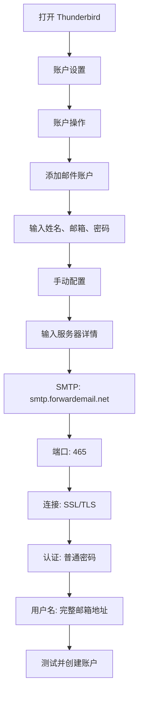

# SMTP 集成示例 {#smtp-integration-examples}


## 目录 {#table-of-contents}

* [前言](#foreword)
* [Forward Email 的 SMTP 处理工作原理](#how-forward-emails-smtp-processing-works)
  * [邮件队列和重试系统](#email-queue-and-retry-system)
  * [为可靠性设计的防呆机制](#dummy-proofed-for-reliability)
* [Node.js 集成](#nodejs-integration)
  * [使用 Nodemailer](#using-nodemailer)
  * [使用 Express.js](#using-expressjs)
* [Python 集成](#python-integration)
  * [使用 smtplib](#using-smtplib)
  * [使用 Django](#using-django)
* [PHP 集成](#php-integration)
  * [使用 PHPMailer](#using-phpmailer)
  * [使用 Laravel](#using-laravel)
* [Ruby 集成](#ruby-integration)
  * [使用 Ruby Mail Gem](#using-ruby-mail-gem)
* [Java 集成](#java-integration)
  * [使用 JavaMail API](#using-javamail-api)
* [邮件客户端配置](#email-client-configuration)
  * [Thunderbird](#thunderbird)
  * [Apple Mail](#apple-mail)
  * [Gmail（以其他身份发送邮件）](#gmail-send-mail-as)
* [故障排除](#troubleshooting)
  * [常见问题及解决方案](#common-issues-and-solutions)
  * [获取帮助](#getting-help)
* [附加资源](#additional-resources)
* [结论](#conclusion)


## 前言 {#foreword}

本指南提供了如何使用各种编程语言、框架和邮件客户端集成 Forward Email SMTP 服务的详细示例。我们的 SMTP 服务旨在可靠、安全，并且易于与您现有的应用程序集成。


## Forward Email 的 SMTP 处理工作原理 {#how-forward-emails-smtp-processing-works}

在深入集成示例之前，了解我们的 SMTP 服务如何处理邮件非常重要：

### 邮件队列和重试系统 {#email-queue-and-retry-system}

当您通过 SMTP 向我们的服务器提交邮件时：

1. **初步处理**：邮件会被验证，扫描恶意软件，并通过垃圾邮件过滤器检查
2. **智能排队**：邮件被放入复杂的队列系统以便投递
3. **智能重试机制**：如果投递暂时失败，我们的系统将：
   * 使用我们的 `getBounceInfo` 函数分析错误响应
   * 判断问题是暂时的（例如“稍后重试”、“临时延迟”）还是永久的（例如“用户未知”）
   * 对于暂时性问题，标记邮件以便重试
   * 对于永久性问题，生成退信通知
4. **5 天重试期**：我们会重试投递长达 5 天（类似于 Postfix 等行业标准），给暂时性问题留出解决时间
5. **投递状态通知**：发件人会收到邮件状态通知（已投递、延迟或退信）

> \[!NOTE]
> 成功投递后，出站 SMTP 邮件内容会在可配置的保留期（默认 30 天）后被删除以保障安全和隐私。仅保留一条占位消息，指示投递成功。

### 为可靠性设计的防呆机制 {#dummy-proofed-for-reliability}

我们的系统设计能处理各种边缘情况：

* 如果检测到黑名单，邮件将自动重试
* 如果发生网络问题，投递将重新尝试
* 如果收件人邮箱已满，系统会稍后重试
* 如果接收服务器暂时不可用，我们会持续尝试

这种方法显著提高了投递率，同时保持隐私和安全。


## Node.js 集成 {#nodejs-integration}

### 使用 Nodemailer {#using-nodemailer}

[Nodemailer](https://nodemailer.com/) 是一个流行的模块，用于从 Node.js 应用发送邮件。

```javascript
const nodemailer = require('nodemailer');

// 创建传输器对象
const transporter = nodemailer.createTransport({
  host: 'smtp.forwardemail.net',
  port: 465,
  secure: true, // 使用 TLS
  auth: {
    user: 'your-username@your-domain.com',
    pass: 'your-password'
  }
});

// 使用定义的传输对象发送邮件
async function sendEmail() {
  try {
    const info = await transporter.sendMail({
      from: '"Your Name" <your-username@your-domain.com>',
      to: 'recipient@example.com',
      subject: '来自 Forward Email 的问候',
      text: 'Hello world! 这是一封使用 Nodemailer 和 Forward Email SMTP 发送的测试邮件。',
      html: '<b>Hello world!</b> 这是一封使用 Nodemailer 和 Forward Email SMTP 发送的测试邮件。'
    });

    console.log('邮件已发送: %s', info.messageId);
  } catch (error) {
    console.error('发送邮件时出错:', error);
  }
}

sendEmail();
```
### 使用 Express.js {#using-expressjs}

以下是如何将 Forward Email SMTP 集成到 Express.js 应用程序中：

```javascript
const express = require('express');
const nodemailer = require('nodemailer');
const app = express();
const port = 3000;

app.use(express.json());

// 配置邮件传输器
const transporter = nodemailer.createTransport({
  host: 'smtp.forwardemail.net',
  port: 465,
  secure: true,
  auth: {
    user: 'your-username@your-domain.com',
    pass: 'your-password'
  }
});

// 发送邮件的 API 端点
app.post('/send-email', async (req, res) => {
  const { to, subject, text, html } = req.body;

  try {
    const info = await transporter.sendMail({
      from: '"Your App" <your-username@your-domain.com>',
      to,
      subject,
      text,
      html
    });

    res.status(200).json({
      success: true,
      messageId: info.messageId
    });
  } catch (error) {
    console.error('发送邮件时出错:', error);
    res.status(500).json({
      success: false,
      error: error.message
    });
  }
});

app.listen(port, () => {
  console.log(`服务器运行在 http://localhost:${port}`);
});
```


## Python 集成 {#python-integration}

### 使用 smtplib {#using-smtplib}

```python
import smtplib
from email.mime.text import MIMEText
from email.mime.multipart import MIMEMultipart

# 邮件配置
sender_email = "your-username@your-domain.com"
receiver_email = "recipient@example.com"
password = "your-password"

# 创建邮件
message = MIMEMultipart("alternative")
message["Subject"] = "来自 Forward Email 的问候"
message["From"] = sender_email
message["To"] = receiver_email

# 创建纯文本和 HTML 版本的邮件内容
text = "Hello world! 这是一封使用 Python 和 Forward Email SMTP 发送的测试邮件。"
html = "<html><body><b>Hello world!</b> 这是一封使用 Python 和 Forward Email SMTP 发送的测试邮件。</body></html>"

# 将它们转换为纯文本/HTML MIMEText 对象
part1 = MIMEText(text, "plain")
part2 = MIMEText(html, "html")

# 将 HTML/纯文本部分添加到 MIMEMultipart 邮件中
message.attach(part1)
message.attach(part2)

# 发送邮件
try:
    server = smtplib.SMTP_SSL("smtp.forwardemail.net", 465)
    server.login(sender_email, password)
    server.sendmail(sender_email, receiver_email, message.as_string())
    server.quit()
    print("邮件发送成功！")
except Exception as e:
    print(f"发送邮件时出错: {e}")
```

### 使用 Django {#using-django}

对于 Django 应用，在 `settings.py` 中添加以下内容：

```python
# 邮件设置
EMAIL_BACKEND = 'django.core.mail.backends.smtp.EmailBackend'
EMAIL_HOST = 'smtp.forwardemail.net'
EMAIL_PORT = 465
EMAIL_USE_SSL = True
EMAIL_HOST_USER = 'your-username@your-domain.com'
EMAIL_HOST_PASSWORD = 'your-password'
DEFAULT_FROM_EMAIL = 'your-username@your-domain.com'
```

然后在视图中发送邮件：

```python
from django.core.mail import send_mail

def send_email_view(request):
    send_mail(
        '主题内容',
        '这里是邮件正文。',
        'from@your-domain.com',
        ['to@example.com'],
        fail_silently=False,
        html_message='<b>这里是 HTML 邮件内容。</b>'
    )
    return HttpResponse('邮件已发送！')
```


## PHP 集成 {#php-integration}

### 使用 PHPMailer {#using-phpmailer}

```php
<?php
use PHPMailer\PHPMailer\PHPMailer;
use PHPMailer\PHPMailer\Exception;

require 'vendor/autoload.php';

$mail = new PHPMailer(true);

try {
    // 服务器设置
    $mail->isSMTP();
    $mail->Host       = 'smtp.forwardemail.net';
    $mail->SMTPAuth   = true;
    $mail->Username   = 'your-username@your-domain.com';
    $mail->Password   = 'your-password';
    $mail->SMTPSecure = PHPMailer::ENCRYPTION_SMTPS;
    $mail->Port       = 465;

    // 收件人
    $mail->setFrom('your-username@your-domain.com', 'Your Name');
    $mail->addAddress('recipient@example.com', 'Recipient Name');
    $mail->addReplyTo('your-username@your-domain.com', 'Your Name');

    // 内容
    $mail->isHTML(true);
    $mail->Subject = '来自 Forward Email 的问候';
    $mail->Body    = '<b>Hello world!</b> 这是一封使用 PHPMailer 和 Forward Email SMTP 发送的测试邮件。';
    $mail->AltBody = 'Hello world! 这是一封使用 PHPMailer 和 Forward Email SMTP 发送的测试邮件。';

    $mail->send();
    echo '邮件已发送';
} catch (Exception $e) {
    echo "邮件发送失败。Mailer 错误: {$mail->ErrorInfo}";
}
```
### 使用 Laravel {#using-laravel}

对于 Laravel 应用程序，更新您的 `.env` 文件：

```sh
MAIL_MAILER=smtp
MAIL_HOST=smtp.forwardemail.net
MAIL_PORT=465
MAIL_USERNAME=your-username@your-domain.com
MAIL_PASSWORD=your-password
MAIL_ENCRYPTION=ssl
MAIL_FROM_ADDRESS=your-username@your-domain.com
MAIL_FROM_NAME="${APP_NAME}"
```

然后使用 Laravel 的 Mail 门面发送邮件：

```php
<?php

namespace App\Http\Controllers;

use Illuminate\Http\Request;
use Illuminate\Support\Facades\Mail;
use App\Mail\WelcomeEmail;

class EmailController extends Controller
{
    public function sendEmail()
    {
        Mail::to('recipient@example.com')->send(new WelcomeEmail());

        return '邮件发送成功！';
    }
}
```


## Ruby 集成 {#ruby-integration}

### 使用 Ruby Mail Gem {#using-ruby-mail-gem}

```ruby
require 'mail'

Mail.defaults do
  delivery_method :smtp, {
    address: 'smtp.forwardemail.net',
    port: 465,
    domain: 'your-domain.com',
    user_name: 'your-username@your-domain.com',
    password: 'your-password',
    authentication: 'plain',
    enable_starttls_auto: true,
    ssl: true
  }
end

mail = Mail.new do
  from     'your-username@your-domain.com'
  to       'recipient@example.com'
  subject  '来自 Forward Email 的问候'

  text_part do
    body '你好，世界！这是一封使用 Ruby Mail 和 Forward Email SMTP 发送的测试邮件。'
  end

  html_part do
    content_type 'text/html; charset=UTF-8'
    body '<b>你好，世界！</b> 这是一封使用 Ruby Mail 和 Forward Email SMTP 发送的测试邮件。'
  end
end

mail.deliver!
puts "邮件发送成功！"
```


## Java 集成 {#java-integration}

### 使用 JavaMail API {#using-javamail-api}

```java
import java.util.Properties;
import javax.mail.*;
import javax.mail.internet.*;

public class SendEmail {
    public static void main(String[] args) {
        // 发件人的邮箱和密码
        final String username = "your-username@your-domain.com";
        final String password = "your-password";

        // SMTP 服务器属性
        Properties props = new Properties();
        props.put("mail.smtp.auth", "true");
        props.put("mail.smtp.starttls.enable", "true");
        props.put("mail.smtp.host", "smtp.forwardemail.net");
        props.put("mail.smtp.port", "465");
        props.put("mail.smtp.socketFactory.port", "465");
        props.put("mail.smtp.socketFactory.class", "javax.net.ssl.SSLSocketFactory");

        // 创建带认证的会话
        Session session = Session.getInstance(props,
            new javax.mail.Authenticator() {
                protected PasswordAuthentication getPasswordAuthentication() {
                    return new PasswordAuthentication(username, password);
                }
            });

        try {
            // 创建消息
            Message message = new MimeMessage(session);
            message.setFrom(new InternetAddress(username));
            message.setRecipients(Message.RecipientType.TO, InternetAddress.parse("recipient@example.com"));
            message.setSubject("来自 Forward Email 的问候");

            // 创建多部分消息
            Multipart multipart = new MimeMultipart("alternative");

            // 文本部分
            BodyPart textPart = new MimeBodyPart();
            textPart.setText("你好，世界！这是一封使用 JavaMail 和 Forward Email SMTP 发送的测试邮件。");

            // HTML 部分
            BodyPart htmlPart = new MimeBodyPart();
            htmlPart.setContent("<b>你好，世界！</b> 这是一封使用 JavaMail 和 Forward Email SMTP 发送的测试邮件。", "text/html");

            // 添加部分到多部分消息
            multipart.addBodyPart(textPart);
            multipart.addBodyPart(htmlPart);

            // 设置内容
            message.setContent(multipart);

            // 发送消息
            Transport.send(message);

            System.out.println("邮件发送成功！");

        } catch (MessagingException e) {
            throw new RuntimeException(e);
        }
    }
}
```


## 邮件客户端配置 {#email-client-configuration}

### Thunderbird {#thunderbird}


```mermaid
flowchart TD
    A[打开 Thunderbird] --> B[账户设置]
    B --> C[账户操作]
    C --> D[添加邮件账户]
    D --> E[输入姓名、邮箱、密码]
    E --> F[手动配置]
    F --> G[输入服务器详情]
    G --> H[SMTP: smtp.forwardemail.net]
    H --> I[端口: 465]
    I --> J[连接: SSL/TLS]
    J --> K[认证: 普通密码]
    K --> L[用户名: 完整邮箱地址]
    L --> M[测试并创建账户]
```
1. 打开 Thunderbird 并进入账户设置  
2. 点击“账户操作”，选择“添加邮件账户”  
3. 输入您的姓名、电子邮件地址和密码  
4. 点击“手动配置”，输入以下详细信息：  
   * 收件服务器：  
     * IMAP：imap.forwardemail.net，端口：993，SSL/TLS  
     * POP3：pop3.forwardemail.net，端口：995，SSL/TLS  
   * 发件服务器（SMTP）：smtp.forwardemail.net，端口：465，SSL/TLS  
   * 认证方式：普通密码  
   * 用户名：您的完整电子邮件地址  
5. 点击“测试”，然后点击“完成”  

### Apple Mail {#apple-mail}

1. 打开邮件，进入邮件 > 偏好设置 > 账户  
2. 点击“+”按钮添加新账户  
3. 选择“其他邮件账户”，点击“继续”  
4. 输入您的姓名、电子邮件地址和密码，然后点击“登录”  
5. 当自动设置失败时，输入以下详细信息：  
   * 收件服务器：imap.forwardemail.net（POP3 用户请使用 pop3.forwardemail.net）  
   * 发件服务器：smtp.forwardemail.net  
   * 用户名：您的完整电子邮件地址  
   * 密码：您的密码  
6. 点击“登录”完成设置  

### Gmail (发送邮件为) {#gmail-send-mail-as}

1. 打开 Gmail，进入设置 > 账户和导入  
2. 在“发送邮件为”下，点击“添加另一个电子邮件地址”  
3. 输入您的姓名和电子邮件地址，然后点击“下一步”  
4. 输入以下 SMTP 服务器详细信息：  
   * SMTP 服务器：smtp.forwardemail.net  
   * 端口：465  
   * 用户名：您的完整电子邮件地址  
   * 密码：您的密码  
   * 选择“使用 SSL 的安全连接”  
5. 点击“添加账户”，并验证您的电子邮件地址  

## 故障排除 {#troubleshooting}

### 常见问题及解决方案 {#common-issues-and-solutions}

1. **认证失败**  
   * 核实您的用户名（完整电子邮件地址）和密码  
   * 确认您使用的是正确的端口（SSL/TLS 为 465）  
   * 检查您的账户是否启用了 SMTP 访问权限  

2. **连接超时**  
   * 检查您的网络连接  
   * 确认防火墙设置未阻止 SMTP 流量  
   * 尝试使用端口 465（推荐，SSL/TLS）或端口 587（STARTTLS）  

3. **邮件被拒绝**  
   * 确保您的“发件人”地址与认证邮箱匹配  
   * 检查您的 IP 是否被列入黑名单  
   * 核实邮件内容未触发垃圾邮件过滤器  

4. **TLS/SSL 错误**  
   * 更新您的应用程序/库以支持现代 TLS 版本  
   * 确保系统的 CA 证书是最新的  
   * 尝试使用显式 TLS 替代隐式 TLS  

### 获取帮助 {#getting-help}

如果遇到此处未涵盖的问题，请：

1. 查看我们的[常见问题页面](/faq)  
2. 阅读我们的[邮件投递博客文章](/blog/docs/best-email-forwarding-service)获取详细信息  
3. 通过 <support@forwardemail.net> 联系我们的支持团队  

## 其他资源 {#additional-resources}

* [Forward Email 文档](/docs)  
* [SMTP 服务器限制与配置](/faq#what-are-your-outbound-smtp-limits)  
* [邮件最佳实践指南](/blog/docs/best-email-forwarding-service)  
* [安全实践](/security)  

## 结论 {#conclusion}

Forward Email 的 SMTP 服务为您的应用程序和邮件客户端提供了可靠、安全且注重隐私的邮件发送方式。借助我们的智能队列系统、5 天重试机制以及全面的投递状态通知，您可以放心邮件将顺利送达目的地。

如需更高级的用例或自定义集成，请联系我们的支持团队。
