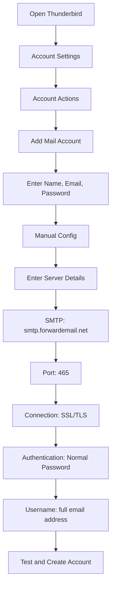

# SMTP Integration Examples


## Table of Contents

* [Foreword](#foreword)
* [How Forward Email's SMTP Processing Works](#how-forward-emails-smtp-processing-works)
  * [Email Queue and Retry System](#email-queue-and-retry-system)
  * [Dummy-Proofed for Reliability](#dummy-proofed-for-reliability)
* [Node.js Integration](#nodejs-integration)
  * [Using Nodemailer](#using-nodemailer)
  * [Using Express.js](#using-expressjs)
* [Python Integration](#python-integration)
  * [Using smtplib](#using-smtplib)
  * [Using Django](#using-django)
* [PHP Integration](#php-integration)
  * [Using PHPMailer](#using-phpmailer)
  * [Using Laravel](#using-laravel)
* [Ruby Integration](#ruby-integration)
  * [Using Ruby Mail Gem](#using-ruby-mail-gem)
* [Java Integration](#java-integration)
  * [Using JavaMail API](#using-javamail-api)
* [Email Client Configuration](#email-client-configuration)
  * [Thunderbird](#thunderbird)
  * [Apple Mail](#apple-mail)
  * [Gmail (Send Mail As)](#gmail-send-mail-as)
* [Troubleshooting](#troubleshooting)
  * [Common Issues and Solutions](#common-issues-and-solutions)
  * [Getting Help](#getting-help)
* [Additional Resources](#additional-resources)
* [Conclusion](#conclusion)


## Foreword

This guide provides detailed examples of how to integrate with Forward Email's SMTP service using various programming languages, frameworks, and email clients. Our SMTP service is designed to be reliable, secure, and easy to integrate with your existing applications.


## How Forward Email's SMTP Processing Works

Before diving into the integration examples, it's important to understand how our SMTP service processes emails:

### Email Queue and Retry System

When you submit an email via SMTP to our servers:

1. **Initial Processing**: The email is validated, scanned for malware, and checked against spam filters
2. **Smart Queuing**: Emails are placed in a sophisticated queue system for delivery
3. **Intelligent Retry Mechanism**: If delivery fails temporarily, our system will:
   * Analyze the error response using our `getBounceInfo` function
   * Determine if the issue is temporary (e.g., "try again later", "temporarily deferred") or permanent (e.g., "user unknown")
   * For temporary issues, mark the email for retry
   * For permanent issues, generate a bounce notification
4. **5-Day Retry Period**: We retry delivery for up to 5 days (similar to industry standards like Postfix), giving temporary issues time to resolve
5. **Delivery Status Notifications**: Senders receive notifications about the status of their emails (delivered, delayed, or bounced)

> \[!NOTE]
> After successful delivery, outbound SMTP email content is redacted after a configurable retention period (default 30 days) for security and privacy. Only a placeholder message remains indicating successful delivery.

### Dummy-Proofed for Reliability

Our system is designed to handle various edge cases:

* If a blocklist is detected, the email will be automatically retried
* If network issues occur, delivery will be reattempted
* If the recipient's mailbox is full, the system will retry later
* If the receiving server is temporarily unavailable, we'll keep trying

This approach significantly improves delivery rates while maintaining privacy and security.


## Node.js Integration

### Using Nodemailer

[Nodemailer](https://nodemailer.com/) is a popular module for sending emails from Node.js applications.

```javascript
const nodemailer = require('nodemailer');

// Create a transporter object
const transporter = nodemailer.createTransport({
  host: 'smtp.forwardemail.net',
  port: 465,
  secure: true, // Use TLS
  auth: {
    user: 'your-username@your-domain.com',
    pass: 'your-password'
  }
});

// Send mail with defined transport object
async function sendEmail() {
  try {
    const info = await transporter.sendMail({
      from: '"Your Name" <your-username@your-domain.com>',
      to: 'recipient@example.com',
      subject: 'Hello from Forward Email',
      text: 'Hello world! This is a test email sent using Nodemailer and Forward Email SMTP.',
      html: '<b>Hello world!</b> This is a test email sent using Nodemailer and Forward Email SMTP.'
    });

    console.log('Message sent: %s', info.messageId);
  } catch (error) {
    console.error('Error sending email:', error);
  }
}

sendEmail();
```

### Using Express.js

Here's how to integrate Forward Email SMTP with an Express.js application:

```javascript
const express = require('express');
const nodemailer = require('nodemailer');
const app = express();
const port = 3000;

app.use(express.json());

// Configure email transporter
const transporter = nodemailer.createTransport({
  host: 'smtp.forwardemail.net',
  port: 465,
  secure: true,
  auth: {
    user: 'your-username@your-domain.com',
    pass: 'your-password'
  }
});

// API endpoint for sending emails
app.post('/send-email', async (req, res) => {
  const { to, subject, text, html } = req.body;

  try {
    const info = await transporter.sendMail({
      from: '"Your App" <your-username@your-domain.com>',
      to,
      subject,
      text,
      html
    });

    res.status(200).json({
      success: true,
      messageId: info.messageId
    });
  } catch (error) {
    console.error('Error sending email:', error);
    res.status(500).json({
      success: false,
      error: error.message
    });
  }
});

app.listen(port, () => {
  console.log(`Server running at http://localhost:${port}`);
});
```


## Python Integration

### Using smtplib

```python
import smtplib
from email.mime.text import MIMEText
from email.mime.multipart import MIMEMultipart

# Email configuration
sender_email = "your-username@your-domain.com"
receiver_email = "recipient@example.com"
password = "your-password"

# Create message
message = MIMEMultipart("alternative")
message["Subject"] = "Hello from Forward Email"
message["From"] = sender_email
message["To"] = receiver_email

# Create the plain-text and HTML version of your message
text = "Hello world! This is a test email sent using Python and Forward Email SMTP."
html = "<html><body><b>Hello world!</b> This is a test email sent using Python and Forward Email SMTP.</body></html>"

# Turn these into plain/html MIMEText objects
part1 = MIMEText(text, "plain")
part2 = MIMEText(html, "html")

# Add HTML/plain-text parts to MIMEMultipart message
message.attach(part1)
message.attach(part2)

# Send email
try:
    server = smtplib.SMTP_SSL("smtp.forwardemail.net", 465)
    server.login(sender_email, password)
    server.sendmail(sender_email, receiver_email, message.as_string())
    server.quit()
    print("Email sent successfully!")
except Exception as e:
    print(f"Error sending email: {e}")
```

### Using Django

For Django applications, add the following to your `settings.py`:

```python
# Email settings
EMAIL_BACKEND = 'django.core.mail.backends.smtp.EmailBackend'
EMAIL_HOST = 'smtp.forwardemail.net'
EMAIL_PORT = 465
EMAIL_USE_SSL = True
EMAIL_HOST_USER = 'your-username@your-domain.com'
EMAIL_HOST_PASSWORD = 'your-password'
DEFAULT_FROM_EMAIL = 'your-username@your-domain.com'
```

Then send emails in your views:

```python
from django.core.mail import send_mail

def send_email_view(request):
    send_mail(
        'Subject here',
        'Here is the message.',
        'from@your-domain.com',
        ['to@example.com'],
        fail_silently=False,
        html_message='<b>Here is the HTML message.</b>'
    )
    return HttpResponse('Email sent!')
```


## PHP Integration

### Using PHPMailer

```php
<?php
use PHPMailer\PHPMailer\PHPMailer;
use PHPMailer\PHPMailer\Exception;

require 'vendor/autoload.php';

$mail = new PHPMailer(true);

try {
    // Server settings
    $mail->isSMTP();
    $mail->Host       = 'smtp.forwardemail.net';
    $mail->SMTPAuth   = true;
    $mail->Username   = 'your-username@your-domain.com';
    $mail->Password   = 'your-password';
    $mail->SMTPSecure = PHPMailer::ENCRYPTION_SMTPS;
    $mail->Port       = 465;

    // Recipients
    $mail->setFrom('your-username@your-domain.com', 'Your Name');
    $mail->addAddress('recipient@example.com', 'Recipient Name');
    $mail->addReplyTo('your-username@your-domain.com', 'Your Name');

    // Content
    $mail->isHTML(true);
    $mail->Subject = 'Hello from Forward Email';
    $mail->Body    = '<b>Hello world!</b> This is a test email sent using PHPMailer and Forward Email SMTP.';
    $mail->AltBody = 'Hello world! This is a test email sent using PHPMailer and Forward Email SMTP.';

    $mail->send();
    echo 'Message has been sent';
} catch (Exception $e) {
    echo "Message could not be sent. Mailer Error: {$mail->ErrorInfo}";
}
```

### Using Laravel

For Laravel applications, update your `.env` file:

```sh
MAIL_MAILER=smtp
MAIL_HOST=smtp.forwardemail.net
MAIL_PORT=465
MAIL_USERNAME=your-username@your-domain.com
MAIL_PASSWORD=your-password
MAIL_ENCRYPTION=ssl
MAIL_FROM_ADDRESS=your-username@your-domain.com
MAIL_FROM_NAME="${APP_NAME}"
```

Then send emails using Laravel's Mail façade:

```php
<?php

namespace App\Http\Controllers;

use Illuminate\Http\Request;
use Illuminate\Support\Facades\Mail;
use App\Mail\WelcomeEmail;

class EmailController extends Controller
{
    public function sendEmail()
    {
        Mail::to('recipient@example.com')->send(new WelcomeEmail());

        return 'Email sent successfully!';
    }
}
```


## Ruby Integration

### Using Ruby Mail Gem

```ruby
require 'mail'

Mail.defaults do
  delivery_method :smtp, {
    address: 'smtp.forwardemail.net',
    port: 465,
    domain: 'your-domain.com',
    user_name: 'your-username@your-domain.com',
    password: 'your-password',
    authentication: 'plain',
    enable_starttls_auto: true,
    ssl: true
  }
end

mail = Mail.new do
  from     'your-username@your-domain.com'
  to       'recipient@example.com'
  subject  'Hello from Forward Email'

  text_part do
    body 'Hello world! This is a test email sent using Ruby Mail and Forward Email SMTP.'
  end

  html_part do
    content_type 'text/html; charset=UTF-8'
    body '<b>Hello world!</b> This is a test email sent using Ruby Mail and Forward Email SMTP.'
  end
end

mail.deliver!
puts "Email sent successfully!"
```


## Java Integration

### Using JavaMail API

```java
import java.util.Properties;
import javax.mail.*;
import javax.mail.internet.*;

public class SendEmail {
    public static void main(String[] args) {
        // Sender's email and password
        final String username = "your-username@your-domain.com";
        final String password = "your-password";

        // SMTP server properties
        Properties props = new Properties();
        props.put("mail.smtp.auth", "true");
        props.put("mail.smtp.starttls.enable", "true");
        props.put("mail.smtp.host", "smtp.forwardemail.net");
        props.put("mail.smtp.port", "465");
        props.put("mail.smtp.socketFactory.port", "465");
        props.put("mail.smtp.socketFactory.class", "javax.net.ssl.SSLSocketFactory");

        // Create session with authenticator
        Session session = Session.getInstance(props,
            new javax.mail.Authenticator() {
                protected PasswordAuthentication getPasswordAuthentication() {
                    return new PasswordAuthentication(username, password);
                }
            });

        try {
            // Create message
            Message message = new MimeMessage(session);
            message.setFrom(new InternetAddress(username));
            message.setRecipients(Message.RecipientType.TO, InternetAddress.parse("recipient@example.com"));
            message.setSubject("Hello from Forward Email");

            // Create multipart message
            Multipart multipart = new MimeMultipart("alternative");

            // Text part
            BodyPart textPart = new MimeBodyPart();
            textPart.setText("Hello world! This is a test email sent using JavaMail and Forward Email SMTP.");

            // HTML part
            BodyPart htmlPart = new MimeBodyPart();
            htmlPart.setContent("<b>Hello world!</b> This is a test email sent using JavaMail and Forward Email SMTP.", "text/html");

            // Add parts to multipart
            multipart.addBodyPart(textPart);
            multipart.addBodyPart(htmlPart);

            // Set content
            message.setContent(multipart);

            // Send message
            Transport.send(message);

            System.out.println("Email sent successfully!");

        } catch (MessagingException e) {
            throw new RuntimeException(e);
        }
    }
}
```


## Email Client Configuration

### Thunderbird



1. Open Thunderbird and go to Account Settings
2. Click "Account Actions" and select "Add Mail Account"
3. Enter your name, email address, and password
4. Click "Manual Config" and enter the following details:
   * Incoming Server:
     * IMAP: imap.forwardemail.net, Port: 993, SSL/TLS
     * POP3: pop3.forwardemail.net, Port: 995, SSL/TLS
   * Outgoing Server (SMTP): smtp.forwardemail.net, Port: 465, SSL/TLS
   * Authentication: Normal Password
   * Username: your full email address
5. Click "Test" and then "Done"

### Apple Mail

1. Open Mail and go to Mail > Preferences > Accounts
2. Click the "+" button to add a new account
3. Select "Other Mail Account" and click "Continue"
4. Enter your name, email address, and password, then click "Sign In"
5. When automatic setup fails, enter the following details:
   * Incoming Mail Server: imap.forwardemail.net (or pop3.forwardemail.net for POP3)
   * Outgoing Mail Server: smtp.forwardemail.net
   * Username: your full email address
   * Password: your password
6. Click "Sign In" to complete setup

### Gmail (Send Mail As)

1. Open Gmail and go to Settings > Accounts and Import
2. Under "Send mail as", click "Add another email address"
3. Enter your name and email address, then click "Next Step"
4. Enter the following SMTP server details:
   * SMTP Server: smtp.forwardemail.net
   * Port: 465
   * Username: your full email address
   * Password: your password
   * Select "Secured connection using SSL"
5. Click "Add Account" and verify your email address


## Troubleshooting

### Common Issues and Solutions

1. **Authentication Failed**
   * Verify your username (full email address) and password
   * Ensure you're using the correct port (465 for SSL/TLS)
   * Check if your account has SMTP access enabled

2. **Connection Timeout**
   * Check your internet connection
   * Verify firewall settings aren't blocking SMTP traffic
   * Try using a different port (587 with STARTTLS)

3. **Message Rejected**
   * Ensure your "From" address matches your authenticated email
   * Check if your IP is blacklisted
   * Verify your message content isn't triggering spam filters

4. **TLS/SSL Errors**
   * Update your application/library to support modern TLS versions
   * Ensure your system's CA certificates are up to date
   * Try explicit TLS instead of implicit TLS

### Getting Help

If you encounter issues not covered here, please:

1. Check our [FAQ page](/faq) for common questions
2. Review our [blog post on email delivery](/blog/docs/best-email-forwarding-service) for detailed information
3. Contact our support team at <support@forwardemail.net>


## Additional Resources

* [Forward Email Documentation](/docs)
* [SMTP Server Limits and Configuration](/faq#what-are-your-outbound-smtp-limits)
* [Email Best Practices Guide](/blog/docs/best-email-forwarding-service)
* [Security Practices](/security)


## Conclusion

Forward Email's SMTP service provides a reliable, secure, and privacy-focused way to send emails from your applications and email clients. With our intelligent queue system, 5-day retry mechanism, and comprehensive delivery status notifications, you can be confident that your emails will reach their destination.

For more advanced use cases or custom integrations, please contact our support team.
