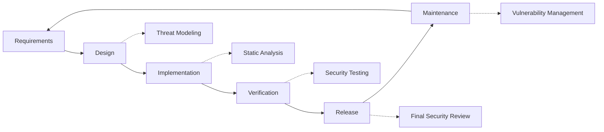

# ممارسات الأمان {#security-practices}

## جدول المحتويات {#table-of-contents}

* [مقدمة](#foreword)
* [أمن البنية التحتية](#infrastructure-security)
  * [مراكز البيانات الآمنة](#secure-data-centers)
  * [أمن الشبكات](#network-security)
* [أمان البريد الإلكتروني](#email-security)
  * [التشفير](#encryption)
  * [المصادقة والتفويض](#authentication-and-authorization)
  * [تدابير مكافحة الإساءة](#anti-abuse-measures)
* [حماية البيانات](#data-protection)
  * [تقليل البيانات](#data-minimization)
  * [النسخ الاحتياطي والاسترداد](#backup-and-recovery)
* [مقدمي الخدمة](#service-providers)
* [الامتثال والتدقيق](#compliance-and-auditing)
  * [تقييمات أمنية منتظمة](#regular-security-assessments)
  * [امتثال](#compliance)
* [الاستجابة للحوادث](#incident-response)
* [دورة حياة تطوير الأمان](#security-development-lifecycle)
* [تقوية الخادم](#server-hardening)
* [اتفاقية مستوى الخدمة](#service-level-agreement)
* [أمن المصدر المفتوح](#open-source-security)
* [أمن الموظفين](#employee-security)
* [التحسين المستمر](#continuous-improvement)
* [موارد إضافية](#additional-resources)

## مقدمة {#foreword}

في فوروارد إيميل، يُعدّ الأمان أولويتنا القصوى. لقد طبّقنا إجراءات أمنية شاملة لحماية مراسلاتكم عبر البريد الإلكتروني وبياناتكم الشخصية. توضح هذه الوثيقة ممارساتنا الأمنية والخطوات التي نتخذها لضمان سرية بريدكم الإلكتروني وسلامته وتوافره.

## أمان البنية التحتية {#infrastructure-security}

### مراكز البيانات الآمنة {#secure-data-centers}

يتم استضافة البنية التحتية الخاصة بنا في مراكز بيانات متوافقة مع SOC 2 مع:

* أمن ومراقبة على مدار الساعة طوال أيام الأسبوع
* ضوابط دخول بيومترية
* أنظمة طاقة احتياطية
* كشف وإخماد حرائق متقدم
* مراقبة بيئية

### أمان الشبكة {#network-security}

نحن ننفذ طبقات متعددة من أمان الشبكة:

* جدران حماية للمؤسسات مع قوائم تحكم صارمة في الوصول
* حماية من هجمات الحرمان من الخدمة الموزعة (DDoS) والتخفيف من آثارها
* فحص دوري لثغرات الشبكة
* أنظمة كشف ومنع التسلل
* تشفير حركة البيانات بين جميع نقاط نهاية الخدمة
* حماية من خلال فحص المنافذ مع حظر تلقائي للأنشطة المشبوهة

> \[!IMPORTANT]
> جميع البيانات المنقولة مشفرة باستخدام TLS 1.2+‎ مع مجموعات تشفير حديثة.

## أمان البريد الإلكتروني {#email-security}

### تشفير {#encryption}

* **أمان طبقة النقل (TLS)**: يتم تشفير جميع بيانات البريد الإلكتروني أثناء نقلها باستخدام TLS 1.2 أو أعلى.
* **التشفير الشامل**: دعم معايير OpenPGP/MIME وS/MIME.
* **تشفير التخزين**: يتم تشفير جميع رسائل البريد الإلكتروني المخزنة أثناء التخزين باستخدام تشفير ChaCha20-Poly1305 في ملفات SQLite.
* **تشفير القرص بالكامل**: تشفير LUKS v2 للقرص بأكمله.
* **الحماية الشاملة**: نطبق التشفير أثناء التخزين، والتشفير في الذاكرة، والتشفير أثناء النقل.

نحن أول خدمة بريد إلكتروني في العالم تستخدم **[صناديق بريد SQLite مقاومة للكم ومشفرة بشكل فردي](https://forwardemail.net/en/blog/docs/best-quantum-safe-encrypted-email-service)**.

### المصادقة والتفويض {#authentication-and-authorization}

* **توقيع DKIM**: جميع رسائل البريد الإلكتروني الصادرة موقعة باستخدام DKIM.* **SPF وDMARC**: دعم كامل لـ SPF وDMARC لمنع انتحال البريد الإلكتروني.* **MTA-STS**: دعم MTA-STS لتشفير TLS.* **المصادقة متعددة العوامل**: متاحة لجميع حسابات الوصول.

### تدابير مكافحة الإساءة {#anti-abuse-measures}

* **تصفية البريد العشوائي**: كشف متعدد الطبقات للبريد العشوائي باستخدام التعلم الآلي
* **فحص الفيروسات**: فحص فوري لجميع المرفقات
* **تحديد المعدل**: حماية من هجمات القوة الغاشمة والهجمات التعدادية
* **سمعة IP**: مراقبة سمعة IP المرسلة
* **تصفية المحتوى**: الكشف عن عناوين URL الضارة ومحاولات التصيد الاحتيالي

## حماية البيانات {#data-protection}

### تقليل البيانات {#data-minimization}

نحن نتبع مبدأ تقليل البيانات:

* نجمع فقط البيانات اللازمة لتقديم خدمتنا.
* تتم معالجة محتوى البريد الإلكتروني في الذاكرة ولا يُخزَّن بشكل دائم إلا عند الحاجة إلى تسليم IMAP/POP3.
* يتم إخفاء هوية السجلات والاحتفاظ بها فقط عند الضرورة.

### النسخ الاحتياطي والاسترداد {#backup-and-recovery}

* نسخ احتياطية يومية آلية مع تشفير
* تخزين نسخ احتياطية موزع جغرافيًا
* اختبار استعادة النسخ الاحتياطية بانتظام
* إجراءات استرداد الكوارث مع تحديد RPO وRTO

## مقدمو الخدمة {#service-providers}

نختار مُزوّدي خدماتنا بعناية لضمان استيفائهم لمعاييرنا الأمنية العالية. فيما يلي مُزوّدو الخدمات الذين نتعامل معهم لنقل البيانات دوليًا وحالة امتثالهم للائحة العامة لحماية البيانات (GDPR):

| مزود | غاية | مرشح جسيمات الديزل معتمد | صفحة الامتثال لقانون حماية البيانات العامة (GDPR) |
| --------------------------------------------- | ------------------------- | ------------- | ----------------------------------------------------------------- |
| [Cloudflare](https://www.cloudflare.com) | شبكة توصيل المحتوى (CDN)، حماية DDoS، DNS | ✅ نعم | [Cloudflare GDPR](https://www.cloudflare.com/trust-hub/gdpr/) |
| [DataPacket](https://www.datapacket.com) | البنية التحتية للخادم | ❌ لا | [DataPacket Privacy](https://www.datapacket.com/privacy-policy) |
| [Digital Ocean](https://www.digitalocean.com) | البنية التحتية السحابية | ❌ لا | [DigitalOcean GDPR](https://www.digitalocean.com/legal/gdpr) |
| [Vultr](https://www.vultr.com) | البنية التحتية السحابية | ❌ لا | [Vultr GDPR](https://www.vultr.com/legal/eea-gdpr-privacy/) |
| [Stripe](https://stripe.com) | معالجة الدفع | ✅ نعم | [Stripe Privacy Center](https://stripe.com/legal/privacy-center) |
| [PayPal](https://www.paypal.com) | معالجة الدفع | ❌ لا | [PayPal Privacy](https://www.paypal.com/uk/legalhub/privacy-full) |

نتعامل مع هؤلاء المزودين لضمان تقديم خدمات موثوقة وآمنة، مع الالتزام بلوائح حماية البيانات الدولية. تُجرى جميع عمليات نقل البيانات مع تطبيق إجراءات وقائية مناسبة لحماية معلوماتك الشخصية.

## الامتثال والتدقيق {#compliance-and-auditing}

### تقييمات أمنية منتظمة {#regular-security-assessments}

يقوم فريقنا بمراقبة ومراجعة وتقييم قاعدة البيانات والخوادم والبنية التحتية والممارسات بانتظام. نطبق برنامج أمان شاملًا يتضمن:

* تغيير دوري لمفاتيح SSH
* مراقبة مستمرة لسجلات الوصول
* فحص أمني آلي
* إدارة استباقية للثغرات الأمنية
* تدريب أمني دوري لجميع أعضاء الفريق

### الامتثال لـ {#compliance}

* ممارسات معالجة البيانات متوافقة مع [GDPR](https://forwardemail.net/gdpr)
* [اتفاقية معالجة البيانات (DPA)](https://forwardemail.net/dpa) متاح لعملاء الشركات
* ضوابط خصوصية متوافقة مع قانون خصوصية المستهلك في كاليفورنيا (CCPA)
* عمليات مُدققة وفقًا لمعيار SOC 2 من النوع الثاني

## الاستجابة للحوادث {#incident-response}

تتضمن خطة الاستجابة للحوادث الأمنية لدينا ما يلي:

١. **الكشف**: أنظمة مراقبة وتنبيه آلية
٢. **الاحتواء**: عزل فوري للأنظمة المتأثرة
٣. **الاستئصال**: إزالة التهديد وتحليل السبب الجذري
٤. **الاسترداد**: استعادة الخدمات بشكل آمن
٥. **الإخطار**: التواصل الفوري مع المستخدمين المتأثرين
٦. **تحليل ما بعد الحادث**: مراجعة شاملة وتحسين

إذا اكتشفت ثغرة أمنية، يُرجى الإبلاغ عنها فورًا إلى <security@forwardemail.net>.

## دورة حياة تطوير الأمان {#security-development-lifecycle}

جميع التعليمات البرمجية تخضع لـ:

* جمع متطلبات الأمان
* نمذجة التهديدات أثناء التصميم
* ممارسات الترميز الآمن
* اختبار أمان التطبيقات الثابتة والديناميكية
* مراجعة الكود مع التركيز على الأمان
* فحص ثغرات التبعية

## تقوية الخادم {#server-hardening}

ينفذ [تكوين Ansible](https://github.com/forwardemail/forwardemail.net/tree/master/ansible) الخاص بنا العديد من تدابير تقوية الخادم:

* **تعطيل الوصول عبر USB**: يتم تعطيل المنافذ المادية عن طريق حظر وحدة نواة تخزين USB.
* **قواعد جدار الحماية**: قواعد iptables صارمة تسمح بالاتصالات الضرورية فقط.
* **تعزيز SSH**: المصادقة القائمة على المفتاح فقط، لا تسجيل دخول بكلمة مرور، وتعطيل تسجيل دخول الجذر.
* **عزل الخدمة**: تعمل كل خدمة بامتيازات مطلوبة محدودة.
* **التحديثات التلقائية**: يتم تطبيق تصحيحات الأمان تلقائيًا.
* **التشغيل الآمن**: عملية تشغيل مُتحقق منها لمنع التلاعب.
* **تعزيز النواة**: تأمين معلمات النواة وتكوينات sysctl.
* **قيود نظام الملفات**: خيارات تحميل noexec وnosuid وnodev عند الاقتضاء.
* **تعطيل تفريغ النواة**: تم تكوين النظام لمنع تفريغ النواة لأسباب أمنية.
* **تعطيل المبادلة**: تم تعطيل مبادلة الذاكرة لمنع تسرب البيانات.
* **حماية فحص المنافذ**: الكشف التلقائي عن محاولات فحص المنافذ وحظرها.
* **صفحات ضخمة شفافة. مُعطَّل**: تم تعطيل THP لتحسين الأداء والأمان.
* **تعزيز خدمات النظام**: تم تعطيل الخدمات غير الأساسية مثل Apport.
* **إدارة المستخدمين**: مبدأ الحد الأدنى من الامتيازات مع وجود مستخدمين منفصلين للنشر وعمليات التطوير.
* **حدود واصف الملفات**: تم زيادة الحدود لتحسين الأداء والأمان.

## اتفاقية مستوى الخدمة {#service-level-agreement}

نحافظ على مستوى عالٍ من توافر الخدمة وموثوقيتها. بنيتنا التحتية مصممة لتوفير التكرار وتحمل الأخطاء لضمان استمرارية خدمة البريد الإلكتروني لديكم. مع أننا لا ننشر وثيقة رسمية لاتفاقية مستوى الخدمة (SLA)، إلا أننا ملتزمون بما يلي:

* نسبة تشغيل تصل إلى 99.9%+ لجميع الخدمات
* استجابة سريعة لانقطاعات الخدمة
* تواصل شفاف أثناء الحوادث
* صيانة دورية خلال فترات انخفاض الحركة

## أمان مفتوح المصدر {#open-source-security}

باعتبارنا [خدمة مفتوحة المصدر](https://github.com/forwardemail/forwardemail.net)، فإن أمننا يستفيد من:

* كود شفاف يُمكن لأي شخص تدقيقه.
* تحسينات أمنية مدفوعة من قِبل المجتمع.
* تحديد سريع للثغرات الأمنية وتصحيحها.
* لا أمان من خلال الغموض.

## أمان الموظف {#employee-security}

* فحص خلفية جميع الموظفين
* تدريب على الوعي الأمني
* مبدأ الوصول الأقل امتيازًا
* تدريب أمني دوري

## التحسين المستمر {#continuous-improvement}

نعمل باستمرار على تحسين وضعنا الأمني من خلال:

* رصد اتجاهات الأمن والتهديدات الناشئة
* مراجعة وتحديث سياسات الأمن بانتظام
* آراء الباحثين والمستخدمين في مجال الأمن
* المشاركة في مجتمع الأمن

لمزيد من المعلومات حول ممارساتنا الأمنية أو للإبلاغ عن مخاوف أمنية، يرجى الاتصال بـ <security@forwardemail.net>.

## موارد إضافية {#additional-resources}

* [سياسة الخصوصية](https://forwardemail.net/en/privacy)
* [شروط الخدمة](https://forwardemail.net/en/terms)
* [الامتثال لقانون حماية البيانات العامة (GDPR)](https://forwardemail.net/gdpr)
* [اتفاقية معالجة البيانات (DPA)](https://forwardemail.net/dpa)
* [الإبلاغ عن إساءة](https://forwardemail.net/en/report-abuse)
* [سياسة الأمن](https://github.com/forwardemail/.github/blob/main/SECURITY.md)
* [Security.txt](https://forwardemail.net/security.txt)
* [مستودع GitHub](https://github.com/forwardemail/forwardemail.net)
* [FAQ](https://forwardemail.net/en/faq)