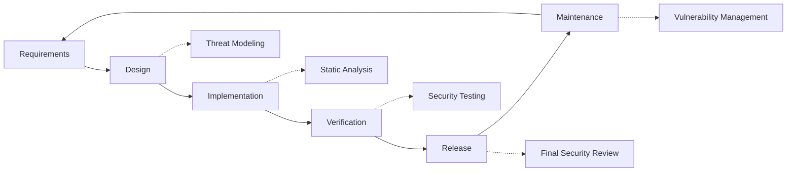

# ممارسات الأمان {#security-practices}

## جدول المحتويات {#table-of-contents}

* [مقدمة](#foreword)
* [أمان البنية التحتية](#infrastructure-security)
  * [مراكز البيانات الآمنة](#secure-data-centers)
  * [أمان الشبكة](#network-security)
* [أمان البريد الإلكتروني](#email-security)
  * [التشفير](#encryption)
  * [المصادقة والتفويض](#authentication-and-authorization)
  * [إجراءات مكافحة الإساءة](#anti-abuse-measures)
* [حماية البيانات](#data-protection)
  * [تقليل البيانات](#data-minimization)
  * [النسخ الاحتياطي والاسترداد](#backup-and-recovery)
* [مزودو الخدمة](#service-providers)
* [الامتثال والتدقيق](#compliance-and-auditing)
  * [تقييمات الأمان الدورية](#regular-security-assessments)
  * [الامتثال](#compliance)
* [الاستجابة للحوادث](#incident-response)
* [دورة حياة تطوير الأمان](#security-development-lifecycle)
* [تحصين الخادم](#server-hardening)
* [اتفاقية مستوى الخدمة](#service-level-agreement)
* [أمان المصادر المفتوحة](#open-source-security)
* [أمان الموظفين](#employee-security)
* [التحسين المستمر](#continuous-improvement)
* [الموارد الإضافية](#additional-resources)

## مقدمة {#foreword}

في Forward Email، الأمان هو أولويتنا القصوى. لقد نفذنا تدابير أمان شاملة لحماية اتصالات بريدك الإلكتروني وبياناتك الشخصية. توضح هذه الوثيقة ممارسات الأمان التي نتبعها والخطوات التي نتخذها لضمان سرية وسلامة وتوافر بريدك الإلكتروني.

## أمان البنية التحتية {#infrastructure-security}

### مراكز البيانات الآمنة {#secure-data-centers}

يتم استضافة بنيتنا التحتية في مراكز بيانات متوافقة مع SOC 2 مع:

* أمان ومراقبة مادية على مدار الساعة طوال أيام الأسبوع
* ضوابط وصول بيومترية
* أنظمة طاقة احتياطية
* كشف وإخماد حرائق متقدم
* مراقبة بيئية

### أمان الشبكة {#network-security}

نطبق طبقات متعددة من أمان الشبكة:

* جدران حماية بمستوى المؤسسات مع قوائم تحكم وصول صارمة
* حماية وتخفيف هجمات DDoS
* فحص دوري لثغرات الشبكة
* أنظمة كشف ومنع التسلل
* تشفير حركة المرور بين جميع نقاط الخدمة
* حماية من فحص المنافذ مع حظر تلقائي للنشاط المشبوه

> \[!IMPORTANT]
> جميع البيانات أثناء النقل مشفرة باستخدام TLS 1.2+ مع مجموعات تشفير حديثة.

## أمان البريد الإلكتروني {#email-security}

### التشفير {#encryption}

* **أمان طبقة النقل (TLS)**: يتم تشفير جميع حركة البريد الإلكتروني أثناء النقل باستخدام TLS 1.2 أو أعلى
* **التشفير من الطرف إلى الطرف**: دعم معايير OpenPGP/MIME و S/MIME
* **تشفير التخزين**: جميع الرسائل المخزنة مشفرة في حالة السكون باستخدام تشفير ChaCha20-Poly1305 في ملفات SQLite
* **تشفير القرص الكامل**: تشفير LUKS v2 للقرص بأكمله
* **حماية شاملة**: ننفذ التشفير أثناء التخزين، والتشفير في الذاكرة، والتشفير أثناء النقل

> \[!NOTE]
> نحن أول وأحد خدمات البريد الإلكتروني في العالم التي تستخدم **[صناديق بريد SQLite مشفرة مقاومة للحوسبة الكمومية وفردية التشفير](https://forwardemail.net/en/blog/docs/best-quantum-safe-encrypted-email-service)**.

### المصادقة والتفويض {#authentication-and-authorization}

* **توقيع DKIM**: جميع الرسائل الصادرة موقعة باستخدام DKIM
* **SPF و DMARC**: دعم كامل لـ SPF و DMARC لمنع انتحال البريد الإلكتروني
* **MTA-STS**: دعم MTA-STS لفرض تشفير TLS
* **المصادقة متعددة العوامل**: متاحة لجميع الوصول إلى الحسابات

### إجراءات مكافحة الإساءة {#anti-abuse-measures}

* **تصفية الرسائل المزعجة**: كشف متعدد الطبقات للرسائل المزعجة باستخدام التعلم الآلي
* **فحص الفيروسات**: فحص فوري لجميع المرفقات
* **تحديد المعدل**: حماية ضد هجمات القوة الغاشمة والهجمات الاستقصائية
* **سمعة عناوين IP**: مراقبة سمعة عناوين IP المرسلة
* **تصفية المحتوى**: كشف عناوين URL الخبيثة ومحاولات التصيد

## حماية البيانات {#data-protection}

### تقليل البيانات {#data-minimization}

نتبع مبدأ تقليل البيانات:

* نجمع فقط البيانات اللازمة لتقديم خدمتنا
* يتم معالجة محتوى البريد الإلكتروني في الذاكرة ولا يتم تخزينه بشكل دائم إلا إذا كان مطلوبًا لتسليم IMAP/POP3
* يتم إخفاء هوية السجلات وتحتفظ بها فقط طالما كان ذلك ضروريًا
### النسخ الاحتياطي والاسترداد {#backup-and-recovery}

* نسخ احتياطية يومية مؤتمتة مع التشفير
* تخزين النسخ الاحتياطية موزع جغرافياً
* اختبار منتظم لاستعادة النسخ الاحتياطية
* إجراءات التعافي من الكوارث مع تحديد RPO و RTO

## مزودو الخدمة {#service-providers}

نختار مزودي الخدمة لدينا بعناية لضمان تلبية معايير الأمان العالية لدينا. فيما يلي المزودون الذين نستخدمهم لنقل البيانات دولياً وحالة امتثالهم للائحة GDPR:

| المزود                                        | الغرض                      | معتمد من DPF | صفحة الامتثال لـ GDPR                                                                                   |
| --------------------------------------------- | -------------------------- | ------------- | ------------------------------------------------------------------------------------------------------- |
| [Cloudflare](https://www.cloudflare.com)      | شبكة توصيل المحتوى، حماية DDoS، DNS | ✅ نعم         | [Cloudflare GDPR](https://www.cloudflare.com/trust-hub/gdpr/)                                           |
| [DataPacket](https://www.datapacket.com)      | بنية تحتية للخوادم         | ❌ لا          | [DataPacket Privacy](https://www.datapacket.com/privacy-policy)                                         |
| [Digital Ocean](https://www.digitalocean.com) | بنية تحتية سحابية          | ❌ لا          | [DigitalOcean GDPR](https://www.digitalocean.com/legal/gdpr)                                            |
| [GitHub](https://github.com)                  | استضافة الشيفرة المصدرية، CI/CD | ✅ نعم         | [GitHub GDPR](https://docs.github.com/en/site-policy/privacy-policies/github-data-protection-agreement) |
| [Vultr](https://www.vultr.com)                | بنية تحتية سحابية          | ❌ لا          | [Vultr GDPR](https://www.vultr.com/legal/eea-gdpr-privacy/)                                             |
| [Stripe](https://stripe.com)                  | معالجة المدفوعات           | ✅ نعم         | [Stripe Privacy Center](https://stripe.com/legal/privacy-center)                                        |
| [PayPal](https://www.paypal.com)              | معالجة المدفوعات           | ❌ لا          | [PayPal Privacy](https://www.paypal.com/uk/legalhub/privacy-full)                                       |

نستخدم هؤلاء المزودين لضمان تقديم خدمة موثوقة وآمنة مع الحفاظ على الامتثال للوائح حماية البيانات الدولية. تتم جميع عمليات نقل البيانات مع وجود الضمانات المناسبة لحماية معلوماتك الشخصية.

## الامتثال والتدقيق {#compliance-and-auditing}

### التقييمات الأمنية الدورية {#regular-security-assessments}

يقوم فريقنا بمراقبة ومراجعة وتقييم قاعدة الشيفرة والخوادم والبنية التحتية والممارسات بانتظام. ننفذ برنامج أمني شامل يتضمن:

* تدوير منتظم لمفاتيح SSH
* مراقبة مستمرة لسجلات الوصول
* فحص أمني مؤتمت
* إدارة استباقية للثغرات الأمنية
* تدريب أمني منتظم لجميع أعضاء الفريق

### الامتثال {#compliance}

* ممارسات معالجة البيانات متوافقة مع [GDPR](https://forwardemail.net/gdpr)
* اتفاقية معالجة البيانات ([DPA](https://forwardemail.net/dpa)) متاحة لعملاء الأعمال
* ضوابط الخصوصية متوافقة مع CCPA
* عمليات مدققة وفق SOC 2 النوع الثاني

## الاستجابة للحوادث {#incident-response}

تتضمن خطة استجابة الحوادث الأمنية لدينا:

1. **الكشف**: أنظمة مراقبة وتنبيه مؤتمتة
2. **الاحتواء**: عزل فوري للأنظمة المتأثرة
3. **القضاء**: إزالة التهديد وتحليل السبب الجذري
4. **الاسترداد**: استعادة الخدمات بأمان
5. **الإخطار**: التواصل في الوقت المناسب مع المستخدمين المتأثرين
6. **تحليل ما بعد الحادث**: مراجعة شاملة وتحسين

> \[!WARNING]
> إذا اكتشفت ثغرة أمنية، يرجى الإبلاغ عنها فوراً إلى <security@forwardemail.net>.

## دورة حياة تطوير الأمان {#security-development-lifecycle}

```mermaid
flowchart LR
    A[Requirements] --> B[Design]
    B --> C[Implementation]
    C --> D[Verification]
    D --> E[Release]
    E --> F[Maintenance]
    F --> A
    B -.-> G[Threat Modeling]
    C -.-> H[Static Analysis]
    D -.-> I[Security Testing]
    E -.-> J[Final Security Review]
    F -.-> K[Vulnerability Management]
```
جميع الأكواد تخضع لـ:

* جمع متطلبات الأمان
* نمذجة التهديدات أثناء التصميم
* ممارسات الترميز الآمن
* اختبار أمان التطبيقات الثابتة والديناميكية
* مراجعة الكود مع التركيز على الأمان
* فحص نقاط الضعف في التبعيات

## تقوية الخادم {#server-hardening}

تقوم [تكوين أنسبل](https://github.com/forwardemail/forwardemail.net/tree/master/ansible) الخاص بنا بتنفيذ العديد من إجراءات تقوية الخادم:

* **تعطيل الوصول إلى USB**: تم تعطيل المنافذ الفيزيائية عن طريق إدراج وحدة usb-storage الخاصة بالنواة في القائمة السوداء
* **قواعد جدار الحماية**: قواعد iptables صارمة تسمح فقط بالاتصالات الضرورية
* **تقوية SSH**: المصادقة باستخدام المفاتيح فقط، لا تسجيل دخول بكلمة مرور، تعطيل تسجيل دخول الجذر
* **عزل الخدمة**: كل خدمة تعمل بأقل الامتيازات المطلوبة
* **التحديثات التلقائية**: تطبيق تصحيحات الأمان تلقائيًا
* **الإقلاع الآمن**: عملية إقلاع مُحققة لمنع التلاعب
* **تقوية النواة**: معلمات نواة آمنة وتكوينات sysctl
* **قيود نظام الملفات**: خيارات mount مثل noexec و nosuid و nodev حيثما كان مناسبًا
* **تعطيل تفريغ النواة (Core Dumps)**: تم تكوين النظام لمنع تفريغ النواة لأسباب أمنية
* **تعطيل الذاكرة الافتراضية (Swap)**: تعطيل الذاكرة الافتراضية لمنع تسرب البيانات
* **حماية من فحص المنافذ**: الكشف التلقائي وحظر محاولات فحص المنافذ
* **تعطيل الصفحات الشفافة الكبيرة (Transparent Huge Pages)**: تعطيل THP لتحسين الأداء والأمان
* **تقوية خدمات النظام**: تعطيل الخدمات غير الأساسية مثل Apport
* **إدارة المستخدمين**: مبدأ أقل الامتيازات مع مستخدمين منفصلين للنشر و DevOps
* **حدود مؤشرات الملفات**: زيادة الحدود لأداء وأمان أفضل

## اتفاقية مستوى الخدمة {#service-level-agreement}

نحافظ على مستوى عالٍ من توفر الخدمة وموثوقيتها. بنيتنا التحتية مصممة للتكرار وتحمل الأخطاء لضمان بقاء خدمة البريد الإلكتروني الخاصة بك تعمل. رغم أننا لا ننشر وثيقة SLA رسمية، إلا أننا ملتزمون بـ:

* توفر بنسبة 99.9%+ لجميع الخدمات
* استجابة سريعة لتعطلات الخدمة
* تواصل شفاف أثناء الحوادث
* صيانة منتظمة خلال فترات انخفاض الحركة

## أمان المصدر المفتوح {#open-source-security}

بصفتنا [خدمة مفتوحة المصدر](https://github.com/forwardemail/forwardemail.net)، يستفيد أماننا من:

* شفافية الكود التي يمكن لأي شخص تدقيقها
* تحسينات أمان يقودها المجتمع
* تحديد سريع وتصحيح نقاط الضعف
* عدم الاعتماد على الأمان من خلال الغموض

## أمان الموظفين {#employee-security}

* فحوصات خلفية لجميع الموظفين
* تدريب على الوعي الأمني
* مبدأ أقل الامتيازات للوصول
* تعليم أمني منتظم

## التحسين المستمر {#continuous-improvement}

نحن نحسن موقفنا الأمني باستمرار من خلال:

* مراقبة اتجاهات الأمان والتهديدات الناشئة
* مراجعة وتحديث منتظم لسياسات الأمان
* ملاحظات من الباحثين الأمنيين والمستخدمين
* المشاركة في مجتمع الأمان

لمزيد من المعلومات حول ممارساتنا الأمنية أو للإبلاغ عن مخاوف أمنية، يرجى الاتصال بـ <security@forwardemail.net>.

## موارد إضافية {#additional-resources}

* [سياسة الخصوصية](https://forwardemail.net/en/privacy)
* [شروط الخدمة](https://forwardemail.net/en/terms)
* [الامتثال للائحة GDPR](https://forwardemail.net/gdpr)
* [اتفاقية معالجة البيانات (DPA)](https://forwardemail.net/dpa)
* [الإبلاغ عن إساءة الاستخدام](https://forwardemail.net/en/report-abuse)
* [سياسة الأمان](https://github.com/forwardemail/.github/blob/main/SECURITY.md)
* [Security.txt](https://forwardemail.net/security.txt)
* [مستودع GitHub](https://github.com/forwardemail/forwardemail.net)
* [الأسئلة الشائعة](https://forwardemail.net/en/faq)
