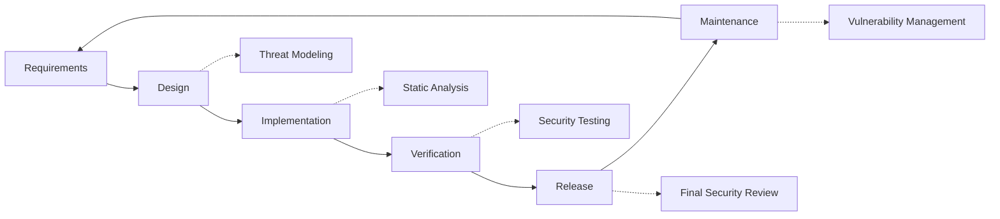

# Bezpečnostní postupy {#security-practices}

## Obsah {#table-of-contents}

* [Předmluva](#foreword)
* [Zabezpečení infrastruktury](#infrastructure-security)
  * [Bezpečná datová centra](#secure-data-centers)
  * [Zabezpečení sítě](#network-security)
* [Zabezpečení e-mailu](#email-security)
  * [Šifrování](#encryption)
  * [Autentizace a autorizace](#authentication-and-authorization)
  * [Opatření proti zneužívání](#anti-abuse-measures)
* [Ochrana osobních údajů](#data-protection)
  * [Minimalizace dat](#data-minimization)
  * [Zálohování a obnova](#backup-and-recovery)
* [Poskytovatelé služeb](#service-providers)
* [Dodržování předpisů a audit](#compliance-and-auditing)
  * [Pravidelná bezpečnostní hodnocení](#regular-security-assessments)
  * [Dodržování](#compliance)
* [Reakce na incidenty](#incident-response)
* [Životní cyklus vývoje zabezpečení](#security-development-lifecycle)
* [Zajištění serveru](#server-hardening)
* [Dohoda o úrovni služeb](#service-level-agreement)
* [Zabezpečení s otevřeným zdrojovým kódem](#open-source-security)
* [Bezpečnost zaměstnanců](#employee-security)
* [Neustálé zlepšování](#continuous-improvement)
* [Další zdroje](#additional-resources)

## Předmluva {#foreword}

Ve společnosti Forward Email je bezpečnost naší nejvyšší prioritou. Zavedli jsme komplexní bezpečnostní opatření na ochranu vaší e-mailové komunikace a osobních údajů. Tento dokument popisuje naše bezpečnostní postupy a kroky, které podnikáme k zajištění důvěrnosti, integrity a dostupnosti vašich e-mailů.

## Zabezpečení infrastruktury {#infrastructure-security}

### Zabezpečená datová centra {#secure-data-centers}

Naše infrastruktura je hostována v datových centrech splňujících normu SOC 2 s:

* Fyzická ostraha a dohled 24 hodin denně, 7 dní v týdnu
* Biometrické kontroly přístupu
* Redundantní napájecí systémy
* Pokročilá detekce a potlačení požáru
* Monitorování prostředí

### Zabezpečení sítě {#network-security}

Implementujeme několik vrstev síťové bezpečnosti:

* Firewally podnikové úrovně s přísnými seznamy kontroly přístupu
* Ochrana a zmírňování DDoS útoků
* Pravidelné skenování zranitelností sítě
* Systémy pro detekci a prevenci narušení
* Šifrování provozu mezi všemi koncovými body služby
* Ochrana skenováním portů s automatickým blokováním podezřelé aktivity

> \[!IMPORTANT]
> Všechna přenášená data jsou šifrována pomocí TLS 1.2+ s moderními šifrovacími sadami.

## Zabezpečení e-mailu {#email-security}

### Šifrování {#encryption}

* **Transport Layer Security (TLS)**: Veškerý e-mailový provoz je šifrován během přenosu pomocí TLS 1.2 nebo vyššího
* **End-to-End Encryption**: Podpora standardů OpenPGP/MIME a S/MIME
* **Storage Encryption**: Všechny uložené e-maily jsou v klidovém stavu šifrovány pomocí šifrování ChaCha20-Poly1305 v souborech SQLite
* **Full Disk Encryption**: Šifrování LUKS v2 pro celý disk
* **Komplexní ochrana**: Implementujeme šifrování v klidovém stavu, šifrování v paměti a šifrování během přenosu

> \[!NOTE]
> Jsme první a jediná e-mailová služba na světě, která používá **[kvantově odolné a individuálně šifrované poštovní schránky SQLite](https://forwardemail.net/en/blog/docs/best-quantum-safe-encrypted-email-service)**.

### Ověřování a autorizace {#authentication-and-authorization}

* **Podepisování DKIM**: Všechny odchozí e-maily jsou podepsány pomocí DKIM
* **SPF a DMARC**: Plná podpora SPF a DMARC pro prevenci falšování e-mailů
* **MTA-STS**: Podpora MTA-STS pro vynucení šifrování TLS
* **Multi-Factor Authentication**: Dostupné pro všechny přístupy k účtům

### Opatření proti zneužívání {#anti-abuse-measures}

* **Filtrování spamu**: Vícevrstvá detekce spamu pomocí strojového učení
* **Skenování virů**: Skenování všech příloh v reálném čase
* **Omezení rychlosti**: Ochrana před útoky hrubou silou a enumerací
* **Reputace IP adres**: Monitorování reputace odesílající IP adresy
* **Filtrování obsahu**: Detekce škodlivých URL adres a phishingových pokusů

## Ochrana dat {#data-protection}

### Minimalizace dat {#data-minimization}

Řídíme se principem minimalizace dat:

* Shromažďujeme pouze data nezbytná k poskytování našich služeb.
* Obsah e-mailů je zpracováván v paměti a není trvale ukládán, pokud není vyžadován pro doručování přes IMAP/POP3.
* Protokoly jsou anonymizovány a uchovávány pouze po nezbytně nutnou dobu.

### Zálohování a obnova {#backup-and-recovery}

* Automatizované denní zálohy se šifrováním
* Geograficky distribuované úložiště záloh
* Pravidelné testování obnovy záloh
* Postupy obnovy po havárii s definovanými RPO a RTO

## Poskytovatelé služeb {#service-providers}

Poskytovatele našich služeb pečlivě vybíráme, abychom zajistili, že splňují naše vysoké bezpečnostní standardy. Níže uvádíme poskytovatele, které využíváme pro mezinárodní přenos dat, a jejich status souladu s GDPR:

| Poskytovatel | Účel | Certifikace DPF | Stránka s informacemi o souladu s GDPR |
| --------------------------------------------- | ------------------------- | ------------- | ----------------------------------------------------------------- |
| [Cloudflare](https://www.cloudflare.com) | CDN, ochrana proti DDoS, DNS | ✅ Ano | [Cloudflare GDPR](https://www.cloudflare.com/trust-hub/gdpr/) |
| [DataPacket](https://www.datapacket.com) | Serverová infrastruktura | ❌ Ne | [DataPacket Privacy](https://www.datapacket.com/privacy-policy) |
| [Digital Ocean](https://www.digitalocean.com) | Cloudová infrastruktura | ❌ Ne | [DigitalOcean GDPR](https://www.digitalocean.com/legal/gdpr) |
| [Vultr](https://www.vultr.com) | Cloudová infrastruktura | ❌ Ne | [Vultr GDPR](https://www.vultr.com/legal/eea-gdpr-privacy/) |
| [Stripe](https://stripe.com) | Zpracování plateb | ✅ Ano | [Stripe Privacy Center](https://stripe.com/legal/privacy-center) |
| [PayPal](https://www.paypal.com) | Zpracování plateb | ❌ Ne | [PayPal Privacy](https://www.paypal.com/uk/legalhub/privacy-full) |

Tyto poskytovatele využíváme k zajištění spolehlivého a bezpečného poskytování služeb a zároveň k dodržování mezinárodních předpisů o ochraně osobních údajů. Veškeré přenosy dat probíhají s odpovídajícími ochrannými opatřeními na ochranu vašich osobních údajů.

## Dodržování předpisů a audit {#compliance-and-auditing}

### Pravidelná bezpečnostní hodnocení {#regular-security-assessments}

Náš tým pravidelně monitoruje, kontroluje a vyhodnocuje kódovou základnu, servery, infrastrukturu a postupy. Implementujeme komplexní bezpečnostní program, který zahrnuje:

* Pravidelná rotace SSH klíčů
* Průběžné sledování přístupových protokolů
* Automatizované bezpečnostní skenování
* Proaktivní správa zranitelností
* Pravidelné bezpečnostní školení pro všechny členy týmu

### Soulad s předpisy {#compliance}

* Postupy pro nakládání s daty v souladu s [GDPR](https://forwardemail.net/gdpr)
* [Smlouva o zpracování osobních údajů (DPA)](https://forwardemail.net/dpa) k dispozici pro firemní zákazníky
* Kontroly ochrany osobních údajů v souladu s CCPA
* Auditované procesy SOC 2 typu II

## Reakce na incident {#incident-response}

Náš plán reakce na bezpečnostní incidenty zahrnuje:

1. **Detekce**: Automatizované monitorovací a varovné systémy
2. **Zadržení**: Okamžitá izolace postižených systémů
3. **Eradikace**: Odstranění hrozby a analýza hlavní příčiny
4. **Obnova**: Bezpečné obnovení služeb
5. **Oznámení**: Včasná komunikace s postiženými uživateli
6. **Analýza po incidentu**: Komplexní kontrola a vylepšení

> \[!WARNING]
> Pokud objevíte bezpečnostní zranitelnost, okamžitě ji prosím nahlaste na adresu <security@forwardemail.net>.

## Životní cyklus vývoje zabezpečení {#security-development-lifecycle}

Veškerý kód prochází:

* Shromažďování bezpečnostních požadavků
* Modelování hrozeb během návrhu
* Bezpečné postupy kódování
* Statické a dynamické testování bezpečnosti aplikací
* Kontrola kódu se zaměřením na bezpečnost
* Skenování zranitelností závislostí

## Zajištění serveru {#server-hardening}

Náš [Konfigurace Ansible](https://github.com/forwardemail/forwardemail.net/tree/master/ansible) implementuje řadu opatření pro posílení zabezpečení serveru:

* **Přístup k USB zakázán**: Fyzické porty jsou zakázány zařazením modulu jádra usb-storage na černou listinu
* **Pravidla firewallu**: Přísná pravidla iptables povolující pouze nezbytná připojení
* **SSH Hardening**: Pouze ověřování založené na klíči, bez přihlášení heslem, přihlášení root zakázáno
* **Izolace služeb**: Každá služba běží s minimálními požadovanými oprávněními
* **Automatické aktualizace**: Bezpečnostní záplaty jsou aplikovány automaticky
* **Bezpečné spouštění**: Ověřený proces spouštění, aby se zabránilo neoprávněné manipulaci
* **Kernel Hardening**: Zabezpečené parametry jádra a konfigurace sysctl
* **Omezení souborového systému**: možnosti připojení noexec, nosuid a nodev, kde je to vhodné
* **Výpisy jádra zakázány**: Systém nakonfigurován tak, aby z bezpečnostních důvodů zabránil výpisům jádra
* **Swap zakázán**: Výměna paměti zakázána, aby se zabránilo úniku dat
* **Ochrana skenování portů**: Automatická detekce a blokování pokusů o skenování portů
* **Transparent Huge Pages zakázáno**: THP zakázáno pro lepší výkon a zabezpečení
* **System Service Hardening**: Nepodstatné služby, jako je Apport, zakázány
* **Správa uživatelů**: Princip nejnižších oprávnění s oddělenými uživateli pro nasazení a devops
* **Limity deskriptorů souborů**: Zvýšené limity pro lepší výkon a zabezpečení

## Dohoda o úrovni služeb {#service-level-agreement}

Udržujeme vysokou úroveň dostupnosti a spolehlivosti služeb. Naše infrastruktura je navržena s ohledem na redundanci a odolnost proti chybám, aby byla zajištěna funkčnost vaší e-mailové služby. I když nezveřejňujeme formální dokument SLA, zavazujeme se k:

* 99,9%+ dostupnost všech služeb
* Rychlá reakce na výpadky služeb
* Transparentní komunikace během incidentů
* Pravidelná údržba během období s nízkým provozem

## Zabezpečení s otevřeným zdrojovým kódem {#open-source-security}

Jako DOČASNÝ_ZAMĚSTNANEC_0 ([open-source služba](https://github.com/forwardemail/forwardemail.net)) máme výhodu v oblasti zabezpečení:

* Transparentní kód, který může auditovat kdokoli
* Vylepšení zabezpečení řízená komunitou
* Rychlá identifikace a oprava zranitelností
* Žádné zabezpečení kvůli neznámu

## Zabezpečení zaměstnanců {#employee-security}

* Prověrky všech zaměstnanců
* Bezpečnostní školení
* Princip nejnižších oprávnění přístupu
* Pravidelné bezpečnostní vzdělávání

## Neustálé zlepšování {#continuous-improvement}

Neustále zlepšujeme naši bezpečnostní pozici prostřednictvím:

* Monitorování bezpečnostních trendů a nově vznikajících hrozeb
* Pravidelná kontrola a aktualizace bezpečnostních zásad
* Zpětná vazba od bezpečnostních výzkumníků a uživatelů
* Účast v bezpečnostní komunitě

Pro více informací o našich bezpečnostních postupech nebo pro nahlášení bezpečnostních problémů kontaktujte prosím <security@forwardemail.net>.

## Další zdroje {#additional-resources}

* [Zásady ochrany osobních údajů](https://forwardemail.net/en/privacy)
* [Podmínky služby](https://forwardemail.net/en/terms)
* [Soulad s GDPR](https://forwardemail.net/gdpr)
* [Smlouva o zpracování osobních údajů (DPA)](https://forwardemail.net/dpa)
* [Nahlásit zneužití](https://forwardemail.net/en/report-abuse)
* [Bezpečnostní zásady](https://github.com/forwardemail/.github/blob/main/SECURITY.md)
* [Security.txt](https://forwardemail.net/security.txt)
* [Repozitář GitHubu](https://github.com/forwardemail/forwardemail.net)
* [FAQ](https://forwardemail.net/en/faq)