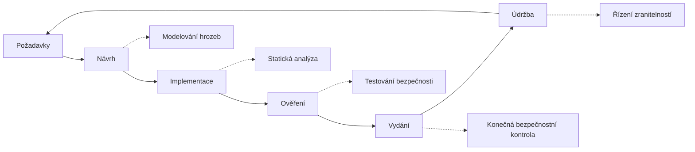

# Bezpečnostní postupy {#security-practices}

## Obsah {#table-of-contents}

* [Předmluva](#foreword)
* [Bezpečnost infrastruktury](#infrastructure-security)
  * [Bezpečné datové centrum](#secure-data-centers)
  * [Síťová bezpečnost](#network-security)
* [Bezpečnost e-mailu](#email-security)
  * [Šifrování](#encryption)
  * [Autentizace a autorizace](#authentication-and-authorization)
  * [Proti zneužití](#anti-abuse-measures)
* [Ochrana dat](#data-protection)
  * [Minimalizace dat](#data-minimization)
  * [Zálohování a obnova](#backup-and-recovery)
* [Poskytovatelé služeb](#service-providers)
* [Soulad a auditování](#compliance-and-auditing)
  * [Pravidelné bezpečnostní hodnocení](#regular-security-assessments)
  * [Soulad](#compliance)
* [Reakce na incidenty](#incident-response)
* [Životní cyklus bezpečnostního vývoje](#security-development-lifecycle)
* [Zpevnění serveru](#server-hardening)
* [Smlouva o úrovni služby](#service-level-agreement)
* [Bezpečnost open source](#open-source-security)
* [Bezpečnost zaměstnanců](#employee-security)
* [Kontinuální zlepšování](#continuous-improvement)
* [Další zdroje](#additional-resources)

## Předmluva {#foreword}

Ve Forward Email je bezpečnost naší nejvyšší prioritou. Implementovali jsme komplexní bezpečnostní opatření k ochraně vašich e-mailových komunikací a osobních údajů. Tento dokument popisuje naše bezpečnostní postupy a kroky, které podnikáme, abychom zajistili důvěrnost, integritu a dostupnost vašich e-mailů.

## Bezpečnost infrastruktury {#infrastructure-security}

### Bezpečné datové centrum {#secure-data-centers}

Naše infrastruktura je hostována v datových centrech splňujících SOC 2 s:

* 24/7 fyzickou ochranou a dohledem
* Biometrickou kontrolou přístupu
* Redundantními napájecími systémy
* Pokročilým detekčním a hasicím systémem požáru
* Monitorováním prostředí

### Síťová bezpečnost {#network-security}

Implementujeme více vrstev síťové bezpečnosti:

* Firewally podnikové úrovně s přísnými přístupovými seznamy
* Ochrana a zmírnění DDoS útoků
* Pravidelné skenování zranitelností sítě
* Systémy detekce a prevence průniků
* Šifrování provozu mezi všemi koncovými body služby
* Ochrana proti skenování portů s automatickým blokováním podezřelé aktivity

> \[!IMPORTANT]
> Veškerá data v přenosu jsou šifrována pomocí TLS 1.2+ s moderními šifrovacími sadami.

## Bezpečnost e-mailu {#email-security}

### Šifrování {#encryption}

* **Transport Layer Security (TLS)**: Veškerý e-mailový provoz je šifrován při přenosu pomocí TLS 1.2 nebo vyšší verze
* **End-to-End šifrování**: Podpora standardů OpenPGP/MIME a S/MIME
* **Šifrování uložených dat**: Všechny uložené e-maily jsou šifrovány v klidu pomocí ChaCha20-Poly1305 v SQLite souborech
* **Šifrování celého disku**: Šifrování LUKS v2 pro celý disk
* **Komplexní ochrana**: Implementujeme šifrování v klidu, v paměti i při přenosu

> \[!NOTE]
> Jsme první a jediná e-mailová služba na světě, která používá **[kvantově odolné a individuálně šifrované SQLite poštovní schránky](https://forwardemail.net/en/blog/docs/best-quantum-safe-encrypted-email-service)**.

### Autentizace a autorizace {#authentication-and-authorization}

* **DKIM podepisování**: Veškeré odchozí e-maily jsou podepsány pomocí DKIM
* **SPF a DMARC**: Plná podpora SPF a DMARC k zabránění padělání e-mailů
* **MTA-STS**: Podpora MTA-STS pro vynucení TLS šifrování
* **Vícefaktorová autentizace**: K dispozici pro veškerý přístup k účtu

### Proti zneužití {#anti-abuse-measures}

* **Filtrování spamu**: Vícevrstvá detekce spamu s využitím strojového učení
* **Kontrola virů**: Skenování všech příloh v reálném čase
* **Omezení rychlosti**: Ochrana proti útokům hrubou silou a enumeraci
* **Reputace IP**: Monitorování reputace odesílajících IP adres
* **Filtrování obsahu**: Detekce škodlivých URL a phishingových pokusů

## Ochrana dat {#data-protection}

### Minimalizace dat {#data-minimization}

Řídíme se principem minimalizace dat:

* Sbíráme pouze data nezbytná pro poskytování naší služby
* Obsah e-mailů je zpracováván v paměti a není trvale ukládán, pokud to není nutné pro doručení IMAP/POP3
* Logy jsou anonymizovány a uchovávány pouze po nezbytně nutnou dobu
### Zálohování a obnova {#backup-and-recovery}

* Automatizované denní zálohy s šifrováním
* Geograficky rozložené úložiště záloh
* Pravidelné testování obnovy záloh
* Postupy obnovy po havárii s definovanými RPO a RTO

## Poskytovatelé služeb {#service-providers}

Pečlivě vybíráme naše poskytovatele služeb, aby splňovali naše vysoké bezpečnostní standardy. Níže jsou uvedeni poskytovatelé, které používáme pro mezinárodní přenos dat, a jejich stav souladu s GDPR:

| Poskytovatel                                  | Účel                      | Certifikace DPF | Stránka o souladu s GDPR                                                                              |
| --------------------------------------------- | ------------------------- | -------------- | ----------------------------------------------------------------------------------------------------- |
| [Cloudflare](https://www.cloudflare.com)      | CDN, ochrana proti DDoS, DNS | ✅ Ano          | [Cloudflare GDPR](https://www.cloudflare.com/trust-hub/gdpr/)                                         |
| [DataPacket](https://www.datapacket.com)      | Serverová infrastruktura   | ❌ Ne           | [DataPacket Privacy](https://www.datapacket.com/privacy-policy)                                       |
| [Digital Ocean](https://www.digitalocean.com) | Cloudová infrastruktura    | ❌ Ne           | [DigitalOcean GDPR](https://www.digitalocean.com/legal/gdpr)                                          |
| [GitHub](https://github.com)                  | Hosting zdrojového kódu, CI/CD | ✅ Ano          | [GitHub GDPR](https://docs.github.com/en/site-policy/privacy-policies/github-data-protection-agreement) |
| [Vultr](https://www.vultr.com)                | Cloudová infrastruktura    | ❌ Ne           | [Vultr GDPR](https://www.vultr.com/legal/eea-gdpr-privacy/)                                           |
| [Stripe](https://stripe.com)                  | Zpracování plateb          | ✅ Ano          | [Stripe Privacy Center](https://stripe.com/legal/privacy-center)                                      |
| [PayPal](https://www.paypal.com)              | Zpracování plateb          | ❌ Ne           | [PayPal Privacy](https://www.paypal.com/uk/legalhub/privacy-full)                                     |

Tyto poskytovatele používáme k zajištění spolehlivého a bezpečného poskytování služeb při zachování souladu s mezinárodními předpisy o ochraně dat. Veškeré přenosy dat jsou prováděny s odpovídajícími bezpečnostními opatřeními na ochranu vašich osobních údajů.

## Soulad a audit {#compliance-and-auditing}

### Pravidelné bezpečnostní hodnocení {#regular-security-assessments}

Náš tým pravidelně monitoruje, přezkoumává a hodnotí kódovou základnu, servery, infrastrukturu a postupy. Implementujeme komplexní bezpečnostní program, který zahrnuje:

* Pravidelnou rotaci SSH klíčů
* Nepřetržité sledování přístupových logů
* Automatizované bezpečnostní skenování
* Proaktivní řízení zranitelností
* Pravidelné bezpečnostní školení všech členů týmu

### Soulad {#compliance}

* Praktiky zpracování dat v souladu s [GDPR](https://forwardemail.net/gdpr)
* [Smlouva o zpracování dat (DPA)](https://forwardemail.net/dpa) dostupná pro firemní zákazníky
* Ovládací prvky ochrany soukromí v souladu s CCPA
* Procesy auditované podle SOC 2 Type II

## Reakce na incidenty {#incident-response}

Náš plán reakce na bezpečnostní incidenty zahrnuje:

1. **Detekce**: Automatizované monitorování a systém upozornění
2. **Zadržení**: Okamžitá izolace postižených systémů
3. **Odstranění**: Odstranění hrozby a analýza příčiny
4. **Obnova**: Bezpečná obnova služeb
5. **Oznámení**: Včasná komunikace s postiženými uživateli
6. **Analýza po incidentu**: Komplexní přezkum a zlepšení

> \[!WARNING]
> Pokud objevíte bezpečnostní zranitelnost, prosím, ihned ji nahlaste na <security@forwardemail.net>.

## Životní cyklus vývoje bezpečnosti {#security-development-lifecycle}

```mermaid
flowchart LR
    A[Požadavky] --> B[Návrh]
    B --> C[Implementace]
    C --> D[Ověření]
    D --> E[Vydání]
    E --> F[Údržba]
    F --> A
    B -.-> G[Modelování hrozeb]
    C -.-> H[Statická analýza]
    D -.-> I[Testování bezpečnosti]
    E -.-> J[Konečná bezpečnostní kontrola]
    F -.-> K[Řízení zranitelností]
```
Veškerý kód prochází:

* Shromažďováním bezpečnostních požadavků
* Modelováním hrozeb během návrhu
* Bezpečnými programovacími postupy
* Statickým a dynamickým testováním bezpečnosti aplikací
* Kontrolou kódu se zaměřením na bezpečnost
* Skenováním zranitelností závislostí

## Zpevnění serveru {#server-hardening}

Naše [Ansible konfigurace](https://github.com/forwardemail/forwardemail.net/tree/master/ansible) implementuje řadu opatření pro zpevnění serveru:

* **Zakázán přístup přes USB**: Fyzické porty jsou zakázány pomocí blacklistování kernel modulu usb-storage
* **Pravidla firewallu**: Přísná pravidla iptables povolující pouze nezbytná připojení
* **Zpevnění SSH**: Pouze autentizace na základě klíčů, žádné přihlášení heslem, zakázáno přihlášení root
* **Izolace služeb**: Každá služba běží s minimálními potřebnými oprávněními
* **Automatické aktualizace**: Bezpečnostní záplaty jsou aplikovány automaticky
* **Secure Boot**: Ověřený proces spouštění pro zabránění manipulaci
* **Zpevnění jádra**: Bezpečné parametry jádra a konfigurace sysctl
* **Omezení souborového systému**: možnosti mount noexec, nosuid a nodev tam, kde je to vhodné
* **Zakázány core dumpy**: Systém nakonfigurován tak, aby zabránil core dumpům z bezpečnostních důvodů
* **Zakázán swap**: Swap paměť zakázána, aby se zabránilo úniku dat
* **Ochrana proti skenování portů**: Automatická detekce a blokování pokusů o skenování portů
* **Zakázány Transparent Huge Pages**: THP zakázány pro lepší výkon a bezpečnost
* **Zpevnění systémových služeb**: Nepotřebné služby jako Apport jsou zakázány
* **Správa uživatelů**: Princip nejmenších oprávnění s oddělenými uživateli pro deploy a devops
* **Limity souborových deskriptorů**: Zvýšené limity pro lepší výkon a bezpečnost

## Smlouva o úrovni služeb {#service-level-agreement}

Udržujeme vysokou úroveň dostupnosti a spolehlivosti služeb. Naše infrastruktura je navržena pro redundanci a odolnost vůči chybám, aby vaše e-mailová služba zůstala v provozu. I když nezveřejňujeme formální dokument SLA, zavazujeme se k:

* 99,9 %+ dostupnosti všech služeb
* Rychlé reakci na výpadky služeb
* Transparentní komunikaci během incidentů
* Pravidelné údržbě v době nízké zátěže

## Bezpečnost open source {#open-source-security}

Jako [open-source služba](https://github.com/forwardemail/forwardemail.net) těžíme z bezpečnosti díky:

* Transparentnímu kódu, který může kdokoli auditovat
* Bezpečnostním vylepšením řízeným komunitou
* Rychlé identifikaci a záplatování zranitelností
* Žádné bezpečnosti skrze utajení

## Bezpečnost zaměstnanců {#employee-security}

* Prověrky všech zaměstnanců
* Školení o bezpečnostním povědomí
* Přístup podle principu nejmenších oprávnění
* Pravidelné vzdělávání v oblasti bezpečnosti

## Neustálé zlepšování {#continuous-improvement}

Nepřetržitě zlepšujeme naši bezpečnostní pozici prostřednictvím:

* Monitorování bezpečnostních trendů a nových hrozeb
* Pravidelného přezkumu a aktualizací bezpečnostních politik
* Zpětné vazby od bezpečnostních výzkumníků a uživatelů
* Účasti v bezpečnostní komunitě

Pro více informací o našich bezpečnostních postupech nebo pro nahlášení bezpečnostních problémů nás prosím kontaktujte na <security@forwardemail.net>.

## Další zdroje {#additional-resources}

* [Zásady ochrany osobních údajů](https://forwardemail.net/en/privacy)
* [Podmínky služby](https://forwardemail.net/en/terms)
* [Soulad s GDPR](https://forwardemail.net/gdpr)
* [Smlouva o zpracování dat (DPA)](https://forwardemail.net/dpa)
* [Nahlásit zneužití](https://forwardemail.net/en/report-abuse)
* [Bezpečnostní politika](https://github.com/forwardemail/.github/blob/main/SECURITY.md)
* [Security.txt](https://forwardemail.net/security.txt)
* [GitHub repozitář](https://github.com/forwardemail/forwardemail.net)
* [Často kladené otázky](https://forwardemail.net/en/faq)
