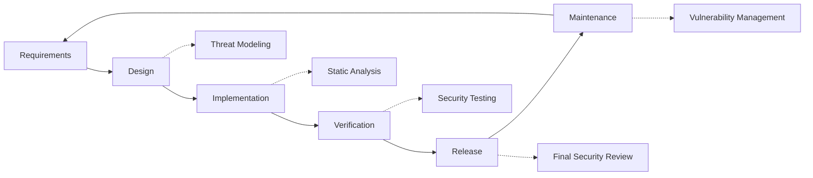

# Sikkerhedspraksis {#security-practices}

## Indholdsfortegnelse {#table-of-contents}

* [Forord](#foreword)
* [Infrastruktursikkerhed](#infrastructure-security)
  * [Sikre datacentre](#secure-data-centers)
  * [Netværkssikkerhed](#network-security)
* [E-mailsikkerhed](#email-security)
  * [Kryptering](#encryption)
  * [Godkendelse og autorisation](#authentication-and-authorization)
  * [Foranstaltninger mod misbrug](#anti-abuse-measures)
* [Databeskyttelse](#data-protection)
  * [Dataminimering](#data-minimization)
  * [Sikkerhedskopiering og gendannelse](#backup-and-recovery)
* [Tjenesteudbydere](#service-providers)
* [Overholdelse og revision](#compliance-and-auditing)
  * [Regelmæssige sikkerhedsvurderinger](#regular-security-assessments)
  * [Overholdelse](#compliance)
* [Hændelsesrespons](#incident-response)
* [Sikkerhedsudviklingslivscyklus](#security-development-lifecycle)
* [Serverhærdning](#server-hardening)
* [Serviceniveauaftale](#service-level-agreement)
* [Open Source-sikkerhed](#open-source-security)
* [Medarbejdersikkerhed](#employee-security)
* [Løbende forbedring](#continuous-improvement)
* [Yderligere ressourcer](#additional-resources)

## Forord {#foreword}

Hos Forward Email er sikkerhed vores højeste prioritet. Vi har implementeret omfattende sikkerhedsforanstaltninger for at beskytte din e-mailkommunikation og dine personlige data. Dette dokument beskriver vores sikkerhedspraksis og de skridt, vi tager for at sikre fortroligheden, integriteten og tilgængeligheden af din e-mail.

## Infrastruktursikkerhed {#infrastructure-security}

### Sikre datacentre {#secure-data-centers}

Vores infrastruktur hostes i SOC 2-kompatible datacentre med:

* Fysisk sikkerhed og overvågning døgnet rundt
* Biometrisk adgangskontrol
* Redundante strømforsyningssystemer
* Avanceret branddetektering og brandslukning
* Miljøovervågning

### Netværkssikkerhed {#network-security}

Vi implementerer flere lag af netværkssikkerhed:

* Firewalls i virksomhedsklassen med strenge adgangskontrollister
* DDoS-beskyttelse og -afbødning
* Regelmæssig scanning af netværkssårbarheder
* Systemer til registrering og forebyggelse af indtrængen
* Trafikkryptering mellem alle serviceslutpunkter
* Portscanningsbeskyttelse med automatisk blokering af mistænkelig aktivitet

> \[!IMPORTANT]
> Alle data under overførsel krypteres ved hjælp af TLS 1.2+ med moderne krypteringspakker.

## E-mailsikkerhed {#email-security}

### Kryptering {#encryption}

* **Transport Layer Security (TLS)**: Al e-mailtrafik krypteres under transport ved hjælp af TLS 1.2 eller højere
* **End-to-End-kryptering**: Understøttelse af OpenPGP/MIME- og S/MIME-standarder
* **Lagringskryptering**: Alle gemte e-mails krypteres i hviletilstand ved hjælp af ChaCha20-Poly1305-kryptering i SQLite-filer
* **Fuld diskkryptering**: LUKS v2-kryptering for hele disken
* **Omfattende beskyttelse**: Vi implementerer kryptering i hviletilstand, kryptering i hukommelsen og kryptering under transport

> \[!NOTE]
> Vi er verdens første og eneste e-mailtjeneste, der bruger **[kvanteresistente og individuelt krypterede SQLite-postkasser](https://forwardemail.net/en/blog/docs/best-quantum-safe-encrypted-email-service)**.

### Godkendelse og autorisation {#authentication-and-authorization}

* **DKIM-signering**: Alle udgående e-mails signeres med DKIM
* **SPF og DMARC**: Fuld understøttelse af SPF og DMARC for at forhindre e-mail-forfalskning
* **MTA-STS**: Understøttelse af MTA-STS for at håndhæve TLS-kryptering
* **Multifaktorgodkendelse**: Tilgængelig for al kontoadgang

### Foranstaltninger mod misbrug {#anti-abuse-measures}

* **Spamfiltrering**: Flerlags spamdetektion med maskinlæring
* **Virusscanning**: Realtidsscanning af alle vedhæftede filer
* **Hastighedsbegrænsning**: Beskyttelse mod brute force- og optællingsangreb
* **IP-omdømme**: Overvågning af afsenders IP-omdømme
* **Indholdsfiltrering**: Detektion af ondsindede URL'er og phishing-forsøg

## Databeskyttelse {#data-protection}

### Dataminimering {#data-minimization}

Vi følger princippet om dataminimering:

* Vi indsamler kun de data, der er nødvendige for at levere vores service.
* E-mailindhold behandles i hukommelsen og gemmes ikke permanent, medmindre det er nødvendigt for IMAP/POP3-levering.
* Logfiler anonymiseres og opbevares kun så længe det er nødvendigt.

### Sikkerhedskopiering og gendannelse {#backup-and-recovery}

* Automatiserede daglige sikkerhedskopier med kryptering
* Geografisk distribueret sikkerhedskopieringslagring
* Regelmæssig test af sikkerhedskopieringsgendannelse
* Procedurer for katastrofegendannelse med defineret RPO og RTO

## Tjenesteudbydere {#service-providers}

Vi udvælger omhyggeligt vores tjenesteudbydere for at sikre, at de lever op til vores høje sikkerhedsstandarder. Nedenfor er de udbydere, vi bruger til international dataoverførsel, og deres status som GDPR-overholdelse:

| Udbyder | Formål | DPF-certificeret | GDPR-overholdelsesside |
| --------------------------------------------- | ------------------------- | ------------- | ----------------------------------------------------------------- |
| [Cloudflare](https://www.cloudflare.com) | CDN, DDoS-beskyttelse, DNS | ✅ Ja | [Cloudflare GDPR](https://www.cloudflare.com/trust-hub/gdpr/) |
| [DataPacket](https://www.datapacket.com) | Serverinfrastruktur | ❌ Nej | [DataPacket Privacy](https://www.datapacket.com/privacy-policy) |
| [Digital Ocean](https://www.digitalocean.com) | Cloud-infrastruktur | ❌ Nej | [DigitalOcean GDPR](https://www.digitalocean.com/legal/gdpr) |
| [Vultr](https://www.vultr.com) | Cloud-infrastruktur | ❌ Nej | [Vultr GDPR](https://www.vultr.com/legal/eea-gdpr-privacy/) |
| [Stripe](https://stripe.com) | Betalingsbehandling | ✅ Ja | [Stripe Privacy Center](https://stripe.com/legal/privacy-center) |
| [PayPal](https://www.paypal.com) | Betalingsbehandling | ❌ Nej | [PayPal Privacy](https://www.paypal.com/uk/legalhub/privacy-full) |

Vi bruger disse udbydere til at sikre pålidelig og sikker servicelevering, samtidig med at vi overholder internationale databeskyttelsesregler. Alle dataoverførsler udføres med passende sikkerhedsforanstaltninger på plads for at beskytte dine personlige oplysninger.

## Overholdelse og revision {#compliance-and-auditing}

### Regelmæssige sikkerhedsvurderinger {#regular-security-assessments}

Vores team overvåger, gennemgår og vurderer regelmæssigt kodebasen, serverne, infrastrukturen og praksisserne. Vi implementerer et omfattende sikkerhedsprogram, der omfatter:

* Regelmæssig rotation af SSH-nøgler
* Løbende overvågning af adgangslogfiler
* Automatiseret sikkerhedsscanning
* Proaktiv sårbarhedsstyring
* Regelmæssig sikkerhedstræning for alle teammedlemmer

### Overholdelse af regler {#compliance}

* [GDPR](https://forwardemail.net/gdpr)-kompatible datahåndteringspraksisser
* [Databehandleraftale (DPA)](https://forwardemail.net/dpa) tilgængelig for erhvervskunder
* CCPA-kompatible privatlivskontroller
* SOC 2 Type II-reviderede processer

## Hændelsesrespons {#incident-response}

Vores plan for sikkerhedshændelser omfatter:

1. **Detektion**: Automatiserede overvågnings- og alarmsystemer
2. **Inddæmpning**: Øjeblikkelig isolering af berørte systemer
3. **Udryddelse**: Fjernelse af truslen og analyse af rodårsagen
4. **Gendannelse**: Sikker genoprettelse af tjenester
5. **Notifikation**: Rettidig kommunikation med berørte brugere
6. **Analyse efter hændelsen**: Omfattende gennemgang og forbedring

> \[!WARNING]
> Hvis du opdager en sikkerhedssårbarhed, bedes du straks rapportere den til <security@forwardemail.net>.

## Sikkerhedsudviklingslivscyklus {#security-development-lifecycle}

Al kode gennemgår:

* Indsamling af sikkerhedskrav
* Trusselsmodellering under design
* Sikker kodningspraksis
* Statisk og dynamisk test af applikationssikkerhed
* Kodegennemgang med fokus på sikkerhed
* Scanning af afhængighedssårbarheder

## Serverhærdning {#server-hardening}

Vores [Ansible-konfiguration](https://github.com/forwardemail/forwardemail.net/tree/master/ansible) implementerer adskillige serverhærdningsforanstaltninger:

* **USB-adgang deaktiveret**: Fysiske porte deaktiveres ved at blackliste usb-storage-kernemodulet
* **Firewallregler**: Strenge iptables-regler, der kun tillader nødvendige forbindelser
* **SSH-hærdning**: Kun nøglebaseret godkendelse, ingen adgangskodelogin, root-login deaktiveret
* **Tjenesteisolering**: Hver tjeneste kører med minimale nødvendige rettigheder
* **Automatiske opdateringer**: Sikkerhedsrettelser anvendes automatisk
* **Sikker opstart**: Bekræftet opstartsproces for at forhindre manipulation
* **Kernelhærdning**: Sikre kerneparametre og sysctl-konfigurationer
* **Filsystembegrænsninger**: noexec-, nosuid- og nodev-monteringsmuligheder, hvor det er relevant
* **Core Dumps deaktiveret**: System konfigureret til at forhindre core dumps af sikkerhedsmæssige årsager
* **Swap deaktiveret**: Swap-hukommelse deaktiveret for at forhindre datalækage
* **Portscanningsbeskyttelse**: Automatisk detektion og blokering af portscanningsforsøg
* **Transparent Huge Pages deaktiveret**: THP deaktiveret for forbedret ydeevne og sikkerhed
* **Systemtjenestehærdning**: Ikke-essentielle tjenester som Apport deaktiveret
* **Bruger Administration**: Princippet om færrest rettigheder med separate deploy- og devops-brugere
* **Filbeskrivelsesgrænser**: Øgede grænser for bedre ydeevne og sikkerhed

## Serviceniveauaftale {#service-level-agreement}

Vi opretholder et højt niveau af servicetilgængelighed og pålidelighed. Vores infrastruktur er designet til redundans og fejltolerance for at sikre, at din e-mailtjeneste forbliver operationel. Selvom vi ikke offentliggør et formelt SLA-dokument, er vi forpligtet til at:

* 99,9%+ oppetid for alle tjenester
* Hurtig reaktion på serviceafbrydelser
* Transparent kommunikation under hændelser
* Regelmæssig vedligeholdelse i perioder med lav trafik

## Sikkerhed med åben kildekode {#open-source-security}

Som [open source-tjeneste](https://github.com/forwardemail/forwardemail.net) drager vores sikkerhed fordel af:

* Transparent kode, der kan revideres af alle
* Sikkerhedsforbedringer drevet af fællesskabet
* Hurtig identifikation og rettelse af sårbarheder
* Ingen sikkerhed på grund af uklarhed

## Medarbejdersikkerhed {#employee-security}

* Baggrundstjek af alle medarbejdere
* Træning i sikkerhedsbevidsthed
* Princippet om mindst mulig adgangsret
* Regelmæssig sikkerhedsuddannelse

## Løbende forbedring {#continuous-improvement}

Vi forbedrer løbende vores sikkerhedstilstand gennem:

* Overvågning af sikkerhedstendenser og nye trusler
* Regelmæssig gennemgang og opdatering af sikkerhedspolitikker
* Feedback fra sikkerhedsforskere og brugere
* Deltagelse i sikkerhedsfællesskabet

For mere information om vores sikkerhedspraksis eller for at rapportere sikkerhedsproblemer, kontakt venligst <security@forwardemail.net>.

## Yderligere ressourcer {#additional-resources}

* [Privatlivspolitik](https://forwardemail.net/en/privacy)
* [Servicevilkår](https://forwardemail.net/en/terms)
* [GDPR-overholdelse](https://forwardemail.net/gdpr)
* [Databehandleraftale (DPA)](https://forwardemail.net/dpa)
* [Rapportér misbrug](https://forwardemail.net/en/report-abuse)
* [Sikkerhedspolitik](https://github.com/forwardemail/.github/blob/main/SECURITY.md)
* [Security.txt](https://forwardemail.net/security.txt)
* [GitHub-arkivet](https://github.com/forwardemail/forwardemail.net)
* [FAQ](https://forwardemail.net/en/faq)