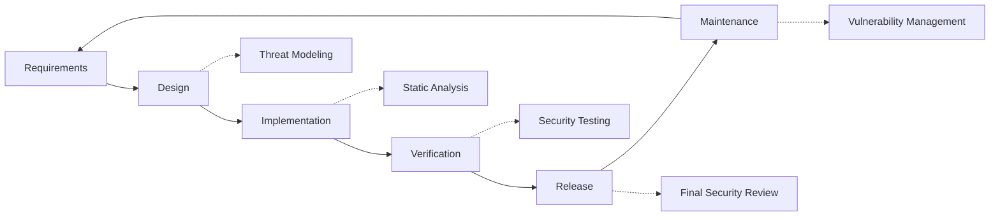

# Sikkerhedspraksis {#security-practices}

## Indholdsfortegnelse {#table-of-contents}

* [Forord](#foreword)
* [Infrastruktursikkerhed](#infrastructure-security)
  * [Sikre datacentre](#secure-data-centers)
  * [Netværkssikkerhed](#network-security)
* [Emailsikkerhed](#email-security)
  * [Kryptering](#encryption)
  * [Autentificering og autorisation](#authentication-and-authorization)
  * [Anti-misbrugsforanstaltninger](#anti-abuse-measures)
* [Databeskyttelse](#data-protection)
  * [Dataminimering](#data-minimization)
  * [Backup og gendannelse](#backup-and-recovery)
* [Tjenesteudbydere](#service-providers)
* [Overholdelse og revision](#compliance-and-auditing)
  * [Regelmæssige sikkerhedsvurderinger](#regular-security-assessments)
  * [Overholdelse](#compliance)
* [Hændelsesrespons](#incident-response)
* [Sikkerhedsudviklingslivscyklus](#security-development-lifecycle)
* [Serverhærde](#server-hardening)
* [Service Level Agreement](#service-level-agreement)
* [Open Source-sikkerhed](#open-source-security)
* [Medarbejdersikkerhed](#employee-security)
* [Kontinuerlig forbedring](#continuous-improvement)
* [Yderligere ressourcer](#additional-resources)

## Forord {#foreword}

Hos Forward Email er sikkerhed vores højeste prioritet. Vi har implementeret omfattende sikkerhedsforanstaltninger for at beskytte dine emailkommunikationer og personlige data. Dette dokument skitserer vores sikkerhedspraksis og de skridt, vi tager for at sikre fortrolighed, integritet og tilgængelighed af dine emails.

## Infrastruktursikkerhed {#infrastructure-security}

### Sikre datacentre {#secure-data-centers}

Vores infrastruktur er hostet i SOC 2-kompatible datacentre med:

* 24/7 fysisk sikkerhed og overvågning
* Biometriske adgangskontroller
* Redundante strømsystemer
* Avanceret branddetektion og -slukning
* Miljøovervågning

### Netværkssikkerhed {#network-security}

Vi implementerer flere lag af netværkssikkerhed:

* Enterprise-grade firewalls med strenge adgangskontrolister
* DDoS-beskyttelse og afbødning
* Regelmæssig scanning for netværkssårbarheder
* Intrusion detection og prevention systemer
* Trafikkryptering mellem alle serviceendepunkter
* Portscanningsbeskyttelse med automatisk blokering af mistænkelig aktivitet

> \[!IMPORTANT]
> Al data under overførsel er krypteret ved brug af TLS 1.2+ med moderne cipher suites.

## Emailsikkerhed {#email-security}

### Kryptering {#encryption}

* **Transport Layer Security (TLS)**: Al emailtrafik krypteres under overførsel ved brug af TLS 1.2 eller højere
* **End-to-End Kryptering**: Understøttelse af OpenPGP/MIME og S/MIME standarder
* **Lagringskryptering**: Alle lagrede emails er krypteret i hvile ved brug af ChaCha20-Poly1305 kryptering i SQLite-filer
* **Fuld diskkryptering**: LUKS v2 kryptering for hele disken
* **Omfattende beskyttelse**: Vi implementerer kryptering i hvile, kryptering i hukommelsen og kryptering under overførsel

> \[!NOTE]
> Vi er verdens første og eneste emailtjeneste, der bruger **[kvante-resistente og individuelt krypterede SQLite-mailbokse](https://forwardemail.net/en/blog/docs/best-quantum-safe-encrypted-email-service)**.

### Autentificering og autorisation {#authentication-and-authorization}

* **DKIM-signering**: Alle udgående emails signeres med DKIM
* **SPF og DMARC**: Fuld understøttelse af SPF og DMARC for at forhindre emailforfalskning
* **MTA-STS**: Understøttelse af MTA-STS for at håndhæve TLS-kryptering
* **Multi-faktor autentificering**: Tilgængelig for al kontoadgang

### Anti-misbrugsforanstaltninger {#anti-abuse-measures}

* **Spamfiltrering**: Flerlaget spamdetektion med maskinlæring
* **Virus-scanning**: Realtidsscanning af alle vedhæftede filer
* **Ratebegrænsning**: Beskyttelse mod brute force- og opregningsangreb
* **IP-rygteovervågning**: Overvågning af afsendende IP's omdømme
* **Indholdsfiltrering**: Detektion af ondsindede URL'er og phishingforsøg

## Databeskyttelse {#data-protection}

### Dataminimering {#data-minimization}

Vi følger princippet om dataminimering:

* Vi indsamler kun de data, der er nødvendige for at levere vores service
* Emailindhold behandles i hukommelsen og gemmes ikke permanent, medmindre det er nødvendigt for IMAP/POP3-levering
* Logs anonymiseres og opbevares kun så længe det er nødvendigt
### Backup og Gendannelse {#backup-and-recovery}

* Automatiserede daglige backups med kryptering
* Geografisk distribueret backup-lagring
* Regelmæssig test af backup-gendannelse
* Katastrofeberedskabsprocedurer med definerede RPO og RTO

## Tjenesteudbydere {#service-providers}

Vi vælger omhyggeligt vores tjenesteudbydere for at sikre, at de opfylder vores høje sikkerhedsstandarder. Nedenfor er de udbydere, vi bruger til international dataoverførsel, samt deres GDPR-overholdelsesstatus:

| Udbyder                                      | Formål                     | DPF Certificeret | GDPR Overholdelsesside                                                                                  |
| --------------------------------------------- | -------------------------- | --------------- | ------------------------------------------------------------------------------------------------------- |
| [Cloudflare](https://www.cloudflare.com)      | CDN, DDoS-beskyttelse, DNS | ✅ Ja            | [Cloudflare GDPR](https://www.cloudflare.com/trust-hub/gdpr/)                                           |
| [DataPacket](https://www.datapacket.com)      | Serverinfrastruktur         | ❌ Nej           | [DataPacket Privacy](https://www.datapacket.com/privacy-policy)                                         |
| [Digital Ocean](https://www.digitalocean.com) | Cloud-infrastruktur         | ❌ Nej           | [DigitalOcean GDPR](https://www.digitalocean.com/legal/gdpr)                                            |
| [GitHub](https://github.com)                  | Hosting af kildekode, CI/CD | ✅ Ja            | [GitHub GDPR](https://docs.github.com/en/site-policy/privacy-policies/github-data-protection-agreement) |
| [Vultr](https://www.vultr.com)                | Cloud-infrastruktur         | ❌ Nej           | [Vultr GDPR](https://www.vultr.com/legal/eea-gdpr-privacy/)                                             |
| [Stripe](https://stripe.com)                  | Betalingsbehandling         | ✅ Ja            | [Stripe Privacy Center](https://stripe.com/legal/privacy-center)                                        |
| [PayPal](https://www.paypal.com)              | Betalingsbehandling         | ❌ Nej           | [PayPal Privacy](https://www.paypal.com/uk/legalhub/privacy-full)                                       |

Vi bruger disse udbydere for at sikre pålidelig og sikker servicelevering samtidig med, at vi overholder internationale databeskyttelsesregler. Alle dataoverførsler udføres med passende sikkerhedsforanstaltninger for at beskytte dine personlige oplysninger.

## Overholdelse og Revision {#compliance-and-auditing}

### Regelmæssige Sikkerhedsvurderinger {#regular-security-assessments}

Vores team overvåger, gennemgår og vurderer regelmæssigt kodebasen, servere, infrastruktur og praksis. Vi implementerer et omfattende sikkerhedsprogram, der inkluderer:

* Regelmæssig rotation af SSH-nøgler
* Kontinuerlig overvågning af adgangslogfiler
* Automatiseret sikkerhedsscanning
* Proaktiv sårbarhedshåndtering
* Regelmæssig sikkerhedstræning for alle teammedlemmer

### Overholdelse {#compliance}

* [GDPR](https://forwardemail.net/gdpr) overholdende datahåndteringspraksis
* [Databehandleraftale (DPA)](https://forwardemail.net/dpa) tilgængelig for erhvervskunder
* CCPA-kompatible privatlivskontroller
* SOC 2 Type II reviderede processer

## Hændelsesrespons {#incident-response}

Vores sikkerhedshændelsesresponsplan inkluderer:

1. **Opdagelse**: Automatiserede overvågnings- og alarmsystemer
2. **Inddæmning**: Øjeblikkelig isolering af berørte systemer
3. **Udryddelse**: Fjernelse af truslen og analyse af rodårsag
4. **Gendannelse**: Sikker genoprettelse af tjenester
5. **Underretning**: Rettidig kommunikation med berørte brugere
6. **Analyse efter hændelse**: Omfattende gennemgang og forbedring

> \[!WARNING]
> Hvis du opdager en sikkerhedssårbarhed, bedes du straks rapportere det til <security@forwardemail.net>.

## Sikkerhedsudviklingslivscyklus {#security-development-lifecycle}

```mermaid
flowchart LR
    A[Requirements] --> B[Design]
    B --> C[Implementation]
    C --> D[Verification]
    D --> E[Release]
    E --> F[Maintenance]
    F --> A
    B -.-> G[Threat Modeling]
    C -.-> H[Static Analysis]
    D -.-> I[Security Testing]
    E -.-> J[Final Security Review]
    F -.-> K[Vulnerability Management]
```
Al kode gennemgår:

* Indsamling af sikkerhedskrav
* Trusselsmodellering under design
* Sikker kodningspraksis
* Statisk og dynamisk applikationssikkerhedstest
* Kodegennemgang med fokus på sikkerhed
* Scanning for sårbarheder i afhængigheder

## Serverhærde {#server-hardening}

Vores [Ansible-konfiguration](https://github.com/forwardemail/forwardemail.net/tree/master/ansible) implementerer adskillige serverhærdeforanstaltninger:

* **USB-adgang deaktiveret**: Fysiske porte er deaktiveret ved at blacklist'e usb-storage kernel-modulet
* **Firewall-regler**: Strenge iptables-regler, der kun tillader nødvendige forbindelser
* **SSH-hærde**: Kun nøglebaseret autentificering, ingen adgang med password, root-login deaktiveret
* **Service-isolering**: Hver service kører med minimale nødvendige privilegier
* **Automatiske opdateringer**: Sikkerhedsrettelser anvendes automatisk
* **Sikker opstart**: Verificeret opstartsproces for at forhindre manipulation
* **Kernel-hærde**: Sikre kernel-parametre og sysctl-konfigurationer
* **Filsystembegrænsninger**: noexec, nosuid og nodev mount-muligheder hvor passende
* **Core dumps deaktiveret**: System konfigureret til at forhindre core dumps af sikkerhedshensyn
* **Swap deaktiveret**: Swap-hukommelse deaktiveret for at forhindre datalækage
* **Beskyttelse mod portscanning**: Automatisk detektion og blokering af portscanningsforsøg
* **Transparent Huge Pages deaktiveret**: THP deaktiveret for forbedret ydeevne og sikkerhed
* **Systemservice-hærde**: Ikke-essentielle services som Apport deaktiveret
* **Brugeradministration**: Mindste privilegium-princippet med separate deploy- og devops-brugere
* **Filbeskrivergrænser**: Forøgede grænser for bedre ydeevne og sikkerhed

## Service Level Agreement {#service-level-agreement}

Vi opretholder et højt niveau af service tilgængelighed og pålidelighed. Vores infrastruktur er designet til redundans og fejltolerance for at sikre, at din e-mailservice forbliver operationel. Selvom vi ikke offentliggør et formelt SLA-dokument, er vi forpligtede til:

* 99,9%+ oppetid for alle services
* Hurtig respons på serviceafbrydelser
* Transparent kommunikation under hændelser
* Regelmæssig vedligeholdelse i perioder med lav trafik

## Open Source Sikkerhed {#open-source-security}

Som en [open-source service](https://github.com/forwardemail/forwardemail.net) drager vores sikkerhed fordel af:

* Transparent kode, der kan revideres af alle
* Fællesskabsdrevne sikkerhedsforbedringer
* Hurtig identifikation og patching af sårbarheder
* Ingen sikkerhed gennem uklarhed

## Medarbejdersikkerhed {#employee-security}

* Baggrundstjek for alle medarbejdere
* Sikkerhedsbevidsthedstræning
* Mindste privilegium-adgang
* Regelmæssig sikkerhedsuddannelse

## Kontinuerlig Forbedring {#continuous-improvement}

Vi forbedrer løbende vores sikkerhedsholdning gennem:

* Overvågning af sikkerhedstendenser og nye trusler
* Regelmæssig gennemgang og opdatering af sikkerhedspolitikker
* Feedback fra sikkerhedsforskere og brugere
* Deltagelse i sikkerhedsfællesskabet

For mere information om vores sikkerhedspraksis eller for at rapportere sikkerhedsproblemer, kontakt venligst <security@forwardemail.net>.

## Yderligere Ressourcer {#additional-resources}

* [Privatlivspolitik](https://forwardemail.net/en/privacy)
* [Servicevilkår](https://forwardemail.net/en/terms)
* [GDPR-overholdelse](https://forwardemail.net/gdpr)
* [Databehandleraftale (DPA)](https://forwardemail.net/dpa)
* [Rapporter Misbrug](https://forwardemail.net/en/report-abuse)
* [Sikkerhedspolitik](https://github.com/forwardemail/.github/blob/main/SECURITY.md)
* [Security.txt](https://forwardemail.net/security.txt)
* [GitHub Repository](https://github.com/forwardemail/forwardemail.net)
* [FAQ](https://forwardemail.net/en/faq)
