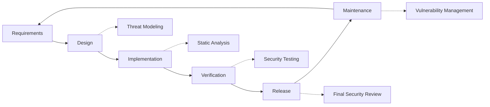

# Sicherheitspraktiken {#security-practices}

## Inhaltsverzeichnis {#table-of-contents}

* [Vorwort](#foreword)
* [Infrastruktursicherheit](#infrastructure-security)
  * [Sichere Rechenzentren](#secure-data-centers)
  * [Netzwerksicherheit](#network-security)
* [E-Mail-Sicherheit](#email-security)
  * [Verschlüsselung](#encryption)
  * [Authentifizierung und Autorisierung](#authentication-and-authorization)
  * [Maßnahmen zur Missbrauchsbekämpfung](#anti-abuse-measures)
* [Datenschutz](#data-protection)
  * [Datenminimierung](#data-minimization)
  * [Sicherung und Wiederherstellung](#backup-and-recovery)
* [Dienstanbieter](#service-providers)
* [Compliance und Auditing](#compliance-and-auditing)
  * [Regelmäßige Sicherheitsbewertungen](#regular-security-assessments)
  * [Einhaltung](#compliance)
* [Reaktion auf Vorfälle](#incident-response)
* [Sicherheitsentwicklungslebenszyklus](#security-development-lifecycle)
* [Serverhärtung](#server-hardening)
* [Service-Level-Agreement](#service-level-agreement)
* [Open Source-Sicherheit](#open-source-security)
* [Mitarbeitersicherheit](#employee-security)
* [Kontinuierliche Verbesserung](#continuous-improvement)
* [Weitere Ressourcen](#additional-resources)

## Vorwort {#foreword}

Bei Forward Email hat Sicherheit oberste Priorität. Wir haben umfassende Sicherheitsmaßnahmen zum Schutz Ihrer E-Mail-Kommunikation und Ihrer persönlichen Daten implementiert. Dieses Dokument beschreibt unsere Sicherheitspraktiken und die Maßnahmen, die wir ergreifen, um die Vertraulichkeit, Integrität und Verfügbarkeit Ihrer E-Mails zu gewährleisten.

## Infrastruktursicherheit {#infrastructure-security}

### Sichere Rechenzentren {#secure-data-centers}

Unsere Infrastruktur wird in SOC 2-konformen Rechenzentren gehostet mit:

* Physische Sicherheit und Überwachung rund um die Uhr
* Biometrische Zugangskontrollen
* Redundante Stromversorgung
* Fortschrittliche Branderkennung und -bekämpfung
* Umgebungsüberwachung

### Netzwerksicherheit {#network-security}

Wir implementieren mehrere Ebenen der Netzwerksicherheit:

* Enterprise-Firewalls mit strengen Zugriffskontrolllisten
* DDoS-Schutz und -Minderung
* Regelmäßige Netzwerk-Schwachstellen-Scans
* Systeme zur Erkennung und Abwehr von Angriffen
* Verschlüsselung des Datenverkehrs zwischen allen Dienstendpunkten
* Port-Scan-Schutz mit automatischer Blockierung verdächtiger Aktivitäten

> \[!IMPORTANT]
> Alle übertragenen Daten werden mit TLS 1.2+ und modernen Verschlüsselungspaketen verschlüsselt.

## E-Mail-Sicherheit {#email-security}

### Verschlüsselung {#encryption}

* **Transport Layer Security (TLS)**: Der gesamte E-Mail-Verkehr wird während der Übertragung mit TLS 1.2 oder höher verschlüsselt.
* **Ende-zu-Ende-Verschlüsselung**: Unterstützung der Standards OpenPGP/MIME und S/MIME.
* **Speicherverschlüsselung**: Alle gespeicherten E-Mails werden im Ruhezustand mit ChaCha20-Poly1305-Verschlüsselung in SQLite-Dateien verschlüsselt.
* **Vollständige Festplattenverschlüsselung**: LUKS v2-Verschlüsselung für die gesamte Festplatte.
* **Umfassender Schutz**: Wir implementieren Verschlüsselung im Ruhezustand, Verschlüsselung im Speicher und Verschlüsselung während der Übertragung.

> \[!NOTE]
> Wir sind der weltweit erste und einzige E-Mail-Dienst, der **[quantenresistente und individuell verschlüsselte SQLite-Postfächer](https://forwardemail.net/en/blog/docs/best-quantum-safe-encrypted-email-service)** verwendet.

### Authentifizierung und Autorisierung {#authentication-and-authorization}

* **DKIM-Signierung**: Alle ausgehenden E-Mails werden mit DKIM signiert.
* **SPF und DMARC**: Vollständige Unterstützung von SPF und DMARC zur Verhinderung von E-Mail-Spoofing.
* **MTA-STS**: Unterstützung von MTA-STS zur Durchsetzung der TLS-Verschlüsselung.
* **Multi-Faktor-Authentifizierung**: Verfügbar für alle Kontozugriffe.

### Maßnahmen gegen Missbrauch {#anti-abuse-measures}

* **Spamfilterung**: Mehrschichtige Spam-Erkennung mit maschinellem Lernen
* **Virenscan**: Echtzeit-Scan aller Anhänge
* **Ratenbegrenzung**: Schutz vor Brute-Force- und Enumeration-Angriffen
* **IP-Reputation**: Überwachung der IP-Reputation des Absenders
* **Inhaltsfilterung**: Erkennung schädlicher URLs und Phishing-Versuche

## Datenschutz {#data-protection}

### Datenminimierung {#data-minimization}

Wir befolgen den Grundsatz der Datenminimierung:

* Wir erheben nur die für die Bereitstellung unseres Dienstes erforderlichen Daten.
* E-Mail-Inhalte werden im Speicher verarbeitet und nicht dauerhaft gespeichert, es sei denn, sie werden für die IMAP-/POP3-Zustellung benötigt.
* Protokolle werden anonymisiert und nur so lange wie nötig gespeichert.

### Sicherung und Wiederherstellung {#backup-and-recovery}

* Automatisierte tägliche Backups mit Verschlüsselung
* Geografisch verteilter Backup-Speicher
* Regelmäßige Tests zur Backup-Wiederherstellung
* Disaster-Recovery-Verfahren mit definierten RPOs und RTOs

## Dienstanbieter {#service-providers}

Wir wählen unsere Dienstleister sorgfältig aus, um sicherzustellen, dass sie unseren hohen Sicherheitsstandards entsprechen. Nachfolgend finden Sie die Anbieter, die wir für den internationalen Datentransfer nutzen, und ihren DSGVO-Konformitätsstatus:

| Anbieter | Zweck | DPF-zertifiziert | DSGVO-Konformitätsseite |
| --------------------------------------------- | ------------------------- | ------------- | ----------------------------------------------------------------- |
| [Cloudflare](https://www.cloudflare.com) | CDN, DDoS-Schutz, DNS | ✅ Ja | [Cloudflare GDPR](https://www.cloudflare.com/trust-hub/gdpr/) |
| [DataPacket](https://www.datapacket.com) | Server-Infrastruktur | ❌ Nein | [DataPacket Privacy](https://www.datapacket.com/privacy-policy) |
| [Digital Ocean](https://www.digitalocean.com) | Cloud-Infrastruktur | ❌ Nein | [DigitalOcean GDPR](https://www.digitalocean.com/legal/gdpr) |
| [Vultr](https://www.vultr.com) | Cloud-Infrastruktur | ❌ Nein | [Vultr GDPR](https://www.vultr.com/legal/eea-gdpr-privacy/) |
| [Stripe](https://stripe.com) | Zahlungsabwicklung | ✅ Ja | [Stripe Privacy Center](https://stripe.com/legal/privacy-center) |
| [PayPal](https://www.paypal.com) | Zahlungsabwicklung | ❌ Nein | [PayPal Privacy](https://www.paypal.com/uk/legalhub/privacy-full) |

Wir nutzen diese Anbieter, um eine zuverlässige und sichere Servicebereitstellung unter Einhaltung internationaler Datenschutzbestimmungen zu gewährleisten. Alle Datenübertragungen erfolgen unter Einhaltung angemessener Sicherheitsvorkehrungen zum Schutz Ihrer personenbezogenen Daten.

## Compliance und Auditing {#compliance-and-auditing}

### Regelmäßige Sicherheitsbewertungen {#regular-security-assessments}

Unser Team überwacht, überprüft und bewertet regelmäßig Codebasis, Server, Infrastruktur und Praktiken. Wir implementieren ein umfassendes Sicherheitsprogramm, das Folgendes umfasst:

* Regelmäßige Rotation der SSH-Schlüssel
* Kontinuierliche Überwachung der Zugriffsprotokolle
* Automatisierte Sicherheitsscans
* Proaktives Schwachstellenmanagement
* Regelmäßige Sicherheitsschulungen für alle Teammitglieder

### Konformität {#compliance}

* [GDPR](https://forwardemail.net/gdpr)-konforme Datenverarbeitungspraktiken
* [Datenverarbeitungsvereinbarung (DPA)](https://forwardemail.net/dpa) für Geschäftskunden verfügbar
* CCPA-konforme Datenschutzkontrollen
* SOC 2 Typ II-geprüfte Prozesse

## Vorfallreaktion {#incident-response}

Unser Reaktionsplan für Sicherheitsvorfälle umfasst:

1. **Erkennung**: Automatisierte Überwachungs- und Warnsysteme
2. **Eindämmung**: Sofortige Isolierung betroffener Systeme
3. **Beseitigung**: Beseitigung der Bedrohung und Ursachenanalyse
4. **Wiederherstellung**: Sichere Wiederherstellung der Dienste
5. **Benachrichtigung**: Zeitnahe Kommunikation mit betroffenen Nutzern
6. **Analyse nach dem Vorfall**: Umfassende Überprüfung und Verbesserung

> \[!WARNING]
> Sollten Sie eine Sicherheitslücke entdecken, melden Sie diese bitte umgehend an <security@forwardemail.net>.

## Sicherheitsentwicklungslebenszyklus {#security-development-lifecycle}

Der gesamte Code wird folgenden Vorgängen unterzogen:

* Erfassung von Sicherheitsanforderungen
* Bedrohungsmodellierung während der Entwicklung
* Sichere Programmierpraktiken
* Statische und dynamische Tests der Anwendungssicherheit
* Codeüberprüfung mit Sicherheitsfokus
* Überprüfung von Abhängigkeitsschwachstellen

## Serverhärtung {#server-hardening}

Unser [Ansible-Konfiguration](https://github.com/forwardemail/forwardemail.net/tree/master/ansible) implementiert zahlreiche Maßnahmen zur Serverhärtung:

* **USB-Zugriff deaktiviert**: Physische Ports werden durch Blacklisting des Kernelmoduls „usb-storage“ deaktiviert.
* **Firewall-Regeln**: Strenge iptables-Regeln erlauben nur notwendige Verbindungen.
* **SSH-Härtung**: Nur schlüsselbasierte Authentifizierung, keine Passwortanmeldung, Root-Anmeldung deaktiviert.
* **Dienstisolierung**: Jeder Dienst läuft mit den erforderlichen Mindestberechtigungen.
* **Automatische Updates**: Sicherheitspatches werden automatisch eingespielt.
* **Sicherer Start**: Verifizierter Startvorgang zum Schutz vor Manipulationen.
* **Kernel-Härtung**: Sichere Kernel-Parameter und Sysctl-Konfigurationen.
* **Dateisystembeschränkungen**: Mount-Optionen „noexec“, „nosuid“ und „nodev“, sofern zutreffend.
* **Core Dumps deaktiviert**: Das System ist so konfiguriert, dass Core Dumps aus Sicherheitsgründen verhindert werden.
* **Auslagerung deaktiviert**: Auslagerungsspeicher deaktiviert, um Datenlecks zu vermeiden.
* **Port-Scan-Schutz**: Automatische Erkennung und Blockierung von Port-Scan-Versuchen.
* **Transparent Huge Pages deaktiviert**: THP deaktiviert für verbesserte Leistung und Sicherheit.
* **Systemdienst Härtung**: Nicht unbedingt erforderliche Dienste wie Apport deaktiviert.
* **Benutzerverwaltung**: Prinzip der geringsten Rechte mit separaten Deployment- und DevOps-Benutzern.
* **Dateideskriptor-Limits**: Erhöhte Limits für bessere Leistung und Sicherheit.

## Service-Level-Vereinbarung {#service-level-agreement}

Wir gewährleisten eine hohe Serviceverfügbarkeit und Zuverlässigkeit. Unsere Infrastruktur ist auf Redundanz und Fehlertoleranz ausgelegt, um die Betriebsbereitschaft Ihres E-Mail-Dienstes sicherzustellen. Obwohl wir kein formelles SLA-Dokument veröffentlichen, verpflichten wir uns zu Folgendem:

* Über 99,9 % Verfügbarkeit für alle Dienste
* Schnelle Reaktion auf Servicestörungen
* Transparente Kommunikation bei Störungen
* Regelmäßige Wartung in Zeiten mit geringem Datenverkehr

## Open Source-Sicherheit {#open-source-security}

Als [Open-Source-Dienst](https://github.com/forwardemail/forwardemail.net) profitiert unsere Sicherheit von:

* Transparenter Code, der von jedem geprüft werden kann
* Community-getriebene Sicherheitsverbesserungen
* Schnelle Identifizierung und Behebung von Schwachstellen
* Keine Sicherheit durch Unklarheit

## Mitarbeitersicherheit {#employee-security}

* Hintergrundüberprüfungen aller Mitarbeiter
* Schulungen zum Sicherheitsbewusstsein
* Least-Privilege-Prinzip
* Regelmäßige Sicherheitsschulungen

## Kontinuierliche Verbesserung {#continuous-improvement}

Wir verbessern unsere Sicherheitslage kontinuierlich durch:

* Überwachung von Sicherheitstrends und neuen Bedrohungen
* Regelmäßige Überprüfung und Aktualisierung der Sicherheitsrichtlinien
* Feedback von Sicherheitsforschern und -nutzern
* Teilnahme an der Sicherheits-Community

Wenn Sie weitere Informationen zu unseren Sicherheitspraktiken wünschen oder Sicherheitsbedenken melden möchten, wenden Sie sich bitte an <security@forwardemail.net>.

## Zusätzliche Ressourcen {#additional-resources}

* [Datenschutzrichtlinie](https://forwardemail.net/en/privacy)
* [Servicebedingungen](https://forwardemail.net/en/terms)
* [DSGVO-Konformität](https://forwardemail.net/gdpr)
* [Datenverarbeitungsvereinbarung (DPA)](https://forwardemail.net/dpa)
* [Missbrauch melden](https://forwardemail.net/en/report-abuse)
* [Sicherheitsrichtlinie](https://github.com/forwardemail/.github/blob/main/SECURITY.md)
* [Security.txt](https://forwardemail.net/security.txt)
* [GitHub-Repository](https://github.com/forwardemail/forwardemail.net)
* [FAQ](https://forwardemail.net/en/faq)