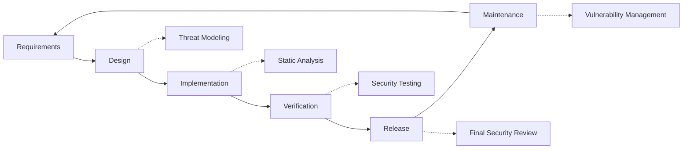

# Sicherheitspraktiken {#security-practices}

## Inhaltsverzeichnis {#table-of-contents}

* [Vorwort](#foreword)
* [Infrastruktursicherheit](#infrastructure-security)
  * [Sichere Rechenzentren](#secure-data-centers)
  * [Netzwerksicherheit](#network-security)
* [E-Mail-Sicherheit](#email-security)
  * [Verschlüsselung](#encryption)
  * [Authentifizierung und Autorisierung](#authentication-and-authorization)
  * [Missbrauchsschutzmaßnahmen](#anti-abuse-measures)
* [Datenschutz](#data-protection)
  * [Datenminimierung](#data-minimization)
  * [Backup und Wiederherstellung](#backup-and-recovery)
* [Dienstleister](#service-providers)
* [Compliance und Auditing](#compliance-and-auditing)
  * [Regelmäßige Sicherheitsbewertungen](#regular-security-assessments)
  * [Compliance](#compliance)
* [Vorfallreaktion](#incident-response)
* [Sicherheitsentwicklungszyklus](#security-development-lifecycle)
* [Server-Härtung](#server-hardening)
* [Service Level Agreement](#service-level-agreement)
* [Open Source Sicherheit](#open-source-security)
* [Mitarbeitersicherheit](#employee-security)
* [Kontinuierliche Verbesserung](#continuous-improvement)
* [Zusätzliche Ressourcen](#additional-resources)

## Vorwort {#foreword}

Bei Forward Email hat Sicherheit oberste Priorität. Wir haben umfassende Sicherheitsmaßnahmen implementiert, um Ihre E-Mail-Kommunikation und persönlichen Daten zu schützen. Dieses Dokument beschreibt unsere Sicherheitspraktiken und die Schritte, die wir unternehmen, um die Vertraulichkeit, Integrität und Verfügbarkeit Ihrer E-Mails zu gewährleisten.

## Infrastruktursicherheit {#infrastructure-security}

### Sichere Rechenzentren {#secure-data-centers}

Unsere Infrastruktur wird in SOC 2-konformen Rechenzentren gehostet mit:

* 24/7 physischer Sicherheit und Überwachung
* Biometrischen Zugangskontrollen
* Redundanten Stromversorgungssystemen
* Fortschrittlicher Branddetektion und -bekämpfung
* Umweltüberwachung

### Netzwerksicherheit {#network-security}

Wir implementieren mehrere Schichten der Netzwerksicherheit:

* Firewalls auf Unternehmensniveau mit strengen Zugriffskontrolllisten
* DDoS-Schutz und -Abmilderung
* Regelmäßige Netzwerkschwachstellen-Scans
* Systeme zur Erkennung und Verhinderung von Eindringversuchen
* Verkehrsverschlüsselung zwischen allen Service-Endpunkten
* Schutz vor Port-Scans mit automatischer Sperrung verdächtiger Aktivitäten

> \[!IMPORTANT]
> Alle Daten während der Übertragung werden mit TLS 1.2+ und modernen Chiffren verschlüsselt.

## E-Mail-Sicherheit {#email-security}

### Verschlüsselung {#encryption}

* **Transport Layer Security (TLS)**: Der gesamte E-Mail-Verkehr wird während der Übertragung mit TLS 1.2 oder höher verschlüsselt
* **Ende-zu-Ende-Verschlüsselung**: Unterstützung der Standards OpenPGP/MIME und S/MIME
* **Speicherverschlüsselung**: Alle gespeicherten E-Mails sind im Ruhezustand mit ChaCha20-Poly1305-Verschlüsselung in SQLite-Dateien verschlüsselt
* **Vollständige Festplattenverschlüsselung**: LUKS v2-Verschlüsselung für die gesamte Festplatte
* **Umfassender Schutz**: Wir implementieren Verschlüsselung im Ruhezustand, im Speicher und während der Übertragung

> \[!NOTE]
> Wir sind der weltweit erste und einzige E-Mail-Dienst, der **[quantensichere und individuell verschlüsselte SQLite-Mailboxen](https://forwardemail.net/en/blog/docs/best-quantum-safe-encrypted-email-service)** verwendet.

### Authentifizierung und Autorisierung {#authentication-and-authorization}

* **DKIM-Signierung**: Alle ausgehenden E-Mails werden mit DKIM signiert
* **SPF und DMARC**: Vollständige Unterstützung von SPF und DMARC zur Verhinderung von E-Mail-Spoofing
* **MTA-STS**: Unterstützung von MTA-STS zur Durchsetzung der TLS-Verschlüsselung
* **Multi-Faktor-Authentifizierung**: Für alle Konto-Zugriffe verfügbar

### Missbrauchsschutzmaßnahmen {#anti-abuse-measures}

* **Spam-Filterung**: Mehrschichtige Spam-Erkennung mit maschinellem Lernen
* **Virenscanning**: Echtzeit-Scan aller Anhänge
* **Ratenbegrenzung**: Schutz vor Brute-Force- und Enumerationsangriffen
* **IP-Reputation**: Überwachung der Reputation der sendenden IP
* **Inhaltsfilterung**: Erkennung von bösartigen URLs und Phishing-Versuchen

## Datenschutz {#data-protection}

### Datenminimierung {#data-minimization}

Wir folgen dem Prinzip der Datenminimierung:

* Wir erfassen nur die Daten, die zur Bereitstellung unseres Dienstes notwendig sind
* E-Mail-Inhalte werden im Speicher verarbeitet und nur dann dauerhaft gespeichert, wenn es für die IMAP/POP3-Zustellung erforderlich ist
* Protokolle werden anonymisiert und nur so lange aufbewahrt, wie es notwendig ist
### Backup und Wiederherstellung {#backup-and-recovery}

* Automatisierte tägliche Backups mit Verschlüsselung
* Geografisch verteilte Backup-Speicherung
* Regelmäßige Tests der Backup-Wiederherstellung
* Notfallwiederherstellungsverfahren mit definiertem RPO und RTO

## Dienstanbieter {#service-providers}

Wir wählen unsere Dienstanbieter sorgfältig aus, um sicherzustellen, dass sie unsere hohen Sicherheitsstandards erfüllen. Nachfolgend sind die Anbieter aufgeführt, die wir für den internationalen Datentransfer nutzen, sowie deren GDPR-Konformitätsstatus:

| Anbieter                                      | Zweck                      | DPF Zertifiziert | GDPR-Konformitätsseite                                                                                  |
| --------------------------------------------- | -------------------------- | --------------- | ------------------------------------------------------------------------------------------------------- |
| [Cloudflare](https://www.cloudflare.com)      | CDN, DDoS-Schutz, DNS      | ✅ Ja            | [Cloudflare GDPR](https://www.cloudflare.com/trust-hub/gdpr/)                                           |
| [DataPacket](https://www.datapacket.com)      | Serverinfrastruktur        | ❌ Nein          | [DataPacket Privacy](https://www.datapacket.com/privacy-policy)                                         |
| [Digital Ocean](https://www.digitalocean.com) | Cloud-Infrastruktur        | ❌ Nein          | [DigitalOcean GDPR](https://www.digitalocean.com/legal/gdpr)                                            |
| [GitHub](https://github.com)                  | Quellcode-Hosting, CI/CD   | ✅ Ja            | [GitHub GDPR](https://docs.github.com/en/site-policy/privacy-policies/github-data-protection-agreement) |
| [Vultr](https://www.vultr.com)                | Cloud-Infrastruktur        | ❌ Nein          | [Vultr GDPR](https://www.vultr.com/legal/eea-gdpr-privacy/)                                             |
| [Stripe](https://stripe.com)                  | Zahlungsabwicklung         | ✅ Ja            | [Stripe Privacy Center](https://stripe.com/legal/privacy-center)                                        |
| [PayPal](https://www.paypal.com)              | Zahlungsabwicklung         | ❌ Nein          | [PayPal Privacy](https://www.paypal.com/uk/legalhub/privacy-full)                                       |

Wir nutzen diese Anbieter, um eine zuverlässige, sichere Servicebereitstellung zu gewährleisten und gleichzeitig die Einhaltung internationaler Datenschutzbestimmungen sicherzustellen. Alle Datenübertragungen erfolgen mit geeigneten Schutzmaßnahmen zum Schutz Ihrer persönlichen Daten.

## Compliance und Prüfung {#compliance-and-auditing}

### Regelmäßige Sicherheitsbewertungen {#regular-security-assessments}

Unser Team überwacht, überprüft und bewertet regelmäßig den Codebestand, die Server, die Infrastruktur und die Praktiken. Wir implementieren ein umfassendes Sicherheitsprogramm, das Folgendes umfasst:

* Regelmäßiger Wechsel der SSH-Schlüssel
* Kontinuierliche Überwachung der Zugriffsprotokolle
* Automatisierte Sicherheitsüberprüfungen
* Proaktives Schwachstellenmanagement
* Regelmäßige Sicherheitsschulungen für alle Teammitglieder

### Compliance {#compliance}

* [GDPR](https://forwardemail.net/gdpr) konforme Datenverarbeitungspraktiken
* [Datenverarbeitungsvertrag (DPA)](https://forwardemail.net/dpa) verfügbar für Geschäftskunden
* CCPA-konforme Datenschutzkontrollen
* SOC 2 Typ II geprüfte Prozesse

## Vorfallreaktion {#incident-response}

Unser Sicherheitsvorfallreaktionsplan umfasst:

1. **Erkennung**: Automatisierte Überwachungs- und Alarmsysteme
2. **Eindämmung**: Sofortige Isolierung betroffener Systeme
3. **Beseitigung**: Entfernung der Bedrohung und Ursachenanalyse
4. **Wiederherstellung**: Sichere Wiederherstellung der Dienste
5. **Benachrichtigung**: Zeitnahe Kommunikation mit betroffenen Nutzern
6. **Nachanalyse**: Umfassende Überprüfung und Verbesserung

> \[!WARNING]
> Wenn Sie eine Sicherheitslücke entdecken, melden Sie diese bitte umgehend an <security@forwardemail.net>.

## Sicherheitsentwicklungszyklus {#security-development-lifecycle}

```mermaid
flowchart LR
    A[Requirements] --> B[Design]
    B --> C[Implementation]
    C --> D[Verification]
    D --> E[Release]
    E --> F[Maintenance]
    F --> A
    B -.-> G[Threat Modeling]
    C -.-> H[Static Analysis]
    D -.-> I[Security Testing]
    E -.-> J[Final Security Review]
    F -.-> K[Vulnerability Management]
```
Aller Code durchläuft:

* Erfassung der Sicherheitsanforderungen
* Bedrohungsmodellierung während der Planung
* Sichere Programmierpraktiken
* Statische und dynamische Anwendungssicherheitstests
* Code-Review mit Sicherheitsfokus
* Scannen von Abhängigkeits-Schwachstellen

## Server-Härtung {#server-hardening}

Unsere [Ansible-Konfiguration](https://github.com/forwardemail/forwardemail.net/tree/master/ansible) implementiert zahlreiche Maßnahmen zur Server-Härtung:

* **USB-Zugriff deaktiviert**: Physische Ports sind durch Blacklisting des usb-storage Kernel-Moduls deaktiviert
* **Firewall-Regeln**: Strenge iptables-Regeln, die nur notwendige Verbindungen erlauben
* **SSH-Härtung**: Nur schlüsselbasierte Authentifizierung, kein Passwort-Login, Root-Login deaktiviert
* **Dienst-Isolierung**: Jeder Dienst läuft mit minimal erforderlichen Rechten
* **Automatische Updates**: Sicherheitspatches werden automatisch angewendet
* **Secure Boot**: Verifizierter Boot-Prozess zur Verhinderung von Manipulationen
* **Kernel-Härtung**: Sichere Kernel-Parameter und sysctl-Konfigurationen
* **Dateisystem-Beschränkungen**: noexec, nosuid und nodev Mount-Optionen wo angebracht
* **Core Dumps deaktiviert**: System so konfiguriert, dass Core Dumps aus Sicherheitsgründen verhindert werden
* **Swap deaktiviert**: Swap-Speicher deaktiviert, um Datenlecks zu verhindern
* **Port-Scan-Schutz**: Automatische Erkennung und Blockierung von Port-Scan-Versuchen
* **Transparent Huge Pages deaktiviert**: THP deaktiviert für bessere Leistung und Sicherheit
* **Systemdienst-Härtung**: Nicht essentielle Dienste wie Apport deaktiviert
* **Benutzerverwaltung**: Prinzip der geringsten Rechte mit separaten Deploy- und DevOps-Benutzern
* **Dateideskriptor-Limits**: Erhöhte Limits für bessere Leistung und Sicherheit

## Service Level Agreement {#service-level-agreement}

Wir gewährleisten ein hohes Maß an Verfügbarkeit und Zuverlässigkeit der Dienste. Unsere Infrastruktur ist für Redundanz und Fehlertoleranz ausgelegt, um sicherzustellen, dass Ihr E-Mail-Dienst betriebsbereit bleibt. Obwohl wir kein formelles SLA-Dokument veröffentlichen, verpflichten wir uns zu:

* 99,9 %+ Betriebszeit für alle Dienste
* Schnelle Reaktion auf Dienstunterbrechungen
* Transparente Kommunikation während Vorfällen
* Regelmäßige Wartung in verkehrsarmen Zeiten

## Open Source Sicherheit {#open-source-security}

Als [Open-Source-Dienst](https://github.com/forwardemail/forwardemail.net) profitiert unsere Sicherheit von:

* Transparentem Code, der von jedem geprüft werden kann
* Community-getriebenen Sicherheitsverbesserungen
* Schneller Identifikation und Behebung von Schwachstellen
* Kein Sicherheit durch Verschleierung

## Mitarbeitersicherheit {#employee-security}

* Hintergrundüberprüfungen für alle Mitarbeiter
* Schulungen zur Sicherheitsbewusstseinsbildung
* Prinzip der geringsten Rechte beim Zugriff
* Regelmäßige Sicherheitsschulungen

## Kontinuierliche Verbesserung {#continuous-improvement}

Wir verbessern kontinuierlich unsere Sicherheitslage durch:

* Überwachung von Sicherheitstrends und neuen Bedrohungen
* Regelmäßige Überprüfung und Aktualisierung der Sicherheitsrichtlinien
* Feedback von Sicherheitsforschern und Nutzern
* Teilnahme an der Sicherheits-Community

Für weitere Informationen zu unseren Sicherheitspraktiken oder um Sicherheitsbedenken zu melden, kontaktieren Sie bitte <security@forwardemail.net>.

## Zusätzliche Ressourcen {#additional-resources}

* [Datenschutzerklärung](https://forwardemail.net/en/privacy)
* [Nutzungsbedingungen](https://forwardemail.net/en/terms)
* [DSGVO-Konformität](https://forwardemail.net/gdpr)
* [Datenverarbeitungsvereinbarung (DPA)](https://forwardemail.net/dpa)
* [Missbrauch melden](https://forwardemail.net/en/report-abuse)
* [Sicherheitsrichtlinie](https://github.com/forwardemail/.github/blob/main/SECURITY.md)
* [Security.txt](https://forwardemail.net/security.txt)
* [GitHub Repository](https://github.com/forwardemail/forwardemail.net)
* [FAQ](https://forwardemail.net/en/faq)
