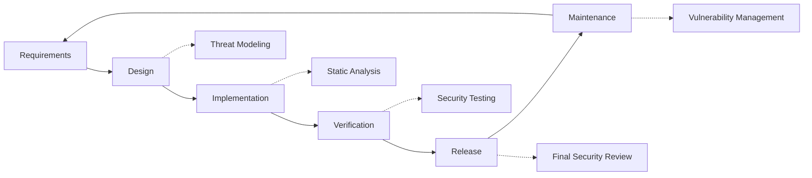

# Prácticas de seguridad {#security-practices}

## Tabla de contenido {#table-of-contents}

* [Prefacio](#foreword)
* [Seguridad de la infraestructura](#infrastructure-security)
  * [Centros de datos seguros](#secure-data-centers)
  * [Seguridad de la red](#network-security)
* [Seguridad del correo electrónico](#email-security)
  * [Cifrado](#encryption)
  * [Autenticación y autorización](#authentication-and-authorization)
  * [Medidas contra el abuso](#anti-abuse-measures)
* [Protección de datos](#data-protection)
  * [Minimización de datos](#data-minimization)
  * [Copia de seguridad y recuperación](#backup-and-recovery)
* [Proveedores de servicios](#service-providers)
* [Cumplimiento y Auditoría](#compliance-and-auditing)
  * [Evaluaciones de seguridad periódicas](#regular-security-assessments)
  * [Cumplimiento](#compliance)
* [Respuesta a incidentes](#incident-response)
* [Ciclo de vida del desarrollo de seguridad](#security-development-lifecycle)
* [Fortalecimiento del servidor](#server-hardening)
* [Acuerdo de Nivel de Servicio](#service-level-agreement)
* [Seguridad de código abierto](#open-source-security)
* [Seguridad de los empleados](#employee-security)
* [Mejora continua](#continuous-improvement)
* [Recursos adicionales](#additional-resources)

## Prólogo {#foreword}

En Forward Email, la seguridad es nuestra máxima prioridad. Hemos implementado medidas de seguridad integrales para proteger sus comunicaciones por correo electrónico y sus datos personales. Este documento describe nuestras prácticas de seguridad y las medidas que tomamos para garantizar la confidencialidad, integridad y disponibilidad de su correo electrónico.

## Seguridad de la infraestructura {#infrastructure-security}

### Centros de datos seguros {#secure-data-centers}

Nuestra infraestructura está alojada en centros de datos compatibles con SOC 2 con:

* Seguridad física y vigilancia 24/7
* Controles de acceso biométricos
* Sistemas de energía redundantes
* Detección y extinción avanzada de incendios
* Monitoreo ambiental

### Seguridad de red {#network-security}

Implementamos múltiples capas de seguridad de red:

* Cortafuegos de nivel empresarial con estrictas listas de control de acceso
* Protección y mitigación contra DDoS
* Análisis periódico de vulnerabilidades de red
* Sistemas de detección y prevención de intrusiones
* Cifrado de tráfico entre todos los puntos finales del servicio
* Protección mediante escaneo de puertos con bloqueo automático de actividades sospechosas

> \[!IMPORTANT]
> Todos los datos en tránsito están cifrados mediante TLS 1.2+ con conjuntos de cifrado modernos.

## Seguridad del correo electrónico {#email-security}

### Cifrado {#encryption}

* **Seguridad de la capa de transporte (TLS)**: Todo el tráfico de correo electrónico se cifra en tránsito mediante TLS 1.2 o superior.
* **Cifrado de extremo a extremo**: Compatibilidad con los estándares OpenPGP/MIME y S/MIME.
* **Cifrado de almacenamiento**: Todos los correos electrónicos almacenados se cifran en reposo mediante el cifrado ChaCha20-Poly1305 en archivos SQLite.
* **Cifrado de disco completo**: Cifrado LUKS v2 para todo el disco.
* **Protección integral**: Implementamos cifrado en reposo, cifrado en memoria y cifrado en tránsito.

> \[!NOTE]
> Somos el primer y único servicio de correo electrónico del mundo que utiliza **[Buzones SQLite resistentes a los ataques cuánticos y cifrados individualmente](https://forwardemail.net/en/blog/docs/best-quantum-safe-encrypted-email-service)**.

### Autenticación y autorización {#authentication-and-authorization}

* **Firma DKIM**: Todos los correos electrónicos salientes se firman con DKIM
* **SPF y DMARC**: Compatibilidad total con SPF y DMARC para evitar la suplantación de identidad (spoofing)
* **MTA-STS**: Compatibilidad con MTA-STS para aplicar el cifrado TLS
* **Autenticación multifactor**: Disponible para todos los accesos a la cuenta

### Medidas contra el abuso {#anti-abuse-measures}

* **Filtrado de spam**: Detección de spam multicapa con aprendizaje automático
* **Análisis de virus**: Análisis en tiempo real de todos los archivos adjuntos
* **Límite de velocidad**: Protección contra ataques de fuerza bruta y enumeración
* **Reputación de IP**: Monitoreo de la reputación de IP de envío
* **Filtrado de contenido**: Detección de URL maliciosas e intentos de phishing

## Protección de datos {#data-protection}

### Minimización de datos {#data-minimization}

Seguimos el principio de minimización de datos:

* Solo recopilamos los datos necesarios para prestar nuestro servicio.
* El contenido del correo electrónico se procesa en la memoria y no se almacena de forma persistente, a menos que sea necesario para la entrega IMAP/POP3.
* Los registros se anonimizan y se conservan solo el tiempo necesario.

### Copia de seguridad y recuperación {#backup-and-recovery}

* Copias de seguridad diarias automatizadas con cifrado
* Almacenamiento de copias de seguridad distribuido geográficamente
* Pruebas periódicas de restauración de copias de seguridad
* Procedimientos de recuperación ante desastres con RPO y RTO definidos

## Proveedores de servicios {#service-providers}

Seleccionamos cuidadosamente a nuestros proveedores de servicios para garantizar que cumplan con nuestros altos estándares de seguridad. A continuación, se detallan los proveedores que utilizamos para la transferencia internacional de datos y su grado de cumplimiento del RGPD:

| Proveedor | Objetivo | Certificado DPF | Página de cumplimiento del RGPD |
| --------------------------------------------- | ------------------------- | ------------- | ----------------------------------------------------------------- |
| [Cloudflare](https://www.cloudflare.com) | CDN, protección DDoS, DNS | ✅ Sí | [Cloudflare GDPR](https://www.cloudflare.com/trust-hub/gdpr/) |
| [DataPacket](https://www.datapacket.com) | Infraestructura del servidor | ❌ No | [DataPacket Privacy](https://www.datapacket.com/privacy-policy) |
| [Digital Ocean](https://www.digitalocean.com) | Infraestructura en la nube | ❌ No | [DigitalOcean GDPR](https://www.digitalocean.com/legal/gdpr) |
| [Vultr](https://www.vultr.com) | Infraestructura en la nube | ❌ No | [Vultr GDPR](https://www.vultr.com/legal/eea-gdpr-privacy/) |
| [Stripe](https://stripe.com) | Procesamiento de pagos | ✅ Sí | [Stripe Privacy Center](https://stripe.com/legal/privacy-center) |
| [PayPal](https://www.paypal.com) | Procesamiento de pagos | ❌ No | [PayPal Privacy](https://www.paypal.com/uk/legalhub/privacy-full) |

Utilizamos estos proveedores para garantizar la fiabilidad y seguridad de nuestros servicios, cumpliendo con la normativa internacional de protección de datos. Todas las transferencias de datos se realizan con las medidas de seguridad adecuadas para proteger su información personal.

## Cumplimiento y auditoría {#compliance-and-auditing}

### Evaluaciones de seguridad periódicas {#regular-security-assessments}

Nuestro equipo supervisa, revisa y evalúa periódicamente el código base, los servidores, la infraestructura y las prácticas. Implementamos un programa de seguridad integral que incluye:

* Rotación regular de claves SSH
* Monitoreo continuo de registros de acceso
* Análisis de seguridad automatizado
* Gestión proactiva de vulnerabilidades
* Capacitación regular en seguridad para todos los miembros del equipo

### Cumplimiento {#compliance}

* Prácticas de manejo de datos que cumplen con [GDPR](https://forwardemail.net/gdpr)
* [Acuerdo de procesamiento de datos (APD)](https://forwardemail.net/dpa) disponible para clientes comerciales
* Controles de privacidad que cumplen con la CCPA
* Procesos auditados SOC 2 Tipo II

## Respuesta a incidentes {#incident-response}

Nuestro plan de respuesta a incidentes de seguridad incluye:

1. **Detección**: Sistemas automatizados de monitorización y alerta
2. **Contención**: Aislamiento inmediato de los sistemas afectados
3. **Erradicación**: Eliminación de la amenaza y análisis de la causa raíz
4. **Recuperación**: Restauración segura de los servicios
5. **Notificación**: Comunicación oportuna con los usuarios afectados
6. **Análisis post-incidente**: Revisión y mejora integrales

> \[!WARNING]
> Si descubre una vulnerabilidad de seguridad, infórmelo inmediatamente a <security@forwardemail.net>.

## Ciclo de vida del desarrollo de seguridad {#security-development-lifecycle}

Todo el código pasa por:

* Recopilación de requisitos de seguridad
* Modelado de amenazas durante el diseño
* Prácticas de codificación segura
* Pruebas de seguridad de aplicaciones estáticas y dinámicas
* Revisión de código con enfoque en seguridad
* Análisis de vulnerabilidades de dependencia

## Refuerzo del servidor {#server-hardening}

Nuestro [Configuración de Ansible](https://github.com/forwardemail/forwardemail.net/tree/master/ansible) implementa numerosas medidas de fortalecimiento del servidor:

* **Acceso USB deshabilitado**: Los puertos físicos se deshabilitan mediante la inclusión en la lista negra del módulo de kernel de almacenamiento USB.
* **Reglas de firewall**: Reglas estrictas de iptables que permiten solo las conexiones necesarias.
* **Refuerzo de SSH**: Solo autenticación basada en clave, sin inicio de sesión con contraseña, inicio de sesión root deshabilitado.
* **Aislamiento de servicio**: Cada servicio se ejecuta con los privilegios mínimos requeridos.
* **Actualizaciones automáticas**: Los parches de seguridad se aplican automáticamente.
* **Arranque seguro**: Proceso de arranque verificado para evitar manipulaciones.
* **Refuerzo de kernel**: Parámetros de kernel seguros y configuraciones de sysctl.
* **Restricciones del sistema de archivos**: Opciones de montaje noexec, nosuid y nodev cuando corresponda.
* **Volcados de memoria deshabilitados**: Sistema configurado para evitar volcados de memoria por seguridad.
* **Memoria de intercambio deshabilitada**: Memoria de intercambio deshabilitada para evitar fugas de datos.
* **Protección de escaneo de puertos**: Detección y bloqueo automáticos de intentos de escaneo de puertos.
* **Páginas enormes transparentes deshabilitadas**: THP. Deshabilitado para mejorar el rendimiento y la seguridad.
* **Fortalecimiento de servicios del sistema**: Servicios no esenciales como Apport deshabilitados.
* **Administración de usuarios**: Principio de mínimos privilegios con usuarios de implementación y DevOps separados.
* **Límites de descriptores de archivos**: Límites aumentados para mejorar el rendimiento y la seguridad.

## Acuerdo de nivel de servicio {#service-level-agreement}

Mantenemos un alto nivel de disponibilidad y fiabilidad del servicio. Nuestra infraestructura está diseñada para ofrecer redundancia y tolerancia a fallos, garantizando así la operatividad de su servicio de correo electrónico. Si bien no publicamos un documento formal de Acuerdo de Nivel de Servicio (SLA), nos comprometemos a:

* Tiempo de actividad superior al 99,9 % para todos los servicios
* Respuesta rápida ante interrupciones del servicio
* Comunicación transparente durante incidentes
* Mantenimiento regular durante periodos de poco tráfico

## Seguridad de código abierto {#open-source-security}

Como [servicio de código abierto](https://github.com/forwardemail/forwardemail.net), nuestra seguridad se beneficia de:

* Código transparente que cualquier persona puede auditar
* Mejoras de seguridad impulsadas por la comunidad
* Identificación y corrección rápidas de vulnerabilidades
* Sin seguridad por oscuridad

## Seguridad del empleado {#employee-security}

* Verificación de antecedentes de todos los empleados
* Capacitación en seguridad
* Principio de acceso con privilegios mínimos
* Capacitación regular en seguridad

## Mejora continua {#continuous-improvement}

Mejoramos continuamente nuestra postura de seguridad a través de:

* Monitoreo de tendencias de seguridad y amenazas emergentes
* Revisión y actualización periódica de las políticas de seguridad
* Comentarios de investigadores y usuarios de seguridad
* Participación en la comunidad de seguridad

Para obtener más información sobre nuestras prácticas de seguridad o para informar inquietudes de seguridad, comuníquese con <security@forwardemail.net>.

## Recursos adicionales {#additional-resources}

* [política de privacidad](https://forwardemail.net/en/privacy)
* [Condiciones de servicio](https://forwardemail.net/en/terms)
* [Cumplimiento del RGPD](https://forwardemail.net/gdpr)
* [Acuerdo de procesamiento de datos (APD)](https://forwardemail.net/dpa)
* [Denunciar abuso](https://forwardemail.net/en/report-abuse)
* [Política de seguridad](https://github.com/forwardemail/.github/blob/main/SECURITY.md)
* [Security.txt](https://forwardemail.net/security.txt)
* [Repositorio de GitHub](https://github.com/forwardemail/forwardemail.net)
* [FAQ](https://forwardemail.net/en/faq)