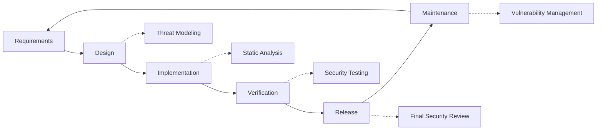

# Prácticas de Seguridad {#security-practices}

## Tabla de Contenidos {#table-of-contents}

* [Prólogo](#foreword)
* [Seguridad de Infraestructura](#infrastructure-security)
  * [Centros de Datos Seguros](#secure-data-centers)
  * [Seguridad de Red](#network-security)
* [Seguridad de Email](#email-security)
  * [Cifrado](#encryption)
  * [Autenticación y Autorización](#authentication-and-authorization)
  * [Medidas Anti-Abuso](#anti-abuse-measures)
* [Protección de Datos](#data-protection)
  * [Minimización de Datos](#data-minimization)
  * [Respaldo y Recuperación](#backup-and-recovery)
* [Proveedores de Servicios](#service-providers)
* [Cumplimiento y Auditoría](#compliance-and-auditing)
  * [Evaluaciones de Seguridad Regulares](#regular-security-assessments)
  * [Cumplimiento](#compliance)
* [Respuesta a Incidentes](#incident-response)
* [Ciclo de Vida del Desarrollo de Seguridad](#security-development-lifecycle)
* [Endurecimiento del Servidor](#server-hardening)
* [Acuerdo de Nivel de Servicio](#service-level-agreement)
* [Seguridad de Código Abierto](#open-source-security)
* [Seguridad del Empleado](#employee-security)
* [Mejora Continua](#continuous-improvement)
* [Recursos Adicionales](#additional-resources)

## Prólogo {#foreword}

En Forward Email, la seguridad es nuestra máxima prioridad. Hemos implementado medidas de seguridad integrales para proteger tus comunicaciones por correo electrónico y datos personales. Este documento describe nuestras prácticas de seguridad y los pasos que tomamos para garantizar la confidencialidad, integridad y disponibilidad de tu correo electrónico.

## Seguridad de Infraestructura {#infrastructure-security}

### Centros de Datos Seguros {#secure-data-centers}

Nuestra infraestructura está alojada en centros de datos que cumplen con SOC 2 y cuentan con:

* Seguridad física y vigilancia 24/7
* Controles de acceso biométricos
* Sistemas de energía redundantes
* Detección y supresión avanzada de incendios
* Monitoreo ambiental

### Seguridad de Red {#network-security}

Implementamos múltiples capas de seguridad de red:

* Cortafuegos de nivel empresarial con listas estrictas de control de acceso
* Protección y mitigación contra DDoS
* Escaneo regular de vulnerabilidades de red
* Sistemas de detección y prevención de intrusiones
* Cifrado del tráfico entre todos los puntos finales del servicio
* Protección contra escaneo de puertos con bloqueo automático de actividad sospechosa

> \[!IMPORTANT]
> Todos los datos en tránsito están cifrados usando TLS 1.2+ con suites de cifrado modernas.

## Seguridad de Email {#email-security}

### Cifrado {#encryption}

* **Transport Layer Security (TLS)**: Todo el tráfico de correo electrónico está cifrado en tránsito usando TLS 1.2 o superior
* **Cifrado de Extremo a Extremo**: Soporte para los estándares OpenPGP/MIME y S/MIME
* **Cifrado en Almacenamiento**: Todos los correos almacenados están cifrados en reposo usando cifrado ChaCha20-Poly1305 en archivos SQLite
* **Cifrado Completo de Disco**: Cifrado LUKS v2 para todo el disco
* **Protección Integral**: Implementamos cifrado en reposo, en memoria y en tránsito

> \[!NOTE]
> Somos el primer y único servicio de correo electrónico en el mundo que utiliza **[buzones SQLite cifrados individualmente y resistentes a la computación cuántica](https://forwardemail.net/en/blog/docs/best-quantum-safe-encrypted-email-service)**.

### Autenticación y Autorización {#authentication-and-authorization}

* **Firma DKIM**: Todos los correos salientes están firmados con DKIM
* **SPF y DMARC**: Soporte completo para SPF y DMARC para prevenir suplantación de correo
* **MTA-STS**: Soporte para MTA-STS para hacer cumplir el cifrado TLS
* **Autenticación Multifactor**: Disponible para todo acceso a cuentas

### Medidas Anti-Abuso {#anti-abuse-measures}

* **Filtrado de Spam**: Detección de spam en múltiples capas con aprendizaje automático
* **Escaneo de Virus**: Escaneo en tiempo real de todos los archivos adjuntos
* **Limitación de Tasa**: Protección contra ataques de fuerza bruta y enumeración
* **Reputación de IP**: Monitoreo de la reputación de IPs de envío
* **Filtrado de Contenido**: Detección de URLs maliciosas e intentos de phishing

## Protección de Datos {#data-protection}

### Minimización de Datos {#data-minimization}

Seguimos el principio de minimización de datos:

* Solo recopilamos los datos necesarios para proveer nuestro servicio
* El contenido del correo se procesa en memoria y no se almacena de forma persistente a menos que sea necesario para la entrega IMAP/POP3
* Los registros se anonimizan y se conservan solo el tiempo necesario
### Copias de Seguridad y Recuperación {#backup-and-recovery}

* Copias de seguridad diarias automatizadas con cifrado
* Almacenamiento de copias de seguridad distribuido geográficamente
* Pruebas regulares de restauración de copias de seguridad
* Procedimientos de recuperación ante desastres con RPO y RTO definidos

## Proveedores de Servicios {#service-providers}

Seleccionamos cuidadosamente a nuestros proveedores de servicios para asegurar que cumplan con nuestros altos estándares de seguridad. A continuación se muestran los proveedores que usamos para la transferencia internacional de datos y su estado de cumplimiento con el GDPR:

| Proveedor                                     | Propósito                  | Certificado DPF | Página de Cumplimiento GDPR                                                                             |
| --------------------------------------------- | -------------------------- | -------------- | ------------------------------------------------------------------------------------------------------- |
| [Cloudflare](https://www.cloudflare.com)      | CDN, protección DDoS, DNS  | ✅ Sí           | [Cloudflare GDPR](https://www.cloudflare.com/trust-hub/gdpr/)                                           |
| [DataPacket](https://www.datapacket.com)      | Infraestructura de servidores | ❌ No          | [DataPacket Privacy](https://www.datapacket.com/privacy-policy)                                         |
| [Digital Ocean](https://www.digitalocean.com) | Infraestructura en la nube | ❌ No           | [DigitalOcean GDPR](https://www.digitalocean.com/legal/gdpr)                                            |
| [GitHub](https://github.com)                  | Hospedaje de código fuente, CI/CD | ✅ Sí       | [GitHub GDPR](https://docs.github.com/en/site-policy/privacy-policies/github-data-protection-agreement) |
| [Vultr](https://www.vultr.com)                | Infraestructura en la nube | ❌ No           | [Vultr GDPR](https://www.vultr.com/legal/eea-gdpr-privacy/)                                             |
| [Stripe](https://stripe.com)                  | Procesamiento de pagos     | ✅ Sí           | [Stripe Privacy Center](https://stripe.com/legal/privacy-center)                                        |
| [PayPal](https://www.paypal.com)              | Procesamiento de pagos     | ❌ No           | [PayPal Privacy](https://www.paypal.com/uk/legalhub/privacy-full)                                       |

Usamos estos proveedores para garantizar una entrega de servicio confiable y segura, manteniendo el cumplimiento con las regulaciones internacionales de protección de datos. Todas las transferencias de datos se realizan con las salvaguardas apropiadas para proteger su información personal.

## Cumplimiento y Auditoría {#compliance-and-auditing}

### Evaluaciones Regulares de Seguridad {#regular-security-assessments}

Nuestro equipo monitorea, revisa y evalúa regularmente la base de código, servidores, infraestructura y prácticas. Implementamos un programa de seguridad integral que incluye:

* Rotación regular de claves SSH
* Monitoreo continuo de registros de acceso
* Escaneo automatizado de seguridad
* Gestión proactiva de vulnerabilidades
* Capacitación regular en seguridad para todos los miembros del equipo

### Cumplimiento {#compliance}

* Prácticas de manejo de datos conformes con el [GDPR](https://forwardemail.net/gdpr)
* Acuerdo de Procesamiento de Datos ([DPA](https://forwardemail.net/dpa)) disponible para clientes empresariales
* Controles de privacidad conformes con CCPA
* Procesos auditados SOC 2 Tipo II

## Respuesta a Incidentes {#incident-response}

Nuestro plan de respuesta a incidentes de seguridad incluye:

1. **Detección**: Sistemas automatizados de monitoreo y alertas
2. **Contención**: Aislamiento inmediato de los sistemas afectados
3. **Erradicación**: Eliminación de la amenaza y análisis de causa raíz
4. **Recuperación**: Restauración segura de los servicios
5. **Notificación**: Comunicación oportuna con los usuarios afectados
6. **Análisis Post-incidente**: Revisión integral y mejora

> \[!WARNING]
> Si descubre una vulnerabilidad de seguridad, por favor repórtela inmediatamente a <security@forwardemail.net>.

## Ciclo de Vida del Desarrollo de Seguridad {#security-development-lifecycle}

```mermaid
flowchart LR
    A[Requirements] --> B[Design]
    B --> C[Implementation]
    C --> D[Verification]
    D --> E[Release]
    E --> F[Maintenance]
    F --> A
    B -.-> G[Threat Modeling]
    C -.-> H[Static Analysis]
    D -.-> I[Security Testing]
    E -.-> J[Final Security Review]
    F -.-> K[Vulnerability Management]
```
Todo el código pasa por:

* Recolección de requisitos de seguridad
* Modelado de amenazas durante el diseño
* Prácticas de codificación segura
* Pruebas de seguridad de aplicaciones estáticas y dinámicas
* Revisión de código con enfoque en seguridad
* Escaneo de vulnerabilidades en dependencias

## Endurecimiento del Servidor {#server-hardening}

Nuestra [configuración de Ansible](https://github.com/forwardemail/forwardemail.net/tree/master/ansible) implementa numerosas medidas de endurecimiento del servidor:

* **Acceso USB Deshabilitado**: Los puertos físicos están deshabilitados mediante la lista negra del módulo del kernel usb-storage
* **Reglas de Firewall**: Reglas estrictas de iptables que permiten solo conexiones necesarias
* **Endurecimiento de SSH**: Autenticación solo con clave, sin inicio de sesión por contraseña, inicio de sesión root deshabilitado
* **Aislamiento de Servicios**: Cada servicio se ejecuta con los privilegios mínimos requeridos
* **Actualizaciones Automáticas**: Los parches de seguridad se aplican automáticamente
* **Arranque Seguro**: Proceso de arranque verificado para prevenir manipulaciones
* **Endurecimiento del Kernel**: Parámetros seguros del kernel y configuraciones sysctl
* **Restricciones del Sistema de Archivos**: opciones de montaje noexec, nosuid y nodev donde corresponda
* **Volcados de Núcleo Deshabilitados**: Sistema configurado para prevenir volcados de núcleo por seguridad
* **Swap Deshabilitado**: Memoria swap deshabilitada para prevenir fugas de datos
* **Protección contra Escaneo de Puertos**: Detección y bloqueo automatizado de intentos de escaneo de puertos
* **Páginas Transparentes Grandes Deshabilitadas**: THP deshabilitado para mejorar rendimiento y seguridad
* **Endurecimiento de Servicios del Sistema**: Servicios no esenciales como Apport deshabilitados
* **Gestión de Usuarios**: Principio de menor privilegio con usuarios separados para deploy y devops
* **Límites de Descriptores de Archivos**: Límites aumentados para mejor rendimiento y seguridad

## Acuerdo de Nivel de Servicio {#service-level-agreement}

Mantenemos un alto nivel de disponibilidad y confiabilidad del servicio. Nuestra infraestructura está diseñada para redundancia y tolerancia a fallos para asegurar que su servicio de correo electrónico permanezca operativo. Aunque no publicamos un documento formal de SLA, estamos comprometidos con:

* 99.9%+ de tiempo activo para todos los servicios
* Respuesta rápida a interrupciones del servicio
* Comunicación transparente durante incidentes
* Mantenimiento regular durante períodos de bajo tráfico

## Seguridad de Código Abierto {#open-source-security}

Como un [servicio de código abierto](https://github.com/forwardemail/forwardemail.net), nuestra seguridad se beneficia de:

* Código transparente que puede ser auditado por cualquiera
* Mejoras de seguridad impulsadas por la comunidad
* Identificación y parcheo rápido de vulnerabilidades
* Sin seguridad por oscuridad

## Seguridad del Empleado {#employee-security}

* Verificación de antecedentes para todos los empleados
* Capacitación en concienciación de seguridad
* Acceso basado en el principio de menor privilegio
* Educación regular en seguridad

## Mejora Continua {#continuous-improvement}

Mejoramos continuamente nuestra postura de seguridad mediante:

* Monitoreo de tendencias de seguridad y amenazas emergentes
* Revisión y actualización regular de políticas de seguridad
* Retroalimentación de investigadores de seguridad y usuarios
* Participación en la comunidad de seguridad

Para más información sobre nuestras prácticas de seguridad o para reportar preocupaciones de seguridad, por favor contacte a <security@forwardemail.net>.

## Recursos Adicionales {#additional-resources}

* [Política de Privacidad](https://forwardemail.net/en/privacy)
* [Términos de Servicio](https://forwardemail.net/en/terms)
* [Cumplimiento GDPR](https://forwardemail.net/gdpr)
* [Acuerdo de Procesamiento de Datos (DPA)](https://forwardemail.net/dpa)
* [Reportar Abuso](https://forwardemail.net/en/report-abuse)
* [Política de Seguridad](https://github.com/forwardemail/.github/blob/main/SECURITY.md)
* [Security.txt](https://forwardemail.net/security.txt)
* [Repositorio GitHub](https://github.com/forwardemail/forwardemail.net)
* [Preguntas Frecuentes](https://forwardemail.net/en/faq)
