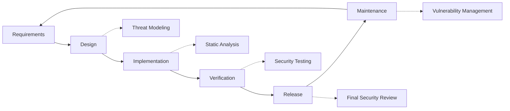

# Tietoturvakäytännöt {#security-practices}

## Sisällysluettelo {#table-of-contents}

* [Esipuhe](#foreword)
* [Infrastruktuurin turvallisuus](#infrastructure-security)
  * [Suojatut palvelinkeskukset](#secure-data-centers)
  * [Verkkoturvallisuus](#network-security)
* [Sähköpostin suojaus](#email-security)
  * [Salaus](#encryption)
  * [Todennus ja valtuutus](#authentication-and-authorization)
  * [Väärinkäytön vastaiset toimenpiteet](#anti-abuse-measures)
* [Tietosuoja](#data-protection)
  * [Tietojen minimointi](#data-minimization)
  * [Varmuuskopiointi ja palautus](#backup-and-recovery)
* [Palveluntarjoajat](#service-providers)
* [Vaatimustenmukaisuus ja tarkastus](#compliance-and-auditing)
  * [Säännölliset turvallisuusarvioinnit](#regular-security-assessments)
  * [Vaatimustenmukaisuus](#compliance)
* [Tapahtumavastaus](#incident-response)
* [Turvallisuuskehityksen elinkaari](#security-development-lifecycle)
* [Palvelimen karkaisu](#server-hardening)
* [Palvelutasosopimus](#service-level-agreement)
* [Avoimen lähdekoodin suojaus](#open-source-security)
* [Työntekijöiden turvallisuus](#employee-security)
* [Jatkuva parantaminen](#continuous-improvement)
* [Lisäresurssit](#additional-resources)

## Esipuhe {#foreword}

Forward Emailissa turvallisuus on tärkein prioriteettimme. Olemme ottaneet käyttöön kattavat turvatoimenpiteet sähköpostiviestintäsi ja henkilötietojesi suojaamiseksi. Tässä asiakirjassa esitellään turvallisuuskäytäntömme ja toimenpiteet, joita teemme varmistaaksemme sähköpostisi luottamuksellisuuden, eheyden ja saatavuuden.

## Infrastruktuurin suojaus {#infrastructure-security}

### Turvalliset datakeskukset {#secure-data-centers}

Infrastruktuurimme isännöi SOC 2 -yhteensopivia datakeskuksia, joissa on:

* 24/7 fyysinen turvallisuus ja valvonta
* Biometriset pääsynvalvontajärjestelmät
* Redundantti sähköjärjestelmä
* Edistynyt palonilmaisu ja -sammutus
* Ympäristön valvonta

### Verkkoturvallisuus {#network-security}

Toteutamme useita verkon suojaustasoja:

* Yritystason palomuurit tiukoilla käyttöoikeusluetteloilla
* DDoS-suojaus ja sen lieventäminen
* Säännöllinen verkon haavoittuvuuksien skannaus
* Tunkeutumisen havaitsemis- ja estojärjestelmät
* Liikenteen salaus kaikkien palvelun päätepisteiden välillä
* Porttiskannaussuojaus ja epäilyttävän toiminnan automaattinen esto

> \[!IMPORTANT]
> All data in transit is encrypted using TLS 1.2+ with modern cipher suites.

## Sähköpostin suojaus {#email-security}

### Salaus {#encryption}

* **Tilankulkukerroksen suojaus (TLS)**: Kaikki sähköpostiliikenne salataan siirron aikana TLS 1.2:lla tai uudemmalla.
* **Päästä päähän -salaus**: Tuki OpenPGP/MIME- ja S/MIME-standardeille.
* **Tallennussalaus**: Kaikki tallennetut sähköpostit salataan lepotilassa ChaCha20-Poly1305-salauksella SQLite-tiedostoissa.
* **Täydellinen levyn salaus**: LUKS v2 -salaus koko levylle.
* **Kattava suojaus**: Toteutamme salauksen levossa, salauksen muistissa ja salauksen siirron aikana.

> \[!NOTE]
> We're the world's first and only email service to use **[quantum-resistant and individually encrypted SQLite mailboxes](https://forwardemail.net/en/blog/docs/best-quantum-safe-encrypted-email-service)**.

### Todennus ja valtuutus {#authentication-and-authorization}

* **DKIM-allekirjoitus**: Kaikki lähtevät sähköpostit allekirjoitetaan DKIM:llä
* **SPF ja DMARC**: Täysi tuki SPF:lle ja DMARC:lle sähköpostihuijausten estämiseksi
* **MTA-STS**: Tuki MTA-STS:lle TLS-salauksen varmistamiseksi
* **Monivaiheinen todennus**: Saatavilla kaikille tileille

### Väärinkäytösten vastaiset toimenpiteet {#anti-abuse-measures}

* **Roskapostin suodatus**: Monikerroksinen roskapostin tunnistus koneoppimisen avulla
* **Virustarkistus**: Kaikkien liitteiden reaaliaikainen tarkistus
* **Nopeuden rajoittaminen**: Suojaus raa'alta voimalta ja luettelointihyökkäyksiltä
* **IP-maine**: Lähettävän IP-osoitteen maineen valvonta
* **Sisällön suodatus**: Haitallisten URL-osoitteiden ja tietojenkalasteluyritysten havaitseminen

## Tietosuoja {#data-protection}

### Tietojen minimointi {#data-minimization}

Noudatamme tietojen minimoinnin periaatetta:

* Keräämme vain palvelumme tarjoamiseen tarvittavat tiedot.
* Sähköpostin sisältö käsitellään muistissa, eikä sitä tallenneta pysyvästi, ellei IMAP/POP3-toimitus sitä vaadi.
* Lokit anonymisoidaan ja säilytetään vain niin kauan kuin on tarpeen.

### Varmuuskopiointi ja palautus {#backup-and-recovery}

* Automatisoidut päivittäiset varmuuskopiot salauksella
* Maantieteellisesti hajautettu varmuuskopiotallennustila
* Säännöllinen varmuuskopioiden palautuksen testaus
* Katastrofien jälkeiset palautusmenettelyt määritellyillä RPO- ja RTO-arvoilla

## Palveluntarjoajat {#service-providers}

Valitsemme palveluntarjoajamme huolellisesti varmistaaksemme, että ne täyttävät korkeat turvallisuusstandardimme. Alla on kansainväliseen tiedonsiirtoon käyttämämme palveluntarjoajat ja niiden GDPR-vaatimustenmukaisuus:

| Palveluntarjoaja | Tarkoitus | DPF-sertifioitu | GDPR-vaatimustenmukaisuussivu |
| --------------------------------------------- | ------------------------- | ------------- | ----------------------------------------------------------------- |
| [Cloudflare](https://www.cloudflare.com) | CDN, DDoS-suojaus, DNS | ✅ Kyllä | [Cloudflare GDPR](https://www.cloudflare.com/trust-hub/gdpr/) |
| [DataPacket](https://www.datapacket.com) | Palvelininfrastruktuuri | ❌ Ei | [DataPacket Privacy](https://www.datapacket.com/privacy-policy) |
| [Digital Ocean](https://www.digitalocean.com) | Pilviinfrastruktuuri | ❌ Ei | [DigitalOcean GDPR](https://www.digitalocean.com/legal/gdpr) |
| [Vultr](https://www.vultr.com) | Pilviinfrastruktuuri | ❌ Ei | [Vultr GDPR](https://www.vultr.com/legal/eea-gdpr-privacy/) |
| [Stripe](https://stripe.com) | Maksujen käsittely | ✅ Kyllä | [Stripe Privacy Center](https://stripe.com/legal/privacy-center) |
| [PayPal](https://www.paypal.com) | Maksujen käsittely | ❌ Ei | [PayPal Privacy](https://www.paypal.com/uk/legalhub/privacy-full) |

Käytämme näitä palveluntarjoajia varmistaaksemme luotettavan ja turvallisen palvelutoimituksen noudattaen samalla kansainvälisiä tietosuojamääräyksiä. Kaikki tiedonsiirrot suoritetaan asianmukaisin suojatoimin henkilötietojesi suojaamiseksi.

## Vaatimustenmukaisuus ja auditointi {#compliance-and-auditing}

### Säännölliset tietoturva-arvioinnit {#regular-security-assessments}

Tiimimme seuraa, tarkistaa ja arvioi säännöllisesti koodikantaa, palvelimia, infrastruktuuria ja käytäntöjä. Toteutamme kattavan turvallisuusohjelman, joka sisältää:

* SSH-avainten säännöllinen kierrätys
* Jatkuva käyttölokien valvonta
* Automaattinen tietoturvaskannaus
* Ennakoiva haavoittuvuuksien hallinta
* Säännöllinen tietoturvakoulutus kaikille tiimin jäsenille

### Vaatimustenmukaisuus {#compliance}

* [GDPR](https://forwardemail.net/gdpr) -yhteensopivat tietojenkäsittelykäytännöt
* [Tietojenkäsittelysopimus (DPA)](https://forwardemail.net/dpa) saatavilla yritysasiakkaille
* CCPA-yhteensopivat tietosuojakäytännöt
* SOC 2 Type II -auditoidut prosessit

## Tapahtumavastaus {#incident-response}

Turvallisuushäiriöiden reagointisuunnitelmamme sisältää:

1. **Havaitseminen**: Automaattiset valvonta- ja hälytysjärjestelmät
2. **Eristäminen**: Vaikutuksen kohteena olevien järjestelmien välitön eristäminen
3. **Hävittämistoimenpiteet**: Uhan poistaminen ja perussyyanalyysi
4. **Palauttaminen**: Palveluiden turvallinen palauttaminen
5. **Ilmoitus**: Oikea-aikainen viestintä vaikutusten kohteena olevien käyttäjien kanssa
6. **Tapahtuman jälkeinen analyysi**: Kattava tarkastelu ja parantaminen

> \[!WARNING]
> If you discover a security vulnerability, please report it immediately to <security@forwardemail.net>.

## Tietoturvakehityksen elinkaari {#security-development-lifecycle}

Kaikki koodit käyvät läpi:

* Tietoturvavaatimusten kerääminen
* Uhkien mallintaminen suunnittelun aikana
* Turvalliset koodauskäytännöt
* Staattinen ja dynaaminen sovellusten tietoturvatestaus
* Koodin tarkastelu tietoturvapainotteisesti
* Riippuvuussuhteiden haavoittuvuuksien skannaus

## Palvelimen suojaus {#server-hardening}

[Mahdollinen kokoonpano](https://github.com/forwardemail/forwardemail.net/tree/master/ansible) -palvelumme toteuttaa useita palvelimen suojauksen parantamiseen tähtääviä toimenpiteitä:

* **USB-käyttö poistettu käytöstä**: Fyysiset portit on poistettu käytöstä lisäämällä usb-storage-ydinmoduuli mustalle listalle.* **Palomuurisäännöt**: Tiukat iptables-säännöt, jotka sallivat vain tarvittavat yhteydet.* **SSH-kovetus**: Vain avainpohjainen todennus, ei salasanakirjautumista, pääkäyttäjän kirjautuminen poistettu käytöstä.* **Palvelun eristäminen**: Jokainen palvelu toimii minimaalisilla vaadituilla oikeuksilla.* **Automaattiset päivitykset**: Tietoturvakorjaukset asennetaan automaattisesti.* **Suojattu käynnistys**: Vahvistettu käynnistysprosessi peukaloinnin estämiseksi.* **Ytimen koventaminen**: Suojatut ytimen parametrit ja sysctl-määritykset.* **Tiedostojärjestelmän rajoitukset**: noexec-, nosuid- ja nodev-liityntävaihtoehdot tarvittaessa.* **Ydinvedokset poistettu käytöstä**: Järjestelmä on määritetty estämään ydinvedokset tietoturvasyistä.* **Vaihto pois käytöstä**: Vaihtomuisti poistettu käytöstä tietovuotojen estämiseksi.* **Porttiskannauksen suojaus**: Porttiskannausyritysten automaattinen tunnistus ja esto.* **Läpinäkyvät valtavat sivut poistettu käytöstä**: THP poistettu käytöstä suorituskyvyn ja tietoturvan parantamiseksi.* **Järjestelmäpalvelun koventaminen**: Ei-välttämättömät palvelut, kuten Apport, poistettu käytöstä.* **Käyttäjä Hallinta**: Vähiten oikeuksien periaate, jossa on erilliset deploy- ja devops-käyttäjät
* **Tiedostokuvaajien rajoitukset**: Suuremmat rajoitukset paremman suorituskyvyn ja tietoturvan saavuttamiseksi

## Palvelutasosopimus {#service-level-agreement}

Ylläpidämme korkeaa palvelun saatavuutta ja luotettavuutta. Infrastruktuurimme on suunniteltu redundanssia ja vikasietoisuutta varten, jotta sähköpostipalvelusi pysyy toiminnassa. Vaikka emme julkaise virallista SLA-asiakirjaa, olemme sitoutuneet:

* 99,9 %+ käyttöaika kaikille palveluille
* Nopea reagointi palvelun häiriöihin
* Läpinäkyvä viestintä häiriötilanteissa
* Säännöllinen ylläpito vähäisen liikenteen aikana

## Avoimen lähdekoodin tietoturva {#open-source-security}

[avoimen lähdekoodin palvelu](https://github.com/forwardemail/forwardemail.net) -yhteisönä tietoturvamme hyötyy seuraavista:

* Läpinäkyvä koodi, jota kuka tahansa voi auditoida
* Yhteisön johtamat tietoturvaparannukset
* Haavoittuvuuksien nopea tunnistaminen ja korjaaminen
* Ei tietoturvaa hämärän takia

## Työntekijöiden turvallisuus {#employee-security}

* Kaikkien työntekijöiden taustatarkastukset
* Tietoturvakoulutus
* Vähiten oikeuksiin perustuvan käyttöoikeuden periaate
* Säännöllinen tietoturvakoulutus

## Jatkuva parantaminen {#continuous-improvement}

Parannamme jatkuvasti turva-asentoamme seuraavilla tavoilla:

* Tietoturvatrendien ja uusien uhkien seuranta
* Tietoturvakäytäntöjen säännöllinen tarkastelu ja päivitykset
* Palaute tietoturvatutkijoilta ja käyttäjiltä
* Osallistuminen tietoturvayhteisöön

Jos haluat lisätietoja turvallisuuskäytännöistämme tai ilmoittaa turvallisuusongelmista, ota yhteyttä osoitteeseen <security@forwardemail.net>.

## Lisäresurssit {#additional-resources}

* [Tietosuojakäytäntö](https://forwardemail.net/en/privacy)
* [Palveluehdot](https://forwardemail.net/en/terms)
* [GDPR-vaatimustenmukaisuus](https://forwardemail.net/gdpr)
* [Tietojenkäsittelysopimus (DPA)](https://forwardemail.net/dpa)
* [Ilmoita väärinkäytöstä](https://forwardemail.net/en/report-abuse)
* [Tietoturvakäytäntö](https://github.com/forwardemail/.github/blob/main/SECURITY.md)
* [Security.txt](https://forwardemail.net/security.txt)
* [GitHub-arkisto](https://github.com/forwardemail/forwardemail.net)
* [FAQ](https://forwardemail.net/en/faq)