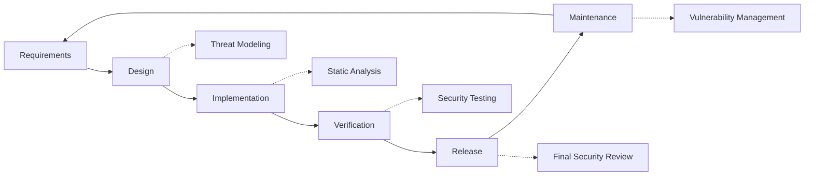

# Turvakäytännöt {#security-practices}

## Sisällysluettelo {#table-of-contents}

* [Esipuhe](#foreword)
* [Infrastruktuurin turvallisuus](#infrastructure-security)
  * [Turvalliset datakeskukset](#secure-data-centers)
  * [Verkon turvallisuus](#network-security)
* [Sähköpostin turvallisuus](#email-security)
  * [Salaus](#encryption)
  * [Todennus ja valtuutus](#authentication-and-authorization)
  * [Väärinkäytön estotoimet](#anti-abuse-measures)
* [Tietosuoja](#data-protection)
  * [Tietojen minimointi](#data-minimization)
  * [Varmuuskopiointi ja palautus](#backup-and-recovery)
* [Palveluntarjoajat](#service-providers)
* [Säädösten noudattaminen ja auditointi](#compliance-and-auditing)
  * [Säännölliset turvallisuusarvioinnit](#regular-security-assessments)
  * [Säädösten noudattaminen](#compliance)
* [Häiriötilanteisiin reagointi](#incident-response)
* [Turvallisen kehityksen elinkaari](#security-development-lifecycle)
* [Palvelimen koventaminen](#server-hardening)
* [Palvelutasosopimus](#service-level-agreement)
* [Avoimen lähdekoodin turvallisuus](#open-source-security)
* [Henkilöstön turvallisuus](#employee-security)
* [Jatkuva parantaminen](#continuous-improvement)
* [Lisäresurssit](#additional-resources)

## Esipuhe {#foreword}

Forward Emaililla turvallisuus on meille ensisijainen prioriteetti. Olemme ottaneet käyttöön kattavat turvatoimet suojataksemme sähköpostiviestintäsi ja henkilökohtaiset tietosi. Tämä dokumentti kuvaa turvakäytäntömme ja toimenpiteet, joilla varmistamme sähköpostisi luottamuksellisuuden, eheyden ja saatavuuden.

## Infrastruktuurin turvallisuus {#infrastructure-security}

### Turvalliset datakeskukset {#secure-data-centers}

Infrastruktuurimme sijaitsee SOC 2 -vaatimusten mukaisissa datakeskuksissa, joissa on:

* 24/7 fyysinen turvallisuus ja valvonta
* Biometriset kulunvalvontajärjestelmät
* Varavoimajärjestelmät
* Edistynyt palontunnistus ja sammutusjärjestelmät
* Ympäristön valvonta

### Verkon turvallisuus {#network-security}

Käytämme useita kerroksia verkkoturvallisuutta:

* Yritystason palomuurit tiukoilla pääsynvalvontalistoilla
* DDoS-suojaus ja -lieventäminen
* Säännölliset verkon haavoittuvuusskannaukset
* Tunkeutumisen havaitsemis- ja estojärjestelmät
* Liikenteen salaus kaikkien palvelupisteiden välillä
* Porttiskannauksen suojaus automaattisella epäilyttävän toiminnan estolla

> \[!IMPORTANT]
> Kaikki siirrettävä data on salattu TLS 1.2+ -protokollalla ja moderneilla salausalgoritmeilla.

## Sähköpostin turvallisuus {#email-security}

### Salaus {#encryption}

* **Transport Layer Security (TLS)**: Kaikki sähköpostiliikenne on salattu siirron aikana TLS 1.2 -versiolla tai uudemmalla
* **Päästä päähän -salauksen tuki**: OpenPGP/MIME- ja S/MIME-standardien tuki
* **Tallennussalaus**: Kaikki tallennetut sähköpostit on salattu levossa ChaCha20-Poly1305-salauksella SQLite-tiedostoissa
* **Koko levyn salaus**: LUKS v2 -salauksen käyttö koko levylle
* **Kattava suojaus**: Käytämme salausta levossa, muistissa ja siirrossa

> \[!NOTE]
> Olemme maailman ensimmäinen ja ainoa sähköpostipalvelu, joka käyttää **[kvanttiturvallisia ja yksilöllisesti salattuja SQLite-postilaatikoita](https://forwardemail.net/en/blog/docs/best-quantum-safe-encrypted-email-service)**.

### Todennus ja valtuutus {#authentication-and-authorization}

* **DKIM-allekirjoitus**: Kaikki lähtevät sähköpostit allekirjoitetaan DKIM:llä
* **SPF ja DMARC**: Täysi tuki SPF:lle ja DMARC:lle sähköpostin väärentämisen estämiseksi
* **MTA-STS**: Tuki MTA-STS:lle TLS-salauksen pakottamiseksi
* **Monivaiheinen todennus**: Saatavilla kaikille tilin kirjautumisille

### Väärinkäytön estotoimet {#anti-abuse-measures}

* **Roskapostisuodatus**: Monikerroksinen roskapostin tunnistus koneoppimisen avulla
* **Virustarkistus**: Kaikkien liitteiden reaaliaikainen tarkistus
* **Nopeusrajoitus**: Suojaus murtamis- ja tunnusten arvailuiskuja vastaan
* **IP-maineen seuranta**: Lähettävän IP-osoitteen maineen valvonta
* **Sisällön suodatus**: Haitallisten URL-osoitteiden ja tietojenkalasteluyritysten tunnistus

## Tietosuoja {#data-protection}

### Tietojen minimointi {#data-minimization}

Noudatamme tietojen minimoinnin periaatetta:

* Keräämme vain palvelumme tarjoamiseen välttämättömät tiedot
* Sähköpostin sisältöä käsitellään muistissa, eikä sitä tallenneta pysyvästi, ellei IMAP/POP3-toimitus sitä vaadi
* Lokit anonymisoidaan ja säilytetään vain niin kauan kuin on tarpeen
### Varmuuskopiointi ja palautus {#backup-and-recovery}

* Automaattiset päivittäiset varmuuskopiot salauksella
* Maantieteellisesti hajautettu varmuuskopioiden tallennus
* Säännölliset varmuuskopioiden palautustestaukset
* Katastrofipalautusmenettelyt määritellyillä RPO- ja RTO-arvoilla

## Palveluntarjoajat {#service-providers}

Valitsemme palveluntarjoajamme huolellisesti varmistaaksemme, että ne täyttävät korkeat turvallisuusvaatimuksemme. Alla ovat kansainväliseen tietojen siirtoon käyttämämme palveluntarjoajat ja heidän GDPR-yhteensopivuustilanteensa:

| Palveluntarjoaja                              | Tarkoitus                  | DPF Sertifioitu | GDPR-yhteensopivuussivu                                                                              |
| --------------------------------------------- | -------------------------- | --------------- | --------------------------------------------------------------------------------------------------- |
| [Cloudflare](https://www.cloudflare.com)      | CDN, DDoS-suojaus, DNS     | ✅ Kyllä         | [Cloudflare GDPR](https://www.cloudflare.com/trust-hub/gdpr/)                                       |
| [DataPacket](https://www.datapacket.com)      | Palvelininfrastruktuuri    | ❌ Ei           | [DataPacket Privacy](https://www.datapacket.com/privacy-policy)                                     |
| [Digital Ocean](https://www.digitalocean.com) | Pilvi-infrastruktuuri      | ❌ Ei           | [DigitalOcean GDPR](https://www.digitalocean.com/legal/gdpr)                                        |
| [GitHub](https://github.com)                  | Lähdekoodin isännöinti, CI/CD | ✅ Kyllä         | [GitHub GDPR](https://docs.github.com/en/site-policy/privacy-policies/github-data-protection-agreement) |
| [Vultr](https://www.vultr.com)                | Pilvi-infrastruktuuri      | ❌ Ei           | [Vultr GDPR](https://www.vultr.com/legal/eea-gdpr-privacy/)                                         |
| [Stripe](https://stripe.com)                  | Maksujen käsittely         | ✅ Kyllä         | [Stripe Privacy Center](https://stripe.com/legal/privacy-center)                                    |
| [PayPal](https://www.paypal.com)              | Maksujen käsittely         | ❌ Ei           | [PayPal Privacy](https://www.paypal.com/uk/legalhub/privacy-full)                                   |

Käytämme näitä palveluntarjoajia varmistaaksemme luotettavan ja turvallisen palvelun toimituksen samalla kun noudatamme kansainvälisiä tietosuojamääräyksiä. Kaikki tietojen siirrot toteutetaan asianmukaisin suojatoimin henkilötietojesi turvaamiseksi.

## Yhteensopivuus ja auditointi {#compliance-and-auditing}

### Säännölliset turvallisuusarvioinnit {#regular-security-assessments}

Tiimimme valvoo, tarkistaa ja arvioi säännöllisesti koodipohjaa, palvelimia, infrastruktuuria ja käytäntöjä. Toteutamme kattavan turvallisuusohjelman, joka sisältää:

* SSH-avainten säännöllisen kierrätyksen
* Pääsylokien jatkuvan valvonnan
* Automaattisen turvallisuusskannauksen
* Ennakoivan haavoittuvuuksien hallinnan
* Säännöllisen turvallisuuskoulutuksen kaikille tiimin jäsenille

### Yhteensopivuus {#compliance}

* [GDPR](https://forwardemail.net/gdpr) -yhteensopivat tietojenkäsittelykäytännöt
* [Tietojenkäsittelysopimus (DPA)](https://forwardemail.net/dpa) saatavilla yritysasiakkaille
* CCPA-yhteensopivat tietosuojakontrollit
* SOC 2 Type II -auditoinnit prosesseissa

## Tapahtumavaste {#incident-response}

Turvallisuustapahtumien vasteohjelmamme sisältää:

1. **Havaitseminen**: Automaattiset valvonta- ja hälytysjärjestelmät
2. **Rajoittaminen**: Vaikutettujen järjestelmien välitön eristäminen
3. **Poistaminen**: Uhan poistaminen ja juurisyyn analyysi
4. **Palauttaminen**: Palveluiden turvallinen palauttaminen
5. **Ilmoittaminen**: Ajantasainen viestintä vaikutuksista kärsineille käyttäjille
6. **Tapahtuman jälkeinen analyysi**: Kattava tarkastelu ja parannukset

> \[!WARNING]
> Jos löydät turvallisuuspuutteen, ilmoita siitä välittömästi osoitteeseen <security@forwardemail.net>.

## Turvallisen kehityksen elinkaari {#security-development-lifecycle}

```mermaid
flowchart LR
    A[Requirements] --> B[Design]
    B --> C[Implementation]
    C --> D[Verification]
    D --> E[Release]
    E --> F[Maintenance]
    F --> A
    B -.-> G[Threat Modeling]
    C -.-> H[Static Analysis]
    D -.-> I[Security Testing]
    E -.-> J[Final Security Review]
    F -.-> K[Vulnerability Management]
```
Kaikki koodi käy läpi:

* Turvavaatimusten keräämisen
* Uhkamallinnuksen suunnittelun aikana
* Turvalliset koodauskäytännöt
* Staattisen ja dynaamisen sovellusturvatestauksen
* Koodikatselmoinnin, jossa keskitytään turvallisuuteen
* Riippuvuuksien haavoittuvuusskannauksen

## Palvelimen koventaminen {#server-hardening}

Meidän [Ansible-konfiguraatiomme](https://github.com/forwardemail/forwardemail.net/tree/master/ansible) toteuttaa lukuisia palvelimen koventamistoimia:

* **USB-yhteys poistettu käytöstä**: Fyysiset portit on poistettu käytöstä mustalistamalla usb-storage-ytin moduuli
* **Palomuurisäännöt**: Tiukat iptables-säännöt, jotka sallivat vain tarvittavat yhteydet
* **SSH-koventaminen**: Vain avainpohjainen todennus, ei salasanasisäänkirjautumista, root-kirjautuminen poistettu käytöstä
* **Palveluiden eristäminen**: Jokainen palvelu toimii vähimmillä tarvittavilla oikeuksilla
* **Automaattiset päivitykset**: Turvapäivitykset asennetaan automaattisesti
* **Turvallinen käynnistys**: Varmennettu käynnistysprosessi manipuloinnin estämiseksi
* **Ytimen koventaminen**: Turvalliset ydinparametrit ja sysctl-konfiguraatiot
* **Tiedostojärjestelmän rajoitukset**: noexec, nosuid ja nodev liitosehdot soveltuvin osin
* **Core dumpien poisto käytöstä**: Järjestelmä on konfiguroitu estämään core dumpit turvallisuuden vuoksi
* **Swap-muistin poisto käytöstä**: Swap-muisti poistettu käytöstä tietovuotojen estämiseksi
* **Porttiskannauksen suojaus**: Automaattinen porttiskannausyritysten tunnistus ja esto
* **Läpinäkyvien suurten sivujen poisto käytöstä**: THP poistettu käytöstä suorituskyvyn ja turvallisuuden parantamiseksi
* **Järjestelmäpalveluiden koventaminen**: Ei-välttämättömät palvelut kuten Apport poistettu käytöstä
* **Käyttäjähallinta**: Vähimmän oikeuden periaate erillisillä deploy- ja devops-käyttäjillä
* **Tiedostokuvauksen rajat**: Rajojen nostaminen paremman suorituskyvyn ja turvallisuuden vuoksi

## Palvelutasosopimus {#service-level-agreement}

Pidämme yllä korkeaa palvelun saatavuutta ja luotettavuutta. Infrastruktuurimme on suunniteltu redundanssia ja vikasietoisuutta varten varmistaaksemme, että sähköpostipalvelusi pysyy toiminnassa. Vaikka emme julkaise virallista SLA-asiakirjaa, sitoudumme:

* Yli 99,9 % käyttöaikaan kaikille palveluille
* Nopeaan reagointiin palvelukatkojen aikana
* Läpinäkyvään viestintään häiriötilanteissa
* Säännölliseen ylläpitoon vähäliikenteisinä aikoina

## Avoimen lähdekoodin turvallisuus {#open-source-security}

Avoimen lähdekoodin palveluna [open-source service](https://github.com/forwardemail/forwardemail.net) turvallisuutemme hyötyy:

* Läpinäkyvästä koodista, jota kuka tahansa voi tarkastaa
* Yhteisön ohjaamista turvallisuusparannuksista
* Haavoittuvuuksien nopeasta tunnistamisesta ja korjaamisesta
* Ei turvallisuutta piilottamisen kautta

## Työntekijöiden turvallisuus {#employee-security}

* Taustatarkastukset kaikille työntekijöille
* Turvallisuustietoisuuskoulutus
* Vähimmän oikeuden pääsy
* Säännöllinen turvallisuuskoulutus

## Jatkuva parantaminen {#continuous-improvement}

Parannamme jatkuvasti turvallisuusasemiamme seuraavasti:

* Turvallisuustrendien ja uusien uhkien seuranta
* Turvallisuuspolitiikkojen säännöllinen tarkastelu ja päivitys
* Palautteen kerääminen tietoturvatutkijoilta ja käyttäjiltä
* Osallistuminen turvallisuusyhteisöön

Lisätietoja turvallisuuskäytännöistämme tai turvallisuushuolien raportoinnista saa ottamalla yhteyttä osoitteeseen <security@forwardemail.net>.

## Lisäresurssit {#additional-resources}

* [Tietosuojakäytäntö](https://forwardemail.net/en/privacy)
* [Palveluehdot](https://forwardemail.net/en/terms)
* [GDPR-yhteensopivuus](https://forwardemail.net/gdpr)
* [Tietojenkäsittelysopimus (DPA)](https://forwardemail.net/dpa)
* [Ilmoita väärinkäytöstä](https://forwardemail.net/en/report-abuse)
* [Turvallisuuspolitiikka](https://github.com/forwardemail/.github/blob/main/SECURITY.md)
* [Security.txt](https://forwardemail.net/security.txt)
* [GitHub-repositorio](https://github.com/forwardemail/forwardemail.net)
* [UKK](https://forwardemail.net/en/faq)
