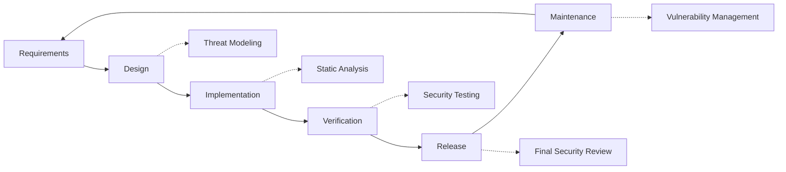

# Pratiques de sécurité {#security-practices}

## Table des matières {#table-of-contents}

* [Avant-propos](#foreword)
* [Sécurité des infrastructures](#infrastructure-security)
  * [Centres de données sécurisés](#secure-data-centers)
  * [Sécurité du réseau](#network-security)
* [Sécurité des e-mails](#email-security)
  * [Cryptage](#encryption)
  * [Authentification et autorisation](#authentication-and-authorization)
  * [Mesures anti-abus](#anti-abuse-measures)
* [Protection des données](#data-protection)
  * [Minimisation des données](#data-minimization)
  * [Sauvegarde et récupération](#backup-and-recovery)
* [Fournisseurs de services](#service-providers)
* [Conformité et audit](#compliance-and-auditing)
  * [Évaluations de sécurité régulières](#regular-security-assessments)
  * [Conformité](#compliance)
* [Réponse aux incidents](#incident-response)
* [Cycle de vie du développement de la sécurité](#security-development-lifecycle)
* [Renforcement du serveur](#server-hardening)
* [Accord de niveau de service](#service-level-agreement)
* [Sécurité Open Source](#open-source-security)
* [Sécurité des employés](#employee-security)
* [Amélioration continue](#continuous-improvement)
* [Ressources supplémentaires](#additional-resources)

## Avant-propos {#foreword}

Chez Forward Email, la sécurité est notre priorité absolue. Nous avons mis en place des mesures de sécurité complètes pour protéger vos communications par e-mail et vos données personnelles. Ce document décrit nos pratiques de sécurité et les mesures que nous prenons pour garantir la confidentialité, l'intégrité et la disponibilité de vos e-mails.

## Sécurité des infrastructures {#infrastructure-security}

### Centres de données sécurisés {#secure-data-centers}

Notre infrastructure est hébergée dans des centres de données conformes à la norme SOC 2 avec :

* Sécurité physique et surveillance 24h/24 et 7j/7
* Contrôles d'accès biométriques
* Systèmes d'alimentation redondants
* Détection et extinction d'incendie avancées
* Surveillance environnementale

### Sécurité du réseau {#network-security}

Nous mettons en œuvre plusieurs couches de sécurité réseau :

* Pare-feu d'entreprise avec listes de contrôle d'accès strictes
* Protection et atténuation des attaques DDoS
* Analyse régulière des vulnérabilités du réseau
* Systèmes de détection et de prévention des intrusions
* Chiffrement du trafic entre tous les points de terminaison du service
* Protection par analyse des ports avec blocage automatique des activités suspectes

> \[!IMPORTANT]
> Toutes les données en transit sont chiffrées à l'aide de TLS 1.2+ et de suites de chiffrement modernes.

## Sécurité des e-mails {#email-security}

### Chiffrement {#encryption}

* **Sécurité de la couche transport (TLS)** : Tout le trafic de messagerie est chiffré en transit avec TLS 1.2 ou version ultérieure
* **Chiffrement de bout en bout** : Prise en charge des normes OpenPGP/MIME et S/MIME
* **Chiffrement du stockage** : Tous les e-mails stockés sont chiffrés au repos avec le chiffrement ChaCha20-Poly1305 dans les fichiers SQLite
* **Chiffrement complet du disque** : Chiffrement LUKS v2 pour l'intégralité du disque
* **Protection complète** : Nous mettons en œuvre le chiffrement au repos, le chiffrement en mémoire et le chiffrement en transit

> \[!NOTE]
> Nous sommes le premier et le seul service de messagerie au monde à utiliser **[boîtes aux lettres SQLite résistantes aux quanta et chiffrées individuellement](https://forwardemail.net/en/blog/docs/best-quantum-safe-encrypted-email-service)**.

### Authentification et autorisation {#authentication-and-authorization}

* **Signature DKIM** : Tous les e-mails sortants sont signés avec DKIM
* **SPF et DMARC** : Prise en charge complète de SPF et DMARC pour empêcher l'usurpation d'adresse e-mail
* **MTA-STS** : Prise en charge de MTA-STS pour appliquer le chiffrement TLS
* **Authentification multifacteur** : Disponible pour tous les accès aux comptes

### Mesures anti-abus {#anti-abuse-measures}

* **Filtrage du spam** : Détection multicouche du spam grâce à l'apprentissage automatique
* **Analyse antivirus** : Analyse en temps réel de toutes les pièces jointes
* **Limitation du débit** : Protection contre les attaques par force brute et par énumération
* **Réputation IP** : Surveillance de la réputation des adresses IP d'envoi
* **Filtrage de contenu** : Détection des URL malveillantes et des tentatives d'hameçonnage

## Protection des données {#data-protection}

### Minimisation des données {#data-minimization}

Nous suivons le principe de minimisation des données :

* Nous collectons uniquement les données nécessaires à la fourniture de notre service.
* Le contenu des e-mails est traité en mémoire et non stocké de manière permanente, sauf si nécessaire pour la diffusion IMAP/POP3.
* Les journaux sont anonymisés et conservés uniquement le temps nécessaire.

### Sauvegarde et récupération {#backup-and-recovery}

* Sauvegardes quotidiennes automatisées avec chiffrement
* Stockage de sauvegarde géographiquement réparti
* Tests réguliers de restauration des sauvegardes
* Procédures de reprise après sinistre avec RPO et RTO définis

## Fournisseurs de services {#service-providers}

Nous sélectionnons soigneusement nos prestataires de services afin de garantir qu'ils répondent à nos normes de sécurité élevées. Voici la liste des prestataires que nous utilisons pour les transferts internationaux de données et leur conformité au RGPD :

| Fournisseur | But | Certifié DPF | Page de conformité au RGPD |
| --------------------------------------------- | ------------------------- | ------------- | ----------------------------------------------------------------- |
| [Cloudflare](https://www.cloudflare.com) | CDN, protection DDoS, DNS | ✅ Oui | [Cloudflare GDPR](https://www.cloudflare.com/trust-hub/gdpr/) |
| [DataPacket](https://www.datapacket.com) | Infrastructure du serveur | ❌ Non | [DataPacket Privacy](https://www.datapacket.com/privacy-policy) |
| [Digital Ocean](https://www.digitalocean.com) | Infrastructure cloud | ❌ Non | [DigitalOcean GDPR](https://www.digitalocean.com/legal/gdpr) |
| [Vultr](https://www.vultr.com) | Infrastructure cloud | ❌ Non | [Vultr GDPR](https://www.vultr.com/legal/eea-gdpr-privacy/) |
| [Stripe](https://stripe.com) | Traitement des paiements | ✅ Oui | [Stripe Privacy Center](https://stripe.com/legal/privacy-center) |
| [PayPal](https://www.paypal.com) | Traitement des paiements | ❌ Non | [PayPal Privacy](https://www.paypal.com/uk/legalhub/privacy-full) |

Nous faisons appel à ces prestataires pour garantir une prestation de services fiable et sécurisée, tout en respectant les réglementations internationales en matière de protection des données. Tous les transferts de données sont effectués avec les garanties appropriées pour protéger vos informations personnelles.

## Conformité et audit {#compliance-and-auditing}

### Évaluations de sécurité régulières {#regular-security-assessments}

Notre équipe surveille, examine et évalue régulièrement le code source, les serveurs, l'infrastructure et les pratiques. Nous mettons en œuvre un programme de sécurité complet comprenant :

* Rotation régulière des clés SSH
* Surveillance continue des journaux d'accès
* Analyse de sécurité automatisée
* Gestion proactive des vulnérabilités
* Formation régulière à la sécurité pour tous les membres de l'équipe

### Conformité {#compliance}

* Pratiques de traitement des données conformes à [GDPR](https://forwardemail.net/gdpr)
* [Accord de traitement des données (ATD)](https://forwardemail.net/dpa) disponible pour les clients professionnels
* Contrôles de confidentialité conformes à la CCPA
* Processus audités SOC 2 Type II

## Réponse aux incidents {#incident-response}

Notre plan de réponse aux incidents de sécurité comprend :

1. **Détection** : Systèmes automatisés de surveillance et d'alerte
2. **Confinement** : Isolation immédiate des systèmes affectés
3. **Éradication** : Suppression de la menace et analyse des causes profondes
4. **Récupération** : Restauration sécurisée des services
5. **Notification** : Communication rapide avec les utilisateurs affectés
6. **Analyse post-incident** : Examen complet et amélioration

> \[!WARNING]
> Si vous découvrez une faille de sécurité, veuillez la signaler immédiatement à <security@forwardemail.net>.

## Cycle de vie du développement de la sécurité {#security-development-lifecycle}

Tout le code subit :

* Recueil des exigences de sécurité
* Modélisation des menaces lors de la conception
* Pratiques de codage sécurisées
* Tests de sécurité statiques et dynamiques des applications
* Revue de code axée sur la sécurité
* Analyse des vulnérabilités des dépendances

## Renforcement du serveur {#server-hardening}

Notre [Configuration d'Ansible](https://github.com/forwardemail/forwardemail.net/tree/master/ansible) implémente de nombreuses mesures de renforcement du serveur :

* **Accès USB désactivé** : Les ports physiques sont désactivés par la mise sur liste noire du module noyau usb-storage
* **Règles de pare-feu** : Règles iptables strictes autorisant uniquement les connexions nécessaires
* **Renforcement SSH** : Authentification par clé uniquement, connexion sans mot de passe, connexion root désactivée
* **Isolation des services** : Chaque service s'exécute avec les privilèges minimaux requis
* **Mises à jour automatiques** : Les correctifs de sécurité sont appliqués automatiquement
* **Démarrage sécurisé** : Processus de démarrage vérifié pour empêcher toute altération
* **Renforcement du noyau** : Paramètres du noyau et configurations sysctl sécurisés
* **Restrictions du système de fichiers** : Options de montage noexec, nosuid et nodev, le cas échéant
* **Vidages mémoire désactivés** : Système configuré pour empêcher les vidages mémoire pour des raisons de sécurité
* **Swap désactivé** : Mémoire d'échange désactivée pour éviter les fuites de données
* **Protection contre l'analyse des ports** : Détection et blocage automatiques des tentatives d'analyse des ports
* **Transparent Huge Pages désactivées** : THP désactivé pour améliorer les performances et Sécurité
* **Renforcement des services système** : Services non essentiels comme Apport désactivés
* **Gestion des utilisateurs** : Principe du moindre privilège avec utilisateurs de déploiement et de développement distincts
* **Limites des descripteurs de fichiers** : Limites accrues pour de meilleures performances et une sécurité accrue

## Accord de niveau de service {#service-level-agreement}

Nous maintenons un niveau élevé de disponibilité et de fiabilité de nos services. Notre infrastructure est conçue pour la redondance et la tolérance aux pannes afin de garantir le bon fonctionnement de votre service de messagerie. Bien que nous ne publiions pas de contrat de niveau de service (SLA) officiel, nous nous engageons à :

* Disponibilité de plus de 99,9 % pour tous les services
* Réponse rapide aux interruptions de service
* Communication transparente en cas d'incident
* Maintenance régulière pendant les périodes de faible trafic

## Sécurité Open Source {#open-source-security}

En tant que [service open source](https://github.com/forwardemail/forwardemail.net), notre sécurité bénéficie de :

* Code transparent et auditable par tous
* Améliorations de sécurité pilotées par la communauté
* Identification et correction rapides des vulnérabilités
* Pas de sécurité grâce à l'obscurité

## Sécurité des employés {#employee-security}

* Vérification des antécédents de tous les employés
* Formation à la sensibilisation à la sécurité
* Principe du moindre privilège d'accès
* Formation régulière à la sécurité

## Amélioration continue {#continuous-improvement}

Nous améliorons continuellement notre posture de sécurité grâce à :

* Suivi des tendances en matière de sécurité et des menaces émergentes
* Examen et mises à jour réguliers des politiques de sécurité
* Retours des chercheurs et des utilisateurs en sécurité
* Participation à la communauté de la sécurité

Pour plus d'informations sur nos pratiques de sécurité ou pour signaler des problèmes de sécurité, veuillez contacter <security@forwardemail.net>.

## Ressources supplémentaires {#additional-resources}

* [politique de confidentialité](https://forwardemail.net/en/privacy)
* [Conditions d'utilisation](https://forwardemail.net/en/terms)
* [Conformité au RGPD](https://forwardemail.net/gdpr)
* [Accord de traitement des données (ATD)](https://forwardemail.net/dpa)
* [Signaler un abus](https://forwardemail.net/en/report-abuse)
* [Politique de sécurité](https://github.com/forwardemail/.github/blob/main/SECURITY.md)
* [Security.txt](https://forwardemail.net/security.txt)
* [Dépôt GitHub](https://github.com/forwardemail/forwardemail.net)
* [FAQ](https://forwardemail.net/en/faq)