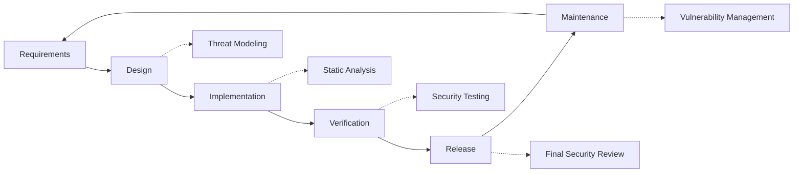

# Pratiques de Sécurité {#security-practices}

## Table des Matières {#table-of-contents}

* [Avant-propos](#foreword)
* [Sécurité de l'Infrastructure](#infrastructure-security)
  * [Centres de Données Sécurisés](#secure-data-centers)
  * [Sécurité Réseau](#network-security)
* [Sécurité des Emails](#email-security)
  * [Chiffrement](#encryption)
  * [Authentification et Autorisation](#authentication-and-authorization)
  * [Mesures Anti-Abus](#anti-abuse-measures)
* [Protection des Données](#data-protection)
  * [Minimisation des Données](#data-minimization)
  * [Sauvegarde et Récupération](#backup-and-recovery)
* [Fournisseurs de Services](#service-providers)
* [Conformité et Audit](#compliance-and-auditing)
  * [Évaluations de Sécurité Régulières](#regular-security-assessments)
  * [Conformité](#compliance)
* [Réponse aux Incidents](#incident-response)
* [Cycle de Vie du Développement Sécurisé](#security-development-lifecycle)
* [Renforcement des Serveurs](#server-hardening)
* [Accord de Niveau de Service](#service-level-agreement)
* [Sécurité Open Source](#open-source-security)
* [Sécurité des Employés](#employee-security)
* [Amélioration Continue](#continuous-improvement)
* [Ressources Supplémentaires](#additional-resources)

## Avant-propos {#foreword}

Chez Forward Email, la sécurité est notre priorité absolue. Nous avons mis en place des mesures de sécurité complètes pour protéger vos communications par email et vos données personnelles. Ce document décrit nos pratiques de sécurité et les étapes que nous suivons pour garantir la confidentialité, l'intégrité et la disponibilité de vos emails.

## Sécurité de l'Infrastructure {#infrastructure-security}

### Centres de Données Sécurisés {#secure-data-centers}

Notre infrastructure est hébergée dans des centres de données conformes SOC 2 avec :

* Sécurité physique et surveillance 24/7
* Contrôles d'accès biométriques
* Systèmes d'alimentation redondants
* Détection et suppression avancées d'incendie
* Surveillance environnementale

### Sécurité Réseau {#network-security}

Nous mettons en œuvre plusieurs couches de sécurité réseau :

* Pare-feux de niveau entreprise avec listes de contrôle d'accès strictes
* Protection et atténuation contre les attaques DDoS
* Analyse régulière des vulnérabilités réseau
* Systèmes de détection et de prévention d'intrusion
* Chiffrement du trafic entre tous les points de service
* Protection contre le scan de ports avec blocage automatique des activités suspectes

> \[!IMPORTANT]
> Toutes les données en transit sont chiffrées en utilisant TLS 1.2+ avec des suites de chiffrement modernes.

## Sécurité des Emails {#email-security}

### Chiffrement {#encryption}

* **Transport Layer Security (TLS)** : Tout le trafic email est chiffré en transit avec TLS 1.2 ou supérieur
* **Chiffrement de bout en bout** : Support des standards OpenPGP/MIME et S/MIME
* **Chiffrement du stockage** : Tous les emails stockés sont chiffrés au repos avec le chiffrement ChaCha20-Poly1305 dans des fichiers SQLite
* **Chiffrement complet du disque** : Chiffrement LUKS v2 pour l'ensemble du disque
* **Protection complète** : Nous mettons en œuvre le chiffrement au repos, en mémoire et en transit

> \[!NOTE]
> Nous sommes le premier et unique service email au monde à utiliser **[des boîtes aux lettres SQLite chiffrées individuellement et résistantes au quantique](https://forwardemail.net/en/blog/docs/best-quantum-safe-encrypted-email-service)**.

### Authentification et Autorisation {#authentication-and-authorization}

* **Signature DKIM** : Tous les emails sortants sont signés avec DKIM
* **SPF et DMARC** : Support complet de SPF et DMARC pour prévenir l'usurpation d'email
* **MTA-STS** : Support de MTA-STS pour appliquer le chiffrement TLS
* **Authentification Multi-facteurs** : Disponible pour tous les accès aux comptes

### Mesures Anti-Abus {#anti-abuse-measures}

* **Filtrage Anti-Spam** : Détection multi-couches du spam avec apprentissage automatique
* **Analyse Antivirus** : Analyse en temps réel de toutes les pièces jointes
* **Limitation de Débit** : Protection contre les attaques par force brute et d'énumération
* **Réputation IP** : Surveillance de la réputation des IP d'envoi
* **Filtrage de Contenu** : Détection des URL malveillantes et tentatives de phishing

## Protection des Données {#data-protection}

### Minimisation des Données {#data-minimization}

Nous suivons le principe de minimisation des données :

* Nous ne collectons que les données nécessaires à la fourniture de notre service
* Le contenu des emails est traité en mémoire et n'est pas stocké de manière persistante sauf si nécessaire pour la livraison IMAP/POP3
* Les journaux sont anonymisés et conservés uniquement aussi longtemps que nécessaire
### Sauvegarde et Récupération {#backup-and-recovery}

* Sauvegardes automatisées quotidiennes avec chiffrement  
* Stockage des sauvegardes réparti géographiquement  
* Tests réguliers de restauration des sauvegardes  
* Procédures de reprise après sinistre avec RPO et RTO définis  

## Fournisseurs de Services {#service-providers}

Nous sélectionnons soigneusement nos fournisseurs de services afin de garantir qu'ils respectent nos normes de sécurité élevées. Voici les fournisseurs que nous utilisons pour le transfert international de données ainsi que leur statut de conformité au RGPD :

| Fournisseur                                   | Usage                      | Certifié DPF  | Page de conformité RGPD                                                                                 |
| --------------------------------------------- | -------------------------- | ------------- | ------------------------------------------------------------------------------------------------------- |
| [Cloudflare](https://www.cloudflare.com)      | CDN, protection DDoS, DNS  | ✅ Oui         | [Cloudflare GDPR](https://www.cloudflare.com/trust-hub/gdpr/)                                           |
| [DataPacket](https://www.datapacket.com)      | Infrastructure serveur     | ❌ Non         | [DataPacket Privacy](https://www.datapacket.com/privacy-policy)                                         |
| [Digital Ocean](https://www.digitalocean.com) | Infrastructure cloud       | ❌ Non         | [DigitalOcean GDPR](https://www.digitalocean.com/legal/gdpr)                                            |
| [GitHub](https://github.com)                  | Hébergement de code source, CI/CD | ✅ Oui         | [GitHub GDPR](https://docs.github.com/en/site-policy/privacy-policies/github-data-protection-agreement) |
| [Vultr](https://www.vultr.com)                | Infrastructure cloud       | ❌ Non         | [Vultr GDPR](https://www.vultr.com/legal/eea-gdpr-privacy/)                                             |
| [Stripe](https://stripe.com)                  | Traitement des paiements   | ✅ Oui         | [Stripe Privacy Center](https://stripe.com/legal/privacy-center)                                        |
| [PayPal](https://www.paypal.com)              | Traitement des paiements   | ❌ Non         | [PayPal Privacy](https://www.paypal.com/uk/legalhub/privacy-full)                                       |

Nous utilisons ces fournisseurs pour garantir une prestation de service fiable et sécurisée tout en respectant les réglementations internationales sur la protection des données. Tous les transferts de données sont effectués avec les mesures de protection appropriées pour sécuriser vos informations personnelles.

## Conformité et Audit {#compliance-and-auditing}

### Évaluations de Sécurité Régulières {#regular-security-assessments}

Notre équipe surveille, examine et évalue régulièrement la base de code, les serveurs, l'infrastructure et les pratiques. Nous mettons en œuvre un programme de sécurité complet qui inclut :

* Rotation régulière des clés SSH  
* Surveillance continue des journaux d'accès  
* Analyse de sécurité automatisée  
* Gestion proactive des vulnérabilités  
* Formation régulière à la sécurité pour tous les membres de l'équipe  

### Conformité {#compliance}

* Pratiques de gestion des données conformes au [RGPD](https://forwardemail.net/gdpr)  
* [Contrat de traitement des données (DPA)](https://forwardemail.net/dpa) disponible pour les clients professionnels  
* Contrôles de confidentialité conformes au CCPA  
* Processus audités SOC 2 Type II  

## Réponse aux Incidents {#incident-response}

Notre plan de réponse aux incidents de sécurité comprend :

1. **Détection** : Systèmes automatisés de surveillance et d’alerte  
2. **Confinement** : Isolement immédiat des systèmes affectés  
3. **Éradication** : Suppression de la menace et analyse des causes profondes  
4. **Récupération** : Restauration sécurisée des services  
5. **Notification** : Communication rapide avec les utilisateurs concernés  
6. **Analyse post-incident** : Revue complète et amélioration  

> \[!WARNING]  
> Si vous découvrez une vulnérabilité de sécurité, veuillez la signaler immédiatement à <security@forwardemail.net>.  

## Cycle de Développement Sécurisé {#security-development-lifecycle}

```mermaid
flowchart LR
    A[Requirements] --> B[Design]
    B --> C[Implementation]
    C --> D[Verification]
    D --> E[Release]
    E --> F[Maintenance]
    F --> A
    B -.-> G[Threat Modeling]
    C -.-> H[Static Analysis]
    D -.-> I[Security Testing]
    E -.-> J[Final Security Review]
    F -.-> K[Vulnerability Management]
```
Tout le code subit :

* Collecte des exigences de sécurité
* Modélisation des menaces lors de la conception
* Pratiques de codage sécurisé
* Tests de sécurité des applications statiques et dynamiques
* Revue de code avec un focus sur la sécurité
* Analyse des vulnérabilités des dépendances

## Durcissement du serveur {#server-hardening}

Notre [configuration Ansible](https://github.com/forwardemail/forwardemail.net/tree/master/ansible) met en œuvre de nombreuses mesures de durcissement du serveur :

* **Accès USB désactivé** : Les ports physiques sont désactivés en mettant sur liste noire le module kernel usb-storage
* **Règles de pare-feu** : Règles iptables strictes autorisant uniquement les connexions nécessaires
* **Durcissement SSH** : Authentification par clé uniquement, pas de connexion par mot de passe, connexion root désactivée
* **Isolation des services** : Chaque service fonctionne avec les privilèges minimaux requis
* **Mises à jour automatiques** : Les correctifs de sécurité sont appliqués automatiquement
* **Démarrage sécurisé** : Processus de démarrage vérifié pour empêcher toute altération
* **Durcissement du kernel** : Paramètres kernel sécurisés et configurations sysctl
* **Restrictions du système de fichiers** : options de montage noexec, nosuid et nodev là où approprié
* **Dumps mémoire désactivés** : Système configuré pour empêcher les dumps mémoire pour la sécurité
* **Swap désactivé** : Mémoire swap désactivée pour éviter les fuites de données
* **Protection contre le scan de ports** : Détection et blocage automatisés des tentatives de scan de ports
* **Transparent Huge Pages désactivé** : THP désactivé pour améliorer les performances et la sécurité
* **Durcissement des services système** : Services non essentiels comme Apport désactivés
* **Gestion des utilisateurs** : Principe du moindre privilège avec des utilisateurs déploy et devops séparés
* **Limites des descripteurs de fichiers** : Limites augmentées pour de meilleures performances et sécurité

## Accord de niveau de service {#service-level-agreement}

Nous maintenons un niveau élevé de disponibilité et de fiabilité du service. Notre infrastructure est conçue pour la redondance et la tolérance aux pannes afin d'assurer que votre service de messagerie reste opérationnel. Bien que nous ne publions pas de document SLA formel, nous nous engageons à :

* 99,9 %+ de disponibilité pour tous les services
* Réponse rapide aux interruptions de service
* Communication transparente lors des incidents
* Maintenance régulière pendant les périodes de faible trafic

## Sécurité Open Source {#open-source-security}

En tant que [service open-source](https://github.com/forwardemail/forwardemail.net), notre sécurité bénéficie de :

* Code transparent pouvant être audité par tous
* Améliorations de sécurité pilotées par la communauté
* Identification rapide et correction des vulnérabilités
* Pas de sécurité par l'obscurité

## Sécurité des employés {#employee-security}

* Vérifications des antécédents pour tous les employés
* Formation à la sensibilisation à la sécurité
* Accès selon le principe du moindre privilège
* Éducation régulière à la sécurité

## Amélioration continue {#continuous-improvement}

Nous améliorons continuellement notre posture de sécurité grâce à :

* Surveillance des tendances de sécurité et des menaces émergentes
* Revue régulière et mises à jour des politiques de sécurité
* Retours des chercheurs en sécurité et des utilisateurs
* Participation à la communauté de la sécurité

Pour plus d'informations sur nos pratiques de sécurité ou pour signaler des préoccupations de sécurité, veuillez contacter <security@forwardemail.net>.

## Ressources supplémentaires {#additional-resources}

* [Politique de confidentialité](https://forwardemail.net/en/privacy)
* [Conditions d'utilisation](https://forwardemail.net/en/terms)
* [Conformité RGPD](https://forwardemail.net/gdpr)
* [Contrat de traitement des données (DPA)](https://forwardemail.net/dpa)
* [Signaler un abus](https://forwardemail.net/en/report-abuse)
* [Politique de sécurité](https://github.com/forwardemail/.github/blob/main/SECURITY.md)
* [Security.txt](https://forwardemail.net/security.txt)
* [Dépôt GitHub](https://github.com/forwardemail/forwardemail.net)
* [FAQ](https://forwardemail.net/en/faq)
