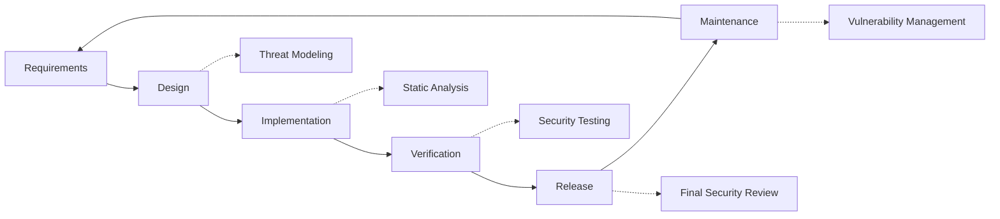

# נוהלי אבטחה {#security-practices}

## תוכן עניינים

* [הַקדָמָה](#foreword)
* [אבטחת תשתיות](#infrastructure-security)
  * [מרכזי נתונים מאובטחים](#secure-data-centers)
  * [אבטחת רשת](#network-security)
* [אבטחת דוא"ל](#email-security)
  * [הצפנה](#encryption)
  * [אימות והרשאה](#authentication-and-authorization)
  * [אמצעים נגד התעללות](#anti-abuse-measures)
* [הגנת נתונים](#data-protection)
  * [מזעור נתונים](#data-minimization)
  * [גיבוי ושחזור](#backup-and-recovery)
* [ספקי שירות](#service-providers)
* [תאימות וביקורת](#compliance-and-auditing)
  * [הערכות אבטחה תקופתיות](#regular-security-assessments)
  * [הַתאָמָה](#compliance)
* [תגובה לאירוע](#incident-response)
* [מחזור חיים של פיתוח אבטחה](#security-development-lifecycle)
* [הקשחת שרתים](#server-hardening)
* [הסכם רמת שירות](#service-level-agreement)
* [אבטחת קוד פתוח](#open-source-security)
* [אבטחת עובדים](#employee-security)
* [שיפור מתמיד](#continuous-improvement)
* [משאבים נוספים](#additional-resources)

## הקדמה {#foreword}

ב-Forward Email, אבטחה היא בראש סדר העדיפויות שלנו. יישמנו אמצעי אבטחה מקיפים כדי להגן על תקשורת הדוא"ל והנתונים האישיים שלך. מסמך זה מתאר את נוהלי האבטחה שלנו ואת הצעדים שאנו נוקטים כדי להבטיח את הסודיות, השלמות והזמינות של הדוא"ל שלך.

## אבטחת תשתית {#infrastructure-security}

### מרכזי נתונים מאובטחים {#secure-data-centers}

התשתית שלנו מאוחסנת במרכזי נתונים תואמי SOC 2 עם:

* אבטחה ומעקב פיזיים 24/7
* בקרות גישה ביומטריות
* מערכות חשמל יתירות
* גילוי וכיבוי אש מתקדמות
* ניטור סביבתי

### אבטחת רשת {#network-security}

אנו מיישמים מספר שכבות של אבטחת רשת:

* חומות אש ברמה ארגונית עם רשימות בקרת גישה מחמירות
* הגנה והפחתת פעילות מפני DDoS
* סריקת פגיעויות רשת באופן קבוע
* מערכות לגילוי ומניעת חדירות
* הצפנת תעבורה בין כל נקודות הקצה של השירות
* הגנה על סריקת פורטים עם חסימה אוטומטית של פעילות חשודה

> \[!IMPORTANT]
> כל הנתונים במעבר מוצפנים באמצעות TLS 1.2+ עם חבילות הצפנה מודרניות.

## אבטחת דוא"ל {#email-security}

### הצפנה {#encryption}

* **אבטחת שכבת תעבורה (TLS)**: כל תעבורת הדוא"ל מוצפנת תוך כדי העברה באמצעות TLS 1.2 ומעלה
* **הצפנה מקצה לקצה**: תמיכה בתקני OpenPGP/MIME ו-S/MIME
* **הצפנת אחסון**: כל הדוא"ל המאוחסן מוצפן במנוחה באמצעות הצפנת ChaCha20-Poly1305 בקבצי SQLite
* **הצפנת דיסק מלאה**: הצפנת LUKS v2 עבור כל הדיסק
* **הגנה מקיפה**: אנו מיישמים הצפנה במנוחה, הצפנה בזיכרון והצפנה תוך כדי העברה

> \[!NOTE]
> אנחנו שירות הדוא"ל הראשון והיחיד בעולם שמשתמש ב- **[תיבות דואר של SQLite עמידות קוונטית ומוצפנות בנפרד](https://forwardemail.net/en/blog/docs/best-quantum-safe-encrypted-email-service)**.

### אימות והרשאה {#authentication-and-authorization}

* **חתימת DKIM**: כל האימיילים היוצאים נחתמים באמצעות DKIM
* **SPF ו-DMARC**: תמיכה מלאה ב-SPF ו-DMARC למניעת זיוף אימיילים
* **MTA-STS**: תמיכה ב-MTA-STS לאכיפת הצפנת TLS
* **אימות רב-גורמי**: זמין לכל גישה לחשבונות

### אמצעים נגד שימוש לרעה {#anti-abuse-measures}

* **סינון דואר זבל**: זיהוי דואר זבל רב-שכבתי עם למידת מכונה
* **סריקת וירוסים**: סריקה בזמן אמת של כל הקבצים המצורפים
* **הגבלת קצב**: הגנה מפני התקפות Brute Force וספירה
* **מוניטין IP**: ניטור מוניטין ה-IP של השליחה
* **סינון תוכן**: זיהוי כתובות URL זדוניות וניסיונות פישינג

## הגנת נתונים {#data-protection}

### מזעור נתונים {#data-minimization}

אנו פועלים לפי עקרון מזעור הנתונים:

* אנו אוספים רק את הנתונים הדרושים למתן השירות שלנו
* תוכן הדוא"ל מעובד בזיכרון ואינו מאוחסן באופן קבוע אלא אם כן נדרש למשלוח IMAP/POP3
* יומני דוא"ל אנונימיים ונשמרים רק כל עוד נחוץ

### גיבוי ושחזור {#backup-and-recovery}

* גיבויים יומיים אוטומטיים עם הצפנה
* אחסון גיבויים מבוזר גיאוגרפית
* בדיקות שחזור גיבויים באופן קבוע
* נהלי התאוששות מאסון עם RPO ו-RTO מוגדרים

## ספקי שירות {#service-providers}

אנו בוחרים בקפידה את ספקי השירות שלנו כדי להבטיח שהם עומדים בתקני האבטחה הגבוהים שלנו. להלן הספקים בהם אנו משתמשים להעברת נתונים בינלאומית ומצב תאימותם ל-GDPR:

| ספק | מַטָרָה | DPF מוסמך | דף תאימות GDPR |
| --------------------------------------------- | ------------------------- | ------------- | ----------------------------------------------------------------- |
| [Cloudflare](https://www.cloudflare.com) | CDN, הגנה מפני DDoS, DNS | ✅ כן | [Cloudflare GDPR](https://www.cloudflare.com/trust-hub/gdpr/) |
| [DataPacket](https://www.datapacket.com) | תשתית שרתים | ❌ לא | [DataPacket Privacy](https://www.datapacket.com/privacy-policy) |
| [Digital Ocean](https://www.digitalocean.com) | תשתית ענן | ❌ לא | [DigitalOcean GDPR](https://www.digitalocean.com/legal/gdpr) |
| [Vultr](https://www.vultr.com) | תשתית ענן | ❌ לא | [Vultr GDPR](https://www.vultr.com/legal/eea-gdpr-privacy/) |
| [Stripe](https://stripe.com) | עיבוד תשלומים | ✅ כן | [Stripe Privacy Center](https://stripe.com/legal/privacy-center) |
| [PayPal](https://www.paypal.com) | עיבוד תשלומים | ❌ לא | [PayPal Privacy](https://www.paypal.com/uk/legalhub/privacy-full) |

אנו משתמשים בספקים אלה כדי להבטיח מתן שירות אמין ומאובטח, תוך שמירה על עמידה בתקנות הגנת מידע בינלאומיות. כל העברות הנתונים מתבצעות תוך שמירה על אמצעי הגנה מתאימים להגנה על המידע האישי שלך.

## תאימות וביקורת {#compliance-and-auditing}

### הערכות אבטחה תקופתיות {#regular-security-assessments}

הצוות שלנו מנטר, סוקר ומעריך באופן קבוע את בסיס הקוד, השרתים, התשתית והנהלים. אנו מיישמים תוכנית אבטחה מקיפה הכוללת:

* סיבוב קבוע של מפתחות SSH
* ניטור מתמשך של יומני גישה
* סריקת אבטחה אוטומטית
* ניהול פרואקטיבי של פגיעויות
* הדרכת אבטחה שוטפת לכל חברי הצוות

### תאימות {#compliance}

* נוהלי טיפול בנתונים תואמי [GDPR](https://forwardemail.net/gdpr)
* [הסכם עיבוד נתונים (DPA)](https://forwardemail.net/dpa) זמין ללקוחות עסקיים
* בקרות פרטיות תואמות CCPA
* תהליכים מבוקרים מסוג SOC 2 Type II

## תגובת אירוע {#incident-response}

תוכנית התגובה שלנו לאירועי אבטחה כוללת:

1. **זיהוי**: מערכות ניטור והתרעה אוטומטיות
2. **בלימה**: בידוד מיידי של מערכות מושפעות
3. **השמדה**: הסרת האיום וניתוח שורש הבעיה
4. **התאוששות**: שיקום מאובטח של שירותים
5. **הודעה**: תקשורת בזמן עם המשתמשים המושפעים
6. **ניתוח לאחר אירוע**: סקירה מקיפה ושיפור

> \[!WARNING]
> אם גיליתם פגיעות אבטחה, אנא דווחו עליה מיד לכתובת <security@forwardemail.net>.

## מחזור חיים של פיתוח אבטחה {#security-development-lifecycle}

כל הקוד עובר:

* איסוף דרישות אבטחה
* מידול איומים במהלך התכנון
* שיטות קידוד מאובטחות
* בדיקות אבטחה סטטיות ודינמיות של יישומים
* סקירת קוד עם דגש על אבטחה
* סריקת פגיעויות תלויות

## הקשחת שרת {#server-hardening}

ה-[תצורת Ansible](https://github.com/forwardemail/forwardemail.net/tree/master/ansible) שלנו מיישם מגוון רחב של אמצעים להקשיחות שרתים:

* **גישה ל-USB מושבתת**: פורטים פיזיים מושבתים על ידי הוספת רשימה שחורה של מודול הליבה של usb-storage
* **כללי חומת אש**: כללי iptables מחמירים המאפשרים רק חיבורים נחוצים
* **הקשחת SSH**: אימות מבוסס מפתח בלבד, אין כניסה באמצעות סיסמה, כניסה ל-root מושבתת
* **בידוד שירות**: כל שירות פועל עם הרשאות מינימליות נדרשות
* **עדכונים אוטומטיים**: תיקוני אבטחה מוחלים באופן אוטומטי
* **אתחול מאובטח**: תהליך אתחול מאומת למניעת שיבוש
* **הקשחת ליבה**: אבטחת פרמטרי ליבה ותצורות sysctl
* **הגבלות מערכת קבצים**: אפשרויות הרכבה noexec, nosuid ו-nodev במידת הצורך
* **Core Dumps מושבתים**: המערכת מוגדרת למנוע core dumps לצורך אבטחה
* **החלפה מושבתת**: החלפת זיכרון מושבתת למניעת דליפת נתונים
* **הגנת סריקת פורטים**: זיהוי וחסימה אוטומטיים של ניסיונות סריקת פורטים
* **דפים ענקיים שקופים מושבתים**: THP מושבת לשיפור הביצועים והאבטחה
* **הקשחת שירותי מערכת**: שירותים לא חיוניים כמו Apport מושבתים
* **משתמש ניהול**: עקרון ההרשאות הנמוכות ביותר עם משתמשי פריסה ו-devops נפרדים
* **מגבלות תיאור קבצים**: מגבלות מוגברות לשיפור הביצועים והאבטחה

## הסכם רמת שירות {#service-level-agreement}

אנו שומרים על רמת זמינות ואמינות גבוהה של השירות. התשתית שלנו מתוכננת לאפשרות יתירות וסבילות לתקלות כדי להבטיח ששירות הדוא"ל שלך יישאר פעיל. למרות שאיננו מפרסמים מסמך SLA רשמי, אנו מחויבים ל:

* זמן פעילות של 99.9%+ לכל השירותים
* תגובה מהירה לשיבושים בשירות
* תקשורת שקופה במהלך תקלות
* תחזוקה שוטפת בתקופות עם תנועה נמוכה

## אבטחת קוד פתוח {#open-source-security}

בתור [שירות קוד פתוח](https://github.com/forwardemail/forwardemail.net), האבטחה שלנו נהנית מ:

* קוד שקוף שניתן לביקורת על ידי כל אחד
* שיפורי אבטחה מונעי קהילה
* זיהוי ותיקון מהירים של פגיעויות
* אין אבטחה עקב חשיפה

## אבטחת עובדים {#employee-security}

* בדיקות רקע לכל העובדים
* הכשרה למודעות לאבטחה
* עקרון הגישה המינימלית
* הכשרה שוטפת לאבטחה

## שיפור מתמיד {#continuous-improvement}

אנו משפרים באופן מתמיד את מצב האבטחה שלנו באמצעות:

* ניטור מגמות אבטחה ואיומים מתפתחים
* סקירה ועדכונים שוטפים של מדיניות אבטחה
* משוב מחוקרי אבטחה ומשתמשים
* השתתפות בקהילת האבטחה

למידע נוסף על נוהלי האבטחה שלנו או לדיווח על חששות אבטחה, אנא צרו קשר עם <security@forwardemail.net>.

## משאבים נוספים {#additional-resources}

* [מדיניות פרטיות](https://forwardemail.net/en/privacy)
* [תנאי השירות](https://forwardemail.net/en/terms)
* [תאימות ל-GDPR](https://forwardemail.net/gdpr)
* [הסכם עיבוד נתונים (DPA)](https://forwardemail.net/dpa)
* [דווח על שימוש לרעה](https://forwardemail.net/en/report-abuse)
* [מדיניות אבטחה](https://github.com/forwardemail/.github/blob/main/SECURITY.md)
* [Security.txt](https://forwardemail.net/security.txt)
* [מאגר גיטהאב](https://github.com/forwardemail/forwardemail.net)
* [FAQ](https://forwardemail.net/en/faq)