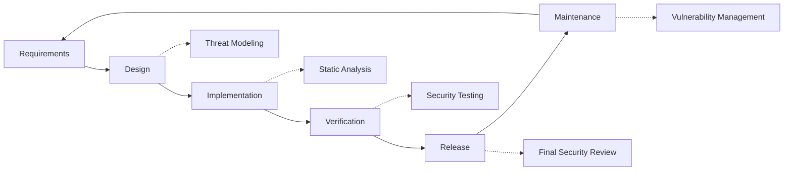

# נהלי אבטחה {#security-practices}

## תוכן העניינים {#table-of-contents}

* [הקדמה](#foreword)
* [אבטחת תשתיות](#infrastructure-security)
  * [מרכזי נתונים מאובטחים](#secure-data-centers)
  * [אבטחת רשת](#network-security)
* [אבטחת דואר אלקטרוני](#email-security)
  * [הצפנה](#encryption)
  * [אימות והרשאות](#authentication-and-authorization)
  * [אמצעי מניעה נגד שימוש לרעה](#anti-abuse-measures)
* [הגנת נתונים](#data-protection)
  * [מזעור נתונים](#data-minimization)
  * [גיבוי ושחזור](#backup-and-recovery)
* [ספקי שירות](#service-providers)
* [ציות וביקורת](#compliance-and-auditing)
  * [הערכות אבטחה שוטפות](#regular-security-assessments)
  * [ציות](#compliance)
* [תגובה לאירועים](#incident-response)
* [מחזור חיי פיתוח אבטחה](#security-development-lifecycle)
* [הקשחת שרתים](#server-hardening)
* [הסכם רמת שירות](#service-level-agreement)
* [אבטחת קוד פתוח](#open-source-security)
* [אבטחת עובדים](#employee-security)
* [שיפור מתמשך](#continuous-improvement)
* [משאבים נוספים](#additional-resources)

## הקדמה {#foreword}

ב-Forward Email, האבטחה היא העדיפות העליונה שלנו. יישמנו אמצעי אבטחה מקיפים כדי להגן על תקשורת הדואר האלקטרוני שלך ועל הנתונים האישיים שלך. מסמך זה מפרט את נהלי האבטחה שלנו ואת הצעדים שאנו נוקטים כדי להבטיח את סודיות, שלמות וזמינות הדואר האלקטרוני שלך.

## אבטחת תשתיות {#infrastructure-security}

### מרכזי נתונים מאובטחים {#secure-data-centers}

התשתית שלנו מתארחת במרכזי נתונים התואמים ל-SOC 2 עם:

* אבטחה פיזית ומעקב 24/7
* בקרות גישה ביומטריות
* מערכות חשמל מיותרות
* גילוי וכיבוי אש מתקדמים
* ניטור סביבתי

### אבטחת רשת {#network-security}

אנו מיישמים שכבות מרובות של אבטחת רשת:

* חומות אש ברמת ארגון עם רשימות בקרת גישה מחמירות
* הגנה והפחתת התקפות DDoS
* סריקות פגיעות רשת סדירות
* מערכות גילוי ומניעת חדירות
* הצפנת תעבורה בין כל נקודות הקצה של השירות
* הגנה מסריקות פורטים עם חסימה אוטומטית של פעילות חשודה

> \[!IMPORTANT]
> כל הנתונים בתנועה מוצפנים באמצעות TLS 1.2+ עם ערכות הצפנה מודרניות.

## אבטחת דואר אלקטרוני {#email-security}

### הצפנה {#encryption}

* **TLS (Transport Layer Security)**: כל תעבורת הדואר האלקטרוני מוצפנת בתנועה באמצעות TLS 1.2 ומעלה
* **הצפנה מקצה לקצה**: תמיכה בסטנדרטים OpenPGP/MIME ו-S/MIME
* **הצפנת אחסון**: כל המיילים המאוחסנים מוצפנים במנוחה באמצעות הצפנת ChaCha20-Poly1305 בקבצי SQLite
* **הצפנת דיסק מלאה**: הצפנת LUKS v2 לכל הדיסק
* **הגנה מקיפה**: אנו מיישמים הצפנה במנוחה, בזיכרון ובתנועה

> \[!NOTE]
> אנו שירות הדואר האלקטרוני הראשון והיחיד בעולם המשתמש ב**[תיבות דואר SQLite מוצפנות באופן אינדיבידואלי ועמידות לקוונטים](https://forwardemail.net/en/blog/docs/best-quantum-safe-encrypted-email-service)**.

### אימות והרשאות {#authentication-and-authorization}

* **חתימת DKIM**: כל המיילים היוצאים חתומים ב-DKIM
* **SPF ו-DMARC**: תמיכה מלאה ב-SPF ו-DMARC למניעת זיוף דואר אלקטרוני
* **MTA-STS**: תמיכה ב-MTA-STS לאכיפת הצפנת TLS
* **אימות רב-שלבי**: זמין לכל גישה לחשבון

### אמצעי מניעה נגד שימוש לרעה {#anti-abuse-measures}

* **סינון ספאם**: זיהוי ספאם רב-שכבתי עם למידת מכונה
* **סריקת וירוסים**: סריקה בזמן אמת של כל הקבצים המצורפים
* **הגבלת קצב**: הגנה מפני התקפות כוח גס וספירה
* **מוניטורינג של מוניטין IP**: מעקב אחר מוניטין כתובת ה-IP השולחת
* **סינון תוכן**: זיהוי כתובות URL זדוניות וניסיונות פישינג

## הגנת נתונים {#data-protection}

### מזעור נתונים {#data-minimization}

אנו פועלים לפי עקרון מזעור הנתונים:

* אנו אוספים רק את הנתונים הנחוצים לספק את השירות שלנו
* תוכן הדואר מעובד בזיכרון ואינו נשמר באופן קבוע אלא אם כן נדרש למשלוח IMAP/POP3
* הלוגים מנותחים ומאוחסנים רק כל עוד נדרש
### גיבוי ושחזור {#backup-and-recovery}

* גיבויים יומיים אוטומטיים עם הצפנה  
* אחסון גיבויים מפוזר גאוגרפית  
* בדיקות שיחזור גיבוי תקופתיות  
* נהלי התאוששות מאסון עם RPO ו-RTO מוגדרים  

## ספקי שירות {#service-providers}

אנו בוחרים בקפידה את ספקי השירות שלנו כדי להבטיח שהם עומדים בסטנדרטים הגבוהים שלנו לאבטחה. להלן הספקים בהם אנו משתמשים להעברת נתונים בינלאומית ומצב ההתאמה שלהם ל-GDPR:

| ספק                                         | מטרה                      | מוסמך DPF    | דף התאמה ל-GDPR                                                                                      |
| ------------------------------------------- | ------------------------- | ------------ | ----------------------------------------------------------------------------------------------------- |
| [Cloudflare](https://www.cloudflare.com)    | CDN, הגנה מפני DDoS, DNS  | ✅ כן         | [Cloudflare GDPR](https://www.cloudflare.com/trust-hub/gdpr/)                                         |
| [DataPacket](https://www.datapacket.com)    | תשתית שרתים               | ❌ לא         | [DataPacket Privacy](https://www.datapacket.com/privacy-policy)                                       |
| [Digital Ocean](https://www.digitalocean.com) | תשתית ענן                 | ❌ לא         | [DigitalOcean GDPR](https://www.digitalocean.com/legal/gdpr)                                          |
| [GitHub](https://github.com)                 | אחסון קוד מקור, CI/CD     | ✅ כן         | [GitHub GDPR](https://docs.github.com/en/site-policy/privacy-policies/github-data-protection-agreement) |
| [Vultr](https://www.vultr.com)               | תשתית ענן                 | ❌ לא         | [Vultr GDPR](https://www.vultr.com/legal/eea-gdpr-privacy/)                                           |
| [Stripe](https://stripe.com)                 | עיבוד תשלומים             | ✅ כן         | [Stripe Privacy Center](https://stripe.com/legal/privacy-center)                                      |
| [PayPal](https://www.paypal.com)             | עיבוד תשלומים             | ❌ לא         | [PayPal Privacy](https://www.paypal.com/uk/legalhub/privacy-full)                                     |

אנו משתמשים בספקים אלו כדי להבטיח אספקת שירות אמינה ובטוחה תוך שמירה על תאימות לתקנות הגנת מידע בינלאומיות. כל העברות הנתונים מתבצעות עם אמצעי הגנה מתאימים לשמירה על המידע האישי שלך.

## תאימות וביקורת {#compliance-and-auditing}

### הערכות אבטחה תקופתיות {#regular-security-assessments}

הצוות שלנו עוקב, בוחן ומעריך באופן קבוע את בסיס הקוד, השרתים, התשתית והנהלים. אנו מיישמים תוכנית אבטחה מקיפה הכוללת:

* סיבוב קבוע של מפתחות SSH  
* ניטור רציף של יומני גישה  
* סריקות אבטחה אוטומטיות  
* ניהול פגיעויות פרואקטיבי  
* הדרכות אבטחה תקופתיות לכל חברי הצוות  

### תאימות {#compliance}

* נהלי טיפול בנתונים התואמים ל-[GDPR](https://forwardemail.net/gdpr)  
* הסכם עיבוד נתונים ([DPA](https://forwardemail.net/dpa)) זמין ללקוחות עסקיים  
* בקרות פרטיות התואמות ל-CCPA  
* תהליכים מבוקרי SOC 2 Type II  

## תגובה לאירועים {#incident-response}

תוכנית התגובה שלנו לאירועי אבטחה כוללת:

1. **זיהוי**: מערכות ניטור והתראה אוטומטיות  
2. **הכנסה לכליאה**: בידוד מיידי של מערכות מושפעות  
3. **הכחדה**: הסרת האיום וניתוח שורש הבעיה  
4. **שחזור**: שיחזור מאובטח של השירותים  
5. **הודעה**: תקשורת בזמן עם המשתמשים המושפעים  
6. **ניתוח לאחר האירוע**: סקירה מקיפה ושיפור  

> \[!WARNING]  
> אם גילית פגיעות אבטחה, אנא דווח עליה מיד ל-<security@forwardemail.net>.

## מחזור חיי פיתוח אבטחה {#security-development-lifecycle}

```mermaid
flowchart LR
    A[Requirements] --> B[Design]
    B --> C[Implementation]
    C --> D[Verification]
    D --> E[Release]
    E --> F[Maintenance]
    F --> A
    B -.-> G[Threat Modeling]
    C -.-> H[Static Analysis]
    D -.-> I[Security Testing]
    E -.-> J[Final Security Review]
    F -.-> K[Vulnerability Management]
```
כל הקוד עובר:

* איסוף דרישות אבטחה
* מודל איומים במהלך התכנון
* שיטות קידוד מאובטחות
* בדיקות אבטחה סטטיות ודינמיות של היישום
* סקירת קוד עם דגש על אבטחה
* סריקת פגיעויות בתלויות

## הקשחת שרת {#server-hardening}

ה[קונפיגורציה של Ansible שלנו](https://github.com/forwardemail/forwardemail.net/tree/master/ansible) מיישמת אמצעי הקשחת שרת רבים:

* **גישה ל-USB מושבתת**: פורטים פיזיים מושבתים על ידי חסימת מודול הליבה usb-storage
* **חוקי חומת אש**: חוקי iptables מחמירים המאפשרים רק חיבורים נחוצים
* **הקשחת SSH**: אימות מבוסס מפתח בלבד, ללא כניסה עם סיסמה, כניסת root מושבתת
* **בידוד שירותים**: כל שירות רץ עם ההרשאות המינימליות הנדרשות
* **עדכונים אוטומטיים**: תיקוני אבטחה מוחלים אוטומטית
* **אתחול מאובטח**: תהליך אתחול מאומת למניעת זיופים
* **הקשחת ליבה**: פרמטרי ליבה מאובטחים וקונפיגורציות sysctl
* **הגבלות מערכת קבצים**: אפשרויות mount noexec, nosuid, ו-nodev במקומות המתאימים
* **הפסקת core dumps**: המערכת מוגדרת למנוע core dumps למען האבטחה
* **השבתת Swap**: זיכרון swap מושבת למניעת דליפת נתונים
* **הגנה מפני סריקת פורטים**: זיהוי וחסימה אוטומטית של ניסיונות סריקת פורטים
* **השבתת Transparent Huge Pages**: THP מושבת לשיפור ביצועים ואבטחה
* **הקשחת שירותי מערכת**: שירותים לא חיוניים כמו Apport מושבתים
* **ניהול משתמשים**: עיקרון ההרשאה המינימלית עם משתמשים נפרדים לפריסה ול-DevOps
* **מגבלות תיאורי קבצים**: הגדלת מגבלות לביצועים ואבטחה טובים יותר

## הסכם רמת שירות {#service-level-agreement}

אנו שומרים על רמת זמינות ואמינות גבוהה של השירות. התשתית שלנו מתוכננת לרדונדנס ועמידות לתקלות כדי להבטיח ששירות הדואר האלקטרוני שלכם יישאר פעיל. למרות שאיננו מפרסמים מסמך SLA פורמלי, אנו מחויבים ל:

* זמינות של 99.9%+ לכל השירותים
* תגובה מהירה להפרעות בשירות
* תקשורת שקופה במהלך תקלות
* תחזוקה סדירה בזמני עומס נמוכים

## אבטחת קוד פתוח {#open-source-security}

כשירות [קוד פתוח](https://github.com/forwardemail/forwardemail.net), האבטחה שלנו נהנית מ:

* קוד שקוף שניתן לבדוק על ידי כל אחד
* שיפורים באבטחה מונחי קהילה
* זיהוי ותיקון מהיר של פגיעויות
* ללא אבטחה באמצעות טשטוש

## אבטחת עובדים {#employee-security}

* בדיקות רקע לכל העובדים
* הדרכות מודעות אבטחה
* עיקרון ההרשאה המינימלית
* חינוך אבטחה סדיר

## שיפור מתמיד {#continuous-improvement}

אנו משפרים ללא הפסקה את עמדת האבטחה שלנו באמצעות:

* מעקב אחר מגמות אבטחה ואיומים מתפתחים
* סקירה ועדכון סדיר של מדיניות האבטחה
* משוב מחוקרי אבטחה ומשתמשים
* השתתפות בקהילת האבטחה

למידע נוסף על שיטות האבטחה שלנו או לדיווח על חששות אבטחה, אנא פנו ל- <security@forwardemail.net>.

## משאבים נוספים {#additional-resources}

* [מדיניות פרטיות](https://forwardemail.net/en/privacy)
* [תנאי שירות](https://forwardemail.net/en/terms)
* [ציות ל-GDPR](https://forwardemail.net/gdpr)
* [הסכם עיבוד נתונים (DPA)](https://forwardemail.net/dpa)
* [דיווח על שימוש לרעה](https://forwardemail.net/en/report-abuse)
* [מדיניות אבטחה](https://github.com/forwardemail/.github/blob/main/SECURITY.md)
* [Security.txt](https://forwardemail.net/security.txt)
* [מאגר GitHub](https://github.com/forwardemail/forwardemail.net)
* [שאלות נפוצות](https://forwardemail.net/en/faq)
