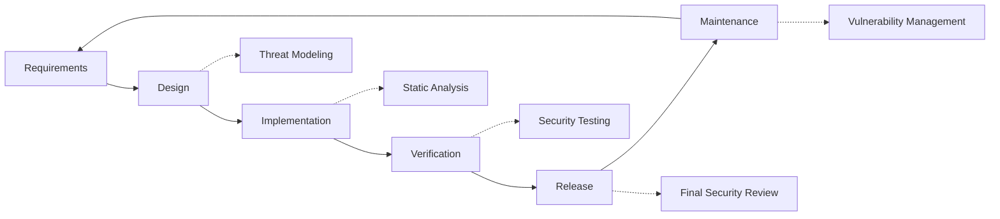

# Biztonsági gyakorlatok {#security-practices}

## Tartalomjegyzék {#table-of-contents}

* [Előszó](#foreword)
* [Infrastruktúra biztonság](#infrastructure-security)
  * [Biztonságos adatközpontok](#secure-data-centers)
  * [Hálózati biztonság](#network-security)
* [E-mail biztonság](#email-security)
  * [Titkosítás](#encryption)
  * [Hitelesítés és engedélyezés](#authentication-and-authorization)
  * [Bántalmazás elleni intézkedések](#anti-abuse-measures)
* [Adatvédelem](#data-protection)
  * [Adatminimalizálás](#data-minimization)
  * [Biztonsági mentés és helyreállítás](#backup-and-recovery)
* [Szolgáltatók](#service-providers)
* [Megfelelőség és auditálás](#compliance-and-auditing)
  * [Rendszeres biztonsági értékelések](#regular-security-assessments)
  * [Megfelelőség](#compliance)
* [Incidensreagálás](#incident-response)
* [Biztonsági fejlesztési életciklus](#security-development-lifecycle)
* [Szerver megerősítése](#server-hardening)
* [Szolgáltatási szintű megállapodás](#service-level-agreement)
* [Nyílt forráskódú biztonság](#open-source-security)
* [Alkalmazotti biztonság](#employee-security)
* [Folyamatos fejlesztés](#continuous-improvement)
* [További források](#additional-resources)

## Előszó {#foreword}

A Forward Emailnél a biztonság a legfontosabb prioritásunk. Átfogó biztonsági intézkedéseket vezettünk be az e-mailes kommunikáció és a személyes adatok védelme érdekében. Ez a dokumentum felvázolja biztonsági gyakorlatunkat és azokat a lépéseket, amelyeket e-mailjei bizalmasságának, integritásának és elérhetőségének biztosítása érdekében teszünk.

## Infrastruktúra biztonság {#infrastructure-security}

### Biztonságos adatközpontok {#secure-data-centers}

Infrastruktúránk SOC 2-kompatibilis adatközpontokban található, a következő helyeken:

* 24/7-es fizikai biztonság és megfigyelés
* Biometrikus hozzáférés-vezérlés
* Redundáns energiaellátó rendszerek
* Fejlett tűzjelzés és -oltás
* Környezeti monitorozás

### Hálózati biztonság {#network-security}

Többszintű hálózati biztonságot valósítunk meg:

* Vállalati szintű tűzfalak szigorú hozzáférés-vezérlési listákkal
* DDoS-védelem és -csökkentés
* Rendszeres hálózati sebezhetőség-vizsgálat
* Behatolásészlelő és -megelőző rendszerek
* Forgalom titkosítása az összes szolgáltatási végpont között
* Portszkennelési védelem a gyanús tevékenységek automatikus blokkolásával

> \[!IMPORTANT]
> Minden átvitt adat TLS 1.2+ titkosítással és modern titkosítócsomagokkal van titkosítva.

## E-mail biztonság {#email-security}

### Titkosítás {#encryption}

* **Transport Layer Security (TLS)**: Az összes e-mail forgalmat TLS 1.2 vagy újabb titkosítással titkosítjuk átvitel közben.
* **Végponttól végpontig terjedő titkosítás**: OpenPGP/MIME és S/MIME szabványok támogatása.
* **Tárolási titkosítás**: Az összes tárolt e-mailt ChaCha20-Poly1305 titkosítással titkosítjuk nyugalmi állapotban az SQLite fájlokban.
* **Teljes lemeztitkosítás**: LUKS v2 titkosítás a teljes lemezre.
* **Átfogó védelem**: Inaktív, memóriában tárolt és átvitel közbeni titkosítást alkalmazunk.

> \[!NOTE]
> Mi vagyunk a világ első és egyetlen e-mail szolgáltatója, amely a **[kvantum-rezisztens és egyedileg titkosított SQLite postaládák](https://forwardemail.net/en/blog/docs/best-quantum-safe-encrypted-email-service)** szolgáltatást használja.

### Hitelesítés és engedélyezés {#authentication-and-authorization}

* **DKIM aláírás**: Minden kimenő e-mail DKIM aláírással van ellátva.
* **SPF és DMARC**: Teljes körű SPF és DMARC támogatás az e-mail-hamisítás megakadályozása érdekében.
* **MTA-STS**: MTA-STS támogatás a TLS titkosítás kikényszerítéséhez.
* **Többtényezős hitelesítés**: Minden fiókhozzáféréshez elérhető.

### Visszaélés elleni intézkedések {#anti-abuse-measures}

* **Spam szűrés**: Többrétegű spamészlelés gépi tanulással
* **Víruskeresés**: Az összes melléklet valós idejű vizsgálata
* **Sebességkorlátozás**: Védelem a nyers erő és a felsorolási támadások ellen
* **IP hírnév**: A küldő IP hírnevének figyelése
* **Tartalomszűrés**: Rosszindulatú URL-ek és adathalász kísérletek észlelése

## Adatvédelem {#data-protection}

### Adatminimalizálás {#data-minimization}

Az adatminimalizálás elvét követjük:

* Csak a szolgáltatásunk nyújtásához szükséges adatokat gyűjtjük.
* Az e-mail tartalmat a memóriában dolgozzuk fel, és nem tároljuk állandó jelleggel, kivéve, ha az IMAP/POP3 kézbesítéshez szükséges.
* A naplókat anonimizáljuk, és csak a szükséges ideig őrzzük meg.

### Biztonsági mentés és helyreállítás {#backup-and-recovery}

* Automatizált napi biztonsági mentések titkosítással
* Földrajzilag elosztott biztonsági mentéstár
* Rendszeres biztonsági mentés-helyreállítási tesztelés
* Katasztrófa utáni helyreállítási eljárások meghatározott RPO-val és RTO-val

## Szolgáltatók {#service-providers}

Szolgáltatóinkat gondosan válogatjuk meg, hogy biztosan megfeleljenek magas biztonsági előírásainknak. Az alábbiakban felsoroljuk a nemzetközi adatátvitelhez igénybe vett szolgáltatóinkat és azok GDPR-megfelelőségi státuszát:

| Szolgáltató | Cél | DPF-tanúsítvánnyal | GDPR megfelelőségi oldal |
| --------------------------------------------- | ------------------------- | ------------- | ----------------------------------------------------------------- |
| [Cloudflare](https://www.cloudflare.com) | CDN, DDoS védelem, DNS | ✅ Igen | [Cloudflare GDPR](https://www.cloudflare.com/trust-hub/gdpr/) |
| [DataPacket](https://www.datapacket.com) | Szerver infrastruktúra | ❌ Nem | [DataPacket Privacy](https://www.datapacket.com/privacy-policy) |
| [Digital Ocean](https://www.digitalocean.com) | Felhőinfrastruktúra | ❌ Nem | [DigitalOcean GDPR](https://www.digitalocean.com/legal/gdpr) |
| [Vultr](https://www.vultr.com) | Felhőinfrastruktúra | ❌ Nem | [Vultr GDPR](https://www.vultr.com/legal/eea-gdpr-privacy/) |
| [Stripe](https://stripe.com) | Fizetésfeldolgozás | ✅ Igen | [Stripe Privacy Center](https://stripe.com/legal/privacy-center) |
| [PayPal](https://www.paypal.com) | Fizetésfeldolgozás | ❌ Nem | [PayPal Privacy](https://www.paypal.com/uk/legalhub/privacy-full) |

Ezeket a szolgáltatókat a megbízható és biztonságos szolgáltatásnyújtás biztosítása érdekében használjuk, miközben betartjuk a nemzetközi adatvédelmi előírásokat. Minden adatátvitelt megfelelő biztosítékok mellett végzünk személyes adatainak védelme érdekében.

## Megfelelőség és auditálás {#compliance-and-auditing}

### Rendszeres biztonsági felmérések {#regular-security-assessments}

Csapatunk rendszeresen figyeli, felülvizsgálja és értékeli a kódbázist, a szervereket, az infrastruktúrát és a gyakorlatokat. Átfogó biztonsági programot vezetünk be, amely a következőket tartalmazza:

* SSH kulcsok rendszeres cseréje
* Hozzáférési naplók folyamatos monitorozása
* Automatizált biztonsági szkennelés
* Proaktív sebezhetőségkezelés
* Rendszeres biztonsági képzés minden csapattag számára

### Megfelelőség {#compliance}

* [GDPR](https://forwardemail.net/gdpr) szabványnak megfelelő adatkezelési gyakorlatok
* [Adatfeldolgozási megállapodás (DPA)](https://forwardemail.net/dpa) üzleti ügyfelek számára elérhető
* CCPA szabványnak megfelelő adatvédelmi szabályozások
* SOC 2 II. típusú auditált folyamatok

## Eseményre adott válasz {#incident-response}

Biztonsági incidensekre vonatkozó elhárítási tervünk a következőket tartalmazza:

1. **Észlelés**: Automatizált monitorozó és riasztórendszerek
2. **Elszigetelés**: Az érintett rendszerek azonnali elszigetelése
3. **Megsemmisítés**: A fenyegetés eltávolítása és a kiváltó ok elemzése
4. **Helyreállítás**: A szolgáltatások biztonságos helyreállítása
5. **Értesítés**: Időbeni kommunikáció az érintett felhasználókkal
6. **Incidens utáni elemzés**: Átfogó felülvizsgálat és fejlesztés

> \[!WARNING]
> Ha biztonsági rést fedez fel, kérjük, azonnal jelentse a <security@forwardemail.net> címen.

## Biztonsági fejlesztési életciklus {#security-development-lifecycle}

Minden kód a következőn megy keresztül:

* Biztonsági követelmények összegyűjtése
* Fenyegetésmodellezés a tervezés során
* Biztonságos kódolási gyakorlatok
* Statikus és dinamikus alkalmazásbiztonsági tesztelés
* Kód áttekintése biztonsági fókuszban
* Függőségek sebezhetőségének vizsgálata

## Szerver megerősítése {#server-hardening}

A [Ansible konfiguráció](https://github.com/forwardemail/forwardemail.net/tree/master/ansible) számos szerverbiztonsági intézkedést valósít meg:

* **USB hozzáférés letiltva**: A fizikai portok letiltásra kerülnek az usb-storage kernel modul feketelistázásával.* **Tűzfal szabályok**: Szigorú iptables szabályok, amelyek csak a szükséges kapcsolatokat engedélyezik.* **SSH megerősítés**: Csak kulcsalapú hitelesítés, jelszóval történő bejelentkezés nélkül, root bejelentkezés letiltva.* **Szolgáltatás elkülönítése**: Minden szolgáltatás minimálisan szükséges jogosultságokkal fut.* **Automatikus frissítések**: A biztonsági javítások automatikusan kerülnek alkalmazásra.* **Biztonságos rendszerindítás**: Ellenőrzött rendszerindítási folyamat a manipuláció megakadályozása érdekében.* **Kernel megerősítés**: Biztonságos kernel paraméterek és sysctl konfigurációk.* **Fájlrendszer-korlátozások**: noexec, nosuid és nodev csatolási opciók, ahol szükséges.* **Alapszintű memóriaképek letiltva**: A rendszer konfigurálva van a biztonsági okokból a lapszintű memóriaképek megakadályozására.* **Csere letiltva**: A swap memória letiltva az adatszivárgás megakadályozása érdekében.* **Portszkennelés elleni védelem**: A portszkennelési kísérletek automatikus észlelése és blokkolása.* **Átlátszó hatalmas oldalak letiltva**: A THP letiltva a jobb teljesítmény és biztonság érdekében.* **Rendszerszolgáltatás-erősítés**: Nem létfontosságú szolgáltatások, mint például az Apport letiltva.* **Felhasználó Felügyelet**: A minimális jogosultságok elve különálló deploy és devops felhasználókkal
* **Fájlleíró korlátok**: Megnövelt korlátok a jobb teljesítmény és biztonság érdekében

## Szolgáltatási szintű megállapodás {#service-level-agreement}

Magas szintű szolgáltatási rendelkezésre állást és megbízhatóságot biztosítunk. Infrastruktúránkat redundanciára és hibatűrésre terveztük, hogy biztosítsuk e-mail szolgáltatása működőképességét. Bár nem teszünk közzé hivatalos SLA-dokumentumot, elkötelezettek vagyunk a következők iránt:

* 99,9%+ rendelkezésre állás minden szolgáltatásra
* Gyors reagálás a szolgáltatáskimaradásokra
* Átlátható kommunikáció incidensek esetén
* Rendszeres karbantartás alacsony forgalmú időszakokban

## Nyílt forráskódú biztonság {#open-source-security}

[nyílt forráskódú szolgáltatás](https://github.com/forwardemail/forwardemail.net) felhasználóként a biztonságunk a következőkből származik:

* Átlátható kód, amelyet bárki auditálhat
* Közösség által vezérelt biztonsági fejlesztések
* A sebezhetőségek gyors azonosítása és javítása
* Nincs biztonság a homályosság miatt

## Alkalmazotti biztonság {#employee-security}

* Minden alkalmazott háttérellenőrzése
* Biztonsági tudatossági képzés
* A legalacsonyabb jogosultságú hozzáférés elve
* Rendszeres biztonsági oktatás

## Folyamatos fejlesztés {#continuous-improvement}

Biztonsági helyzetünket folyamatosan fejlesztjük az alábbiak révén:

* Biztonsági trendek és felmerülő fenyegetések figyelése
* Biztonsági szabályzatok rendszeres felülvizsgálata és frissítése
* Visszajelzések biztonsági kutatóktól és felhasználóktól
* Részvétel a biztonsági közösségben

Biztonsági gyakorlatunkkal kapcsolatos további információkért vagy biztonsági aggályok bejelentéséhez kérjük, vegye fel a kapcsolatot a <security@forwardemail.net> címen.

## További források {#additional-resources}

* [Adatvédelmi irányelvek](https://forwardemail.net/en/privacy)
* [Szolgáltatási feltételek](https://forwardemail.net/en/terms)
* [GDPR-megfelelőség](https://forwardemail.net/gdpr)
* [Adatfeldolgozási megállapodás (DPA)](https://forwardemail.net/dpa)
* [Visszaélés bejelentése](https://forwardemail.net/en/report-abuse)
* [Biztonsági szabályzat](https://github.com/forwardemail/.github/blob/main/SECURITY.md)
* [Security.txt](https://forwardemail.net/security.txt)
* [GitHub adattár](https://github.com/forwardemail/forwardemail.net)
* [FAQ](https://forwardemail.net/en/faq)