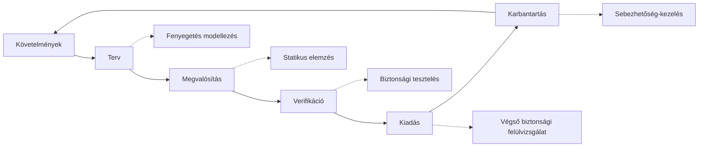

# Biztonsági Gyakorlatok {#security-practices}

## Tartalomjegyzék {#table-of-contents}

* [Előszó](#foreword)
* [Infrastruktúra Biztonság](#infrastructure-security)
  * [Biztonságos Adatközpontok](#secure-data-centers)
  * [Hálózatbiztonság](#network-security)
* [E-mail Biztonság](#email-security)
  * [Titkosítás](#encryption)
  * [Hitelesítés és Jogosultságkezelés](#authentication-and-authorization)
  * [Visszaélés Elleni Intézkedések](#anti-abuse-measures)
* [Adatvédelem](#data-protection)
  * [Adatminimalizálás](#data-minimization)
  * [Biztonsági Mentés és Helyreállítás](#backup-and-recovery)
* [Szolgáltató Partnerek](#service-providers)
* [Megfelelőség és Auditálás](#compliance-and-auditing)
  * [Rendszeres Biztonsági Értékelések](#regular-security-assessments)
  * [Megfelelőség](#compliance)
* [Eseménykezelés](#incident-response)
* [Biztonsági Fejlesztési Életciklus](#security-development-lifecycle)
* [Szerver Megerősítés](#server-hardening)
* [Szolgáltatási Szint Megállapodás](#service-level-agreement)
* [Nyílt Forráskódú Biztonság](#open-source-security)
* [Munkavállalói Biztonság](#employee-security)
* [Folyamatos Fejlesztés](#continuous-improvement)
* [További Források](#additional-resources)

## Előszó {#foreword}

A Forward Email-nél a biztonság a legfontosabb számunkra. Átfogó biztonsági intézkedéseket vezettünk be, hogy megvédjük e-mail kommunikációdat és személyes adataidat. Ez a dokumentum ismerteti biztonsági gyakorlatainkat és azokat a lépéseket, amelyeket a leveleid titkosságának, sértetlenségének és rendelkezésre állásának biztosítása érdekében teszünk.

## Infrastruktúra Biztonság {#infrastructure-security}

### Biztonságos Adatközpontok {#secure-data-centers}

Infrastruktúránk SOC 2 megfelelőséggel rendelkező adatközpontokban van elhelyezve, ahol:

* 0-24 fizikai biztonság és megfigyelés
* Biometrikus beléptető rendszerek
* Redundáns áramellátó rendszerek
* Fejlett tűzérzékelés és oltórendszerek
* Környezeti monitorozás

### Hálózatbiztonság {#network-security}

Többrétegű hálózatbiztonsági megoldásokat alkalmazunk:

* Vállalati szintű tűzfalak szigorú hozzáférés-vezérlési listákkal
* DDoS védelem és enyhítés
* Rendszeres hálózati sérülékenység-ellenőrzés
* Betörésészlelő és megelőző rendszerek
* Forgalom titkosítása az összes szolgáltatási végpont között
* Portszkennelés elleni védelem automatikus gyanús tevékenység blokkolással

> \[!IMPORTANT]
> Az összes átvitt adat TLS 1.2+ protokollal, modern titkosítási csomagokkal van titkosítva.

## E-mail Biztonság {#email-security}

### Titkosítás {#encryption}

* **Transport Layer Security (TLS)**: Minden e-mail forgalom titkosított az átvitel során TLS 1.2 vagy újabb verzióval
* **End-to-End Titkosítás**: Támogatás OpenPGP/MIME és S/MIME szabványokhoz
* **Tárolási Titkosítás**: Minden tárolt e-mail titkosítva van ChaCha20-Poly1305 titkosítással SQLite fájlokban
* **Teljes Lemez Titkosítás**: LUKS v2 titkosítás az egész lemezre
* **Átfogó Védelem**: Alkalmazunk titkosítást tároláskor, memóriában és átvitel közben is

> \[!NOTE]
> Mi vagyunk a világ első és egyetlen e-mail szolgáltatója, amely **[kvantumbiztos és egyénileg titkosított SQLite postaládákat](https://forwardemail.net/en/blog/docs/best-quantum-safe-encrypted-email-service)** használ.

### Hitelesítés és Jogosultságkezelés {#authentication-and-authorization}

* **DKIM aláírás**: Minden kimenő e-mail DKIM-mel aláírt
* **SPF és DMARC**: Teljes támogatás az SPF és DMARC szabványokhoz az e-mail hamisítás megelőzésére
* **MTA-STS**: Támogatás az MTA-STS-hez a TLS titkosítás érvényesítéséhez
* **Többfaktoros Hitelesítés**: Elérhető minden fiókhoz

### Visszaélés Elleni Intézkedések {#anti-abuse-measures}

* **Spam Szűrés**: Többrétegű spam felismerés gépi tanulással
* **Vírusellenőrzés**: Minden csatolmány valós idejű vizsgálata
* **Korlátozások**: Védelem brute force és feltérképező támadások ellen
* **IP Hírnév**: Küldő IP címek hírnevének figyelése
* **Tartalomszűrés**: Rosszindulatú URL-ek és adathalász kísérletek felismerése

## Adatvédelem {#data-protection}

### Adatminimalizálás {#data-minimization}

Az adatminimalizálás elvét követjük:

* Csak azokat az adatokat gyűjtjük, amelyek a szolgáltatásunk nyújtásához szükségesek
* Az e-mail tartalmakat memóriában dolgozzuk fel, és csak akkor tároljuk tartósan, ha az IMAP/POP3 kézbesítéshez szükséges
* A naplókat anonimizáljuk, és csak a szükséges ideig őrizzük meg
### Biztonsági mentés és helyreállítás {#backup-and-recovery}

* Automatikus napi biztonsági mentések titkosítással
* Földrajzilag elosztott biztonsági mentési tárolás
* Rendszeres biztonsági mentés helyreállítási tesztek
* Katasztrófa utáni helyreállítási eljárások meghatározott RPO és RTO értékekkel

## Szolgáltatók {#service-providers}

Gondosan választjuk ki szolgáltatóinkat, hogy megfeleljenek magas biztonsági követelményeinknek. Az alábbiakban a nemzetközi adatátvitelhez használt szolgáltatóink és GDPR megfelelőségi státuszuk található:

| Szolgáltató                                   | Cél                        | DPF Tanúsított | GDPR Megfelelőségi oldal                                                                                 |
| --------------------------------------------- | -------------------------- | -------------- | ------------------------------------------------------------------------------------------------------- |
| [Cloudflare](https://www.cloudflare.com)      | CDN, DDoS védelem, DNS     | ✅ Igen         | [Cloudflare GDPR](https://www.cloudflare.com/trust-hub/gdpr/)                                           |
| [DataPacket](https://www.datapacket.com)      | Szerver infrastruktúra     | ❌ Nem         | [DataPacket Adatvédelem](https://www.datapacket.com/privacy-policy)                                     |
| [Digital Ocean](https://www.digitalocean.com) | Felhő infrastruktúra       | ❌ Nem         | [DigitalOcean GDPR](https://www.digitalocean.com/legal/gdpr)                                            |
| [GitHub](https://github.com)                  | Forráskód tárolás, CI/CD   | ✅ Igen         | [GitHub GDPR](https://docs.github.com/en/site-policy/privacy-policies/github-data-protection-agreement) |
| [Vultr](https://www.vultr.com)                | Felhő infrastruktúra       | ❌ Nem         | [Vultr GDPR](https://www.vultr.com/legal/eea-gdpr-privacy/)                                             |
| [Stripe](https://stripe.com)                  | Fizetésfeldolgozás         | ✅ Igen         | [Stripe Adatvédelmi Központ](https://stripe.com/legal/privacy-center)                                   |
| [PayPal](https://www.paypal.com)              | Fizetésfeldolgozás         | ❌ Nem         | [PayPal Adatvédelem](https://www.paypal.com/uk/legalhub/privacy-full)                                   |

Ezeket a szolgáltatókat használjuk a megbízható, biztonságos szolgáltatásnyújtás biztosítására, miközben megfelelünk a nemzetközi adatvédelmi előírásoknak. Minden adatátvitel megfelelő védelmi intézkedésekkel történik személyes adatai védelme érdekében.

## Megfelelőség és auditálás {#compliance-and-auditing}

### Rendszeres biztonsági értékelések {#regular-security-assessments}

Csapatunk rendszeresen figyelemmel kíséri, felülvizsgálja és értékeli a kódbázist, szervereket, infrastruktúrát és gyakorlatokat. Átfogó biztonsági programot valósítunk meg, amely magában foglalja:

* SSH kulcsok rendszeres cseréje
* Hozzáférési naplók folyamatos figyelése
* Automatikus biztonsági szkennelés
* Proaktív sebezhetőség-kezelés
* Rendszeres biztonsági képzés minden csapattag számára

### Megfelelőség {#compliance}

* [GDPR](https://forwardemail.net/gdpr) szerinti adatkezelési gyakorlatok
* [Adatfeldolgozási Megállapodás (DPA)](https://forwardemail.net/dpa) elérhető üzleti ügyfelek számára
* CCPA kompatibilis adatvédelmi szabályozások
* SOC 2 Type II auditált folyamatok

## Eseménykezelés {#incident-response}

Biztonsági eseménykezelési tervünk tartalmazza:

1. **Észlelés**: Automatikus megfigyelő és riasztó rendszerek
2. **Elzárás**: Az érintett rendszerek azonnali izolálása
3. **Eltávolítás**: A fenyegetés megszüntetése és okok elemzése
4. **Helyreállítás**: Szolgáltatások biztonságos visszaállítása
5. **Értesítés**: Időben történő kommunikáció az érintett felhasználókkal
6. **Esemény utáni elemzés**: Átfogó felülvizsgálat és fejlesztés

> \[!WARNING]
> Ha biztonsági sebezhetőséget fedez fel, kérjük, azonnal jelentse a <security@forwardemail.net> címre.

## Biztonsági fejlesztési életciklus {#security-development-lifecycle}

```mermaid
flowchart LR
    A[Követelmények] --> B[Terv]
    B --> C[Megvalósítás]
    C --> D[Verifikáció]
    D --> E[Kiadás]
    E --> F[Karbantartás]
    F --> A
    B -.-> G[Fenyegetés modellezés]
    C -.-> H[Statikus elemzés]
    D -.-> I[Biztonsági tesztelés]
    E -.-> J[Végső biztonsági felülvizsgálat]
    F -.-> K[Sebezhetőség-kezelés]
```
Minden kód átesik a következő folyamatokon:

* Biztonsági követelmények összegyűjtése
* Fenyegetésmodellezés a tervezés során
* Biztonságos kódolási gyakorlatok
* Statikus és dinamikus alkalmazásbiztonsági tesztelés
* Biztonságra fókuszáló kódáttekintés
* Függőség sebezhetőség vizsgálat

## Szerver megerősítése {#server-hardening}

A mi [Ansible konfigurációnk](https://github.com/forwardemail/forwardemail.net/tree/master/ansible) számos szerver megerősítési intézkedést valósít meg:

* **USB hozzáférés letiltva**: A fizikai portok le vannak tiltva az usb-storage kernel modul feketelistára tételével
* **Tűzfal szabályok**: Szigorú iptables szabályok, amelyek csak a szükséges kapcsolatok engedélyeznek
* **SSH megerősítés**: Csak kulcs alapú hitelesítés, jelszavas bejelentkezés tiltva, root bejelentkezés letiltva
* **Szolgáltatás izoláció**: Minden szolgáltatás minimálisan szükséges jogosultságokkal fut
* **Automatikus frissítések**: Biztonsági javítások automatikusan alkalmazva
* **Biztonságos indítás**: Ellenőrzött indítási folyamat a manipuláció megakadályozására
* **Kernel megerősítés**: Biztonságos kernel paraméterek és sysctl konfigurációk
* **Fájlrendszer korlátozások**: noexec, nosuid és nodev csatolási opciók ahol szükséges
* **Core dumpok letiltva**: A rendszer úgy van konfigurálva, hogy megakadályozza a core dumpokat biztonsági okokból
* **Swap letiltva**: Swap memória letiltva az adat szivárgás megakadályozására
* **Port szkennelés elleni védelem**: Automatikus port szkennelési kísérletek felismerése és blokkolása
* **Átlátszó nagy oldalak letiltva**: THP letiltva a jobb teljesítmény és biztonság érdekében
* **Rendszerszolgáltatások megerősítése**: Nem alapvető szolgáltatások, mint az Apport letiltva
* **Felhasználókezelés**: A legkisebb jogosultság elve, külön deploy és devops felhasználókkal
* **Fájlleíró korlátok**: Megnövelt korlátok a jobb teljesítmény és biztonság érdekében

## Szolgáltatási szint megállapodás {#service-level-agreement}

Magas szintű szolgáltatás elérhetőséget és megbízhatóságot tartunk fenn. Infrastruktúránk redundanciára és hibabiztosságra van tervezve, hogy az e-mail szolgáltatásod folyamatosan működjön. Bár nem teszünk közzé hivatalos SLA dokumentumot, elkötelezettek vagyunk a következők iránt:

* 99,9%+ rendelkezésre állás minden szolgáltatás esetén
* Gyors reagálás szolgáltatáskimaradások esetén
* Átlátható kommunikáció incidensek alatt
* Rendszeres karbantartás alacsony forgalmú időszakokban

## Nyílt forráskódú biztonság {#open-source-security}

Mint egy [nyílt forráskódú szolgáltatás](https://github.com/forwardemail/forwardemail.net), biztonságunk előnyei:

* Átlátható kód, amelyet bárki auditálhat
* Közösség által vezérelt biztonsági fejlesztések
* Sebezhetőségek gyors azonosítása és javítása
* Nincs biztonság a homályban

## Munkavállalói biztonság {#employee-security}

* Háttérellenőrzések minden munkavállalónál
* Biztonságtudatossági képzés
* A legkisebb jogosultság elve
* Rendszeres biztonsági oktatás

## Folyamatos fejlesztés {#continuous-improvement}

Folyamatosan javítjuk biztonsági helyzetünket a következők révén:

* Biztonsági trendek és új fenyegetések figyelése
* Biztonsági irányelvek rendszeres felülvizsgálata és frissítése
* Visszajelzések biztonsági kutatóktól és felhasználóktól
* Részvétel a biztonsági közösségben

További információkért biztonsági gyakorlatainkról vagy biztonsági aggályok jelentéséhez kérjük, lépj kapcsolatba a <security@forwardemail.net> címen.

## További források {#additional-resources}

* [Adatvédelmi irányelvek](https://forwardemail.net/en/privacy)
* [Szolgáltatási feltételek](https://forwardemail.net/en/terms)
* [GDPR megfelelés](https://forwardemail.net/gdpr)
* [Adatfeldolgozási megállapodás (DPA)](https://forwardemail.net/dpa)
* [Visszaélés jelentése](https://forwardemail.net/en/report-abuse)
* [Biztonsági irányelvek](https://github.com/forwardemail/.github/blob/main/SECURITY.md)
* [Security.txt](https://forwardemail.net/security.txt)
* [GitHub tárhely](https://github.com/forwardemail/forwardemail.net)
* [GYIK](https://forwardemail.net/en/faq)
