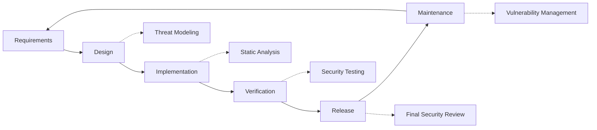

# Praktik Keamanan {#security-practices}

## Daftar Isi {#table-of-contents}

* [Kata pengantar](#foreword)
* [Keamanan Infrastruktur](#infrastructure-security)
  * [Pusat Data Aman](#secure-data-centers)
  * [Keamanan Jaringan](#network-security)
* [Keamanan Email](#email-security)
  * [Enkripsi](#encryption)
  * [Autentikasi dan Otorisasi](#authentication-and-authorization)
  * [Langkah-langkah Anti-Penyalahgunaan](#anti-abuse-measures)
* [Perlindungan Data](#data-protection)
  * [Minimalisasi Data](#data-minimization)
  * [Pencadangan dan Pemulihan](#backup-and-recovery)
* [Penyedia Layanan](#service-providers)
* [Kepatuhan dan Audit](#compliance-and-auditing)
  * [Penilaian Keamanan Reguler](#regular-security-assessments)
  * [Kepatuhan](#compliance)
* [Respon Insiden](#incident-response)
* [Siklus Pengembangan Keamanan](#security-development-lifecycle)
* [Pengerasan Server](#server-hardening)
* [Perjanjian Tingkat Layanan](#service-level-agreement)
* [Keamanan Sumber Terbuka](#open-source-security)
* [Keamanan Karyawan](#employee-security)
* [Peningkatan Berkelanjutan](#continuous-improvement)
* [Sumber Daya Tambahan](#additional-resources)

## Kata Pengantar {#foreword}

Di Forward Email, keamanan adalah prioritas utama kami. Kami telah menerapkan langkah-langkah keamanan yang komprehensif untuk melindungi komunikasi email dan data pribadi Anda. Dokumen ini menguraikan praktik keamanan kami dan langkah-langkah yang kami ambil untuk memastikan kerahasiaan, integritas, dan ketersediaan email Anda.

## Keamanan Infrastruktur {#infrastructure-security}

### Pusat Data Aman {#secure-data-centers}

Infrastruktur kami dihosting di pusat data yang sesuai SOC 2 dengan:

* Keamanan dan pengawasan fisik 24/7
* Kontrol akses biometrik
* Sistem daya redundan
* Deteksi dan pemadaman kebakaran tingkat lanjut
* Pemantauan lingkungan

### Keamanan Jaringan {#network-security}

Kami menerapkan beberapa lapisan keamanan jaringan:

* Firewall tingkat perusahaan dengan daftar kontrol akses yang ketat
* Perlindungan dan mitigasi DDoS
* Pemindaian kerentanan jaringan secara berkala
* Sistem deteksi dan pencegahan intrusi
* Enkripsi lalu lintas antara semua titik akhir layanan
* Perlindungan pemindaian port dengan pemblokiran otomatis aktivitas mencurigakan

> \[!IMPORTANT]
> All data in transit is encrypted using TLS 1.2+ with modern cipher suites.

## Keamanan Email {#email-security}

### Enkripsi {#encryption}

* **Transport Layer Security (TLS)**: Semua lalu lintas email dienkripsi saat transit menggunakan TLS 1.2 atau yang lebih tinggi
* **Enkripsi Ujung-ke-Ujung**: Dukungan untuk standar OpenPGP/MIME dan S/MIME
* **Enkripsi Penyimpanan**: Semua email yang disimpan dienkripsi saat tidak aktif menggunakan enkripsi ChaCha20-Poly1305 dalam file SQLite
* **Enkripsi Cakram Penuh**: Enkripsi LUKS v2 untuk seluruh cakram
* **Perlindungan Komprehensif**: Kami menerapkan enkripsi saat tidak aktif, enkripsi dalam memori, dan enkripsi saat transit

> \[!NOTE]
> We're the world's first and only email service to use **[quantum-resistant and individually encrypted SQLite mailboxes](https://forwardemail.net/en/blog/docs/best-quantum-safe-encrypted-email-service)**.

### Autentikasi dan Otorisasi {#authentication-and-authorization}

* **Penandatanganan DKIM**: Semua email keluar ditandatangani dengan DKIM
* **SPF dan DMARC**: Dukungan penuh untuk SPF dan DMARC guna mencegah spoofing email
* **MTA-STS**: Dukungan untuk MTA-STS guna menerapkan enkripsi TLS
* **Autentikasi Multi-Faktor**: Tersedia untuk semua akses akun

### Langkah-Langkah Anti-Penyalahgunaan {#anti-abuse-measures}

* **Penyaringan Spam**: Deteksi spam berlapis-lapis dengan pembelajaran mesin
* **Pemindaian Virus**: Pemindaian semua lampiran secara real-time
* **Pembatasan Kecepatan**: Perlindungan terhadap serangan brute force dan enumerasi
* **Reputasi IP**: Pemantauan reputasi IP pengirim
* **Penyaringan Konten**: Deteksi URL berbahaya dan upaya phishing

## Perlindungan Data {#data-protection}

### Minimalisasi Data {#data-minimization}

Kami mengikuti prinsip minimalisasi data:

* Kami hanya mengumpulkan data yang diperlukan untuk menyediakan layanan kami
* Konten email diproses dalam memori dan tidak disimpan secara terus-menerus kecuali diperlukan untuk pengiriman IMAP/POP3
* Log dianonimkan dan disimpan hanya selama diperlukan

### Pencadangan dan Pemulihan {#backup-and-recovery}

* Pencadangan harian otomatis dengan enkripsi
* Penyimpanan cadangan yang tersebar secara geografis
* Pengujian pemulihan cadangan secara berkala
* Prosedur pemulihan bencana dengan RPO dan RTO yang ditentukan

## Penyedia Layanan {#service-providers}

Kami memilih penyedia layanan kami dengan cermat untuk memastikan mereka memenuhi standar keamanan tinggi kami. Berikut adalah penyedia yang kami gunakan untuk transfer data internasional dan status kepatuhan GDPR mereka:

| Penyedia | Tujuan | Bersertifikat DPF | Halaman Kepatuhan GDPR |
| --------------------------------------------- | ------------------------- | ------------- | ----------------------------------------------------------------- |
| [Cloudflare](https://www.cloudflare.com) | CDN, perlindungan DDoS, DNS | ✅ Ya | [Cloudflare GDPR](https://www.cloudflare.com/trust-hub/gdpr/) |
| [DataPacket](https://www.datapacket.com) | Infrastruktur server | ❌ Tidak | [DataPacket Privacy](https://www.datapacket.com/privacy-policy) |
| [Digital Ocean](https://www.digitalocean.com) | Infrastruktur awan | ❌ Tidak | [DigitalOcean GDPR](https://www.digitalocean.com/legal/gdpr) |
| [Vultr](https://www.vultr.com) | Infrastruktur awan | ❌ Tidak | [Vultr GDPR](https://www.vultr.com/legal/eea-gdpr-privacy/) |
| [Stripe](https://stripe.com) | Pemrosesan pembayaran | ✅ Ya | [Stripe Privacy Center](https://stripe.com/legal/privacy-center) |
| [PayPal](https://www.paypal.com) | Pemrosesan pembayaran | ❌ Tidak | [PayPal Privacy](https://www.paypal.com/uk/legalhub/privacy-full) |

Kami menggunakan penyedia ini untuk memastikan pengiriman layanan yang andal dan aman sekaligus mematuhi peraturan perlindungan data internasional. Semua transfer data dilakukan dengan perlindungan yang tepat untuk melindungi informasi pribadi Anda.

## Kepatuhan dan Audit {#compliance-and-auditing}

### Penilaian Keamanan Reguler {#regular-security-assessments}

Tim kami secara teratur memantau, meninjau, dan menilai basis kode, server, infrastruktur, dan praktik. Kami menerapkan program keamanan komprehensif yang mencakup:

* Rotasi kunci SSH secara berkala
* Pemantauan log akses secara terus-menerus
* Pemindaian keamanan otomatis
* Manajemen kerentanan proaktif
* Pelatihan keamanan rutin untuk semua anggota tim

### Kepatuhan {#compliance}

* Praktik penanganan data yang sesuai dengan [GDPR](https://forwardemail.net/gdpr)
* [Perjanjian Pemrosesan Data (DPA)](https://forwardemail.net/dpa) tersedia untuk pelanggan bisnis
* Kontrol privasi yang sesuai dengan CCPA
* Proses yang diaudit SOC 2 Tipe II

## Respons Insiden {#incident-response}

Rencana respons insiden keamanan kami meliputi:

1. **Deteksi**: Sistem pemantauan dan peringatan otomatis
2. **Penahanan**: Isolasi segera terhadap sistem yang terdampak
3. **Pemberantasan**: Penghapusan ancaman dan analisis akar penyebab
4. **Pemulihan**: Pemulihan layanan yang aman
5. **Pemberitahuan**: Komunikasi tepat waktu dengan pengguna yang terdampak
6. **Analisis pascainsiden**: Tinjauan dan perbaikan menyeluruh

> \[!WARNING]
> If you discover a security vulnerability, please report it immediately to <security@forwardemail.net>.

## Siklus Pengembangan Keamanan {#security-development-lifecycle}

Semua kode mengalami:

* Pengumpulan persyaratan keamanan
* Pemodelan ancaman selama desain
* Praktik pengkodean yang aman
* Pengujian keamanan aplikasi statis dan dinamis
* Tinjauan kode dengan fokus keamanan
* Pemindaian kerentanan ketergantungan

## Pengerasan Server {#server-hardening}

[Konfigurasi Ansible](https://github.com/forwardemail/forwardemail.net/tree/master/ansible) kami menerapkan sejumlah langkah penguatan server:

* **Akses USB Dinonaktifkan**: Port fisik dinonaktifkan dengan memasukkan modul kernel usb-storage ke daftar hitam
* **Aturan Firewall**: Aturan iptables yang ketat hanya mengizinkan koneksi yang diperlukan
* **Pengerasan SSH**: Hanya autentikasi berbasis kunci, tidak ada login kata sandi, login root dinonaktifkan
* **Isolasi Layanan**: Setiap layanan berjalan dengan hak istimewa minimal yang diperlukan
* **Pembaruan Otomatis**: Patch keamanan diterapkan secara otomatis
* **Boot Aman**: Proses boot terverifikasi untuk mencegah gangguan
* **Pengerasan Kernel**: Parameter kernel aman dan konfigurasi sysctl
* **Pembatasan Sistem Berkas**: Opsi pemasangan noexec, nosuid, dan nodev jika sesuai
* **Core Dumps Dinonaktifkan**: Sistem dikonfigurasi untuk mencegah core dumps demi keamanan
* **Swap Dinonaktifkan**: Memori swap dinonaktifkan untuk mencegah kebocoran data
* **Perlindungan Pemindaian Port**: Deteksi dan pemblokiran otomatis upaya pemindaian port
* **Halaman Besar Transparan Dinonaktifkan**: THP dinonaktifkan demi peningkatan kinerja dan keamanan
* **Layanan Sistem Pengerasan**: Layanan yang tidak penting seperti Apport dinonaktifkan
* **Manajemen Pengguna**: Prinsip hak istimewa paling rendah dengan pengguna deploy dan devops yang terpisah
* **Batas Deskriptor File**: Peningkatan batas untuk kinerja dan keamanan yang lebih baik

## Perjanjian Tingkat Layanan {#service-level-agreement}

Kami menjaga ketersediaan dan keandalan layanan pada tingkat tinggi. Infrastruktur kami dirancang untuk redundansi dan toleransi kesalahan guna memastikan layanan email Anda tetap beroperasi. Meskipun kami tidak menerbitkan dokumen SLA formal, kami berkomitmen untuk:

* Uptime 99,9%+ untuk semua layanan
* Respons cepat terhadap gangguan layanan
* Komunikasi transparan selama insiden
* Perawatan rutin selama periode lalu lintas rendah

## Keamanan Sumber Terbuka {#open-source-security}

Sebagai [layanan sumber terbuka](https://github.com/forwardemail/forwardemail.net), keamanan kami mendapat manfaat dari:

* Kode transparan yang dapat diaudit oleh siapa saja
* Peningkatan keamanan yang digerakkan oleh komunitas
* Identifikasi dan perbaikan kerentanan yang cepat
* Tidak ada keamanan melalui ketidakjelasan

## Keamanan Karyawan {#employee-security}

* Pemeriksaan latar belakang untuk semua karyawan
* Pelatihan kesadaran keamanan
* Prinsip akses dengan hak istimewa paling rendah
* Pendidikan keamanan rutin

## Peningkatan Berkelanjutan {#continuous-improvement}

Kami terus meningkatkan postur keamanan kami melalui:

* Pemantauan tren keamanan dan ancaman yang muncul
* Tinjauan dan pembaruan rutin terhadap kebijakan keamanan
* Umpan balik dari peneliti dan pengguna keamanan
* Partisipasi dalam komunitas keamanan

Untuk informasi lebih lanjut tentang praktik keamanan kami atau untuk melaporkan masalah keamanan, silakan hubungi <security@forwardemail.net>.

## Sumber Daya Tambahan {#additional-resources}

* [Kebijakan Privasi](https://forwardemail.net/en/privacy)
* [Ketentuan Layanan](https://forwardemail.net/en/terms)
* [Kepatuhan GDPR](https://forwardemail.net/gdpr)
* [Perjanjian Pemrosesan Data (DPA)](https://forwardemail.net/dpa)
* [Laporkan Penyalahgunaan](https://forwardemail.net/en/report-abuse)
* [Kebijakan Keamanan](https://github.com/forwardemail/.github/blob/main/SECURITY.md)
* [Security.txt](https://forwardemail.net/security.txt)
* [Repositori GitHub](https://github.com/forwardemail/forwardemail.net)
* [FAQ](https://forwardemail.net/en/faq)