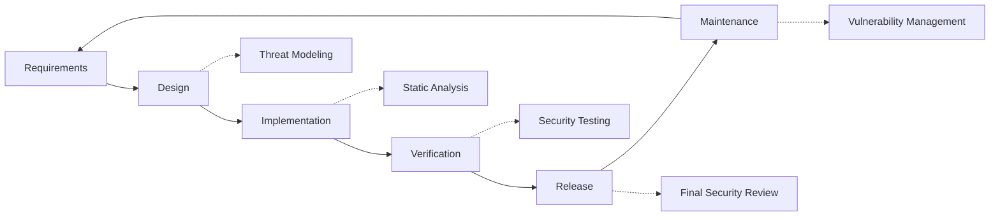

# Praktik Keamanan {#security-practices}

## Daftar Isi {#table-of-contents}

* [Kata Pengantar](#foreword)
* [Keamanan Infrastruktur](#infrastructure-security)
  * [Pusat Data yang Aman](#secure-data-centers)
  * [Keamanan Jaringan](#network-security)
* [Keamanan Email](#email-security)
  * [Enkripsi](#encryption)
  * [Otentikasi dan Otorisasi](#authentication-and-authorization)
  * [Langkah Anti-Penyalahgunaan](#anti-abuse-measures)
* [Perlindungan Data](#data-protection)
  * [Minimisasi Data](#data-minimization)
  * [Cadangan dan Pemulihan](#backup-and-recovery)
* [Penyedia Layanan](#service-providers)
* [Kepatuhan dan Audit](#compliance-and-auditing)
  * [Penilaian Keamanan Berkala](#regular-security-assessments)
  * [Kepatuhan](#compliance)
* [Tanggap Insiden](#incident-response)
* [Siklus Hidup Pengembangan Keamanan](#security-development-lifecycle)
* [Penguatan Server](#server-hardening)
* [Perjanjian Tingkat Layanan](#service-level-agreement)
* [Keamanan Open Source](#open-source-security)
* [Keamanan Karyawan](#employee-security)
* [Perbaikan Berkelanjutan](#continuous-improvement)
* [Sumber Daya Tambahan](#additional-resources)

## Kata Pengantar {#foreword}

Di Forward Email, keamanan adalah prioritas utama kami. Kami telah menerapkan langkah-langkah keamanan yang komprehensif untuk melindungi komunikasi email dan data pribadi Anda. Dokumen ini menjelaskan praktik keamanan kami dan langkah-langkah yang kami ambil untuk memastikan kerahasiaan, integritas, dan ketersediaan email Anda.

## Keamanan Infrastruktur {#infrastructure-security}

### Pusat Data yang Aman {#secure-data-centers}

Infrastruktur kami dihosting di pusat data yang mematuhi SOC 2 dengan:

* Keamanan fisik dan pengawasan 24/7
* Kontrol akses biometrik
* Sistem daya cadangan
* Deteksi dan penanggulangan kebakaran canggih
* Pemantauan lingkungan

### Keamanan Jaringan {#network-security}

Kami menerapkan beberapa lapisan keamanan jaringan:

* Firewall kelas perusahaan dengan daftar kontrol akses yang ketat
* Perlindungan dan mitigasi DDoS
* Pemindaian kerentanan jaringan secara rutin
* Sistem deteksi dan pencegahan intrusi
* Enkripsi lalu lintas antara semua titik layanan
* Perlindungan pemindaian port dengan pemblokiran otomatis aktivitas mencurigakan

> \[!IMPORTANT]
> Semua data dalam perjalanan dienkripsi menggunakan TLS 1.2+ dengan suite cipher modern.

## Keamanan Email {#email-security}

### Enkripsi {#encryption}

* **Transport Layer Security (TLS)**: Semua lalu lintas email dienkripsi saat transit menggunakan TLS 1.2 atau lebih tinggi
* **Enkripsi End-to-End**: Mendukung standar OpenPGP/MIME dan S/MIME
* **Enkripsi Penyimpanan**: Semua email yang disimpan dienkripsi saat diam menggunakan enkripsi ChaCha20-Poly1305 dalam file SQLite
* **Enkripsi Disk Penuh**: Enkripsi LUKS v2 untuk seluruh disk
* **Perlindungan Komprehensif**: Kami menerapkan enkripsi saat penyimpanan, enkripsi dalam memori, dan enkripsi saat transit

> \[!NOTE]
> Kami adalah layanan email pertama dan satu-satunya di dunia yang menggunakan **[kotak surat SQLite terenkripsi secara individual dan tahan kuantum](https://forwardemail.net/en/blog/docs/best-quantum-safe-encrypted-email-service)**.

### Otentikasi dan Otorisasi {#authentication-and-authorization}

* **Penandatanganan DKIM**: Semua email keluar ditandatangani dengan DKIM
* **SPF dan DMARC**: Dukungan penuh untuk SPF dan DMARC untuk mencegah pemalsuan email
* **MTA-STS**: Dukungan untuk MTA-STS untuk menegakkan enkripsi TLS
* **Otentikasi Multi-Faktor**: Tersedia untuk semua akses akun

### Langkah Anti-Penyalahgunaan {#anti-abuse-measures}

* **Penyaringan Spam**: Deteksi spam berlapis dengan pembelajaran mesin
* **Pemindaian Virus**: Pemindaian real-time untuk semua lampiran
* **Pembatasan Laju**: Perlindungan terhadap serangan brute force dan enumerasi
* **Reputasi IP**: Pemantauan reputasi IP pengirim
* **Penyaringan Konten**: Deteksi URL berbahaya dan upaya phishing

## Perlindungan Data {#data-protection}

### Minimisasi Data {#data-minimization}

Kami mengikuti prinsip minimisasi data:

* Kami hanya mengumpulkan data yang diperlukan untuk menyediakan layanan kami
* Konten email diproses dalam memori dan tidak disimpan secara permanen kecuali diperlukan untuk pengiriman IMAP/POP3
* Log dianonimkan dan disimpan hanya selama diperlukan
### Cadangan dan Pemulihan {#backup-and-recovery}

* Cadangan harian otomatis dengan enkripsi
* Penyimpanan cadangan yang didistribusikan secara geografis
* Pengujian pemulihan cadangan secara berkala
* Prosedur pemulihan bencana dengan RPO dan RTO yang ditentukan

## Penyedia Layanan {#service-providers}

Kami memilih penyedia layanan dengan cermat untuk memastikan mereka memenuhi standar keamanan tinggi kami. Berikut adalah penyedia yang kami gunakan untuk transfer data internasional dan status kepatuhan GDPR mereka:

| Penyedia                                      | Tujuan                     | Bersertifikat DPF | Halaman Kepatuhan GDPR                                                                                   |
| --------------------------------------------- | -------------------------- | ----------------- | ------------------------------------------------------------------------------------------------------- |
| [Cloudflare](https://www.cloudflare.com)      | CDN, perlindungan DDoS, DNS| ✅ Ya             | [Cloudflare GDPR](https://www.cloudflare.com/trust-hub/gdpr/)                                           |
| [DataPacket](https://www.datapacket.com)      | Infrastruktur server       | ❌ Tidak          | [DataPacket Privacy](https://www.datapacket.com/privacy-policy)                                         |
| [Digital Ocean](https://www.digitalocean.com) | Infrastruktur cloud        | ❌ Tidak          | [DigitalOcean GDPR](https://www.digitalocean.com/legal/gdpr)                                            |
| [GitHub](https://github.com)                  | Hosting kode sumber, CI/CD | ✅ Ya             | [GitHub GDPR](https://docs.github.com/en/site-policy/privacy-policies/github-data-protection-agreement) |
| [Vultr](https://www.vultr.com)                | Infrastruktur cloud        | ❌ Tidak          | [Vultr GDPR](https://www.vultr.com/legal/eea-gdpr-privacy/)                                             |
| [Stripe](https://stripe.com)                  | Pemrosesan pembayaran      | ✅ Ya             | [Stripe Privacy Center](https://stripe.com/legal/privacy-center)                                        |
| [PayPal](https://www.paypal.com)              | Pemrosesan pembayaran      | ❌ Tidak          | [PayPal Privacy](https://www.paypal.com/uk/legalhub/privacy-full)                                       |

Kami menggunakan penyedia ini untuk memastikan pengiriman layanan yang andal dan aman sambil menjaga kepatuhan terhadap peraturan perlindungan data internasional. Semua transfer data dilakukan dengan perlindungan yang sesuai untuk melindungi informasi pribadi Anda.

## Kepatuhan dan Audit {#compliance-and-auditing}

### Penilaian Keamanan Berkala {#regular-security-assessments}

Tim kami secara rutin memantau, meninjau, dan menilai basis kode, server, infrastruktur, dan praktik. Kami menerapkan program keamanan komprehensif yang mencakup:

* Rotasi kunci SSH secara berkala
* Pemantauan terus-menerus terhadap log akses
* Pemindaian keamanan otomatis
* Manajemen kerentanan proaktif
* Pelatihan keamanan rutin untuk semua anggota tim

### Kepatuhan {#compliance}

* Praktik penanganan data yang sesuai dengan [GDPR](https://forwardemail.net/gdpr)
* [Perjanjian Pemrosesan Data (DPA)](https://forwardemail.net/dpa) tersedia untuk pelanggan bisnis
* Kontrol privasi yang sesuai dengan CCPA
* Proses yang diaudit SOC 2 Tipe II

## Tanggap Insiden {#incident-response}

Rencana tanggap insiden keamanan kami meliputi:

1. **Deteksi**: Sistem pemantauan dan peringatan otomatis
2. **Penahanan**: Isolasi segera sistem yang terdampak
3. **Pemberantasan**: Penghapusan ancaman dan analisis akar penyebab
4. **Pemulihan**: Pemulihan layanan yang aman
5. **Pemberitahuan**: Komunikasi tepat waktu dengan pengguna yang terdampak
6. **Analisis Pasca-insiden**: Tinjauan dan perbaikan menyeluruh

> \[!WARNING]
> Jika Anda menemukan kerentanan keamanan, harap laporkan segera ke <security@forwardemail.net>.

## Siklus Hidup Pengembangan Keamanan {#security-development-lifecycle}

```mermaid
flowchart LR
    A[Requirements] --> B[Design]
    B --> C[Implementation]
    C --> D[Verification]
    D --> E[Release]
    E --> F[Maintenance]
    F --> A
    B -.-> G[Threat Modeling]
    C -.-> H[Static Analysis]
    D -.-> I[Security Testing]
    E -.-> J[Final Security Review]
    F -.-> K[Vulnerability Management]
```
Semua kode menjalani:

* Pengumpulan persyaratan keamanan
* Pemodelan ancaman selama desain
* Praktik pengkodean yang aman
* Pengujian keamanan aplikasi statis dan dinamis
* Tinjauan kode dengan fokus keamanan
* Pemindaian kerentanan dependensi

## Penguatan Server {#server-hardening}

[Konfigurasi Ansible](https://github.com/forwardemail/forwardemail.net/tree/master/ansible) kami menerapkan berbagai langkah penguatan server:

* **Akses USB Dinonaktifkan**: Port fisik dinonaktifkan dengan mem-blacklist modul kernel usb-storage
* **Aturan Firewall**: Aturan iptables ketat yang hanya mengizinkan koneksi yang diperlukan
* **Penguatan SSH**: Autentikasi berbasis kunci saja, tanpa login kata sandi, login root dinonaktifkan
* **Isolasi Layanan**: Setiap layanan berjalan dengan hak istimewa minimal yang diperlukan
* **Pembaruan Otomatis**: Patch keamanan diterapkan secara otomatis
* **Boot Aman**: Proses boot terverifikasi untuk mencegah manipulasi
* **Penguatan Kernel**: Parameter kernel dan konfigurasi sysctl yang aman
* **Pembatasan Sistem Berkas**: opsi mount noexec, nosuid, dan nodev jika sesuai
* **Core Dumps Dinonaktifkan**: Sistem dikonfigurasi untuk mencegah core dumps demi keamanan
* **Swap Dinonaktifkan**: Memori swap dinonaktifkan untuk mencegah kebocoran data
* **Perlindungan Pemindaian Port**: Deteksi otomatis dan pemblokiran upaya pemindaian port
* **Transparent Huge Pages Dinonaktifkan**: THP dinonaktifkan untuk peningkatan performa dan keamanan
* **Penguatan Layanan Sistem**: Layanan tidak penting seperti Apport dinonaktifkan
* **Manajemen Pengguna**: Prinsip hak istimewa paling sedikit dengan pengguna deploy dan devops terpisah
* **Batas Deskriptor Berkas**: Batas ditingkatkan untuk performa dan keamanan yang lebih baik

## Perjanjian Tingkat Layanan {#service-level-agreement}

Kami menjaga tingkat ketersediaan dan keandalan layanan yang tinggi. Infrastruktur kami dirancang untuk redundansi dan toleransi kesalahan guna memastikan layanan email Anda tetap beroperasi. Meskipun kami tidak menerbitkan dokumen SLA formal, kami berkomitmen untuk:

* Waktu aktif 99,9%+ untuk semua layanan
* Respon cepat terhadap gangguan layanan
* Komunikasi transparan selama insiden
* Pemeliharaan rutin pada periode lalu lintas rendah

## Keamanan Open Source {#open-source-security}

Sebagai [layanan open-source](https://github.com/forwardemail/forwardemail.net), keamanan kami mendapat manfaat dari:

* Kode transparan yang dapat diaudit oleh siapa saja
* Perbaikan keamanan yang digerakkan komunitas
* Identifikasi dan patch kerentanan yang cepat
* Tidak mengandalkan keamanan melalui kerahasiaan

## Keamanan Karyawan {#employee-security}

* Pemeriksaan latar belakang untuk semua karyawan
* Pelatihan kesadaran keamanan
* Akses dengan prinsip hak istimewa paling sedikit
* Pendidikan keamanan secara rutin

## Perbaikan Berkelanjutan {#continuous-improvement}

Kami terus meningkatkan postur keamanan kami melalui:

* Pemantauan tren keamanan dan ancaman yang muncul
* Tinjauan dan pembaruan rutin kebijakan keamanan
* Masukan dari peneliti keamanan dan pengguna
* Partisipasi dalam komunitas keamanan

Untuk informasi lebih lanjut tentang praktik keamanan kami atau untuk melaporkan masalah keamanan, silakan hubungi <security@forwardemail.net>.

## Sumber Daya Tambahan {#additional-resources}

* [Kebijakan Privasi](https://forwardemail.net/en/privacy)
* [Ketentuan Layanan](https://forwardemail.net/en/terms)
* [Kepatuhan GDPR](https://forwardemail.net/gdpr)
* [Perjanjian Pemrosesan Data (DPA)](https://forwardemail.net/dpa)
* [Laporkan Penyalahgunaan](https://forwardemail.net/en/report-abuse)
* [Kebijakan Keamanan](https://github.com/forwardemail/.github/blob/main/SECURITY.md)
* [Security.txt](https://forwardemail.net/security.txt)
* [Repositori GitHub](https://github.com/forwardemail/forwardemail.net)
* [FAQ](https://forwardemail.net/en/faq)
