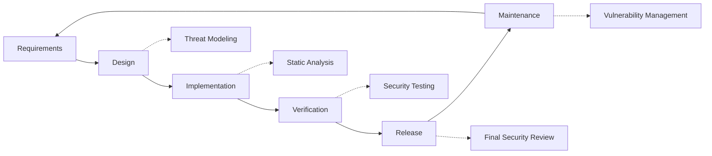

# Pratiche di sicurezza {#security-practices}

## Indice {#table-of-contents}

* [Prefazione](#foreword)
* [Sicurezza delle infrastrutture](#infrastructure-security)
  * [Data center sicuri](#secure-data-centers)
  * [Sicurezza di rete](#network-security)
* [Sicurezza della posta elettronica](#email-security)
  * [Crittografia](#encryption)
  * [Autenticazione e autorizzazione](#authentication-and-authorization)
  * [Misure anti-abuso](#anti-abuse-measures)
* [Protezione dei dati](#data-protection)
  * [Minimizzazione dei dati](#data-minimization)
  * [Backup e ripristino](#backup-and-recovery)
* [Fornitori di servizi](#service-providers)
* [Conformità e auditing](#compliance-and-auditing)
  * [Valutazioni di sicurezza regolari](#regular-security-assessments)
  * [Conformità](#compliance)
* [Risposta agli incidenti](#incident-response)
* [Ciclo di vita dello sviluppo della sicurezza](#security-development-lifecycle)
* [Protezione del server](#server-hardening)
* [Contratto di servizio](#service-level-agreement)
* [Sicurezza Open Source](#open-source-security)
* [Sicurezza dei dipendenti](#employee-security)
* [Miglioramento continuo](#continuous-improvement)
* [Risorse aggiuntive](#additional-resources)

## Prefazione {#foreword}

Per Forward Email, la sicurezza è la nostra massima priorità. Abbiamo implementato misure di sicurezza complete per proteggere le tue comunicazioni email e i tuoi dati personali. Questo documento illustra le nostre pratiche di sicurezza e le misure che adottiamo per garantire la riservatezza, l'integrità e la disponibilità delle tue email.

## Sicurezza dell'infrastruttura {#infrastructure-security}

### Data center sicuri {#secure-data-centers}

La nostra infrastruttura è ospitata in data center conformi allo standard SOC 2 con:

* Sicurezza fisica e sorveglianza 24 ore su 24, 7 giorni su 7
* Controlli di accesso biometrici
* Sistemi di alimentazione ridondanti
* Rilevazione e spegnimento incendi avanzati
* Monitoraggio ambientale

### Sicurezza di rete {#network-security}

Implementiamo più livelli di sicurezza di rete:

* Firewall di livello enterprise con rigorosi elenchi di controllo degli accessi
* Protezione e mitigazione DDoS
* Scansione periodica delle vulnerabilità di rete
* Sistemi di rilevamento e prevenzione delle intrusioni
* Crittografia del traffico tra tutti gli endpoint di servizio
* Protezione tramite scansione delle porte con blocco automatico delle attività sospette

> \[!IMPORTANT]
> Tutti i dati in transito vengono crittografati utilizzando TLS 1.2+ con suite di cifratura moderne.

## Sicurezza e-mail {#email-security}

### Crittografia {#encryption}

* **Transport Layer Security (TLS)**: tutto il traffico email viene crittografato in transito utilizzando TLS 1.2 o superiore
* **Crittografia end-to-end**: supporto per gli standard OpenPGP/MIME e S/MIME
* **Crittografia dell'archiviazione**: tutte le email archiviate vengono crittografate a riposo utilizzando la crittografia ChaCha20-Poly1305 nei file SQLite
* **Crittografia completa del disco**: crittografia LUKS v2 per l'intero disco
* **Protezione completa**: implementiamo crittografia a riposo, crittografia in memoria e crittografia in transito

> \[!NOTE]
> Siamo il primo e unico servizio di posta elettronica al mondo a utilizzare **[caselle di posta SQLite resistenti ai quanti e crittografate individualmente](https://forwardemail.net/en/blog/docs/best-quantum-safe-encrypted-email-service)**.

### Autenticazione e autorizzazione {#authentication-and-authorization}

* **Firma DKIM**: Tutte le email in uscita sono firmate con DKIM
* **SPF e DMARC**: Supporto completo per SPF e DMARC per prevenire lo spoofing delle email
* **MTA-STS**: Supporto per MTA-STS per applicare la crittografia TLS
* **Autenticazione a più fattori**: Disponibile per tutti gli accessi agli account

### Misure anti-abuso {#anti-abuse-measures}

* **Filtro antispam**: Rilevamento antispam multilivello con apprendimento automatico
* **Scansione antivirus**: Scansione in tempo reale di tutti gli allegati
* **Rate Limiting**: Protezione da attacchi di forza bruta ed enumerazione
* **Reputazione IP**: Monitoraggio della reputazione dell'IP di invio
* **Filtro contenuti**: Rilevamento di URL dannosi e tentativi di phishing

## Protezione dei dati {#data-protection}

### Minimizzazione dei dati {#data-minimization}

Seguiamo il principio della minimizzazione dei dati:

* Raccogliamo solo i dati necessari per fornire il nostro servizio
* Il contenuto delle email viene elaborato in memoria e non archiviato in modo persistente, a meno che non sia necessario per la consegna tramite IMAP/POP3
* I log sono resi anonimi e conservati solo per il tempo necessario

### Backup e ripristino {#backup-and-recovery}

* Backup giornalieri automatizzati con crittografia
* Archiviazione di backup distribuita geograficamente
* Test periodici di ripristino dei backup
* Procedure di disaster recovery con RPO e RTO definiti

## Fornitori di servizi {#service-providers}

Selezioniamo attentamente i nostri fornitori di servizi per garantire che rispettino i nostri elevati standard di sicurezza. Di seguito sono elencati i fornitori che utilizziamo per il trasferimento internazionale di dati e il loro stato di conformità al GDPR:

| Fornitore | Scopo | Certificato DPF | Pagina di conformità al GDPR |
| --------------------------------------------- | ------------------------- | ------------- | ----------------------------------------------------------------- |
| [Cloudflare](https://www.cloudflare.com) | CDN, protezione DDoS, DNS | ✅ Sì | [Cloudflare GDPR](https://www.cloudflare.com/trust-hub/gdpr/) |
| [DataPacket](https://www.datapacket.com) | Infrastruttura del server | ❌ No | [DataPacket Privacy](https://www.datapacket.com/privacy-policy) |
| [Digital Ocean](https://www.digitalocean.com) | Infrastruttura cloud | ❌ No | [DigitalOcean GDPR](https://www.digitalocean.com/legal/gdpr) |
| [Vultr](https://www.vultr.com) | Infrastruttura cloud | ❌ No | [Vultr GDPR](https://www.vultr.com/legal/eea-gdpr-privacy/) |
| [Stripe](https://stripe.com) | Elaborazione dei pagamenti | ✅ Sì | [Stripe Privacy Center](https://stripe.com/legal/privacy-center) |
| [PayPal](https://www.paypal.com) | Elaborazione dei pagamenti | ❌ No | [PayPal Privacy](https://www.paypal.com/uk/legalhub/privacy-full) |

Utilizziamo questi fornitori per garantire un servizio affidabile e sicuro, nel rispetto delle normative internazionali sulla protezione dei dati. Tutti i trasferimenti di dati vengono effettuati adottando misure di sicurezza adeguate per proteggere le vostre informazioni personali.

## Conformità e audit {#compliance-and-auditing}

### Valutazioni di sicurezza regolari {#regular-security-assessments}

Il nostro team monitora, esamina e valuta regolarmente la base di codice, i server, l'infrastruttura e le pratiche. Implementiamo un programma di sicurezza completo che include:

* Rotazione regolare delle chiavi SSH
* Monitoraggio continuo dei log di accesso
* Scansione di sicurezza automatizzata
* Gestione proattiva delle vulnerabilità
* Formazione regolare sulla sicurezza per tutti i membri del team

### Conformità {#compliance}

* Pratiche di gestione dei dati conformi a [GDPR](https://forwardemail.net/gdpr)
* [Contratto di elaborazione dei dati (DPA)](https://forwardemail.net/dpa) disponibile per i clienti aziendali
* Controlli della privacy conformi al CCPA
* Processi verificati SOC 2 Tipo II

## Risposta all'incidente {#incident-response}

Il nostro piano di risposta agli incidenti di sicurezza include:

1. **Rilevamento**: Sistemi di monitoraggio e avviso automatizzati
2. **Contenimento**: Isolamento immediato dei sistemi interessati
3. **Eradicazione**: Rimozione della minaccia e analisi delle cause principali
4. **Ripristino**: Ripristino sicuro dei servizi
5. **Notifica**: Comunicazione tempestiva con gli utenti interessati
6. **Analisi post-incidente**: Revisione completa e miglioramento

> \[!WARNING]
> Se scopri una vulnerabilità di sicurezza, segnalala immediatamente a <security@forwardemail.net>.

## Ciclo di vita dello sviluppo della sicurezza {#security-development-lifecycle}

Tutto il codice viene sottoposto a:

* Raccolta dei requisiti di sicurezza
* Modellazione delle minacce durante la progettazione
* Pratiche di codifica sicura
* Test di sicurezza delle applicazioni statiche e dinamiche
* Revisione del codice con focus sulla sicurezza
* Scansione delle vulnerabilità delle dipendenze

## Rafforzamento del server {#server-hardening}

Il nostro [Configurazione Ansible](https://github.com/forwardemail/forwardemail.net/tree/master/ansible) implementa numerose misure di rafforzamento del server:

* **Accesso USB disabilitato**: le porte fisiche vengono disabilitate inserendo nella blacklist il modulo kernel usb-storage
* **Regole firewall**: regole iptables rigorose che consentono solo le connessioni necessarie
* **Protezione SSH**: solo autenticazione basata su chiave, accesso senza password, accesso root disabilitato
* **Isolamento dei servizi**: ogni servizio viene eseguito con i privilegi minimi richiesti
* **Aggiornamenti automatici**: le patch di sicurezza vengono applicate automaticamente
* **Avvio sicuro**: processo di avvio verificato per prevenire manomissioni
* **Protezione del kernel**: parametri del kernel sicuri e configurazioni sysctl
* **Restrizioni del file system**: opzioni di montaggio noexec, nosuid e nodev ove appropriate
* **Core dump disabilitati**: sistema configurato per impedire i core dump per motivi di sicurezza
* **Swap disabilitato**: memoria di swap disabilitata per prevenire la perdita di dati
* **Protezione scansione porte**: rilevamento e blocco automatici dei tentativi di scansione porte
* **Transparent Huge Pages disabilitate**: THP disabilitato per migliorare prestazioni e sicurezza
* **Protezione dei servizi di sistema**: Servizi non essenziali come Apport disabilitati
* **Gestione utenti**: Principio dei privilegi minimi con utenti di deploy e DevOps separati
* **Limiti dei descrittori di file**: Limiti aumentati per prestazioni e sicurezza migliori

## Contratto di servizio {#service-level-agreement}

Manteniamo un elevato livello di disponibilità e affidabilità del servizio. La nostra infrastruttura è progettata per garantire ridondanza e tolleranza agli errori, garantendo la continuità operativa del tuo servizio di posta elettronica. Sebbene non pubblichiamo un documento SLA formale, ci impegniamo a:

* Tempo di attività superiore al 99,9% per tutti i servizi
* Risposta rapida alle interruzioni del servizio
* Comunicazione trasparente in caso di incidenti
* Manutenzione regolare durante i periodi di basso traffico

## Sicurezza Open Source {#open-source-security}

In qualità di [servizio open source](https://github.com/forwardemail/forwardemail.net), la nostra sicurezza trae vantaggio da:

* Codice trasparente che può essere verificato da chiunque
* Miglioramenti della sicurezza guidati dalla community
* Rapida identificazione e correzione delle vulnerabilità
* Nessuna sicurezza attraverso l'oscurità

## Sicurezza dei dipendenti {#employee-security}

* Verifiche dei precedenti per tutti i dipendenti
* Formazione sulla sicurezza informatica
* Principio di accesso con privilegi minimi
* Formazione periodica sulla sicurezza

## Miglioramento continuo {#continuous-improvement}

Miglioriamo costantemente la nostra strategia di sicurezza attraverso:

* Monitoraggio delle tendenze di sicurezza e delle minacce emergenti
* Revisione e aggiornamento periodici delle policy di sicurezza
* Feedback da parte di ricercatori e utenti della sicurezza
* Partecipazione alla community sulla sicurezza

Per maggiori informazioni sulle nostre pratiche di sicurezza o per segnalare problemi di sicurezza, contattare <security@forwardemail.net>.

## Risorse aggiuntive {#additional-resources}

* [politica sulla riservatezza](https://forwardemail.net/en/privacy)
* [Termini di servizio](https://forwardemail.net/en/terms)
* [Conformità al GDPR](https://forwardemail.net/gdpr)
* [Contratto di elaborazione dei dati (DPA)](https://forwardemail.net/dpa)
* [Segnala abuso](https://forwardemail.net/en/report-abuse)
* [Politica di sicurezza](https://github.com/forwardemail/.github/blob/main/SECURITY.md)
* [Security.txt](https://forwardemail.net/security.txt)
* [Repository GitHub](https://github.com/forwardemail/forwardemail.net)
* [FAQ](https://forwardemail.net/en/faq)