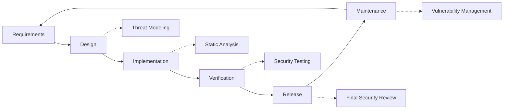

# Pratiche di Sicurezza {#security-practices}

## Indice {#table-of-contents}

* [Prefazione](#foreword)
* [Sicurezza dell'Infrastruttura](#infrastructure-security)
  * [Data Center Sicuri](#secure-data-centers)
  * [Sicurezza della Rete](#network-security)
* [Sicurezza delle Email](#email-security)
  * [Crittografia](#encryption)
  * [Autenticazione e Autorizzazione](#authentication-and-authorization)
  * [Misure Anti-Abuso](#anti-abuse-measures)
* [Protezione dei Dati](#data-protection)
  * [Minimizzazione dei Dati](#data-minimization)
  * [Backup e Ripristino](#backup-and-recovery)
* [Fornitori di Servizi](#service-providers)
* [Conformità e Audit](#compliance-and-auditing)
  * [Valutazioni di Sicurezza Regolari](#regular-security-assessments)
  * [Conformità](#compliance)
* [Risposta agli Incidenti](#incident-response)
* [Ciclo di Vita dello Sviluppo Sicuro](#security-development-lifecycle)
* [Indurimento del Server](#server-hardening)
* [Accordo sul Livello di Servizio](#service-level-agreement)
* [Sicurezza Open Source](#open-source-security)
* [Sicurezza dei Dipendenti](#employee-security)
* [Miglioramento Continuo](#continuous-improvement)
* [Risorse Aggiuntive](#additional-resources)

## Prefazione {#foreword}

Da Forward Email, la sicurezza è la nostra massima priorità. Abbiamo implementato misure di sicurezza complete per proteggere le tue comunicazioni email e i dati personali. Questo documento illustra le nostre pratiche di sicurezza e i passaggi che adottiamo per garantire la riservatezza, l'integrità e la disponibilità delle tue email.

## Sicurezza dell'Infrastruttura {#infrastructure-security}

### Data Center Sicuri {#secure-data-centers}

La nostra infrastruttura è ospitata in data center conformi SOC 2 con:

* Sicurezza fisica e sorveglianza 24/7
* Controlli di accesso biometrici
* Sistemi di alimentazione ridondanti
* Avanzati sistemi di rilevamento e soppressione incendi
* Monitoraggio ambientale

### Sicurezza della Rete {#network-security}

Implementiamo più livelli di sicurezza di rete:

* Firewall di livello enterprise con liste di controllo accessi rigorose
* Protezione e mitigazione DDoS
* Scansioni regolari di vulnerabilità di rete
* Sistemi di rilevamento e prevenzione intrusioni
* Crittografia del traffico tra tutti i punti di servizio
* Protezione da scansione porte con blocco automatico di attività sospette

> \[!IMPORTANT]
> Tutti i dati in transito sono crittografati usando TLS 1.2+ con suite di cifratura moderne.

## Sicurezza delle Email {#email-security}

### Crittografia {#encryption}

* **Transport Layer Security (TLS)**: Tutto il traffico email è crittografato in transito usando TLS 1.2 o superiore
* **Crittografia End-to-End**: Supporto per gli standard OpenPGP/MIME e S/MIME
* **Crittografia in Archiviazione**: Tutte le email archiviate sono crittografate a riposo usando crittografia ChaCha20-Poly1305 nei file SQLite
* **Crittografia Completa del Disco**: Crittografia LUKS v2 per l'intero disco
* **Protezione Completa**: Implementiamo crittografia a riposo, in memoria e in transito

> \[!NOTE]
> Siamo il primo e unico servizio email al mondo a utilizzare **[caselle di posta SQLite crittografate individualmente e resistenti al quantum](https://forwardemail.net/en/blog/docs/best-quantum-safe-encrypted-email-service)**.

### Autenticazione e Autorizzazione {#authentication-and-authorization}

* **Firma DKIM**: Tutte le email in uscita sono firmate con DKIM
* **SPF e DMARC**: Supporto completo per SPF e DMARC per prevenire lo spoofing email
* **MTA-STS**: Supporto per MTA-STS per imporre la crittografia TLS
* **Autenticazione Multi-Fattore**: Disponibile per tutti gli accessi agli account

### Misure Anti-Abuso {#anti-abuse-measures}

* **Filtraggio Spam**: Rilevamento spam multilivello con apprendimento automatico
* **Scansione Virus**: Scansione in tempo reale di tutti gli allegati
* **Limitazione della Velocità**: Protezione contro attacchi brute force e di enumerazione
* **Reputazione IP**: Monitoraggio della reputazione degli IP mittenti
* **Filtraggio Contenuti**: Rilevamento di URL dannosi e tentativi di phishing

## Protezione dei Dati {#data-protection}

### Minimizzazione dei Dati {#data-minimization}

Seguiamo il principio della minimizzazione dei dati:

* Raccogliamo solo i dati necessari per fornire il nostro servizio
* Il contenuto delle email è elaborato in memoria e non memorizzato in modo persistente a meno che non sia necessario per la consegna IMAP/POP3
* I log sono anonimizzati e conservati solo per il tempo necessario
### Backup e Recupero {#backup-and-recovery}

* Backup giornalieri automatizzati con crittografia
* Archiviazione dei backup distribuita geograficamente
* Test regolari di ripristino dei backup
* Procedure di disaster recovery con RPO e RTO definiti

## Fornitori di Servizi {#service-providers}

Selezioniamo attentamente i nostri fornitori di servizi per garantire che soddisfino i nostri elevati standard di sicurezza. Di seguito sono elencati i fornitori che utilizziamo per il trasferimento internazionale dei dati e il loro stato di conformità al GDPR:

| Fornitore                                     | Scopo                      | Certificato DPF | Pagina di Conformità GDPR                                                                              |
| --------------------------------------------- | -------------------------- | -------------- | ----------------------------------------------------------------------------------------------------- |
| [Cloudflare](https://www.cloudflare.com)      | CDN, protezione DDoS, DNS  | ✅ Sì           | [Cloudflare GDPR](https://www.cloudflare.com/trust-hub/gdpr/)                                         |
| [DataPacket](https://www.datapacket.com)      | Infrastruttura server      | ❌ No           | [DataPacket Privacy](https://www.datapacket.com/privacy-policy)                                       |
| [Digital Ocean](https://www.digitalocean.com) | Infrastruttura cloud       | ❌ No           | [DigitalOcean GDPR](https://www.digitalocean.com/legal/gdpr)                                          |
| [GitHub](https://github.com)                  | Hosting codice sorgente, CI/CD | ✅ Sì        | [GitHub GDPR](https://docs.github.com/en/site-policy/privacy-policies/github-data-protection-agreement) |
| [Vultr](https://www.vultr.com)                | Infrastruttura cloud       | ❌ No           | [Vultr GDPR](https://www.vultr.com/legal/eea-gdpr-privacy/)                                           |
| [Stripe](https://stripe.com)                  | Elaborazione pagamenti     | ✅ Sì           | [Stripe Privacy Center](https://stripe.com/legal/privacy-center)                                      |
| [PayPal](https://www.paypal.com)              | Elaborazione pagamenti     | ❌ No           | [PayPal Privacy](https://www.paypal.com/uk/legalhub/privacy-full)                                     |

Utilizziamo questi fornitori per garantire un servizio affidabile e sicuro mantenendo la conformità con le normative internazionali sulla protezione dei dati. Tutti i trasferimenti di dati sono effettuati con adeguate misure di sicurezza per proteggere le tue informazioni personali.

## Conformità e Audit {#compliance-and-auditing}

### Valutazioni di Sicurezza Regolari {#regular-security-assessments}

Il nostro team monitora, revisiona e valuta regolarmente il codice, i server, l'infrastruttura e le pratiche. Implementiamo un programma di sicurezza completo che include:

* Rotazione regolare delle chiavi SSH
* Monitoraggio continuo dei log di accesso
* Scansione automatizzata della sicurezza
* Gestione proattiva delle vulnerabilità
* Formazione regolare sulla sicurezza per tutti i membri del team

### Conformità {#compliance}

* Pratiche di gestione dei dati conformi al [GDPR](https://forwardemail.net/gdpr)
* Disponibilità del [Contratto di Elaborazione Dati (DPA)](https://forwardemail.net/dpa) per clienti business
* Controlli sulla privacy conformi al CCPA
* Processi auditati SOC 2 Tipo II

## Risposta agli Incidenti {#incident-response}

Il nostro piano di risposta agli incidenti di sicurezza include:

1. **Rilevamento**: Sistemi automatizzati di monitoraggio e allerta
2. **Contenimento**: Isolamento immediato dei sistemi interessati
3. **Eliminazione**: Rimozione della minaccia e analisi della causa radice
4. **Recupero**: Ripristino sicuro dei servizi
5. **Notifica**: Comunicazione tempestiva agli utenti interessati
6. **Analisi post-incidente**: Revisione completa e miglioramento

> \[!WARNING]
> Se scopri una vulnerabilità di sicurezza, ti preghiamo di segnalarla immediatamente a <security@forwardemail.net>.

## Ciclo di Vita dello Sviluppo della Sicurezza {#security-development-lifecycle}

```mermaid
flowchart LR
    A[Requirements] --> B[Design]
    B --> C[Implementation]
    C --> D[Verification]
    D --> E[Release]
    E --> F[Maintenance]
    F --> A
    B -.-> G[Threat Modeling]
    C -.-> H[Static Analysis]
    D -.-> I[Security Testing]
    E -.-> J[Final Security Review]
    F -.-> K[Vulnerability Management]
```
Tutto il codice subisce:

* Raccolta dei requisiti di sicurezza
* Modellazione delle minacce durante la progettazione
* Pratiche di codifica sicura
* Test di sicurezza delle applicazioni statici e dinamici
* Revisione del codice con focus sulla sicurezza
* Scansione delle vulnerabilità delle dipendenze

## Indurimento del Server {#server-hardening}

La nostra [configurazione Ansible](https://github.com/forwardemail/forwardemail.net/tree/master/ansible) implementa numerose misure di indurimento del server:

* **Accesso USB Disabilitato**: Le porte fisiche sono disabilitate tramite il blacklist del modulo kernel usb-storage
* **Regole Firewall**: Regole iptables rigorose che consentono solo le connessioni necessarie
* **Indurimento SSH**: Autenticazione basata su chiave, nessun login con password, login root disabilitato
* **Isolamento dei Servizi**: Ogni servizio gira con i privilegi minimi necessari
* **Aggiornamenti Automatici**: Le patch di sicurezza sono applicate automaticamente
* **Secure Boot**: Processo di avvio verificato per prevenire manomissioni
* **Indurimento del Kernel**: Parametri kernel sicuri e configurazioni sysctl
* **Restrizioni del File System**: opzioni di mount noexec, nosuid e nodev dove appropriato
* **Core Dump Disabilitati**: Sistema configurato per prevenire core dump per motivi di sicurezza
* **Swap Disabilitato**: Memoria swap disabilitata per prevenire perdite di dati
* **Protezione contro la Scansione delle Porte**: Rilevamento e blocco automatico dei tentativi di scansione delle porte
* **Transparent Huge Pages Disabilitate**: THP disabilitate per migliorare prestazioni e sicurezza
* **Indurimento dei Servizi di Sistema**: Servizi non essenziali come Apport disabilitati
* **Gestione Utenti**: Principio del minimo privilegio con utenti separati per deploy e devops
* **Limiti dei File Descriptor**: Limiti aumentati per migliori prestazioni e sicurezza

## Accordo sul Livello di Servizio {#service-level-agreement}

Manteniamo un alto livello di disponibilità e affidabilità del servizio. La nostra infrastruttura è progettata per la ridondanza e la tolleranza ai guasti per garantire che il tuo servizio email rimanga operativo. Sebbene non pubblichiamo un documento formale SLA, ci impegniamo a:

* Uptime superiore al 99,9% per tutti i servizi
* Risposta rapida alle interruzioni del servizio
* Comunicazione trasparente durante gli incidenti
* Manutenzione regolare durante i periodi di basso traffico

## Sicurezza Open Source {#open-source-security}

Come [servizio open source](https://github.com/forwardemail/forwardemail.net), la nostra sicurezza beneficia di:

* Codice trasparente che può essere revisionato da chiunque
* Miglioramenti della sicurezza guidati dalla comunità
* Identificazione e patch rapide delle vulnerabilità
* Nessuna sicurezza basata sull’oscurità

## Sicurezza dei Dipendenti {#employee-security}

* Controlli dei precedenti per tutti i dipendenti
* Formazione sulla consapevolezza della sicurezza
* Accesso basato sul principio del minimo privilegio
* Educazione regolare sulla sicurezza

## Miglioramento Continuo {#continuous-improvement}

Miglioriamo continuamente la nostra postura di sicurezza attraverso:

* Monitoraggio delle tendenze di sicurezza e delle minacce emergenti
* Revisione e aggiornamenti regolari delle politiche di sicurezza
* Feedback da ricercatori di sicurezza e utenti
* Partecipazione alla comunità della sicurezza

Per maggiori informazioni sulle nostre pratiche di sicurezza o per segnalare problemi di sicurezza, contattare <security@forwardemail.net>.

## Risorse Aggiuntive {#additional-resources}

* [Informativa sulla Privacy](https://forwardemail.net/en/privacy)
* [Termini di Servizio](https://forwardemail.net/en/terms)
* [Conformità GDPR](https://forwardemail.net/gdpr)
* [Accordo sul Trattamento dei Dati (DPA)](https://forwardemail.net/dpa)
* [Segnala Abusi](https://forwardemail.net/en/report-abuse)
* [Politica di Sicurezza](https://github.com/forwardemail/.github/blob/main/SECURITY.md)
* [Security.txt](https://forwardemail.net/security.txt)
* [Repository GitHub](https://github.com/forwardemail/forwardemail.net)
* [FAQ](https://forwardemail.net/en/faq)
