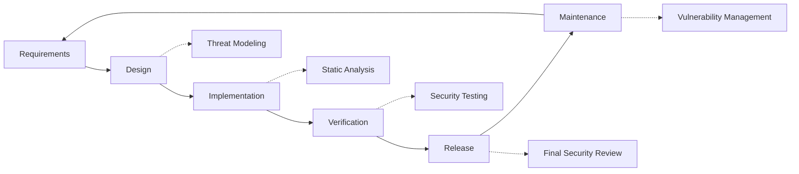

# セキュリティプラクティス {#security-practices}

## 目次 {#table-of-contents}

* [序文](#foreword)
* [インフラストラクチャセキュリティ](#infrastructure-security)
  * [安全なデータセンター](#secure-data-centers)
  * [ネットワークセキュリティ](#network-security)
* [メールセキュリティ](#email-security)
  * [暗号化](#encryption)
  * [認証と承認](#authentication-and-authorization)
  * [虐待防止対策](#anti-abuse-measures)
* [データ保護](#data-protection)
  * [データの最小化](#data-minimization)
  * [バックアップとリカバリ](#backup-and-recovery)
* [サービスプロバイダー](#service-providers)
* [コンプライアンスと監査](#compliance-and-auditing)
  * [定期的なセキュリティ評価](#regular-security-assessments)
  * [コンプライアンス](#compliance)
* [インシデント対応](#incident-response)
* [セキュリティ開発ライフサイクル](#security-development-lifecycle)
* [サーバーの強化](#server-hardening)
* [サービスレベル契約](#service-level-agreement)
* [オープンソースセキュリティ](#open-source-security)
* [従業員のセキュリティ](#employee-security)
* [継続的な改善](#continuous-improvement)
* [追加リソース](#additional-resources)

## 序文 {#foreword}

Forward Emailでは、セキュリティを最優先に考えています。お客様のメール通信と個人データを保護するため、包括的なセキュリティ対策を実施しています。この文書では、Forward Emailのセキュリティ対策と、お客様のメールの機密性、完全性、可用性を確保するための手順についてご説明します。

## インフラストラクチャセキュリティ {#infrastructure-security}

### セキュアデータセンター {#secure-data-centers}

当社のインフラストラクチャは、SOC 2 準拠のデータ センターでホストされており、次のようになっています。

* 24時間365日体制の物理的なセキュリティと監視
* 生体認証によるアクセス制御
* 冗長化された電力システム
* 高度な火災検知・消火システム
* 環境モニタリング

### ネットワークセキュリティ {#network-security}

当社では、複数層のネットワーク セキュリティを実装しています。

* 厳格なアクセス制御リストを備えたエンタープライズグレードのファイアウォール
* DDoS攻撃対策と緩和策
* 定期的なネットワーク脆弱性スキャン
* 侵入検知・防止システム
* すべてのサービスエンドポイント間のトラフィック暗号化
* 疑わしいアクティビティを自動的にブロックするポートスキャン保護

> \[!IMPORTANT]
> 転送中のすべてのデータは、最新の暗号スイートを使用した TLS 1.2 以降を使用して暗号化されます。

## メールセキュリティ {#email-security}

### 暗号化 {#encryption}

* **トランスポート層セキュリティ (TLS)**: すべてのメールトラフィックは、TLS 1.2 以降を使用して転送時に暗号化されます。
* **エンドツーエンド暗号化**: OpenPGP/MIME および S/MIME 標準をサポート
* **ストレージ暗号化**: 保存されているすべてのメールは、SQLite ファイルで ChaCha20-Poly1305 暗号化を使用して保存時に暗号化されます。
* **フルディスク暗号化**: ディスク全体を LUKS v2 で暗号化します。
* **包括的な保護**: 保存時の暗号化、メモリ内の暗号化、転送時の暗号化を実装しています。

> \[!NOTE]
> 当社は、**[量子耐性があり個別に暗号化されたSQLiteメールボックス](https://forwardemail.net/en/blog/docs/best-quantum-safe-encrypted-email-service)** を採用した世界初かつ唯一のメールサービスです。

### 認証と承認 {#authentication-and-authorization}

* **DKIM署名**: すべての送信メールはDKIMで署名されます
* **SPFとDMARC**: メールのなりすましを防止するため、SPFとDMARCを完全サポート
* **MTA-STS**: TLS暗号化を強制するためにMTA-STSをサポート
* **多要素認証**: すべてのアカウントアクセスで利用可能

### 不正使用防止対策 {#anti-abuse-measures}

* **スパムフィルタリング**: 機械学習による多層的なスパム検出
* **ウイルススキャン**: すべての添付ファイルをリアルタイムでスキャン
* **レート制限**: ブルートフォース攻撃と列挙攻撃からの保護
* **IPレピュテーション**: 送信元IPレピュテーションの監視
* **コンテンツフィルタリング**: 悪意のあるURLとフィッシング攻撃の検出

## データ保護 {#data-protection}

### データの最小化 {#data-minimization}

当社はデータ最小化の原則に従います。

* 当社は、サービス提供に必要なデータのみを収集します。
* メールの内容はメモリ内で処理され、IMAP/POP3配信に必要な場合を除き、永続的に保存されることはありません。
* ログは匿名化され、必要な期間のみ保持されます。

### バックアップとリカバリ {#backup-and-recovery}

* 暗号化された自動日次バックアップ
* 地理的に分散されたバックアップストレージ
* 定期的なバックアップ復元テスト
* RPO（目標復旧時点）とRTO（目標復旧時間）が定義された災害復旧手順

## サービスプロバイダー {#service-providers}

当社は、高いセキュリティ基準を満たすサービスプロバイダーを厳選しています。国際データ転送に利用するプロバイダーと、GDPR遵守状況は以下のとおりです。

| プロバイダー | 目的 | DPF認定 | GDPRコンプライアンスページ |
| --------------------------------------------- | ------------------------- | ------------- | ----------------------------------------------------------------- |
| [Cloudflare](https://www.cloudflare.com) | CDN、DDoS 保護、DNS | ✅ はい | [Cloudflare GDPR](https://www.cloudflare.com/trust-hub/gdpr/) |
| [DataPacket](https://www.datapacket.com) | サーバーインフラストラクチャ | ❌ いいえ | [DataPacket Privacy](https://www.datapacket.com/privacy-policy) |
| [Digital Ocean](https://www.digitalocean.com) | クラウドインフラストラクチャ | ❌ いいえ | [DigitalOcean GDPR](https://www.digitalocean.com/legal/gdpr) |
| [Vultr](https://www.vultr.com) | クラウドインフラストラクチャ | ❌ いいえ | [Vultr GDPR](https://www.vultr.com/legal/eea-gdpr-privacy/) |
| [Stripe](https://stripe.com) | 支払い処理 | ✅ はい | [Stripe Privacy Center](https://stripe.com/legal/privacy-center) |
| [PayPal](https://www.paypal.com) | 支払い処理 | ❌ いいえ | [PayPal Privacy](https://www.paypal.com/uk/legalhub/privacy-full) |

当社は、国際的なデータ保護規制を遵守しながら、信頼性と安全性を確保するために、これらのプロバイダーを利用しています。すべてのデータ転送は、お客様の個人情報を保護するための適切な安全対策を講じて行われます。

## コンプライアンスと監査 {#compliance-and-auditing}

### 定期的なセキュリティ評価 {#regular-security-assessments}

当社のチームは、コードベース、サーバー、インフラストラクチャ、そしてプラクティスを定期的に監視、レビュー、評価しています。また、以下を含む包括的なセキュリティプログラムを導入しています。

* SSHキーの定期的なローテーション
* アクセスログの継続的な監視
* 自動セキュリティスキャン
* プロアクティブな脆弱性管理
* 全チームメンバーへの定期的なセキュリティトレーニング

### コンプライアンス {#compliance}

* [GDPR](https://forwardemail.net/gdpr)準拠のデータ処理方法
* [データ処理契約（DPA）](https://forwardemail.net/dpa)は法人のお客様にご利用いただけます
* CCPA準拠のプライバシー管理
* SOC 2 Type II監査済みプロセス

## インシデント対応 {#incident-response}

当社のセキュリティ インシデント対応計画には以下が含まれます。

1. **検出**: 自動監視およびアラートシステム
2. **封じ込め**: 影響を受けたシステムの即時隔離
3. **根絶**: 脅威の除去と根本原因の分析
4. **復旧**: サービスの安全な復旧
5. **通知**: 影響を受けたユーザーへのタイムリーなコミュニケーション
6. **インシデント事後分析**: 包括的なレビューと改善

> \[!WARNING]
> セキュリティ上の脆弱性を発見した場合は、直ちに <security@forwardemail.net> までご報告ください。

## セキュリティ開発ライフサイクル {#security-development-lifecycle}

すべてのコードは以下を経ます:

* セキュリティ要件の収集
* 設計段階における脅威モデリング
* セキュアコーディングプラクティス
* 静的および動的アプリケーションセキュリティテスト
* セキュリティに重点を置いたコードレビュー
* 依存関係の脆弱性スキャン

## サーバーの強化 {#server-hardening}

当社の [Ansibleの設定](https://github.com/forwardemail/forwardemail.net/tree/master/ansible) は、さまざまなサーバー強化対策を実装しています。

* **USBアクセス無効化**: usb-storageカーネルモジュールをブラックリストに登録することで、物理ポートを無効化します。
* **ファイアウォールルール**: 厳格なiptablesルールにより、必要な接続のみを許可します。
* **SSH強化**: キーベース認証のみ、パスワードログインなし、ルートログインは無効化します。
* **サービス分離**: 各サービスは必要最小限の権限で実行されます。
* **自動更新**: セキュリティパッチが自動的に適用されます。
* **セキュアブート**: 改ざん防止のための検証済みブートプロセス
* **カーネル強化**: カーネルパラメータとsysctl設定を保護
* **ファイルシステム制限**: 必要に応じてnoexec、nosuid、nodevマウントオプションを使用します。
* **コアダンプ無効化**: セキュリティ上の理由から、コアダンプを抑止するようにシステムを設定します。
* **スワップ無効化**: データ漏洩防止のため、スワップメモリを無効化します。
* **ポートスキャン保護**: ポートスキャン試行を自動検出してブロックします。
* **透過的ヒュージページ無効**: パフォーマンスとセキュリティ向上のため、THP を無効化
* **システムサービス強化**: Apport などの必須ではないサービスを無効化
* **ユーザー管理**: デプロイユーザーと DevOps ユーザーを分離し、最小権限の原則を適用
* **ファイル記述子の制限**: パフォーマンスとセキュリティ向上のため、制限を引き上げ

## サービスレベル契約 {#service-level-agreement}

当社は、高いレベルのサービス可用性と信頼性を維持しています。当社のインフラストラクチャは冗長性とフォールトトレランス性を備えており、お客様のメールサービスの継続的な運用を保証します。正式なSLA文書は公開しておりませんが、以下の点にご留意ください。

* 全サービスで99.9%以上の稼働率
* サービス中断への迅速な対応
* インシデント発生時の透明性のあるコミュニケーション
* トラフィックが少ない時間帯の定期メンテナンス

## オープンソースセキュリティ {#open-source-security}

[オープンソースサービス](https://github.com/forwardemail/forwardemail.net) として、当社のセキュリティは次のメリットを得ています。

* 誰でも監査可能な透明なコード
* コミュニティ主導のセキュリティ改善
* 脆弱性の迅速な特定とパッチ適用
* 隠蔽によるセキュリティ侵害なし

## 従業員のセキュリティ {#employee-security}

* 全従業員の身元調査
* セキュリティ意識向上研修
* 最小権限アクセスの原則
* 定期的なセキュリティ教育

## 継続的な改善 {#continuous-improvement}

当社は、以下の方法でセキュリティ体制を継続的に改善しています。

* セキュリティトレンドと新たな脅威の監視
* セキュリティポリシーの定期的なレビューと更新
* セキュリティ研究者およびユーザーからのフィードバック
* セキュリティコミュニティへの参加

当社のセキュリティ対策に関する詳細情報やセキュリティ上の懸念事項を報告するには、<security@forwardemail.net> までお問い合わせください。

## 追加リソース {#additional-resources}

* [プライバシーポリシー](https://forwardemail.net/en/privacy)
* [利用規約](https://forwardemail.net/en/terms)
* [GDPRコンプライアンス](https://forwardemail.net/gdpr)
* [データ処理契約（DPA）](https://forwardemail.net/dpa)
* [不正行為を報告する](https://forwardemail.net/en/report-abuse)
* [セキュリティポリシー](https://github.com/forwardemail/.github/blob/main/SECURITY.md)
* [Security.txt](https://forwardemail.net/security.txt)
* [GitHubリポジトリ](https://github.com/forwardemail/forwardemail.net)
* [FAQ](https://forwardemail.net/en/faq)