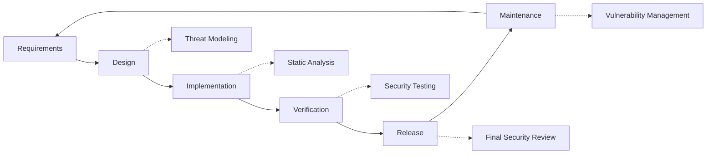

# セキュリティ対策 {#security-practices}

## 目次 {#table-of-contents}

* [序文](#foreword)
* [インフラストラクチャのセキュリティ](#infrastructure-security)
  * [安全なデータセンター](#secure-data-centers)
  * [ネットワークセキュリティ](#network-security)
* [メールセキュリティ](#email-security)
  * [暗号化](#encryption)
  * [認証と認可](#authentication-and-authorization)
  * [不正利用防止対策](#anti-abuse-measures)
* [データ保護](#data-protection)
  * [データ最小化](#data-minimization)
  * [バックアップとリカバリー](#backup-and-recovery)
* [サービスプロバイダー](#service-providers)
* [コンプライアンスと監査](#compliance-and-auditing)
  * [定期的なセキュリティ評価](#regular-security-assessments)
  * [コンプライアンス](#compliance)
* [インシデント対応](#incident-response)
* [セキュリティ開発ライフサイクル](#security-development-lifecycle)
* [サーバーハードニング](#server-hardening)
* [サービスレベルアグリーメント](#service-level-agreement)
* [オープンソースセキュリティ](#open-source-security)
* [従業員のセキュリティ](#employee-security)
* [継続的改善](#continuous-improvement)
* [追加リソース](#additional-resources)

## 序文 {#foreword}

Forward Emailでは、セキュリティを最優先事項としています。お客様のメール通信および個人データを保護するために包括的なセキュリティ対策を実施しています。本書は、当社のセキュリティ対策と、お客様のメールの機密性、完全性、可用性を確保するために講じている手順を説明します。

## インフラストラクチャのセキュリティ {#infrastructure-security}

### 安全なデータセンター {#secure-data-centers}

当社のインフラはSOC 2準拠のデータセンターにホストされており、以下を備えています：

* 24時間365日の物理的セキュリティと監視
* 生体認証アクセス制御
* 冗長電源システム
* 高度な火災検知および消火設備
* 環境モニタリング

### ネットワークセキュリティ {#network-security}

複数層のネットワークセキュリティを実装しています：

* 厳格なアクセス制御リストを備えたエンタープライズグレードのファイアウォール
* DDoS保護および緩和策
* 定期的なネットワーク脆弱性スキャン
* 侵入検知および防止システム
* すべてのサービスエンドポイント間のトラフィック暗号化
* ポートスキャン保護と疑わしい活動の自動ブロック

> \[!IMPORTANT]
> すべての通信データはTLS 1.2以上の最新暗号スイートを使用して暗号化されています。

## メールセキュリティ {#email-security}

### 暗号化 {#encryption}

* **トランスポート層セキュリティ（TLS）**：すべてのメールトラフィックはTLS 1.2以上で暗号化されています
* **エンドツーエンド暗号化**：OpenPGP/MIMEおよびS/MIME標準に対応
* **保存時暗号化**：SQLiteファイル内のメールはChaCha20-Poly1305暗号化で保存時に暗号化
* **フルディスク暗号化**：ディスク全体にLUKS v2暗号化を適用
* **包括的保護**：保存時暗号化、メモリ内暗号化、通信中暗号化を実装

> \[!NOTE]
> 当社は世界初かつ唯一の**[量子耐性かつ個別に暗号化されたSQLiteメールボックス](https://forwardemail.net/en/blog/docs/best-quantum-safe-encrypted-email-service)**を使用するメールサービスです。

### 認証と認可 {#authentication-and-authorization}

* **DKIM署名**：すべての送信メールにDKIM署名を付与
* **SPFおよびDMARC**：メールのなりすまし防止のためにSPFとDMARCを完全サポート
* **MTA-STS**：TLS暗号化を強制するMTA-STSに対応
* **多要素認証**：すべてのアカウントアクセスに利用可能

### 不正利用防止対策 {#anti-abuse-measures}

* **スパムフィルタリング**：機械学習を用いた多層スパム検出
* **ウイルススキャン**：すべての添付ファイルをリアルタイムでスキャン
* **レート制限**：ブルートフォース攻撃や列挙攻撃からの保護
* **IPレピュテーション**：送信IPの評判を監視
* **コンテンツフィルタリング**：悪意のあるURLやフィッシング試行の検出

## データ保護 {#data-protection}

### データ最小化 {#data-minimization}

データ最小化の原則に従っています：

* サービス提供に必要なデータのみを収集
* メール内容はメモリ内で処理し、IMAP/POP3配信に必要な場合を除き永続的に保存しない
* ログは匿名化され、必要な期間のみ保持
### バックアップとリカバリー {#backup-and-recovery}

* 暗号化された自動毎日バックアップ
* 地理的に分散されたバックアップストレージ
* 定期的なバックアップ復元テスト
* 定義されたRPOおよびRTOを持つ災害復旧手順

## サービスプロバイダー {#service-providers}

当社は高いセキュリティ基準を満たすサービスプロバイダーを慎重に選定しています。以下は国際データ転送に使用しているプロバイダーとそのGDPR準拠状況です：

| プロバイダー                                  | 用途                       | DPF認証       | GDPR準拠ページ                                                                                         |
| --------------------------------------------- | -------------------------- | ------------- | ------------------------------------------------------------------------------------------------------- |
| [Cloudflare](https://www.cloudflare.com)      | CDN、DDoS保護、DNS         | ✅ はい       | [Cloudflare GDPR](https://www.cloudflare.com/trust-hub/gdpr/)                                           |
| [DataPacket](https://www.datapacket.com)      | サーバーインフラ           | ❌ いいえ     | [DataPacket Privacy](https://www.datapacket.com/privacy-policy)                                         |
| [Digital Ocean](https://www.digitalocean.com) | クラウドインフラ           | ❌ いいえ     | [DigitalOcean GDPR](https://www.digitalocean.com/legal/gdpr)                                            |
| [GitHub](https://github.com)                  | ソースコードホスティング、CI/CD | ✅ はい       | [GitHub GDPR](https://docs.github.com/en/site-policy/privacy-policies/github-data-protection-agreement) |
| [Vultr](https://www.vultr.com)                | クラウドインフラ           | ❌ いいえ     | [Vultr GDPR](https://www.vultr.com/legal/eea-gdpr-privacy/)                                             |
| [Stripe](https://stripe.com)                  | 決済処理                   | ✅ はい       | [Stripe Privacy Center](https://stripe.com/legal/privacy-center)                                        |
| [PayPal](https://www.paypal.com)              | 決済処理                   | ❌ いいえ     | [PayPal Privacy](https://www.paypal.com/uk/legalhub/privacy-full)                                       |

これらのプロバイダーを利用して、信頼性が高く安全なサービス提供を確保しつつ、国際的なデータ保護規制の遵守を維持しています。すべてのデータ転送は、個人情報を保護するために適切な安全対策のもとで実施されています。

## コンプライアンスと監査 {#compliance-and-auditing}

### 定期的なセキュリティ評価 {#regular-security-assessments}

当社チームはコードベース、サーバー、インフラ、運用を定期的に監視、レビュー、評価しています。包括的なセキュリティプログラムを実施しており、以下を含みます：

* SSHキーの定期的なローテーション
* アクセスログの継続的な監視
* 自動化されたセキュリティスキャン
* 積極的な脆弱性管理
* 全チームメンバーへの定期的なセキュリティトレーニング

### コンプライアンス {#compliance}

* [GDPR](https://forwardemail.net/gdpr) 準拠のデータ取り扱い慣行
* 事業者向けに [データ処理契約（DPA）](https://forwardemail.net/dpa) を提供
* CCPA準拠のプライバシーコントロール
* SOC 2 タイプII監査済みプロセス

## インシデント対応 {#incident-response}

当社のセキュリティインシデント対応計画は以下を含みます：

1. **検知**：自動監視およびアラートシステム
2. **封じ込め**：影響を受けたシステムの即時隔離
3. **根絶**：脅威の除去と根本原因分析
4. **復旧**：安全なサービス復元
5. **通知**：影響を受けたユーザーへの迅速な連絡
6. **事後分析**：包括的なレビューと改善

> \[!WARNING]
> セキュリティ脆弱性を発見した場合は、直ちに <security@forwardemail.net> までご報告ください。

## セキュリティ開発ライフサイクル {#security-development-lifecycle}

```mermaid
flowchart LR
    A[Requirements] --> B[Design]
    B --> C[Implementation]
    C --> D[Verification]
    D --> E[Release]
    E --> F[Maintenance]
    F --> A
    B -.-> G[Threat Modeling]
    C -.-> H[Static Analysis]
    D -.-> I[Security Testing]
    E -.-> J[Final Security Review]
    F -.-> K[Vulnerability Management]
```
すべてのコードは以下を実施しています：

* セキュリティ要件の収集
* 設計時の脅威モデリング
* セキュアコーディングの実践
* 静的および動的アプリケーションセキュリティテスト
* セキュリティに重点を置いたコードレビュー
* 依存関係の脆弱性スキャン

## サーバーハードニング {#server-hardening}

当社の[Ansible構成](https://github.com/forwardemail/forwardemail.net/tree/master/ansible)は多数のサーバーハードニング対策を実装しています：

* **USBアクセス無効化**：usb-storageカーネルモジュールをブラックリスト化し物理ポートを無効化
* **ファイアウォールルール**：必要な接続のみ許可する厳格なiptablesルール
* **SSHハードニング**：鍵認証のみ、パスワードログイン禁止、rootログイン無効化
* **サービスの分離**：各サービスは最小限の権限で実行
* **自動更新**：セキュリティパッチを自動適用
* **セキュアブート**：改ざん防止のための検証済みブートプロセス
* **カーネルハードニング**：安全なカーネルパラメータとsysctl設定
* **ファイルシステム制限**：適切な箇所でnoexec、nosuid、nodevマウントオプションを使用
* **コアダンプ無効化**：セキュリティのためコアダンプを防止する設定
* **スワップ無効化**：データ漏洩防止のためスワップメモリを無効化
* **ポートスキャン防御**：ポートスキャン試行の自動検知とブロック
* **Transparent Huge Pages無効化**：パフォーマンスとセキュリティ向上のためTHPを無効化
* **システムサービスのハードニング**：Apportなどの不要サービスを無効化
* **ユーザー管理**：最小権限の原則に基づきdeployユーザーとdevopsユーザーを分離
* **ファイルディスクリプタ制限**：パフォーマンスとセキュリティ向上のため制限値を増加

## サービスレベルアグリーメント {#service-level-agreement}

当社は高いサービス可用性と信頼性を維持しています。インフラは冗長性と耐障害性を考慮して設計されており、メールサービスの継続稼働を保証します。正式なSLA文書は公開していませんが、以下をお約束します：

* すべてのサービスで99.9%以上の稼働率
* サービス障害への迅速な対応
* インシデント時の透明性のあるコミュニケーション
* トラフィックの少ない時間帯での定期メンテナンス

## オープンソースセキュリティ {#open-source-security}

[オープンソースサービス](https://github.com/forwardemail/forwardemail.net)として、当社のセキュリティは以下の恩恵を受けています：

* 誰でも監査可能な透明なコード
* コミュニティ主導のセキュリティ改善
* 脆弱性の迅速な特定と修正
* セキュリティの隠蔽なし

## 従業員のセキュリティ {#employee-security}

* すべての従業員に対する身元調査
* セキュリティ意識向上トレーニング
* 最小権限アクセスの原則
* 定期的なセキュリティ教育

## 継続的改善 {#continuous-improvement}

当社は以下によりセキュリティ体制を継続的に改善しています：

* セキュリティ動向および新興脅威の監視
* セキュリティポリシーの定期的な見直しと更新
* セキュリティ研究者およびユーザーからのフィードバック
* セキュリティコミュニティへの参加

当社のセキュリティ実践に関する詳細やセキュリティ問題の報告は、<security@forwardemail.net>までご連絡ください。

## 追加リソース {#additional-resources}

* [プライバシーポリシー](https://forwardemail.net/en/privacy)
* [利用規約](https://forwardemail.net/en/terms)
* [GDPR準拠](https://forwardemail.net/gdpr)
* [データ処理契約（DPA）](https://forwardemail.net/dpa)
* [不正利用報告](https://forwardemail.net/en/report-abuse)
* [セキュリティポリシー](https://github.com/forwardemail/.github/blob/main/SECURITY.md)
* [Security.txt](https://forwardemail.net/security.txt)
* [GitHubリポジトリ](https://github.com/forwardemail/forwardemail.net)
* [FAQ](https://forwardemail.net/en/faq)
