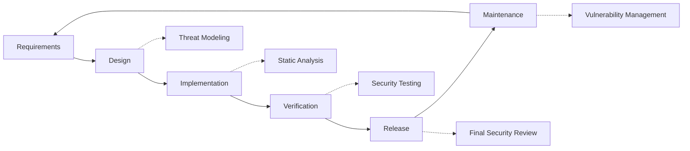

# 보안 관행 {#security-practices}

## 목차 {#table-of-contents}

* [머리말](#foreword)
* [인프라 보안](#infrastructure-security)
  * [보안 데이터 센터](#secure-data-centers)
  * [네트워크 보안](#network-security)
* [이메일 보안](#email-security)
  * [암호화](#encryption)
  * [인증 및 권한 부여](#authentication-and-authorization)
  * [학대 방지 조치](#anti-abuse-measures)
* [데이터 보호](#data-protection)
  * [데이터 최소화](#data-minimization)
  * [백업 및 복구](#backup-and-recovery)
* [서비스 제공자](#service-providers)
* [규정 준수 및 감사](#compliance-and-auditing)
  * [정기 보안 평가](#regular-security-assessments)
  * [규정 준수](#compliance)
* [사고 대응](#incident-response)
* [보안 개발 라이프사이클](#security-development-lifecycle)
* [서버 강화](#server-hardening)
* [서비스 수준 계약](#service-level-agreement)
* [오픈소스 보안](#open-source-security)
* [직원 보안](#employee-security)
* [지속적인 개선](#continuous-improvement)
* [추가 자료](#additional-resources)

## 서문 {#foreword}

Forward Email은 보안을 최우선으로 생각합니다. 고객님의 이메일 커뮤니케이션과 개인 정보를 보호하기 위해 포괄적인 보안 조치를 시행하고 있습니다. 본 문서에서는 Forward Email의 보안 관행과 고객님의 이메일의 기밀성, 무결성, 그리고 가용성을 보장하기 위한 조치를 간략하게 설명합니다.

## 인프라 보안 {#infrastructure-security}

### 보안 데이터 센터 {#secure-data-centers}

당사의 인프라는 다음과 같은 SOC 2 규격을 준수하는 데이터 센터에 호스팅됩니다.

* 24시간 연중무휴 물리적 보안 및 감시
* 생체 인식 출입 통제
* 이중 전력 시스템
* 첨단 화재 감지 및 진압 시스템
* 환경 모니터링

### 네트워크 보안 {#network-security}

우리는 여러 계층의 네트워크 보안을 구현합니다.

* 엄격한 접근 제어 목록을 갖춘 엔터프라이즈급 방화벽
* DDoS 차단 및 완화
* 정기적인 네트워크 취약점 스캐닝
* 침입 탐지 및 방지 시스템
* 모든 서비스 엔드포인트 간 트래픽 암호화
* 의심스러운 활동 자동 차단 기능을 갖춘 포트 스캐닝 보호

> \[!IMPORTANT]
> 전송 중인 모든 데이터는 최신 암호화 제품군을 사용하는 TLS 1.2+를 사용하여 암호화됩니다.

## 이메일 보안 {#email-security}

### 암호화 {#encryption}

* **전송 계층 보안(TLS)**: 모든 이메일 트래픽은 TLS 1.2 이상을 사용하여 전송 중 암호화됩니다.
* **종단 간 암호화**: OpenPGP/MIME 및 S/MIME 표준 지원
* **저장소 암호화**: 저장된 모든 이메일은 SQLite 파일의 ChaCha20-Poly1305 암호화를 사용하여 저장 중에 암호화됩니다.
* **전체 디스크 암호화**: 전체 디스크에 대한 LUKS v2 암호화
* **종합적인 보호**: 저장 중 암호화, 메모리 내 암호화, 전송 중 암호화를 구현합니다.

> \[!NOTE]
> 저희는 **[양자 저항 및 개별 암호화된 SQLite 사서함](https://forwardemail.net/en/blog/docs/best-quantum-safe-encrypted-email-service)**을 사용하는 세계 최초이자 유일한 이메일 서비스입니다.

### 인증 및 권한 부여 {#authentication-and-authorization}

* **DKIM 서명**: 모든 발신 이메일은 DKIM으로 서명됩니다.
* **SPF 및 DMARC**: 이메일 스푸핑 방지를 위해 SPF 및 DMARC를 완벽하게 지원합니다.
* **MTA-STS**: TLS 암호화를 적용하기 위한 MTA-STS를 지원합니다.
* **다중 인증**: 모든 계정 액세스에 사용 가능

### 남용 방지 조치 {#anti-abuse-measures}

* **스팸 필터링**: 머신 러닝을 활용한 다층적 스팸 탐지
* **바이러스 검사**: 모든 첨부 파일 실시간 검사
* **속도 제한**: 무차별 대입 공격 및 열거형 공격으로부터 보호
* **IP 평판**: 발신 IP 평판 모니터링
* **콘텐츠 필터링**: 악성 URL 및 피싱 시도 탐지

## 데이터 보호 {#data-protection}

### 데이터 최소화 {#data-minimization}

우리는 데이터 최소화 원칙을 따릅니다.

* 당사는 서비스 제공에 필요한 데이터만 수집합니다.
* 이메일 내용은 메모리에서 처리되며 IMAP/POP3 전송에 필요한 경우를 제외하고는 영구적으로 저장되지 않습니다.
* 로그는 익명으로 처리되며 필요한 기간 동안만 보관됩니다.

### 백업 및 복구 {#backup-and-recovery}

* 암호화를 통한 자동 일일 백업
* 지리적으로 분산된 백업 스토리지
* 정기적인 백업 복원 테스트
* 정의된 RPO 및 RTO를 갖춘 재해 복구 절차

## 서비스 제공자 {#service-providers}

저희는 엄격한 보안 기준을 충족하는 서비스 제공업체를 엄선하여 선정합니다. 국제 데이터 전송에 사용하는 제공업체와 GDPR 준수 여부는 다음과 같습니다.

| 공급자 | 목적 | DPF 인증 | GDPR 준수 페이지 |
| --------------------------------------------- | ------------------------- | ------------- | ----------------------------------------------------------------- |
| [Cloudflare](https://www.cloudflare.com) | CDN, DDoS 보호, DNS | ✅ 네 | [Cloudflare GDPR](https://www.cloudflare.com/trust-hub/gdpr/) |
| [DataPacket](https://www.datapacket.com) | 서버 인프라 | ❌ 아니요 | [DataPacket Privacy](https://www.datapacket.com/privacy-policy) |
| [Digital Ocean](https://www.digitalocean.com) | 클라우드 인프라 | ❌ 아니요 | [DigitalOcean GDPR](https://www.digitalocean.com/legal/gdpr) |
| [Vultr](https://www.vultr.com) | 클라우드 인프라 | ❌ 아니요 | [Vultr GDPR](https://www.vultr.com/legal/eea-gdpr-privacy/) |
| [Stripe](https://stripe.com) | 결제 처리 | ✅ 네 | [Stripe Privacy Center](https://stripe.com/legal/privacy-center) |
| [PayPal](https://www.paypal.com) | 결제 처리 | ❌ 아니요 | [PayPal Privacy](https://www.paypal.com/uk/legalhub/privacy-full) |

당사는 국제 데이터 보호 규정을 준수하는 동시에 안정적이고 안전한 서비스 제공을 보장하기 위해 이러한 공급업체를 이용합니다. 모든 데이터 전송은 귀하의 개인 정보를 보호하기 위한 적절한 안전장치를 갖추고 진행됩니다.

## 규정 준수 및 감사 {#compliance-and-auditing}

### 정기 보안 평가 {#regular-security-assessments}

저희 팀은 코드베이스, 서버, 인프라 및 보안 관행을 정기적으로 모니터링, 검토 및 평가합니다. 또한, 다음을 포함하는 포괄적인 보안 프로그램을 구현합니다.

* SSH 키 정기 교체
* 액세스 로그 지속적 모니터링
* 자동 보안 스캐닝
* 선제적 취약점 관리
* 모든 팀원을 대상으로 정기적인 보안 교육 실시

### 규정 준수 {#compliance}

* [GDPR](https://forwardemail.net/gdpr) 데이터 처리 관행 준수
* [데이터 처리 계약(DPA)](https://forwardemail.net/dpa) 비즈니스 고객용 제공
* CCPA 준수 개인정보 보호 관리
* SOC 2 Type II 감사 프로세스

## 사고 대응 {#incident-response}

당사의 보안 사고 대응 계획에는 다음이 포함됩니다.

1. **탐지**: 자동 모니터링 및 경고 시스템
2. **격리**: 영향을 받은 시스템의 즉각적인 격리
3. **근절**: 위협 제거 및 근본 원인 분석
4. **복구**: 서비스의 안전한 복구
5. **알림**: 영향을 받은 사용자와의 적시 소통
6. **사고 후 분석**: 종합적인 검토 및 개선

> \[!WARNING]
> 보안 취약점을 발견하시면 즉시 <security@forwardemail.net>으로 신고해 주세요.

## 보안 개발 라이프사이클 {#security-development-lifecycle}

모든 코드는 다음을 거칩니다.

* 보안 요구사항 수집
* 설계 단계의 위협 모델링
* 보안 코딩 관행
* 정적 및 동적 애플리케이션 보안 테스트
* 보안 중심의 코드 검토
* 종속성 취약점 스캐닝

## 서버 강화 {#server-hardening}

[Ansible 구성](https://github.com/forwardemail/forwardemail.net/tree/master/ansible)은 다양한 서버 강화 조치를 구현합니다.

* **USB 액세스 비활성화**: USB 스토리지 커널 모듈을 블랙리스트에 추가하여 물리적 포트를 비활성화합니다.
* **방화벽 규칙**: 엄격한 iptables 규칙을 적용하여 필요한 연결만 허용합니다.
* **SSH 강화**: 키 기반 인증만 사용, 비밀번호 로그인 사용 안 함, 루트 로그인 비활성화
* **서비스 격리**: 각 서비스는 최소한의 필수 권한으로 실행됩니다.
* **자동 업데이트**: 보안 패치가 자동으로 적용됩니다.
* **보안 부팅**: 변조 방지를 위한 검증된 부팅 프로세스
* **커널 강화**: 안전한 커널 매개변수 및 sysctl 구성
* **파일 시스템 제한**: 필요한 경우 noexec, nosuid 및 nodev 마운트 옵션
* **코어 덤프 비활성화**: 보안을 위해 코어 덤프를 방지하도록 시스템을 구성했습니다.
* **스왑 비활성화**: 데이터 유출을 방지하기 위해 스왑 메모리를 비활성화합니다.
* **포트 스캐닝 보호**: 포트 스캐닝 시도를 자동으로 감지하고 차단합니다.
* **투명한 대용량 페이지 비활성화**: 성능 및 보안 향상을 위해 THP를 비활성화합니다.
* **시스템 서비스 강화**: Apport와 같은 비필수 서비스 비활성화
* **사용자 관리**: 배포 및 DevOps 사용자를 분리하는 최소 권한 원칙
* **파일 설명자 제한**: 성능 및 보안 향상을 위해 제한 증가

## 서비스 수준 계약 {#service-level-agreement}

저희는 높은 수준의 서비스 가용성과 안정성을 유지합니다. 저희 인프라는 중복성과 내결함성을 고려하여 설계되어 이메일 서비스가 중단 없이 운영될 수 있도록 보장합니다. 공식적인 SLA 문서는 공개하지 않지만, 저희는 다음과 같은 사항을 준수합니다.

* 모든 서비스 99.9% 이상 가동 시간
* 서비스 중단 시 신속한 대응
* 사고 발생 시 투명한 소통
* 트래픽 저조 기간 정기 유지 관리

## 오픈 소스 보안 {#open-source-security}

[오픈소스 서비스](https://github.com/forwardemail/forwardemail.net)의 경우 다음과 같은 보안 이점이 있습니다.

* 누구나 감사할 수 있는 투명한 코드
* 커뮤니티 주도 보안 개선
* 취약점 신속한 식별 및 패치
* 모호함을 통한 보안 없음

## 직원 보안 {#employee-security}

* 모든 직원 신원 조회
* 보안 인식 교육
* 최소 권한 접근 원칙
* 정기적인 보안 교육

## 지속적인 개선 {#continuous-improvement}

당사는 다음을 통해 지속적으로 보안 태세를 개선하고 있습니다.

* 보안 동향 및 신규 위협 모니터링
* 보안 정책 정기 검토 및 업데이트
* 보안 연구원 및 사용자 피드백
* 보안 커뮤니티 참여

당사의 보안 관행에 대한 자세한 내용을 알아보거나 보안 문제를 보고하려면 <security@forwardemail.net>으로 연락해 주세요.

## 추가 리소스 {#additional-resources}

* [개인정보 보호정책](https://forwardemail.net/en/privacy)
* [서비스 약관](https://forwardemail.net/en/terms)
* [GDPR 준수](https://forwardemail.net/gdpr)
* [데이터 처리 계약(DPA)](https://forwardemail.net/dpa)
* [학대 신고](https://forwardemail.net/en/report-abuse)
* [보안 정책](https://github.com/forwardemail/.github/blob/main/SECURITY.md)
* [Security.txt](https://forwardemail.net/security.txt)
* [GitHub 저장소](https://github.com/forwardemail/forwardemail.net)
* [FAQ](https://forwardemail.net/en/faq)