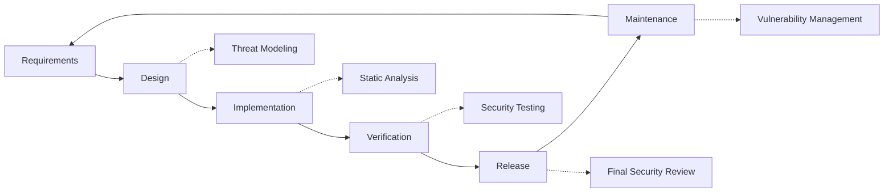

# 보안 관행 {#security-practices}

## 목차 {#table-of-contents}

* [서문](#foreword)
* [인프라 보안](#infrastructure-security)
  * [안전한 데이터 센터](#secure-data-centers)
  * [네트워크 보안](#network-security)
* [이메일 보안](#email-security)
  * [암호화](#encryption)
  * [인증 및 권한 부여](#authentication-and-authorization)
  * [악용 방지 조치](#anti-abuse-measures)
* [데이터 보호](#data-protection)
  * [데이터 최소화](#data-minimization)
  * [백업 및 복구](#backup-and-recovery)
* [서비스 제공자](#service-providers)
* [준수 및 감사](#compliance-and-auditing)
  * [정기 보안 평가](#regular-security-assessments)
  * [준수](#compliance)
* [사고 대응](#incident-response)
* [보안 개발 수명 주기](#security-development-lifecycle)
* [서버 강화](#server-hardening)
* [서비스 수준 계약](#service-level-agreement)
* [오픈 소스 보안](#open-source-security)
* [직원 보안](#employee-security)
* [지속적인 개선](#continuous-improvement)
* [추가 자료](#additional-resources)

## 서문 {#foreword}

Forward Email에서는 보안을 최우선으로 생각합니다. 이메일 통신과 개인 데이터를 보호하기 위해 포괄적인 보안 조치를 시행하고 있습니다. 이 문서는 당사의 보안 관행과 이메일의 기밀성, 무결성 및 가용성을 보장하기 위해 취하는 단계를 설명합니다.

## 인프라 보안 {#infrastructure-security}

### 안전한 데이터 센터 {#secure-data-centers}

당사의 인프라는 SOC 2 준수 데이터 센터에 호스팅되어 있으며 다음과 같은 특징이 있습니다:

* 24시간 물리적 보안 및 감시
* 생체 인식 출입 통제
* 이중 전원 시스템
* 고급 화재 감지 및 진압 시스템
* 환경 모니터링

### 네트워크 보안 {#network-security}

다중 계층의 네트워크 보안을 구현합니다:

* 엄격한 접근 제어 목록이 적용된 엔터프라이즈급 방화벽
* DDoS 방어 및 완화
* 정기적인 네트워크 취약점 스캔
* 침입 탐지 및 방지 시스템
* 모든 서비스 엔드포인트 간 트래픽 암호화
* 의심스러운 활동 자동 차단을 포함한 포트 스캔 방어

> \[!IMPORTANT]
> 모든 전송 중 데이터는 최신 암호화 스위트를 사용하는 TLS 1.2 이상으로 암호화됩니다.

## 이메일 보안 {#email-security}

### 암호화 {#encryption}

* **전송 계층 보안 (TLS)**: 모든 이메일 트래픽은 TLS 1.2 이상을 사용하여 전송 중 암호화됩니다
* **종단 간 암호화**: OpenPGP/MIME 및 S/MIME 표준 지원
* **저장 암호화**: 저장된 모든 이메일은 SQLite 파일 내에서 ChaCha20-Poly1305 암호화를 사용하여 암호화됩니다
* **전체 디스크 암호화**: 전체 디스크에 대해 LUKS v2 암호화 적용
* **포괄적 보호**: 저장 시 암호화, 메모리 내 암호화, 전송 중 암호화를 모두 구현합니다

> \[!NOTE]
> 우리는 세계 최초이자 유일하게 **[양자 내성 및 개별 암호화된 SQLite 메일박스](https://forwardemail.net/en/blog/docs/best-quantum-safe-encrypted-email-service)** 를 사용하는 이메일 서비스입니다.

### 인증 및 권한 부여 {#authentication-and-authorization}

* **DKIM 서명**: 모든 발신 이메일은 DKIM으로 서명됩니다
* **SPF 및 DMARC**: 이메일 스푸핑 방지를 위한 SPF 및 DMARC 완전 지원
* **MTA-STS**: TLS 암호화를 강제하는 MTA-STS 지원
* **다중 요소 인증**: 모든 계정 접근에 사용 가능

### 악용 방지 조치 {#anti-abuse-measures}

* **스팸 필터링**: 머신러닝 기반 다중 계층 스팸 탐지
* **바이러스 검사**: 모든 첨부파일 실시간 검사
* **속도 제한**: 무차별 대입 및 열거 공격 방어
* **IP 평판**: 발신 IP 평판 모니터링
* **콘텐츠 필터링**: 악성 URL 및 피싱 시도 탐지

## 데이터 보호 {#data-protection}

### 데이터 최소화 {#data-minimization}

우리는 데이터 최소화 원칙을 따릅니다:

* 서비스 제공에 필요한 데이터만 수집합니다
* 이메일 내용은 메모리 내에서 처리되며 IMAP/POP3 전달에 필요한 경우를 제외하고는 영구 저장하지 않습니다
* 로그는 익명화되며 필요한 기간 동안만 보관됩니다
### 백업 및 복구 {#backup-and-recovery}

* 암호화된 자동 일일 백업
* 지리적으로 분산된 백업 저장소
* 정기적인 백업 복원 테스트
* 정의된 RPO 및 RTO를 포함한 재해 복구 절차

## 서비스 제공업체 {#service-providers}

우리는 높은 보안 기준을 충족하는지 확인하기 위해 서비스 제공업체를 신중하게 선택합니다. 아래는 국제 데이터 전송에 사용하는 제공업체와 그들의 GDPR 준수 상태입니다:

| 제공업체                                      | 용도                       | DPF 인증       | GDPR 준수 페이지                                                                                      |
| --------------------------------------------- | -------------------------- | ------------- | ------------------------------------------------------------------------------------------------------- |
| [Cloudflare](https://www.cloudflare.com)      | CDN, DDoS 보호, DNS        | ✅ 예          | [Cloudflare GDPR](https://www.cloudflare.com/trust-hub/gdpr/)                                           |
| [DataPacket](https://www.datapacket.com)      | 서버 인프라                | ❌ 아니오      | [DataPacket Privacy](https://www.datapacket.com/privacy-policy)                                         |
| [Digital Ocean](https://www.digitalocean.com) | 클라우드 인프라            | ❌ 아니오      | [DigitalOcean GDPR](https://www.digitalocean.com/legal/gdpr)                                            |
| [GitHub](https://github.com)                  | 소스 코드 호스팅, CI/CD    | ✅ 예          | [GitHub GDPR](https://docs.github.com/en/site-policy/privacy-policies/github-data-protection-agreement) |
| [Vultr](https://www.vultr.com)                | 클라우드 인프라            | ❌ 아니오      | [Vultr GDPR](https://www.vultr.com/legal/eea-gdpr-privacy/)                                             |
| [Stripe](https://stripe.com)                  | 결제 처리                  | ✅ 예          | [Stripe Privacy Center](https://stripe.com/legal/privacy-center)                                        |
| [PayPal](https://www.paypal.com)              | 결제 처리                  | ❌ 아니오      | [PayPal Privacy](https://www.paypal.com/uk/legalhub/privacy-full)                                       |

우리는 이러한 제공업체를 사용하여 신뢰할 수 있고 안전한 서비스 제공을 보장하며 국제 데이터 보호 규정을 준수합니다. 모든 데이터 전송은 귀하의 개인 정보를 보호하기 위한 적절한 보호 조치를 갖추고 수행됩니다.

## 준수 및 감사 {#compliance-and-auditing}

### 정기 보안 평가 {#regular-security-assessments}

우리 팀은 코드베이스, 서버, 인프라 및 관행을 정기적으로 모니터링, 검토 및 평가합니다. 우리는 다음을 포함하는 포괄적인 보안 프로그램을 구현합니다:

* SSH 키의 정기적 교체
* 접근 로그의 지속적 모니터링
* 자동화된 보안 스캔
* 사전 예방적 취약점 관리
* 모든 팀원 대상 정기 보안 교육

### 준수 {#compliance}

* [GDPR](https://forwardemail.net/gdpr) 준수 데이터 처리 관행
* 비즈니스 고객을 위한 [데이터 처리 계약서(DPA)](https://forwardemail.net/dpa) 제공
* CCPA 준수 개인정보 보호 통제
* SOC 2 유형 II 감사 프로세스

## 사고 대응 {#incident-response}

우리의 보안 사고 대응 계획에는 다음이 포함됩니다:

1. **탐지**: 자동화된 모니터링 및 경고 시스템
2. **격리**: 영향을 받은 시스템 즉시 격리
3. **근절**: 위협 제거 및 근본 원인 분석
4. **복구**: 서비스의 안전한 복원
5. **통지**: 영향받은 사용자에게 신속한 소통
6. **사후 분석**: 종합적인 검토 및 개선

> \[!WARNING]
> 보안 취약점을 발견하면 즉시 <security@forwardemail.net>으로 신고해 주세요.

## 보안 개발 수명주기 {#security-development-lifecycle}

```mermaid
flowchart LR
    A[Requirements] --> B[Design]
    B --> C[Implementation]
    C --> D[Verification]
    D --> E[Release]
    E --> F[Maintenance]
    F --> A
    B -.-> G[Threat Modeling]
    C -.-> H[Static Analysis]
    D -.-> I[Security Testing]
    E -.-> J[Final Security Review]
    F -.-> K[Vulnerability Management]
```
모든 코드는 다음 절차를 거칩니다:

* 보안 요구사항 수집
* 설계 단계에서 위협 모델링
* 안전한 코딩 관행
* 정적 및 동적 애플리케이션 보안 테스트
* 보안 중심 코드 리뷰
* 의존성 취약점 스캔

## 서버 강화 {#server-hardening}

우리의 [Ansible 구성](https://github.com/forwardemail/forwardemail.net/tree/master/ansible)은 다양한 서버 강화 조치를 구현합니다:

* **USB 접근 비활성화**: usb-storage 커널 모듈을 블랙리스트 처리하여 물리적 포트 비활성화
* **방화벽 규칙**: 필요한 연결만 허용하는 엄격한 iptables 규칙
* **SSH 강화**: 키 기반 인증만 허용, 비밀번호 로그인 금지, 루트 로그인 비활성화
* **서비스 격리**: 각 서비스는 최소 권한으로 실행
* **자동 업데이트**: 보안 패치 자동 적용
* **안전 부팅**: 변조 방지를 위한 검증된 부팅 프로세스
* **커널 강화**: 안전한 커널 파라미터 및 sysctl 구성
* **파일 시스템 제한**: 적절한 경우 noexec, nosuid, nodev 마운트 옵션 적용
* **코어 덤프 비활성화**: 보안을 위해 코어 덤프 방지 설정
* **스왑 비활성화**: 데이터 유출 방지를 위해 스왑 메모리 비활성화
* **포트 스캐닝 방지**: 포트 스캔 시도 자동 탐지 및 차단
* **투명 거대 페이지 비활성화**: 성능 및 보안 향상을 위해 THP 비활성화
* **시스템 서비스 강화**: Apport 같은 불필요한 서비스 비활성화
* **사용자 관리**: 최소 권한 원칙에 따라 별도의 배포 및 데브옵스 사용자 운영
* **파일 디스크립터 제한**: 성능 및 보안을 위한 제한 상향 조정

## 서비스 수준 계약 {#service-level-agreement}

우리는 높은 수준의 서비스 가용성과 신뢰성을 유지합니다. 인프라는 중복성과 내결함성을 고려하여 설계되어 이메일 서비스가 지속적으로 운영되도록 보장합니다. 공식 SLA 문서는 공개하지 않지만, 다음을 약속합니다:

* 모든 서비스 99.9% 이상의 가동 시간
* 서비스 중단 시 신속한 대응
* 사고 발생 시 투명한 소통
* 트래픽이 적은 시간대에 정기적인 유지보수

## 오픈 소스 보안 {#open-source-security}

[오픈 소스 서비스](https://github.com/forwardemail/forwardemail.net)로서 우리의 보안은 다음과 같은 이점을 가집니다:

* 누구나 감사할 수 있는 투명한 코드
* 커뮤니티 주도의 보안 개선
* 취약점의 신속한 식별 및 패치
* 보안 은폐 없음

## 직원 보안 {#employee-security}

* 모든 직원에 대한 배경 조사
* 보안 인식 교육
* 최소 권한 접근 원칙
* 정기적인 보안 교육

## 지속적인 개선 {#continuous-improvement}

우리는 다음을 통해 보안 태세를 지속적으로 개선합니다:

* 보안 동향 및 신종 위협 모니터링
* 보안 정책의 정기적 검토 및 업데이트
* 보안 연구원 및 사용자 피드백 반영
* 보안 커뮤니티 참여

우리의 보안 관행에 대한 자세한 정보나 보안 문제 신고는 <security@forwardemail.net>으로 연락해 주세요.

## 추가 자료 {#additional-resources}

* [개인정보 처리방침](https://forwardemail.net/en/privacy)
* [서비스 약관](https://forwardemail.net/en/terms)
* [GDPR 준수](https://forwardemail.net/gdpr)
* [데이터 처리 계약서 (DPA)](https://forwardemail.net/dpa)
* [악용 신고](https://forwardemail.net/en/report-abuse)
* [보안 정책](https://github.com/forwardemail/.github/blob/main/SECURITY.md)
* [Security.txt](https://forwardemail.net/security.txt)
* [GitHub 저장소](https://github.com/forwardemail/forwardemail.net)
* [자주 묻는 질문](https://forwardemail.net/en/faq)
