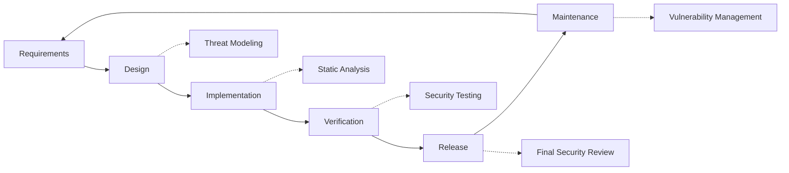

# Beveiligingspraktijken {#security-practices}

## Inhoudsopgave {#table-of-contents}

* [Voorwoord](#foreword)
* [Infrastructuurbeveiliging](#infrastructure-security)
  * [Beveiligde datacenters](#secure-data-centers)
  * [Netwerkbeveiliging](#network-security)
* [E-mailbeveiliging](#email-security)
  * [Encryptie](#encryption)
  * [Authenticatie en autorisatie](#authentication-and-authorization)
  * [Maatregelen tegen misbruik](#anti-abuse-measures)
* [Gegevensbescherming](#data-protection)
  * [Gegevensminimalisatie](#data-minimization)
  * [Back-up en herstel](#backup-and-recovery)
* [Dienstverleners](#service-providers)
* [Naleving en auditing](#compliance-and-auditing)
  * [Regelmatige beveiligingsbeoordelingen](#regular-security-assessments)
  * [Naleving](#compliance)
* [Incidentrespons](#incident-response)
* [Levenscyclus van beveiligingsontwikkeling](#security-development-lifecycle)
* [Serververharding](#server-hardening)
* [Service Level Agreement](#service-level-agreement)
* [Open Source Beveiliging](#open-source-security)
* [Werknemersbeveiliging](#employee-security)
* [Continue verbetering](#continuous-improvement)
* [Aanvullende bronnen](#additional-resources)

## Voorwoord {#foreword}

Bij Forward Email staat veiligheid voorop. We hebben uitgebreide beveiligingsmaatregelen geïmplementeerd om uw e-mailcommunicatie en persoonsgegevens te beschermen. Dit document beschrijft onze beveiligingspraktijken en de stappen die we nemen om de vertrouwelijkheid, integriteit en beschikbaarheid van uw e-mail te waarborgen.

## Infrastructuurbeveiliging {#infrastructure-security}

### Beveiligde datacenters {#secure-data-centers}

Onze infrastructuur wordt gehost in SOC 2-conforme datacenters met:

* 24/7 fysieke beveiliging en bewaking
* Biometrische toegangscontrole
* Redundante stroomsystemen
* Geavanceerde branddetectie en -bestrijding
* Omgevingsbewaking

### Netwerkbeveiliging {#network-security}

Wij implementeren meerdere lagen netwerkbeveiliging:

* Firewalls van enterprise-kwaliteit met strikte toegangscontrolelijsten
* DDoS-beveiliging en -mitigatie
* Regelmatige scans op netwerkkwetsbaarheden
* Systemen voor inbraakdetectie en -preventie
* Versleuteling van verkeer tussen alle service-eindpunten
* Beveiliging met poortscans en automatische blokkering van verdachte activiteiten

> \[!IMPORTANT]
> Alle gegevens die worden verzonden, worden versleuteld met TLS 1.2+ en moderne coderingssuites.

## E-mailbeveiliging {#email-security}

### Versleuteling {#encryption}

* **Transport Layer Security (TLS)**: Al het e-mailverkeer wordt tijdens de overdracht versleuteld met TLS 1.2 of hoger
* **End-to-end encryptie**: Ondersteuning voor OpenPGP/MIME- en S/MIME-standaarden
* **Opslagversleuteling**: Alle opgeslagen e-mails worden in rust versleuteld met ChaCha20-Poly1305-versleuteling in SQLite-bestanden
* **Volledige schijfversleuteling**: LUKS v2-versleuteling voor de gehele schijf
* **Uitgebreide bescherming**: We implementeren encryptie in rust, encryptie in het geheugen en encryptie tijdens de overdracht

> \[!NOTE]
> Wij zijn 's werelds eerste en enige e-mailservice die **[kwantumbestendige en individueel gecodeerde SQLite-mailboxen](https://forwardemail.net/en/blog/docs/best-quantum-safe-encrypted-email-service)** gebruikt.

### Authenticatie en autorisatie {#authentication-and-authorization}

* **DKIM-ondertekening**: Alle uitgaande e-mails worden ondertekend met DKIM
* **SPF en DMARC**: Volledige ondersteuning voor SPF en DMARC om e-mailspoofing te voorkomen
* **MTA-STS**: Ondersteuning voor MTA-STS om TLS-encryptie af te dwingen
* **Multi-factorauthenticatie**: Beschikbaar voor alle accounttoegang

### Anti-misbruikmaatregelen {#anti-abuse-measures}

* **Spamfiltering**: Meerlaagse spamdetectie met machine learning
* **Virusscanning**: Realtime scannen van alle bijlagen
* **Rate Limiting**: Bescherming tegen brute force- en enumeratieaanvallen
* **IP-reputatie**: Monitoring van de reputatie van het verzend-IP
* **Contentfiltering**: Detectie van kwaadaardige URL's en phishingpogingen

## Gegevensbescherming {#data-protection}

### Gegevensminimalisatie {#data-minimization}

Wij volgen het principe van dataminimalisatie:

* We verzamelen alleen de gegevens die nodig zijn om onze service te leveren.
* E-mailinhoud wordt in het geheugen verwerkt en niet permanent opgeslagen, tenzij dit nodig is voor IMAP/POP3-levering.
* Logs worden geanonimiseerd en alleen bewaard zolang dat nodig is.

### Back-up en herstel {#backup-and-recovery}

* Geautomatiseerde dagelijkse back-ups met encryptie
* Geografisch verspreide back-upopslag
* Regelmatige back-uphersteltests
* Procedures voor noodherstel met gedefinieerde RPO en RTO

## Dienstverleners {#service-providers}

We selecteren onze dienstverleners zorgvuldig om ervoor te zorgen dat ze voldoen aan onze hoge veiligheidsnormen. Hieronder vindt u de dienstverleners die we gebruiken voor internationale gegevensoverdracht en hun AVG-nalevingsstatus:

| Aanbieder | Doel | DPF-gecertificeerd | AVG-nalevingspagina |
| --------------------------------------------- | ------------------------- | ------------- | ----------------------------------------------------------------- |
| [Cloudflare](https://www.cloudflare.com) | CDN, DDoS-beveiliging, DNS | ✅ Ja | [Cloudflare GDPR](https://www.cloudflare.com/trust-hub/gdpr/) |
| [DataPacket](https://www.datapacket.com) | Serverinfrastructuur | ❌ Nee | [DataPacket Privacy](https://www.datapacket.com/privacy-policy) |
| [Digital Ocean](https://www.digitalocean.com) | Cloudinfrastructuur | ❌ Nee | [DigitalOcean GDPR](https://www.digitalocean.com/legal/gdpr) |
| [Vultr](https://www.vultr.com) | Cloudinfrastructuur | ❌ Nee | [Vultr GDPR](https://www.vultr.com/legal/eea-gdpr-privacy/) |
| [Stripe](https://stripe.com) | Betalingsverwerking | ✅ Ja | [Stripe Privacy Center](https://stripe.com/legal/privacy-center) |
| [PayPal](https://www.paypal.com) | Betalingsverwerking | ❌ Nee | [PayPal Privacy](https://www.paypal.com/uk/legalhub/privacy-full) |

We maken gebruik van deze providers om een betrouwbare en veilige dienstverlening te garanderen en tegelijkertijd te voldoen aan de internationale regelgeving inzake gegevensbescherming. Alle gegevensoverdrachten worden uitgevoerd met passende waarborgen om uw persoonsgegevens te beschermen.

## Naleving en auditing {#compliance-and-auditing}

### Regelmatige beveiligingsbeoordelingen {#regular-security-assessments}

Ons team controleert, beoordeelt en beoordeelt regelmatig de codebase, servers, infrastructuur en procedures. We implementeren een uitgebreid beveiligingsprogramma dat het volgende omvat:

* Regelmatige rotatie van SSH-sleutels
* Continue monitoring van toegangslogs
* Geautomatiseerde beveiligingsscans
* Proactief kwetsbaarheidsbeheer
* Regelmatige beveiligingstraining voor alle teamleden

### Naleving {#compliance}

* [GDPR](https://forwardemail.net/gdpr)-conforme gegevensverwerkingspraktijken
* [Gegevensverwerkingsovereenkomst (DPA)](https://forwardemail.net/dpa) beschikbaar voor zakelijke klanten
* CCPA-conforme privacycontroles
* SOC 2 Type II-gecontroleerde processen

## Incidentrespons {#incident-response}

Ons plan voor respons op beveiligingsincidenten omvat:

1. **Detectie**: Geautomatiseerde monitoring- en waarschuwingssystemen
2. **Containment**: Onmiddellijke isolatie van getroffen systemen
3. **Uitroeiing**: Verwijdering van de bedreiging en analyse van de hoofdoorzaak
4. **Herstel**: Veilig herstel van services
5. **Melding**: Tijdige communicatie met getroffen gebruikers
6. **Analyse na incident**: Uitgebreide evaluatie en verbetering

> \[!WARNING]
> Als u een beveiligingslek ontdekt, meld dit dan onmiddellijk aan <security@forwardemail.net>.

## Levenscyclus van beveiligingsontwikkeling {#security-development-lifecycle}

Alle code ondergaat:

* Verzamelen van beveiligingsvereisten
* Bedreigingsmodellering tijdens het ontwerp
* Veilige coderingsmethoden
* Statische en dynamische applicatiebeveiligingstesten
* Codebeoordeling met beveiligingsfocus
* Scannen op afhankelijkheidskwetsbaarheid

## Serververharding {#server-hardening}

Onze [Ansible-configuratie](https://github.com/forwardemail/forwardemail.net/tree/master/ansible) implementeert talrijke serverbeveiligingsmaatregelen:

* **USB-toegang uitgeschakeld**: Fysieke poorten worden uitgeschakeld door de USB-opslagkernelmodule op een zwarte lijst te plaatsen
* **Firewallregels**: Strikte iptables-regels die alleen noodzakelijke verbindingen toestaan
* **SSH-beveiliging**: Alleen sleutelgebaseerde authenticatie, geen wachtwoordaanmelding, root-aanmelding uitgeschakeld
* **Service-isolatie**: Elke service wordt uitgevoerd met minimaal vereiste rechten
* **Automatische updates**: Beveiligingspatches worden automatisch toegepast
* **Beveiligd opstarten**: Geverifieerd opstartproces om manipulatie te voorkomen
* **Kernelbeveiliging**: Veilige kernelparameters en sysctl-configuraties
* **Beperkingen bestandssysteem**: noexec-, nosuid- en nodev-koppelingsopties waar van toepassing
* **Coredumps uitgeschakeld**: Systeem geconfigureerd om coredumps te voorkomen voor de beveiliging
* **Swap uitgeschakeld**: Swapgeheugen uitgeschakeld om datalekken te voorkomen
* **Beveiliging poortscanning**: Automatische detectie en blokkering van poortscanpogingen
* **Transparante grote pagina's uitgeschakeld**: THP uitgeschakeld voor verbeterde prestaties en Beveiliging
* **Systeemserviceverharding**: Niet-essentiële services zoals Apport uitgeschakeld
* **Gebruikersbeheer**: Principe van minimale privileges met aparte implementatie- en DevOps-gebruikers
* **Bestandsdescriptorlimieten**: Verhoogde limieten voor betere prestaties en beveiliging

## Service Level Agreement {#service-level-agreement}

We handhaven een hoog niveau van beschikbaarheid en betrouwbaarheid van onze diensten. Onze infrastructuur is ontworpen voor redundantie en fouttolerantie om ervoor te zorgen dat uw e-mailservice operationeel blijft. Hoewel we geen formeel SLA-document publiceren, streven we ernaar:

* 99,9%+ uptime voor alle services
* Snelle reactie op serviceonderbrekingen
* Transparante communicatie tijdens incidenten
* Regelmatig onderhoud tijdens periodes met weinig verkeer

## Open Source Beveiliging {#open-source-security}

Als [open-source service](https://github.com/forwardemail/forwardemail.net) profiteert u van onze beveiliging:

* Transparante code die door iedereen gecontroleerd kan worden
* Door de community aangestuurde beveiligingsverbeteringen
* Snelle identificatie en patching van kwetsbaarheden
* Geen beveiliging door onduidelijkheid

## Medewerkersbeveiliging {#employee-security}

* Achtergrondcontroles voor alle medewerkers
* Training in beveiligingsbewustzijn
* Principe van minimale toegangsrechten
* Regelmatige beveiligingstraining

## Continue verbetering {#continuous-improvement}

Wij verbeteren voortdurend onze beveiligingshouding door:

* Monitoring van beveiligingstrends en opkomende bedreigingen
* Regelmatige evaluatie en updates van beveiligingsbeleid
* Feedback van beveiligingsonderzoekers en gebruikers
* Deelname aan de beveiligingscommunity

Voor meer informatie over onze beveiligingspraktijken of om beveiligingsproblemen te melden, kunt u contact opnemen met <security@forwardemail.net>.

## Aanvullende bronnen {#additional-resources}

* [Privacybeleid](https://forwardemail.net/en/privacy)
* [Servicevoorwaarden](https://forwardemail.net/en/terms)
* [AVG-naleving](https://forwardemail.net/gdpr)
* [Gegevensverwerkingsovereenkomst (DPA)](https://forwardemail.net/dpa)
* [Misbruik melden](https://forwardemail.net/en/report-abuse)
* [Beveiligingsbeleid](https://github.com/forwardemail/.github/blob/main/SECURITY.md)
* [Security.txt](https://forwardemail.net/security.txt)
* [GitHub-repository](https://github.com/forwardemail/forwardemail.net)
* [FAQ](https://forwardemail.net/en/faq)