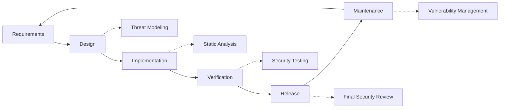

# Beveiligingspraktijken {#security-practices}

## Inhoudsopgave {#table-of-contents}

* [Voorwoord](#foreword)
* [Infrastructuurbeveiliging](#infrastructure-security)
  * [Veilige Datacenters](#secure-data-centers)
  * [Netwerkbeveiliging](#network-security)
* [E-mailbeveiliging](#email-security)
  * [Encryptie](#encryption)
  * [Authenticatie en Autorisatie](#authentication-and-authorization)
  * [Anti-misbruikmaatregelen](#anti-abuse-measures)
* [Gegevensbescherming](#data-protection)
  * [Dataminimalisatie](#data-minimization)
  * [Back-up en Herstel](#backup-and-recovery)
* [Dienstverleners](#service-providers)
* [Naleving en Auditing](#compliance-and-auditing)
  * [Regelmatige Beveiligingsbeoordelingen](#regular-security-assessments)
  * [Naleving](#compliance)
* [Incidentrespons](#incident-response)
* [Beveiligingsontwikkelingslevenscyclus](#security-development-lifecycle)
* [Serververharding](#server-hardening)
* [Service Level Agreement](#service-level-agreement)
* [Open Source Beveiliging](#open-source-security)
* [Medewerkerbeveiliging](#employee-security)
* [Continue Verbetering](#continuous-improvement)
* [Aanvullende Bronnen](#additional-resources)

## Voorwoord {#foreword}

Bij Forward Email is beveiliging onze hoogste prioriteit. We hebben uitgebreide beveiligingsmaatregelen geïmplementeerd om uw e-mailcommunicatie en persoonlijke gegevens te beschermen. Dit document beschrijft onze beveiligingspraktijken en de stappen die we nemen om de vertrouwelijkheid, integriteit en beschikbaarheid van uw e-mail te waarborgen.

## Infrastructuurbeveiliging {#infrastructure-security}

### Veilige Datacenters {#secure-data-centers}

Onze infrastructuur wordt gehost in SOC 2-conforme datacenters met:

* 24/7 fysieke beveiliging en bewaking
* Biometrische toegangscontroles
* Redundante stroomvoorzieningen
* Geavanceerde branddetectie en -blussing
* Milieubewaking

### Netwerkbeveiliging {#network-security}

We implementeren meerdere lagen netwerkbeveiliging:

* Enterprise-grade firewalls met strikte toegangscontrollijsten
* DDoS-bescherming en mitigatie
* Regelmatige netwerk kwetsbaarheidsscans
* Inbraakdetectie- en preventiesystemen
* Verkeer encryptie tussen alle service-eindpunten
* Poortscanningbescherming met automatische blokkering van verdachte activiteiten

> \[!IMPORTANT]
> Alle data in transit is versleuteld met TLS 1.2+ met moderne cipher suites.

## E-mailbeveiliging {#email-security}

### Encryptie {#encryption}

* **Transport Layer Security (TLS)**: Alle e-mailverkeer is versleuteld tijdens verzending met TLS 1.2 of hoger
* **End-to-End Encryptie**: Ondersteuning voor OpenPGP/MIME en S/MIME standaarden
* **Opslagencryptie**: Alle opgeslagen e-mails zijn versleuteld in rust met ChaCha20-Poly1305 encryptie in SQLite-bestanden
* **Volledige Schijf Encryptie**: LUKS v2 encryptie voor de gehele schijf
* **Uitgebreide Bescherming**: We implementeren encryptie in rust, encryptie in geheugen en encryptie tijdens transport

> \[!NOTE]
> We zijn 's werelds eerste en enige e-maildienst die **[kwantumresistente en individueel versleutelde SQLite-mailboxen](https://forwardemail.net/en/blog/docs/best-quantum-safe-encrypted-email-service)** gebruikt.

### Authenticatie en Autorisatie {#authentication-and-authorization}

* **DKIM Ondertekening**: Alle uitgaande e-mails worden ondertekend met DKIM
* **SPF en DMARC**: Volledige ondersteuning voor SPF en DMARC om e-mailspoofing te voorkomen
* **MTA-STS**: Ondersteuning voor MTA-STS om TLS-encryptie af te dwingen
* **Multi-Factor Authenticatie**: Beschikbaar voor alle accounttoegang

### Anti-misbruikmaatregelen {#anti-abuse-measures}

* **Spamfiltering**: Meerdere lagen spamdetectie met machine learning
* **Virus Scanning**: Real-time scanning van alle bijlagen
* **Rate Limiting**: Bescherming tegen brute force en enumeratie-aanvallen
* **IP Reputatie**: Monitoring van verzendende IP-reputatie
* **Content Filtering**: Detectie van kwaadaardige URL's en phishingpogingen

## Gegevensbescherming {#data-protection}

### Dataminimalisatie {#data-minimization}

We volgen het principe van dataminimalisatie:

* We verzamelen alleen de gegevens die nodig zijn om onze dienst te leveren
* E-mailinhoud wordt in het geheugen verwerkt en niet persistent opgeslagen tenzij vereist voor IMAP/POP3 levering
* Logs worden geanonimiseerd en alleen bewaard zolang noodzakelijk
### Backup en Herstel {#backup-and-recovery}

* Geautomatiseerde dagelijkse back-ups met encryptie
* Geografisch verspreide back-up opslag
* Regelmatige tests van back-up herstel
* Procedures voor rampenherstel met gedefinieerde RPO en RTO

## Dienstverleners {#service-providers}

We selecteren onze dienstverleners zorgvuldig om te garanderen dat zij voldoen aan onze hoge beveiligingsnormen. Hieronder staan de providers die we gebruiken voor internationale gegevensoverdracht en hun GDPR-nalevingsstatus:

| Provider                                      | Doel                       | DPF Gecertificeerd | GDPR Nalevingspagina                                                                                   |
| --------------------------------------------- | -------------------------- | ------------------ | ------------------------------------------------------------------------------------------------------- |
| [Cloudflare](https://www.cloudflare.com)      | CDN, DDoS-bescherming, DNS | ✅ Ja               | [Cloudflare GDPR](https://www.cloudflare.com/trust-hub/gdpr/)                                           |
| [DataPacket](https://www.datapacket.com)      | Serverinfrastructuur       | ❌ Nee              | [DataPacket Privacy](https://www.datapacket.com/privacy-policy)                                         |
| [Digital Ocean](https://www.digitalocean.com) | Cloudinfrastructuur        | ❌ Nee              | [DigitalOcean GDPR](https://www.digitalocean.com/legal/gdpr)                                            |
| [GitHub](https://github.com)                  | Broncode hosting, CI/CD    | ✅ Ja               | [GitHub GDPR](https://docs.github.com/en/site-policy/privacy-policies/github-data-protection-agreement) |
| [Vultr](https://www.vultr.com)                | Cloudinfrastructuur        | ❌ Nee              | [Vultr GDPR](https://www.vultr.com/legal/eea-gdpr-privacy/)                                             |
| [Stripe](https://stripe.com)                  | Betalingsverwerking        | ✅ Ja               | [Stripe Privacy Center](https://stripe.com/legal/privacy-center)                                        |
| [PayPal](https://www.paypal.com)              | Betalingsverwerking        | ❌ Nee              | [PayPal Privacy](https://www.paypal.com/uk/legalhub/privacy-full)                                       |

We gebruiken deze providers om betrouwbare, veilige dienstverlening te garanderen en tegelijkertijd te voldoen aan internationale regelgeving voor gegevensbescherming. Alle gegevensoverdrachten worden uitgevoerd met passende waarborgen om uw persoonlijke informatie te beschermen.

## Naleving en Auditing {#compliance-and-auditing}

### Regelmatige Beveiligingsbeoordelingen {#regular-security-assessments}

Ons team monitort, beoordeelt en evalueert regelmatig de codebase, servers, infrastructuur en werkwijzen. We implementeren een uitgebreid beveiligingsprogramma dat omvat:

* Regelmatige rotatie van SSH-sleutels
* Continue monitoring van toegangslogboeken
* Geautomatiseerde beveiligingsscans
* Proactief beheer van kwetsbaarheden
* Regelmatige beveiligingstraining voor alle teamleden

### Naleving {#compliance}

* [GDPR](https://forwardemail.net/gdpr) conforme omgang met gegevens
* [Data Processing Agreement (DPA)](https://forwardemail.net/dpa) beschikbaar voor zakelijke klanten
* CCPA conforme privacycontroles
* SOC 2 Type II geaudit processen

## Incidentrespons {#incident-response}

Ons plan voor beveiligingsincidentrespons omvat:

1. **Detectie**: Geautomatiseerde monitoring- en waarschuwingssystemen
2. **Beperking**: Onmiddellijke isolatie van getroffen systemen
3. **Uitroeiing**: Verwijdering van de dreiging en analyse van de oorzaak
4. **Herstel**: Veilige herstel van diensten
5. **Melding**: Tijdige communicatie met getroffen gebruikers
6. **Analyse na incident**: Uitgebreide evaluatie en verbetering

> \[!WARNING]
> Als u een beveiligingslek ontdekt, meld dit dan onmiddellijk aan <security@forwardemail.net>.

## Security Development Lifecycle {#security-development-lifecycle}

```mermaid
flowchart LR
    A[Requirements] --> B[Design]
    B --> C[Implementation]
    C --> D[Verification]
    D --> E[Release]
    E --> F[Maintenance]
    F --> A
    B -.-> G[Threat Modeling]
    C -.-> H[Static Analysis]
    D -.-> I[Security Testing]
    E -.-> J[Final Security Review]
    F -.-> K[Vulnerability Management]
```
Alle code ondergaat:

* Beveiligingseisen verzamelen
* Dreigingsmodellering tijdens het ontwerp
* Veilige codeerpraktijken
* Statische en dynamische applicatiebeveiligingstests
* Code review met focus op beveiliging
* Scannen op kwetsbaarheden in afhankelijkheden

## Serververharding {#server-hardening}

Onze [Ansible-configuratie](https://github.com/forwardemail/forwardemail.net/tree/master/ansible) implementeert talrijke serververhardingsmaatregelen:

* **USB-toegang uitgeschakeld**: Fysieke poorten zijn uitgeschakeld door het usb-storage kernelmodule te blacklisten
* **Firewallregels**: Strikte iptables-regels die alleen noodzakelijke verbindingen toestaan
* **SSH-verharding**: Alleen authenticatie op basis van sleutels, geen wachtwoordlogin, root-login uitgeschakeld
* **Service-isolatie**: Elke service draait met minimale vereiste privileges
* **Automatische updates**: Beveiligingspatches worden automatisch toegepast
* **Secure Boot**: Gecontroleerd opstartproces om manipulatie te voorkomen
* **Kernelverharding**: Veilige kernelparameters en sysctl-configuraties
* **Bestandssysteembeperkingen**: noexec, nosuid en nodev mount-opties waar passend
* **Core dumps uitgeschakeld**: Systeem geconfigureerd om core dumps te voorkomen voor beveiliging
* **Swap uitgeschakeld**: Swapgeheugen uitgeschakeld om datalekken te voorkomen
* **Bescherming tegen poortscans**: Geautomatiseerde detectie en blokkering van poortscanpogingen
* **Transparent Huge Pages uitgeschakeld**: THP uitgeschakeld voor betere prestaties en beveiliging
* **Verharding van systeemdiensten**: Niet-essentiële diensten zoals Apport uitgeschakeld
* **Gebruikersbeheer**: Principe van minste privilege met aparte deploy- en devops-gebruikers
* **Limieten voor bestandsdescriptors**: Verhoogde limieten voor betere prestaties en beveiliging

## Service Level Agreement {#service-level-agreement}

We handhaven een hoog niveau van servicebeschikbaarheid en betrouwbaarheid. Onze infrastructuur is ontworpen voor redundantie en fouttolerantie om ervoor te zorgen dat uw e-mailservice operationeel blijft. Hoewel we geen formeel SLA-document publiceren, zijn we toegewijd aan:

* 99,9%+ uptime voor alle diensten
* Snelle reactie op serviceonderbrekingen
* Transparante communicatie tijdens incidenten
* Regelmatig onderhoud tijdens periodes met weinig verkeer

## Open Source Beveiliging {#open-source-security}

Als een [open-source dienst](https://github.com/forwardemail/forwardemail.net) profiteert onze beveiliging van:

* Transparante code die door iedereen kan worden gecontroleerd
* Door de gemeenschap gedreven beveiligingsverbeteringen
* Snelle identificatie en patching van kwetsbaarheden
* Geen beveiliging door obscuriteit

## Beveiliging van medewerkers {#employee-security}

* Achtergrondcontroles voor alle medewerkers
* Training in beveiligingsbewustzijn
* Toegang volgens het principe van minste privilege
* Regelmatige beveiligingseducatie

## Continue Verbetering {#continuous-improvement}

We verbeteren continu onze beveiligingshouding door:

* Monitoring van beveiligingstrends en opkomende bedreigingen
* Regelmatige herziening en updates van beveiligingsbeleid
* Feedback van beveiligingsonderzoekers en gebruikers
* Deelname aan de beveiligingsgemeenschap

Voor meer informatie over onze beveiligingspraktijken of om beveiligingsproblemen te melden, neem contact op met <security@forwardemail.net>.

## Aanvullende bronnen {#additional-resources}

* [Privacybeleid](https://forwardemail.net/en/privacy)
* [Servicevoorwaarden](https://forwardemail.net/en/terms)
* [AVG-naleving](https://forwardemail.net/gdpr)
* [Verwerkersovereenkomst (DPA)](https://forwardemail.net/dpa)
* [Misbruik melden](https://forwardemail.net/en/report-abuse)
* [Beveiligingsbeleid](https://github.com/forwardemail/.github/blob/main/SECURITY.md)
* [Security.txt](https://forwardemail.net/security.txt)
* [GitHub-repository](https://github.com/forwardemail/forwardemail.net)
* [FAQ](https://forwardemail.net/en/faq)
